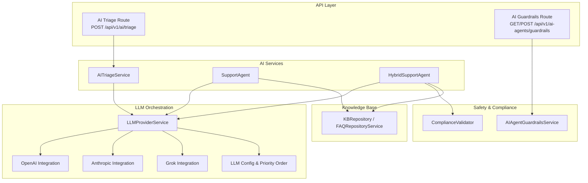
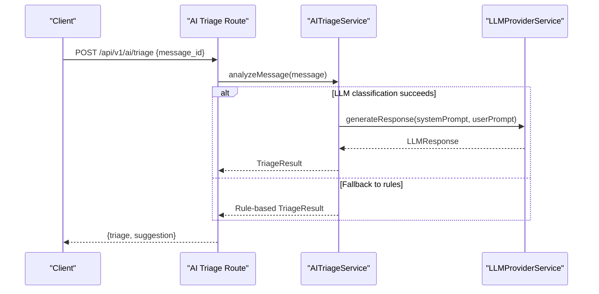
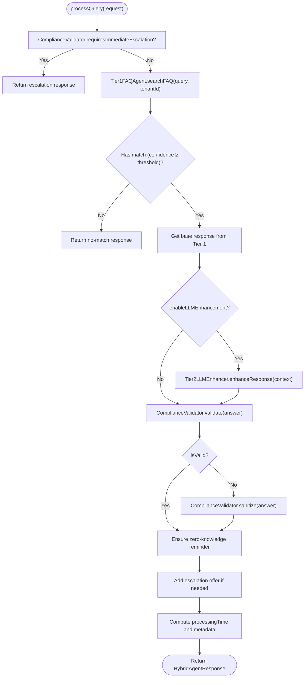
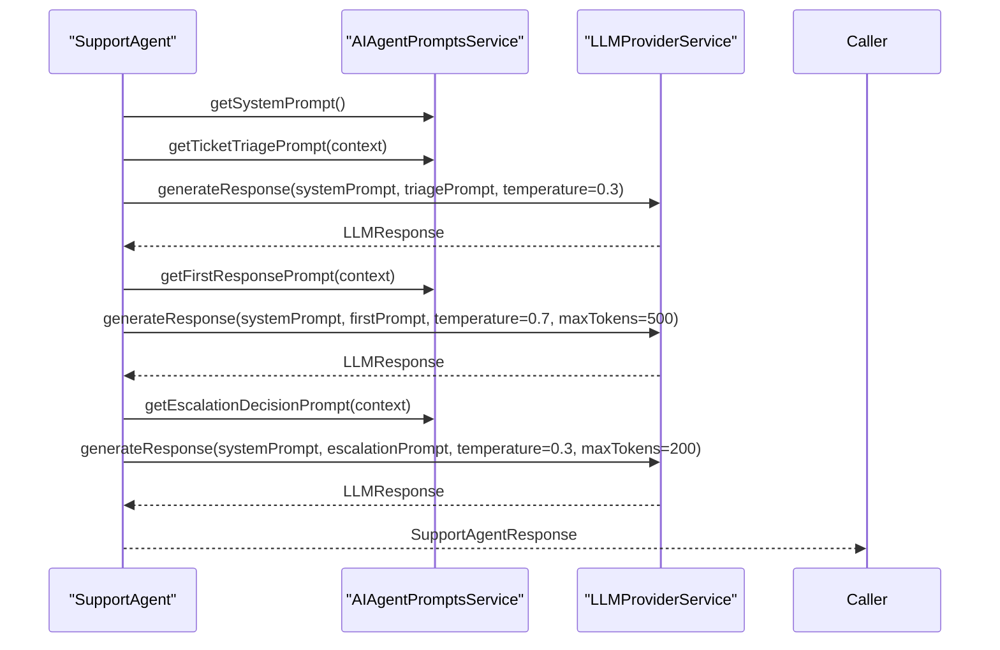
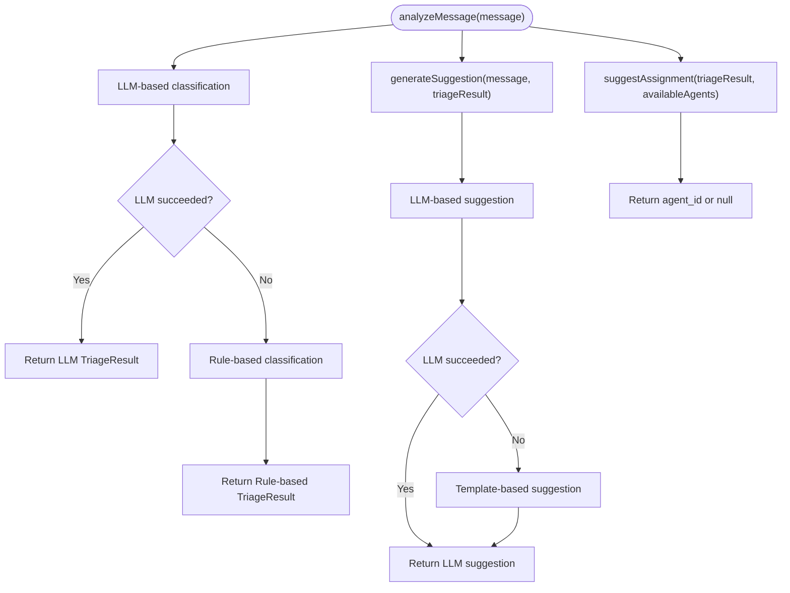
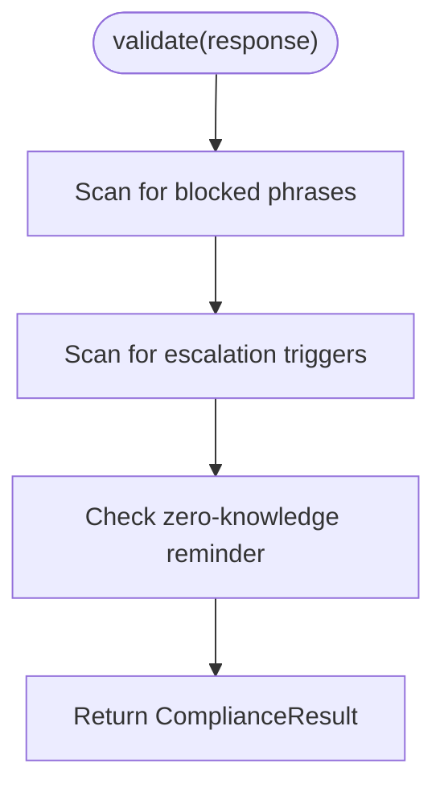
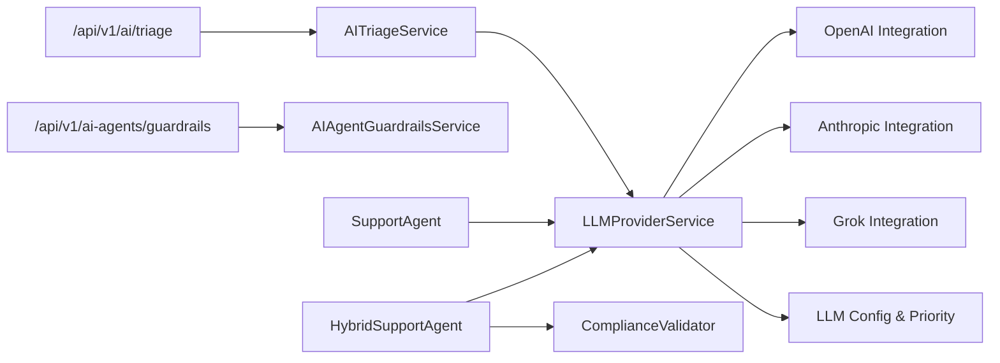

# AI Agent System

<cite>
**Referenced Files in This Document**
- [hybrid-support-agent.ts](file://lib/ai/hybrid-support-agent.ts)
- [support-agent.ts](file://lib/ai/support-agent.ts)
- [tier1-faq-agent.ts](file://lib/ai/tier1-faq-agent.ts)
- [tier2-llm-enhancer.ts](file://lib/ai/tier2-llm-enhancer.ts)
- [ai-triage.ts](file://lib/services/ai-triage.ts)
- [llm-provider.ts](file://lib/services/llm-provider.ts)
- [compliance-validator.ts](file://lib/middleware/compliance-validator.ts)
- [ai-agent-guardrails.ts](file://lib/services/ai-agent-guardrails.ts)
- [route.ts (AI triage)](file://app/api/v1/ai/triage/route.ts)
- [route.ts (AI agent guardrails)](file://app/api/v1/ai-agents/guardrails/route.ts)
- [openai.ts](file://lib/integrations/openai.ts)
- [anthropic.ts](file://lib/integrations/anthropic.ts)
- [grok.ts](file://lib/integrations/grok.ts)
- [llm-config.ts](file://lib/config/llm-config.ts)
</cite>

## Table of Contents
1. [Introduction](#introduction)
2. [Project Structure](#project-structure)
3. [Core Components](#core-components)
4. [Architecture Overview](#architecture-overview)
5. [Detailed Component Analysis](#detailed-component-analysis)
6. [Dependency Analysis](#dependency-analysis)
7. [Performance Considerations](#performance-considerations)
8. [Troubleshooting Guide](#troubleshooting-guide)
9. [Conclusion](#conclusion)
10. [Appendices](#appendices)

## Introduction
This document describes the AI agent system that powers intelligent customer support. It covers the multi-provider Large Language Model (LLM) architecture supporting Claude, OpenAI, and Grok; the AI triage algorithms; hybrid support capabilities combining rule-based FAQ matching with LLM enhancement; prompt engineering and response generation workflows; context management; guardrails and safety mechanisms; configuration options for providers; performance optimization and cost management strategies; and practical guidance for customization, adding new providers, and monitoring performance.

## Project Structure
The AI system is organized around:
- AI orchestration and hybrid support agents
- LLM provider abstraction and multi-provider routing
- Safety and compliance middleware
- Guardrails configuration and enforcement
- Triage and suggestion services
- API endpoints exposing AI capabilities



**Diagram sources**
- [route.ts (AI triage)](file://app/api/v1/ai/triage/route.ts#L1-L45)
- [route.ts (AI agent guardrails)](file://app/api/v1/ai-agents/guardrails/route.ts#L1-L43)
- [ai-triage.ts](file://lib/services/ai-triage.ts#L1-L402)
- [support-agent.ts](file://lib/ai/support-agent.ts#L1-L241)
- [hybrid-support-agent.ts](file://lib/ai/hybrid-support-agent.ts#L1-L208)
- [llm-provider.ts](file://lib/services/llm-provider.ts#L1-L214)
- [openai.ts](file://lib/integrations/openai.ts)
- [anthropic.ts](file://lib/integrations/anthropic.ts)
- [grok.ts](file://lib/integrations/grok.ts)
- [llm-config.ts](file://lib/config/llm-config.ts)
- [ai-agent-guardrails.ts](file://lib/services/ai-agent-guardrails.ts#L1-L211)
- [compliance-validator.ts](file://lib/middleware/compliance-validator.ts#L1-L156)

**Section sources**
- [route.ts (AI triage)](file://app/api/v1/ai/triage/route.ts#L1-L45)
- [route.ts (AI agent guardrails)](file://app/api/v1/ai-agents/guardrails/route.ts#L1-L43)
- [ai-triage.ts](file://lib/services/ai-triage.ts#L1-L402)
- [support-agent.ts](file://lib/ai/support-agent.ts#L1-L241)
- [hybrid-support-agent.ts](file://lib/ai/hybrid-support-agent.ts#L1-L208)
- [llm-provider.ts](file://lib/services/llm-provider.ts#L1-L214)
- [openai.ts](file://lib/integrations/openai.ts)
- [anthropic.ts](file://lib/integrations/anthropic.ts)
- [grok.ts](file://lib/integrations/grok.ts)
- [llm-config.ts](file://lib/config/llm-config.ts)
- [ai-agent-guardrails.ts](file://lib/services/ai-agent-guardrails.ts#L1-L211)
- [compliance-validator.ts](file://lib/middleware/compliance-validator.ts#L1-L156)

## Core Components
- HybridSupportAgent: Orchestrates Tier 1 FAQ matching followed by optional Tier 2 LLM enhancement, compliance validation, and structured output formatting.
- SupportAgent: AI agent for ticket triage, first response generation, escalation decisions, and follow-ups.
- AITriageService: Classifies incoming messages, detects sentiment and intent, generates suggestions, and suggests assignments.
- LLMProviderService: Abstraction over multiple LLM providers with priority-based selection and automatic fallback.
- ComplianceValidator: Enforces zero-knowledge, no legal advice, and no unsupported promise policies; escalates sensitive topics.
- AIAgentGuardrailsService: Defines what agents can/cannot do, escalation criteria, tone guidelines, and authorized actions.
- Knowledge Base Access: Tier 1 FAQ agent searches KB articles and FAQs; SupportAgent integrates with KB for references.

**Section sources**
- [hybrid-support-agent.ts](file://lib/ai/hybrid-support-agent.ts#L1-L208)
- [support-agent.ts](file://lib/ai/support-agent.ts#L1-L241)
- [ai-triage.ts](file://lib/services/ai-triage.ts#L1-L402)
- [llm-provider.ts](file://lib/services/llm-provider.ts#L1-L214)
- [compliance-validator.ts](file://lib/middleware/compliance-validator.ts#L1-L156)
- [ai-agent-guardrails.ts](file://lib/services/ai-agent-guardrails.ts#L1-L211)
- [tier1-faq-agent.ts](file://lib/ai/tier1-faq-agent.ts#L1-L222)

## Architecture Overview
The system implements a hybrid-first approach:
- Tier 1 (deterministic): FAQ matching with confidence thresholds.
- Tier 2 (optional): LLM enhancement with strict guardrails and structured output.
- Safety: Compliance validation and escalation triggers.
- Providers: Multi-provider LLM routing with priority order and fallbacks.
- Triage: AI-driven classification, sentiment, intent, and assignment suggestions.



**Diagram sources**
- [route.ts (AI triage)](file://app/api/v1/ai/triage/route.ts#L1-L45)
- [ai-triage.ts](file://lib/services/ai-triage.ts#L1-L402)
- [llm-provider.ts](file://lib/services/llm-provider.ts#L1-L214)

## Detailed Component Analysis

### Hybrid Support Agent
The HybridSupportAgent coordinates:
- Immediate escalation checks
- Tier 1 FAQ search and base response retrieval
- Optional Tier 2 LLM enhancement with guardrails
- Compliance validation and sanitization
- Structured output and metadata



**Diagram sources**
- [hybrid-support-agent.ts](file://lib/ai/hybrid-support-agent.ts#L1-L208)
- [tier1-faq-agent.ts](file://lib/ai/tier1-faq-agent.ts#L1-L222)
- [tier2-llm-enhancer.ts](file://lib/ai/tier2-llm-enhancer.ts#L1-L263)
- [compliance-validator.ts](file://lib/middleware/compliance-validator.ts#L1-L156)

**Section sources**
- [hybrid-support-agent.ts](file://lib/ai/hybrid-support-agent.ts#L1-L208)
- [tier1-faq-agent.ts](file://lib/ai/tier1-faq-agent.ts#L1-L222)
- [tier2-llm-enhancer.ts](file://lib/ai/tier2-llm-enhancer.ts#L1-L263)
- [compliance-validator.ts](file://lib/middleware/compliance-validator.ts#L1-L156)

### Support Agent
The SupportAgent provides:
- Ticket analysis with category, priority, complexity, and reasoning
- First response generation with suggested actions and KB references
- Issue-specific response generation (password reset, service status, feature request, billing)
- Follow-up response generation
- Escalation message generation with reasoning



**Diagram sources**
- [support-agent.ts](file://lib/ai/support-agent.ts#L1-L241)
- [llm-provider.ts](file://lib/services/llm-provider.ts#L1-L214)

**Section sources**
- [support-agent.ts](file://lib/ai/support-agent.ts#L1-L241)

### AI Triage Service
The AITriageService:
- Attempts LLM-based classification and sentiment analysis
- Falls back to rule-based classification if LLM fails
- Generates AI suggestions with confidence and reasoning
- Suggests assignments based on triage outcome



**Diagram sources**
- [ai-triage.ts](file://lib/services/ai-triage.ts#L1-L402)

**Section sources**
- [ai-triage.ts](file://lib/services/ai-triage.ts#L1-L402)

### LLM Provider Service and Multi-Provider Architecture
The LLMProviderService:
- Respects configured provider priority order
- Supports preferred provider override with fallbacks
- Detects available providers via environment variables
- Routes requests to Anthropic, OpenAI, or Grok clients
- Returns standardized LLMResponse with provider and usage metrics

```mermaid
classDiagram
class LLMProviderService {
+generateResponse(options) LLMResponse
-generateWithProvider(provider, options) LLMResponse
-getProviderOrder(preferred, fallbacks) LLMProvider[]
+getAvailableProviders() LLMProvider[]
+getDefaultProvider() LLMProvider|null
+getConfiguredProviderOrder() LLMProvider[]
}
class LLMProvider {
<<enumeration>>
"anthropic"
"openai"
"grok"
}
class OpenAIIntegration {
+generateResponse(opts) OpenAIResponse
}
class AnthropicIntegration {
+generateResponse(opts) ClaudeResponse
}
class GrokIntegration {
+generateResponse(opts) GrokResponse
}
LLMProviderService --> OpenAIIntegration : "uses"
LLMProviderService --> AnthropicIntegration : "uses"
LLMProviderService --> GrokIntegration : "uses"
LLMProviderService --> LLMProvider : "prioritizes"
```

**Diagram sources**
- [llm-provider.ts](file://lib/services/llm-provider.ts#L1-L214)
- [openai.ts](file://lib/integrations/openai.ts)
- [anthropic.ts](file://lib/integrations/anthropic.ts)
- [grok.ts](file://lib/integrations/grok.ts)
- [llm-config.ts](file://lib/config/llm-config.ts)

**Section sources**
- [llm-provider.ts](file://lib/services/llm-provider.ts#L1-L214)

### Compliance and Guardrails
- ComplianceValidator enforces zero-knowledge, prohibits legal advice and unsupported promises, escalates sensitive topics, and sanitizes unsafe content.
- AIAgentGuardrailsService defines what agents can and cannot do, escalation criteria, tone guidelines, and authorized actions.



**Diagram sources**
- [compliance-validator.ts](file://lib/middleware/compliance-validator.ts#L1-L156)
- [ai-agent-guardrails.ts](file://lib/services/ai-agent-guardrails.ts#L1-L211)

**Section sources**
- [compliance-validator.ts](file://lib/middleware/compliance-validator.ts#L1-L156)
- [ai-agent-guardrails.ts](file://lib/services/ai-agent-guardrails.ts#L1-L211)

## Dependency Analysis
- API routes depend on service-layer components for triage and guardrails.
- AI agents depend on LLMProviderService for provider-agnostic LLM calls.
- Hybrid agent depends on Tier 1 FAQ agent, Tier 2 enhancer, and compliance validator.
- LLMProviderService depends on integrations and configuration for provider selection and defaults.



**Diagram sources**
- [route.ts (AI triage)](file://app/api/v1/ai/triage/route.ts#L1-L45)
- [route.ts (AI agent guardrails)](file://app/api/v1/ai-agents/guardrails/route.ts#L1-L43)
- [ai-triage.ts](file://lib/services/ai-triage.ts#L1-L402)
- [support-agent.ts](file://lib/ai/support-agent.ts#L1-L241)
- [hybrid-support-agent.ts](file://lib/ai/hybrid-support-agent.ts#L1-L208)
- [llm-provider.ts](file://lib/services/llm-provider.ts#L1-L214)
- [openai.ts](file://lib/integrations/openai.ts)
- [anthropic.ts](file://lib/integrations/anthropic.ts)
- [grok.ts](file://lib/integrations/grok.ts)
- [llm-config.ts](file://lib/config/llm-config.ts)

**Section sources**
- [route.ts (AI triage)](file://app/api/v1/ai/triage/route.ts#L1-L45)
- [route.ts (AI agent guardrails)](file://app/api/v1/ai-agents/guardrails/route.ts#L1-L43)
- [ai-triage.ts](file://lib/services/ai-triage.ts#L1-L402)
- [support-agent.ts](file://lib/ai/support-agent.ts#L1-L241)
- [hybrid-support-agent.ts](file://lib/ai/hybrid-support-agent.ts#L1-L208)
- [llm-provider.ts](file://lib/services/llm-provider.ts#L1-L214)

## Performance Considerations
- Provider priority and fallback reduce single-point-of-failure and latency spikes.
- Lower temperature (0.3) for analysis and compliance-sensitive tasks improves determinism.
- Structured JSON prompts improve parsing reliability and reduce retries.
- Confidence thresholds in Tier 1 prevent unnecessary LLM calls.
- Token limits and max response lengths constrain costs and latency.
- Parallel KB searches and deterministic matching minimize LLM usage for common queries.

[No sources needed since this section provides general guidance]

## Troubleshooting Guide
- All providers failed: Verify API keys and provider availability; check configured priority order.
- LLM suggestions fail: Confirm JSON parsing expectations and trim non-JSON prefixes.
- Compliance violations: Review blocked phrases and escalation triggers; ensure zero-knowledge reminder presence.
- Guardrails misconfiguration: Validate authorized actions and escalation criteria.
- Hybrid agent timeouts: Disable LLM enhancement temporarily or adjust token limits.

**Section sources**
- [llm-provider.ts](file://lib/services/llm-provider.ts#L1-L214)
- [ai-triage.ts](file://lib/services/ai-triage.ts#L1-L402)
- [compliance-validator.ts](file://lib/middleware/compliance-validator.ts#L1-L156)
- [ai-agent-guardrails.ts](file://lib/services/ai-agent-guardrails.ts#L1-L211)
- [hybrid-support-agent.ts](file://lib/ai/hybrid-support-agent.ts#L1-L208)

## Conclusion
The AI agent system combines deterministic Tier 1 FAQ matching with optional LLM enhancement, strict compliance and guardrails, and multi-provider LLM routing. This hybrid architecture balances speed, accuracy, and safety, enabling scalable, Bar-compliant, and empathetic customer support.

[No sources needed since this section summarizes without analyzing specific files]

## Appendices

### Configuration Options for AI Providers
- Environment variables:
  - ANTHROPIC_API_KEY
  - OPENAI_API_KEY
  - GROK_API_KEY
- Provider priority order and defaults are loaded from configuration.

**Section sources**
- [llm-provider.ts](file://lib/services/llm-provider.ts#L1-L214)
- [llm-config.ts](file://lib/config/llm-config.ts)

### Prompt Engineering and Response Generation Workflows
- System prompts define role, compliance requirements, and response style.
- User prompts include structured JSON instructions and examples.
- Tier 2 enhancer adds escalation offers and structured elements (steps, links, next steps).

**Section sources**
- [tier2-llm-enhancer.ts](file://lib/ai/tier2-llm-enhancer.ts#L1-L263)
- [support-agent.ts](file://lib/ai/support-agent.ts#L1-L241)

### Context Management Systems
- Hybrid agent supports customer context and conversation history.
- Support agent integrates KB articles and relevant context for suggestions.

**Section sources**
- [hybrid-support-agent.ts](file://lib/ai/hybrid-support-agent.ts#L1-L208)
- [support-agent.ts](file://lib/ai/support-agent.ts#L1-L241)

### Guardrails and Safety Mechanisms
- ComplianceValidator blocks phrases and escalates sensitive topics.
- AIAgentGuardrailsService defines authorized actions, restricted topics, and escalation criteria.

**Section sources**
- [compliance-validator.ts](file://lib/middleware/compliance-validator.ts#L1-L156)
- [ai-agent-guardrails.ts](file://lib/services/ai-agent-guardrails.ts#L1-L211)

### Cost Management Strategies
- Prefer Tier 1 FAQ matches to avoid LLM calls.
- Use lower temperatures and token limits for deterministic tasks.
- Monitor provider usage and adjust priority order to balance cost and latency.

**Section sources**
- [llm-provider.ts](file://lib/services/llm-provider.ts#L1-L214)

### Implementation Examples
- Customizing AI behavior:
  - Adjust system prompts and tone guidelines in guardrails.
  - Modify confidence thresholds in Tier 1 FAQ matching.
- Integrating new LLM providers:
  - Add a new client module exporting generateResponse.
  - Extend LLMProviderService to route to the new provider.
  - Update provider availability checks and configuration.
- Extending AI capabilities:
  - Add new triage categories and escalation criteria.
  - Introduce new prompt templates and suggestion strategies.

**Section sources**
- [llm-provider.ts](file://lib/services/llm-provider.ts#L1-L214)
- [openai.ts](file://lib/integrations/openai.ts)
- [anthropic.ts](file://lib/integrations/anthropic.ts)
- [grok.ts](file://lib/integrations/grok.ts)
- [llm-config.ts](file://lib/config/llm-config.ts)
- [ai-agent-guardrails.ts](file://lib/services/ai-agent-guardrails.ts#L1-L211)