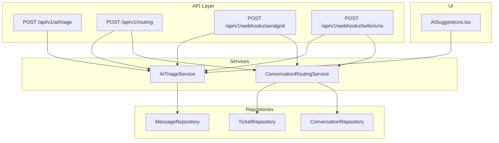
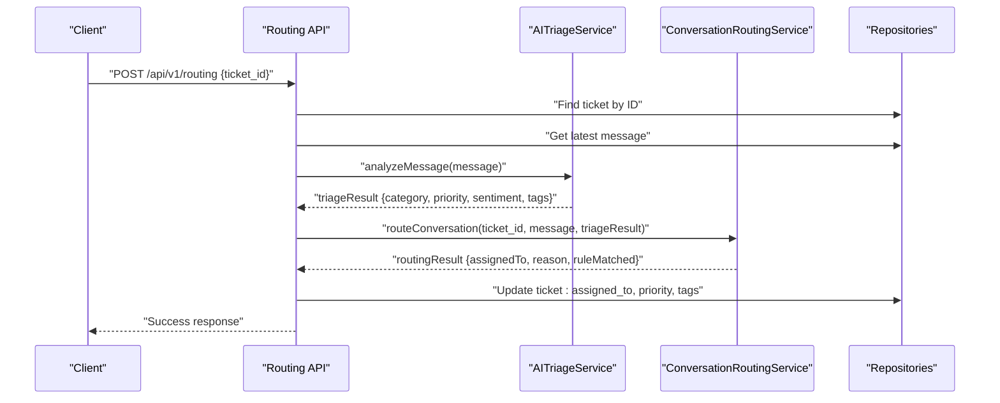
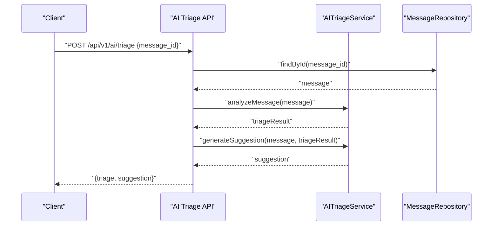
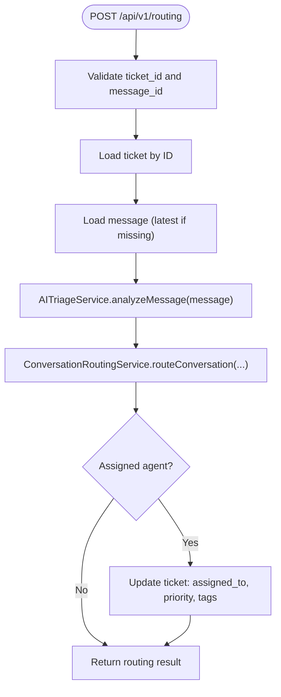
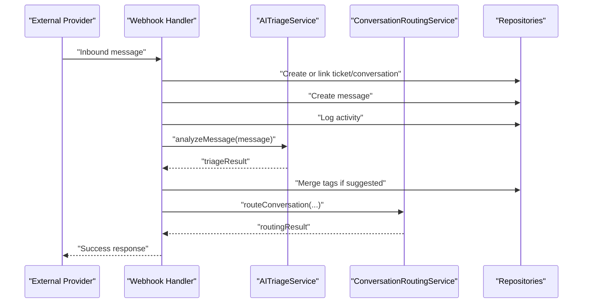
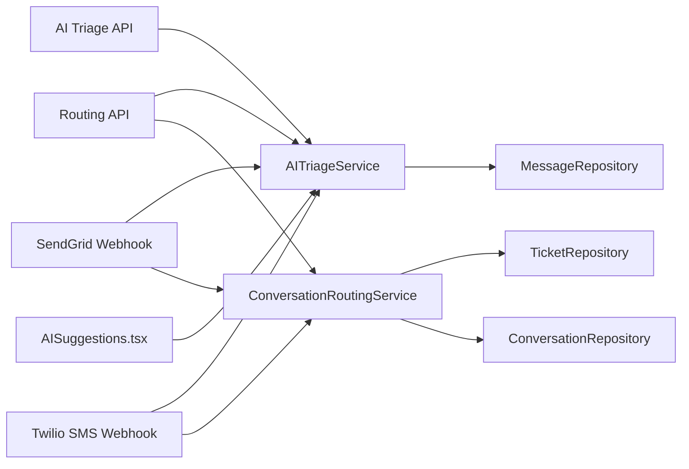

# AI Triage & Routing Algorithms

<cite>
**Referenced Files in This Document**
- [route.ts](file://app/api/v1/ai/triage/route.ts)
- [route.ts](file://app/api/v1/routing/route.ts)
- [route.ts](file://app/api/v1/webhooks/sendgrid/route.ts)
- [route.ts](file://app/api/v1/webhooks/twilio/sms/route.ts)
- [AISuggestions.tsx](file://components/inbox/AISuggestions.tsx)
- [014_trend_analysis.sql](file://database/migrations/014_trend_analysis.sql)
- [AI_TRIAGE_ROUTING_COMPLETE.md](file://docs/setup/AI_TRIAGE_ROUTING_COMPLETE.md)
- [CS_SUPPORT_SERVICE_PRD.md](file://docs/CS_SUPPORT_SERVICE_PRD.md)
- [VOICE_ORCHESTRATION_ARCHITECTURE.md](file://docs/VOICE_ORCHESTRATION_ARCHITECTURE.md)
- [001_initial_schema.sql](file://database/migrations/001_initial_schema.sql)
- [005_additional_triggers.sql](file://database/migrations/005_additional_triggers.sql)
- [029_ai_agent_guardrails.sql](file://database/migrations/029_ai_agent_guardrails.sql)
- [seed_support_faqs.sql](file://database/seed_support_faqs.sql)
- [seed_communication_templates.sql](file://database/seed_communication_templates.sql)
- [page.tsx](file://app/(dashboard)/settings/ai-agents/page.tsx)
- [route.ts](file://app/api/v1/support/create-case/route.ts)
- [CustomerSupportChat.tsx](file://components/support/CustomerSupportChat.tsx)
- [route.ts](file://app/api/v1/ai/support/respond/route.ts)
- [COMPETITIVE_GAP_ANALYSIS.md](file://docs/COMPETITIVE_GAP_ANALYSIS.md)
</cite>

## Table of Contents
1. [Introduction](#introduction)
2. [Project Structure](#project-structure)
3. [Core Components](#core-components)
4. [Architecture Overview](#architecture-overview)
5. [Detailed Component Analysis](#detailed-component-analysis)
6. [Dependency Analysis](#dependency-analysis)
7. [Performance Considerations](#performance-considerations)
8. [Troubleshooting Guide](#troubleshooting-guide)
9. [Conclusion](#conclusion)
10. [Appendices](#appendices)

## Introduction
This document explains the AI-powered triage and routing system that classifies cases, assigns priorities, and intelligently routes conversations to the right agent. It documents the triage decision logic, priority assignment, routing rules, escalation criteria, and sentiment scoring. It also covers customization of triage rules, adding new classification models, and operational improvements such as accuracy monitoring, bias detection, and continuous learning.

## Project Structure
The triage and routing pipeline spans API endpoints, services, repositories, and UI components:
- API endpoints orchestrate triage and routing decisions for webhooks and manual requests.
- Services encapsulate AI-driven triage and conversation routing logic.
- Repositories manage persistence for tickets, messages, and conversations.
- UI components surface triage insights like sentiment and suggestions.

**Diagram sources**
- [route.ts](file://app/api/v1/ai/triage/route.ts#L1-L45)
- [route.ts](file://app/api/v1/routing/route.ts#L1-L82)
- [route.ts](file://app/api/v1/webhooks/sendgrid/route.ts#L1-L188)
- [route.ts](file://app/api/v1/webhooks/twilio/sms/route.ts#L1-L173)

**Section sources**
- [route.ts](file://app/api/v1/ai/triage/route.ts#L1-L45)
- [route.ts](file://app/api/v1/routing/route.ts#L1-L82)
- [route.ts](file://app/api/v1/webhooks/sendgrid/route.ts#L1-L188)
- [route.ts](file://app/api/v1/webhooks/twilio/sms/route.ts#L1-L173)

## Core Components
- AI triage endpoint: Validates input, fetches a message, runs triage, and optionally generates suggestions.
- Routing endpoint: Performs triage and applies routing rules, auto-assigning agents and updating tags/priority.
- Webhook handlers: Process inbound emails/SMS, create tickets/conversations, and asynchronously triage and route.
- UI triage display: Renders triage sentiment and suggestions in the inbox.
- Sentiment and trend schema: Defines sentiment storage and scoring for analytics.

Key capabilities:
- Case classification and priority assignment via AI.
- Intelligent routing to agents based on rules and availability.
- Automatic tag application and priority updates.
- Async triage in webhooks to avoid latency.
- Sentiment scoring and tagging for trend analysis.

**Section sources**
- [route.ts](file://app/api/v1/ai/triage/route.ts#L12-L44)
- [route.ts](file://app/api/v1/routing/route.ts#L15-L81)
- [route.ts](file://app/api/v1/webhooks/sendgrid/route.ts#L147-L172)
- [route.ts](file://app/api/v1/webhooks/twilio/sms/route.ts#L133-L158)
- [AISuggestions.tsx](file://components/inbox/AISuggestions.tsx#L17-L120)
- [014_trend_analysis.sql](file://database/migrations/014_trend_analysis.sql#L11-L67)

## Architecture Overview
The triage and routing system follows a layered architecture:
- API endpoints validate requests and delegate to services.
- Services coordinate repositories to fetch and persist data.
- AI triage returns category, priority, sentiment, and suggested tags.
- Routing resolves an agent assignment and updates the ticket accordingly.
- Webhooks integrate external channels and trigger triage asynchronously.

**Diagram sources**
- [route.ts](file://app/api/v1/routing/route.ts#L19-L81)

**Section sources**
- [route.ts](file://app/api/v1/routing/route.ts#L15-L81)

## Detailed Component Analysis

### AI Triage Endpoint
Responsibilities:
- Validate request payload.
- Fetch message by ID.
- Run triage to compute category, priority, sentiment, and suggested tags.
- Optionally generate suggestions for next actions.

Decision flow:
- Input validation ensures a valid message UUID.
- Message retrieval failure returns a 404.
- Triage computation delegates to AITriageService.
- Suggestions generation uses triage results.

**Diagram sources**
- [route.ts](file://app/api/v1/ai/triage/route.ts#L16-L44)

**Section sources**
- [route.ts](file://app/api/v1/ai/triage/route.ts#L8-L44)

### Routing Endpoint
Responsibilities:
- Validate ticket ID and optional message ID.
- Resolve the message to analyze (latest if none provided).
- Compute triage and apply routing rules.
- Auto-assign agent, update priority, and merge suggested tags.

**Diagram sources**
- [route.ts](file://app/api/v1/routing/route.ts#L19-L81)

**Section sources**
- [route.ts](file://app/api/v1/routing/route.ts#L10-L81)

### Webhook Handlers (Email and SMS)
Responsibilities:
- Parse inbound messages from external providers.
- Create or link tickets and conversations.
- Persist messages and log activities.
- Asynchronously triage and route to avoid webhook latency.

Email webhook highlights:
- Thread emails to existing tickets or create new ones.
- Auto-assign on new conversations.
- Tag merging and async routing gated by environment flag.

SMS webhook highlights:
- Thread SMS to tickets and create unified messages.
- Persist message metadata and link across channels.
- Async triage and routing.

**Diagram sources**
- [route.ts](file://app/api/v1/webhooks/sendgrid/route.ts#L19-L188)
- [route.ts](file://app/api/v1/webhooks/twilio/sms/route.ts#L25-L173)

**Section sources**
- [route.ts](file://app/api/v1/webhooks/sendgrid/route.ts#L147-L172)
- [route.ts](file://app/api/v1/webhooks/twilio/sms/route.ts#L133-L158)

### UI Triage Display
The inbox component renders triage sentiment and suggestions for visibility and agent assistance.

Highlights:
- Displays sentiment label from triage results.
- Integrates with triage APIs to show actionable suggestions.

**Section sources**
- [AISuggestions.tsx](file://components/inbox/AISuggestions.tsx#L17-L120)

### Sentiment Scoring and Trending
The system stores sentiment labels and scores for trend analysis and reporting.

Schema highlights:
- Sentiment label with allowed values.
- Numeric sentiment score scale suitable for analytics.
- Trend type classification supports sentiment-based insights.

**Section sources**
- [014_trend_analysis.sql](file://database/migrations/014_trend_analysis.sql#L11-L67)

### Escalation Criteria and Guardrails
Escalation logic is configurable via admin settings and stored in the database schema for guardrails.

Highlights:
- Admin UI allows configuring escalation criteria per AI agent.
- Database migration defines escalation criteria arrays.
- Support case creation endpoint enables human escalation.
- Chat UI provides escalation triggers and case creation.

**Section sources**
- [page.tsx](file://app/(dashboard)/settings/ai-agents/page.tsx#L24-L287)
- [029_ai_agent_guardrails.sql](file://database/migrations/029_ai_agent_guardrails.sql#L75-L75)
- [route.ts](file://app/api/v1/support/create-case/route.ts#L1-L10)
- [CustomerSupportChat.tsx](file://components/support/CustomerSupportChat.tsx#L9-L212)
- [route.ts](file://app/api/v1/ai/support/respond/route.ts#L94-L94)

## Dependency Analysis
The triage and routing system exhibits clear separation of concerns:
- API endpoints depend on services and repositories.
- Services encapsulate business logic and coordinate repositories.
- UI components depend on services for rendering triage insights.

**Diagram sources**
- [route.ts](file://app/api/v1/ai/triage/route.ts#L1-L45)
- [route.ts](file://app/api/v1/routing/route.ts#L1-L82)
- [route.ts](file://app/api/v1/webhooks/sendgrid/route.ts#L1-L188)
- [route.ts](file://app/api/v1/webhooks/twilio/sms/route.ts#L1-L173)

**Section sources**
- [route.ts](file://app/api/v1/ai/triage/route.ts#L1-L45)
- [route.ts](file://app/api/v1/routing/route.ts#L1-L82)
- [route.ts](file://app/api/v1/webhooks/sendgrid/route.ts#L1-L188)
- [route.ts](file://app/api/v1/webhooks/twilio/sms/route.ts#L1-L173)

## Performance Considerations
- Asynchronous triage in webhooks prevents blocking inbound processing.
- Environment flags gate auto-routing to reduce load when needed.
- Deduplication of suggested tags avoids redundant updates.
- UI rendering relies on triage results to minimize repeated computations.

Recommendations:
- Cache frequently accessed triage models and routing rules.
- Batch webhook processing for high-volume channels.
- Monitor latency of triage and routing services and alert on regressions.

[No sources needed since this section provides general guidance]

## Troubleshooting Guide
Common issues and resolutions:
- Message not found: Ensure message_id exists and belongs to the ticket.
- Ticket not found: Verify ticket_id validity and ownership.
- Triaging failures: Webhooks catch and log triage errors without failing the webhook.
- Auto-routing disabled: Confirm environment variable enabling auto-routing.

Operational checks:
- Verify webhook signatures and payload parsing.
- Confirm repository connectivity and transaction rollbacks on errors.
- Review UI triage rendering for missing sentiment or suggestions.

**Section sources**
- [route.ts](file://app/api/v1/ai/triage/route.ts#L25-L29)
- [route.ts](file://app/api/v1/routing/route.ts#L29-L45)
- [route.ts](file://app/api/v1/webhooks/sendgrid/route.ts#L168-L172)
- [route.ts](file://app/api/v1/webhooks/twilio/sms/route.ts#L155-L158)

## Conclusion
The triage and routing system integrates AI-driven classification, priority assignment, and intelligent routing across multiple channels. Its modular design, asynchronous webhook handling, and configurable escalation criteria enable scalable, reliable, and maintainable customer support automation. Continuous monitoring, bias detection, and iterative model improvements ensure sustained accuracy and fairness.

[No sources needed since this section summarizes without analyzing specific files]

## Appendices

### A. Customizing Triage Rules
- Modify routing rules via the admin interface to align with team expertise and workload.
- Configure escalation criteria to ensure sensitive or complex cases reach human agents promptly.
- Use suggested tags to enrich ticket metadata for better searchability and reporting.

**Section sources**
- [page.tsx](file://app/(dashboard)/settings/ai-agents/page.tsx#L114-L287)
- [029_ai_agent_guardrails.sql](file://database/migrations/029_ai_agent_guardrails.sql#L75-L75)

### B. Implementing New Classification Models
- Extend AITriageService to incorporate new models while preserving the existing interface.
- Store model outputs consistently (category, priority, sentiment, tags) for downstream routing.
- Add schema fields for new metrics (e.g., confidence scores) and update UI to reflect them.

**Section sources**
- [route.ts](file://app/api/v1/ai/triage/route.ts#L31-L35)
- [AISuggestions.tsx](file://components/inbox/AISuggestions.tsx#L17-L120)

### C. Optimizing Routing Performance
- Enable auto-routing conditionally based on system load.
- Pre-warm routing rule caches and agent availability checks.
- Monitor routing latency and adjust thresholds for rule evaluation.

**Section sources**
- [route.ts](file://app/api/v1/webhooks/sendgrid/route.ts#L162-L168)
- [route.ts](file://app/api/v1/webhooks/twilio/sms/route.ts#L147-L154)

### D. Monitoring Accuracy and Bias
- Track triage accuracy via manual audits and compare predicted vs. ground truth categories/priorities.
- Monitor sentiment distribution and detect shifts indicating potential bias.
- Use trend analysis to observe sentiment and category drift over time.

**Section sources**
- [014_trend_analysis.sql](file://database/migrations/014_trend_analysis.sql#L11-L67)
- [COMPETITIVE_GAP_ANALYSIS.md](file://docs/COMPETITIVE_GAP_ANALYSIS.md#L220-L220)
- [COMPETITIVE_GAP_ANALYSIS.md](file://docs/COMPETITIVE_GAP_ANALYSIS.md#L360-L360)

### E. Escalation Workflows
- Configure escalation criteria in the admin UI and persist them in the database.
- Create support cases programmatically when escalation triggers fire.
- Surface escalation options in chat UI for customer-initiated escalations.

**Section sources**
- [page.tsx](file://app/(dashboard)/settings/ai-agents/page.tsx#L24-L287)
- [route.ts](file://app/api/v1/support/create-case/route.ts#L1-L10)
- [CustomerSupportChat.tsx](file://components/support/CustomerSupportChat.tsx#L341-L341)

### F. Historical and Operational References
- Initial schema and escalation event types define operational triggers.
- Voice orchestration documentation includes sentiment scoring for call intelligence.

**Section sources**
- [001_initial_schema.sql](file://database/migrations/001_initial_schema.sql#L145-L145)
- [005_additional_triggers.sql](file://database/migrations/005_additional_triggers.sql#L561-L574)
- [VOICE_ORCHESTRATION_ARCHITECTURE.md](file://docs/VOICE_ORCHESTRATION_ARCHITECTURE.md#L55-L55)
- [VOICE_ORCHESTRATION_ARCHITECTURE.md](file://docs/VOICE_ORCHESTRATION_ARCHITECTURE.md#L88-L88)
- [VOICE_ORCHESTRATION_ARCHITECTURE.md](file://docs/VOICE_ORCHESTRATION_ARCHITECTURE.md#L124-L124)
- [VOICE_ORCHESTRATION_ARCHITECTURE.md](file://docs/VOICE_ORCHESTRATION_ARCHITECTURE.md#L141-L141)