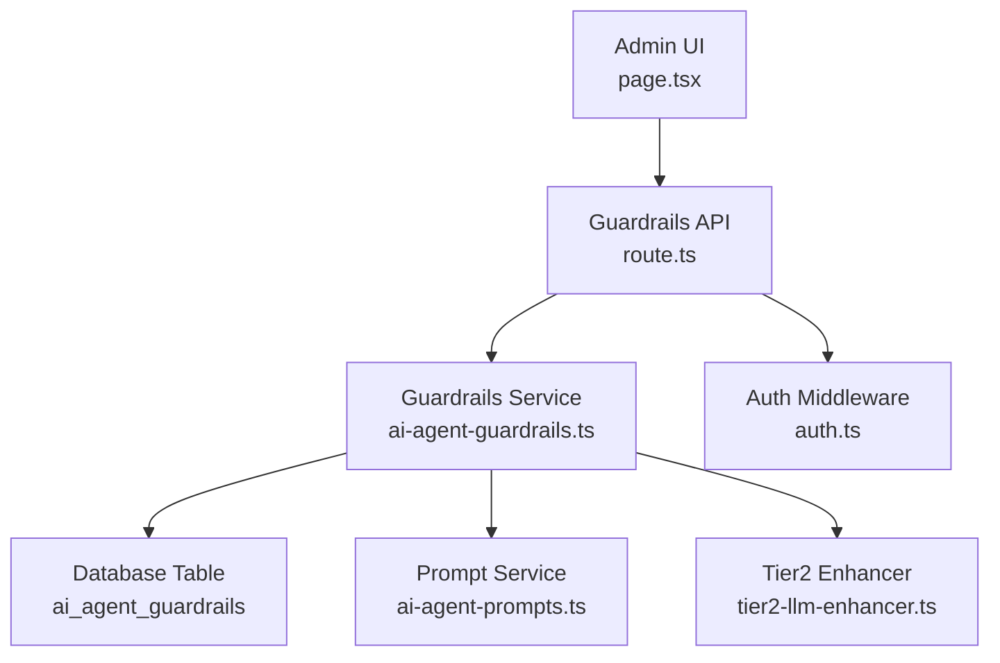
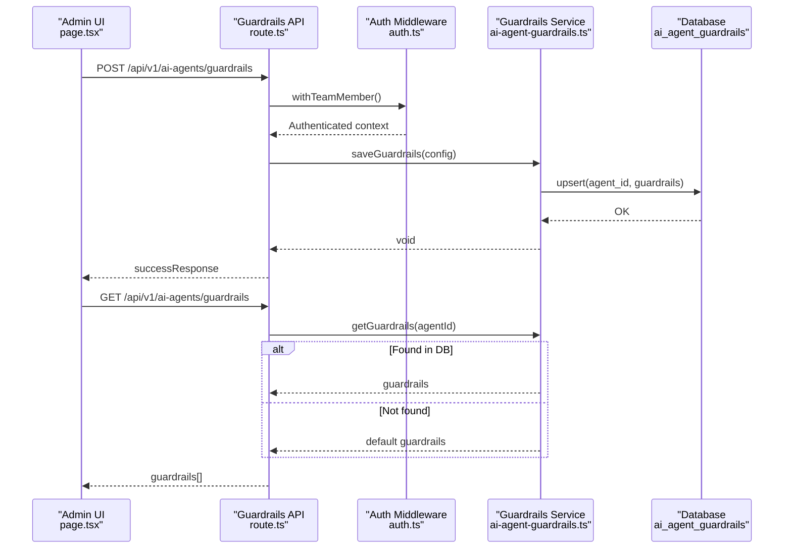
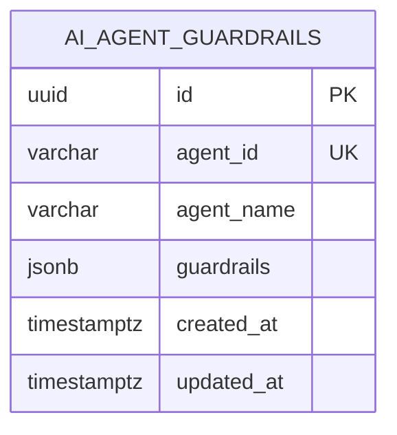
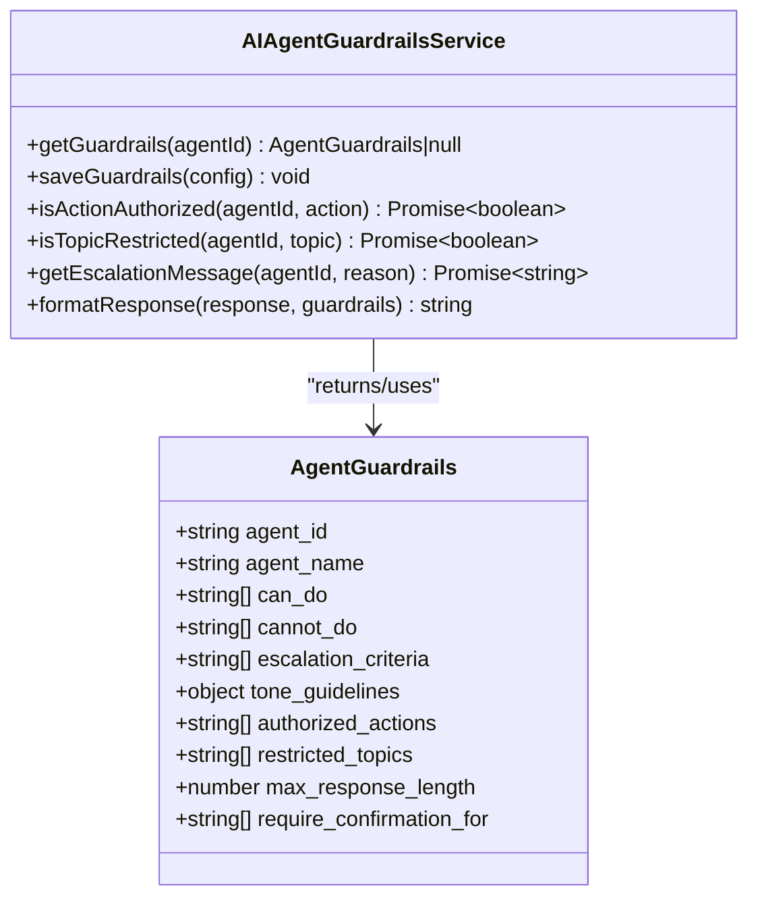
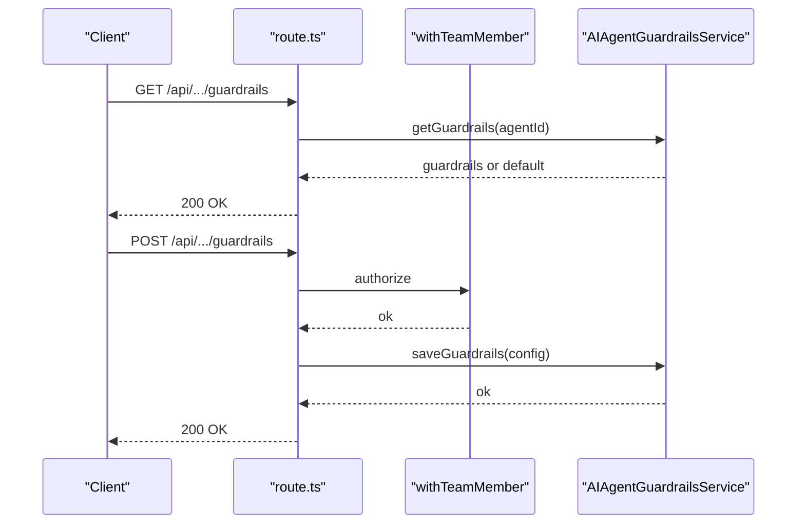
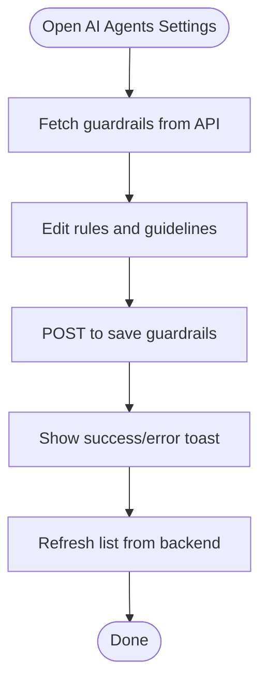
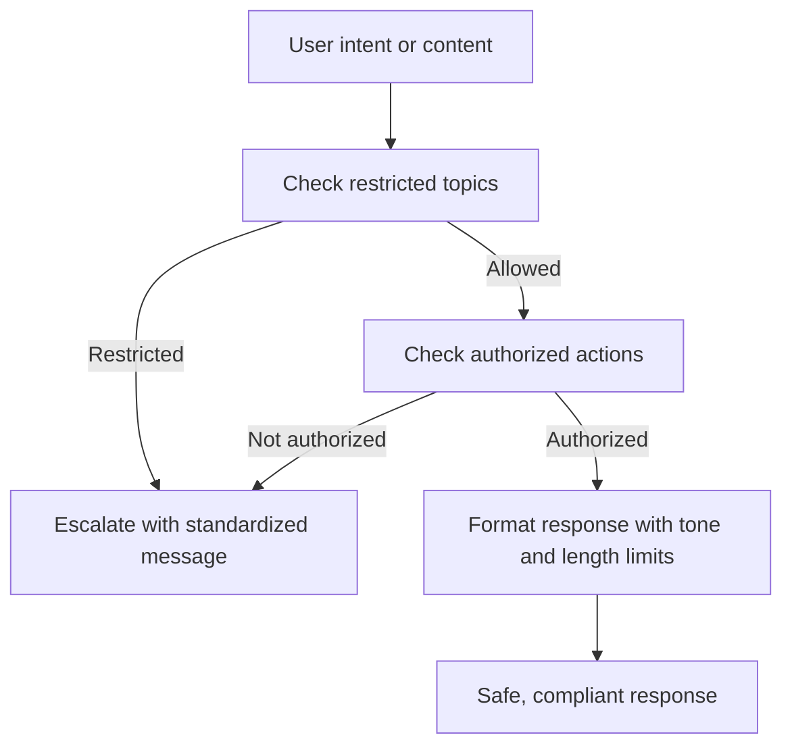
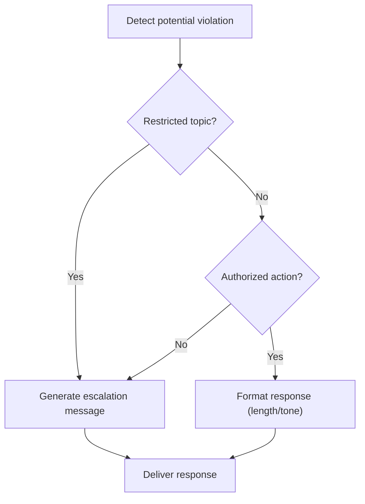
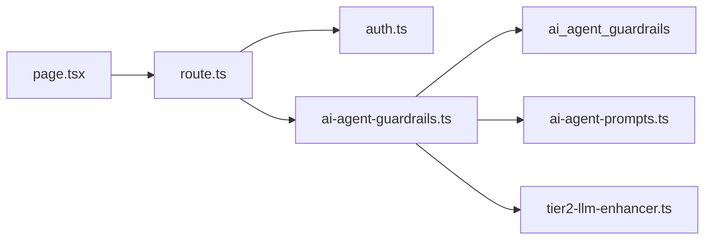

# Guardrails & Safety Mechanisms

<cite>
**Referenced Files in This Document**
- [route.ts](file://app/api/v1/ai-agents/guardrails/route.ts)
- [ai-agent-guardrails.ts](file://lib/services/ai-agent-guardrails.ts)
- [page.tsx](file://app/(dashboard)/settings/ai-agents/page.tsx)
- [029_ai_agent_guardrails.sql](file://database/migrations/029_ai_agent_guardrails.sql)
- [ai-agent-prompts.ts](file://lib/services/ai-agent-prompts.ts)
- [auth.ts](file://lib/middleware/auth.ts)
- [tier2-llm-enhancer.ts](file://lib/ai/tier2-llm-enhancer.ts)
- [seed.sql](file://database/seed.sql)
</cite>

## Table of Contents
1. [Introduction](#introduction)
2. [Project Structure](#project-structure)
3. [Core Components](#core-components)
4. [Architecture Overview](#architecture-overview)
5. [Detailed Component Analysis](#detailed-component-analysis)
6. [Dependency Analysis](#dependency-analysis)
7. [Performance Considerations](#performance-considerations)
8. [Troubleshooting Guide](#troubleshooting-guide)
9. [Conclusion](#conclusion)
10. [Appendices](#appendices)

## Introduction
This document explains the AI agent guardrails and safety mechanisms implemented in the TrueVow CS Support Service. It covers content moderation systems, policy enforcement algorithms, safety violation detection, configuration options, thresholds, automated intervention protocols, ethical AI guidelines, bias and fairness enforcement, and practical guidance for customizing rules and monitoring compliance. The goal is to help administrators and developers understand how the system enforces safe, compliant, and user-friendly AI interactions while balancing safety and user experience.

## Project Structure
The guardrails system spans three primary layers:
- API surface for retrieving and persisting guardrails configuration
- Service layer that encapsulates guardrails logic and persistence
- Frontend admin UI for editing guardrails per agent
- Database schema for storing guardrails configurations with row-level security
- Supporting prompt and middleware infrastructure for authentication and safety

**Diagram sources**
- [page.tsx](file://app/(dashboard)/settings/ai-agents/page.tsx#L38-L350)
- [route.ts](file://app/api/v1/ai-agents/guardrails/route.ts#L1-L43)
- [ai-agent-guardrails.ts](file://lib/services/ai-agent-guardrails.ts#L40-L211)
- [029_ai_agent_guardrails.sql](file://database/migrations/029_ai_agent_guardrails.sql#L8-L51)
- [ai-agent-prompts.ts](file://lib/services/ai-agent-prompts.ts#L38-L357)
- [auth.ts](file://lib/middleware/auth.ts#L119-L133)
- [tier2-llm-enhancer.ts](file://lib/ai/tier2-llm-enhancer.ts#L1-L200)

**Section sources**
- [route.ts](file://app/api/v1/ai-agents/guardrails/route.ts#L1-L43)
- [ai-agent-guardrails.ts](file://lib/services/ai-agent-guardrails.ts#L40-L211)
- [page.tsx](file://app/(dashboard)/settings/ai-agents/page.tsx#L38-L350)
- [029_ai_agent_guardrails.sql](file://database/migrations/029_ai_agent_guardrails.sql#L8-L51)
- [ai-agent-prompts.ts](file://lib/services/ai-agent-prompts.ts#L38-L357)
- [auth.ts](file://lib/middleware/auth.ts#L119-L133)
- [tier2-llm-enhancer.ts](file://lib/ai/tier2-llm-enhancer.ts#L1-L200)

## Core Components
- Guardrails API: Exposes endpoints to fetch and save guardrails configuration for agents.
- Guardrails Service: Implements retrieval, persistence, authorization checks, topic restrictions, escalation messaging, and response formatting.
- Admin UI: Provides a form-driven editor for agents’ “can do,” “cannot do,” escalation criteria, tone guidelines, and response length limits.
- Database Schema: Stores agent-specific guardrails with row-level security and conflict handling.
- Authentication Middleware: Guards the API behind team-member permissions.
- Prompt Service: Supplies system and contextual prompts that reflect guardrails in agent behavior.
- Tier2 Enhancer: Applies strict compliance guardrails during LLM enhancement.

Key responsibilities:
- Policy enforcement: Authorized actions, restricted topics, escalation triggers
- Content moderation: Response length caps, tone guidelines, confirmation requirements
- Automated interventions: Escalation messaging, confirmation flows
- Ethical AI: Zero-knowledge reminders and restricted topics aligned with privacy and compliance

**Section sources**
- [route.ts](file://app/api/v1/ai-agents/guardrails/route.ts#L13-L42)
- [ai-agent-guardrails.ts](file://lib/services/ai-agent-guardrails.ts#L44-L209)
- [page.tsx](file://app/(dashboard)/settings/ai-agents/page.tsx#L20-L36)
- [029_ai_agent_guardrails.sql](file://database/migrations/029_ai_agent_guardrails.sql#L8-L110)
- [ai-agent-prompts.ts](file://lib/services/ai-agent-prompts.ts#L42-L78)
- [tier2-llm-enhancer.ts](file://lib/ai/tier2-llm-enhancer.ts#L1-L200)

## Architecture Overview
The guardrails architecture integrates configuration storage, runtime enforcement, and UI-driven customization.

**Diagram sources**
- [page.tsx](file://app/(dashboard)/settings/ai-agents/page.tsx#L60-L108)
- [route.ts](file://app/api/v1/ai-agents/guardrails/route.ts#L13-L42)
- [auth.ts](file://lib/middleware/auth.ts#L119-L133)
- [ai-agent-guardrails.ts](file://lib/services/ai-agent-guardrails.ts#L44-L141)
- [029_ai_agent_guardrails.sql](file://database/migrations/029_ai_agent_guardrails.sql#L127-L141)

## Detailed Component Analysis

### Guardrails Data Model and Persistence
- Table: ai_agent_guardrails stores agent_id, agent_name, and guardrails JSONB.
- Index: agent_id for fast lookup.
- Row Level Security: Select allowed publicly; insert/update restricted to admins (policy enforced in application code).
- Upsert: Saves or updates guardrails per agent_id.
- Default guardrails: Seeded for the support agent with explicit can-do, cannot-do, escalation criteria, tone guidelines, authorized actions, restricted topics, and response length limit.

**Diagram sources**
- [029_ai_agent_guardrails.sql](file://database/migrations/029_ai_agent_guardrails.sql#L8-L20)
- [029_ai_agent_guardrails.sql](file://database/migrations/029_ai_agent_guardrails.sql#L52-L110)

**Section sources**
- [029_ai_agent_guardrails.sql](file://database/migrations/029_ai_agent_guardrails.sql#L8-L51)
- [029_ai_agent_guardrails.sql](file://database/migrations/029_ai_agent_guardrails.sql#L127-L141)
- [seed.sql](file://database/seed.sql#L1-L363)

### Guardrails Service: Enforcement and Formatting
Responsibilities:
- Retrieve guardrails for an agent (DB or defaults)
- Persist guardrails via upsert
- Authorization checks: isActionAuthorized
- Topic restriction checks: isTopicRestricted
- Escalation messaging: getEscalationMessage
- Response formatting: enforce max length and tone guidelines

**Diagram sources**
- [ai-agent-guardrails.ts](file://lib/services/ai-agent-guardrails.ts#L40-L211)

**Section sources**
- [ai-agent-guardrails.ts](file://lib/services/ai-agent-guardrails.ts#L44-L209)

### API Layer: Retrieval and Persistence
- GET /api/v1/ai-agents/guardrails: Returns configured guardrails for agents (defaults if none stored).
- POST /api/v1/ai-agents/guardrails: Saves guardrails configuration for an agent (requires team member context).

**Diagram sources**
- [route.ts](file://app/api/v1/ai-agents/guardrails/route.ts#L13-L42)
- [auth.ts](file://lib/middleware/auth.ts#L119-L133)
- [ai-agent-guardrails.ts](file://lib/services/ai-agent-guardrails.ts#L125-L141)

**Section sources**
- [route.ts](file://app/api/v1/ai-agents/guardrails/route.ts#L13-L42)
- [auth.ts](file://lib/middleware/auth.ts#L119-L133)

### Admin UI: Guardrails Configuration Editor
- Lists agents and allows editing of:
  - What the agent can do
  - What the agent cannot do
  - Escalation criteria
  - Tone guidelines (checklist)
  - Max response length
- Optimistic updates and toast notifications for user feedback.

**Diagram sources**
- [page.tsx](file://app/(dashboard)/settings/ai-agents/page.tsx#L44-L108)

**Section sources**
- [page.tsx](file://app/(dashboard)/settings/ai-agents/page.tsx#L38-L350)

### Ethical AI Guidelines and Bias/Fairness Enforcement
- Restricted topics prevent exposure of sensitive or unauthorized data (e.g., internal training details, other tenants’ data, account deletion, plan downgrades, payment processor internals).
- Tone guidelines ensure empathetic, professional, specific, concise, and non-blavering communication.
- Confirmation requirements elevate sensitive actions (e.g., creating support cases, processing refunds) to reduce risk.
- Prompt service embeds system limitations and escalation guidance to align agent behavior with guardrails.

**Diagram sources**
- [ai-agent-guardrails.ts](file://lib/services/ai-agent-guardrails.ts#L159-L209)
- [ai-agent-prompts.ts](file://lib/services/ai-agent-prompts.ts#L38-L78)

**Section sources**
- [ai-agent-guardrails.ts](file://lib/services/ai-agent-guardrails.ts#L107-L119)
- [ai-agent-guardrails.ts](file://lib/services/ai-agent-guardrails.ts#L190-L209)
- [ai-agent-prompts.ts](file://lib/services/ai-agent-prompts.ts#L38-L78)

### Safety Violation Detection and Automated Intervention
- Topic restriction detection: Detects sensitive keywords and blocks or escalates.
- Action authorization: Prevents unauthorized operations.
- Escalation messaging: Provides consistent, empathetic, and professional escalation copy.
- Response formatting: Enforces length and tone to reduce ambiguity and improve readability.

**Diagram sources**
- [ai-agent-guardrails.ts](file://lib/services/ai-agent-guardrails.ts#L159-L185)
- [ai-agent-guardrails.ts](file://lib/services/ai-agent-guardrails.ts#L190-L209)

**Section sources**
- [ai-agent-guardrails.ts](file://lib/services/ai-agent-guardrails.ts#L159-L185)
- [ai-agent-guardrails.ts](file://lib/services/ai-agent-guardrails.ts#L190-L209)

### Guardrail Configuration Options and Thresholds
- Authorized actions: List of permitted operations (e.g., create support case, lookup billing info, process refund requests).
- Restricted topics: Keywords or phrases that trigger escalation.
- Escalation criteria: Situations requiring escalation (e.g., security vulnerabilities, complex multi-step coordination).
- Tone guidelines: Boolean flags for empathetic, professional, specific, concise, and avoiding fluff.
- Max response length: Numeric cap to keep responses concise.
- Confirmation requirements: Actions requiring explicit confirmation before execution.

**Section sources**
- [ai-agent-guardrails.ts](file://lib/services/ai-agent-guardrails.ts#L13-L38)
- [ai-agent-guardrails.ts](file://lib/services/ai-agent-guardrails.ts#L100-L119)
- [029_ai_agent_guardrails.sql](file://database/migrations/029_ai_agent_guardrails.sql#L57-L107)

### Customizing Guardrail Rules and Implementing New Safety Policies
Steps to customize:
- Use the Admin UI to edit can-do, cannot-do, escalation criteria, and tone guidelines.
- Adjust authorized actions and restricted topics to reflect new policies.
- Set max response length and confirmation requirements for sensitive actions.
- Save via POST to persist changes.

Guidance:
- Start with conservative defaults and iterate based on real-world usage.
- Use escalation criteria to capture nuanced scenarios (e.g., security, multi-stakeholder issues).
- Keep tone guidelines aligned with brand voice and legal industry expectations.

**Section sources**
- [page.tsx](file://app/(dashboard)/settings/ai-agents/page.tsx#L150-L338)
- [route.ts](file://app/api/v1/ai-agents/guardrails/route.ts#L25-L42)
- [ai-agent-guardrails.ts](file://lib/services/ai-agent-guardrails.ts#L125-L141)

### Monitoring Compliance Violations
- Track escalation events and reasons to identify recurring issues needing policy updates.
- Monitor response formatting adherence (length and tone) to maintain quality.
- Review restricted topic hits to detect emerging sensitive topics.
- Audit authorized action usage to ensure least-privilege enforcement.

**Section sources**
- [ai-agent-guardrails.ts](file://lib/services/ai-agent-guardrails.ts#L174-L185)
- [ai-agent-guardrails.ts](file://lib/services/ai-agent-guardrails.ts#L190-L209)

### Balancing Safety Enforcement and User Experience
- Keep responses concise and empathetic to reduce user frustration.
- Provide clear escalation messaging that reassures users and sets expectations.
- Use confirmation requirements sparingly to avoid friction for routine tasks.
- Continuously refine escalation criteria and authorized actions based on feedback.

**Section sources**
- [ai-agent-guardrails.ts](file://lib/services/ai-agent-guardrails.ts#L190-L209)
- [ai-agent-prompts.ts](file://lib/services/ai-agent-prompts.ts#L38-L78)

### Handling False Positives
- Regularly review restricted topic matches and adjust keywords/phrases.
- Expand authorized actions gradually after validation.
- Provide granular escalation messaging to explain why a request was escalated.
- Use optimistic UI updates and immediate feedback to minimize perceived slowness.

**Section sources**
- [page.tsx](file://app/(dashboard)/settings/ai-agents/page.tsx#L60-L108)
- [ai-agent-guardrails.ts](file://lib/services/ai-agent-guardrails.ts#L159-L185)

### Continuously Updating Guardrail Effectiveness
- Periodic audits of escalation rates and user satisfaction metrics.
- A/B testing of tone guidelines and response length thresholds.
- Incorporating feedback loops from support managers and supervisors.
- Updating prompt templates to reflect evolving guardrails.

**Section sources**
- [ai-agent-prompts.ts](file://lib/services/ai-agent-prompts.ts#L38-L78)
- [tier2-llm-enhancer.ts](file://lib/ai/tier2-llm-enhancer.ts#L1-L200)

## Dependency Analysis
- API depends on authentication middleware and the guardrails service.
- Service depends on Supabase client for DB operations and guardrails model.
- UI depends on API endpoints and optimistic update utilities.
- Database depends on RLS policies and triggers for audit/update timestamps.

**Diagram sources**
- [page.tsx](file://app/(dashboard)/settings/ai-agents/page.tsx#L38-L350)
- [route.ts](file://app/api/v1/ai-agents/guardrails/route.ts#L1-L43)
- [auth.ts](file://lib/middleware/auth.ts#L119-L133)
- [ai-agent-guardrails.ts](file://lib/services/ai-agent-guardrails.ts#L40-L211)
- [ai-agent-prompts.ts](file://lib/services/ai-agent-prompts.ts#L38-L357)
- [tier2-llm-enhancer.ts](file://lib/ai/tier2-llm-enhancer.ts#L1-L200)

**Section sources**
- [route.ts](file://app/api/v1/ai-agents/guardrails/route.ts#L1-L43)
- [ai-agent-guardrails.ts](file://lib/services/ai-agent-guardrails.ts#L40-L211)
- [page.tsx](file://app/(dashboard)/settings/ai-agents/page.tsx#L38-L350)
- [auth.ts](file://lib/middleware/auth.ts#L119-L133)
- [ai-agent-prompts.ts](file://lib/services/ai-agent-prompts.ts#L38-L357)
- [tier2-llm-enhancer.ts](file://lib/ai/tier2-llm-enhancer.ts#L1-L200)

## Performance Considerations
- Database: Single-row lookups by agent_id with index; upsert minimizes write contention.
- Service: In-memory guardrails retrieval with fallback to defaults; minimal computation overhead.
- UI: Optimistic updates reduce perceived latency; batch saves consolidate network calls.
- Prompt service: Templates are static; runtime composition adds negligible overhead.

[No sources needed since this section provides general guidance]

## Troubleshooting Guide
Common issues and resolutions:
- Unauthorized access to guardrails endpoint: Ensure the user is authenticated and mapped to a team member.
- Missing guardrails: Defaults are returned automatically when no DB record exists.
- Save failures: Check for DB errors during upsert; confirm agent_id uniqueness.
- Escalation not triggered: Verify restricted topics and escalation criteria are properly configured.

**Section sources**
- [auth.ts](file://lib/middleware/auth.ts#L119-L133)
- [ai-agent-guardrails.ts](file://lib/services/ai-agent-guardrails.ts#L44-L57)
- [ai-agent-guardrails.ts](file://lib/services/ai-agent-guardrails.ts#L125-L141)

## Conclusion
The guardrails system provides a robust, configurable framework for enforcing AI agent safety and compliance. By combining a centralized configuration store, runtime enforcement logic, and an intuitive admin UI, the system balances strong safety controls with a positive user experience. Administrators can iteratively refine policies, monitor outcomes, and adapt to evolving needs while maintaining ethical AI practices and minimizing risks.

[No sources needed since this section summarizes without analyzing specific files]

## Appendices

### Appendix A: Example Guardrail Fields
- agent_id: Unique identifier for the agent
- agent_name: Human-readable agent name
- can_do: Allowed capabilities and behaviors
- cannot_do: Prohibited actions
- escalation_criteria: Conditions requiring escalation
- tone_guidelines: Emotive and stylistic standards
- authorized_actions: Operations permitted by the agent
- restricted_topics: Sensitive subjects to avoid
- max_response_length: Maximum character count for responses
- require_confirmation_for: Sensitive actions needing confirmation

**Section sources**
- [ai-agent-guardrails.ts](file://lib/services/ai-agent-guardrails.ts#L13-L38)
- [029_ai_agent_guardrails.sql](file://database/migrations/029_ai_agent_guardrails.sql#L57-L107)