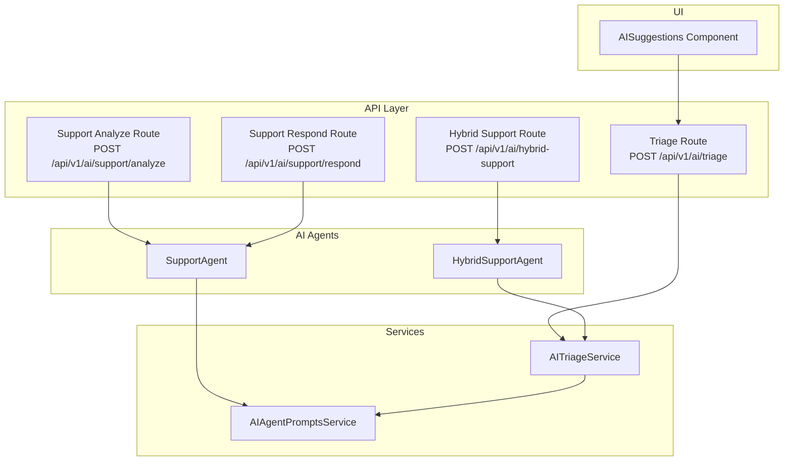
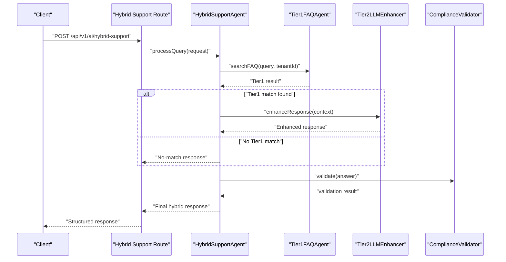
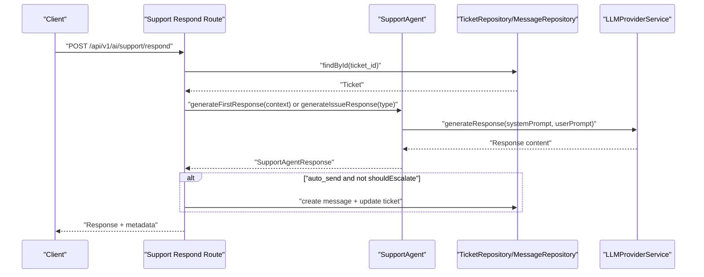
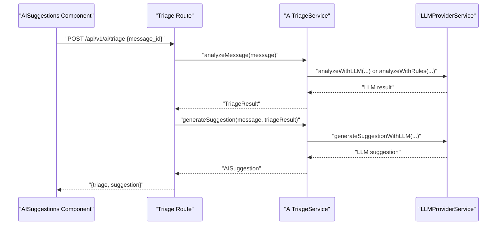
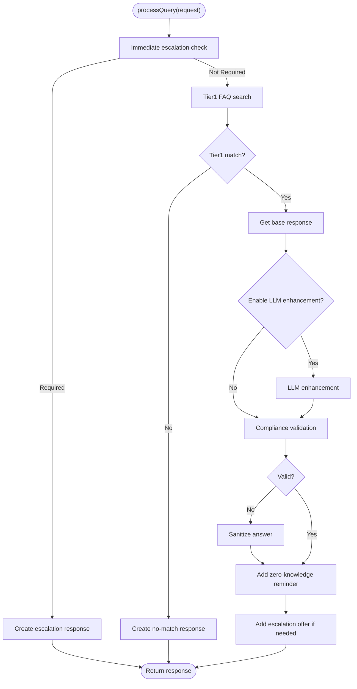
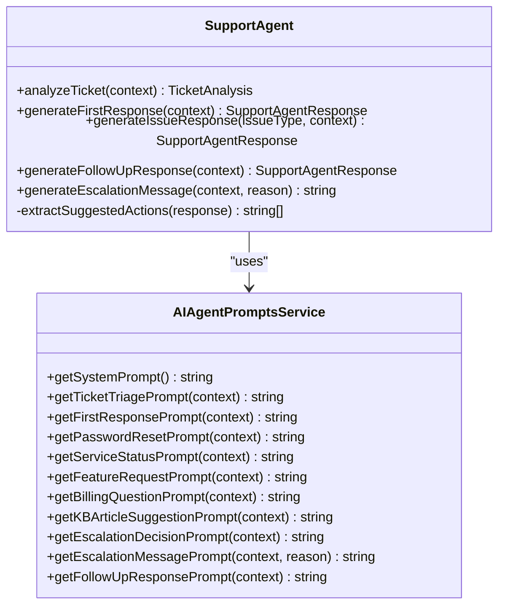
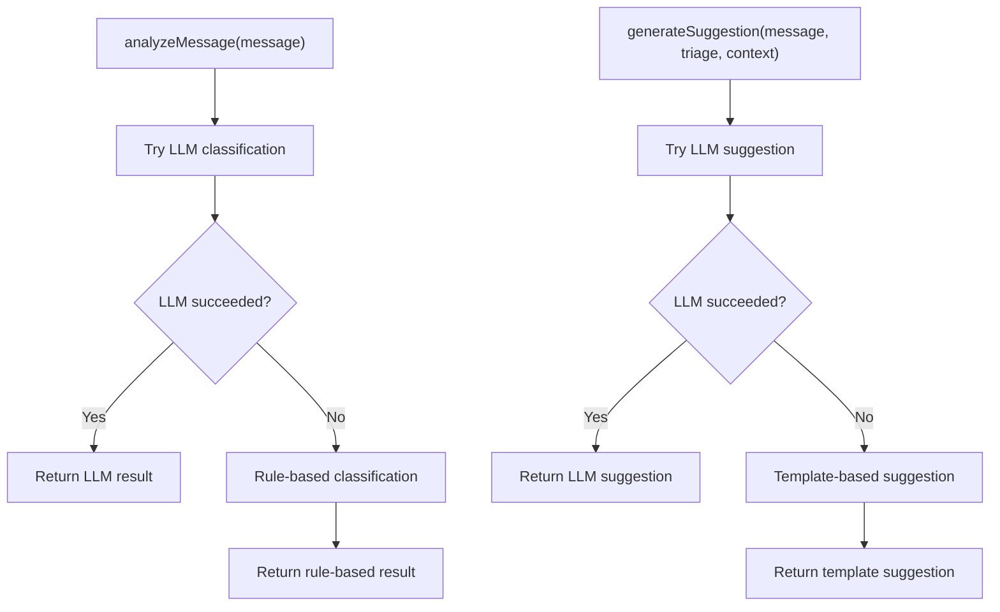
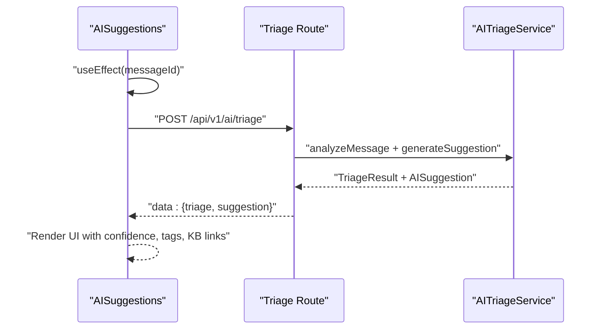
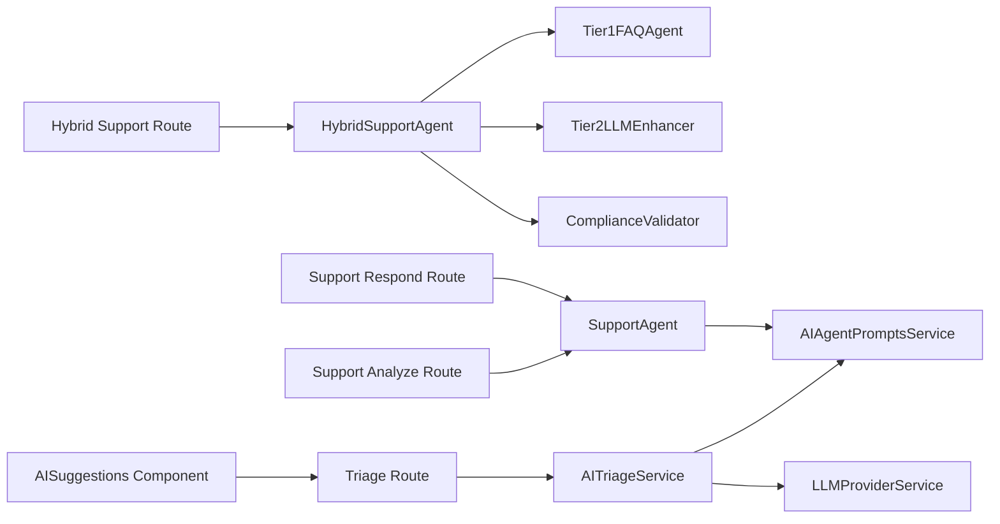

# Hybrid AI-Human Support System

<cite>
**Referenced Files in This Document**
- [route.ts](file://app/api/v1/ai/hybrid-support/route.ts)
- [hybrid-support-agent.ts](file://lib/ai/hybrid-support-agent.ts)
- [route.ts](file://app/api/v1/ai/triage/route.ts)
- [route.ts](file://app/api/v1/ai/support/analyze/route.ts)
- [route.ts](file://app/api/v1/ai/support/respond/route.ts)
- [support-agent.ts](file://lib/ai/support-agent.ts)
- [ai-triage.ts](file://lib/services/ai-triage.ts)
- [ai-agent-prompts.ts](file://lib/services/ai-agent-prompts.ts)
- [AISuggestions.tsx](file://components/inbox/AISuggestions.tsx)
</cite>

## Table of Contents
1. [Introduction](#introduction)
2. [Project Structure](#project-structure)
3. [Core Components](#core-components)
4. [Architecture Overview](#architecture-overview)
5. [Detailed Component Analysis](#detailed-component-analysis)
6. [Dependency Analysis](#dependency-analysis)
7. [Performance Considerations](#performance-considerations)
8. [Troubleshooting Guide](#troubleshooting-guide)
9. [Conclusion](#conclusion)
10. [Appendices](#appendices)

## Introduction
This document describes a hybrid AI-human support system that seamlessly blends rule-based AI with LLM-powered enhancements and human oversight. It focuses on:
- Handoff mechanisms between AI tiers and human agents
- Context preservation across transitions
- Collaborative workflows for triage, response generation, and escalation
- Real-time suggestion systems and agent augmentation
- Hybrid decision logic for escalations and customer experience consistency
- Implementation examples for configuring hybrid workflows, customizing AI assistance rules, monitoring performance, and training agents

## Project Structure
The hybrid system spans API routes, AI agents, triage services, prompt orchestration, and UI components:
- API routes expose endpoints for hybrid support, triage, and support agent operations
- AI agents encapsulate decision logic and response generation
- Triage service classifies messages and suggests responses
- Prompt service composes system and user prompts for LLM providers
- UI component surfaces AI suggestions and triage insights

**Diagram sources**
- [route.ts](file://app/api/v1/ai/hybrid-support/route.ts#L30-L78)
- [hybrid-support-agent.ts](file://lib/ai/hybrid-support-agent.ts#L57-L148)
- [route.ts](file://app/api/v1/ai/triage/route.ts#L16-L44)
- [ai-triage.ts](file://lib/services/ai-triage.ts#L28-L50)
- [route.ts](file://app/api/v1/ai/support/analyze/route.ts#L22-L69)
- [route.ts](file://app/api/v1/ai/support/respond/route.ts#L24-L107)
- [support-agent.ts](file://lib/ai/support-agent.ts#L32-L118)
- [ai-agent-prompts.ts](file://lib/services/ai-agent-prompts.ts#L38-L78)
- [AISuggestions.tsx](file://components/inbox/AISuggestions.tsx#L30-L66)

**Section sources**
- [route.ts](file://app/api/v1/ai/hybrid-support/route.ts#L1-L79)
- [hybrid-support-agent.ts](file://lib/ai/hybrid-support-agent.ts#L1-L208)
- [route.ts](file://app/api/v1/ai/triage/route.ts#L1-L45)
- [route.ts](file://app/api/v1/ai/support/analyze/route.ts#L1-L70)
- [route.ts](file://app/api/v1/ai/support/respond/route.ts#L1-L109)
- [support-agent.ts](file://lib/ai/support-agent.ts#L1-L241)
- [ai-triage.ts](file://lib/services/ai-triage.ts#L1-L402)
- [ai-agent-prompts.ts](file://lib/services/ai-agent-prompts.ts#L1-L357)
- [AISuggestions.tsx](file://components/inbox/AISuggestions.tsx#L1-L196)

## Core Components
- HybridSupportAgent orchestrates a two-tier pipeline: rule-based FAQ search (Tier 1) followed by LLM enhancement (Tier 2), with compliance validation and structured output formatting.
- SupportAgent provides ticket triage, first response generation, issue-specific responses, escalation decisions, and follow-ups.
- AITriageService classifies messages, computes confidence, and generates AI suggestions with fallbacks to rule-based logic.
- AIAgentPromptsService composes system and user prompts for consistent, context-aware LLM interactions.
- AISuggestions UI component fetches triage and suggestions for a message and renders actionable insights.

**Section sources**
- [hybrid-support-agent.ts](file://lib/ai/hybrid-support-agent.ts#L57-L148)
- [support-agent.ts](file://lib/ai/support-agent.ts#L32-L118)
- [ai-triage.ts](file://lib/services/ai-triage.ts#L28-L50)
- [ai-agent-prompts.ts](file://lib/services/ai-agent-prompts.ts#L38-L78)
- [AISuggestions.tsx](file://components/inbox/AISuggestions.tsx#L30-L66)

## Architecture Overview
The hybrid system integrates three primary flows:
- Hybrid Support API: Processes queries through Tier 1 FAQ + optional Tier 2 LLM enhancement, with compliance safeguards and structured outputs.
- Support Agent APIs: Analyze tickets and generate responses, optionally auto-sending and escalating when needed.
- Triage API: Classifies incoming messages, computes confidence, and suggests responses with optional KB article links.

**Diagram sources**
- [route.ts](file://app/api/v1/ai/hybrid-support/route.ts#L30-L78)
- [hybrid-support-agent.ts](file://lib/ai/hybrid-support-agent.ts#L61-L148)

**Diagram sources**
- [route.ts](file://app/api/v1/ai/support/respond/route.ts#L24-L107)
- [support-agent.ts](file://lib/ai/support-agent.ts#L75-L118)

**Diagram sources**
- [AISuggestions.tsx](file://components/inbox/AISuggestions.tsx#L30-L66)
- [route.ts](file://app/api/v1/ai/triage/route.ts#L16-L44)
- [ai-triage.ts](file://lib/services/ai-triage.ts#L33-L50)
- [ai-triage.ts](file://lib/services/ai-triage.ts#L228-L250)

## Detailed Component Analysis

### Hybrid Support Agent
The HybridSupportAgent implements a robust two-tier decision pipeline:
- Tier 1 FAQ search identifies base responses using rule-based matching
- Optional Tier 2 LLM enhancement refines answers with customer context and conversation history
- Compliance validation ensures Bar-compliant outputs and adds zero-knowledge reminders
- Structured response formatting preserves metadata, confidence, and source attribution

**Diagram sources**
- [hybrid-support-agent.ts](file://lib/ai/hybrid-support-agent.ts#L61-L148)

**Section sources**
- [hybrid-support-agent.ts](file://lib/ai/hybrid-support-agent.ts#L57-L148)

### Support Agent
The SupportAgent encapsulates:
- Ticket analysis with structured JSON output
- First-response generation and issue-specific responses
- Escalation decision logic and messaging
- Follow-up response generation leveraging conversation history

**Diagram sources**
- [support-agent.ts](file://lib/ai/support-agent.ts#L32-L241)
- [ai-agent-prompts.ts](file://lib/services/ai-agent-prompts.ts#L38-L357)

**Section sources**
- [support-agent.ts](file://lib/ai/support-agent.ts#L32-L241)
- [ai-agent-prompts.ts](file://lib/services/ai-agent-prompts.ts#L38-L357)

### AI Triage Service
AITriageService performs:
- LLM-based classification with fallback to rule-based classification
- Confidence scoring and human-review triggers
- AI suggestion generation with KB article integration
- Assignment suggestions based on triage outcomes

**Diagram sources**
- [ai-triage.ts](file://lib/services/ai-triage.ts#L33-L50)
- [ai-triage.ts](file://lib/services/ai-triage.ts#L228-L250)

**Section sources**
- [ai-triage.ts](file://lib/services/ai-triage.ts#L28-L50)
- [ai-triage.ts](file://lib/services/ai-triage.ts#L228-L250)

### AI Suggestions UI Component
The AISuggestions component:
- Fetches triage and suggestions for a given message
- Renders confidence badges, triage tags, and KB article links
- Allows agents to accept AI suggestions directly

**Diagram sources**
- [AISuggestions.tsx](file://components/inbox/AISuggestions.tsx#L30-L66)
- [route.ts](file://app/api/v1/ai/triage/route.ts#L16-L44)
- [ai-triage.ts](file://lib/services/ai-triage.ts#L228-L250)

**Section sources**
- [AISuggestions.tsx](file://components/inbox/AISuggestions.tsx#L30-L66)

## Dependency Analysis
The system exhibits layered dependencies:
- API routes depend on repositories and services
- AI agents depend on prompt services and LLM provider services
- Triage service depends on LLM provider service and prompt service
- UI component depends on triage API and renders suggestions

**Diagram sources**
- [route.ts](file://app/api/v1/ai/hybrid-support/route.ts#L30-L78)
- [hybrid-support-agent.ts](file://lib/ai/hybrid-support-agent.ts#L13-L15)
- [route.ts](file://app/api/v1/ai/support/respond/route.ts#L12-L16)
- [support-agent.ts](file://lib/ai/support-agent.ts#L8-L11)
- [route.ts](file://app/api/v1/ai/triage/route.ts#L4-L5)
- [ai-triage.ts](file://lib/services/ai-triage.ts#L8)
- [AISuggestions.tsx](file://components/inbox/AISuggestions.tsx#L49-L53)

**Section sources**
- [route.ts](file://app/api/v1/ai/hybrid-support/route.ts#L1-L79)
- [hybrid-support-agent.ts](file://lib/ai/hybrid-support-agent.ts#L1-L208)
- [route.ts](file://app/api/v1/ai/triage/route.ts#L1-L45)
- [route.ts](file://app/api/v1/ai/support/analyze/route.ts#L1-L70)
- [route.ts](file://app/api/v1/ai/support/respond/route.ts#L1-L109)
- [support-agent.ts](file://lib/ai/support-agent.ts#L1-L241)
- [ai-triage.ts](file://lib/services/ai-triage.ts#L1-L402)
- [AISuggestions.tsx](file://components/inbox/AISuggestions.tsx#L1-L196)

## Performance Considerations
- Rate limiting is applied to support agent endpoints to prevent abuse and ensure throughput predictability.
- LLM calls use temperature and token limits to balance determinism and cost.
- Hybrid agent short-circuits on immediate escalation and no-match conditions to reduce latency.
- Triage service falls back to rule-based classification when LLM fails, ensuring resilience.

[No sources needed since this section provides general guidance]

## Troubleshooting Guide
Common issues and resolutions:
- Validation errors from API routes indicate malformed payloads; verify request schemas and required fields.
- LLM failures in triage or support agent lead to fallback behavior; monitor logs and retry policies.
- Compliance validation failures trigger sanitization and zero-knowledge reminders; ensure prompts and outputs meet policy requirements.
- UI suggestion loading errors indicate network or backend issues; confirm endpoint availability and authentication.

**Section sources**
- [route.ts](file://app/api/v1/ai/hybrid-support/route.ts#L63-L77)
- [route.ts](file://app/api/v1/ai/triage/route.ts#L41-L44)
- [route.ts](file://app/api/v1/ai/support/respond/route.ts#L100-L105)

## Conclusion
The hybrid AI-human support system combines rule-based efficiency with LLM-driven personalization while preserving compliance and human oversight. Its modular architecture enables configurable workflows, real-time suggestions, and seamless handoffs—ensuring consistent customer experiences across AI and human interactions.

[No sources needed since this section summarizes without analyzing specific files]

## Appendices

### Implementation Examples

- Configure hybrid workflows
  - Adjust enablement of LLM enhancement per request via the hybrid support API.
  - Customize customer context and conversation history to improve response relevance.
  - Example path: [Hybrid Support Route](file://app/api/v1/ai/hybrid-support/route.ts#L40-L54)

- Customize AI assistance rules
  - Modify triage thresholds and assignment logic in the triage service.
  - Example path: [AITriageService](file://lib/services/ai-triage.ts#L369-L400)

- Monitor hybrid performance metrics
  - Track processing time, confidence scores, and escalation rates from hybrid agent responses.
  - Example path: [HybridSupportAgent metadata](file://lib/ai/hybrid-support-agent.ts#L142-L146)

- Agent training for hybrid environments
  - Use prompt templates and escalation guidelines to train agents on when to escalate and how to maintain consistency.
  - Example path: [AIAgentPromptsService](file://lib/services/ai-agent-prompts.ts#L38-L357)

- Measure AI-human collaboration effectiveness
  - Evaluate triage accuracy, suggestion acceptance rates, and auto-send success metrics.
  - Example path: [Support Respond Route](file://app/api/v1/ai/support/respond/route.ts#L67-L89)