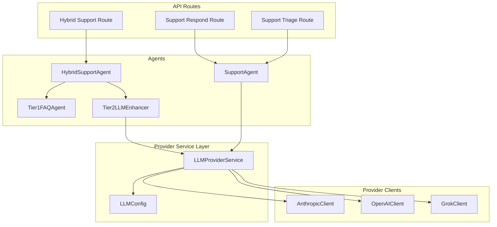
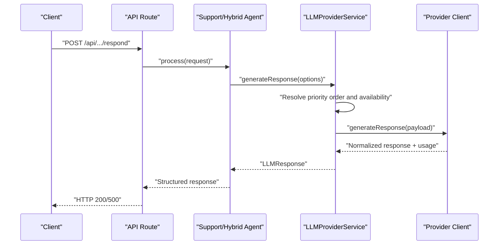
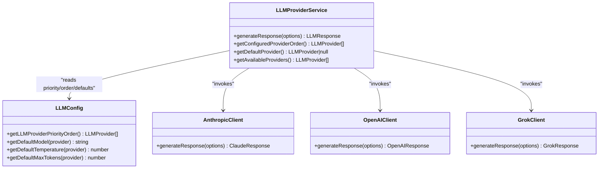

# LLM Providers & Configuration

<cite>
**Referenced Files in This Document**
- [llm-provider.ts](file://lib/services/llm-provider.ts)
- [llm-config.ts](file://lib/config/llm-config.ts)
- [anthropic.ts](file://lib/integrations/anthropic.ts)
- [openai.ts](file://lib/integrations/openai.ts)
- [grok.ts](file://lib/integrations/grok.ts)
- [hybrid-support-agent.ts](file://lib/ai/hybrid-support-agent.ts)
- [support-agent.ts](file://lib/ai/support-agent.ts)
- [tier2-llm-enhancer.ts](file://lib/ai/tier2-llm-enhancer.ts)
- [tier1-faq-agent.ts](file://lib/ai/tier1-faq-agent.ts)
- [route.ts](file://app/api/v1/ai/hybrid-support/route.ts)
- [route.ts](file://app/api/v1/ai/support/respond/route.ts)
- [route.ts](file://app/api/v1/ai/triage/route.ts)
</cite>

## Table of Contents
1. [Introduction](#introduction)
2. [Project Structure](#project-structure)
3. [Core Components](#core-components)
4. [Architecture Overview](#architecture-overview)
5. [Detailed Component Analysis](#detailed-component-analysis)
6. [Dependency Analysis](#dependency-analysis)
7. [Performance Considerations](#performance-considerations)
8. [Troubleshooting Guide](#troubleshooting-guide)
9. [Conclusion](#conclusion)
10. [Appendices](#appendices)

## Introduction
This document explains the multi-LLM provider architecture that supports Anthropic Claude, OpenAI GPT, and Grok (xAI). It covers the provider abstraction layer, configuration management, priority ordering, provider selection and fallback logic, authentication and API key management, rate limiting considerations, and operational guidance for adding new providers, optimizing performance, and troubleshooting connectivity issues.

## Project Structure
The LLM provider system is organized around a service layer that encapsulates provider clients and configuration, with agents that orchestrate LLM usage in hybrid and support workflows.

**Diagram sources**
- [route.ts](file://app/api/v1/ai/hybrid-support/route.ts#L1-L200)
- [route.ts](file://app/api/v1/ai/support/respond/route.ts#L1-L200)
- [route.ts](file://app/api/v1/ai/triage/route.ts#L1-L200)
- [hybrid-support-agent.ts](file://lib/ai/hybrid-support-agent.ts#L1-L208)
- [support-agent.ts](file://lib/ai/support-agent.ts#L1-L241)
- [tier1-faq-agent.ts](file://lib/ai/tier1-faq-agent.ts#L1-L222)
- [tier2-llm-enhancer.ts](file://lib/ai/tier2-llm-enhancer.ts#L1-L263)
- [llm-provider.ts](file://lib/services/llm-provider.ts#L1-L214)
- [llm-config.ts](file://lib/config/llm-config.ts#L1-L108)
- [anthropic.ts](file://lib/integrations/anthropic.ts#L1-L143)
- [openai.ts](file://lib/integrations/openai.ts#L1-L154)
- [grok.ts](file://lib/integrations/grok.ts#L1-L156)

**Section sources**
- [llm-provider.ts](file://lib/services/llm-provider.ts#L1-L214)
- [llm-config.ts](file://lib/config/llm-config.ts#L1-L108)
- [anthropic.ts](file://lib/integrations/anthropic.ts#L1-L143)
- [openai.ts](file://lib/integrations/openai.ts#L1-L154)
- [grok.ts](file://lib/integrations/grok.ts#L1-L156)
- [hybrid-support-agent.ts](file://lib/ai/hybrid-support-agent.ts#L1-L208)
- [support-agent.ts](file://lib/ai/support-agent.ts#L1-L241)
- [tier2-llm-enhancer.ts](file://lib/ai/tier2-llm-enhancer.ts#L1-L263)
- [tier1-faq-agent.ts](file://lib/ai/tier1-faq-agent.ts#L1-L222)

## Core Components
- LLMProviderService: Central orchestrator for provider selection, fallback, and invocation. It reads priority order and availability, then executes requests against the selected provider client.
- LLMConfig: Loads provider priority order and defaults for model, temperature, and max tokens from environment variables.
- Provider Clients: AnthropicClient, OpenAIClient, and GrokClient encapsulate API interactions and error handling.
- Agents: HybridSupportAgent and SupportAgent use LLMProviderService to generate responses, with optional LLM enhancement.

Key responsibilities:
- Provider selection and fallback: Automatic priority order with optional preferred provider and explicit fallback list.
- Configuration overrides: Environment variables allow per-provider model, temperature, and token limits.
- Usage reporting: Provider responses include usage metrics for observability.

**Section sources**
- [llm-provider.ts](file://lib/services/llm-provider.ts#L38-L213)
- [llm-config.ts](file://lib/config/llm-config.ts#L19-L107)
- [anthropic.ts](file://lib/integrations/anthropic.ts#L23-L142)
- [openai.ts](file://lib/integrations/openai.ts#L24-L153)
- [grok.ts](file://lib/integrations/grok.ts#L25-L155)

## Architecture Overview
The system follows a layered architecture:
- API routes accept requests and delegate to agents.
- Agents construct prompts and call LLMProviderService.
- LLMProviderService selects a provider based on priority and availability, then invokes the appropriate client.
- Provider clients call external APIs and return normalized responses with usage metrics.

**Diagram sources**
- [route.ts](file://app/api/v1/ai/support/respond/route.ts#L1-L200)
- [support-agent.ts](file://lib/ai/support-agent.ts#L75-L118)
- [llm-provider.ts](file://lib/services/llm-provider.ts#L43-L77)
- [anthropic.ts](file://lib/integrations/anthropic.ts#L34-L85)
- [openai.ts](file://lib/integrations/openai.ts#L35-L89)
- [grok.ts](file://lib/integrations/grok.ts#L37-L91)

## Detailed Component Analysis

### LLMProviderService
Responsibilities:
- Provider selection: Uses configured priority order, filters by availability, and supports preferred provider and explicit fallback list.
- Invocation: Delegates to provider-specific clients with normalized options and returns a unified response format.
- Availability detection: Checks environment variables for API keys to determine available providers.

Selection algorithm:
- If preferredProvider is set, it is placed first, followed by fallbackProviders or the configured order filtered to available providers.
- If no preferred provider is set, the configured priority order is used, filtered to available providers.
- Iterates through the ordered providers until one succeeds or throws an error after exhausting all options.

Fallback behavior:
- On provider failure, logs a warning and attempts the next provider in the sequence.
- Throws a consolidated error if all providers fail.

Usage reporting:
- Returns provider name, model, and usage metrics (tokens) for observability.

**Section sources**
- [llm-provider.ts](file://lib/services/llm-provider.ts#L43-L77)
- [llm-provider.ts](file://lib/services/llm-provider.ts#L152-L173)
- [llm-provider.ts](file://lib/services/llm-provider.ts#L178-L212)

### LLM Configuration Management
Configuration sources and precedence:
- Priority order: LLM_PROVIDER_PRIORITY_ORDER environment variable; defaults to Anthropic → OpenAI → Grok.
- Defaults: Per-provider model, temperature, and max tokens can be overridden via environment variables.
- Validation: Unknown providers in priority order are ignored; at least one valid provider is required.

Configuration retrieval:
- getLLMProviderPriorityOrder parses and validates the environment-provided order.
- getDefaultModel/DefaultTemperature/DefaultMaxTokens return environment overrides or built-in defaults.

**Section sources**
- [llm-config.ts](file://lib/config/llm-config.ts#L19-L36)
- [llm-config.ts](file://lib/config/llm-config.ts#L41-L51)
- [llm-config.ts](file://lib/config/llm-config.ts#L56-L66)
- [llm-config.ts](file://lib/config/llm-config.ts#L71-L81)
- [llm-config.ts](file://lib/config/llm-config.ts#L86-L107)

### Provider Clients (Anthropic, OpenAI, Grok)
Common patterns:
- Constructor accepts API key from environment variable.
- generateResponse validates presence of API key and sends a standardized request payload.
- Responses are normalized to include content, model, and usage metrics.
- Errors are thrown with descriptive messages on non-OK responses.

Anthropic:
- Uses x-api-key header and anthropic-version header.
- Exposes generateResponse and generateResponseWithHistory variants.

OpenAI:
- Uses Authorization Bearer scheme.
- Exposes generateResponse and generateResponseWithHistory variants.

Grok:
- Uses Authorization Bearer scheme and configurable base URL via environment.
- Exposes generateResponse and generateResponseWithHistory variants.

**Section sources**
- [anthropic.ts](file://lib/integrations/anthropic.ts#L23-L85)
- [anthropic.ts](file://lib/integrations/anthropic.ts#L89-L139)
- [openai.ts](file://lib/integrations/openai.ts#L24-L89)
- [openai.ts](file://lib/integrations/openai.ts#L94-L149)
- [grok.ts](file://lib/integrations/grok.ts#L25-L91)
- [grok.ts](file://lib/integrations/grok.ts#L96-L152)

### Hybrid Support Agent
Workflow:
- Immediate escalation checks.
- Tier 1 FAQ search and base response extraction.
- Optional Tier 2 LLM enhancement with provider selection.
- Compliance validation and sanitization.
- Structured response assembly with confidence, sources, and metadata.

Provider usage:
- Tier 2 enhancement calls LLMProviderService with a lower temperature and increased token limit for structured output.

**Section sources**
- [hybrid-support-agent.ts](file://lib/ai/hybrid-support-agent.ts#L61-L148)
- [tier2-llm-enhancer.ts](file://lib/ai/tier2-llm-enhancer.ts#L70-L120)

### Support Agent
Workflow:
- Ticket triage: Calls LLMProviderService with a low temperature for consistent categorization.
- First response generation: Builds a response and determines escalation needs by querying LLMProviderService again.
- Issue-specific responses: Uses specialized prompts for password reset, service status, feature requests, and billing.
- Follow-up and escalation messaging: Leverages LLMProviderService for natural language responses.

**Section sources**
- [support-agent.ts](file://lib/ai/support-agent.ts#L42-L70)
- [support-agent.ts](file://lib/ai/support-agent.ts#L75-L118)
- [support-agent.ts](file://lib/ai/support-agent.ts#L123-L166)
- [support-agent.ts](file://lib/ai/support-agent.ts#L171-L193)
- [support-agent.ts](file://lib/ai/support-agent.ts#L198-L216)

### Tier 2 LLM Enhancement
Features:
- Strict compliance guardrails embedded in system prompt.
- Structured JSON output parsing with fallbacks.
- Confidence adjustment and zero-knowledge reminder enforcement.
- Provider selection uses configured priority order automatically.

**Section sources**
- [tier2-llm-enhancer.ts](file://lib/ai/tier2-llm-enhancer.ts#L54-L120)
- [tier2-llm-enhancer.ts](file://lib/ai/tier2-llm-enhancer.ts#L202-L221)
- [tier2-llm-enhancer.ts](file://lib/ai/tier2-llm-enhancer.ts#L226-L261)

### Tier 1 FAQ Agent
Features:
- Deterministic, rule-based search across knowledge base and FAQ table.
- Normalized confidence scoring and match type classification.
- Zero LLM usage for fast, predictable responses.

**Section sources**
- [tier1-faq-agent.ts](file://lib/ai/tier1-faq-agent.ts#L39-L60)
- [tier1-faq-agent.ts](file://lib/ai/tier1-faq-agent.ts#L121-L162)
- [tier1-faq-agent.ts](file://lib/ai/tier1-faq-agent.ts#L167-L192)
- [tier1-faq-agent.ts](file://lib/ai/tier1-faq-agent.ts#L197-L203)

## Dependency Analysis
The provider abstraction layer isolates API differences behind a single interface. LLMProviderService depends on:
- Provider clients for external API calls.
- LLMConfig for priority order and defaults.
- Environment variables for authentication and overrides.

**Diagram sources**
- [llm-provider.ts](file://lib/services/llm-provider.ts#L38-L213)
- [llm-config.ts](file://lib/config/llm-config.ts#L19-L107)
- [anthropic.ts](file://lib/integrations/anthropic.ts#L23-L142)
- [openai.ts](file://lib/integrations/openai.ts#L24-L153)
- [grok.ts](file://lib/integrations/grok.ts#L25-L155)

**Section sources**
- [llm-provider.ts](file://lib/services/llm-provider.ts#L1-L214)
- [llm-config.ts](file://lib/config/llm-config.ts#L1-L108)

## Performance Considerations
- Provider selection order: Configure priority order to favor providers with lower latency and higher availability in your region.
- Token limits: Tune max tokens per provider to balance quality and cost; monitor usage metrics returned by provider clients.
- Temperature tuning: Use lower temperature for deterministic tasks (triage, categorization) and higher temperature for creative tasks.
- Concurrency: LLMProviderService serially tries providers; consider batching or caching at higher layers if needed.
- Observability: Log provider name and usage metrics for cost allocation and performance tracking.

[No sources needed since this section provides general guidance]

## Troubleshooting Guide
Common issues and resolutions:
- No providers available: Ensure at least one API key environment variable is set; LLMProviderService throws an error if none are available.
- Provider failures: LLMProviderService logs warnings and falls back to the next provider; check provider-specific error messages for root causes.
- Authentication errors: Verify API keys are present and valid; provider clients throw descriptive errors when keys are missing.
- Rate limiting: External providers may throttle; implement retry/backoff at the caller level or adjust provider selection to prefer less congested providers.
- Configuration errors: Validate LLM_PROVIDER_PRIORITY_ORDER; unknown providers are ignored; confirm environment overrides for model, temperature, and max tokens.

Operational checks:
- Confirm environment variables for API keys and optional overrides are present.
- Verify priority order reflects current availability and performance characteristics.
- Monitor usage metrics to detect provider drift or anomalies.

**Section sources**
- [llm-provider.ts](file://lib/services/llm-provider.ts#L58-L77)
- [llm-provider.ts](file://lib/services/llm-provider.ts#L178-L192)
- [anthropic.ts](file://lib/integrations/anthropic.ts#L41-L43)
- [openai.ts](file://lib/integrations/openai.ts#L42-L44)
- [grok.ts](file://lib/integrations/grok.ts#L44-L46)

## Conclusion
The multi-LLM provider architecture provides robust, configurable, and observable LLM integration with automatic fallback and priority ordering. By centralizing provider selection in LLMProviderService and exposing environment-driven configuration, teams can optimize for cost, latency, and reliability while maintaining a clean separation of concerns across agents and clients.

[No sources needed since this section summarizes without analyzing specific files]

## Appendices

### Adding a New LLM Provider
Steps:
1. Create a new provider client under lib/integrations with a generateResponse method and standardized response shape.
2. Import the client in lib/services/llm-provider.ts and add a new case in generateWithProvider.
3. Extend LLMProvider type and add defaults in lib/config/llm-config.ts (model, temperature, max tokens).
4. Set environment variables for the new provider’s API key and optional overrides.
5. Optionally add the provider to the default priority order in lib/config/llm-config.ts.

Implementation references:
- Provider client pattern: [anthropic.ts](file://lib/integrations/anthropic.ts#L23-L85), [openai.ts](file://lib/integrations/openai.ts#L24-L89), [grok.ts](file://lib/integrations/grok.ts#L25-L91)
- Provider selection: [llm-provider.ts](file://lib/services/llm-provider.ts#L82-L146)
- Configuration defaults: [llm-config.ts](file://lib/config/llm-config.ts#L41-L81)

**Section sources**
- [anthropic.ts](file://lib/integrations/anthropic.ts#L23-L85)
- [openai.ts](file://lib/integrations/openai.ts#L24-L89)
- [grok.ts](file://lib/integrations/grok.ts#L25-L91)
- [llm-provider.ts](file://lib/services/llm-provider.ts#L82-L146)
- [llm-config.ts](file://lib/config/llm-config.ts#L41-L81)

### Configuring Provider-Specific Parameters
- Priority order: Set LLM_PROVIDER_PRIORITY_ORDER to a comma-separated list of providers (e.g., anthropic,openai,grok).
- Model override: Set provider-specific model environment variable (e.g., ANTHROPIC_MODEL).
- Temperature override: Set provider-specific temperature environment variable (e.g., OPENAI_TEMPERATURE).
- Max tokens override: Set provider-specific max tokens environment variable (e.g., GROK_MAX_TOKENS).

**Section sources**
- [llm-config.ts](file://lib/config/llm-config.ts#L19-L36)
- [llm-config.ts](file://lib/config/llm-config.ts#L41-L51)
- [llm-config.ts](file://lib/config/llm-config.ts#L56-L66)
- [llm-config.ts](file://lib/config/llm-config.ts#L71-L81)

### Managing Provider Health Monitoring
- Availability detection: LLMProviderService.getAvailableProviders checks for API key presence.
- Usage reporting: Provider clients return usage metrics; surface these in logs and dashboards.
- Retry/backoff: Implement at the caller layer if needed to mitigate transient provider issues.

**Section sources**
- [llm-provider.ts](file://lib/services/llm-provider.ts#L178-L192)
- [anthropic.ts](file://lib/integrations/anthropic.ts#L77-L84)
- [openai.ts](file://lib/integrations/openai.ts#L80-L88)
- [grok.ts](file://lib/integrations/grok.ts#L82-L90)

### Provider Switching and Cost Optimization
- Switch providers by adjusting LLM_PROVIDER_PRIORITY_ORDER to reflect current pricing and performance.
- Use provider-specific environment overrides to fine-tune model and token limits per workload.
- Monitor usage metrics to attribute costs and identify optimal provider mixes.

**Section sources**
- [llm-config.ts](file://lib/config/llm-config.ts#L19-L36)
- [llm-config.ts](file://lib/config/llm-config.ts#L41-L81)
- [llm-provider.ts](file://lib/services/llm-provider.ts#L197-L212)

### Authentication Setup and Rate Limiting
- Authentication: Set environment variables for each provider’s API key; clients validate presence before making requests.
- Rate limiting: External provider throttling may occur; implement retry/backoff at the application layer if needed.

**Section sources**
- [anthropic.ts](file://lib/integrations/anthropic.ts#L41-L43)
- [openai.ts](file://lib/integrations/openai.ts#L42-L44)
- [grok.ts](file://lib/integrations/grok.ts#L44-L46)