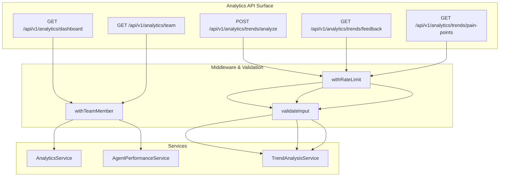
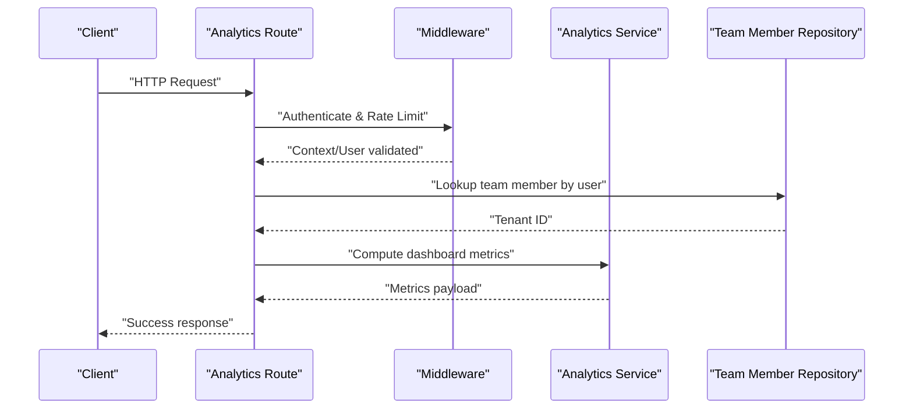
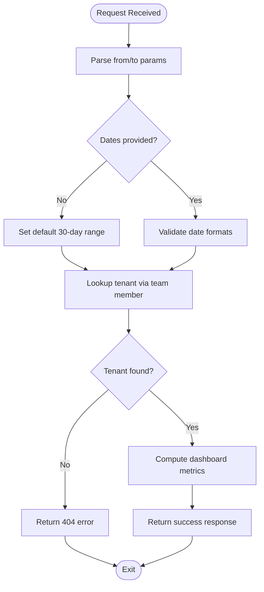
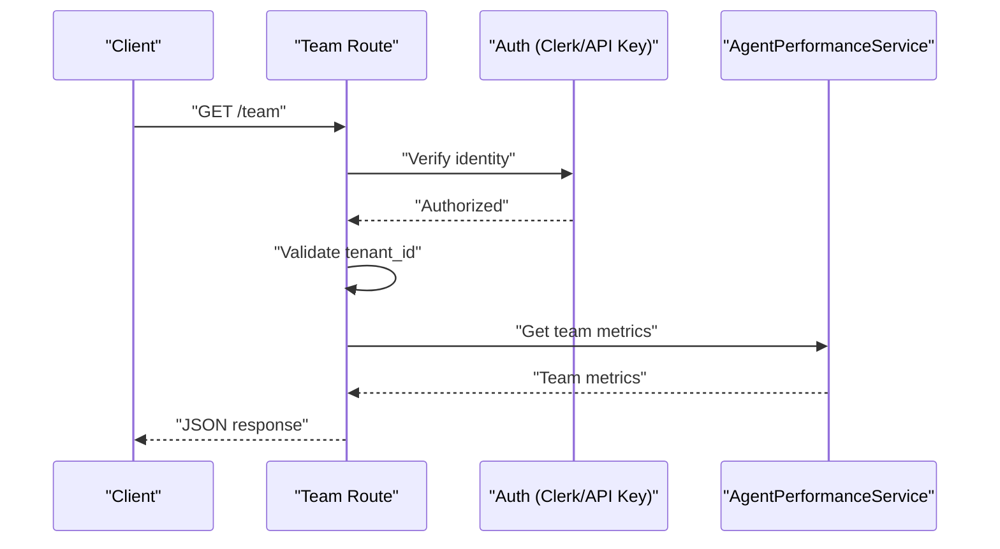
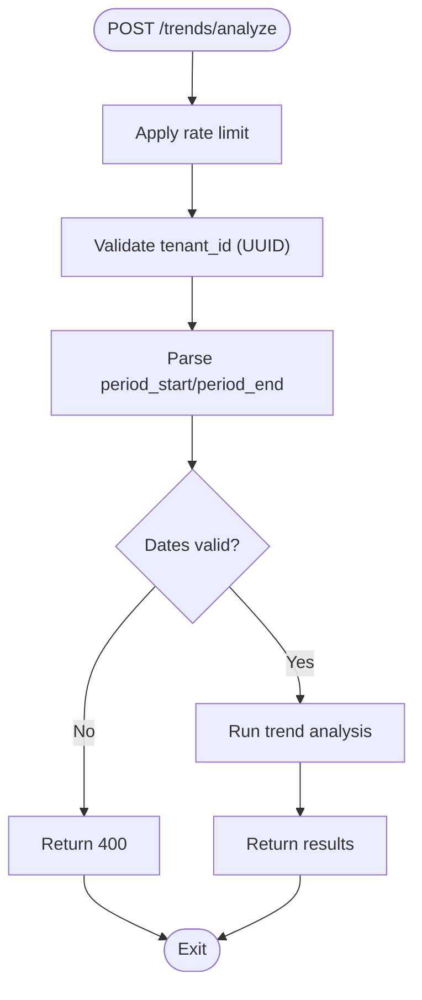
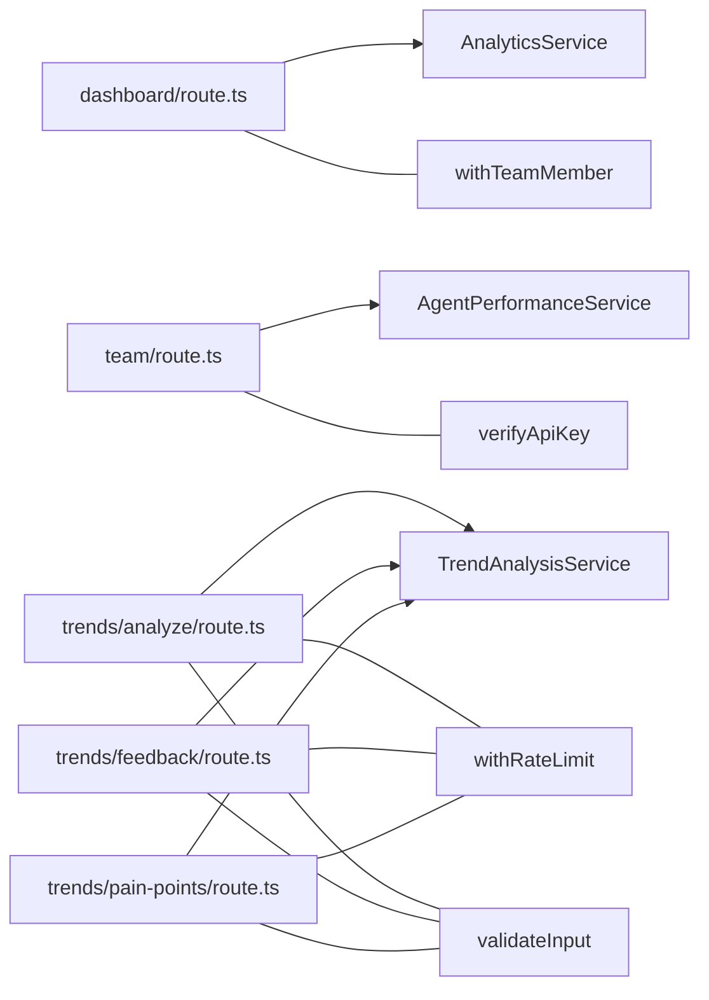

# Performance Monitoring & Analytics

<cite>
**Referenced Files in This Document**
- [route.ts](file://app/api/v1/analytics/dashboard/route.ts)
- [route.ts](file://app/api/v1/analytics/team/route.ts)
- [route.ts](file://app/api/v1/analytics/trends/analyze/route.ts)
- [route.ts](file://app/api/v1/analytics/trends/feedback/route.ts)
- [route.ts](file://app/api/v1/analytics/trends/pain-points/route.ts)
</cite>

## Table of Contents
1. [Introduction](#introduction)
2. [Project Structure](#project-structure)
3. [Core Components](#core-components)
4. [Architecture Overview](#architecture-overview)
5. [Detailed Component Analysis](#detailed-component-analysis)
6. [Dependency Analysis](#dependency-analysis)
7. [Performance Considerations](#performance-considerations)
8. [Troubleshooting Guide](#troubleshooting-guide)
9. [Conclusion](#conclusion)
10. [Appendices](#appendices)

## Introduction
This document explains the AI agent performance monitoring and analytics subsystems present in the repository. It focuses on the metrics collection framework, performance benchmarking, and quality assessment APIs. It also documents how response accuracy tracking, latency monitoring, and cost optimization analytics can be integrated, along with model performance evaluation, drift detection, and continuous learning monitoring. Practical guidance is provided for setting up custom performance metrics, configuring alerting systems, interpreting performance reports, capacity planning, resource optimization, and identifying performance bottlenecks.

## Project Structure
The analytics surface area is exposed via a set of REST endpoints under the Next.js App Router. These endpoints delegate to service-layer components responsible for retrieving and computing metrics and insights. Authentication and rate limiting are applied at the route level, and input validation ensures robustness.

**Diagram sources**
- [route.ts](file://app/api/v1/analytics/dashboard/route.ts#L17-L51)
- [route.ts](file://app/api/v1/analytics/team/route.ts#L10-L43)
- [route.ts](file://app/api/v1/analytics/trends/analyze/route.ts#L15-L51)
- [route.ts](file://app/api/v1/analytics/trends/feedback/route.ts#L15-L54)
- [route.ts](file://app/api/v1/analytics/trends/pain-points/route.ts#L15-L54)

**Section sources**
- [route.ts](file://app/api/v1/analytics/dashboard/route.ts#L1-L52)
- [route.ts](file://app/api/v1/analytics/team/route.ts#L1-L44)
- [route.ts](file://app/api/v1/analytics/trends/analyze/route.ts#L1-L52)
- [route.ts](file://app/api/v1/analytics/trends/feedback/route.ts#L1-L55)
- [route.ts](file://app/api/v1/analytics/trends/pain-points/route.ts#L1-L55)

## Core Components
- Dashboard Metrics Endpoint
  - Purpose: Aggregates comprehensive dashboard metrics for a tenant over a specified time range.
  - Authentication: Requires a team member context.
  - Time Range Defaults: If not provided, defaults to the last 30 days.
  - Output: Returns structured metrics suitable for dashboards.

- Team Performance Endpoint
  - Purpose: Retrieves team-level performance metrics for a given tenant and period.
  - Authentication: Supports Clerk user or API key verification.
  - Required Inputs: tenant_id; optional period_start and period_end.
  - Output: Team metrics payload.

- Trend Analysis Endpoint
  - Purpose: Performs trend analysis on tickets and surveys.
  - Authentication: Requires team member context.
  - Rate Limiting: Enforced per minute with a lower threshold for analysis operations.
  - Input Validation: Validates UUID for tenant_id and date formats.
  - Output: Trend analysis results.

- Product Feedback Endpoint
  - Purpose: Extracts product feedback from tickets and surveys.
  - Authentication: Requires team member context.
  - Rate Limiting: Moderate threshold.
  - Input Parsing: Accepts tenant_id, period_start, period_end with sensible defaults.
  - Output: Feedback dataset.

- Pain Points Endpoint
  - Purpose: Identifies pain points from tickets and surveys.
  - Authentication: Requires team member context.
  - Rate Limiting: Moderate threshold.
  - Input Parsing: Accepts tenant_id, period_start, period_end with sensible defaults.
  - Output: Pain points dataset.

**Section sources**
- [route.ts](file://app/api/v1/analytics/dashboard/route.ts#L13-L51)
- [route.ts](file://app/api/v1/analytics/team/route.ts#L6-L43)
- [route.ts](file://app/api/v1/analytics/trends/analyze/route.ts#L15-L51)
- [route.ts](file://app/api/v1/analytics/trends/feedback/route.ts#L15-L54)
- [route.ts](file://app/api/v1/analytics/trends/pain-points/route.ts#L15-L54)

## Architecture Overview
The analytics endpoints follow a layered pattern:
- Route handlers enforce authentication and rate limits, parse inputs, and delegate to services.
- Services encapsulate domain logic for metrics computation and insight extraction.
- Input sanitization validates identifiers and date formats.
- Responses are standardized using helper utilities.

**Diagram sources**
- [route.ts](file://app/api/v1/analytics/dashboard/route.ts#L17-L44)

## Detailed Component Analysis

### Dashboard Metrics Endpoint
- Responsibilities
  - Parse optional from/to parameters with sensible defaults.
  - Resolve tenant_id from the authenticated team member.
  - Compute dashboard metrics via the analytics service.
  - Return standardized success response.

- Error Handling
  - Handles missing team member gracefully.
  - Catches and returns standardized error responses for failures.

- Security and Access Control
  - Uses team member middleware to ensure authorized access.

- Extensibility
  - The service method can be extended to include latency, accuracy, and cost metrics.

**Diagram sources**
- [route.ts](file://app/api/v1/analytics/dashboard/route.ts#L17-L44)

**Section sources**
- [route.ts](file://app/api/v1/analytics/dashboard/route.ts#L13-L51)

### Team Performance Endpoint
- Responsibilities
  - Support Clerk user or API key authentication.
  - Validate presence of tenant_id.
  - Compute team metrics over the requested period.
  - Return standardized JSON response.

- Error Handling
  - Unauthorized access returns 401.
  - Missing tenant_id returns 400.
  - General errors return 500 with details.

- Extensibility
  - The service method can be extended to include accuracy, latency, and cost breakdowns.

**Diagram sources**
- [route.ts](file://app/api/v1/analytics/team/route.ts#L10-L35)

**Section sources**
- [route.ts](file://app/api/v1/analytics/team/route.ts#L6-L43)

### Trend Analysis Endpoint
- Responsibilities
  - Enforce rate limiting for analysis operations.
  - Sanitize and validate inputs (tenant_id, dates).
  - Delegate to trend analysis service for ticket-based insights.

- Quality Assurance
  - Input validation prevents malformed requests.
  - Rate limiting protects backend resources during heavy analysis workloads.

- Extensibility
  - The service method can be extended to include drift detection and continuous learning indicators.

**Diagram sources**
- [route.ts](file://app/api/v1/analytics/trends/analyze/route.ts#L15-L43)

**Section sources**
- [route.ts](file://app/api/v1/analytics/trends/analyze/route.ts#L15-L51)

### Product Feedback Endpoint
- Responsibilities
  - Retrieve product feedback from tickets and surveys.
  - Apply moderate rate limiting.
  - Parse and validate time range parameters.

- Extensibility
  - Feedback datasets can be used to train accuracy metrics and feedback-driven improvements.

**Section sources**
- [route.ts](file://app/api/v1/analytics/trends/feedback/route.ts#L15-L54)

### Pain Points Endpoint
- Responsibilities
  - Identify pain points from tickets and surveys.
  - Apply moderate rate limiting.
  - Parse and validate time range parameters.

- Extensibility
  - Pain points can inform targeted model retraining and guardrails adjustments.

**Section sources**
- [route.ts](file://app/api/v1/analytics/trends/pain-points/route.ts#L15-L54)

## Dependency Analysis
The analytics endpoints depend on:
- Middleware for authentication and rate limiting.
- Input sanitization utilities for validation.
- Service-layer components for metrics computation and insight extraction.

**Diagram sources**
- [route.ts](file://app/api/v1/analytics/dashboard/route.ts#L1-L6)
- [route.ts](file://app/api/v1/analytics/team/route.ts#L1-L4)
- [route.ts](file://app/api/v1/analytics/trends/analyze/route.ts#L1-L13)
- [route.ts](file://app/api/v1/analytics/trends/feedback/route.ts#L1-L13)
- [route.ts](file://app/api/v1/analytics/trends/pain-points/route.ts#L1-L13)

**Section sources**
- [route.ts](file://app/api/v1/analytics/dashboard/route.ts#L1-L6)
- [route.ts](file://app/api/v1/analytics/team/route.ts#L1-L4)
- [route.ts](file://app/api/v1/analytics/trends/analyze/route.ts#L1-L13)
- [route.ts](file://app/api/v1/analytics/trends/feedback/route.ts#L1-L13)
- [route.ts](file://app/api/v1/analytics/trends/pain-points/route.ts#L1-L13)

## Performance Considerations
- Latency Monitoring
  - Instrument route handlers to record request duration and response size.
  - Track upstream LLM provider latencies and aggregate percentile metrics.
- Throughput and Capacity Planning
  - Use rate-limiting thresholds to protect services and expose saturation signals.
  - Monitor queue depths and worker utilization for batch analytics jobs.
- Cost Optimization Analytics
  - Track token usage, model selection, and provider costs per tenant.
  - Aggregate cost-per-case and cost-per-resolution to identify optimization opportunities.
- Accuracy Tracking
  - Integrate feedback loops to compute resolution accuracy and first-contact resolution rates.
  - Use confidence thresholds and human-in-the-loop scoring to refine metrics.
- Drift Detection
  - Compare recent accuracy and latency distributions against historical baselines.
  - Flag significant shifts in pain points and feedback sentiment.
- Continuous Learning Monitoring
  - Track retraining schedules, dataset drift, and model performance deltas.
  - Surface guardrail effectiveness and policy compliance metrics.

[No sources needed since this section provides general guidance]

## Troubleshooting Guide
- Authentication Failures
  - Team member context not found: Verify Clerk user mapping and team membership.
  - API key invalid or missing: Confirm API key configuration and request headers.
- Input Validation Errors
  - Invalid tenant_id: Ensure UUID format.
  - Invalid date formats: Use ISO date strings for period_start and period_end.
- Rate Limit Exceeded
  - Reduce request frequency or adjust thresholds for analysis endpoints.
- Service Errors
  - Inspect service method logs and return standardized error payloads for diagnostics.

**Section sources**
- [route.ts](file://app/api/v1/analytics/dashboard/route.ts#L33-L37)
- [route.ts](file://app/api/v1/analytics/team/route.ts#L16-L18)
- [route.ts](file://app/api/v1/analytics/trends/analyze/route.ts#L33-L38)
- [route.ts](file://app/api/v1/analytics/trends/feedback/route.ts#L39-L41)
- [route.ts](file://app/api/v1/analytics/trends/pain-points/route.ts#L39-L41)

## Conclusion
The analytics endpoints provide a solid foundation for AI agent performance monitoring and analytics. By extending the service-layer methods to incorporate latency, accuracy, cost, drift detection, and continuous learning signals, teams can build comprehensive observability and quality assurance systems. Combined with robust input validation, rate limiting, and standardized error handling, the current architecture supports scalable, secure, and maintainable analytics operations.

[No sources needed since this section summarizes without analyzing specific files]

## Appendices

### Setting Up Custom Performance Metrics
- Define metric schemas aligned with business KPIs (resolution time, accuracy, cost per interaction).
- Extend service methods to compute aggregations and percentiles.
- Store metrics in a time-series or metrics store for historical analysis.

[No sources needed since this section provides general guidance]

### Configuring Alerting Systems
- Establish thresholds for latency p95, cost per tenant, and accuracy drops.
- Wire alerts to incident management channels when anomalies exceed configured bounds.
- Include suppression windows and escalation policies.

[No sources needed since this section provides general guidance]

### Interpreting AI Performance Reports
- Review dashboard trends for accuracy, satisfaction, and cost.
- Drill into pain points and feedback to identify improvement areas.
- Correlate latency spikes with capacity constraints or model changes.

[No sources needed since this section provides general guidance]