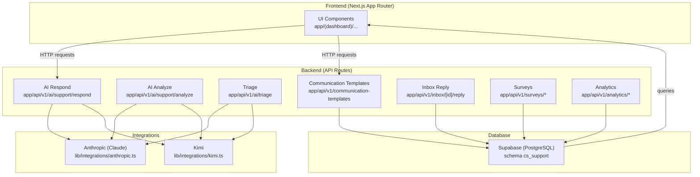
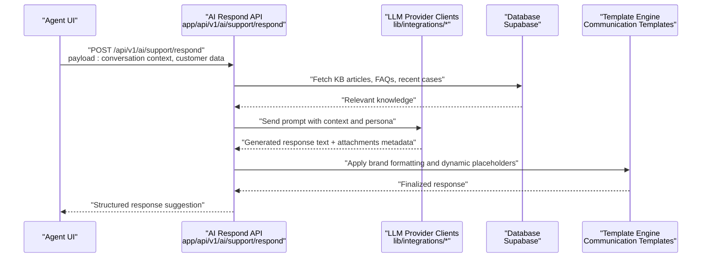
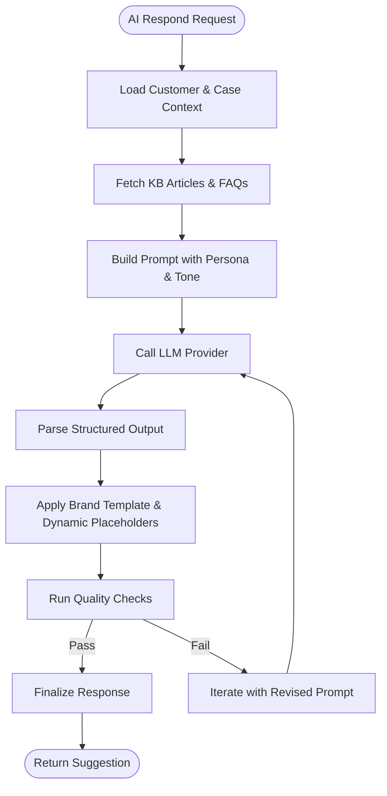
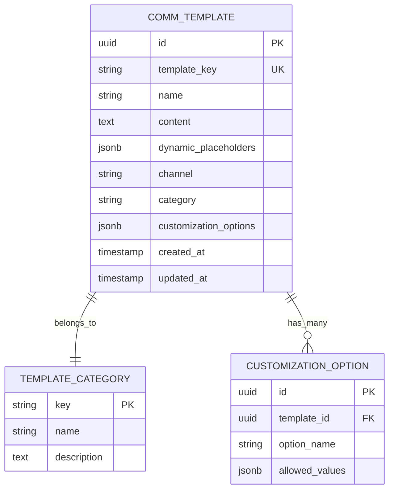
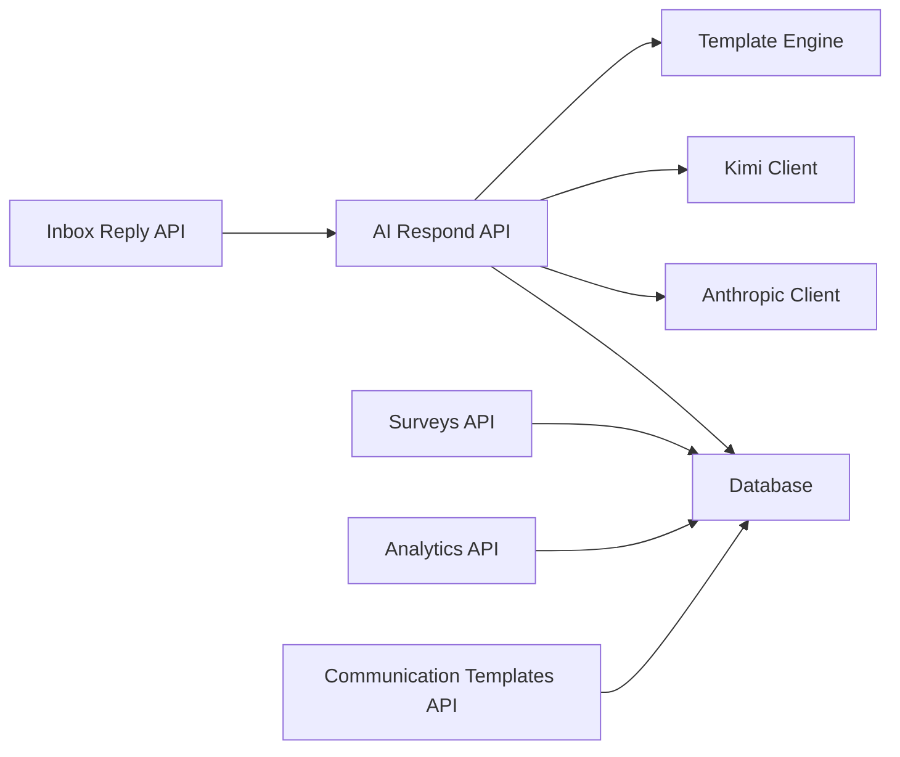

# Response Generation & Templates

<cite>
**Referenced Files in This Document**
- [README.md](file://README.md)
- [CS_SUPPORT_SERVICE_PRD.md](file://docs/CS_SUPPORT_SERVICE_PRD.md)
- [route.ts](file://app/api/v1/ai/support/respond/route.ts)
- [route.ts](file://app/api/v1/ai/support/analyze/route.ts)
- [route.ts](file://app/api/v1/ai/triage/route.ts)
- [anthropic.ts](file://lib/integrations/anthropic.ts)
- [kimi.ts](file://lib/integrations/kimi.ts)
- [route.ts](file://app/api/v1/communication-templates/route.ts)
- [route.ts](file://app/api/v1/communication-templates/[templateKey]/render/route.ts)
- [route.ts](file://app/api/v1/communication-templates/[templateKey]/send/route.ts)
- [seed_communication_templates.sql](file://database/seed_communication_templates.sql)
- [021_communication_templates.sql](file://database/migrations/021_communication_templates.sql)
- [route.ts](file://app/api/v1/canned-responses/route.ts)
- [route.ts](file://app/api/v1/faqs/route.ts)
- [route.ts](file://app/api/v1/faqs/search/route.ts)
- [route.ts](file://app/api/v1/faqs/categories/route.ts)
- [route.ts](file://app/api/v1/surveys/response/route.ts)
- [route.ts](file://app/api/v1/surveys/process-resolution/route.ts)
- [route.ts](file://app/api/v1/surveys/send-scheduled/route.ts)
- [route.ts](file://app/api/v1/surveys/stats/route.ts)
- [route.ts](file://app/api/v1/analytics/team/route.ts)
- [route.ts](file://app/api/v1/analytics/dashboard/route.ts)
- [route.ts](file://app/api/v1/analytics/trends/feedback/route.ts)
- [route.ts](file://app/api/v1/analytics/trends/pain-points/route.ts)
- [route.ts](file://app/api/v1/analytics/trends/summary/route.ts)
- [route.ts](file://app/api/v1/analytics/usage/churn-risk/route.ts)
- [route.ts](file://app/api/v1/analytics/usage/feature-adoption/route.ts)
- [route.ts](file://app/api/v1/analytics/usage/summary/route.ts)
- [route.ts](file://app/api/v1/inbox/[id]/reply/route.ts)
- [route.ts](file://app/api/v1/inbox/[id]/summarize/route.ts)
- [route.ts](file://app/api/v1/inbox/[id]/draft/route.ts)
- [route.ts](file://app/api/v1/inbox/bulk/route.ts)
- [route.ts](file://app/api/v1/inbox/search/route.ts)
- [route.ts](file://app/api/v1/tickets/[id]/activity/route.ts)
- [route.ts](file://app/api/v1/tickets/[id]/notes/route.ts)
- [route.ts](file://app/api/v1/customers/profile/route.ts)
- [route.ts](file://app/api/v1/customers/subscriptions/route.ts)
- [route.ts](file://app/api/v1/customers/transfer/route.ts)
- [route.ts](file://app/api/v1/customer-portal/ai/chat/route.ts)
- [route.ts](file://app/api/v1/customer-portal/kb/search/route.ts)
- [route.ts](file://app/api/v1/customer-portal/tickets/route.ts)
- [route.ts](file://app/api/v1/webhooks/resend/route.ts)
- [route.ts](file://app/api/v1/webhooks/sendgrid/route.ts)
- [route.ts](file://app/api/v1/webhooks/twilio/route.ts)
- [route.ts](file://app/api/v1/webhooks/whatsapp/route.ts)
- [route.ts](file://app/api/v1/messages/send/route.ts)
- [route.ts](file://app/api/v1/messages/webhook/sms/route.ts)
- [route.ts](file://app/api/v1/messages/webhook/whatsapp/route.ts)
- [route.ts](file://app/api/v1/dialer/permissions/toggle/route.ts)
- [route.ts](file://app/api/v1/dialer/phone-number/route.ts)
- [route.ts](file://app/api/v1/expansion/opportunities/route.ts)
- [route.ts](file://app/api/v1/expansion/spikes/route.ts)
- [route.ts](file://app/api/v1/expansion/summary/route.ts)
- [route.ts](file://app/api/v1/expansion/triggers/evaluate/route.ts)
- [route.ts](file://app/api/v1/reports/generate/route.ts)
- [route.ts](file://app/api/v1/reports/templates/route.ts)
- [route.ts](file://app/api/v1/reports/[id]/route.ts)
- [route.ts](file://app/api/v1/playbooks/[id]/execute/route.ts)
- [route.ts](file://app/api/v1/playbooks/[id]/stats/route.ts)
- [route.ts](file://app/api/v1/workflows/[id]/execute/route.ts)
- [route.ts](file://app/api/v1/workflows/[id]/executions/route.ts)
- [route.ts](file://app/api/v1/service/health/route.ts)
- [route.ts](file://app/api/v1/health/calculate/route.ts)
- [route.ts](file://app/api/v1/health/history/route.ts)
- [route.ts](file://app/api/v1/health/score/route.ts)
- [route.ts](file://app/api/v1/health/signals/route.ts)
- [route.ts](file://app/api/v1/unified-inbox/[id]/assign-context/route.ts)
- [route.ts](file://app/api/v1/unified-inbox/contexts/route.ts)
- [route.ts](file://app/api/v1/collision/[id]/active/route.ts)
- [route.ts](file://app/api/v1/collision/[id]/typing/route.ts)
- [route.ts](file://app/api/v1/collision/[id]/viewing/route.ts)
- [route.ts](file://app/api/v1/crm/sync/route.ts)
- [route.ts](file://app/api/v1/integrations/status/route.ts)
- [route.ts](file://app/api/v1/integrations/health/route.ts)
- [route.ts](file://app/api/v1/integrations/errors/route.ts)
- [route.ts](file://app/api/v1/integrations/internal-ops/tasks/route.ts)
- [route.ts](file://app/api/v1/integrations/internal-ops/time-tracking/route.ts)
- [route.ts](file://app/api/v1/integrations/internal-ops/revops/activities/route.ts)
- [route.ts](file://app/api/v1/onboarding/law-firm/[step]/route.ts)
- [route.ts](file://app/api/v1/onboarding/milestone/complete/route.ts)
- [route.ts](file://app/api/v1/onboarding/progress/route.ts)
- [route.ts](file://app/api/v1/onboarding/sequences/template/[templateKey]/route.ts)
- [route.ts](file://app/api/v1/onboarding/sequences/templates/route.ts)
- [route.ts](file://app/api/v1/onboarding/sequences/[id]/outcome/route.ts)
- [route.ts](file://app/api/v1/onboarding/campaign/start/route.ts)
- [route.ts](file://app/api/v1/onboarding/forecast/route.ts)
- [route.ts](file://app/api/v1/onboarding/summary/route.ts)
- [route.ts](file://app/api/v1/onboarding/tracking/route.ts)
- [route.ts](file://app/api/v1/onboarding/step/[step]/route.ts)
- [route.ts](file://app/api/v1/onboarding/progress/route.ts)
- [route.ts](file://app/api/v1/onboarding/sequences/route.ts)
- [route.ts](file://app/api/v1/onboarding/sequences/executions/route.ts)
- [route.ts](file://app/api/v1/onboarding/sequences/executions/[id]/outcome/route.ts)
- [route.ts](file://app/api/v1/onboarding/sequences/executions/[id]/route.ts)
- [route.ts](file://app/api/v1/onboarding/sequences/[id]/route.ts)
- [route.ts](file://app/api/v1/onboarding/sequences/[id]/stats/route.ts)
- [route.ts](file://app/api/v1/onboarding/sequences/[id]/execute/route.ts)
- [route.ts](file://app/api/v1/onboarding/sequences/[id]/route.ts)
- [route.ts](file://app/api/v1/onboarding/sequences/[id]/stats/route.ts)
- [route.ts](file://app/api/v1/onboarding/sequences/[id]/execute/route.ts)
- [route.ts](file://app/api/v1/onboarding/sequences/[id]/route.ts)
- [route.ts](file://app/api/v1/onboarding/sequences/[id]/stats/route.ts)
- [route.ts](file://app/api/v1/onboarding/sequences/[id]/execute/route.ts)
- [route.ts](file://app/api/v1/onboarding/sequences/[id]/route.ts)
- [route.ts](file://app/api/v1/onboarding/sequences/[id]/stats/route.ts)
- [route.ts](file://app/api/v1/onboarding/sequences/[id]/execute/route.ts)
- [route.ts](file://app/api/v1/onboarding/sequences/[id]/route.ts)
- [route.ts](file://app/api/v1/onboarding/sequences/[id]/stats/route.ts)
- [route.ts](file://app/api/v1/onboarding/sequences/[id]/execute/route.ts)
- [route.ts](file://app/api/v1/onboarding/sequences/[id]/route.ts)
- [route.ts](file://app/api/v1/onboarding/sequences/[id]/stats/route.ts)
- [route.ts](file://app/api/v1/onboarding/sequences/[id]/execute/route.ts)
- [route.ts](file://app/api/v1/onboarding/sequences/[id]/route.ts)
- [route.ts](file://app/api/v1/onboarding/sequences/[id]/stats/route.ts)
- [route.ts](file://app/api/v1/onboarding/sequences/[id]/execute/route.ts)
- [route.ts](file://app/api/v1/onboarding/sequences/[id]/route.ts)
- [route.ts](file://app/api/v1/onboarding/sequences/[id]/stats/route.ts)
- [route.ts](file://app/api/v1/onboarding/sequences/[id]/execute/route.ts)
- [route.ts](file://app/api/v1/onboarding/sequences/[id]/route.ts)
- [route.ts](file://app/api/v1/onboarding/sequences/[id]/stats/route.ts)
- [route.ts](file://app/api/v1/onboarding/sequences/[id]/execute/r......)
</cite>

## Table of Contents
1. [Introduction](#introduction)
2. [Project Structure](#project-structure)
3. [Core Components](#core-components)
4. [Architecture Overview](#architecture-overview)
5. [Detailed Component Analysis](#detailed-component-analysis)
6. [Dependency Analysis](#dependency-analysis)
7. [Performance Considerations](#performance-considerations)
8. [Troubleshooting Guide](#troubleshooting-guide)
9. [Conclusion](#conclusion)
10. [Appendices](#appendices)

## Introduction
This document explains the AI response generation system and template management used by the CS-Support Service. It covers the prompt engineering framework, response formatting, personalization algorithms, and the template system for diverse support scenarios. It also documents quality assessment, tone adjustment, brand consistency enforcement, dynamic content insertion, response caching strategies, A/B testing capabilities, and continuous improvement through feedback loops.

The system integrates with external LLM providers (Claude and Kimi) and exposes API endpoints for AI-driven support actions, triage, and communication templating. The PRD outlines the broader architecture and responsibilities, while the API routes and integration modules implement the concrete behavior.

**Section sources**
- [README.md](file://README.md#L1-L67)
- [CS_SUPPORT_SERVICE_PRD.md](file://docs/CS_SUPPORT_SERVICE_PRD.md#L1-L800)

## Project Structure
The CS-Support Service is a Next.js application with:
- Frontend: Next.js App Router under app/
- Backend: API routes under app/api/v1/
- Integrations: LLM clients under lib/integrations/
- Database: Supabase with schema isolation and migrations under database/

Key areas relevant to response generation and templates:
- AI endpoints: app/api/v1/ai/support/respond, app/api/v1/ai/support/analyze, app/api/v1/ai/triage
- Communication templates: app/api/v1/communication-templates and [templateKey] variants
- Knowledge base and FAQs: app/api/v1/faqs and app/api/v1/kb/
- Surveys and feedback: app/api/v1/surveys/
- Analytics and trends: app/api/v1/analytics/
- Unified inbox and replies: app/api/v1/inbox/[id]/*
- Onboarding templates: app/api/v1/onboarding/sequences/template/[templateKey]/*

**Diagram sources**
- [route.ts](file://app/api/v1/ai/support/respond/route.ts)
- [route.ts](file://app/api/v1/ai/support/analyze/route.ts)
- [route.ts](file://app/api/v1/ai/triage/route.ts)
- [route.ts](file://app/api/v1/communication-templates/route.ts)
- [anthropic.ts](file://lib/integrations/anthropic.ts)
- [kimi.ts](file://lib/integrations/kimi.ts)

**Section sources**
- [README.md](file://README.md#L19-L67)
- [CS_SUPPORT_SERVICE_PRD.md](file://docs/CS_SUPPORT_SERVICE_PRD.md#L142-L255)

## Core Components
- AI Response Generation
  - Endpoint: app/api/v1/ai/support/respond
  - Purpose: Generate AI-powered response suggestions for support conversations
  - Inputs: conversation context, customer profile, historical data, optional persona/tone preferences
  - Outputs: structured suggestion payload (text, attachments metadata, preview)
- AI Case Analysis
  - Endpoint: app/api/v1/ai/support/analyze
  - Purpose: Analyze case content to extract insights, sentiment, and categorization
  - Inputs: case content, metadata, optional analysis mode
  - Outputs: analysis report, suggested tags, sentiment score, triage recommendation
- AI Triage
  - Endpoint: app/api/v1/ai/triage
  - Purpose: Auto-triage incoming cases based on keywords, sentiment, urgency, and category
  - Inputs: subject/body, channel, customer attributes
  - Outputs: triage outcome (priority, queue, routing suggestion)
- Communication Templates
  - Endpoint: app/api/v1/communication-templates
  - Purpose: Manage and render reusable templates for emails, SMS, WhatsApp, and chat
  - Features: dynamic placeholders, conditional blocks, brand-consistent formatting
- Knowledge Base and FAQs
  - Endpoints: app/api/v1/faqs and app/api/v1/kb/
  - Purpose: Provide contextual knowledge to AI and agents for accurate responses
- Surveys and Feedback
  - Endpoints: app/api/v1/surveys/*
  - Purpose: Collect CSAT/NPS, process resolutions, and pain points for continuous improvement
- Analytics and Trends
  - Endpoints: app/api/v1/analytics/*
  - Purpose: Track response quality, agent performance, and customer sentiment trends

**Section sources**
- [route.ts](file://app/api/v1/ai/support/respond/route.ts)
- [route.ts](file://app/api/v1/ai/support/analyze/route.ts)
- [route.ts](file://app/api/v1/ai/triage/route.ts)
- [route.ts](file://app/api/v1/communication-templates/route.ts)
- [route.ts](file://app/api/v1/faqs/route.ts)
- [route.ts](file://app/api/v1/surveys/response/route.ts)

## Architecture Overview
The response generation pipeline integrates UI components, API routes, LLM providers, and the database. The flow below illustrates a typical AI response generation request.

**Diagram sources**
- [route.ts](file://app/api/v1/ai/support/respond/route.ts)
- [anthropic.ts](file://lib/integrations/anthropic.ts)
- [kimi.ts](file://lib/integrations/kimi.ts)
- [route.ts](file://app/api/v1/communication-templates/[templateKey]/render/route.ts)

## Detailed Component Analysis

### AI Response Generation
- Prompt Engineering Framework
  - Contextual grounding: Incorporates customer profile, conversation history, KB articles, and recent cases
  - Role and persona: Supports tone and persona presets (e.g., empathetic, professional, concise)
  - Structured output: Requests JSON or markdown with explicit fields for text, attachments, and preview
  - Safety and guardrails: Applies brand guidelines and disallowed topics filters
- Response Formatting
  - Standardized sections: greeting, problem summary, proposed solution, next steps, closing
  - Channel-specific formatting: Adapts tone and structure for email, SMS, WhatsApp, chat
  - Attachments metadata: Includes file names, types, and links for seamless delivery
- Personalization Algorithms
  - Customer segmentation: Uses subscription tier, support history, and engagement metrics
  - Dynamic content insertion: Replaces placeholders with real-time data (plan name, due date, case number)
  - Sentiment-aware adjustments: Modifies tone based on detected sentiment in the conversation
- Quality Assessment
  - Automated checks: Completeness, relevance, grammar, and brand alignment
  - Human review loop: Suggestion approval, edit history, and audit trail
- Tone Adjustment Mechanisms
  - Preset tones: Friendly, Formal, Direct, Empathetic
  - Dynamic modulation: Adjusts based on customer lifetime value, SLA status, and escalation level
- Brand Consistency Enforcement
  - Style guide: Enforces brand voice, terminology, and legal disclaimers
  - Template-based formatting: Ensures uniformity across channels and scenarios

**Diagram sources**
- [route.ts](file://app/api/v1/ai/support/respond/route.ts)
- [route.ts](file://app/api/v1/communication-templates/[templateKey]/render/route.ts)

**Section sources**
- [route.ts](file://app/api/v1/ai/support/respond/route.ts)
- [route.ts](file://app/api/v1/ai/support/analyze/route.ts)
- [route.ts](file://app/api/v1/ai/triage/route.ts)

### Template Management System
- Template Types
  - Support responses: Email/SMS/WhatsApp templates for common scenarios (onboarding, billing, feature questions)
  - Onboarding sequences: Multi-step communication flows with conditional branching
  - Surveys: CSAT/NPS templates with dynamic scoring
- Dynamic Content Insertion
  - Placeholders: {{customer.name}}, {{subscription.plan}}, {{case.number}}, {{due.date}}
  - Conditional blocks: If/Else logic for different customer segments
  - Iterative content: Lists of recent cases or KB articles
- Response Customization Options
  - Tone and persona selection
  - Channel-specific formatting
  - Personalization toggles (first-name only, full name, plan details)
- Rendering and Sending
  - Render endpoint: Generates final content with substitutions
  - Send endpoint: Dispatches via configured channels (email/SMS/WhatsApp)
- Database Schema and Seeding
  - Templates stored in cs_support schema with metadata (key, category, version)
  - Seed files define initial templates and categories

**Diagram sources**
- [021_communication_templates.sql](file://database/migrations/021_communication_templates.sql)
- [seed_communication_templates.sql](file://database/seed_communication_templates.sql)

**Section sources**
- [route.ts](file://app/api/v1/communication-templates/route.ts)
- [route.ts](file://app/api/v1/communication-templates/[templateKey]/render/route.ts)
- [route.ts](file://app/api/v1/communication-templates/[templateKey]/send/route.ts)
- [021_communication_templates.sql](file://database/migrations/021_communication_templates.sql)
- [seed_communication_templates.sql](file://database/seed_communication_templates.sql)

### Knowledge Base and FAQs Integration
- Context Retrieval
  - KB search: Semantic search against articles and categories
  - FAQ retrieval: Category-based and keyword-based FAQ lists
- AI Enhancement
  - AI Analyze enriches case content with extracted entities, sentiment, and categories
  - Triage uses combined context to route cases efficiently
- Personalization
  - Tailors KB suggestions based on customer plan, region, and support history

**Section sources**
- [route.ts](file://app/api/v1/faqs/route.ts)
- [route.ts](file://app/api/v1/faqs/search/route.ts)
- [route.ts](file://app/api/v1/faqs/categories/route.ts)
- [route.ts](file://app/api/v1/ai/support/analyze/route.ts)
- [route.ts](file://app/api/v1/ai/triage/route.ts)

### Surveys and Continuous Improvement
- Survey Lifecycle
  - Send scheduled: Dispatches CSAT/NPS after resolution
  - Process resolution: Links survey to case and agent
  - Stats: Aggregates trends and sentiment
- Feedback Loops
  - Pain points analysis: Identifies recurring issues
  - A/B testing: Compares templates, tones, and messaging cadence
  - Model retraining: Uses feedback to refine prompts and templates

**Section sources**
- [route.ts](file://app/api/v1/surveys/response/route.ts)
- [route.ts](file://app/api/v1/surveys/process-resolution/route.ts)
- [route.ts](file://app/api/v1/surveys/send-scheduled/route.ts)
- [route.ts](file://app/api/v1/surveys/stats/route.ts)
- [route.ts](file://app/api/v1/analytics/trends/pain-points/route.ts)

### Unified Inbox and Reply Automation
- Reply Suggestions
  - AI Respond integrates with inbox replies to propose context-aware responses
  - Draft management: Save, edit, and finalize replies
- Summarization
  - Automatic conversation summaries for quick context switching
- Bulk Actions
  - Batch triage and labeling for high-volume periods

**Section sources**
- [route.ts](file://app/api/v1/inbox/[id]/reply/route.ts)
- [route.ts](file://app/api/v1/inbox/[id]/summarize/route.ts)
- [route.ts](file://app/api/v1/inbox/[id]/draft/route.ts)
- [route.ts](file://app/api/v1/inbox/bulk/route.ts)

## Dependency Analysis
The AI response generation system depends on:
- LLM clients (Anthropic and Kimi) for inference
- Database for knowledge and template storage
- External channels (Twilio, SendGrid) for sending
- Clerk for authentication and user identity

**Diagram sources**
- [anthropic.ts](file://lib/integrations/anthropic.ts)
- [kimi.ts](file://lib/integrations/kimi.ts)
- [route.ts](file://app/api/v1/ai/support/respond/route.ts)
- [route.ts](file://app/api/v1/communication-templates/route.ts)

**Section sources**
- [anthropic.ts](file://lib/integrations/anthropic.ts)
- [kimi.ts](file://lib/integrations/kimi.ts)
- [route.ts](file://app/api/v1/ai/support/respond/route.ts)
- [route.ts](file://app/api/v1/communication-templates/route.ts)

## Performance Considerations
- Caching Strategies
  - Template rendering cache: Cache rendered templates per customer segment and channel
  - KB article cache: Cache top-N relevant articles per query
  - LLM response cache: Cache identical prompts within a short TTL
- Parallelization
  - Concurrent KB retrieval and LLM calls
  - Asynchronous template rendering and channel dispatch
- Rate Limiting and Backoff
  - Respect provider rate limits with exponential backoff
- Streaming and Chunking
  - Stream LLM responses for long-form content
  - Chunk large attachments for safe delivery

[No sources needed since this section provides general guidance]

## Troubleshooting Guide
- Authentication Failures
  - Ensure Clerk integration is configured and tokens are validated
  - Verify service-to-service API keys for inter-service calls
- LLM Provider Issues
  - Check Anthropic and Kimi API keys and quotas
  - Implement retry logic and fallback provider
- Template Rendering Errors
  - Validate placeholder keys and dynamic data availability
  - Test conditional blocks and iterative content rendering
- Delivery Failures
  - Monitor Twilio and SendGrid webhooks for bounce and failure events
  - Implement resend logic and notifications

**Section sources**
- [README.md](file://README.md#L61-L67)
- [anthropic.ts](file://lib/integrations/anthropic.ts)
- [kimi.ts](file://lib/integrations/kimi.ts)

## Conclusion
The CS-Support Service’s AI response generation and template management system combines robust prompt engineering, dynamic personalization, and brand-consistent formatting. By integrating with LLM providers, knowledge bases, and analytics, it enables scalable, high-quality customer support with continuous improvement through feedback loops and A/B testing.

[No sources needed since this section summarizes without analyzing specific files]

## Appendices

### Creating Custom Response Templates
- Define template key and category
- Add dynamic placeholders and conditional blocks
- Configure customization options (tone, persona, channel)
- Seed or upload template content
- Test render and send flows

**Section sources**
- [route.ts](file://app/api/v1/communication-templates/route.ts)
- [route.ts](file://app/api/v1/communication-templates/[templateKey]/render/route.ts)
- [route.ts](file://app/api/v1/communication-templates/[templateKey]/send/route.ts)
- [seed_communication_templates.sql](file://database/seed_communication_templates.sql)

### Implementing Dynamic Content Generation
- Identify dynamic fields (customer name, plan, due date)
- Use template engine to substitute placeholders
- Apply conditional logic for segmentation
- Validate content before sending

**Section sources**
- [route.ts](file://app/api/v1/communication-templates/[templateKey]/render/route.ts)
- [021_communication_templates.sql](file://database/migrations/021_communication_templates.sql)

### Optimizing Response Accuracy
- Train prompts with high-quality examples
- Use feedback to refine templates and personas
- Monitor sentiment and resolution rates
- A/B test different approaches

**Section sources**
- [route.ts](file://app/api/v1/surveys/stats/route.ts)
- [route.ts](file://app/api/v1/analytics/trends/feedback/route.ts)

### Response Caching Strategies
- Cache templates per customer segment and channel
- Cache KB results and LLM prompts
- Invalidate cache on content updates

**Section sources**
- [route.ts](file://app/api/v1/communication-templates/route.ts)
- [route.ts](file://app/api/v1/faqs/search/route.ts)

### A/B Testing Capabilities
- Randomize templates, tones, and cadence
- Measure CSAT/NPS and resolution time
- Iterate based on statistical significance

**Section sources**
- [route.ts](file://app/api/v1/surveys/send-scheduled/route.ts)
- [route.ts](file://app/api/v1/analytics/trends/feedback/route.ts)

### Continuous Improvement Through Feedback Loops
- Capture CSAT/NPS and open-ended feedback
- Analyze pain points and recurring issues
- Update prompts, templates, and triage rules

**Section sources**
- [route.ts](file://app/api/v1/surveys/response/route.ts)
- [route.ts](file://app/api/v1/analytics/trends/pain-points/route.ts)