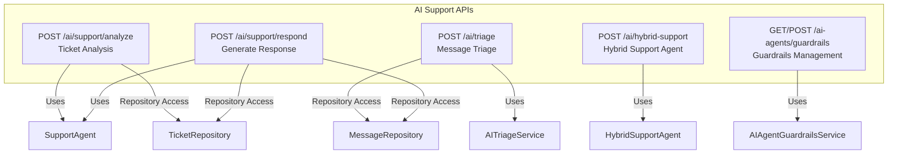
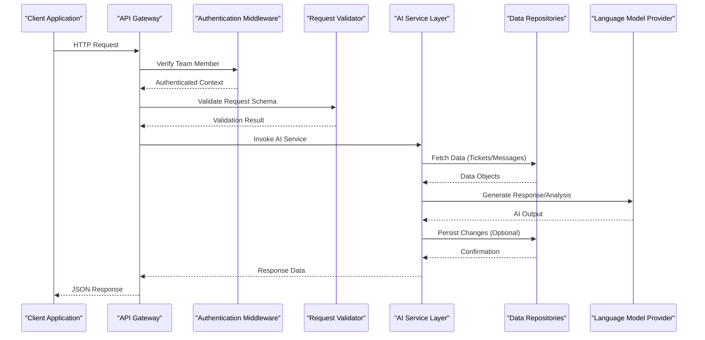
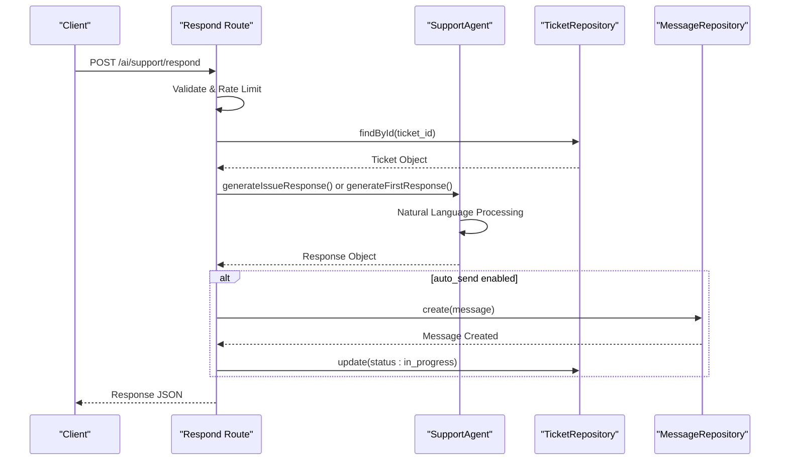
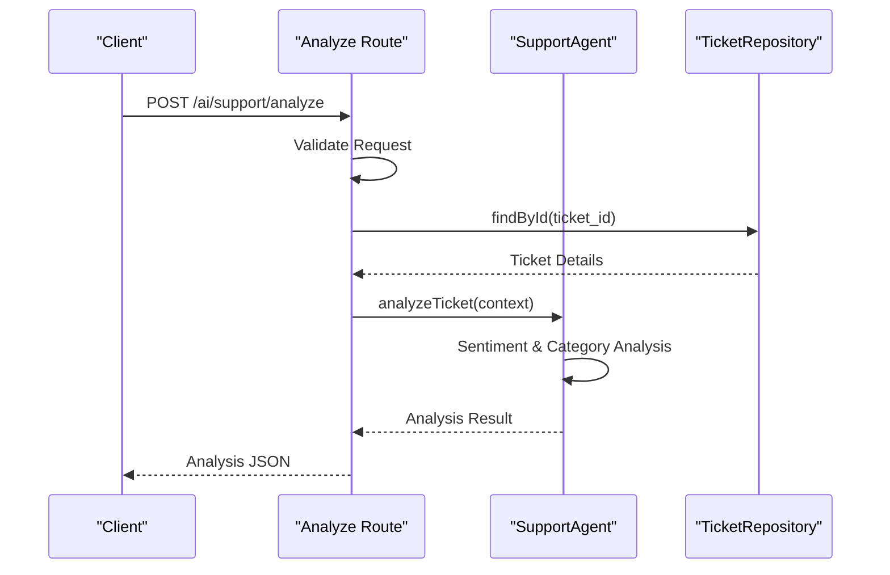
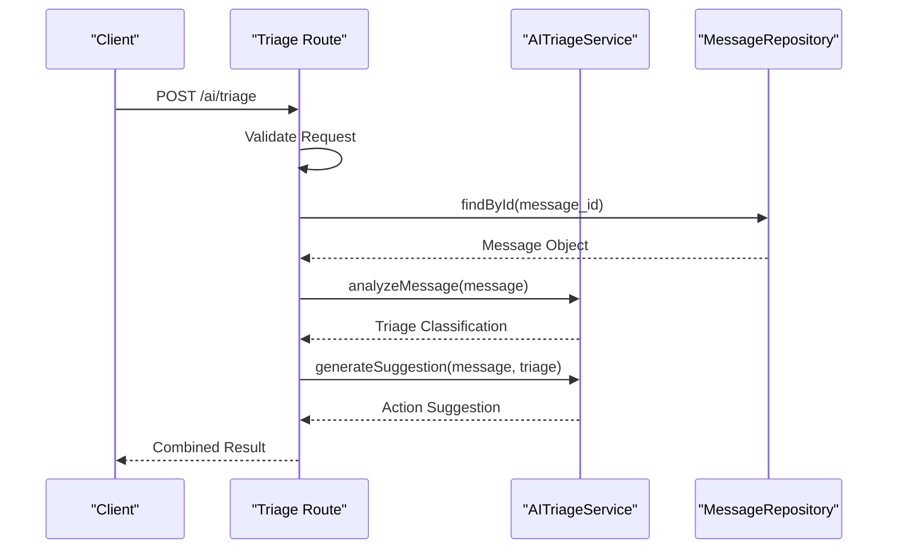
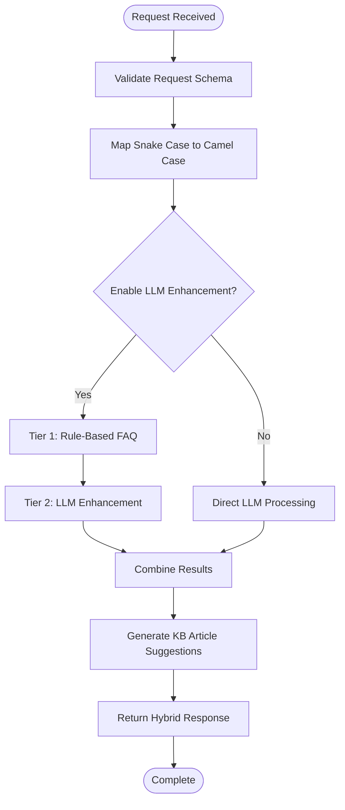
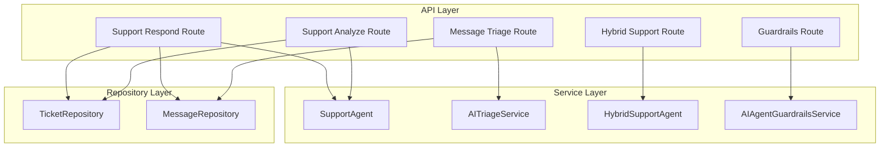

# AI Agent Services API

<cite>
**Referenced Files in This Document**
- [route.ts](file://app/api/v1/ai/support/respond/route.ts)
- [route.ts](file://app/api/v1/ai/support/analyze/route.ts)
- [route.ts](file://app/api/v1/ai/triage/route.ts)
- [route.ts](file://app/api/v1/ai/hybrid-support/route.ts)
- [route.ts](file://app/api/v1/ai-agents/guardrails/route.ts)
</cite>

## Table of Contents
1. [Introduction](#introduction)
2. [Project Structure](#project-structure)
3. [Core Components](#core-components)
4. [Architecture Overview](#architecture-overview)
5. [Detailed Component Analysis](#detailed-component-analysis)
6. [Dependency Analysis](#dependency-analysis)
7. [Performance Considerations](#performance-considerations)
8. [Troubleshooting Guide](#troubleshooting-guide)
9. [Conclusion](#conclusion)

## Introduction
This document provides comprehensive API documentation for AI-powered customer service automation, covering:
- Support response generation with natural language processing and intelligent routing
- Case analysis and triage for automated categorization and prioritization
- Hybrid support coordination combining rule-based FAQ with LLM enhancement
- Guardrail configurations and content moderation for safe AI interactions

The APIs described here enable intelligent customer support automation, integrating sentiment-aware responses, confidence scoring, escalation detection, and contextual KB article suggestions.

## Project Structure
The AI agent services are implemented as Next.js API routes under `/api/v1/ai`. Each endpoint encapsulates a specific AI capability with standardized request validation, rate limiting, and authentication middleware.

**Diagram sources**
- [route.ts](file://app/api/v1/ai/support/respond/route.ts#L11-L16)
- [route.ts](file://app/api/v1/ai/support/analyze/route.ts#L11-L16)
- [route.ts](file://app/api/v1/ai/triage/route.ts#L3-L5)
- [route.ts](file://app/api/v1/ai/hybrid-support/route.ts#L10-L11)
- [route.ts](file://app/api/v1/ai-agents/guardrails/route.ts#L9-L10)

**Section sources**
- [route.ts](file://app/api/v1/ai/support/respond/route.ts#L1-L109)
- [route.ts](file://app/api/v1/ai/support/analyze/route.ts#L1-L70)
- [route.ts](file://app/api/v1/ai/triage/route.ts#L1-L45)
- [route.ts](file://app/api/v1/ai/hybrid-support/route.ts#L1-L79)
- [route.ts](file://app/api/v1/ai-agents/guardrails/route.ts#L1-L43)

## Core Components
This section documents the primary AI agent APIs, their request/response schemas, and integration patterns.

### Support Response Generation API
Generates AI-powered responses to support tickets with optional automatic sending and escalation detection.

**Endpoint**: `POST /api/v1/ai/support/respond`

**Request Schema**:
- ticket_id: string (UUID) - Required
- issue_type: enum ["password_reset","service_status","feature_request","billing","general"] - Optional
- auto_send: boolean - Optional, default false

**Response Schema**:
- response: string - Generated response text
- confidence: number - Confidence score (0-1)
- should_escalate: boolean - Whether escalation is recommended
- escalation_reason: string - Reason for escalation (if applicable)
- suggested_actions: array[string] - Action items suggested by AI
- kb_articles: array[string] - Knowledge base article references
- auto_sent: boolean - Whether message was automatically sent

**Processing Logic**:
1. Validates request payload and authenticates team member
2. Retrieves ticket details via TicketRepository
3. Builds AgentContext from ticket metadata
4. Calls SupportAgent.generateIssueResponse() or generateFirstResponse()
5. Optionally creates message and updates ticket status if auto_send is enabled

**Section sources**
- [route.ts](file://app/api/v1/ai/support/respond/route.ts#L18-L22)
- [route.ts](file://app/api/v1/ai/support/respond/route.ts#L37-L38)
- [route.ts](file://app/api/v1/ai/support/respond/route.ts#L46-L55)
- [route.ts](file://app/api/v1/ai/support/respond/route.ts#L57-L65)
- [route.ts](file://app/api/v1/ai/support/respond/route.ts#L67-L89)
- [route.ts](file://app/api/v1/ai/support/respond/route.ts#L91-L99)

### Support Ticket Analysis API
Analyzes tickets to provide triage information, sentiment insights, and categorization.

**Endpoint**: `POST /api/v1/ai/support/analyze`

**Request Schema**:
- ticket_id: string (UUID) - Required

**Response Schema**:
- sentiment: string - Sentiment classification
- priority: string - Priority recommendation
- category: string - Issue category
- confidence: number - Analysis confidence score
- keywords: array[string] - Extracted keywords
- suggested_actions: array[string] - Recommended actions

**Processing Logic**:
1. Validates request and authenticates team member
2. Retrieves ticket via TicketRepository
3. Builds AgentContext with tenant information
4. Calls SupportAgent.analyzeTicket() for comprehensive analysis

**Section sources**
- [route.ts](file://app/api/v1/ai/support/analyze/route.ts#L18-L20)
- [route.ts](file://app/api/v1/ai/support/analyze/route.ts#L35-L36)
- [route.ts](file://app/api/v1/ai/support/analyze/route.ts#L44-L54)
- [route.ts](file://app/api/v1/ai/support/analyze/route.ts#L57-L58)

### AI Message Triage API
Analyzes incoming messages to provide triage classification and action suggestions.

**Endpoint**: `POST /api/v1/ai/triage`

**Request Schema**:
- message_id: string (UUID) - Required

**Response Schema**:
- triage: object - Triage classification result
- suggestion: object - Action suggestion for handling

**Processing Logic**:
1. Validates request and authenticates team member
2. Retrieves message via MessageRepository
3. Calls AITriageService.analyzeMessage() for classification
4. Generates suggestion via AITriageService.generateSuggestion()

**Section sources**
- [route.ts](file://app/api/v1/ai/triage/route.ts#L8-L10)
- [route.ts](file://app/api/v1/ai/triage/route.ts#L23-L29)
- [route.ts](file://app/api/v1/ai/triage/route.ts#L31-L35)

### Hybrid Support Agent API
Processes customer queries through a two-tier architecture: rule-based FAQ + LLM enhancement.

**Endpoint**: `POST /api/v1/ai/hybrid-support`

**Request Schema**:
- query: string (1-1000 chars) - Required
- tenant_id: string (UUID) - Optional
- customer_context: object - Optional
  - customer_email: string (email) - Optional
  - customer_name: string - Optional
  - practice_area: string - Optional
  - health_score: number (0-100) - Optional
- conversation_history: array[{role: enum["user","assistant"], content: string}] - Optional
- enable_llm_enhancement: boolean - Optional, default true

**Response Schema**:
- success: boolean - Operation status
- data: object - Hybrid agent response
  - response: string - Generated response
  - confidence: number - Confidence score
  - kb_articles: array[string] - Knowledge base references
  - suggested_actions: array[string] - Actions suggested
  - tier_used: string - "rule_based" or "llm_enhanced"

**Processing Logic**:
1. Requires authentication (different from other endpoints)
2. Validates request schema with Zod
3. Maps snake_case API fields to camelCase agent interface
4. Calls HybridSupportAgent.processQuery() for processing

**Section sources**
- [route.ts](file://app/api/v1/ai/hybrid-support/route.ts#L14-L28)
- [route.ts](file://app/api/v1/ai/hybrid-support/route.ts#L40-L54)
- [route.ts](file://app/api/v1/ai/hybrid-support/route.ts#L56-L62)

### AI Agent Guardrails API
Manages guardrails and safety configurations for AI agents.

**Endpoints**:
- `GET /api/v1/ai-agents/guardrails` - Retrieve guardrails
- `POST /api/v1/ai-agents/guardrails` - Save guardrails configuration

**Request Schema** (POST):
- agent_id: string - Required
- agent_name: string - Required
- guardrails: object - Guardrails configuration

**Response Schema**:
- message: string - Operation result

**Processing Logic**:
1. Both endpoints require team member authentication
2. GET returns default guardrails for support_agent type
3. POST saves guardrails configuration with timestamps

**Section sources**
- [route.ts](file://app/api/v1/ai-agents/guardrails/route.ts#L13-L22)
- [route.ts](file://app/api/v1/ai-agents/guardrails/route.ts#L25-L42)

## Architecture Overview
The AI agent services follow a layered architecture with clear separation of concerns:

**Diagram sources**
- [route.ts](file://app/api/v1/ai/support/respond/route.ts#L24-L35)
- [route.ts](file://app/api/v1/ai/support/analyze/route.ts#L22-L33)
- [route.ts](file://app/api/v1/ai/triage/route.ts#L16-L21)
- [route.ts](file://app/api/v1/ai/hybrid-support/route.ts#L30-L38)

## Detailed Component Analysis

### Support Response Generation Flow

**Diagram sources**
- [route.ts](file://app/api/v1/ai/support/respond/route.ts#L24-L107)

### Ticket Analysis Flow

**Diagram sources**
- [route.ts](file://app/api/v1/ai/support/analyze/route.ts#L22-L68)

### Message Triage Flow

**Diagram sources**
- [route.ts](file://app/api/v1/ai/triage/route.ts#L16-L44)

### Hybrid Support Processing Flow

**Diagram sources**
- [route.ts](file://app/api/v1/ai/hybrid-support/route.ts#L30-L62)

## Dependency Analysis
The AI agent services demonstrate clean dependency inversion with clear interfaces:

**Diagram sources**
- [route.ts](file://app/api/v1/ai/support/respond/route.ts#L11-L16)
- [route.ts](file://app/api/v1/ai/support/analyze/route.ts#L11-L16)
- [route.ts](file://app/api/v1/ai/triage/route.ts#L3-L5)
- [route.ts](file://app/api/v1/ai/hybrid-support/route.ts#L10-L11)
- [route.ts](file://app/api/v1/ai-agents/guardrails/route.ts#L9-L10)

**Section sources**
- [route.ts](file://app/api/v1/ai/support/respond/route.ts#L11-L16)
- [route.ts](file://app/api/v1/ai/support/analyze/route.ts#L11-L16)
- [route.ts](file://app/api/v1/ai/triage/route.ts#L3-L5)
- [route.ts](file://app/api/v1/ai/hybrid-support/route.ts#L10-L11)
- [route.ts](file://app/api/v1/ai-agents/guardrails/route.ts#L9-L10)

## Performance Considerations
- Rate limiting is implemented at the route level to prevent abuse
- Request validation occurs before any business logic to minimize unnecessary processing
- Repository pattern ensures efficient data access and potential caching opportunities
- Hybrid agent supports disabling LLM enhancement for cost optimization
- Response objects include confidence scores to enable client-side optimization

## Troubleshooting Guide
Common error scenarios and resolution strategies:

**Authentication Failures**
- Symptom: 401 Unauthorized responses
- Cause: Missing or invalid authentication credentials
- Resolution: Ensure proper authentication middleware is configured

**Validation Errors**
- Symptom: 400 Bad Request with validation details
- Cause: Invalid request schema or missing required fields
- Resolution: Review request payload against documented schemas

**Resource Not Found**
- Symptom: 404 responses for tickets/messages
- Cause: Invalid UUID or deleted resources
- Resolution: Verify resource IDs exist in the system

**Service Errors**
- Symptom: 500 Internal Server Error
- Cause: LLM provider issues or repository failures
- Resolution: Check service logs and retry after cooldown period

**Section sources**
- [route.ts](file://app/api/v1/ai/support/respond/route.ts#L100-L105)
- [route.ts](file://app/api/v1/ai/support/analyze/route.ts#L61-L66)
- [route.ts](file://app/api/v1/ai/triage/route.ts#L41-L43)
- [route.ts](file://app/api/v1/ai/hybrid-support/route.ts#L63-L77)

## Conclusion
The AI agent services provide a robust foundation for customer service automation with clear separation of concerns, comprehensive request validation, and extensible architecture. The APIs support both individual capabilities (response generation, analysis, triage) and integrated solutions (hybrid support) while maintaining security through authentication and guardrails. The modular design enables easy extension for additional AI capabilities and integration with existing customer support workflows.