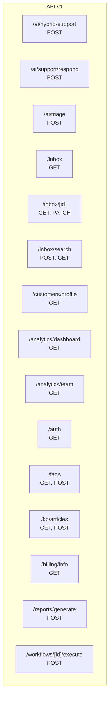
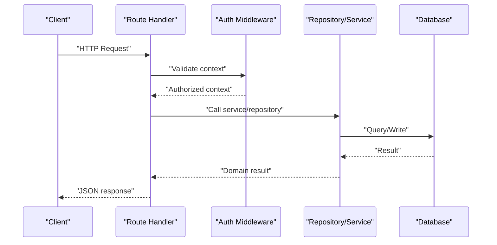
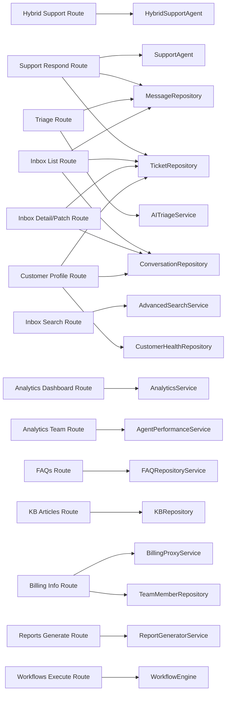

# API Documentation

<cite>
**Referenced Files in This Document**
- [route.ts](file://app/api/v1/ai/hybrid-support/route.ts)
- [route.ts](file://app/api/v1/ai/support/respond/route.ts)
- [route.ts](file://app/api/v1/ai/triage/route.ts)
- [route.ts](file://app/api/v1/inbox/route.ts)
- [route.ts](file://app/api/v1/inbox/[id]/route.ts)
- [route.ts](file://app/api/v1/inbox/search/route.ts)
- [route.ts](file://app/api/v1/customers/profile/route.ts)
- [route.ts](file://app/api/v1/analytics/dashboard/route.ts)
- [route.ts](file://app/api/v1/analytics/team/route.ts)
- [route.ts](file://app/api/v1/auth/route.ts)
- [route.ts](file://app/api/v1/faqs/route.ts)
- [route.ts](file://app/api/v1/kb/articles/route.ts)
- [route.ts](file://app/api/v1/billing/info/route.ts)
- [route.ts](file://app/api/v1/reports/generate/route.ts)
- [route.ts](file://app/api/v1/workflows/[id]/execute/route.ts)
</cite>

## Table of Contents
1. [Introduction](#introduction)
2. [Project Structure](#project-structure)
3. [Core Components](#core-components)
4. [Architecture Overview](#architecture-overview)
5. [Detailed Component Analysis](#detailed-component-analysis)
6. [Dependency Analysis](#dependency-analysis)
7. [Performance Considerations](#performance-considerations)
8. [Troubleshooting Guide](#troubleshooting-guide)
9. [Conclusion](#conclusion)
10. [Appendices](#appendices)

## Introduction
This document provides comprehensive API documentation for the CS Support Service REST endpoints. It covers AI agent endpoints for support responses, inbox management for customer conversations, customer profile operations, analytics dashboards, administrative functions, and reporting. For each endpoint, you will find HTTP method, URL pattern, authentication requirements, request/response schemas, parameter specifications, validation rules, error response formats, rate limiting, pagination patterns, and API versioning strategy. Practical examples using curl commands and code snippets are included to demonstrate common use cases.

## Project Structure
The API surface is organized under the Next.js App Router at app/api/v1. Each endpoint is implemented as a route handler module exporting GET, POST, PATCH, DELETE, etc., handlers as needed. Authentication is enforced via middleware wrappers, and responses follow standardized helpers.

**Diagram sources**
- [route.ts](file://app/api/v1/ai/hybrid-support/route.ts#L1-L79)
- [route.ts](file://app/api/v1/ai/support/respond/route.ts#L1-L109)
- [route.ts](file://app/api/v1/ai/triage/route.ts#L1-L45)
- [route.ts](file://app/api/v1/inbox/route.ts#L1-L96)
- [route.ts](file://app/api/v1/inbox/[id]/route.ts#L1-L83)
- [route.ts](file://app/api/v1/inbox/search/route.ts#L1-L113)
- [route.ts](file://app/api/v1/customers/profile/route.ts#L1-L103)
- [route.ts](file://app/api/v1/analytics/dashboard/route.ts#L1-L52)
- [route.ts](file://app/api/v1/analytics/team/route.ts#L1-L44)
- [route.ts](file://app/api/v1/auth/route.ts#L1-L32)
- [route.ts](file://app/api/v1/faqs/route.ts#L1-L155)
- [route.ts](file://app/api/v1/kb/articles/route.ts#L1-L93)
- [route.ts](file://app/api/v1/billing/info/route.ts#L1-L75)
- [route.ts](file://app/api/v1/reports/generate/route.ts#L1-L53)
- [route.ts](file://app/api/v1/workflows/[id]/execute/route.ts#L1-L42)

**Section sources**
- [route.ts](file://app/api/v1/ai/hybrid-support/route.ts#L1-L79)
- [route.ts](file://app/api/v1/ai/support/respond/route.ts#L1-L109)
- [route.ts](file://app/api/v1/ai/triage/route.ts#L1-L45)
- [route.ts](file://app/api/v1/inbox/route.ts#L1-L96)
- [route.ts](file://app/api/v1/inbox/[id]/route.ts#L1-L83)
- [route.ts](file://app/api/v1/inbox/search/route.ts#L1-L113)
- [route.ts](file://app/api/v1/customers/profile/route.ts#L1-L103)
- [route.ts](file://app/api/v1/analytics/dashboard/route.ts#L1-L52)
- [route.ts](file://app/api/v1/analytics/team/route.ts#L1-L44)
- [route.ts](file://app/api/v1/auth/route.ts#L1-L32)
- [route.ts](file://app/api/v1/faqs/route.ts#L1-L155)
- [route.ts](file://app/api/v1/kb/articles/route.ts#L1-L93)
- [route.ts](file://app/api/v1/billing/info/route.ts#L1-L75)
- [route.ts](file://app/api/v1/reports/generate/route.ts#L1-L53)
- [route.ts](file://app/api/v1/workflows/[id]/execute/route.ts#L1-L42)

## Core Components
- Authentication and Authorization
  - Team member context enforced via middleware wrappers. Handlers return 401 Unauthorized when unauthenticated and 403 Forbidden when insufficient privileges.
  - Some endpoints accept Clerk-authenticated users; others accept API keys for server-to-server integrations.
- Response Helpers
  - Standardized success and error responses are returned using helper utilities.
- Pagination
  - Pagination is supported via query parameters page and limit, with offset computed internally.
- Validation
  - Zod schemas define request body and query parameter validation for robust input sanitization.
- Rate Limiting
  - Some endpoints apply rate limits to protect resources (e.g., AI response generation).

**Section sources**
- [route.ts](file://app/api/v1/ai/support/respond/route.ts#L24-L108)
- [route.ts](file://app/api/v1/billing/info/route.ts#L27-L74)
- [route.ts](file://app/api/v1/inbox/route.ts#L13-L94)
- [route.ts](file://app/api/v1/faqs/route.ts#L19-L69)

## Architecture Overview
The API follows a layered architecture:
- Route handlers orchestrate requests, enforce auth, parse and validate inputs, and delegate to services/repositories.
- Services encapsulate business logic (e.g., analytics, triage, workflows).
- Repositories abstract data access.
- Middleware handles authentication, rate limiting, and audit logging.

**Diagram sources**
- [route.ts](file://app/api/v1/ai/support/respond/route.ts#L24-L108)
- [route.ts](file://app/api/v1/inbox/route.ts#L13-L94)
- [route.ts](file://app/api/v1/analytics/dashboard/route.ts#L17-L51)

## Detailed Component Analysis

### AI Agent Endpoints

#### POST /api/v1/ai/hybrid-support
- Purpose: Process customer queries through a hybrid Tier 1 (rule-based FAQ) + Tier 2 (LLM enhancement) pipeline.
- Authentication: Team member required.
- Request body schema:
  - query: string (1–1000 chars)
  - tenant_id: uuid (optional)
  - customer_context: object (optional)
    - customer_email: email (optional)
    - customer_name: string (optional)
    - practice_area: string (optional)
    - health_score: number 0–100 (optional)
  - conversation_history: array of { role: enum("user","assistant"), content: string } (optional)
  - enable_llm_enhancement: boolean (default true)
- Response:
  - success: boolean
  - data: agent response object (content, confidence, etc.)
- Errors:
  - 400: Validation error with details
  - 500: Internal error
- Example curl:
  - curl -X POST https://your-host/api/v1/ai/hybrid-support -H "Authorization: Bearer <team-member-token>" -d '{...}'
- Notes:
  - Uses Zod schema validation and maps snake_case API fields to camelCase agent request fields.

**Section sources**
- [route.ts](file://app/api/v1/ai/hybrid-support/route.ts#L14-L28)
- [route.ts](file://app/api/v1/ai/hybrid-support/route.ts#L30-L78)

#### POST /api/v1/ai/support/respond
- Purpose: Generate an AI response to a ticket; optionally auto-send the message and update ticket status.
- Authentication: Team member required; rate-limited (window 60s, max 10 requests).
- Request body schema:
  - ticket_id: uuid (required)
  - issue_type: enum("password_reset","service_status","feature_request","billing","general") (optional)
  - auto_send: boolean (default false)
- Response:
  - response: string
  - confidence: number
  - should_escalate: boolean
  - escalation_reason: string (optional)
  - suggested_actions: array (optional)
  - kb_articles: array (optional)
  - auto_sent: boolean (only when auto_send=true and not escalated)
- Errors:
  - 404: Ticket not found
  - 500: Internal error
- Example curl:
  - curl -X POST https://your-host/api/v1/ai/support/respond -H "Authorization: Bearer <team-member-token>" -d '{ "ticket_id": "...", "issue_type": "billing", "auto_send": true }'

**Section sources**
- [route.ts](file://app/api/v1/ai/support/respond/route.ts#L18-L22)
- [route.ts](file://app/api/v1/ai/support/respond/route.ts#L24-L108)

#### POST /api/v1/ai/triage
- Purpose: Analyze a message and provide triage result with AI suggestions.
- Authentication: Team member required.
- Request body schema:
  - message_id: uuid (required)
- Response:
  - triage: triage result object
  - suggestion: suggestion object
- Errors:
  - 404: Message not found
  - 500: Internal error

**Section sources**
- [route.ts](file://app/api/v1/ai/triage/route.ts#L8-L10)
- [route.ts](file://app/api/v1/ai/triage/route.ts#L16-L44)

### Inbox Management

#### GET /api/v1/inbox
- Purpose: List conversations with associated ticket details and previews; supports filtering and pagination.
- Authentication: Team member required.
- Query parameters:
  - page: integer (default 1)
  - limit: integer (default 50)
  - channel: string (optional)
  - status: string (optional)
  - assigned_to: string ("me" or "unassigned" supported) (optional)
  - search: string (optional)
- Response:
  - conversations: array of items with fields like conversation_id, ticket_id, channel, customer_email, customer_name, subject, last_message_at, last_message_preview, unread_count, status, priority, assigned_to, tenant_id, created_at
  - pagination: { page, limit, total }
- Errors:
  - 500: Internal error

**Section sources**
- [route.ts](file://app/api/v1/inbox/route.ts#L13-L94)

#### GET /api/v1/inbox/:id
- Purpose: Retrieve a single conversation with related ticket and messages.
- Authentication: Team member required.
- Path parameters:
  - id: string (conversation id)
- Response:
  - conversation: conversation object
  - ticket: ticket object (optional)
  - messages: array of messages (optional)
- Errors:
  - 404: Conversation not found
  - 500: Internal error

**Section sources**
- [route.ts](file://app/api/v1/inbox/[id]/route.ts#L12-L44)

#### PATCH /api/v1/inbox/:id
- Purpose: Update conversation fields; if linked to a ticket, also updates ticket fields.
- Authentication: Team member required.
- Path parameters:
  - id: string (conversation id)
- Request body:
  - status: string (optional)
  - assigned_to: string (optional)
  - tags: array (optional)
- Response:
  - Updated conversation object
- Errors:
  - 500: Internal error

**Section sources**
- [route.ts](file://app/api/v1/inbox/[id]/route.ts#L51-L81)

#### POST /api/v1/inbox/search
- Purpose: Advanced search across conversations with filters and pagination.
- Authentication: Team member required.
- Request body schema:
  - query: string (optional)
  - channel: array of strings (optional)
  - status: array of strings (optional)
  - priority: array of strings (optional)
  - assignedTo: array of strings ("me" resolves to current team member) (optional)
  - tags: array of strings (optional)
  - dateRange: { from: string, to: string } (optional)
  - customerEmail: email (optional)
- Response:
  - results: array of matching items
  - pagination: { page, limit, total }
- Errors:
  - 400: Invalid search parameters
  - 500: Internal error

**Section sources**
- [route.ts](file://app/api/v1/inbox/search/route.ts#L8-L20)
- [route.ts](file://app/api/v1/inbox/search/route.ts#L26-L80)

#### GET /api/v1/inbox/search/suggestions
- Purpose: Get search suggestions based on query.
- Authentication: Team member required.
- Query parameters:
  - q: string (minimum length 2)
- Response:
  - suggestions: array of suggestion strings
- Errors:
  - 500: Internal error

**Section sources**
- [route.ts](file://app/api/v1/inbox/search/route.ts#L86-L112)

### Customer Profile Operations

#### GET /api/v1/customers/profile
- Purpose: Retrieve customer profile data including ticket statistics, health score (when tenant_id provided), and tags.
- Authentication: Team member required.
- Query parameters:
  - email: string (required)
  - tenant_id: string (optional)
- Response:
  - email: string
  - name: string (optional)
  - totalTickets: number
  - openTickets: number
  - resolvedTickets: number
  - averageResponseTime: number
  - lastContact: datetime (optional)
  - healthScore: number (optional)
  - healthLevel: string (optional)
  - tags: array of strings
- Errors:
  - 400: Email is required
  - 500: Internal error

**Section sources**
- [route.ts](file://app/api/v1/customers/profile/route.ts#L12-L102)

### Analytics Dashboards

#### GET /api/v1/analytics/dashboard
- Purpose: Get comprehensive dashboard metrics for a given time range.
- Authentication: Team member required.
- Query parameters:
  - from: string (ISO date, optional; defaults to 30 days ago)
  - to: string (ISO date, optional; defaults to now)
- Response:
  - metrics object (fields depend on service implementation)
- Errors:
  - 404: Team member not found
  - 500: Internal error

**Section sources**
- [route.ts](file://app/api/v1/analytics/dashboard/route.ts#L17-L51)

#### GET /api/v1/analytics/team
- Purpose: Get team performance metrics; accepts Clerk auth or API key.
- Authentication: Clerk user or API key required.
- Query parameters:
  - tenant_id: string (required)
  - period_start: string (optional; defaults to 30 days ago)
  - period_end: string (optional; defaults to now)
- Response:
  - data: team metrics object
- Errors:
  - 400: tenant_id is required
  - 401: Unauthorized
  - 500: Internal error

**Section sources**
- [route.ts](file://app/api/v1/analytics/team/route.ts#L10-L43)

### Administrative Functions

#### GET /api/v1/auth
- Purpose: Get current authenticated user’s team member context.
- Authentication: Team member required.
- Response:
  - userId, teamMemberId, role
  - teamMember: { memberId, role, isActive, timezone, skills, maxTickets }
- Errors:
  - 403: User is not a team member
  - 500: Internal error

**Section sources**
- [route.ts](file://app/api/v1/auth/route.ts#L10-L30)

#### GET /api/v1/faqs
- Purpose: List FAQs with optional filters and pagination.
- Authentication: Team member required.
- Query parameters:
  - category: string (optional)
  - tenant_id: string (optional)
  - include_inactive: boolean (string "true" to include) (optional)
  - limit: integer (default 100)
  - offset: integer (default 0)
- Response:
  - faqs: array
  - total: integer
  - limit: integer
  - offset: integer
- Errors:
  - 500: Internal error

**Section sources**
- [route.ts](file://app/api/v1/faqs/route.ts#L19-L69)

#### POST /api/v1/faqs
- Purpose: Create a new FAQ entry; tenant inferred from user if not provided.
- Authentication: Team member required.
- Request body schema:
  - question: string (required)
  - answer: string (required)
  - category: string (optional)
  - match_keywords: array (optional)
  - match_intents: array (optional)
  - tags: array (optional)
  - priority: number (optional)
  - tenant_id: string (optional)
  - is_default: boolean (optional)
  - related_article_id: string (optional)
  - related_link_url: string (optional)
  - related_link_text: string (optional)
  - metadata: object (optional)
- Response:
  - faq: created FAQ object
- Errors:
  - 400: Question and answer are required
  - 401: Unauthorized
  - 500: Internal error

**Section sources**
- [route.ts](file://app/api/v1/faqs/route.ts#L75-L154)

#### GET /api/v1/kb/articles
- Purpose: List knowledge base articles with filters and pagination.
- Authentication: Requires auth context.
- Query parameters:
  - status: enum("draft","review","published","archived") (optional)
  - category_id: uuid (optional)
  - search: string (optional)
  - limit: integer (default 20)
  - offset: integer (default 0)
- Response:
  - success: boolean
  - data: array of articles
  - count: integer
- Errors:
  - 401: Unauthorized
  - 500: Internal error

**Section sources**
- [route.ts](file://app/api/v1/kb/articles/route.ts#L23-L56)

#### POST /api/v1/kb/articles
- Purpose: Create a new knowledge base article.
- Authentication: Requires auth context.
- Request body schema:
  - title: string (1–500)
  - content: string (min 1)
  - excerpt: string (optional)
  - category_id: uuid (optional)
  - tags: array of strings (optional)
  - status: enum("draft","review","published","archived") (optional)
  - metadata: object (optional)
- Response:
  - success: boolean
  - data: created article
- Errors:
  - 400: Validation error
  - 401: Unauthorized
  - 500: Internal error

**Section sources**
- [route.ts](file://app/api/v1/kb/articles/route.ts#L59-L92)

#### GET /api/v1/billing/info
- Purpose: Read-only billing information for a tenant; enforces tenant isolation.
- Authentication: Team member required; rate-limited (window 60s, max 30 requests).
- Query parameters:
  - tenant_id: string (required)
- Response:
  - billing info object (fields depend on proxy service)
- Errors:
  - 400: Tenant ID is required
  - 403: Unauthorized tenant access
  - 404: Team member not found
  - 500: Internal error
- Security:
  - Validates tenant ID and ensures the requesting team member belongs to the same tenant.

**Section sources**
- [route.ts](file://app/api/v1/billing/info/route.ts#L27-L74)

#### POST /api/v1/reports/generate
- Purpose: Generate a report from a template for a tenant and time range.
- Authentication: Clerk user or API key required.
- Request body:
  - template_id: string (required)
  - tenant_id: string (required)
  - period_start: string (optional; defaults to 30 days ago)
  - period_end: string (optional; defaults to now)
  - custom_config: object (optional)
- Response:
  - data: report object
- Errors:
  - 400: Missing required fields
  - 401: Unauthorized
  - 500: Internal error

**Section sources**
- [route.ts](file://app/api/v1/reports/generate/route.ts#L10-L52)

#### POST /api/v1/workflows/[id]/execute
- Purpose: Manually execute a workflow against a conversation.
- Authentication: Requires auth context.
- Path parameters:
  - id: string (workflow id)
- Request body:
  - conversation_id: string (required)
- Response:
  - execution object
- Errors:
  - 400: conversation_id is required
  - 401: Unauthorized
  - 500: Internal error

**Section sources**
- [route.ts](file://app/api/v1/workflows/[id]/execute/route.ts#L12-L41)

### API Versioning Strategy
- All endpoints documented here are under /api/v1.
- Versioning is explicit and URL-versioned; clients should pin to v1.

**Section sources**
- [route.ts](file://app/api/v1/ai/hybrid-support/route.ts#L4)
- [route.ts](file://app/api/v1/ai/support/respond/route.ts#L4)
- [route.ts](file://app/api/v1/ai/triage/route.ts#L4)
- [route.ts](file://app/api/v1/inbox/route.ts#L10)
- [route.ts](file://app/api/v1/inbox/[id]/route.ts#L9)
- [route.ts](file://app/api/v1/inbox/search/route.ts#L23)
- [route.ts](file://app/api/v1/customers/profile/route.ts#L9)
- [route.ts](file://app/api/v1/analytics/dashboard/route.ts#L14)
- [route.ts](file://app/api/v1/analytics/team/route.ts#L7)
- [route.ts](file://app/api/v1/auth/route.ts#L7)
- [route.ts](file://app/api/v1/faqs/route.ts#L4)
- [route.ts](file://app/api/v1/kb/articles/route.ts#L4)
- [route.ts](file://app/api/v1/billing/info/route.ts#L21)
- [route.ts](file://app/api/v1/reports/generate/route.ts#L7)
- [route.ts](file://app/api/v1/workflows/[id]/execute/route.ts#L4)

### Pagination Patterns
- Query parameters:
  - page: integer (default 1)
  - limit: integer (default 50 for inbox listing; 20 for KB articles)
- Computed offset: derived from page and limit.
- Response includes pagination metadata for client-side pagination.

**Section sources**
- [route.ts](file://app/api/v1/inbox/route.ts#L15-L16)
- [route.ts](file://app/api/v1/inbox/search/route.ts#L35-L36)
- [route.ts](file://app/api/v1/kb/articles/route.ts#L34-L35)

### Rate Limiting
- AI Support Respond endpoint:
  - Window: 60 seconds
  - Max requests: 10 per window
- Billing Info endpoint:
  - Window: 60 seconds
  - Max requests: 30 per window (higher due to read-only nature)
- Other endpoints: No explicit rate limit in the examined handlers.

**Section sources**
- [route.ts](file://app/api/v1/ai/support/respond/route.ts#L25-L29)
- [route.ts](file://app/api/v1/billing/info/route.ts#L27-L31)

### Authentication Requirements
- Team member context:
  - Enforced via middleware wrappers around handlers (e.g., withTeamMember).
  - Returns 401 Unauthorized when missing or invalid.
- Clerk vs API key:
  - Some endpoints accept Clerk-authenticated users; others accept API keys for server-to-server integrations.
- Audit logging:
  - Certain endpoints log unauthorized attempts for security auditing.

**Section sources**
- [route.ts](file://app/api/v1/ai/support/respond/route.ts#L30-L35)
- [route.ts](file://app/api/v1/analytics/team/route.ts#L12-L18)
- [route.ts](file://app/api/v1/billing/info/route.ts#L52-L63)

### Error Response Formats
- Standardized error response shape:
  - error: string
  - details: object/array (optional)
  - code: integer (HTTP status)
- Examples:
  - Validation errors return 400 with details.
  - Not found returns 404.
  - Unauthorized returns 401.
  - Forbidden returns 403.
  - Internal errors return 500.

**Section sources**
- [route.ts](file://app/api/v1/ai/hybrid-support/route.ts#L66-L76)
- [route.ts](file://app/api/v1/ai/support/respond/route.ts#L41-L43)
- [route.ts](file://app/api/v1/billing/info/route.ts#L37-L48)
- [route.ts](file://app/api/v1/inbox/search/route.ts#L31-L33)

### Practical Examples

#### Get Inbox Conversations
- curl -X GET "https://your-host/api/v1/inbox?page=1&limit=50&channel=email&status=open&assigned_to=me&search=john" -H "Authorization: Bearer <team-member-token>"

#### Generate AI Support Response
- curl -X POST "https://your-host/api/v1/ai/support/respond" -H "Authorization: Bearer <team-member-token>" -H "Content-Type: application/json" -d '{ "ticket_id": "xxxxxxxx-xxxx-xxxx-xxxx-xxxxxxxxxxxx", "issue_type": "billing", "auto_send": true }'

#### Search Conversations
- curl -X POST "https://your-host/api/v1/inbox/search" -H "Authorization: Bearer <team-member-token>" -H "Content-Type: application/json" -d '{ "query": "payment", "dateRange": { "from": "2025-01-01T00:00:00Z", "to": "2025-02-01T00:00:00Z" }, "status": ["open","pending"] }'

#### Get Customer Profile
- curl -X GET "https://your-host/api/v1/customers/profile?email=john@example.com&tenant_id=yyyyyyyy-yyyy-yyyy-yyyy-yyyyyyyyyyyy" -H "Authorization: Bearer <team-member-token>"

#### Get Team Analytics
- curl -X GET "https://your-host/api/v1/analytics/team?tenant_id=yyyyyyyy-yyyy-yyyy-yyyy-yyyyyyyyyyyy&period_start=2025-01-01T00:00:00Z&period_end=2025-02-01T00:00:00Z" -H "Authorization: Bearer <api-key-or-clerk>"

#### Create FAQ
- curl -X POST "https://your-host/api/v1/faqs" -H "Authorization: Bearer <team-member-token>" -H "Content-Type: application/json" -d '{ "question": "How do I reset my password?", "answer": "Visit the password reset page...", "category": "account" }'

#### Get Billing Info (Read-Only)
- curl -X GET "https://your-host/api/v1/billing/info?tenant_id=yyyyyyyy-yyyy-yyyy-yyyy-yyyyyyyyyyyy" -H "Authorization: Bearer <team-member-token>"

#### Generate Report
- curl -X POST "https://your-host/api/v1/reports/generate" -H "Authorization: Bearer <api-key-or-clerk>" -H "Content-Type: application/json" -d '{ "template_id": "report-template-id", "tenant_id": "yyyyyyyy-yyyy-yyyy-yyyy-yyyyyyyyyyyy" }'

#### Execute Workflow
- curl -X POST "https://your-host/api/v1/workflows/zzzzzzzz-zzzz-zzzz-zzzz-zzzzzzzzzzzz/execute" -H "Authorization: Bearer <auth>" -H "Content-Type: application/json" -d '{ "conversation_id": "xxxxxxxx-xxxx-xxxx-xxxx-xxxxxxxxxxxx" }'

## Dependency Analysis

**Diagram sources**
- [route.ts](file://app/api/v1/ai/hybrid-support/route.ts#L10-L11)
- [route.ts](file://app/api/v1/ai/support/respond/route.ts#L11-L16)
- [route.ts](file://app/api/v1/ai/triage/route.ts#L4-L6)
- [route.ts](file://app/api/v1/inbox/route.ts#L3-L7)
- [route.ts](file://app/api/v1/inbox/[id]/route.ts#L3-L6)
- [route.ts](file://app/api/v1/inbox/search/route.ts#L3-L4)
- [route.ts](file://app/api/v1/customers/profile/route.ts#L3-L6)
- [route.ts](file://app/api/v1/analytics/dashboard/route.ts#L4)
- [route.ts](file://app/api/v1/analytics/team/route.ts#L3)
- [route.ts](file://app/api/v1/faqs/route.ts#L10-L11)
- [route.ts](file://app/api/v1/kb/articles/route.ts#L10)
- [route.ts](file://app/api/v1/billing/info/route.ts#L17-L18)
- [route.ts](file://app/api/v1/reports/generate/route.ts#L3)
- [route.ts](file://app/api/v1/workflows/[id]/execute/route.ts#L9)

**Section sources**
- [route.ts](file://app/api/v1/ai/hybrid-support/route.ts#L10-L11)
- [route.ts](file://app/api/v1/ai/support/respond/route.ts#L11-L16)
- [route.ts](file://app/api/v1/ai/triage/route.ts#L4-L6)
- [route.ts](file://app/api/v1/inbox/route.ts#L3-L7)
- [route.ts](file://app/api/v1/inbox/[id]/route.ts#L3-L6)
- [route.ts](file://app/api/v1/inbox/search/route.ts#L3-L4)
- [route.ts](file://app/api/v1/customers/profile/route.ts#L3-L6)
- [route.ts](file://app/api/v1/analytics/dashboard/route.ts#L4)
- [route.ts](file://app/api/v1/analytics/team/route.ts#L3)
- [route.ts](file://app/api/v1/faqs/route.ts#L10-L11)
- [route.ts](file://app/api/v1/kb/articles/route.ts#L10)
- [route.ts](file://app/api/v1/billing/info/route.ts#L17-L18)
- [route.ts](file://app/api/v1/reports/generate/route.ts#L3)
- [route.ts](file://app/api/v1/workflows/[id]/execute/route.ts#L9)

## Performance Considerations
- Pagination: Use page and limit to avoid large payloads; default limits are set in handlers.
- Filtering: Prefer query filters (e.g., status, channel) to reduce payload sizes.
- Rate limiting: Respect per-endpoint limits to prevent throttling.
- Batch operations: Consider bulk actions where available (e.g., inbox bulk operations exist elsewhere in the codebase).

[No sources needed since this section provides general guidance]

## Troubleshooting Guide
- 400 Bad Request
  - Validate request body against documented schemas; check required fields and enums.
- 401 Unauthorized
  - Ensure Authorization header is present and valid; verify token type (team member token vs API key).
- 403 Forbidden
  - Tenant isolation enforcement may block cross-tenant access; confirm tenant_id matches the authenticated team member.
- 404 Not Found
  - Resource not found (e.g., ticket, message, conversation); verify IDs.
- 5xx Internal Errors
  - Inspect server logs; retry after a short backoff.

**Section sources**
- [route.ts](file://app/api/v1/billing/info/route.ts#L51-L63)
- [route.ts](file://app/api/v1/ai/support/respond/route.ts#L41-L43)
- [route.ts](file://app/api/v1/inbox/[id]/route.ts#L21-L23)

## Conclusion
This API documentation outlines the REST endpoints, schemas, authentication, rate limiting, pagination, and error handling for the CS Support Service. Use the provided curl examples and code snippet paths to integrate efficiently. For production usage, adhere to versioning, rate limits, and tenant isolation policies.

[No sources needed since this section summarizes without analyzing specific files]

## Appendices

### Endpoint Reference Summary
- AI Hybrid Support: POST /api/v1/ai/hybrid-support
- AI Support Response: POST /api/v1/ai/support/respond
- AI Triage: POST /api/v1/ai/triage
- Inbox Listing: GET /api/v1/inbox
- Inbox Detail: GET /api/v1/inbox/:id
- Inbox Patch: PATCH /api/v1/inbox/:id
- Inbox Search: POST /api/v1/inbox/search
- Inbox Search Suggestions: GET /api/v1/inbox/search/suggestions
- Customer Profile: GET /api/v1/customers/profile
- Analytics Dashboard: GET /api/v1/analytics/dashboard
- Analytics Team: GET /api/v1/analytics/team
- Auth: GET /api/v1/auth
- FAQs: GET /api/v1/faqs, POST /api/v1/faqs
- KB Articles: GET /api/v1/kb/articles, POST /api/v1/kb/articles
- Billing Info: GET /api/v1/billing/info
- Reports Generate: POST /api/v1/reports/generate
- Workflows Execute: POST /api/v1/workflows/[id]/execute

[No sources needed since this section lists previously cited endpoints]