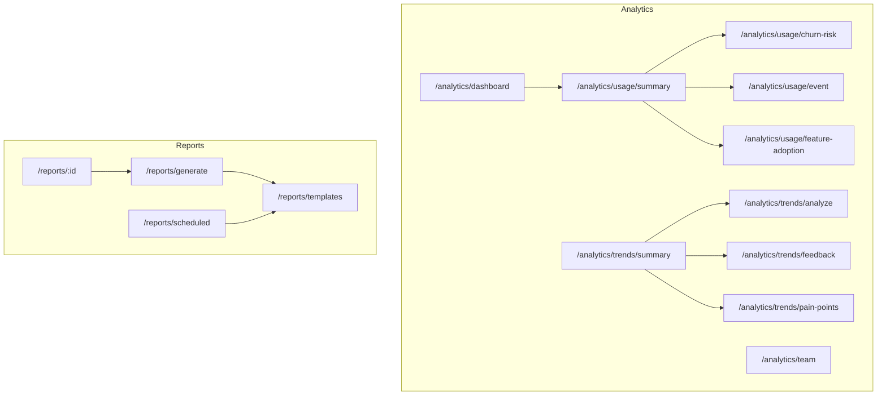
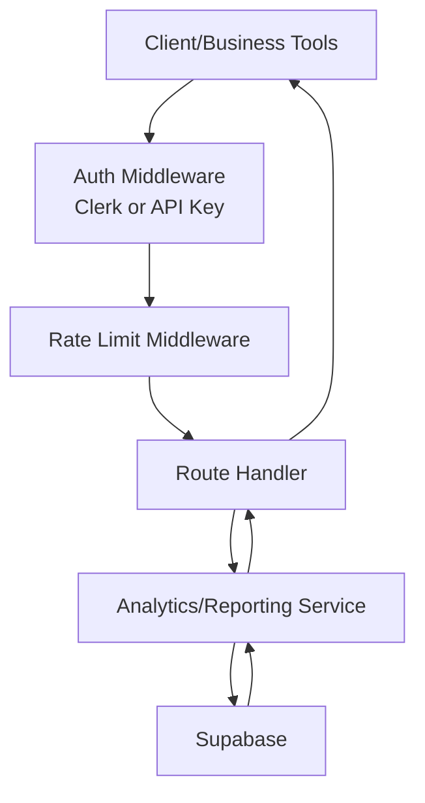
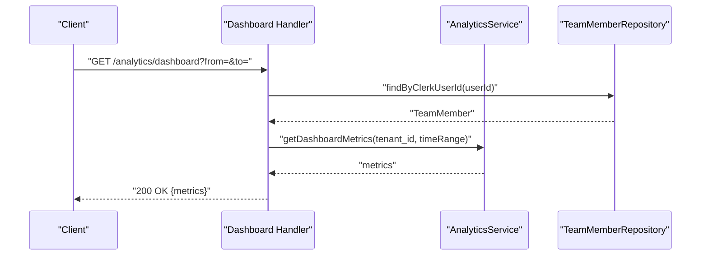
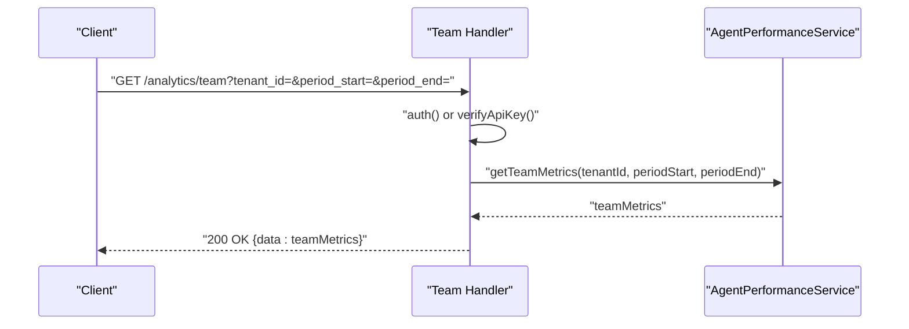
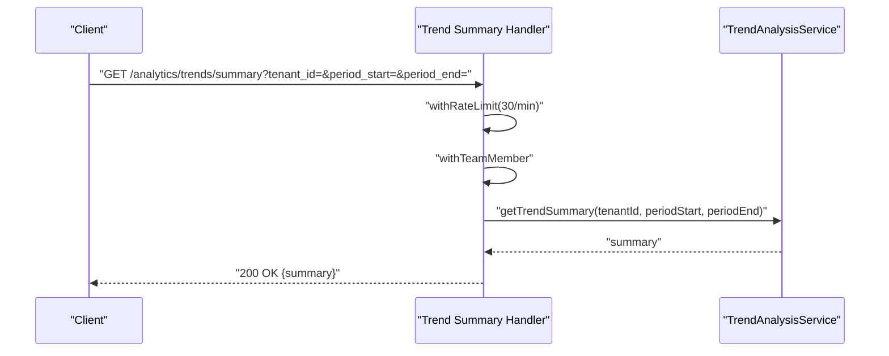
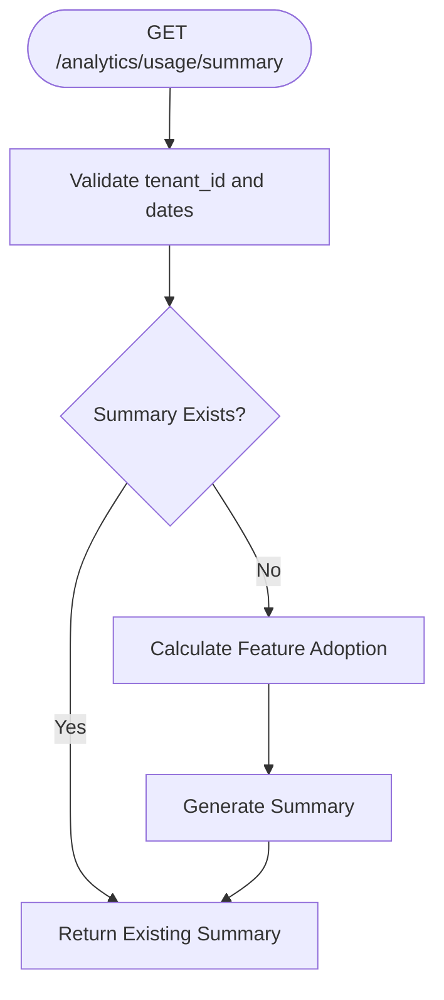
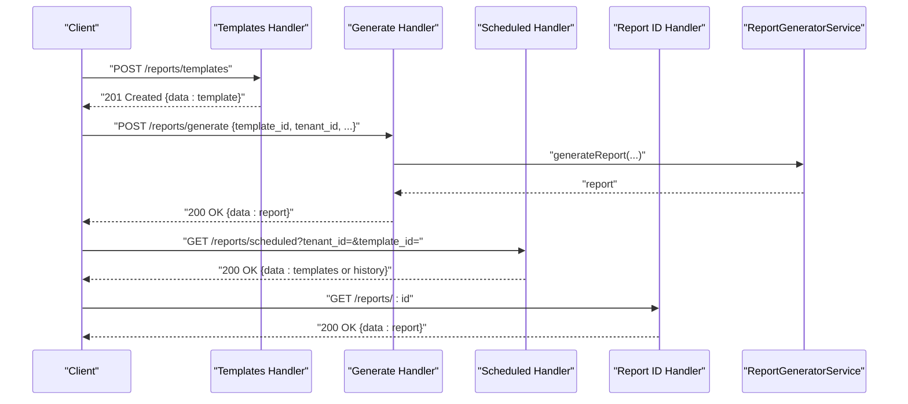
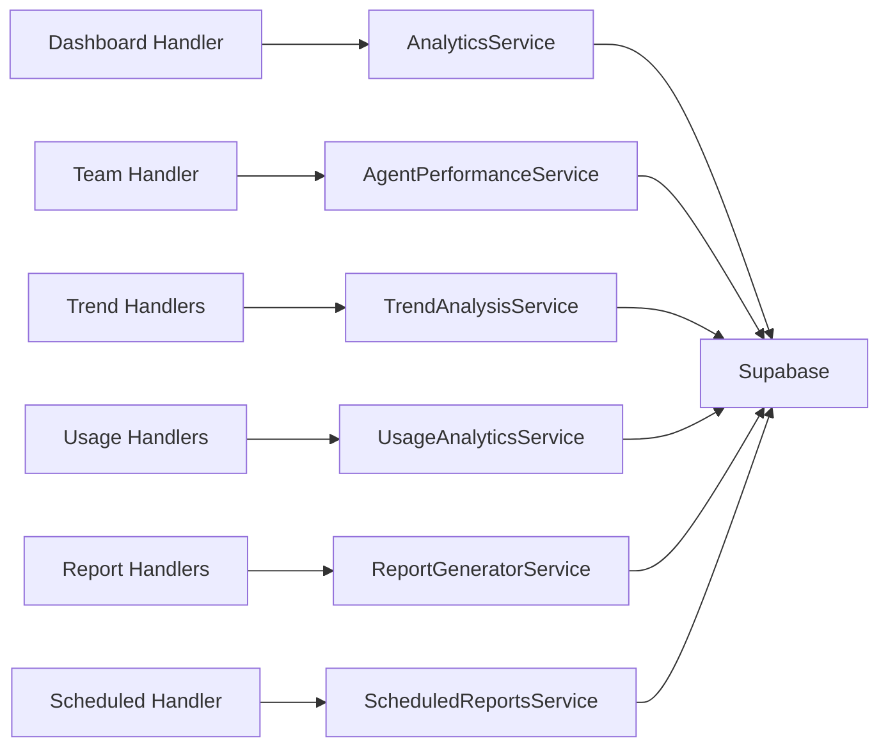

# Analytics & Reporting API

<cite>
**Referenced Files in This Document**
- [route.ts](file://app/api/v1/analytics/dashboard/route.ts)
- [route.ts](file://app/api/v1/analytics/team/route.ts)
- [route.ts](file://app/api/v1/analytics/trends/summary/route.ts)
- [route.ts](file://app/api/v1/analytics/trends/analyze/route.ts)
- [route.ts](file://app/api/v1/analytics/trends/feedback/route.ts)
- [route.ts](file://app/api/v1/analytics/trends/pain-points/route.ts)
- [route.ts](file://app/api/v1/analytics/usage/summary/route.ts)
- [route.ts](file://app/api/v1/analytics/usage/churn-risk/route.ts)
- [route.ts](file://app/api/v1/analytics/usage/event/route.ts)
- [route.ts](file://app/api/v1/analytics/usage/feature-adoption/route.ts)
- [route.ts](file://app/api/v1/reports/generate/route.ts)
- [route.ts](file://app/api/v1/reports/scheduled/route.ts)
- [route.ts](file://app/api/v1/reports/templates/route.ts)
- [route.ts](file://app/api/v1/reports/[id]/route.ts)
</cite>

## Table of Contents
1. [Introduction](#introduction)
2. [Project Structure](#project-structure)
3. [Core Components](#core-components)
4. [Architecture Overview](#architecture-overview)
5. [Detailed Component Analysis](#detailed-component-analysis)
6. [Dependency Analysis](#dependency-analysis)
7. [Performance Considerations](#performance-considerations)
8. [Troubleshooting Guide](#troubleshooting-guide)
9. [Conclusion](#conclusion)
10. [Appendices](#appendices)

## Introduction
This document provides comprehensive API documentation for analytics and reporting endpoints. It covers dashboard metrics, team performance analytics, trend analysis, usage tracking, churn risk, and automated reporting. The APIs support real-time metrics, historical data retrieval, customizable reporting formats, and integration with business intelligence tools. Authentication and rate limiting are enforced across endpoints to ensure secure and reliable access.

## Project Structure
The analytics and reporting APIs are organized under the Next.js App Router at app/api/v1. The structure groups endpoints by domain:
- Analytics: dashboard, team, trends, and usage
- Reports: templates, generation, scheduling, and retrieval

**Diagram sources**
- [route.ts](file://app/api/v1/analytics/dashboard/route.ts#L1-L52)
- [route.ts](file://app/api/v1/analytics/team/route.ts#L1-L44)
- [route.ts](file://app/api/v1/analytics/trends/summary/route.ts#L1-L55)
- [route.ts](file://app/api/v1/analytics/trends/analyze/route.ts#L1-L52)
- [route.ts](file://app/api/v1/analytics/trends/feedback/route.ts#L1-L55)
- [route.ts](file://app/api/v1/analytics/trends/pain-points/route.ts#L1-L55)
- [route.ts](file://app/api/v1/analytics/usage/summary/route.ts#L1-L68)
- [route.ts](file://app/api/v1/analytics/usage/churn-risk/route.ts#L1-L55)
- [route.ts](file://app/api/v1/analytics/usage/event/route.ts#L1-L91)
- [route.ts](file://app/api/v1/analytics/usage/feature-adoption/route.ts#L1-L59)
- [route.ts](file://app/api/v1/reports/templates/route.ts#L1-L132)
- [route.ts](file://app/api/v1/reports/generate/route.ts#L1-L53)
- [route.ts](file://app/api/v1/reports/scheduled/route.ts#L1-L94)
- [route.ts](file://app/api/v1/reports/[id]/route.ts#L1-L46)

**Section sources**
- [route.ts](file://app/api/v1/analytics/dashboard/route.ts#L1-L52)
- [route.ts](file://app/api/v1/analytics/team/route.ts#L1-L44)
- [route.ts](file://app/api/v1/analytics/trends/summary/route.ts#L1-L55)
- [route.ts](file://app/api/v1/analytics/trends/analyze/route.ts#L1-L52)
- [route.ts](file://app/api/v1/analytics/trends/feedback/route.ts#L1-L55)
- [route.ts](file://app/api/v1/analytics/trends/pain-points/route.ts#L1-L55)
- [route.ts](file://app/api/v1/analytics/usage/summary/route.ts#L1-L68)
- [route.ts](file://app/api/v1/analytics/usage/churn-risk/route.ts#L1-L55)
- [route.ts](file://app/api/v1/analytics/usage/event/route.ts#L1-L91)
- [route.ts](file://app/api/v1/analytics/usage/feature-adoption/route.ts#L1-L59)
- [route.ts](file://app/api/v1/reports/templates/route.ts#L1-L132)
- [route.ts](file://app/api/v1/reports/generate/route.ts#L1-L53)
- [route.ts](file://app/api/v1/reports/scheduled/route.ts#L1-L94)
- [route.ts](file://app/api/v1/reports/[id]/route.ts#L1-L46)

## Core Components
- Analytics Services: Dashboard metrics, team performance, trend analysis, and usage analytics
- Reporting Services: Report templates, generation, scheduling, and retrieval
- Middleware: Authentication (Clerk or API key), rate limiting, input validation, and sanitization
- Data Access: Supabase ORM for report templates and related persistence

Key responsibilities:
- Validate and sanitize inputs
- Enforce rate limits per endpoint
- Authenticate via Clerk session or API key
- Aggregate and compute metrics for dashboards and reports
- Persist and retrieve report templates and executions

**Section sources**
- [route.ts](file://app/api/v1/analytics/dashboard/route.ts#L1-L52)
- [route.ts](file://app/api/v1/analytics/team/route.ts#L1-L44)
- [route.ts](file://app/api/v1/analytics/trends/summary/route.ts#L1-L55)
- [route.ts](file://app/api/v1/analytics/trends/analyze/route.ts#L1-L52)
- [route.ts](file://app/api/v1/analytics/trends/feedback/route.ts#L1-L55)
- [route.ts](file://app/api/v1/analytics/trends/pain-points/route.ts#L1-L55)
- [route.ts](file://app/api/v1/analytics/usage/summary/route.ts#L1-L68)
- [route.ts](file://app/api/v1/analytics/usage/churn-risk/route.ts#L1-L55)
- [route.ts](file://app/api/v1/analytics/usage/event/route.ts#L1-L91)
- [route.ts](file://app/api/v1/analytics/usage/feature-adoption/route.ts#L1-L59)
- [route.ts](file://app/api/v1/reports/templates/route.ts#L1-L132)
- [route.ts](file://app/api/v1/reports/generate/route.ts#L1-L53)
- [route.ts](file://app/api/v1/reports/scheduled/route.ts#L1-L94)
- [route.ts](file://app/api/v1/reports/[id]/route.ts#L1-L46)

## Architecture Overview
The analytics and reporting APIs follow a layered architecture:
- Route handlers orchestrate requests, enforce auth and rate limits, parse inputs, and delegate to services
- Services encapsulate business logic for analytics computations and report generation
- Middleware ensures security and input safety
- Supabase is used for report template persistence

**Diagram sources**
- [route.ts](file://app/api/v1/analytics/dashboard/route.ts#L1-L52)
- [route.ts](file://app/api/v1/analytics/team/route.ts#L1-L44)
- [route.ts](file://app/api/v1/analytics/trends/summary/route.ts#L1-L55)
- [route.ts](file://app/api/v1/analytics/trends/analyze/route.ts#L1-L52)
- [route.ts](file://app/api/v1/analytics/trends/feedback/route.ts#L1-L55)
- [route.ts](file://app/api/v1/analytics/trends/pain-points/route.ts#L1-L55)
- [route.ts](file://app/api/v1/analytics/usage/summary/route.ts#L1-L68)
- [route.ts](file://app/api/v1/analytics/usage/churn-risk/route.ts#L1-L55)
- [route.ts](file://app/api/v1/analytics/usage/event/route.ts#L1-L91)
- [route.ts](file://app/api/v1/analytics/usage/feature-adoption/route.ts#L1-L59)
- [route.ts](file://app/api/v1/reports/templates/route.ts#L1-L132)
- [route.ts](file://app/api/v1/reports/generate/route.ts#L1-L53)
- [route.ts](file://app/api/v1/reports/scheduled/route.ts#L1-L94)
- [route.ts](file://app/api/v1/reports/[id]/route.ts#L1-L46)

## Detailed Component Analysis

### Analytics: Dashboard Metrics
- Endpoint: GET /api/v1/analytics/dashboard
- Purpose: Retrieve comprehensive dashboard metrics for a given time range
- Authentication: Requires team member context
- Time Range Defaults: Last 30 days if not provided
- Response: Aggregated metrics for the dashboard

**Diagram sources**
- [route.ts](file://app/api/v1/analytics/dashboard/route.ts#L1-L52)

**Section sources**
- [route.ts](file://app/api/v1/analytics/dashboard/route.ts#L1-L52)

### Analytics: Team Performance
- Endpoint: GET /api/v1/analytics/team
- Purpose: Retrieve team performance metrics
- Authentication: Clerk session OR API key
- Required Query: tenant_id
- Optional Query: period_start, period_end (defaults to last 30 days)
- Response: Team metrics aggregated over the period

**Diagram sources**
- [route.ts](file://app/api/v1/analytics/team/route.ts#L1-L44)

**Section sources**
- [route.ts](file://app/api/v1/analytics/team/route.ts#L1-L44)

### Analytics: Trends
- Summary
  - Endpoint: GET /api/v1/analytics/trends/summary
  - Purpose: Trend analysis summary for dashboard
  - Authentication: Team member context
  - Rate Limit: 30 requests/minute
  - Inputs: tenant_id (optional), period_start, period_end (defaults to last 30 days)
  - Response: Trend summary

- Analyze
  - Endpoint: POST /api/v1/analytics/trends/analyze
  - Purpose: Analyze tickets and surveys for trends
  - Authentication: Team member context
  - Rate Limit: 10 requests/minute
  - Body: tenant_id (optional), period_start, period_end
  - Response: Trend analysis results

- Feedback
  - Endpoint: GET /api/v1/analytics/trends/feedback
  - Purpose: Extract product feedback from tickets and surveys
  - Authentication: Team member context
  - Rate Limit: 30 requests/minute
  - Inputs: tenant_id (optional), period_start, period_end
  - Response: Feedback items

- Pain Points
  - Endpoint: GET /api/v1/analytics/trends/pain-points
  - Purpose: Identify pain points from support data
  - Authentication: Team member context
  - Rate Limit: 30 requests/minute
  - Inputs: tenant_id (optional), period_start, period_end
  - Response: Pain points

**Diagram sources**
- [route.ts](file://app/api/v1/analytics/trends/summary/route.ts#L1-L55)

**Section sources**
- [route.ts](file://app/api/v1/analytics/trends/summary/route.ts#L1-L55)
- [route.ts](file://app/api/v1/analytics/trends/analyze/route.ts#L1-L52)
- [route.ts](file://app/api/v1/analytics/trends/feedback/route.ts#L1-L55)
- [route.ts](file://app/api/v1/analytics/trends/pain-points/route.ts#L1-L55)

### Analytics: Usage Tracking
- Summary
  - Endpoint: GET /api/v1/analytics/usage/summary
  - Purpose: Get usage analytics summary for dashboard
  - Authentication: Team member context
  - Rate Limit: 30 requests/minute
  - Inputs: tenant_id (required), period_start, period_end (defaults to last 30 days)
  - Behavior: Returns existing summary or generates it if missing

- Churn Risk
  - Endpoint: GET /api/v1/analytics/usage/churn-risk
  - Purpose: Get users at risk of churn
  - Authentication: Team member context
  - Rate Limit: 30 requests/minute
  - Inputs: tenant_id (required), risk_level (high or critical), limit (1–100)
  - Response: At-risk users

- Event
  - Endpoint: POST /api/v1/analytics/usage/event
  - Purpose: Record a usage event (service-to-service)
  - Authentication: API key verification (x-api-key)
  - Rate Limit: 100 requests/minute
  - Body Schema: tenantId, userId, eventType, featureName, eventData, sessionId, ipAddress, userAgent
  - Response: Success confirmation

- Feature Adoption
  - Endpoint: GET /api/v1/analytics/usage/feature-adoption
  - Purpose: Calculate feature adoption metrics
  - Authentication: Team member context
  - Rate Limit: 30 requests/minute
  - Inputs: tenant_id (required), period_start, period_end (defaults to last 30 days)
  - Response: Feature adoption metrics

**Diagram sources**
- [route.ts](file://app/api/v1/analytics/usage/summary/route.ts#L1-L68)

**Section sources**
- [route.ts](file://app/api/v1/analytics/usage/summary/route.ts#L1-L68)
- [route.ts](file://app/api/v1/analytics/usage/churn-risk/route.ts#L1-L55)
- [route.ts](file://app/api/v1/analytics/usage/event/route.ts#L1-L91)
- [route.ts](file://app/api/v1/analytics/usage/feature-adoption/route.ts#L1-L59)

### Reports: Templates, Generation, Scheduling, Retrieval
- Templates
  - POST /api/v1/reports/templates: Create a new report template
  - GET /api/v1/reports/templates: List templates filtered by tenant, type, and activation status
  - Persistence: Supabase table cs_report_templates

- Generate
  - POST /api/v1/reports/generate: Generate a report from a template for a tenant and period
  - Defaults: Last 30 days if period not specified

- Scheduled
  - GET /api/v1/reports/scheduled: List scheduled templates or execution history for a template
  - POST /api/v1/reports/scheduled/execute: Execute pending scheduled reports (cron job protected by API key)

- Retrieve
  - GET /api/v1/reports/:id: Fetch a specific report by ID and log access metadata

**Diagram sources**
- [route.ts](file://app/api/v1/reports/templates/route.ts#L1-L132)
- [route.ts](file://app/api/v1/reports/generate/route.ts#L1-L53)
- [route.ts](file://app/api/v1/reports/scheduled/route.ts#L1-L94)
- [route.ts](file://app/api/v1/reports/[id]/route.ts#L1-L46)

**Section sources**
- [route.ts](file://app/api/v1/reports/templates/route.ts#L1-L132)
- [route.ts](file://app/api/v1/reports/generate/route.ts#L1-L53)
- [route.ts](file://app/api/v1/reports/scheduled/route.ts#L1-L94)
- [route.ts](file://app/api/v1/reports/[id]/route.ts#L1-L46)

## Dependency Analysis
- Route handlers depend on:
  - Authentication middleware (Clerk session or API key)
  - Rate limiting middleware
  - Input validation and sanitization
  - Services for analytics and reporting logic
- Services depend on:
  - Data repositories and Supabase for persistence
  - Internal analytics functions for computations
- Coupling:
  - Handlers are thin; most logic resides in services
  - Supabase is centralized for report templates

**Diagram sources**
- [route.ts](file://app/api/v1/analytics/dashboard/route.ts#L1-L52)
- [route.ts](file://app/api/v1/analytics/team/route.ts#L1-L44)
- [route.ts](file://app/api/v1/analytics/trends/summary/route.ts#L1-L55)
- [route.ts](file://app/api/v1/analytics/trends/analyze/route.ts#L1-L52)
- [route.ts](file://app/api/v1/analytics/trends/feedback/route.ts#L1-L55)
- [route.ts](file://app/api/v1/analytics/trends/pain-points/route.ts#L1-L55)
- [route.ts](file://app/api/v1/analytics/usage/summary/route.ts#L1-L68)
- [route.ts](file://app/api/v1/analytics/usage/churn-risk/route.ts#L1-L55)
- [route.ts](file://app/api/v1/analytics/usage/event/route.ts#L1-L91)
- [route.ts](file://app/api/v1/analytics/usage/feature-adoption/route.ts#L1-L59)
- [route.ts](file://app/api/v1/reports/templates/route.ts#L1-L132)
- [route.ts](file://app/api/v1/reports/generate/route.ts#L1-L53)
- [route.ts](file://app/api/v1/reports/scheduled/route.ts#L1-L94)
- [route.ts](file://app/api/v1/reports/[id]/route.ts#L1-L46)

**Section sources**
- [route.ts](file://app/api/v1/analytics/dashboard/route.ts#L1-L52)
- [route.ts](file://app/api/v1/analytics/team/route.ts#L1-L44)
- [route.ts](file://app/api/v1/analytics/trends/summary/route.ts#L1-L55)
- [route.ts](file://app/api/v1/analytics/trends/analyze/route.ts#L1-L52)
- [route.ts](file://app/api/v1/analytics/trends/feedback/route.ts#L1-L55)
- [route.ts](file://app/api/v1/analytics/trends/pain-points/route.ts#L1-L55)
- [route.ts](file://app/api/v1/analytics/usage/summary/route.ts#L1-L68)
- [route.ts](file://app/api/v1/analytics/usage/churn-risk/route.ts#L1-L55)
- [route.ts](file://app/api/v1/analytics/usage/event/route.ts#L1-L91)
- [route.ts](file://app/api/v1/analytics/usage/feature-adoption/route.ts#L1-L59)
- [route.ts](file://app/api/v1/reports/templates/route.ts#L1-L132)
- [route.ts](file://app/api/v1/reports/generate/route.ts#L1-L53)
- [route.ts](file://app/api/v1/reports/scheduled/route.ts#L1-L94)
- [route.ts](file://app/api/v1/reports/[id]/route.ts#L1-L46)

## Performance Considerations
- Rate Limits:
  - Trend endpoints: 30 requests/minute
  - Trend analysis: 10 requests/minute
  - Usage event recording: 100 requests/minute
- Defaults:
  - Time ranges default to the last 30 days when not provided
- Computation:
  - Usage summary may trigger feature adoption calculation and summary generation if missing
- Security:
  - API key protection for service-to-service usage event recording
  - Clerk or API key required for report operations

[No sources needed since this section provides general guidance]

## Troubleshooting Guide
Common issues and resolutions:
- Unauthorized Access
  - Ensure Clerk session or valid API key is present for protected endpoints
- Missing Required Parameters
  - team endpoint requires tenant_id
  - usage summary requires tenant_id
  - churn risk requires tenant_id and supports risk_level and limit
- Invalid Dates
  - Use YYYY-MM-DD format for period_start and period_end
- Rate Limit Exceeded
  - Reduce request frequency or batch requests
- API Key Verification
  - Verify x-api-key header for usage event endpoint

**Section sources**
- [route.ts](file://app/api/v1/analytics/team/route.ts#L1-L44)
- [route.ts](file://app/api/v1/analytics/usage/summary/route.ts#L1-L68)
- [route.ts](file://app/api/v1/analytics/usage/churn-risk/route.ts#L1-L55)
- [route.ts](file://app/api/v1/analytics/usage/event/route.ts#L1-L91)
- [route.ts](file://app/api/v1/reports/generate/route.ts#L1-L53)
- [route.ts](file://app/api/v1/reports/scheduled/route.ts#L1-L94)

## Conclusion
The analytics and reporting APIs provide a robust foundation for real-time and historical insights, team performance monitoring, trend analysis, usage tracking, and automated reporting. With built-in authentication, rate limiting, input validation, and flexible reporting templates, the system supports integration with business intelligence tools and enables customizable, scheduled delivery of actionable metrics.

[No sources needed since this section summarizes without analyzing specific files]

## Appendices

### API Reference Summary
- Analytics
  - Dashboard: GET /api/v1/analytics/dashboard
  - Team: GET /api/v1/analytics/team
  - Trends: GET /api/v1/analytics/trends/summary, POST /api/v1/analytics/trends/analyze, GET /api/v1/analytics/trends/feedback, GET /api/v1/analytics/trends/pain-points
  - Usage: GET /api/v1/analytics/usage/summary, GET /api/v1/analytics/usage/churn-risk, POST /api/v1/analytics/usage/event, GET /api/v1/analytics/usage/feature-adoption
- Reports
  - Templates: POST /api/v1/reports/templates, GET /api/v1/reports/templates
  - Generate: POST /api/v1/reports/generate
  - Scheduled: GET /api/v1/reports/scheduled, POST /api/v1/reports/scheduled/execute
  - Retrieve: GET /api/v1/reports/:id

[No sources needed since this section provides general guidance]