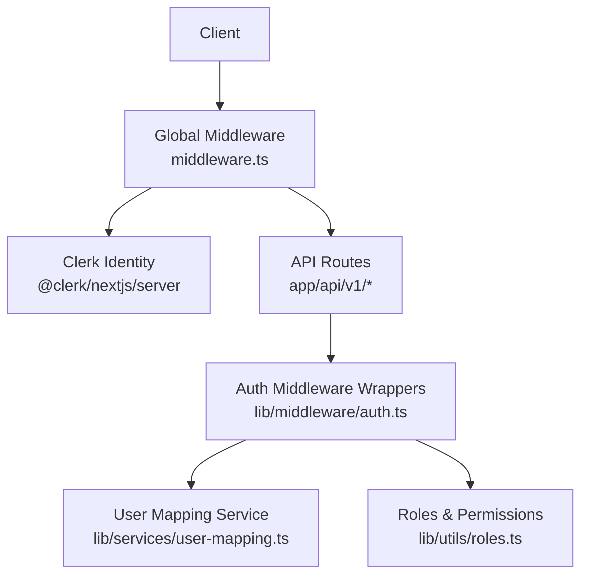
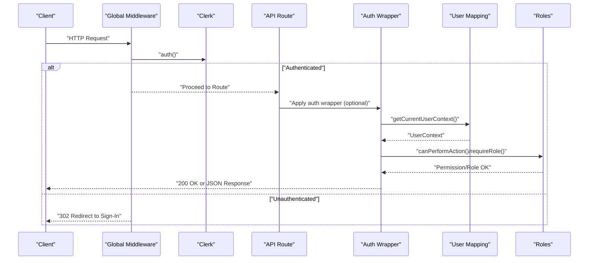
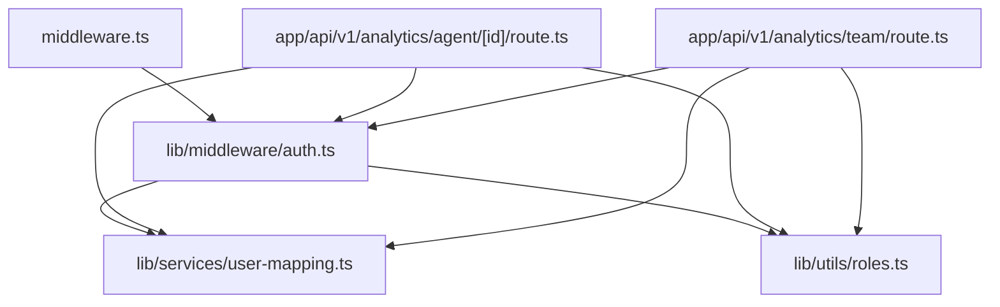

# Authentication & Authorization API

<cite>
**Referenced Files in This Document**
- [middleware.ts](file://middleware.ts)
- [lib/middleware/auth.ts](file://lib/middleware/auth.ts)
- [lib/utils/roles.ts](file://lib/utils/roles.ts)
- [lib/services/user-mapping.ts](file://lib/services/user-mapping.ts)
- [app/api/v1/analytics/agent/[id]/route.ts](file://app/api/v1/analytics/agent/[id]/route.ts)
- [app/api/v1/analytics/team/route.ts](file://app/api/v1/analytics/team/route.ts)
</cite>

## Table of Contents
1. [Introduction](#introduction)
2. [Project Structure](#project-structure)
3. [Core Components](#core-components)
4. [Architecture Overview](#architecture-overview)
5. [Detailed Component Analysis](#detailed-component-analysis)
6. [Dependency Analysis](#dependency-analysis)
7. [Performance Considerations](#performance-considerations)
8. [Troubleshooting Guide](#troubleshooting-guide)
9. [Conclusion](#conclusion)

## Introduction
This document describes the authentication and authorization model for the API surface. The system integrates Clerk for identity and session management, with middleware enforcing authentication and role-based access control (RBAC). It supports:
- Session-based authentication via Clerk
- API key verification for programmatic access
- Role-based access control with hierarchical roles
- Permission checks for fine-grained authorization
- Standardized error responses for unauthorized and forbidden access

## Project Structure
Authentication and authorization logic is implemented across middleware, utilities, services, and selected API routes:
- Global middleware enforces protected routes and redirects unauthenticated users to the sign-in page
- Route-level middleware wrappers provide granular authorization controls
- Role and permission utilities define supported roles and action permissions
- User mapping service connects Clerk identities to internal team member records
- Example API routes demonstrate mixed authentication modes (Clerk or API key)

**Diagram sources**
- [middleware.ts](file://middleware.ts#L1-L30)
- [lib/middleware/auth.ts](file://lib/middleware/auth.ts#L1-L175)
- [lib/utils/roles.ts](file://lib/utils/roles.ts#L1-L97)
- [lib/services/user-mapping.ts](file://lib/services/user-mapping.ts#L1-L170)
- [app/api/v1/analytics/agent/[id]/route.ts](file://app/api/v1/analytics/agent/[id]/route.ts#L1-L53)
- [app/api/v1/analytics/team/route.ts](file://app/api/v1/analytics/team/route.ts#L1-L44)

**Section sources**
- [middleware.ts](file://middleware.ts#L1-L30)
- [lib/middleware/auth.ts](file://lib/middleware/auth.ts#L1-L175)
- [lib/utils/roles.ts](file://lib/utils/roles.ts#L1-L97)
- [lib/services/user-mapping.ts](file://lib/services/user-mapping.ts#L1-L170)
- [app/api/v1/analytics/agent/[id]/route.ts](file://app/api/v1/analytics/agent/[id]/route.ts#L1-L53)
- [app/api/v1/analytics/team/route.ts](file://app/api/v1/analytics/team/route.ts#L1-L44)

## Core Components
- Global middleware: Protects routes, enforces Clerk authentication for non-public paths, and redirects to sign-in when unauthenticated.
- Auth middleware wrappers: Provide route-level guards for authentication, team membership, specific roles, and permissions.
- Roles and permissions: Define supported roles, role hierarchy, and action-based permissions.
- User mapping service: Resolves Clerk user IDs to internal team member records and roles.
- Mixed authentication routes: Demonstrate optional API key alongside Clerk authentication.

**Section sources**
- [middleware.ts](file://middleware.ts#L14-L22)
- [lib/middleware/auth.ts](file://lib/middleware/auth.ts#L10-L175)
- [lib/utils/roles.ts](file://lib/utils/roles.ts#L5-L97)
- [lib/services/user-mapping.ts](file://lib/services/user-mapping.ts#L19-L40)
- [app/api/v1/analytics/agent/[id]/route.ts](file://app/api/v1/analytics/agent/[id]/route.ts#L15-L21)
- [app/api/v1/analytics/team/route.ts](file://app/api/v1/analytics/team/route.ts#L12-L18)

## Architecture Overview
The authentication pipeline combines global and route-level controls:
- Global middleware inspects the request path and enforces Clerk authentication for protected routes.
- Route handlers may also accept API keys for programmatic access.
- Auth wrappers encapsulate RBAC checks and return standardized error responses.

**Diagram sources**
- [middleware.ts](file://middleware.ts#L14-L22)
- [lib/middleware/auth.ts](file://lib/middleware/auth.ts#L20-L43)
- [lib/services/user-mapping.ts](file://lib/services/user-mapping.ts#L19-L40)
- [lib/utils/roles.ts](file://lib/utils/roles.ts#L43-L65)
- [app/api/v1/analytics/agent/[id]/route.ts](file://app/api/v1/analytics/agent/[id]/route.ts#L15-L21)

## Detailed Component Analysis

### Global Middleware (Session Management)
- Purpose: Enforce authentication for protected routes; redirect unauthenticated users to the sign-in page.
- Behavior:
  - Defines public routes (e.g., sign-in, sign-up, home, help, test endpoints, webhooks, unsubscribe).
  - For non-public routes, calls Clerk’s auth() and checks presence of userId.
  - Returns a redirect to the sign-in URL if unauthenticated.

Security considerations:
- Matcher excludes static assets and Next.js internals.
- Public routes remain accessible without authentication.

**Section sources**
- [middleware.ts](file://middleware.ts#L4-L12)
- [middleware.ts](file://middleware.ts#L14-L22)
- [middleware.ts](file://middleware.ts#L24-L28)

### Auth Middleware Wrappers (Route-Level Controls)
- Purpose: Provide reusable wrappers for authentication and authorization checks.
- Functions:
  - requireAuth: Ensures user is authenticated; throws Unauthorized if not.
  - requireTeamMember: Requires mapping to an internal team member record.
  - requireRole: Requires a specific role.
  - requireAnyRole: Requires any of the specified roles.
  - requirePermission: Requires permission to perform a named action.
  - withAuth, withTeamMember, withRole, withPermission: Route wrappers that apply checks and return standardized 401/403 responses.

Error handling:
- Throws descriptive Unauthorized/Forbidden messages.
- Wrappers return JSON bodies with error field and appropriate status codes.

**Section sources**
- [lib/middleware/auth.ts](file://lib/middleware/auth.ts#L20-L43)
- [lib/middleware/auth.ts](file://lib/middleware/auth.ts#L48-L56)
- [lib/middleware/auth.ts](file://lib/middleware/auth.ts#L61-L69)
- [lib/middleware/auth.ts](file://lib/middleware/auth.ts#L74-L82)
- [lib/middleware/auth.ts](file://lib/middleware/auth.ts#L87-L95)
- [lib/middleware/auth.ts](file://lib/middleware/auth.ts#L100-L114)
- [lib/middleware/auth.ts](file://lib/middleware/auth.ts#L119-L133)
- [lib/middleware/auth.ts](file://lib/middleware/auth.ts#L138-L153)
- [lib/middleware/auth.ts](file://lib/middleware/auth.ts#L158-L173)

### Roles and Permissions
- Supported roles: support_agent, support_manager, csm, head_of_cs, solutions_engineer, client_onboarding_manager.
- Role hierarchy: numeric levels define authority for permission checks.
- Action permissions: map actions (e.g., view_tickets, assign_tickets, view_analytics) to minimum role levels.

Usage:
- canPerformAction(userRole, action) determines if a role can perform a given action.
- Helpers provide comparisons and role sets for downstream logic.

**Section sources**
- [lib/utils/roles.ts](file://lib/utils/roles.ts#L5-L38)
- [lib/utils/roles.ts](file://lib/utils/roles.ts#L43-L65)
- [lib/utils/roles.ts](file://lib/utils/roles.ts#L70-L95)

### User Mapping Service
- Purpose: Bridge Clerk user IDs to internal team member records and roles.
- Functions:
  - getCurrentUserContext: Returns user context including teamMember and role.
  - getTeamMemberByClerkId/getTeamMemberByUserId: Lookups for team member records.
  - hasRole/hasAnyRole/isTeamMember: Convenience checks.
  - getUserPermissions: Returns a set of booleans indicating capabilities per role.

Integration:
- Used by auth wrappers to enforce role and permission checks.

**Section sources**
- [lib/services/user-mapping.ts](file://lib/services/user-mapping.ts#L19-L40)
- [lib/services/user-mapping.ts](file://lib/services/user-mapping.ts#L45-L54)
- [lib/services/user-mapping.ts](file://lib/services/user-mapping.ts#L59-L78)
- [lib/services/user-mapping.ts](file://lib/services/user-mapping.ts#L83-L168)

### Mixed Authentication Routes (Clerk or API Key)
- Example endpoints demonstrate accepting either Clerk session or API key:
  - Verify API key alongside Clerk auth.
  - Return 401 if both fail.
  - Accept optional query parameters (e.g., tenant_id, period_start, period_end).

Endpoints:
- GET /api/v1/analytics/agent/:id
- GET /api/v1/analytics/team

Validation:
- If tenant_id missing, return 400 with error message.
- On success, return metrics wrapped in a data object.

**Section sources**
- [app/api/v1/analytics/agent/[id]/route.ts](file://app/api/v1/analytics/agent/[id]/route.ts#L15-L21)
- [app/api/v1/analytics/agent/[id]/route.ts](file://app/api/v1/analytics/agent/[id]/route.ts#L29-L31)
- [app/api/v1/analytics/agent/[id]/route.ts](file://app/api/v1/analytics/agent/[id]/route.ts#L33-L44)
- [app/api/v1/analytics/team/route.ts](file://app/api/v1/analytics/team/route.ts#L12-L18)
- [app/api/v1/analytics/team/route.ts](file://app/api/v1/analytics/team/route.ts#L25-L27)
- [app/api/v1/analytics/team/route.ts](file://app/api/v1/analytics/team/route.ts#L29-L35)

## Dependency Analysis
The following diagram shows how authentication and authorization components depend on each other:

**Diagram sources**
- [middleware.ts](file://middleware.ts#L1-L30)
- [lib/middleware/auth.ts](file://lib/middleware/auth.ts#L1-L175)
- [lib/services/user-mapping.ts](file://lib/services/user-mapping.ts#L1-L170)
- [lib/utils/roles.ts](file://lib/utils/roles.ts#L1-L97)
- [app/api/v1/analytics/agent/[id]/route.ts](file://app/api/v1/analytics/agent/[id]/route.ts#L1-L53)
- [app/api/v1/analytics/team/route.ts](file://app/api/v1/analytics/team/route.ts#L1-L44)

**Section sources**
- [middleware.ts](file://middleware.ts#L1-L30)
- [lib/middleware/auth.ts](file://lib/middleware/auth.ts#L1-L175)
- [lib/services/user-mapping.ts](file://lib/services/user-mapping.ts#L1-L170)
- [lib/utils/roles.ts](file://lib/utils/roles.ts#L1-L97)
- [app/api/v1/analytics/agent/[id]/route.ts](file://app/api/v1/analytics/agent/[id]/route.ts#L1-L53)
- [app/api/v1/analytics/team/route.ts](file://app/api/v1/analytics/team/route.ts#L1-L44)

## Performance Considerations
- Minimize repeated Clerk calls: Reuse the authenticated user context where possible.
- Cache role and permission decisions: For frequently accessed endpoints, cache computed permissions keyed by user and action.
- Avoid unnecessary database lookups: Defer team member mapping until required by auth wrappers.
- Keep middleware logic lightweight: Perform only essential checks in global middleware.

## Troubleshooting Guide
Common issues and resolutions:
- 401 Unauthorized (global middleware redirect):
  - Cause: Accessing protected route without Clerk session.
  - Resolution: Authenticate via Clerk; ensure cookies/session are present.
- 401 Unauthorized (route-level):
  - Cause: Auth wrapper detected unauthenticated user.
  - Resolution: Ensure Clerk session is valid or provide a valid API key.
- 403 Forbidden (role/permission):
  - Cause: Insufficient role or missing permission for action.
  - Resolution: Verify user role and required permissions; adjust access controls accordingly.
- Missing tenant_id:
  - Cause: Required query parameter not provided.
  - Resolution: Include tenant_id and optional period_start/period_end.

Error response format:
- Body includes an error field with a descriptive message.
- Status codes:
  - 401: Unauthorized
  - 403: Forbidden
  - 400: Bad Request (missing parameters)
  - 500: Internal Server Error (unexpected failures)

**Section sources**
- [lib/middleware/auth.ts](file://lib/middleware/auth.ts#L107-L112)
- [lib/middleware/auth.ts](file://lib/middleware/auth.ts#L126-L131)
- [app/api/v1/analytics/agent/[id]/route.ts](file://app/api/v1/analytics/agent/[id]/route.ts#L30-L31)
- [app/api/v1/analytics/team/route.ts](file://app/api/v1/analytics/team/route.ts#L25-L27)

## Conclusion
The system employs a layered authentication and authorization strategy:
- Global middleware protects routes and redirects unauthenticated users.
- Route-level middleware wrappers enforce team membership, roles, and permissions.
- Roles and permissions are centrally defined and enforced consistently.
- Example endpoints illustrate optional API key acceptance alongside Clerk sessions.
This design provides robust protection for API endpoints while maintaining flexibility for different client types.