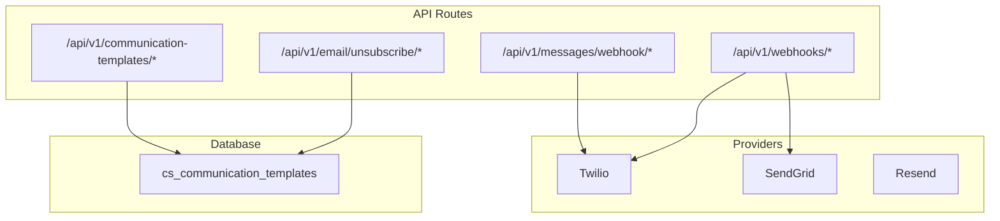
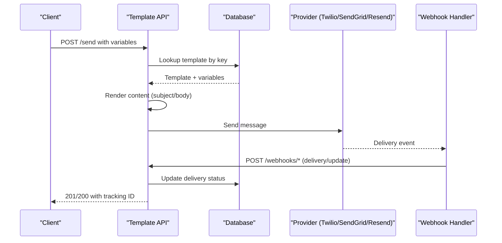
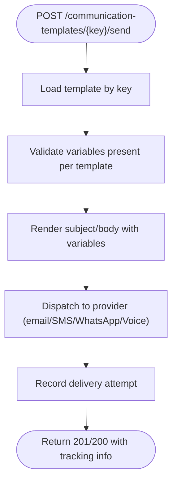
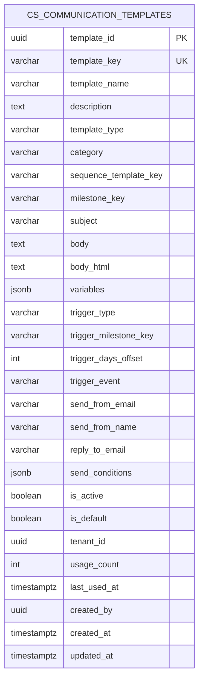
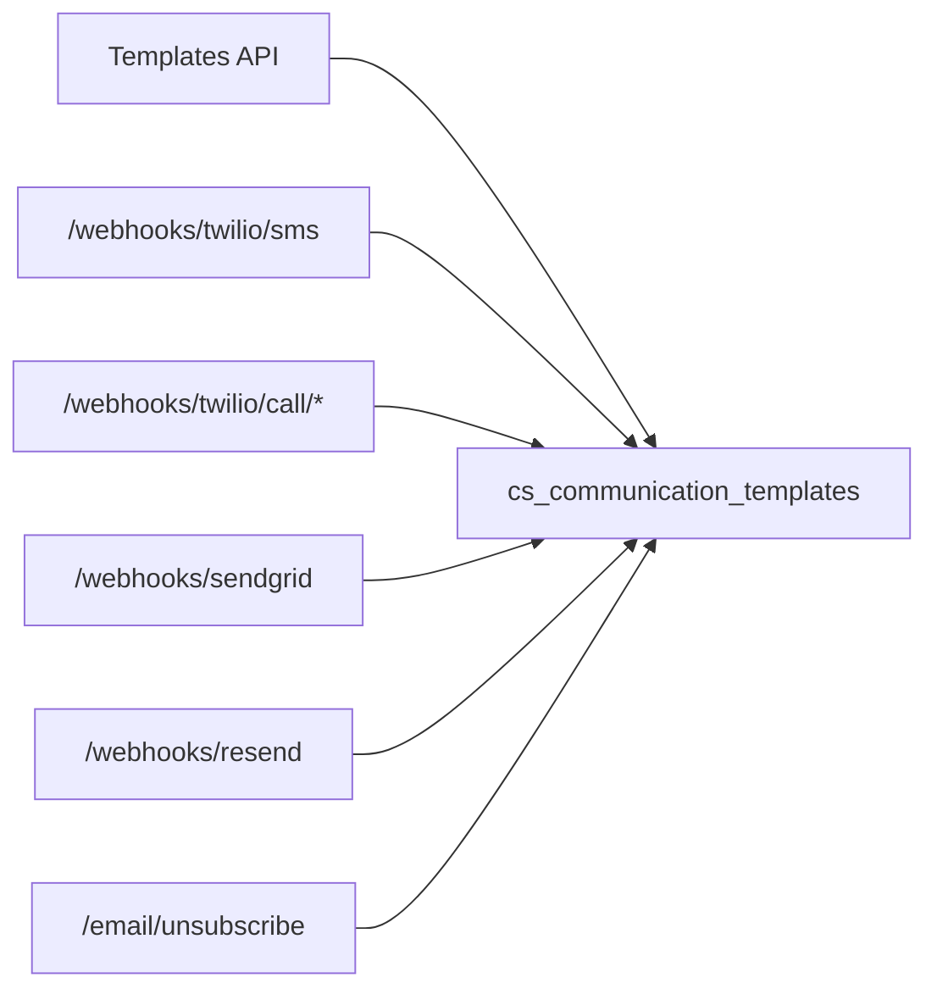

# Communications & Notifications API

<cite>
**Referenced Files in This Document**
- [communication-templates route.ts](file://app/api/v1/communication-templates/route.ts)
- [communication-templates [templateKey] route.ts](file://app/api/v1/communication-templates/[templateKey]/route.ts)
- [communication-templates [templateKey] send route.ts](file://app/api/v1/communication-templates/[templateKey]/send/route.ts)
- [communication-templates [templateKey] render route.ts](file://app/api/v1/communication-templates/[templateKey]/render/route.ts)
- [email unsubscribe [token] route.ts](file://app/api/v1/email/unsubscribe/[token]/route.ts)
- [messages webhook sms route.ts](file://app/api/v1/messages/webhook/sms/route.ts)
- [messages webhook whatsapp route.ts](file://app/api/v1/messages/webhook/whatsapp/route.ts)
- [webhooks platform milestone route.ts](file://app/api/v1/webhooks/platform/milestone/route.ts)
- [webhooks sendgrid route.ts](file://app/api/v1/webhooks/sendgrid/route.ts)
- [webhooks twilio call handle route.ts](file://app/api/v1/webhooks/twilio/call/handle/route.ts)
- [webhooks twilio call recording route.ts](file://app/api/v1/webhooks/twilio/call/recording/route.ts)
- [webhooks twilio call transcribe route.ts](file://app/api/v1/webhooks/twilio/call/transcribe/route.ts)
- [webhooks twilio sms route.ts](file://app/api/v1/webhooks/twilio/sms/route.ts)
- [webhooks resend route.ts](file://app/api/webhooks/resend/route.ts)
- [021_communication_templates.sql](file://database/migrations/021_communication_templates.sql)
- [seed_communication_templates.sql](file://database/seed_communication_templates.sql)
</cite>

## Table of Contents
1. [Introduction](#introduction)
2. [Project Structure](#project-structure)
3. [Core Components](#core-components)
4. [Architecture Overview](#architecture-overview)
5. [Detailed Component Analysis](#detailed-component-analysis)
6. [Dependency Analysis](#dependency-analysis)
7. [Performance Considerations](#performance-considerations)
8. [Troubleshooting Guide](#troubleshooting-guide)
9. [Conclusion](#conclusion)

## Introduction
This document describes the Communications & Notifications API, covering:
- Email sending and unsubscribe management
- SMS messaging and inbound/outbound handling
- Webhook endpoints for Twilio, SendGrid, and platform events
- Communication template system for multi-channel messages
- Delivery tracking, retry mechanisms, and compliance considerations

The API supports multi-channel communication (email, SMS, WhatsApp, voice) and integrates with external providers via webhook handlers. Templates define content and variables for personalized, compliant messages.

## Project Structure
The API surface is organized under app/api/v1 with dedicated routes for templates, messages, and webhooks. Database schema defines the communication templates table and associated indexes and policies.

**Diagram sources**
- [communication-templates route.ts](file://app/api/v1/communication-templates/route.ts#L1-L20)
- [messages webhook sms route.ts](file://app/api/v1/messages/webhook/sms/route.ts#L1-L20)
- [webhooks sendgrid route.ts](file://app/api/v1/webhooks/sendgrid/route.ts#L1-L30)
- [webhooks twilio sms route.ts](file://app/api/v1/webhooks/twilio/sms/route.ts#L1-L30)
- [email unsubscribe [token] route.ts](file://app/api/v1/email/unsubscribe/[token]/route.ts#L1-L40)
- [021_communication_templates.sql](file://database/migrations/021_communication_templates.sql#L1-L75)

**Section sources**
- [communication-templates route.ts](file://app/api/v1/communication-templates/route.ts#L1-L20)
- [021_communication_templates.sql](file://database/migrations/021_communication_templates.sql#L1-L75)

## Core Components
- Communication Templates: CRUD and send/render endpoints backed by a relational schema supporting variables, triggers, and channel types.
- Message Webhooks: Inbound SMS and WhatsApp handlers for provider callbacks.
- Platform Webhooks: Outbound delivery notifications and platform milestones.
- Unsubscribe Management: Token-based opt-out handling for email.
- Provider Integrations: Twilio voice/SMS, SendGrid inbound, and Resend delivery tracking.

**Section sources**
- [communication-templates [templateKey] send route.ts](file://app/api/v1/communication-templates/[templateKey]/send/route.ts#L1-L40)
- [communication-templates [templateKey] render route.ts](file://app/api/v1/communication-templates/[templateKey]/render/route.ts#L1-L20)
- [messages webhook sms route.ts](file://app/api/v1/messages/webhook/sms/route.ts#L1-L20)
- [messages webhook whatsapp route.ts](file://app/api/v1/messages/webhook/whatsapp/route.ts#L1-L20)
- [webhooks platform milestone route.ts](file://app/api/v1/webhooks/platform/milestone/route.ts#L1-L20)
- [webhooks sendgrid route.ts](file://app/api/v1/webhooks/sendgrid/route.ts#L1-L30)
- [webhooks twilio call handle route.ts](file://app/api/v1/webhooks/twilio/call/handle/route.ts#L1-L50)
- [webhooks resend route.ts](file://app/api/webhooks/resend/route.ts#L1-L30)
- [email unsubscribe [token] route.ts](file://app/api/v1/email/unsubscribe/[token]/route.ts#L1-L40)

## Architecture Overview
The system orchestrates multi-channel communications through:
- Template engine: Variables and content rendering
- Provider adapters: Twilio, SendGrid, Resend
- Webhook handlers: Inbound and outbound delivery confirmations
- Persistence: Template definitions and usage metadata

**Diagram sources**
- [communication-templates [templateKey] send route.ts](file://app/api/v1/communication-templates/[templateKey]/send/route.ts#L1-L40)
- [webhooks twilio sms route.ts](file://app/api/v1/webhooks/twilio/sms/route.ts#L1-L30)
- [webhooks sendgrid route.ts](file://app/api/v1/webhooks/sendgrid/route.ts#L1-L30)
- [021_communication_templates.sql](file://database/migrations/021_communication_templates.sql#L1-L75)

## Detailed Component Analysis

### Communication Templates System
Endpoints:
- GET /api/v1/communication-templates - List templates
- POST /api/v1/communication-templates - Create template
- GET /api/v1/communication-templates/[templateKey] - Retrieve template
- PUT /api/v1/communication-templates/[templateKey] - Update template
- DELETE /api/v1/communication-templates/[templateKey] - Soft delete (is_active)
- POST /api/v1/communication-templates/[templateKey]/send - Send rendered message
- POST /api/v1/communication-templates/[templateKey]/render - Render subject/body with variables

Processing logic:
- Template storage includes type (email, sms, in_app, call_script), category, trigger rules, sender identity, and variables.
- Variables define keys and requirements for rendering.
- Triggers support milestone, date offset, manual, or event-driven sends.
- Send endpoint resolves template, renders content, and dispatches to provider.

**Diagram sources**
- [communication-templates [templateKey] send route.ts](file://app/api/v1/communication-templates/[templateKey]/send/route.ts#L1-L40)
- [communication-templates [templateKey] render route.ts](file://app/api/v1/communication-templates/[templateKey]/render/route.ts#L1-L20)
- [021_communication_templates.sql](file://database/migrations/021_communication_templates.sql#L1-L75)

**Section sources**
- [communication-templates route.ts](file://app/api/v1/communication-templates/route.ts#L1-L20)
- [communication-templates [templateKey] route.ts](file://app/api/v1/communication-templates/[templateKey]/route.ts#L1-L20)
- [communication-templates [templateKey] send route.ts](file://app/api/v1/communication-templates/[templateKey]/send/route.ts#L1-L40)
- [communication-templates [templateKey] render route.ts](file://app/api/v1/communication-templates/[templateKey]/render/route.ts#L1-L20)
- [021_communication_templates.sql](file://database/migrations/021_communication_templates.sql#L1-L75)
- [seed_communication_templates.sql](file://database/seed_communication_templates.sql#L1-L120)

### Email Unsubscribe Management
- POST /api/v1/email/unsubscribe/[token] - Process unsubscribe request
- GET /api/v1/email/unsubscribe/[token] - Preview unsubscribe page

Security and compliance:
- Token-based opt-out prevents abuse and ensures user control.
- Endpoint returns appropriate status and redirects to unsubscribe confirmation.

**Section sources**
- [email unsubscribe [token] route.ts](file://app/api/v1/email/unsubscribe/[token]/route.ts#L1-L40)

### SMS Messaging and Webhooks
- POST /api/v1/messages/webhook/sms - Inbound SMS handler
- POST /api/v1/webhooks/twilio/sms - Inbound SMS delivery updates
- POST /api/v1/webhooks/twilio/call/handle - Voice call initiation callback
- POST /api/v1/webhooks/twilio/call/recording - Recording status callback
- POST /api/v1/webhooks/twilio/call/transcribe - Transcription callback

Delivery tracking:
- Twilio webhooks provide delivery receipts and call events.
- Application persists delivery statuses and attaches to related records.

**Section sources**
- [messages webhook sms route.ts](file://app/api/v1/messages/webhook/sms/route.ts#L1-L20)
- [webhooks twilio sms route.ts](file://app/api/v1/webhooks/twilio/sms/route.ts#L1-L30)
- [webhooks twilio call handle route.ts](file://app/api/v1/webhooks/twilio/call/handle/route.ts#L1-L50)
- [webhooks twilio call recording route.ts](file://app/api/v1/webhooks/twilio/call/recording/route.ts#L1-L20)
- [webhooks twilio call transcribe route.ts](file://app/api/v1/webhooks/twilio/call/transcribe/route.ts#L1-L20)

### Platform Webhooks and Delivery Confirmations
- POST /api/v1/webhooks/platform/milestone - Platform milestone events
- POST /api/v1/webhooks/sendgrid - SendGrid inbound/outbound events
- POST /api/webhooks/resend - Resend delivery event retries

Retry mechanisms:
- Provider webhooks may be retried; handlers must deduplicate and idempotently update state.
- Resend webhook endpoint supports resending failed events.

**Section sources**
- [webhooks platform milestone route.ts](file://app/api/v1/webhooks/platform/milestone/route.ts#L1-L20)
- [webhooks sendgrid route.ts](file://app/api/v1/webhooks/sendgrid/route.ts#L1-L30)
- [webhooks resend route.ts](file://app/api/webhooks/resend/route.ts#L1-L30)

### Data Model: Communication Templates

**Diagram sources**
- [021_communication_templates.sql](file://database/migrations/021_communication_templates.sql#L1-L75)

**Section sources**
- [021_communication_templates.sql](file://database/migrations/021_communication_templates.sql#L1-L75)

## Dependency Analysis
- Template endpoints depend on the template service and database schema.
- Webhook endpoints integrate with Twilio and SendGrid APIs.
- Unsubscribe endpoint coordinates with email provider opt-out flows.
- Provider webhooks feed delivery status back into the system for tracking.

**Diagram sources**
- [communication-templates [templateKey] send route.ts](file://app/api/v1/communication-templates/[templateKey]/send/route.ts#L1-L40)
- [webhooks twilio sms route.ts](file://app/api/v1/webhooks/twilio/sms/route.ts#L1-L30)
- [webhooks twilio call handle route.ts](file://app/api/v1/webhooks/twilio/call/handle/route.ts#L1-L50)
- [webhooks sendgrid route.ts](file://app/api/v1/webhooks/sendgrid/route.ts#L1-L30)
- [webhooks resend route.ts](file://app/api/webhooks/resend/route.ts#L1-L30)
- [email unsubscribe [token] route.ts](file://app/api/v1/email/unsubscribe/[token]/route.ts#L1-L40)
- [021_communication_templates.sql](file://database/migrations/021_communication_templates.sql#L1-L75)

**Section sources**
- [communication-templates [templateKey] send route.ts](file://app/api/v1/communication-templates/[templateKey]/send/route.ts#L1-L40)
- [webhooks twilio sms route.ts](file://app/api/v1/webhooks/twilio/sms/route.ts#L1-L30)
- [webhooks sendgrid route.ts](file://app/api/v1/webhooks/sendgrid/route.ts#L1-L30)
- [webhooks resend route.ts](file://app/api/webhooks/resend/route.ts#L1-L30)
- [email unsubscribe [token] route.ts](file://app/api/v1/email/unsubscribe/[token]/route.ts#L1-L40)
- [021_communication_templates.sql](file://database/migrations/021_communication_templates.sql#L1-L75)

## Performance Considerations
- Template rendering: Cache frequently used templates and pre-rendered variants to reduce latency.
- Webhook throughput: Batch updates and use async processing for heavy operations.
- Database: Leverage indexes on template_key, type, category, and active flags to speed lookups.
- Provider rate limits: Implement backpressure and exponential retry for provider APIs.

## Troubleshooting Guide
Common issues and resolutions:
- Template not found: Verify template_key exists and is_active is true.
- Missing variables: Ensure required variables are supplied; otherwise rendering fails.
- Webhook duplicates: Implement idempotent handlers with deduplication keys.
- Provider failures: Inspect webhook payload timestamps and correlation IDs; use resend endpoint to reattempt delivery.
- Unsubscribe errors: Confirm token validity and provider opt-out status.

Operational checks:
- Template validation: Confirm subject/body constraints per type.
- Trigger conditions: Validate trigger_type and associated fields.
- Sender identity: Ensure send_from_email/name/reply_to_email are set appropriately.

**Section sources**
- [communication-templates [templateKey] send route.ts](file://app/api/v1/communication-templates/[templateKey]/send/route.ts#L1-L40)
- [webhooks resend route.ts](file://app/api/webhooks/resend/route.ts#L1-L30)
- [email unsubscribe [token] route.ts](file://app/api/v1/email/unsubscribe/[token]/route.ts#L1-L40)
- [021_communication_templates.sql](file://database/migrations/021_communication_templates.sql#L1-L75)

## Conclusion
The Communications & Notifications API provides a robust foundation for multi-channel messaging with:
- A flexible template system supporting variables and triggers
- Secure unsubscribe management
- Provider webhooks for delivery tracking and retry
- Extensible architecture for adding channels and providers

Adopt the recommended patterns for webhook idempotency, template caching, and compliance to ensure reliable, scalable communications.