# Customer & Profile Management API

<cite>
**Referenced Files in This Document**
- [app/api/v1/customers/profile/route.ts](file://app/api/v1/customers/profile/route.ts)
- [app/api/v1/customers/subscriptions/route.ts](file://app/api/v1/customers/subscriptions/route.ts)
- [app/api/v1/customers/transfer/route.ts](file://app/api/v1/customers/transfer/route.ts)
- [app/api/v1/renewal/forecast/route.ts](file://app/api/v1/renewal/forecast/route.ts)
- [app/api/v1/renewal/at-risk/route.ts](file://app/api/v1/renewal/at-risk/route.ts)
- [app/api/v1/renewal/campaign/start/route.ts](file://app/api/v1/renewal/campaign/start/route.ts)
- [app/api/v1/renewal/tracking/route.ts](file://app/api/v1/renewal/tracking/route.ts)
- [app/api/v1/health/calculate/route.ts](file://app/api/v1/health/calculate/route.ts)
- [app/api/v1/health/score/route.ts](file://app/api/v1/health/score/route.ts)
- [app/api/v1/health/history/route.ts](file://app/api/v1/health/history/route.ts)
</cite>

## Table of Contents
1. [Introduction](#introduction)
2. [Project Structure](#project-structure)
3. [Core Components](#core-components)
4. [Architecture Overview](#architecture-overview)
5. [Detailed Component Analysis](#detailed-component-analysis)
6. [Dependency Analysis](#dependency-analysis)
7. [Performance Considerations](#performance-considerations)
8. [Troubleshooting Guide](#troubleshooting-guide)
9. [Conclusion](#conclusion)

## Introduction
This document provides comprehensive API documentation for customer and subscription management endpoints. It covers customer profile operations, subscription lifecycle management, customer transfers, renewal tracking, and churn prediction APIs. It also documents customer health scoring, renewal forecasting, and at-risk customer identification. Practical examples demonstrate customer segmentation, subscription upgrades/downgrades, and retention strategies through API integration.

## Project Structure
The APIs are organized under the Next.js App Router at app/api/v1. Each endpoint is implemented as a route module exporting HTTP method handlers (GET, POST, etc.). Authentication and authorization are enforced via middleware and Clerk for user sessions. Some endpoints require API keys for cross-service calls.

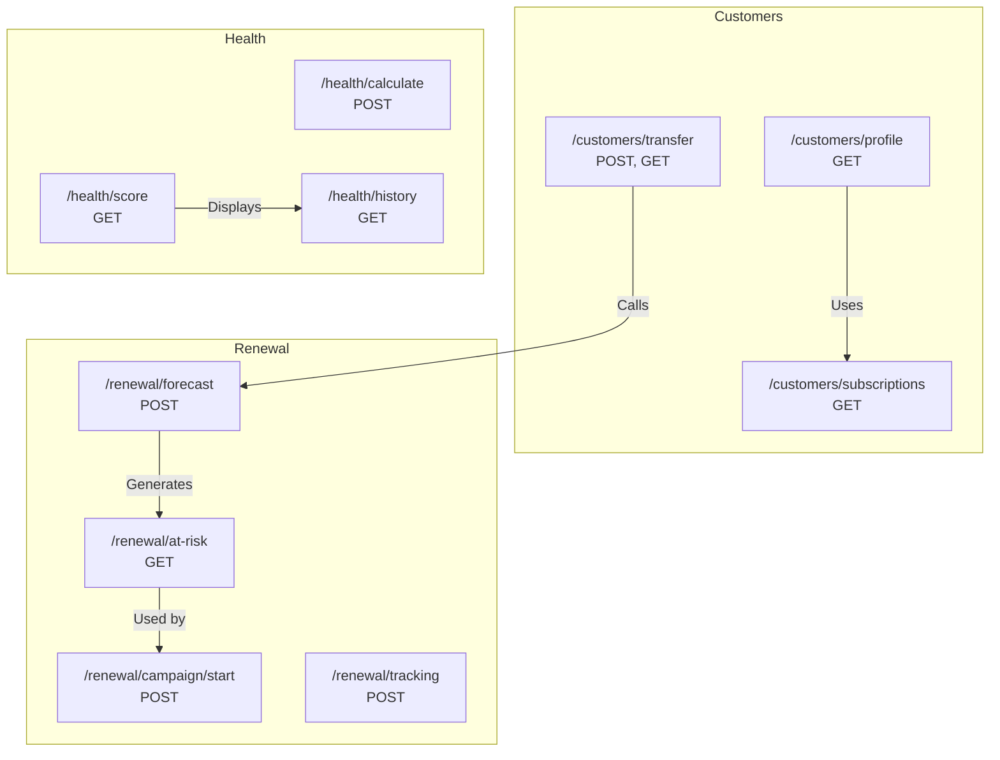

**Diagram sources**
- [app/api/v1/customers/profile/route.ts](file://app/api/v1/customers/profile/route.ts#L1-L103)
- [app/api/v1/customers/subscriptions/route.ts](file://app/api/v1/customers/subscriptions/route.ts#L1-L56)
- [app/api/v1/customers/transfer/route.ts](file://app/api/v1/customers/transfer/route.ts#L1-L102)
- [app/api/v1/renewal/forecast/route.ts](file://app/api/v1/renewal/forecast/route.ts#L1-L49)
- [app/api/v1/renewal/at-risk/route.ts](file://app/api/v1/renewal/at-risk/route.ts#L1-L44)
- [app/api/v1/renewal/campaign/start/route.ts](file://app/api/v1/renewal/campaign/start/route.ts#L1-L48)
- [app/api/v1/renewal/tracking/route.ts](file://app/api/v1/renewal/tracking/route.ts#L1-L48)
- [app/api/v1/health/calculate/route.ts](file://app/api/v1/health/calculate/route.ts#L1-L46)
- [app/api/v1/health/score/route.ts](file://app/api/v1/health/score/route.ts#L1-L50)
- [app/api/v1/health/history/route.ts](file://app/api/v1/health/history/route.ts#L1-L52)

**Section sources**
- [app/api/v1/customers/profile/route.ts](file://app/api/v1/customers/profile/route.ts#L1-L103)
- [app/api/v1/customers/subscriptions/route.ts](file://app/api/v1/customers/subscriptions/route.ts#L1-L56)
- [app/api/v1/customers/transfer/route.ts](file://app/api/v1/customers/transfer/route.ts#L1-L102)
- [app/api/v1/renewal/forecast/route.ts](file://app/api/v1/renewal/forecast/route.ts#L1-L49)
- [app/api/v1/renewal/at-risk/route.ts](file://app/api/v1/renewal/at-risk/route.ts#L1-L44)
- [app/api/v1/renewal/campaign/start/route.ts](file://app/api/v1/renewal/campaign/start/route.ts#L1-L48)
- [app/api/v1/renewal/tracking/route.ts](file://app/api/v1/renewal/tracking/route.ts#L1-L48)
- [app/api/v1/health/calculate/route.ts](file://app/api/v1/health/calculate/route.ts#L1-L46)
- [app/api/v1/health/score/route.ts](file://app/api/v1/health/score/route.ts#L1-L50)
- [app/api/v1/health/history/route.ts](file://app/api/v1/health/history/route.ts#L1-L52)

## Core Components
- Customer Profile API: Aggregates customer support tickets, computes metrics (open/resolved counts, average response time), and optionally attaches health score and tags.
- Subscription Status API: Returns current service subscription status for a tenant (mocked; designed to integrate with a Platform Service).
- Customer Transfer API: Handles customer handoff from SaaS Admin to CS-Support, including creation of post-onboarding records and optional CSM assignment.
- Renewal APIs: Forecast generation, at-risk customer discovery, campaign initiation, and renewal tracking creation.
- Health Scoring APIs: Calculate, retrieve, and fetch historical health scores with rate limits and input validation.

**Section sources**
- [app/api/v1/customers/profile/route.ts](file://app/api/v1/customers/profile/route.ts#L12-L102)
- [app/api/v1/customers/subscriptions/route.ts](file://app/api/v1/customers/subscriptions/route.ts#L13-L55)
- [app/api/v1/customers/transfer/route.ts](file://app/api/v1/customers/transfer/route.ts#L37-L101)
- [app/api/v1/renewal/forecast/route.ts](file://app/api/v1/renewal/forecast/route.ts#L10-L48)
- [app/api/v1/renewal/at-risk/route.ts](file://app/api/v1/renewal/at-risk/route.ts#L10-L43)
- [app/api/v1/renewal/campaign/start/route.ts](file://app/api/v1/renewal/campaign/start/route.ts#L10-L47)
- [app/api/v1/renewal/tracking/route.ts](file://app/api/v1/renewal/tracking/route.ts#L10-L47)
- [app/api/v1/health/calculate/route.ts](file://app/api/v1/health/calculate/route.ts#L20-L45)
- [app/api/v1/health/score/route.ts](file://app/api/v1/health/score/route.ts#L15-L49)
- [app/api/v1/health/history/route.ts](file://app/api/v1/health/history/route.ts#L15-L51)

## Architecture Overview
The APIs follow a layered architecture:
- Route handlers enforce authentication and parse inputs.
- Services encapsulate business logic (e.g., renewal orchestration, health scoring).
- Repositories/data access are used for data retrieval (e.g., tickets, conversations).
- Responses are standardized using helper utilities.

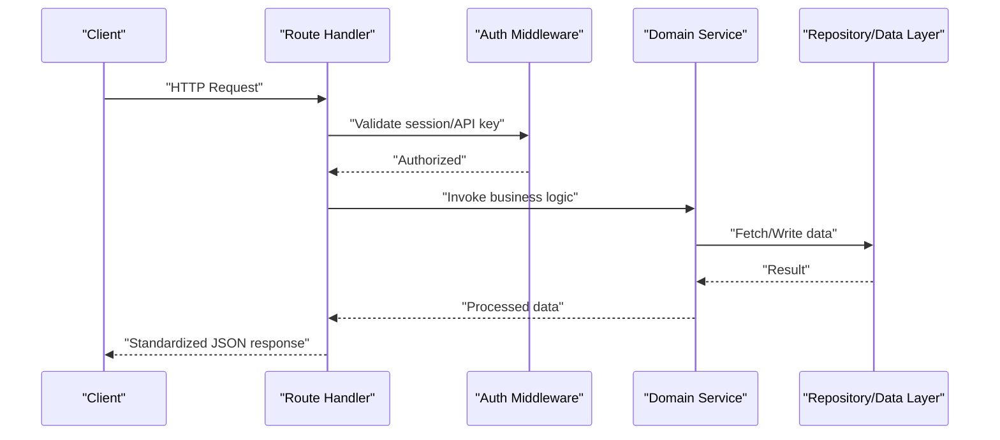

**Diagram sources**
- [app/api/v1/customers/profile/route.ts](file://app/api/v1/customers/profile/route.ts#L12-L102)
- [app/api/v1/renewal/forecast/route.ts](file://app/api/v1/renewal/forecast/route.ts#L10-L48)
- [app/api/v1/health/calculate/route.ts](file://app/api/v1/health/calculate/route.ts#L20-L45)

## Detailed Component Analysis

### Customer Profile API
- Endpoint: GET /api/v1/customers/profile
- Purpose: Retrieve customer profile data including ticket statistics, average response time, last contact, optional health score, and tags.
- Query parameters:
  - email (required): Customer email address.
  - tenant_id (optional): Tenant filter for multi-tenant environments.
- Response fields:
  - email, name, totalTickets, openTickets, resolvedTickets, averageResponseTime, lastContact, healthScore, healthLevel, tags.
- Security: Requires team member authentication.
- Notes:
  - Filters tickets by tenant if provided.
  - Computes response time only from resolved tickets with timestamps.
  - Health score is fetched only when tenant_id is present.

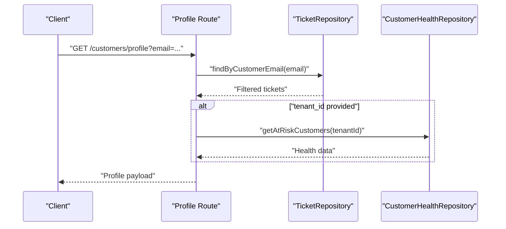

**Diagram sources**
- [app/api/v1/customers/profile/route.ts](file://app/api/v1/customers/profile/route.ts#L12-L98)

**Section sources**
- [app/api/v1/customers/profile/route.ts](file://app/api/v1/customers/profile/route.ts#L8-L102)

### Subscription Status API
- Endpoint: GET /api/v1/customers/subscriptions
- Purpose: Return current subscription status for services (INTAKE, VERIFY, DRAFT, SETTLE, CONNECT).
- Query parameters:
  - tenant_id (required): Tenant identifier.
- Response fields:
  - tenant_id, subscriptions (object with service booleans), updated_at.
- Security: Requires authenticated Clerk session.
- Notes:
  - Currently returns mock data; intended to call a Platform Service in production.

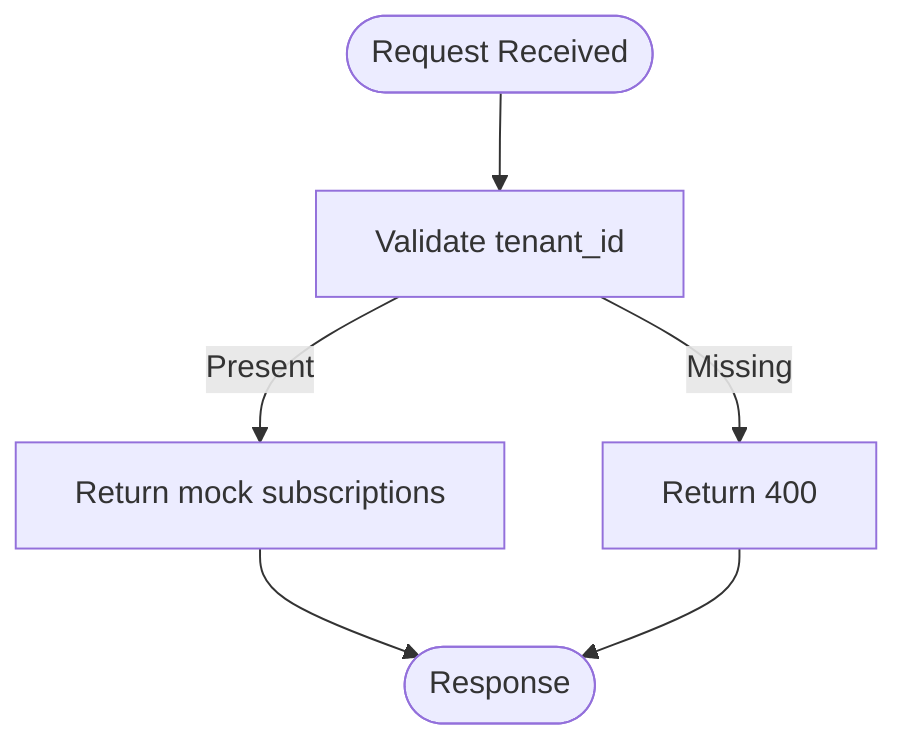

**Diagram sources**
- [app/api/v1/customers/subscriptions/route.ts](file://app/api/v1/customers/subscriptions/route.ts#L13-L55)

**Section sources**
- [app/api/v1/customers/subscriptions/route.ts](file://app/api/v1/customers/subscriptions/route.ts#L1-L56)

### Customer Transfer API
- Endpoints:
  - POST /api/v1/customers/transfer: Transfer customer from SaaS Admin to CS-Support after go-live.
  - GET /api/v1/customers/transfer: Check transfer status for a customer.
- POST request body (selected fields):
  - tenant_id (required)
  - customer_email (required)
  - go_live_date (required)
  - onboarding_completed_at (required)
  - customer_id (optional)
  - assigned_csm_id (optional)
  - initial_health_score (optional)
  - notes (optional)
  - metadata (optional)
- GET query parameters:
  - customer_email (required)
  - tenant_id (required)
- Security:
  - POST: Team member authentication; API key protection is recommended for SaaS Admin origin.
  - GET: Team member authentication.
- Notes:
  - POST validates required fields and delegates to a transfer service.
  - GET retrieves transfer status for a given customer and tenant.

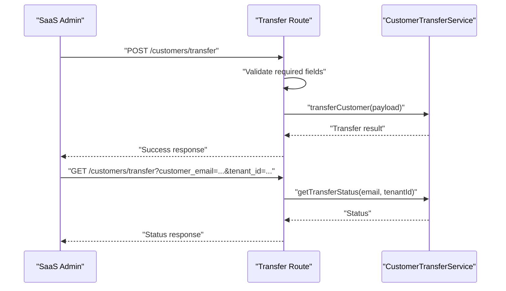

**Diagram sources**
- [app/api/v1/customers/transfer/route.ts](file://app/api/v1/customers/transfer/route.ts#L37-L101)

**Section sources**
- [app/api/v1/customers/transfer/route.ts](file://app/api/v1/customers/transfer/route.ts#L1-L102)

### Renewal Forecast API
- Endpoint: POST /api/v1/renewal/forecast
- Purpose: Generate a renewal forecast for a customer.
- Headers:
  - x-api-key (required): API key verification.
- Request body:
  - tenant_id (required)
  - customer_email (required)
  - renewal_id (optional)
- Security: API key verification required.
- Notes:
  - Delegates to a renewal orchestration service.

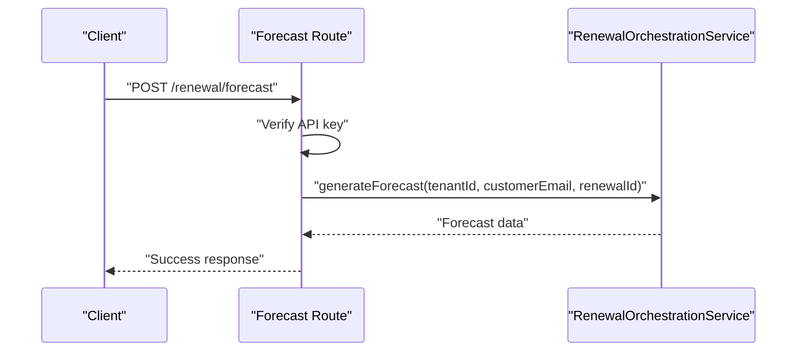

**Diagram sources**
- [app/api/v1/renewal/forecast/route.ts](file://app/api/v1/renewal/forecast/route.ts#L10-L48)

**Section sources**
- [app/api/v1/renewal/forecast/route.ts](file://app/api/v1/renewal/forecast/route.ts#L1-L49)

### At-Risk Renewals API
- Endpoint: GET /api/v1/renewal/at-risk
- Purpose: List renewals identified as at-risk based on configurable thresholds.
- Query parameters:
  - tenant_id (optional)
  - risk_threshold (default 70)
  - limit (default 50)
- Security: Requires authenticated Clerk session.
- Notes:
  - Delegates to a renewal orchestration service.

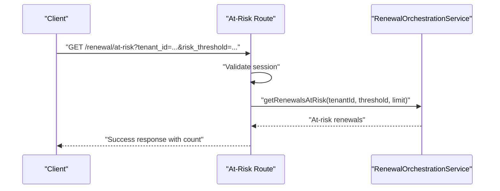

**Diagram sources**
- [app/api/v1/renewal/at-risk/route.ts](file://app/api/v1/renewal/at-risk/route.ts#L10-L43)

**Section sources**
- [app/api/v1/renewal/at-risk/route.ts](file://app/api/v1/renewal/at-risk/route.ts#L1-L44)

### Start Retention Campaign API
- Endpoint: POST /api/v1/renewal/campaign/start
- Purpose: Start a retention campaign for a given renewal.
- Headers:
  - x-api-key (required): API key verification.
- Request body:
  - renewal_id (required)
  - campaign_id (optional)
- Security: API key verification required.
- Notes:
  - Delegates to a renewal orchestration service.

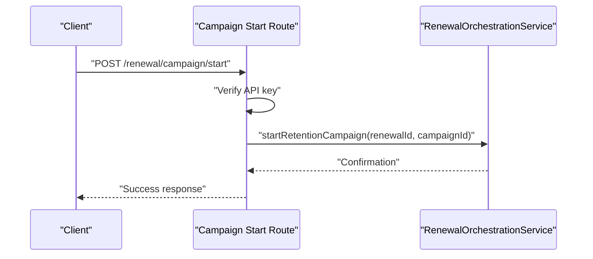

**Diagram sources**
- [app/api/v1/renewal/campaign/start/route.ts](file://app/api/v1/renewal/campaign/start/route.ts#L10-L47)

**Section sources**
- [app/api/v1/renewal/campaign/start/route.ts](file://app/api/v1/renewal/campaign/start/route.ts#L1-L48)

### Renewal Tracking API
- Endpoint: POST /api/v1/renewal/tracking
- Purpose: Create renewal tracking for a customer’s subscription.
- Security: Requires authenticated Clerk session.
- Request body:
  - tenant_id (required)
  - customer_email (required)
  - subscription_data (required)
- Notes:
  - Delegates to a renewal orchestration service.

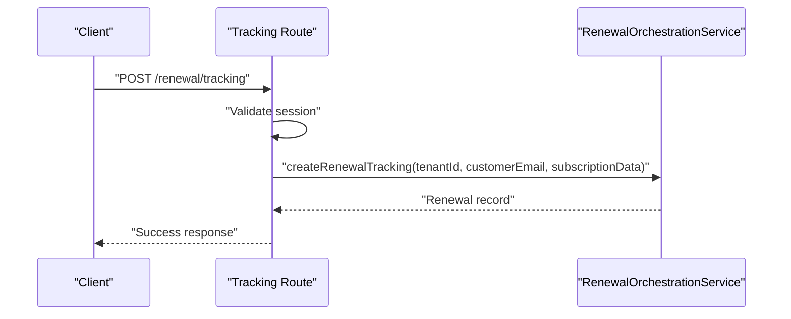

**Diagram sources**
- [app/api/v1/renewal/tracking/route.ts](file://app/api/v1/renewal/tracking/route.ts#L10-L47)

**Section sources**
- [app/api/v1/renewal/tracking/route.ts](file://app/api/v1/renewal/tracking/route.ts#L1-L48)

### Health Scoring APIs

#### Calculate Health Score API
- Endpoint: POST /api/v1/health/calculate
- Purpose: Recalculate a customer’s health score.
- Rate limit: 10 requests per minute per user.
- Request body:
  - tenantId (required, UUID)
  - customerEmail (required, email)
- Security: Team member authentication with rate limiting.
- Notes:
  - Delegates to a health scoring service.

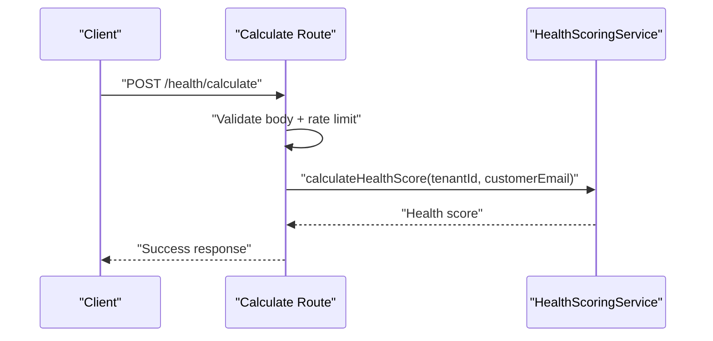

**Diagram sources**
- [app/api/v1/health/calculate/route.ts](file://app/api/v1/health/calculate/route.ts#L20-L45)

**Section sources**
- [app/api/v1/health/calculate/route.ts](file://app/api/v1/health/calculate/route.ts#L1-L46)

#### Get Health Score API
- Endpoint: GET /api/v1/health/score
- Purpose: Retrieve a customer’s current health score.
- Query parameters:
  - tenant_id (required)
  - customer_email (required)
- Rate limit: 30 requests per minute.
- Security: Team member authentication with rate limiting.
- Notes:
  - Returns null if no score exists.

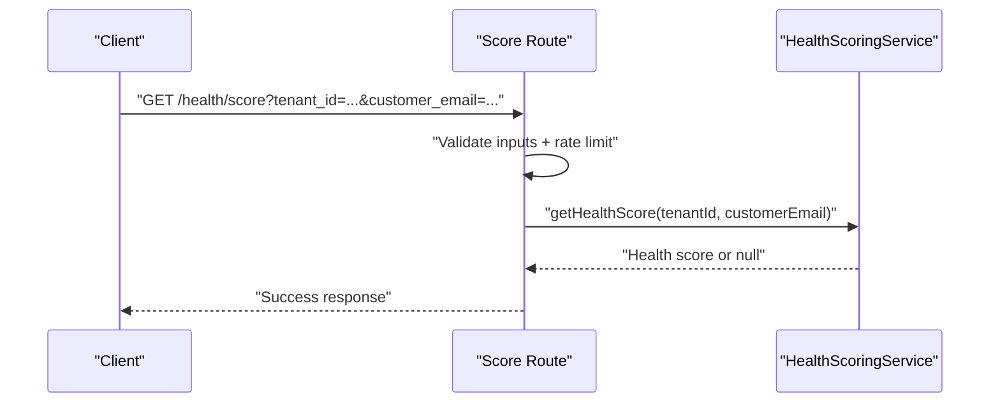

**Diagram sources**
- [app/api/v1/health/score/route.ts](file://app/api/v1/health/score/route.ts#L15-L49)

**Section sources**
- [app/api/v1/health/score/route.ts](file://app/api/v1/health/score/route.ts#L1-L50)

#### Health Score History API
- Endpoint: GET /api/v1/health/history
- Purpose: Retrieve health score history for trend analysis.
- Query parameters:
  - tenant_id (required)
  - customer_email (required)
  - limit (optional, default 30, min 1, max 100)
- Rate limit: 30 requests per minute.
- Security: Team member authentication with rate limiting.
- Notes:
  - Validates limit bounds.

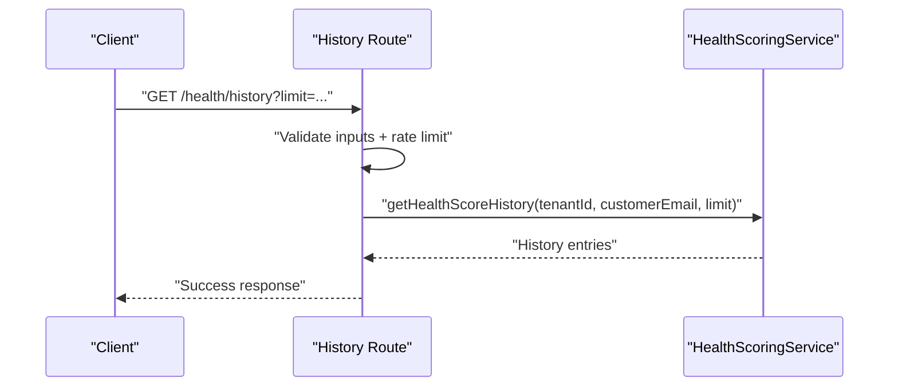

**Diagram sources**
- [app/api/v1/health/history/route.ts](file://app/api/v1/health/history/route.ts#L15-L51)

**Section sources**
- [app/api/v1/health/history/route.ts](file://app/api/v1/health/history/route.ts#L1-L52)

## Dependency Analysis
- Authentication and authorization:
  - Team member middleware protects most endpoints.
  - Clerk session validation is used for renewal and health read endpoints.
  - API key verification is used for cross-service renewal endpoints.
- Service layer:
  - RenewalOrchestrationService orchestrates renewal workflows.
  - HealthScoringService manages health computations and persistence.
  - CustomerTransferService handles customer handoffs.
- Data access:
  - Repositories are used for tickets and customer health data.
- External integration:
  - Subscription status is mocked; intended to call a Platform Service.

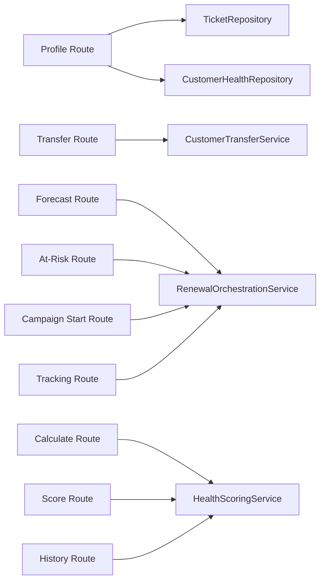

**Diagram sources**
- [app/api/v1/customers/profile/route.ts](file://app/api/v1/customers/profile/route.ts#L4-L6)
- [app/api/v1/customers/transfer/route.ts](file://app/api/v1/customers/transfer/route.ts#L16)
- [app/api/v1/renewal/forecast/route.ts](file://app/api/v1/renewal/forecast/route.ts#L7)
- [app/api/v1/renewal/at-risk/route.ts](file://app/api/v1/renewal/at-risk/route.ts#L7)
- [app/api/v1/renewal/campaign/start/route.ts](file://app/api/v1/renewal/campaign/start/route.ts#L7)
- [app/api/v1/renewal/tracking/route.ts](file://app/api/v1/renewal/tracking/route.ts#L7)
- [app/api/v1/health/calculate/route.ts](file://app/api/v1/health/calculate/route.ts#L12)
- [app/api/v1/health/score/route.ts](file://app/api/v1/health/score/route.ts#L13)
- [app/api/v1/health/history/route.ts](file://app/api/v1/health/history/route.ts#L13)

**Section sources**
- [app/api/v1/customers/profile/route.ts](file://app/api/v1/customers/profile/route.ts#L4-L6)
- [app/api/v1/customers/transfer/route.ts](file://app/api/v1/customers/transfer/route.ts#L16)
- [app/api/v1/renewal/forecast/route.ts](file://app/api/v1/renewal/forecast/route.ts#L7)
- [app/api/v1/renewal/at-risk/route.ts](file://app/api/v1/renewal/at-risk/route.ts#L7)
- [app/api/v1/renewal/campaign/start/route.ts](file://app/api/v1/renewal/campaign/start/route.ts#L7)
- [app/api/v1/renewal/tracking/route.ts](file://app/api/v1/renewal/tracking/route.ts#L7)
- [app/api/v1/health/calculate/route.ts](file://app/api/v1/health/calculate/route.ts#L12)
- [app/api/v1/health/score/route.ts](file://app/api/v1/health/score/route.ts#L13)
- [app/api/v1/health/history/route.ts](file://app/api/v1/health/history/route.ts#L13)

## Performance Considerations
- Rate limiting:
  - Health score calculation: 10 requests per minute.
  - Health score read endpoints: 30 requests per minute.
- Input validation:
  - Strict schema validation for calculation endpoint.
  - Input sanitization for health endpoints.
- Data computation:
  - Profile endpoint computes averages and sorts tickets; consider pagination or caching for large datasets.
- External dependencies:
  - Subscription status is currently mocked; plan for asynchronous calls and retries when integrating with Platform Service.

[No sources needed since this section provides general guidance]

## Troubleshooting Guide
- Authentication failures:
  - Ensure Clerk session is present for renewal and health read endpoints.
  - Provide a valid API key for renewal forecast and campaign start endpoints.
- Missing parameters:
  - Customer profile requires email; subscriptions require tenant_id.
  - Transfer endpoints require specific fields; renewal endpoints require tenant_id and customer_email.
- Error responses:
  - Standardized error responses with appropriate HTTP status codes are returned for validation and runtime errors.

**Section sources**
- [app/api/v1/customers/profile/route.ts](file://app/api/v1/customers/profile/route.ts#L18-L20)
- [app/api/v1/customers/subscriptions/route.ts](file://app/api/v1/customers/subscriptions/route.ts#L24-L26)
- [app/api/v1/customers/transfer/route.ts](file://app/api/v1/customers/transfer/route.ts#L45-L50)
- [app/api/v1/renewal/forecast/route.ts](file://app/api/v1/renewal/forecast/route.ts#L24-L29)
- [app/api/v1/renewal/at-risk/route.ts](file://app/api/v1/renewal/at-risk/route.ts#L22-L23)
- [app/api/v1/renewal/campaign/start/route.ts](file://app/api/v1/renewal/campaign/start/route.ts#L24-L29)
- [app/api/v1/renewal/tracking/route.ts](file://app/api/v1/renewal/tracking/route.ts#L23-L28)
- [app/api/v1/health/calculate/route.ts](file://app/api/v1/health/calculate/route.ts#L27-L30)
- [app/api/v1/health/score/route.ts](file://app/api/v1/health/score/route.ts#L26-L28)
- [app/api/v1/health/history/route.ts](file://app/api/v1/health/history/route.ts#L36-L38)

## Conclusion
These APIs provide a robust foundation for customer and subscription management, including profile insights, subscription visibility, seamless customer transfers, renewal forecasting, at-risk identification, and comprehensive health scoring. By leveraging standardized authentication, rate limiting, and service-layer abstractions, teams can integrate these endpoints to implement customer segmentation, upgrade/downgrade workflows, and targeted retention strategies effectively.