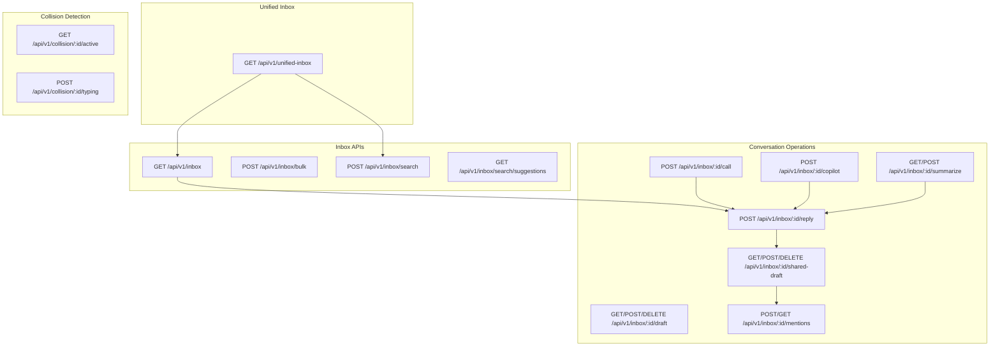
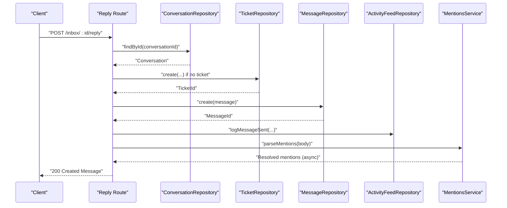
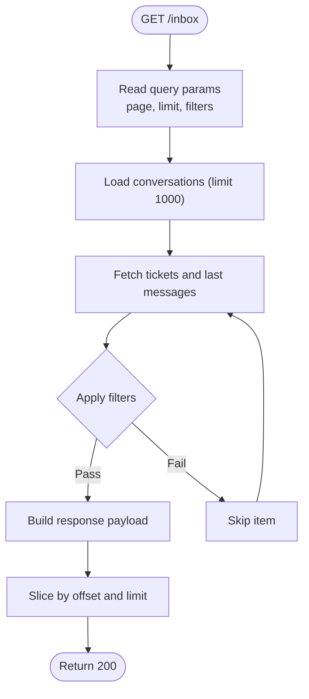
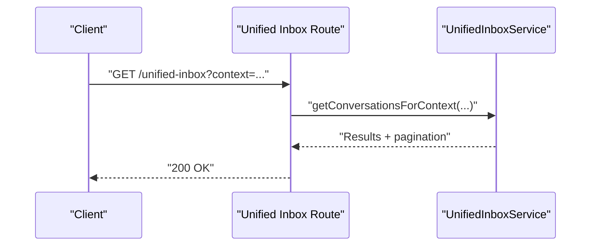
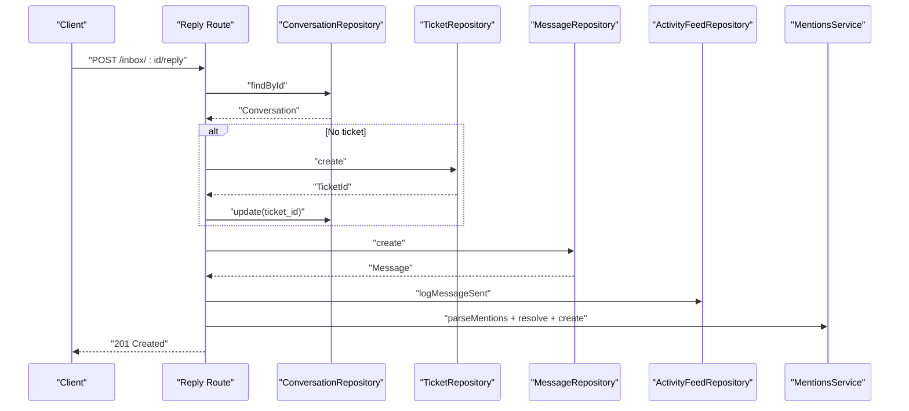
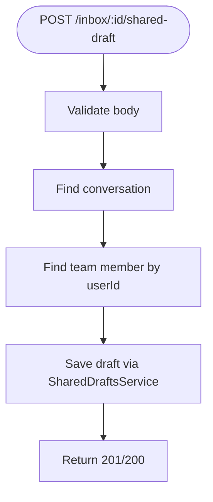
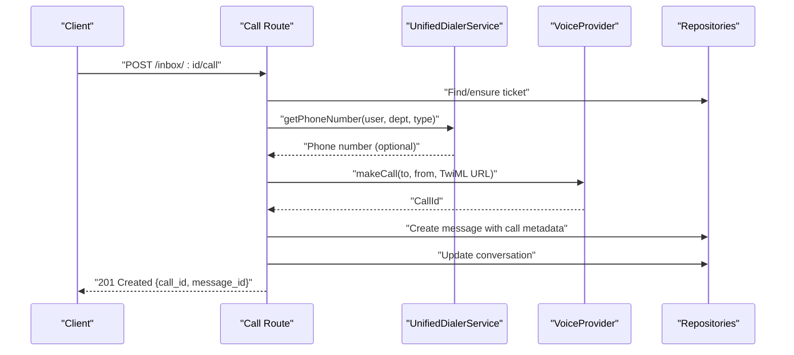
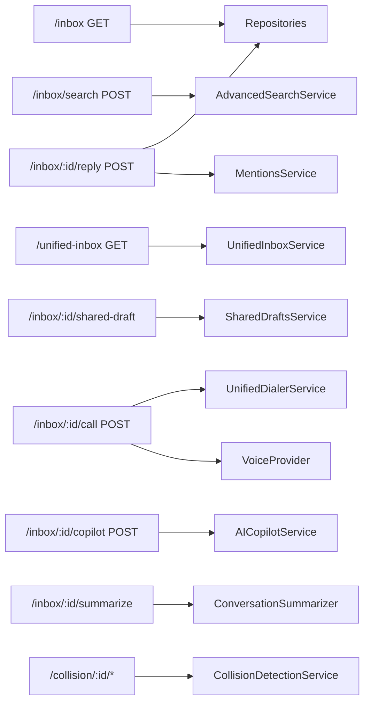

# Inbox & Conversation Management API

<cite>
**Referenced Files in This Document**
- [route.ts](file://app/api/v1/inbox/route.ts)
- [route.ts](file://app/api/v1/inbox/bulk/route.ts)
- [route.ts](file://app/api/v1/inbox/search/route.ts)
- [route.ts](file://app/api/v1/unified-inbox/route.ts)
- [route.ts](file://app/api/v1/inbox/[id]/reply/route.ts)
- [route.ts](file://app/api/v1/inbox/[id]/draft/route.ts)
- [route.ts](file://app/api/v1/inbox/[id]/shared-draft/route.ts)
- [route.ts](file://app/api/v1/inbox/[id]/mentions/route.ts)
- [route.ts](file://app/api/v1/inbox/[id]/call/route.ts)
- [route.ts](file://app/api/v1/inbox/[id]/copilot/route.ts)
- [route.ts](file://app/api/v1/inbox/[id]/summarize/route.ts)
- [route.ts](file://app/api/v1/collision/[id]/active/route.ts)
- [route.ts](file://app/api/v1/collision/[id]/typing/route.ts)
</cite>

## Table of Contents
1. [Introduction](#introduction)
2. [Project Structure](#project-structure)
3. [Core Components](#core-components)
4. [Architecture Overview](#architecture-overview)
5. [Detailed Component Analysis](#detailed-component-analysis)
6. [Dependency Analysis](#dependency-analysis)
7. [Performance Considerations](#performance-considerations)
8. [Troubleshooting Guide](#troubleshooting-guide)
9. [Conclusion](#conclusion)

## Introduction
This document provides comprehensive API documentation for inbox and conversation management endpoints. It covers conversation threading, reply generation, call handling, draft management, mention tagging, and bulk operations. It also documents unified inbox integration patterns, real-time collaboration indicators, conversation state management, message formatting, attachment handling, collaborative editing APIs, collision detection, typing indicators, and shared draft coordination.

## Project Structure
The inbox and conversation management APIs are organized under the Next.js App Router at app/api/v1. Key routes include:
- Inbox listing and search
- Unified inbox for context-aware views
- Conversation-specific operations (reply, draft, shared draft, mentions, call, AI copilot, summarize)
- Collision detection endpoints for active users and typing indicators

**Diagram sources**
- [route.ts](file://app/api/v1/inbox/route.ts#L13-L94)
- [route.ts](file://app/api/v1/inbox/bulk/route.ts#L18-L76)
- [route.ts](file://app/api/v1/inbox/search/route.ts#L26-L80)
- [route.ts](file://app/api/v1/unified-inbox/route.ts#L12-L50)
- [route.ts](file://app/api/v1/inbox/[id]/reply/route.ts#L15-L104)
- [route.ts](file://app/api/v1/inbox/[id]/draft/route.ts#L16-L112)
- [route.ts](file://app/api/v1/inbox/[id]/shared-draft/route.ts#L27-L156)
- [route.ts](file://app/api/v1/inbox/[id]/mentions/route.ts#L18-L97)
- [route.ts](file://app/api/v1/inbox/[id]/call/route.ts#L23-L139)
- [route.ts](file://app/api/v1/inbox/[id]/copilot/route.ts#L11-L37)
- [route.ts](file://app/api/v1/inbox/[id]/summarize/route.ts#L12-L68)
- [route.ts](file://app/api/v1/collision/[id]/active/route.ts#L12-L31)
- [route.ts](file://app/api/v1/collision/[id]/typing/route.ts#L12-L31)

**Section sources**
- [route.ts](file://app/api/v1/inbox/route.ts#L13-L94)
- [route.ts](file://app/api/v1/inbox/bulk/route.ts#L18-L76)
- [route.ts](file://app/api/v1/inbox/search/route.ts#L26-L80)
- [route.ts](file://app/api/v1/unified-inbox/route.ts#L12-L50)

## Core Components
- Inbox listing endpoint: Returns paginated conversations with optional filters (channel, status, assignment, search) and previews derived from related tickets and messages.
- Unified inbox endpoint: Context-aware conversation retrieval supporting channel, status, assignment, search, and tag filters.
- Conversation operations:
  - Reply: Creates a ticket if missing, persists a message, logs activity, and asynchronously parses/creates mentions.
  - Draft: CRUD operations for per-conversation drafts stored in conversation metadata.
  - Shared draft: Collaborative editing with sharing modes, role scoping, and edit permissions.
  - Mentions: Parse mentions from text and resolve to team members.
  - Call: Initiates outbound calls via integrated voice provider, creates call-related message, and updates conversation state.
  - AI Copilot: Generates AI-powered reply drafts with full conversation context.
  - Summarize: Retrieves or forces regeneration of conversation summaries.
- Bulk actions: Assign, tag, status, and priority updates across multiple conversations.
- Collision detection: Real-time indicators for active users and typing.

**Section sources**
- [route.ts](file://app/api/v1/inbox/route.ts#L13-L94)
- [route.ts](file://app/api/v1/unified-inbox/route.ts#L12-L50)
- [route.ts](file://app/api/v1/inbox/[id]/reply/route.ts#L15-L104)
- [route.ts](file://app/api/v1/inbox/[id]/draft/route.ts#L16-L112)
- [route.ts](file://app/api/v1/inbox/[id]/shared-draft/route.ts#L27-L156)
- [route.ts](file://app/api/v1/inbox/[id]/mentions/route.ts#L18-L97)
- [route.ts](file://app/api/v1/inbox/[id]/call/route.ts#L23-L139)
- [route.ts](file://app/api/v1/inbox/[id]/copilot/route.ts#L11-L37)
- [route.ts](file://app/api/v1/inbox/[id]/summarize/route.ts#L12-L68)
- [route.ts](file://app/api/v1/inbox/bulk/route.ts#L18-L76)
- [route.ts](file://app/api/v1/collision/[id]/active/route.ts#L12-L31)
- [route.ts](file://app/api/v1/collision/[id]/typing/route.ts#L12-L31)

## Architecture Overview
The APIs follow a layered architecture:
- Route handlers enforce authentication and authorization, parse requests, and orchestrate domain operations.
- Repositories encapsulate persistence logic for conversations, tickets, messages, and activity feeds.
- Services encapsulate business logic for advanced search, mentions, unified dialer, AI copilot, summarization, and collision detection.
- Validation uses Zod schemas for request bodies and query parameters.

**Diagram sources**
- [route.ts](file://app/api/v1/inbox/[id]/reply/route.ts#L15-L104)

## Detailed Component Analysis

### Inbox Listing API
- Endpoint: GET /api/v1/inbox
- Filters: channel, status, assigned_to (supports "me" and "unassigned"), search across customer, ticket subject, and last message preview.
- Pagination: page, limit, offset computed from query parameters.
- Response: Array of conversations enriched with ticket subject, last message preview, unread count, status, priority, and assignment.

**Diagram sources**
- [route.ts](file://app/api/v1/inbox/route.ts#L13-L94)

**Section sources**
- [route.ts](file://app/api/v1/inbox/route.ts#L13-L94)

### Unified Inbox API
- Endpoint: GET /api/v1/unified-inbox
- Query params: context (default "cs"), channel, status, assigned_to, search, tags (comma-separated).
- Pagination: page, limit.
- Response: Conversations filtered by context and tenant.

**Diagram sources**
- [route.ts](file://app/api/v1/unified-inbox/route.ts#L12-L50)

**Section sources**
- [route.ts](file://app/api/v1/unified-inbox/route.ts#L12-L50)

### Advanced Search API
- Endpoint: POST /api/v1/inbox/search
- Body: query, channel[], status[], priority[], assignedTo[] ("me" resolves to current user, "unassigned" supported), tags[], dateRange(from,to), customerEmail.
- Response: results with pagination.

- Endpoint: GET /api/v1/inbox/search/suggestions
- Query: q (minimum length 2).
- Response: suggestions array.

**Section sources**
- [route.ts](file://app/api/v1/inbox/search/route.ts#L26-L80)
- [route.ts](file://app/api/v1/inbox/search/route.ts#L86-L112)

### Bulk Actions API
- Endpoint: POST /api/v1/inbox/bulk
- Body: conversation_ids[], action (assign, tag, status, priority), value.
- Behavior:
  - assign: set assigned_to on conversation and linked ticket.
  - status: set status on conversation and linked ticket.
  - priority: set priority on linked ticket.
  - tag: append tag to conversation tags if not present.
- Response: success/failure counts and errors.

**Section sources**
- [route.ts](file://app/api/v1/inbox/bulk/route.ts#L18-L76)

### Reply Generation API
- Endpoint: POST /api/v1/inbox/:id/reply
- Body: body (required), is_internal (optional), attachments[] (optional).
- Flow:
  - Find conversation; if no ticket exists, create one and link it.
  - Persist message with sender metadata.
  - Log activity.
  - Asynchronously parse mentions and create mention records.

**Diagram sources**
- [route.ts](file://app/api/v1/inbox/[id]/reply/route.ts#L15-L104)

**Section sources**
- [route.ts](file://app/api/v1/inbox/[id]/reply/route.ts#L15-L104)

### Draft Management API
- Endpoint: GET /api/v1/inbox/:id/draft
  - Returns saved draft from conversation metadata.
- Endpoint: POST /api/v1/inbox/:id/draft
  - Body: body (max 5000 chars), attachments[].
  - Saves draft with saved_at, saved_by.
- Endpoint: DELETE /api/v1/inbox/:id/draft
  - Removes draft from metadata.

**Section sources**
- [route.ts](file://app/api/v1/inbox/[id]/draft/route.ts#L16-L112)

### Shared Draft API
- Endpoint: GET /api/v1/inbox/:id/shared-draft
  - Returns shared draft for conversation if exists.
- Endpoint: POST /api/v1/inbox/:id/shared-draft
  - Body: subject?, body (required), body_html?, attachments[], shared_with_team (all, assigned_team, specific_role), shared_with_role?, editable_by_all (default true), existing_draft_id?.
  - Persists draft with sharing and edit permissions.
- Endpoint: DELETE /api/v1/inbox/:id/shared-draft
  - Discards existing draft.

**Diagram sources**
- [route.ts](file://app/api/v1/inbox/[id]/shared-draft/route.ts#L61-L122)

**Section sources**
- [route.ts](file://app/api/v1/inbox/[id]/shared-draft/route.ts#L27-L156)

### Mention Tagging API
- Endpoint: POST /api/v1/inbox/:id/mentions
  - Body: message_id (UUID), text (required).
  - Parses mentions, resolves to team member IDs, and creates mention records.
- Endpoint: GET /api/v1/inbox/:id/mentions
  - Returns all mentions for a conversation.

**Section sources**
- [route.ts](file://app/api/v1/inbox/[id]/mentions/route.ts#L18-L97)

### Call Handling API
- Endpoint: POST /api/v1/inbox/:id/call
  - Body: to (required), from (optional), record (default true), notes (optional).
  - Ensures ticket exists; resolves outbound caller number via unified dialer or defaults; initiates call via voice provider; creates message with call metadata; updates conversation; logs activity.

**Diagram sources**
- [route.ts](file://app/api/v1/inbox/[id]/call/route.ts#L23-L139)

**Section sources**
- [route.ts](file://app/api/v1/inbox/[id]/call/route.ts#L23-L139)

### AI Copilot API
- Endpoint: POST /api/v1/inbox/:id/copilot
  - Generates AI-powered draft using full conversation context.

**Section sources**
- [route.ts](file://app/api/v1/inbox/[id]/copilot/route.ts#L11-L37)

### Conversation Summarization API
- Endpoint: GET /api/v1/inbox/:id/summarize?regenerate=true|false
  - Returns cached or generated summary.
- Endpoint: POST /api/v1/inbox/:id/summarize
  - Forces regeneration of summary.

**Section sources**
- [route.ts](file://app/api/v1/inbox/[id]/summarize/route.ts#L12-L68)

### Collision Detection APIs
- Endpoint: GET /api/v1/collision/:id/active
  - Returns active users collaborating on a conversation.
- Endpoint: POST /api/v1/collision/:id/typing
  - Marks current user as typing in the conversation.

**Section sources**
- [route.ts](file://app/api/v1/collision/[id]/active/route.ts#L12-L31)
- [route.ts](file://app/api/v1/collision/[id]/typing/route.ts#L12-L31)

## Dependency Analysis
- Route handlers depend on:
  - Authentication middleware (withTeamMember or requireAuth).
  - Zod-based validation helpers.
  - Repository layer for persistence.
  - Service layer for domain logic (mentions, unified dialer, AI copilot, summarization, collision detection).
- Unified inbox integrates with context-aware filters and pagination.
- Reply flow integrates mentions parsing and asynchronous creation to avoid blocking responses.

**Diagram sources**
- [route.ts](file://app/api/v1/inbox/route.ts#L13-L94)
- [route.ts](file://app/api/v1/inbox/search/route.ts#L26-L80)
- [route.ts](file://app/api/v1/unified-inbox/route.ts#L12-L50)
- [route.ts](file://app/api/v1/inbox/[id]/reply/route.ts#L15-L104)
- [route.ts](file://app/api/v1/inbox/[id]/shared-draft/route.ts#L27-L156)
- [route.ts](file://app/api/v1/inbox/[id]/call/route.ts#L23-L139)
- [route.ts](file://app/api/v1/inbox/[id]/copilot/route.ts#L11-L37)
- [route.ts](file://app/api/v1/inbox/[id]/summarize/route.ts#L12-L68)
- [route.ts](file://app/api/v1/collision/[id]/active/route.ts#L12-L31)
- [route.ts](file://app/api/v1/collision/[id]/typing/route.ts#L12-L31)

**Section sources**
- [route.ts](file://app/api/v1/inbox/route.ts#L13-L94)
- [route.ts](file://app/api/v1/inbox/search/route.ts#L26-L80)
- [route.ts](file://app/api/v1/unified-inbox/route.ts#L12-L50)
- [route.ts](file://app/api/v1/inbox/[id]/reply/route.ts#L15-L104)
- [route.ts](file://app/api/v1/inbox/[id]/shared-draft/route.ts#L27-L156)
- [route.ts](file://app/api/v1/inbox/[id]/call/route.ts#L23-L139)
- [route.ts](file://app/api/v1/inbox/[id]/copilot/route.ts#L11-L37)
- [route.ts](file://app/api/v1/inbox/[id]/summarize/route.ts#L12-L68)
- [route.ts](file://app/api/v1/collision/[id]/active/route.ts#L12-L31)
- [route.ts](file://app/api/v1/collision/[id]/typing/route.ts#L12-L31)

## Performance Considerations
- Filtering and pagination: The inbox listing loads up to 1000 conversations for client-side filtering; consider narrowing initial load or adding server-side filters for large datasets.
- Asynchronous mention processing: Mentions parsing occurs after responding to avoid latency; ensure background workers handle failures gracefully.
- Unified inbox context queries: Use tenant-aware filters and pagination to keep responses fast.
- Shared drafts: Store minimal metadata; avoid large HTML bodies in shared drafts to reduce payload sizes.
- Call initiation: Phone number resolution via unified dialer may add latency; cache results when appropriate.

## Troubleshooting Guide
- Unauthorized access: Ensure authentication middleware is applied; verify context.userId and team membership where required.
- Conversation not found: Validate conversation IDs and tenant scoping.
- Mention parsing failures: Parsing is attempted asynchronously; check logs for mention processing errors.
- Call initiation failures: Verify voice provider credentials, TwiML URL, and phone number resolution.
- Shared draft validation errors: Confirm schema compliance for subject/body/attachments and sharing options.
- Bulk action partial failures: Inspect error arrays for per-conversation failure reasons.

**Section sources**
- [route.ts](file://app/api/v1/inbox/[id]/reply/route.ts#L94-L97)
- [route.ts](file://app/api/v1/inbox/[id]/call/route.ts#L135-L137)
- [route.ts](file://app/api/v1/inbox/[id]/shared-draft/route.ts#L109-L121)
- [route.ts](file://app/api/v1/inbox/bulk/route.ts#L66-L70)

## Conclusion
The inbox and conversation management APIs provide a robust foundation for managing conversations across channels, integrating unified inbox contexts, enabling collaborative drafting, handling mentions, initiating calls, and offering AI-assisted reply generation. Real-time collaboration indicators and collision detection enhance teamwork. The modular design with repositories and services supports maintainability and extensibility.