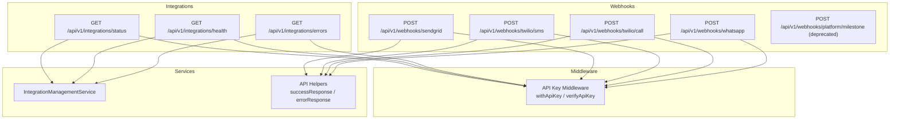
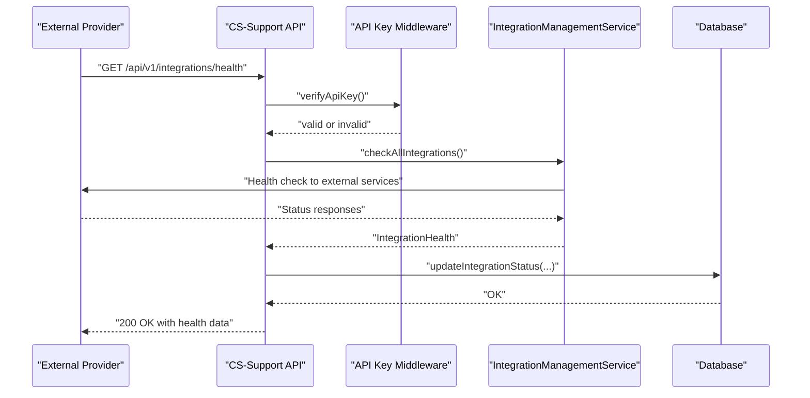
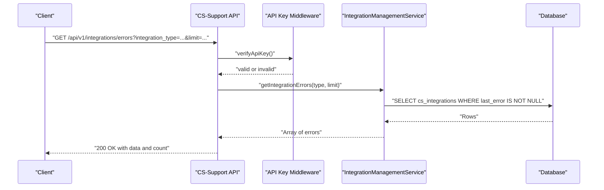
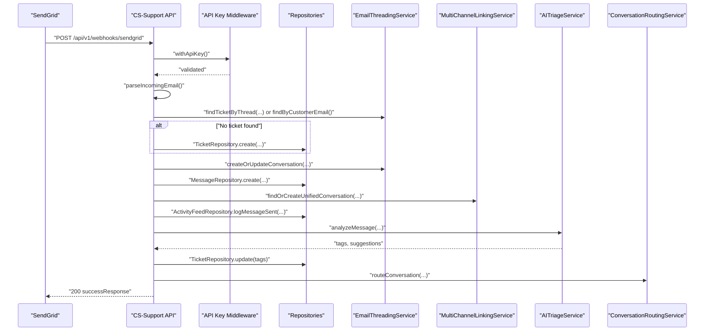
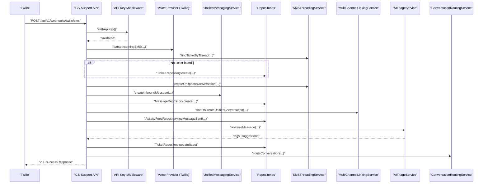
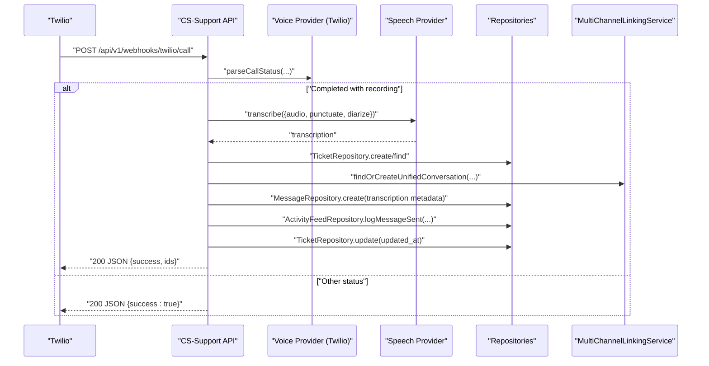
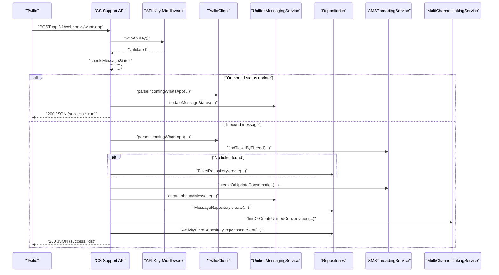
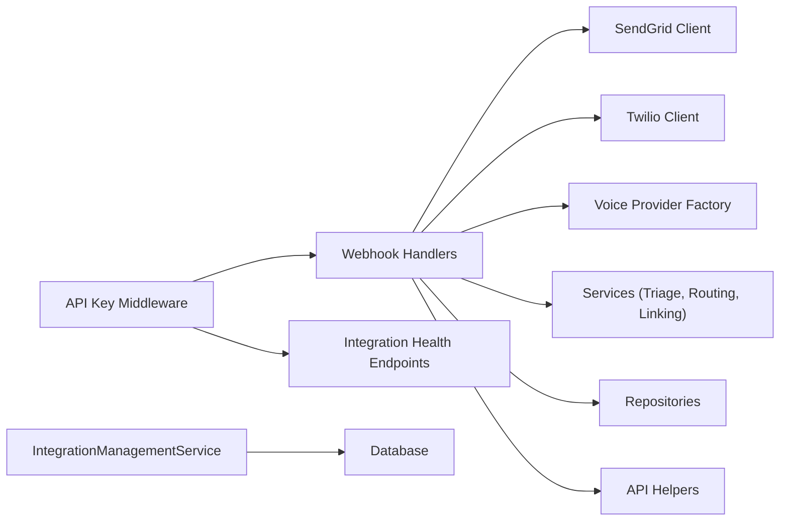

# Integrations & Webhooks API

<cite>
**Referenced Files in This Document**
- [route.ts](file://app/api/v1/integrations/status/route.ts)
- [route.ts](file://app/api/v1/integrations/health/route.ts)
- [route.ts](file://app/api/v1/integrations/errors/route.ts)
- [api-key.ts](file://lib/middleware/api-key.ts)
- [integration-management.ts](file://lib/services/integration-management.ts)
- [helpers.ts](file://lib/api/helpers.ts)
- [route.ts](file://app/api/v1/webhooks/sendgrid/route.ts)
- [route.ts](file://app/api/v1/webhooks/twilio/sms/route.ts)
- [route.ts](file://app/api/v1/webhooks/twilio/call/route.ts)
- [route.ts](file://app/api/v1/webhooks/whatsapp/route.ts)
- [route.ts](file://app/api/v1/webhooks/platform/milestone/route.ts)
- [sendgrid.ts](file://lib/integrations/sendgrid.ts)
- [twilio.ts](file://lib/integrations/twilio.ts)
- [voice-provider-factory.ts](file://lib/integrations/voice-provider-factory.ts)
</cite>

## Table of Contents
1. [Introduction](#introduction)
2. [Project Structure](#project-structure)
3. [Core Components](#core-components)
4. [Architecture Overview](#architecture-overview)
5. [Detailed Component Analysis](#detailed-component-analysis)
6. [Dependency Analysis](#dependency-analysis)
7. [Performance Considerations](#performance-considerations)
8. [Troubleshooting Guide](#troubleshooting-guide)
9. [Conclusion](#conclusion)
10. [Appendices](#appendices)

## Introduction
This document provides comprehensive API documentation for integrations and webhooks within the TrueVow CS Support Service. It covers:
- Integration health monitoring and status retrieval
- Webhook endpoints for email (SendGrid), SMS, calls, and WhatsApp via Twilio
- Security patterns using API keys and optional user authentication
- Error handling, retry mechanisms, and monitoring procedures
- Practical setup examples and troubleshooting guidance

## Project Structure
The integrations and webhooks surface under the Next.js App Router at app/api/v1. Key areas:
- Integrations: status, health, and error retrieval
- Webhooks: SendGrid email, Twilio SMS, Twilio Calls, Twilio WhatsApp
- Middleware: API key verification and enforcement
- Services: Integration management and helpers for consistent responses

**Diagram sources**
- [route.ts](file://app/api/v1/integrations/status/route.ts#L1-L31)
- [route.ts](file://app/api/v1/integrations/health/route.ts#L1-L40)
- [route.ts](file://app/api/v1/integrations/errors/route.ts#L1-L38)
- [api-key.ts](file://lib/middleware/api-key.ts#L83-L100)
- [integration-management.ts](file://lib/services/integration-management.ts#L23-L100)
- [helpers.ts](file://lib/api/helpers.ts#L18-L48)
- [route.ts](file://app/api/v1/webhooks/sendgrid/route.ts#L1-L188)
- [route.ts](file://app/api/v1/webhooks/twilio/sms/route.ts#L1-L173)
- [route.ts](file://app/api/v1/webhooks/twilio/call/route.ts#L1-L157)
- [route.ts](file://app/api/v1/webhooks/whatsapp/route.ts#L1-L176)
- [route.ts](file://app/api/v1/webhooks/platform/milestone/route.ts#L1-L23)

**Section sources**
- [route.ts](file://app/api/v1/integrations/status/route.ts#L1-L31)
- [route.ts](file://app/api/v1/integrations/health/route.ts#L1-L40)
- [route.ts](file://app/api/v1/integrations/errors/route.ts#L1-L38)
- [api-key.ts](file://lib/middleware/api-key.ts#L1-L122)
- [integration-management.ts](file://lib/services/integration-management.ts#L1-L312)
- [helpers.ts](file://lib/api/helpers.ts#L1-L177)
- [route.ts](file://app/api/v1/webhooks/sendgrid/route.ts#L1-L188)
- [route.ts](file://app/api/v1/webhooks/twilio/sms/route.ts#L1-L173)
- [route.ts](file://app/api/v1/webhooks/twilio/call/route.ts#L1-L157)
- [route.ts](file://app/api/v1/webhooks/whatsapp/route.ts#L1-L176)
- [route.ts](file://app/api/v1/webhooks/platform/milestone/route.ts#L1-L23)

## Core Components
- Integration Management Service
  - Provides health checks for Sales-CRM, Platform, Internal Ops, and Tenant services
  - Aggregates per-integration status and overall system health
  - Persists integration status and errors to the database
- API Key Middleware
  - Validates API keys from Authorization Bearer or X-API-Key headers
  - Supports service-to-service authentication across multiple internal services
  - Wraps route handlers to enforce API key requirements
- Webhook Handlers
  - SendGrid: Processes inbound emails, threads conversations, creates tickets/messages, logs activities, and optionally auto-triage/route
  - Twilio SMS: Handles inbound SMS, threads, creates tickets/messages, links cross-channel conversations, and optionally auto-triage/route
  - Twilio Call: Processes call status updates and recordings, transcribes audio, creates tickets/messages, and logs activities
  - Twilio WhatsApp: Handles inbound messages and outbound status updates, threads, creates tickets/messages, links cross-channel conversations, and logs activities
- API Helpers
  - Standardized success/error responses and validation utilities

**Section sources**
- [integration-management.ts](file://lib/services/integration-management.ts#L23-L100)
- [api-key.ts](file://lib/middleware/api-key.ts#L83-L122)
- [route.ts](file://app/api/v1/webhooks/sendgrid/route.ts#L19-L186)
- [route.ts](file://app/api/v1/webhooks/twilio/sms/route.ts#L25-L172)
- [route.ts](file://app/api/v1/webhooks/twilio/call/route.ts#L17-L156)
- [route.ts](file://app/api/v1/webhooks/whatsapp/route.ts#L19-L175)
- [helpers.ts](file://lib/api/helpers.ts#L18-L48)

## Architecture Overview
The system enforces API key-based authentication for service-to-service endpoints while allowing optional user authentication for admin endpoints. Webhook handlers ingest events from external providers, normalize them, and integrate with internal repositories and services to create or update tickets, conversations, and messages. Integration health endpoints query external services and persist status to the database.

**Diagram sources**
- [route.ts](file://app/api/v1/integrations/health/route.ts#L10-L39)
- [api-key.ts](file://lib/middleware/api-key.ts#L117-L122)
- [integration-management.ts](file://lib/services/integration-management.ts#L27-L100)
- [integration-management.ts](file://lib/services/integration-management.ts#L286-L310)

## Detailed Component Analysis

### Integration Status and Health Endpoints
- Endpoint: GET /api/v1/integrations/status
  - Purpose: Retrieve aggregated integration status across all connected services
  - Authentication: Requires either Clerk user session or a valid API key
  - Response: IntegrationHealth object containing overall status and per-integration details
- Endpoint: GET /api/v1/integrations/health
  - Purpose: Same as status, but additionally persists health updates to the database
  - Authentication: Same as above
  - Side effect: Updates integration status records with latest health and timestamps
- Endpoint: GET /api/v1/integrations/errors?integration_type={type}&limit={n}
  - Purpose: Fetch recent integration errors stored in the database
  - Query params:
    - integration_type: Filter by integration type
    - limit: Number of errors to return (default 50)
  - Authentication: Same as above

**Diagram sources**
- [route.ts](file://app/api/v1/integrations/errors/route.ts#L10-L29)
- [api-key.ts](file://lib/middleware/api-key.ts#L117-L122)
- [integration-management.ts](file://lib/services/integration-management.ts#L252-L281)

**Section sources**
- [route.ts](file://app/api/v1/integrations/status/route.ts#L10-L30)
- [route.ts](file://app/api/v1/integrations/health/route.ts#L10-L39)
- [route.ts](file://app/api/v1/integrations/errors/route.ts#L10-L37)
- [integration-management.ts](file://lib/services/integration-management.ts#L23-L100)
- [integration-management.ts](file://lib/services/integration-management.ts#L252-L310)

### SendGrid Email Webhook
- Endpoint: POST /api/v1/webhooks/sendgrid
- Purpose: Ingest inbound emails from SendGrid, create or link tickets, manage conversations, log activities, and optionally auto-triage/route
- Processing logic:
  - Parse incoming email payload
  - Thread by references/in-reply-to or by recent open tickets for the sender
  - Create ticket if none exists
  - Create or update conversation and message
  - Attempt multi-channel linking
  - Log activity
  - Async triage and routing if enabled
- Security: Enforced via API key middleware
- Response: successResponse with identifiers

**Diagram sources**
- [route.ts](file://app/api/v1/webhooks/sendgrid/route.ts#L19-L186)
- [sendgrid.ts](file://lib/integrations/sendgrid.ts#L114-L148)
- [helpers.ts](file://lib/api/helpers.ts#L18-L31)

**Section sources**
- [route.ts](file://app/api/v1/webhooks/sendgrid/route.ts#L19-L186)
- [sendgrid.ts](file://lib/integrations/sendgrid.ts#L30-L148)
- [helpers.ts](file://lib/api/helpers.ts#L18-L31)

### Twilio SMS Webhook
- Endpoint: POST /api/v1/webhooks/twilio/sms
- Purpose: Ingest inbound SMS, create or link tickets, manage conversations, integrate via Unified Messaging Service, and optionally auto-triage/route
- Processing logic:
  - Parse SMS payload via voice provider abstraction
  - Thread by message metadata or create new ticket
  - Create unified inbound message and cs_messages row
  - Attempt multi-channel linking
  - Log activity
  - Async triage and routing if enabled
- Security: Enforced via API key middleware

**Diagram sources**
- [route.ts](file://app/api/v1/webhooks/twilio/sms/route.ts#L25-L172)
- [twilio.ts](file://lib/integrations/twilio.ts#L117-L130)
- [voice-provider-factory.ts](file://lib/integrations/voice-provider-factory.ts#L12-L22)
- [helpers.ts](file://lib/api/helpers.ts#L18-L31)

**Section sources**
- [route.ts](file://app/api/v1/webhooks/twilio/sms/route.ts#L25-L172)
- [twilio.ts](file://lib/integrations/twilio.ts#L117-L130)
- [voice-provider-factory.ts](file://lib/integrations/voice-provider-factory.ts#L12-L22)
- [helpers.ts](file://lib/api/helpers.ts#L18-L31)

### Twilio Call Webhook
- Endpoint: POST /api/v1/webhooks/twilio/call
- Purpose: Process call status updates and recordings; transcribe audio, create tickets/messages, and log activities
- Processing logic:
  - Parse call status via voice provider abstraction
  - Only process completed calls with recordings
  - Transcribe using speech provider abstraction
  - Create or link ticket and conversation
  - Store transcription metadata in message
  - Log activity and update ticket timestamps
- Security: Enforced via API key middleware

**Diagram sources**
- [route.ts](file://app/api/v1/webhooks/twilio/call/route.ts#L17-L156)
- [twilio.ts](file://lib/integrations/twilio.ts#L132-L153)
- [voice-provider-factory.ts](file://lib/integrations/voice-provider-factory.ts#L12-L22)

**Section sources**
- [route.ts](file://app/api/v1/webhooks/twilio/call/route.ts#L17-L156)
- [twilio.ts](file://lib/integrations/twilio.ts#L132-L153)
- [voice-provider-factory.ts](file://lib/integrations/voice-provider-factory.ts#L12-L22)

### Twilio WhatsApp Webhook
- Endpoint: POST /api/v1/webhooks/whatsapp
- Purpose: Handle inbound WhatsApp messages and outbound status updates; similar threading and linking as SMS
- Processing logic:
  - Detect outbound status updates vs inbound messages
  - For outbound: update message status via Unified Messaging Service
  - For inbound: parse via Twilio client, thread, create ticket/conversation/message, link across channels, log activity
- Security: Enforced via API key middleware

**Diagram sources**
- [route.ts](file://app/api/v1/webhooks/whatsapp/route.ts#L19-L175)
- [twilio.ts](file://lib/integrations/twilio.ts#L214-L240)

**Section sources**
- [route.ts](file://app/api/v1/webhooks/whatsapp/route.ts#L19-L175)
- [twilio.ts](file://lib/integrations/twilio.ts#L214-L240)

### Deprecated Platform Milestone Webhook
- Endpoint: POST /api/v1/webhooks/platform/milestone
- Status: Deprecated
- Behavior: Returns 410 Gone with a message indicating the endpoint has been moved to the SaaS Admin service

**Section sources**
- [route.ts](file://app/api/v1/webhooks/platform/milestone/route.ts#L15-L22)

## Dependency Analysis
- API Key Middleware
  - Used by all webhook endpoints and integration endpoints
  - Validates keys from Authorization Bearer or X-API-Key headers
  - Provides a wrapper to enforce API key requirements
- Integration Management Service
  - Depends on external clients for Sales-CRM, Platform, Internal Ops, and Tenant services
  - Persists health and error states to the database
- Webhook Handlers
  - Use provider-specific clients (SendGrid, Twilio) and factories (voice provider)
  - Interact with repositories and services for tickets, messages, conversations, activity feeds, triage, and routing
- API Helpers
  - Provide standardized response formatting and validation utilities

**Diagram sources**
- [api-key.ts](file://lib/middleware/api-key.ts#L83-L122)
- [integration-management.ts](file://lib/services/integration-management.ts#L23-L100)
- [route.ts](file://app/api/v1/webhooks/sendgrid/route.ts#L19-L186)
- [route.ts](file://app/api/v1/webhooks/twilio/sms/route.ts#L25-L172)
- [route.ts](file://app/api/v1/webhooks/twilio/call/route.ts#L17-L156)
- [route.ts](file://app/api/v1/webhooks/whatsapp/route.ts#L19-L175)
- [sendgrid.ts](file://lib/integrations/sendgrid.ts#L30-L148)
- [twilio.ts](file://lib/integrations/twilio.ts#L14-L244)
- [voice-provider-factory.ts](file://lib/integrations/voice-provider-factory.ts#L12-L22)
- [helpers.ts](file://lib/api/helpers.ts#L18-L48)

**Section sources**
- [api-key.ts](file://lib/middleware/api-key.ts#L1-L122)
- [integration-management.ts](file://lib/services/integration-management.ts#L1-L312)
- [route.ts](file://app/api/v1/webhooks/sendgrid/route.ts#L1-L188)
- [route.ts](file://app/api/v1/webhooks/twilio/sms/route.ts#L1-L173)
- [route.ts](file://app/api/v1/webhooks/twilio/call/route.ts#L1-L157)
- [route.ts](file://app/api/v1/webhooks/whatsapp/route.ts#L1-L176)
- [sendgrid.ts](file://lib/integrations/sendgrid.ts#L1-L153)
- [twilio.ts](file://lib/integrations/twilio.ts#L1-L245)
- [voice-provider-factory.ts](file://lib/integrations/voice-provider-factory.ts#L1-L23)
- [helpers.ts](file://lib/api/helpers.ts#L1-L177)

## Performance Considerations
- Asynchronous processing: Webhook handlers perform AI triage and routing asynchronously to avoid blocking webhook responses, ensuring low-latency acknowledgments.
- Health checks: Integration health endpoints batch checks and update database records efficiently.
- Pagination defaults: Integration errors endpoint limits returned items to prevent oversized responses.
- Provider abstractions: Voice provider factory allows pluggable providers without changing webhook logic, enabling future scaling or migration.

[No sources needed since this section provides general guidance]

## Troubleshooting Guide
- Unauthorized Access
  - Symptom: 401 Unauthorized on integration or webhook endpoints
  - Cause: Missing or invalid API key in Authorization Bearer or X-API-Key header
  - Resolution: Ensure API key is present and matches configured keys
- Validation Errors
  - Symptom: 400 Bad Request with validation error messages
  - Cause: Malformed request body or query parameters
  - Resolution: Review request payload against expected schemas and retry
- Webhook Processing Failures
  - Symptom: 500 Internal Server Error from webhook endpoints
  - Causes:
    - Missing required fields in webhook payload
    - External provider API failures (SendGrid/Twilio)
    - Database write errors
  - Resolution:
    - Confirm webhook payload completeness
    - Check provider credentials and service availability
    - Inspect integration errors endpoint for persisted error details
- Integration Health Down
  - Symptom: Overall status indicates down or degraded
  - Resolution:
    - Use integration errors endpoint to identify failing services
    - Verify external service endpoints and credentials
    - Monitor response times and retry policies
- Deprecated Webhook
  - Symptom: 410 Gone from platform milestone webhook
  - Resolution: Update webhook configuration to call the SaaS Admin service

**Section sources**
- [api-key.ts](file://lib/middleware/api-key.ts#L117-L122)
- [helpers.ts](file://lib/api/helpers.ts#L74-L97)
- [route.ts](file://app/api/v1/webhooks/sendgrid/route.ts#L179-L185)
- [route.ts](file://app/api/v1/webhooks/twilio/sms/route.ts#L165-L171)
- [route.ts](file://app/api/v1/webhooks/twilio/call/route.ts#L146-L155)
- [route.ts](file://app/api/v1/webhooks/whatsapp/route.ts#L165-L174)
- [route.ts](file://app/api/v1/webhooks/platform/milestone/route.ts#L16-L21)
- [integration-management.ts](file://lib/services/integration-management.ts#L252-L281)

## Conclusion
The Integrations & Webhooks API provides robust, secure, and extensible connectivity to external systems. Integration health monitoring ensures visibility into service reliability, while webhook handlers deliver resilient, asynchronous processing for email, SMS, calls, and WhatsApp. API key middleware and standardized helpers enforce security and consistency across endpoints.

[No sources needed since this section summarizes without analyzing specific files]

## Appendices

### API Key Management
- Supported headers:
  - Authorization: Bearer <api-key>
  - X-API-Key: <api-key>
- Validated keys include:
  - CS Support Service key
  - Sales CRM Service key
  - Platform Service key
  - Internal Ops Service key
  - Tenant Service key
- Wrapper usage:
  - withApiKey(handler) enforces API key requirement and injects service context
  - verifyApiKey(request) returns boolean for optional auth scenarios

**Section sources**
- [api-key.ts](file://lib/middleware/api-key.ts#L26-L48)
- [api-key.ts](file://lib/middleware/api-key.ts#L83-L100)
- [api-key.ts](file://lib/middleware/api-key.ts#L117-L122)

### Webhook Security Patterns
- API key enforcement via withApiKey
- Minimal parsing and immediate acknowledgment to external providers
- Async processing for AI triage and routing to avoid timeouts
- Structured error responses with standardized formatting

**Section sources**
- [route.ts](file://app/api/v1/webhooks/sendgrid/route.ts#L19-L186)
- [route.ts](file://app/api/v1/webhooks/twilio/sms/route.ts#L25-L172)
- [route.ts](file://app/api/v1/webhooks/twilio/call/route.ts#L17-L156)
- [route.ts](file://app/api/v1/webhooks/whatsapp/route.ts#L19-L175)
- [helpers.ts](file://lib/api/helpers.ts#L18-L48)

### Integration Testing and Monitoring
- Integration status and errors:
  - Use GET /api/v1/integrations/status and GET /api/v1/integrations/errors to monitor health and recent failures
- Webhook testing:
  - SendGrid: Validate inbound payload structure and threading behavior
  - Twilio: Test inbound SMS, call status updates, and WhatsApp status updates
- Retry mechanisms:
  - External providers typically retry failed deliveries; ensure webhook endpoints remain idempotent and resilient
- Monitoring:
  - Track response times and error rates from integration health checks
  - Use activity logs and message creation logs to verify successful processing

**Section sources**
- [route.ts](file://app/api/v1/integrations/status/route.ts#L10-L30)
- [route.ts](file://app/api/v1/integrations/errors/route.ts#L10-L37)
- [integration-management.ts](file://lib/services/integration-management.ts#L27-L100)
- [route.ts](file://app/api/v1/webhooks/sendgrid/route.ts#L19-L186)
- [route.ts](file://app/api/v1/webhooks/twilio/sms/route.ts#L25-L172)
- [route.ts](file://app/api/v1/webhooks/twilio/call/route.ts#L17-L156)
- [route.ts](file://app/api/v1/webhooks/whatsapp/route.ts#L19-L175)