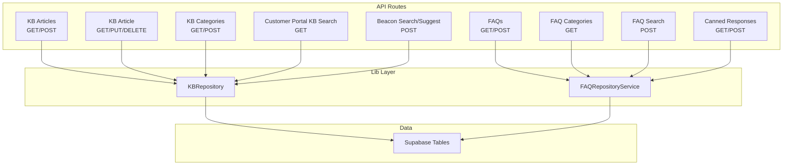
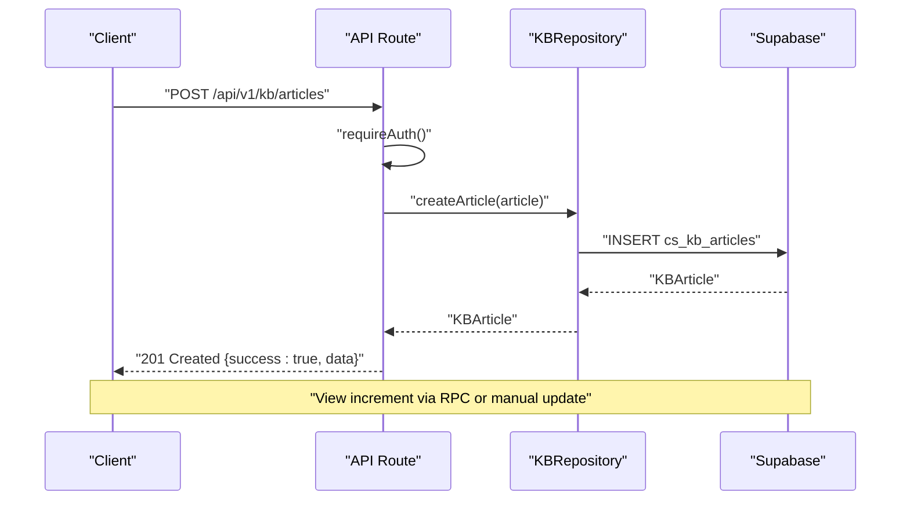
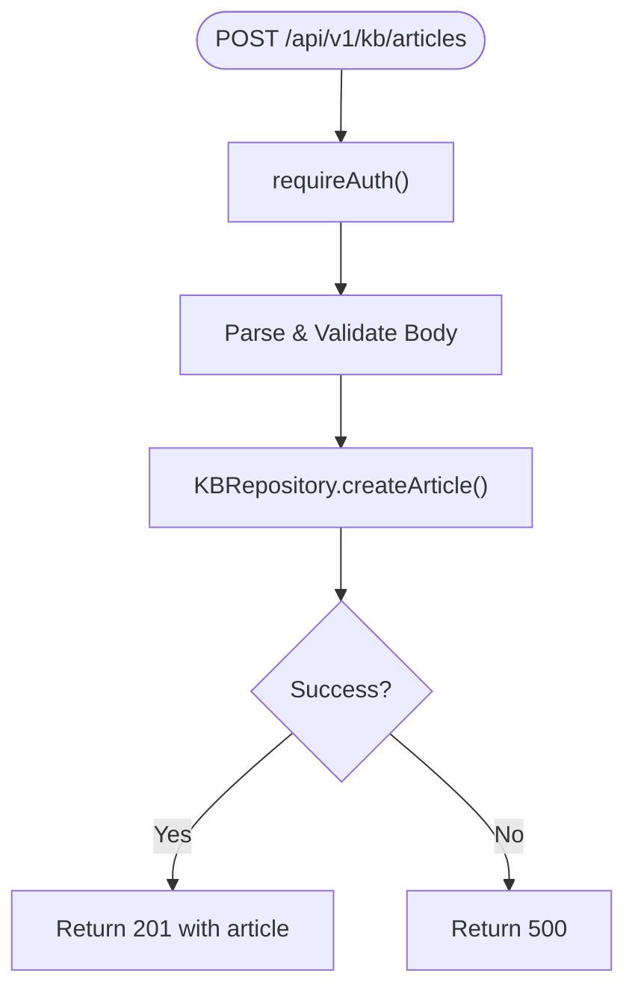
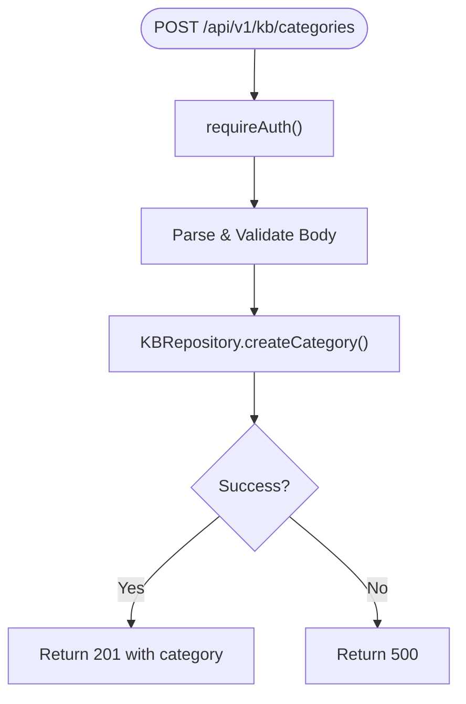
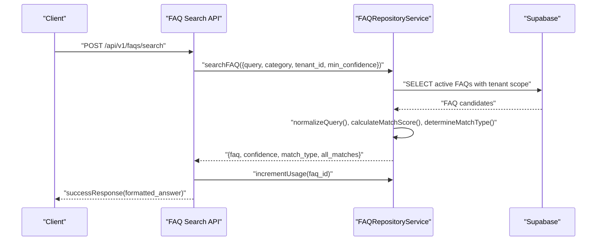
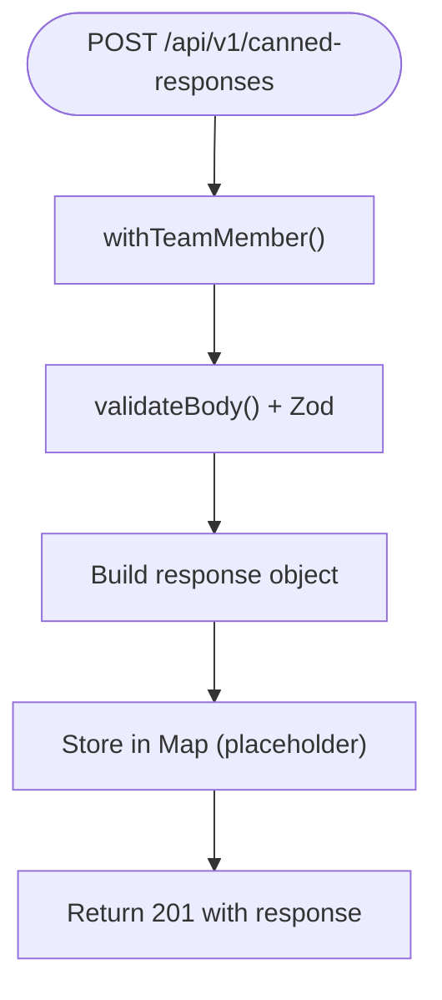
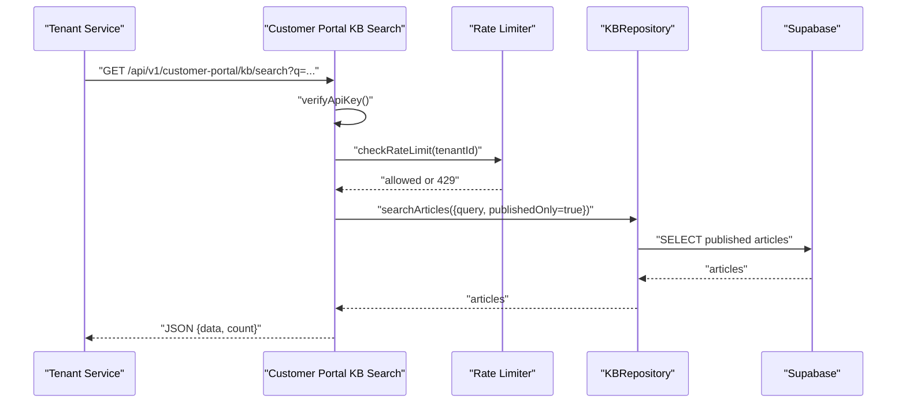
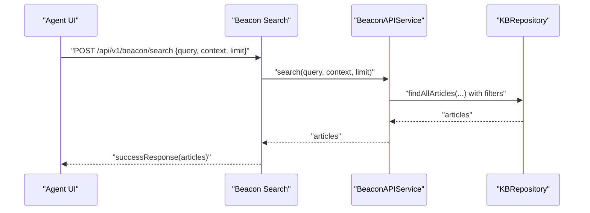
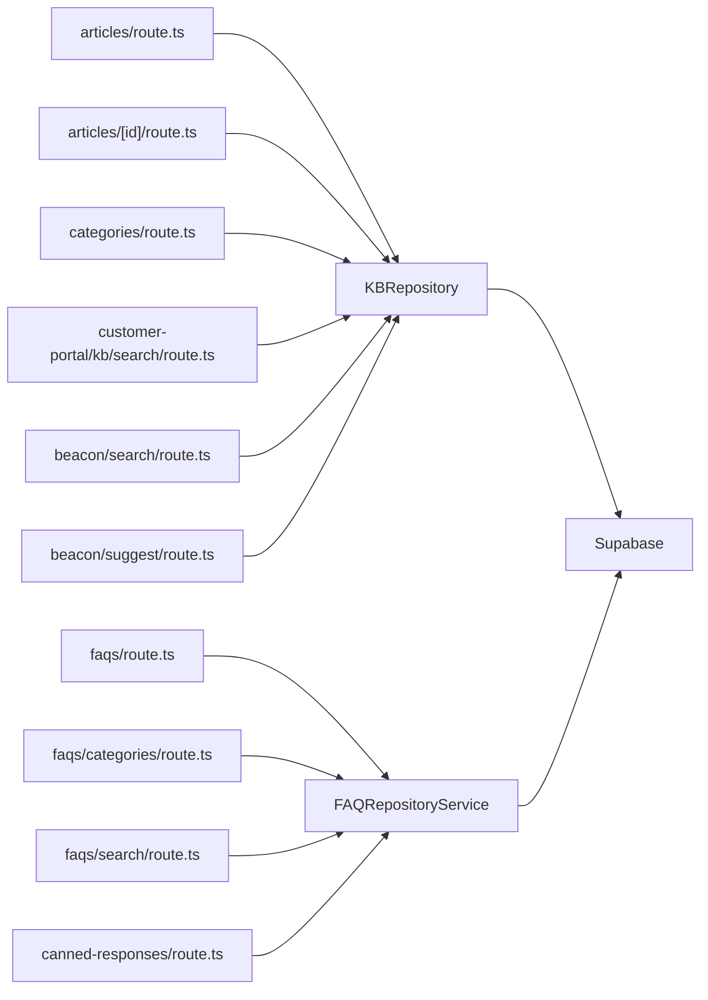

# Knowledge Base & Support API

<cite>
**Referenced Files in This Document**
- [app/api/v1/kb/articles/route.ts](file://app/api/v1/kb/articles/route.ts)
- [app/api/v1/kb/articles/[id]/route.ts](file://app/api/v1/kb/articles/[id]/route.ts)
- [app/api/v1/kb/categories/route.ts](file://app/api/v1/kb/categories/route.ts)
- [app/api/v1/faqs/route.ts](file://app/api/v1/faqs/route.ts)
- [app/api/v1/faqs/categories/route.ts](file://app/api/v1/faqs/categories/route.ts)
- [app/api/v1/faqs/search/route.ts](file://app/api/v1/faqs/search/route.ts)
- [app/api/v1/canned-responses/route.ts](file://app/api/v1/canned-responses/route.ts)
- [app/api/v1/customer-portal/kb/search/route.ts](file://app/api/v1/customer-portal/kb/search/route.ts)
- [app/api/v1/beacon/search/route.ts](file://app/api/v1/beacon/search/route.ts)
- [app/api/v1/beacon/suggest/route.ts](file://app/api/v1/beacon/suggest/route.ts)
- [lib/repositories/kb.ts](file://lib/repositories/kb.ts)
- [lib/services/faq-repository-service.ts](file://lib/services/faq-repository-service.ts)
- [database/migrations/025_faq_entries.sql](file://database/migrations/025_faq_entries.sql)
- [database/migrations/004_database_functions.sql](file://database/migrations/004_database_functions.sql)
</cite>

## Table of Contents
1. [Introduction](#introduction)
2. [Project Structure](#project-structure)
3. [Core Components](#core-components)
4. [Architecture Overview](#architecture-overview)
5. [Detailed Component Analysis](#detailed-component-analysis)
6. [Dependency Analysis](#dependency-analysis)
7. [Performance Considerations](#performance-considerations)
8. [Troubleshooting Guide](#troubleshooting-guide)
9. [Conclusion](#conclusion)
10. [Appendices](#appendices)

## Introduction
This document provides comprehensive API documentation for the Knowledge Base and Support content management system. It covers article lifecycle management, category administration, FAQ operations, search and suggestion capabilities, and canned response systems. It also outlines content versioning, approval workflows, multilingual readiness, content organization strategies, search optimization, automated categorization, and integration patterns with customer portals and self-service experiences.

## Project Structure
The Knowledge Base and Support APIs are organized under the Next.js app router at app/api/v1. The backend relies on Supabase for data persistence and exposes REST endpoints grouped by domain:
- Knowledge Base: articles and categories
- FAQ: CRUD, categories, and search
- Canned Responses: CRUD
- Customer Portal: public KB search
- Beacon: internal search and contextual suggestions
- Repositories and Services encapsulate data access and business logic

**Diagram sources**
- [app/api/v1/kb/articles/route.ts](file://app/api/v1/kb/articles/route.ts#L1-L93)
- [app/api/v1/kb/articles/[id]/route.ts](file://app/api/v1/kb/articles/[id]/route.ts#L1-L120)
- [app/api/v1/kb/categories/route.ts](file://app/api/v1/kb/categories/route.ts#L1-L73)
- [app/api/v1/faqs/route.ts](file://app/api/v1/faqs/route.ts#L1-L155)
- [app/api/v1/faqs/categories/route.ts](file://app/api/v1/faqs/categories/route.ts#L1-L24)
- [app/api/v1/faqs/search/route.ts](file://app/api/v1/faqs/search/route.ts#L1-L45)
- [app/api/v1/canned-responses/route.ts](file://app/api/v1/canned-responses/route.ts#L1-L80)
- [app/api/v1/customer-portal/kb/search/route.ts](file://app/api/v1/customer-portal/kb/search/route.ts#L1-L66)
- [app/api/v1/beacon/search/route.ts](file://app/api/v1/beacon/search/route.ts#L1-L28)
- [app/api/v1/beacon/suggest/route.ts](file://app/api/v1/beacon/suggest/route.ts#L1-L28)
- [lib/repositories/kb.ts](file://lib/repositories/kb.ts#L53-L284)
- [lib/services/faq-repository-service.ts](file://lib/services/faq-repository-service.ts#L50-L388)

**Section sources**
- [app/api/v1/kb/articles/route.ts](file://app/api/v1/kb/articles/route.ts#L1-L93)
- [app/api/v1/kb/categories/route.ts](file://app/api/v1/kb/categories/route.ts#L1-L73)
- [app/api/v1/faqs/route.ts](file://app/api/v1/faqs/route.ts#L1-L155)
- [app/api/v1/faqs/search/route.ts](file://app/api/v1/faqs/search/route.ts#L1-L45)
- [app/api/v1/canned-responses/route.ts](file://app/api/v1/canned-responses/route.ts#L1-L80)
- [app/api/v1/customer-portal/kb/search/route.ts](file://app/api/v1/customer-portal/kb/search/route.ts#L1-L66)
- [app/api/v1/beacon/search/route.ts](file://app/api/v1/beacon/search/route.ts#L1-L28)
- [app/api/v1/beacon/suggest/route.ts](file://app/api/v1/beacon/suggest/route.ts#L1-L28)
- [lib/repositories/kb.ts](file://lib/repositories/kb.ts#L53-L284)
- [lib/services/faq-repository-service.ts](file://lib/services/faq-repository-service.ts#L50-L388)

## Core Components
- Knowledge Base Articles API: list, create, retrieve, update, delete articles with status transitions and view counting.
- Knowledge Base Categories API: list and create categories with hierarchical support.
- FAQ Management API: list FAQs with tenant-aware filtering, create FAQs with keyword/intent matching, and search with confidence scoring.
- FAQ Categories API: list unique categories for tenant-aware filtering.
- FAQ Search API: semantic and keyword-driven search with usage increment and formatted response.
- Canned Responses API: list and create agent-facing responses (placeholder storage).
- Customer Portal KB Search API: public endpoint for tenant service to serve customer-facing KB search with rate limiting.
- Beacon Search/Suggest API: internal search and contextual article suggestions.

**Section sources**
- [app/api/v1/kb/articles/route.ts](file://app/api/v1/kb/articles/route.ts#L1-L93)
- [app/api/v1/kb/articles/[id]/route.ts](file://app/api/v1/kb/articles/[id]/route.ts#L1-L120)
- [app/api/v1/kb/categories/route.ts](file://app/api/v1/kb/categories/route.ts#L1-L73)
- [app/api/v1/faqs/route.ts](file://app/api/v1/faqs/route.ts#L1-L155)
- [app/api/v1/faqs/categories/route.ts](file://app/api/v1/faqs/categories/route.ts#L1-L24)
- [app/api/v1/faqs/search/route.ts](file://app/api/v1/faqs/search/route.ts#L1-L45)
- [app/api/v1/canned-responses/route.ts](file://app/api/v1/canned-responses/route.ts#L1-L80)
- [app/api/v1/customer-portal/kb/search/route.ts](file://app/api/v1/customer-portal/kb/search/route.ts#L1-L66)
- [app/api/v1/beacon/search/route.ts](file://app/api/v1/beacon/search/route.ts#L1-L28)
- [app/api/v1/beacon/suggest/route.ts](file://app/api/v1/beacon/suggest/route.ts#L1-L28)

## Architecture Overview
The system follows a layered architecture:
- API routes validate requests, enforce auth, parse bodies, and delegate to repositories/services.
- Repositories abstract Supabase access and encapsulate SQL logic.
- Services implement business logic such as FAQ scoring, normalization, and formatting.
- Database functions provide atomic operations for counters and metadata updates.

**Diagram sources**
- [app/api/v1/kb/articles/route.ts](file://app/api/v1/kb/articles/route.ts#L59-L92)
- [lib/repositories/kb.ts](file://lib/repositories/kb.ts#L140-L155)

**Section sources**
- [lib/repositories/kb.ts](file://lib/repositories/kb.ts#L53-L284)
- [lib/services/faq-repository-service.ts](file://lib/services/faq-repository-service.ts#L50-L388)
- [database/migrations/004_database_functions.sql](file://database/migrations/004_database_functions.sql#L1-L657)

## Detailed Component Analysis

### Knowledge Base Articles API
Endpoints:
- GET /api/v1/kb/articles: List articles with optional filters (status, category, search), pagination.
- POST /api/v1/kb/articles: Create article with validation and default status.
- GET /api/v1/kb/articles/[id]: Retrieve article; increments views for published items.
- PUT /api/v1/kb/articles/[id]: Update article with validation.
- DELETE /api/v1/kb/articles/[id]: Archive/delete article.

Processing logic:
- Authentication enforced via requireAuth.
- Validation via Zod schemas.
- Repository methods handle filtering, ordering, and RPC-based counters.

**Diagram sources**
- [app/api/v1/kb/articles/route.ts](file://app/api/v1/kb/articles/route.ts#L59-L92)
- [lib/repositories/kb.ts](file://lib/repositories/kb.ts#L140-L155)

**Section sources**
- [app/api/v1/kb/articles/route.ts](file://app/api/v1/kb/articles/route.ts#L1-L93)
- [app/api/v1/kb/articles/[id]/route.ts](file://app/api/v1/kb/articles/[id]/route.ts#L1-L120)
- [lib/repositories/kb.ts](file://lib/repositories/kb.ts#L57-L92)
- [lib/repositories/kb.ts](file://lib/repositories/kb.ts#L140-L177)
- [lib/repositories/kb.ts](file://lib/repositories/kb.ts#L189-L200)

### Knowledge Base Categories API
Endpoints:
- GET /api/v1/kb/categories: List categories ordered by index and name.
- POST /api/v1/kb/categories: Create category with optional parent and order index.

Processing logic:
- Validation via Zod schema.
- Repository handles insertion and retrieval with ordering.

**Diagram sources**
- [app/api/v1/kb/categories/route.ts](file://app/api/v1/kb/categories/route.ts#L42-L72)
- [lib/repositories/kb.ts](file://lib/repositories/kb.ts#L249-L267)

**Section sources**
- [app/api/v1/kb/categories/route.ts](file://app/api/v1/kb/categories/route.ts#L1-L73)
- [lib/repositories/kb.ts](file://lib/repositories/kb.ts#L216-L283)

### FAQ Management API
Endpoints:
- GET /api/v1/faqs: List FAQs with tenant-aware filtering, optional category, include inactive flag, pagination.
- POST /api/v1/faqs: Create FAQ with question/answer, optional metadata, tenant inference, defaults, and activation.
- GET /api/v1/faqs/categories: List unique categories for tenant.
- POST /api/v1/faqs/search: Search FAQs with confidence threshold, increment usage, and formatted answer.

Processing logic:
- Tenant scoping via or conditions for tenant-specific and default FAQs.
- Scoring and ranking based on exact/fuzzy/keyword/intent matching.
- Usage and helpful counters via RPC functions.

**Diagram sources**
- [app/api/v1/faqs/search/route.ts](file://app/api/v1/faqs/search/route.ts#L12-L44)
- [lib/services/faq-repository-service.ts](file://lib/services/faq-repository-service.ts#L55-L126)
- [lib/services/faq-repository-service.ts](file://lib/services/faq-repository-service.ts#L208-L223)

**Section sources**
- [app/api/v1/faqs/route.ts](file://app/api/v1/faqs/route.ts#L1-L155)
- [app/api/v1/faqs/categories/route.ts](file://app/api/v1/faqs/categories/route.ts#L1-L24)
- [app/api/v1/faqs/search/route.ts](file://app/api/v1/faqs/search/route.ts#L1-L45)
- [lib/services/faq-repository-service.ts](file://lib/services/faq-repository-service.ts#L50-L388)
- [database/migrations/025_faq_entries.sql](file://database/migrations/025_faq_entries.sql#L1-L75)

### Canned Responses API
Endpoints:
- GET /api/v1/canned-responses: List responses with optional category and text search.
- POST /api/v1/canned-responses: Create response with validation.

Processing logic:
- Current in-memory store (placeholder; migration to table pending).
- Filtering by category and substring search on title/content.

**Diagram sources**
- [app/api/v1/canned-responses/route.ts](file://app/api/v1/canned-responses/route.ts#L53-L79)

**Section sources**
- [app/api/v1/canned-responses/route.ts](file://app/api/v1/canned-responses/route.ts#L1-L80)

### Customer Portal KB Search API
Endpoint:
- GET /api/v1/customer-portal/kb/search: Public endpoint for tenant service to search KB with rate limiting.

Processing logic:
- API key verification for service-to-service auth.
- Rate limiting per tenant.
- Published-only search for customer-facing KB.

**Diagram sources**
- [app/api/v1/customer-portal/kb/search/route.ts](file://app/api/v1/customer-portal/kb/search/route.ts#L11-L65)
- [lib/repositories/kb.ts](file://lib/repositories/kb.ts#L104-L117)

**Section sources**
- [app/api/v1/customer-portal/kb/search/route.ts](file://app/api/v1/customer-portal/kb/search/route.ts#L1-L66)
- [lib/repositories/kb.ts](file://lib/repositories/kb.ts#L104-L117)

### Beacon Search and Suggestions API
Endpoints:
- POST /api/v1/beacon/search: Search KB articles with query and context.
- POST /api/v1/beacon/suggest: Get contextual article suggestions based on page URL.

Processing logic:
- Service-based search and suggestion with configurable limits.
- Contextual suggestions require page_url.

**Diagram sources**
- [app/api/v1/beacon/search/route.ts](file://app/api/v1/beacon/search/route.ts#L11-L27)
- [lib/repositories/kb.ts](file://lib/repositories/kb.ts#L57-L92)

**Section sources**
- [app/api/v1/beacon/search/route.ts](file://app/api/v1/beacon/search/route.ts#L1-L28)
- [app/api/v1/beacon/suggest/route.ts](file://app/api/v1/beacon/suggest/route.ts#L1-L28)
- [lib/repositories/kb.ts](file://lib/repositories/kb.ts#L57-L92)

## Dependency Analysis
- API routes depend on middleware for auth and on repositories/services for data access.
- KBRepository depends on Supabase client and database functions for counters.
- FAQRepositoryService depends on Supabase and implements scoring logic.
- Database functions provide atomic counter updates and metadata maintenance.

**Diagram sources**
- [app/api/v1/kb/articles/route.ts](file://app/api/v1/kb/articles/route.ts#L8-L11)
- [app/api/v1/kb/articles/[id]/route.ts](file://app/api/v1/kb/articles/[id]/route.ts#L9-L12)
- [app/api/v1/kb/categories/route.ts](file://app/api/v1/kb/categories/route.ts#L8-L11)
- [app/api/v1/faqs/route.ts](file://app/api/v1/faqs/route.ts#L8-L13)
- [app/api/v1/faqs/categories/route.ts](file://app/api/v1/faqs/categories/route.ts#L7-L9)
- [app/api/v1/faqs/search/route.ts](file://app/api/v1/faqs/search/route.ts#L8-L10)
- [app/api/v1/canned-responses/route.ts](file://app/api/v1/canned-responses/route.ts#L1-L5)
- [app/api/v1/customer-portal/kb/search/route.ts](file://app/api/v1/customer-portal/kb/search/route.ts#L1-L5)
- [app/api/v1/beacon/search/route.ts](file://app/api/v1/beacon/search/route.ts#L7-L10)
- [app/api/v1/beacon/suggest/route.ts](file://app/api/v1/beacon/suggest/route.ts#L7-L10)
- [lib/repositories/kb.ts](file://lib/repositories/kb.ts#L1-L2)
- [lib/services/faq-repository-service.ts](file://lib/services/faq-repository-service.ts#L10)

**Section sources**
- [lib/repositories/kb.ts](file://lib/repositories/kb.ts#L1-L2)
- [lib/services/faq-repository-service.ts](file://lib/services/faq-repository-service.ts#L10)

## Performance Considerations
- Pagination: Use limit and offset parameters to constrain result sets for list endpoints.
- Indexing: FAQ table includes indexes on tenant, category, active/default flags, priority, and a GIN full-text index on question and answer.
- RPC counters: View and usage increments leverage database functions for atomicity and reduced round trips.
- Rate limiting: Customer portal search enforces per-tenant limits to prevent abuse.
- Search scoring: FAQ search narrows candidates early with tenant and active filters, then ranks by computed scores.

**Section sources**
- [database/migrations/025_faq_entries.sql](file://database/migrations/025_faq_entries.sql#L42-L50)
- [lib/repositories/kb.ts](file://lib/repositories/kb.ts#L189-L200)
- [app/api/v1/customer-portal/kb/search/route.ts](file://app/api/v1/customer-portal/kb/search/route.ts#L32-L46)
- [lib/services/faq-repository-service.ts](file://lib/services/faq-repository-service.ts#L55-L126)

## Troubleshooting Guide
Common issues and resolutions:
- Unauthorized access: Ensure auth middleware passes and user context is present.
- Validation errors: Zod schemas enforce field constraints; review error details for missing or invalid fields.
- Not found errors: Retrieving non-existent articles or categories yields 404.
- Database errors: Supabase errors are caught and returned with 500 status; check query builder conditions and filters.
- Rate limit exceeded: Customer portal search returns 429 with retryAfter when limits are hit.

Operational checks:
- Confirm API key verification for customer portal endpoints.
- Verify tenant scoping logic for FAQs and KB articles.
- Ensure database functions exist for counters if RPC calls fail.

**Section sources**
- [app/api/v1/kb/articles/route.ts](file://app/api/v1/kb/articles/route.ts#L23-L56)
- [app/api/v1/kb/articles/[id]/route.ts](file://app/api/v1/kb/articles/[id]/route.ts#L34-L56)
- [app/api/v1/faqs/route.ts](file://app/api/v1/faqs/route.ts#L75-L154)
- [app/api/v1/faqs/search/route.ts](file://app/api/v1/faqs/search/route.ts#L12-L44)
- [app/api/v1/customer-portal/kb/search/route.ts](file://app/api/v1/customer-portal/kb/search/route.ts#L11-L65)

## Conclusion
The Knowledge Base and Support API provides a robust foundation for content management, intelligent search, and customer portal integration. With tenant-aware filtering, scoring-based FAQ matching, and rate-limited public endpoints, the system supports scalable self-service experiences while maintaining strong operational controls.

## Appendices

### API Definitions

- Knowledge Base Articles
  - GET /api/v1/kb/articles
    - Query params: status, category_id, search, limit, offset
    - Response: success, data[], count
  - POST /api/v1/kb/articles
    - Body: title, content, excerpt, category_id, tags, status, metadata
    - Response: success, data
  - GET /api/v1/kb/articles/[id]
    - Response: success, data
  - PUT /api/v1/kb/articles/[id]
    - Body: title, content, excerpt, category_id, tags, status, metadata
    - Response: success, data
  - DELETE /api/v1/kb/articles/[id]
    - Response: success, message

- Knowledge Base Categories
  - GET /api/v1/kb/categories
    - Response: success, data
  - POST /api/v1/kb/categories
    - Body: name, description, parent_category_id, order_index
    - Response: success, data

- FAQ Management
  - GET /api/v1/faqs
    - Query params: category, tenant_id, include_inactive, limit, offset
    - Response: faqs[], total, limit, offset
  - POST /api/v1/faqs
    - Body: question, answer, category, match_keywords, match_intents, tags, priority, tenant_id, is_default, related_article_id, related_link_url, related_link_text, metadata
    - Response: faq
  - GET /api/v1/faqs/categories
    - Query params: tenant_id
    - Response: categories[]
  - POST /api/v1/faqs/search
    - Body: query, category, tenant_id, min_confidence
    - Response: faq, confidence, match_type, all_matches, formatted_answer

- Canned Responses
  - GET /api/v1/canned-responses
    - Query params: category, search
    - Response: responses[]
  - POST /api/v1/canned-responses
    - Body: title, content, category, tags
    - Response: response

- Customer Portal KB Search
  - GET /api/v1/customer-portal/kb/search
    - Query params: tenant_id, q, category_id, limit
    - Response: data[], count
    - Headers: X-RateLimit-Limit, X-RateLimit-Remaining, Retry-After on 429

- Beacon Search/Suggest
  - POST /api/v1/beacon/search
    - Body: query, context, limit
    - Response: articles[]
  - POST /api/v1/beacon/suggest
    - Body: context(page_url), limit
    - Response: articles[]

**Section sources**
- [app/api/v1/kb/articles/route.ts](file://app/api/v1/kb/articles/route.ts#L23-L57)
- [app/api/v1/kb/articles/[id]/route.ts](file://app/api/v1/kb/articles/[id]/route.ts#L24-L119)
- [app/api/v1/kb/categories/route.ts](file://app/api/v1/kb/categories/route.ts#L20-L40)
- [app/api/v1/faqs/route.ts](file://app/api/v1/faqs/route.ts#L19-L69)
- [app/api/v1/faqs/route.ts](file://app/api/v1/faqs/route.ts#L75-L154)
- [app/api/v1/faqs/categories/route.ts](file://app/api/v1/faqs/categories/route.ts#L11-L23)
- [app/api/v1/faqs/search/route.ts](file://app/api/v1/faqs/search/route.ts#L12-L44)
- [app/api/v1/canned-responses/route.ts](file://app/api/v1/canned-responses/route.ts#L22-L79)
- [app/api/v1/customer-portal/kb/search/route.ts](file://app/api/v1/customer-portal/kb/search/route.ts#L11-L65)
- [app/api/v1/beacon/search/route.ts](file://app/api/v1/beacon/search/route.ts#L11-L27)
- [app/api/v1/beacon/suggest/route.ts](file://app/api/v1/beacon/suggest/route.ts#L11-L27)

### Data Model Highlights
- FAQ Entries table includes tenant scoping, priority, usage counts, helpful counters, match keywords/intents, and related links.
- Database functions support health scoring, churn risk calculation, SLA tracking, agent execution logging, and cost tracking.

**Section sources**
- [database/migrations/025_faq_entries.sql](file://database/migrations/025_faq_entries.sql#L6-L40)
- [database/migrations/004_database_functions.sql](file://database/migrations/004_database_functions.sql#L25-L174)
- [database/migrations/004_database_functions.sql](file://database/migrations/004_database_functions.sql#L196-L378)