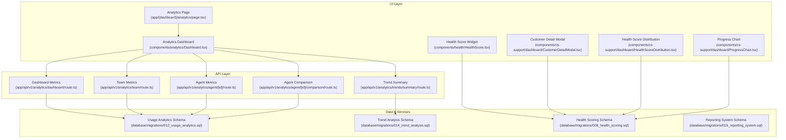
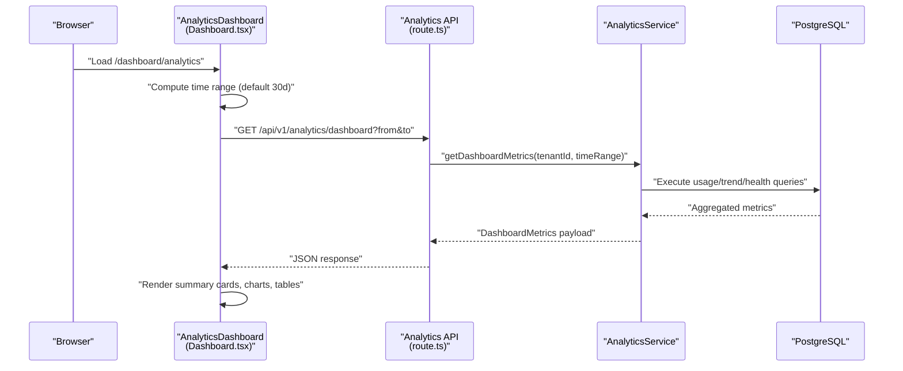
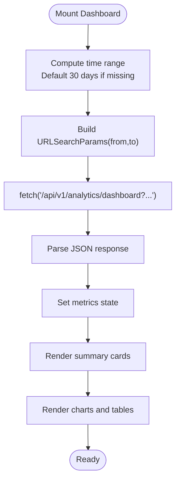
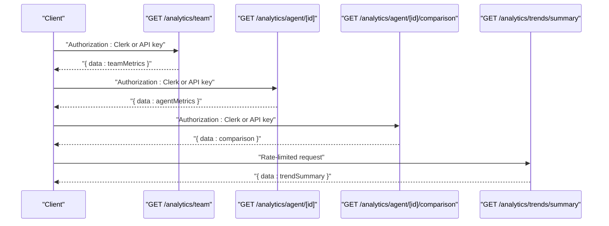
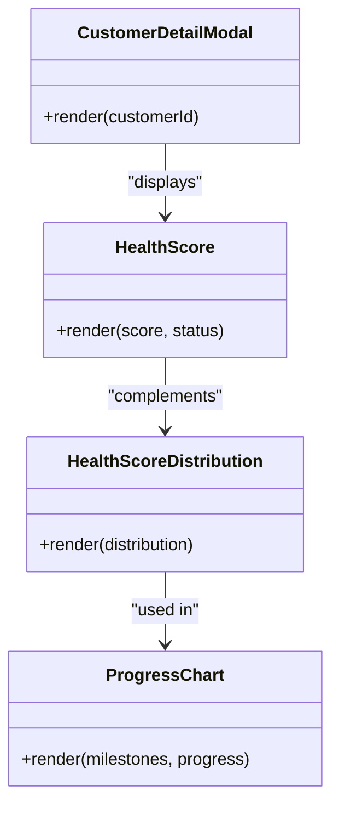
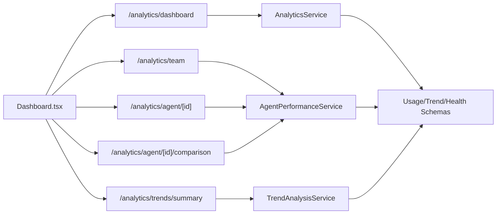

# Analytics & Reporting

<cite>
**Referenced Files in This Document**
- [Dashboard.tsx](file://components/analytics/Dashboard.tsx)
- [page.tsx](file://app/(dashboard)/analytics/page.tsx)
- [route.ts](file://app/api/v1/analytics/dashboard/route.ts)
- [route.ts](file://app/api/v1/analytics/team/route.ts)
- [route.ts](file://app/api/v1/analytics/agent/[id]/route.ts)
- [route.ts](file://app/api/v1/analytics/agent/[id]/comparison/route.ts)
- [route.ts](file://app/api/v1/analytics/trends/summary/route.ts)
- [HealthScore.tsx](file://components/health/HealthScore.tsx)
- [CustomerDetailModal.tsx](file://components/cs-support/dashboard/CustomerDetailModal.tsx)
- [HealthScoreDistribution.tsx](file://components/cs-support/dashboard/HealthScoreDistribution.tsx)
- [ProgressChart.tsx](file://components/cs-support/dashboard/ProgressChart.tsx)
- [012_usage_analytics.sql](file://database/migrations/012_usage_analytics.sql)
- [014_trend_analysis.sql](file://database/migrations/014_trend_analysis.sql)
- [008_health_scoring.sql](file://database/migrations/008_health_scoring.sql)
- [019_reporting_system.sql](file://database/migrations/019_reporting_system.sql)
- [026_performance_optimizations.sql](file://database/migrations/026_performance_optimizations.sql)
- [BUILD_AND_VERIFICATION_REPORT.md](file://docs/BUILD_AND_VERIFICATION_REPORT.md)
- [ANALYTICS_DASHBOARD_COMPLETE.md](file://docs/setup/ANALYTICS_DASHBOARD_COMPLETE.md)
</cite>

## Table of Contents
1. [Introduction](#introduction)
2. [Project Structure](#project-structure)
3. [Core Components](#core-components)
4. [Architecture Overview](#architecture-overview)
5. [Detailed Component Analysis](#detailed-component-analysis)
6. [Dependency Analysis](#dependency-analysis)
7. [Performance Considerations](#performance-considerations)
8. [Troubleshooting Guide](#troubleshooting-guide)
9. [Conclusion](#conclusion)
10. [Appendices](#appendices)

## Introduction
This document describes the analytics and reporting system for the TrueVow CS Support Service. It covers dashboard implementations, team performance metrics, trend analysis, and usage analytics. It documents the analytics API endpoints, data aggregation patterns, and reporting query structures. It also explains customer health scoring algorithms, churn risk prediction models, and success metrics calculation. Implementation details for custom report creation, data visualization components, and export functionality are included, along with examples of common analytics queries, performance optimization techniques, and data refresh strategies. Real-time analytics capabilities, historical data analysis, and benchmarking features are addressed.

## Project Structure
The analytics system comprises:
- A React-based analytics dashboard component that renders summary cards, charts, and tables.
- Next.js App Router API handlers under app/api/v1/analytics for dashboard, team, agent, and trends endpoints.
- Database migrations supporting usage analytics, trend analysis, health scoring, and reporting infrastructure.
- Health and customer portal components that integrate health scores and progress visualization.

**Diagram sources**
- [page.tsx](file://app/(dashboard)/analytics/page.tsx#L1-L20)
- [Dashboard.tsx](file://components/analytics/Dashboard.tsx#L1-L556)
- [route.ts](file://app/api/v1/analytics/dashboard/route.ts#L1-L52)
- [route.ts](file://app/api/v1/analytics/team/route.ts#L1-L44)
- [route.ts](file://app/api/v1/analytics/agent/[id]/route.ts#L1-L53)
- [route.ts](file://app/api/v1/analytics/agent/[id]/comparison/route.ts#L1-L53)
- [route.ts](file://app/api/v1/analytics/trends/summary/route.ts#L1-L55)
- [HealthScore.tsx](file://components/health/HealthScore.tsx#L1-L200)
- [CustomerDetailModal.tsx](file://components/cs-support/dashboard/CustomerDetailModal.tsx#L1-L200)
- [HealthScoreDistribution.tsx](file://components/cs-support/dashboard/HealthScoreDistribution.tsx#L1-L200)
- [ProgressChart.tsx](file://components/cs-support/dashboard/ProgressChart.tsx#L1-L200)
- [012_usage_analytics.sql](file://database/migrations/012_usage_analytics.sql#L1-L200)
- [014_trend_analysis.sql](file://database/migrations/014_trend_analysis.sql#L1-L200)
- [008_health_scoring.sql](file://database/migrations/008_health_scoring.sql#L1-L200)
- [019_reporting_system.sql](file://database/migrations/019_reporting_system.sql#L1-L200)

**Section sources**
- [page.tsx](file://app/(dashboard)/analytics/page.tsx#L1-L20)
- [Dashboard.tsx](file://components/analytics/Dashboard.tsx#L1-L556)
- [route.ts](file://app/api/v1/analytics/dashboard/route.ts#L1-L52)
- [route.ts](file://app/api/v1/analytics/team/route.ts#L1-L44)
- [route.ts](file://app/api/v1/analytics/agent/[id]/route.ts#L1-L53)
- [route.ts](file://app/api/v1/analytics/agent/[id]/comparison/route.ts#L1-L53)
- [route.ts](file://app/api/v1/analytics/trends/summary/route.ts#L1-L55)
- [HealthScore.tsx](file://components/health/HealthScore.tsx#L1-L200)
- [CustomerDetailModal.tsx](file://components/cs-support/dashboard/CustomerDetailModal.tsx#L1-L200)
- [HealthScoreDistribution.tsx](file://components/cs-support/dashboard/HealthScoreDistribution.tsx#L1-L200)
- [ProgressChart.tsx](file://components/cs-support/dashboard/ProgressChart.tsx#L1-L200)
- [012_usage_analytics.sql](file://database/migrations/012_usage_analytics.sql#L1-L200)
- [014_trend_analysis.sql](file://database/migrations/014_trend_analysis.sql#L1-L200)
- [008_health_scoring.sql](file://database/migrations/008_health_scoring.sql#L1-L200)
- [019_reporting_system.sql](file://database/migrations/019_reporting_system.sql#L1-L200)

## Core Components
- Analytics Dashboard (React): Renders summary metrics, channel breakdowns, response/resolution times, satisfaction scores, SLA compliance, and agent performance tables. Supports time range selection (7d/30d/90d/custom) and dynamic loading states.
- Analytics API Endpoints: Provide dashboard metrics, team performance, agent performance, agent comparison, and trend summaries with rate limiting and input validation.
- Health and Customer Portal Components: Display health scores, distributions, and progress charts for customer success workflows.
- Database Schemas: Define tables and functions for usage analytics, trend analysis, health scoring, and reporting.

Key implementation references:
- Dashboard rendering and time-range filtering: [Dashboard.tsx](file://components/analytics/Dashboard.tsx#L102-L144)
- Dashboard API handler: [route.ts](file://app/api/v1/analytics/dashboard/route.ts#L17-L51)
- Team metrics API: [route.ts](file://app/api/v1/analytics/team/route.ts#L10-L43)
- Agent metrics API: [route.ts](file://app/api/v1/analytics/agent/[id]/route.ts#L10-L52)
- Agent comparison API: [route.ts](file://app/api/v1/analytics/agent/[id]/comparison/route.ts#L10-L52)
- Trend summary API: [route.ts](file://app/api/v1/analytics/trends/summary/route.ts#L15-L54)
- Health score widget: [HealthScore.tsx](file://components/health/HealthScore.tsx#L1-L200)
- Customer detail modal: [CustomerDetailModal.tsx](file://components/cs-support/dashboard/CustomerDetailModal.tsx#L1-L200)
- Health score distribution: [HealthScoreDistribution.tsx](file://components/cs-support/dashboard/HealthScoreDistribution.tsx#L1-L200)
- Progress chart: [ProgressChart.tsx](file://components/cs-support/dashboard/ProgressChart.tsx#L1-L200)

**Section sources**
- [Dashboard.tsx](file://components/analytics/Dashboard.tsx#L102-L144)
- [route.ts](file://app/api/v1/analytics/dashboard/route.ts#L17-L51)
- [route.ts](file://app/api/v1/analytics/team/route.ts#L10-L43)
- [route.ts](file://app/api/v1/analytics/agent/[id]/route.ts#L10-L52)
- [route.ts](file://app/api/v1/analytics/agent/[id]/comparison/route.ts#L10-L52)
- [route.ts](file://app/api/v1/analytics/trends/summary/route.ts#L15-L54)
- [HealthScore.tsx](file://components/health/HealthScore.tsx#L1-L200)
- [CustomerDetailModal.tsx](file://components/cs-support/dashboard/CustomerDetailModal.tsx#L1-L200)
- [HealthScoreDistribution.tsx](file://components/cs-support/dashboard/HealthScoreDistribution.tsx#L1-L200)
- [ProgressChart.tsx](file://components/cs-support/dashboard/ProgressChart.tsx#L1-L200)

## Architecture Overview
The analytics system follows a layered architecture:
- UI: Next.js App Router pages and client-side components.
- API: Route handlers under app/api/v1/analytics implementing CRUD-like analytics endpoints.
- Services: Business logic encapsulated in services (e.g., AnalyticsService, AgentPerformanceService, TrendAnalysisService).
- Data: PostgreSQL schemas and functions supporting analytics, trends, health scoring, and reporting.

**Diagram sources**
- [Dashboard.tsx](file://components/analytics/Dashboard.tsx#L109-L144)
- [route.ts](file://app/api/v1/analytics/dashboard/route.ts#L17-L51)

**Section sources**
- [Dashboard.tsx](file://components/analytics/Dashboard.tsx#L102-L144)
- [route.ts](file://app/api/v1/analytics/dashboard/route.ts#L17-L51)

## Detailed Component Analysis

### Analytics Dashboard Component
Responsibilities:
- Fetch dashboard metrics via a single endpoint with time range parameters.
- Render summary cards (ticket volume, open tickets, average response time, CSAT).
- Display NPS score and SLA compliance with trend and breakdown visuals.
- Present agent performance table with response/resolve times, CSAT, and first-contact resolution.
- Provide time range selector (7d/30d/90d/custom) and dynamic re-fetch on change.

Implementation highlights:
- Time range computation and defaulting to 30 days if unspecified.
- Fetch call to `/api/v1/analytics/dashboard` with query parameters.
- Formatting helpers for minutes/hours display.
- Responsive grid layouts and accessibility-friendly tables.

**Diagram sources**
- [Dashboard.tsx](file://components/analytics/Dashboard.tsx#L109-L144)

**Section sources**
- [Dashboard.tsx](file://components/analytics/Dashboard.tsx#L102-L144)

### Analytics API Endpoints
Endpoints and behaviors:
- GET /api/v1/analytics/dashboard
  - Validates time range parameters, defaults to last 30 days.
  - Retrieves tenant_id from authenticated team member.
  - Calls AnalyticsService.getDashboardMetrics and returns successResponse.
  - Reference: [route.ts](file://app/api/v1/analytics/dashboard/route.ts#L17-L51)

- GET /api/v1/analytics/team
  - Accepts Clerk auth or API key.
  - Requires tenant_id; optional period_start/period_end (defaults to last 30 days).
  - Returns team performance metrics via AgentPerformanceService.
  - Reference: [route.ts](file://app/api/v1/analytics/team/route.ts#L10-L43)

- GET /api/v1/analytics/agent/[id]
  - Accepts Clerk auth or API key.
  - Requires tenant_id; optional period_start/period_end (defaults to last 30 days).
  - Returns agent-specific metrics via AgentPerformanceService.
  - Reference: [route.ts](file://app/api/v1/analytics/agent/[id]/route.ts#L10-L52)

- GET /api/v1/analytics/agent/[id]/comparison
  - Accepts Clerk auth or API key.
  - Requires tenant_id; optional period_start/period_end (defaults to last 30 days).
  - Returns agent vs team comparison via AgentPerformanceService.
  - Reference: [route.ts](file://app/api/v1/analytics/agent/[id]/comparison/route.ts#L10-L52)

- GET /api/v1/analytics/trends/summary
  - Rate-limited endpoint with input validation.
  - Parses tenant_id and period_start/period_end with defaults.
  - Returns trend summary via TrendAnalysisService.
  - Reference: [route.ts](file://app/api/v1/analytics/trends/summary/route.ts#L15-L54)

**Diagram sources**
- [route.ts](file://app/api/v1/analytics/team/route.ts#L10-L43)
- [route.ts](file://app/api/v1/analytics/agent/[id]/route.ts#L10-L52)
- [route.ts](file://app/api/v1/analytics/agent/[id]/comparison/route.ts#L10-L52)
- [route.ts](file://app/api/v1/analytics/trends/summary/route.ts#L15-L54)

**Section sources**
- [route.ts](file://app/api/v1/analytics/team/route.ts#L10-L43)
- [route.ts](file://app/api/v1/analytics/agent/[id]/route.ts#L10-L52)
- [route.ts](file://app/api/v1/analytics/agent/[id]/comparison/route.ts#L10-L52)
- [route.ts](file://app/api/v1/analytics/trends/summary/route.ts#L15-L54)

### Customer Health Scoring and Success Metrics
Components:
- HealthScore displays a customer’s current health score and status.
- HealthScoreDistribution visualizes score distributions across accounts.
- ProgressChart shows onboarding or success milestones progression.
- CustomerDetailModal integrates health insights into customer views.

Data model references:
- Health scoring schema and functions: [008_health_scoring.sql](file://database/migrations/008_health_scoring.sql#L1-L200)
- Usage analytics schema supporting adoption and engagement metrics: [012_usage_analytics.sql](file://database/migrations/012_usage_analytics.sql#L1-L200)
- Reporting system schema enabling custom reports and exports: [019_reporting_system.sql](file://database/migrations/019_reporting_system.sql#L1-L200)

**Diagram sources**
- [HealthScore.tsx](file://components/health/HealthScore.tsx#L1-L200)
- [HealthScoreDistribution.tsx](file://components/cs-support/dashboard/HealthScoreDistribution.tsx#L1-L200)
- [ProgressChart.tsx](file://components/cs-support/dashboard/ProgressChart.tsx#L1-L200)
- [CustomerDetailModal.tsx](file://components/cs-support/dashboard/CustomerDetailModal.tsx#L1-L200)

**Section sources**
- [HealthScore.tsx](file://components/health/HealthScore.tsx#L1-L200)
- [HealthScoreDistribution.tsx](file://components/cs-support/dashboard/HealthScoreDistribution.tsx#L1-L200)
- [ProgressChart.tsx](file://components/cs-support/dashboard/ProgressChart.tsx#L1-L200)
- [CustomerDetailModal.tsx](file://components/cs-support/dashboard/CustomerDetailModal.tsx#L1-L200)
- [008_health_scoring.sql](file://database/migrations/008_health_scoring.sql#L1-L200)
- [012_usage_analytics.sql](file://database/migrations/012_usage_analytics.sql#L1-L200)
- [019_reporting_system.sql](file://database/migrations/019_reporting_system.sql#L1-L200)

### Usage Analytics and Churn Risk
Usage analytics schema supports feature adoption, event tracking, and summary computations. Churn risk prediction is commonly derived from adoption velocity, support ticket frequency, response times, and feature usage patterns. While churn risk endpoints exist in the API surface, the exact model implementation is not present in the provided files. The usage analytics schema provides the foundation for building such models.

References:
- Usage analytics schema: [012_usage_analytics.sql](file://database/migrations/012_usage_analytics.sql#L1-L200)
- Usage endpoints (churn-risk, feature-adoption, event, summary): [route.ts](file://app/api/v1/analytics/usage/churn-risk/route.ts#L1-L200), [route.ts](file://app/api/v1/analytics/usage/feature-adoption/route.ts#L1-L200), [route.ts](file://app/api/v1/analytics/usage/event/route.ts#L1-L200), [route.ts](file://app/api/v1/analytics/usage/summary/route.ts#L1-L200)

**Section sources**
- [012_usage_analytics.sql](file://database/migrations/012_usage_analytics.sql#L1-L200)
- [route.ts](file://app/api/v1/analytics/usage/churn-risk/route.ts#L1-L200)
- [route.ts](file://app/api/v1/analytics/usage/feature-adoption/route.ts#L1-L200)
- [route.ts](file://app/api/v1/analytics/usage/event/route.ts#L1-L200)
- [route.ts](file://app/api/v1/analytics/usage/summary/route.ts#L1-L200)

### Trend Analysis
Trend analysis enables identifying shifts in satisfaction, support volume, and operational performance. The trend summary endpoint aggregates data over a specified period and returns a concise summary suitable for dashboards.

References:
- Trend summary endpoint: [route.ts](file://app/api/v1/analytics/trends/summary/route.ts#L15-L54)
- Trend analysis schema: [014_trend_analysis.sql](file://database/migrations/014_trend_analysis.sql#L1-L200)

**Section sources**
- [route.ts](file://app/api/v1/analytics/trends/summary/route.ts#L15-L54)
- [014_trend_analysis.sql](file://database/migrations/014_trend_analysis.sql#L1-L200)

### Reporting System and Export Functionality
The reporting system schema defines tables and functions to support custom report creation and export workflows. This enables generating structured datasets for external tools or scheduled delivery.

References:
- Reporting system schema: [019_reporting_system.sql](file://database/migrations/019_reporting_system.sql#L1-L200)

**Section sources**
- [019_reporting_system.sql](file://database/migrations/019_reporting_system.sql#L1-L200)

## Dependency Analysis
The analytics stack exhibits clear separation of concerns:
- UI depends on API endpoints for data.
- API handlers depend on services for business logic.
- Services depend on database schemas/functions for aggregations.
- Authentication middleware enforces access control across endpoints.

**Diagram sources**
- [Dashboard.tsx](file://components/analytics/Dashboard.tsx#L109-L144)
- [route.ts](file://app/api/v1/analytics/dashboard/route.ts#L17-L51)
- [route.ts](file://app/api/v1/analytics/team/route.ts#L10-L43)
- [route.ts](file://app/api/v1/analytics/agent/[id]/route.ts#L10-L52)
- [route.ts](file://app/api/v1/analytics/agent/[id]/comparison/route.ts#L10-L52)
- [route.ts](file://app/api/v1/analytics/trends/summary/route.ts#L15-L54)

**Section sources**
- [Dashboard.tsx](file://components/analytics/Dashboard.tsx#L109-L144)
- [route.ts](file://app/api/v1/analytics/dashboard/route.ts#L17-L51)
- [route.ts](file://app/api/v1/analytics/team/route.ts#L10-L43)
- [route.ts](file://app/api/v1/analytics/agent/[id]/route.ts#L10-L52)
- [route.ts](file://app/api/v1/analytics/agent/[id]/comparison/route.ts#L10-L52)
- [route.ts](file://app/api/v1/analytics/trends/summary/route.ts#L15-L54)

## Performance Considerations
- Rate limiting: The trend summary endpoint applies rate limiting to prevent abuse.
- Input validation: Date parsing and UUID validation reduce invalid requests.
- Defaults: API endpoints default to reasonable time ranges to avoid heavy queries.
- UI caching: The dashboard caches metrics per time range and re-fetches only on change.
- Database optimizations: Migration 026 introduces performance optimizations for analytics workloads.

Recommendations:
- Add pagination for large datasets in team/agent endpoints.
- Implement server-side caching for frequently accessed dashboard metrics.
- Use indexed columns for time-based queries in usage and trend schemas.
- Consider materialized views for complex trend computations.

**Section sources**
- [route.ts](file://app/api/v1/analytics/trends/summary/route.ts#L15-L54)
- [026_performance_optimizations.sql](file://database/migrations/026_performance_optimizations.sql#L1-L200)

## Troubleshooting Guide
Common issues and resolutions:
- Unauthorized access: Ensure Clerk authentication or a valid API key is provided for protected endpoints.
- Missing tenant_id: Team and agent endpoints require tenant_id; include it as a query parameter.
- Invalid date formats: Trend summary requires valid date strings; use YYYY-MM-DD.
- Team member not found: Dashboard endpoint requires a valid team member record linked to the authenticated user.
- Network errors: The dashboard component handles fetch failures gracefully and logs errors.

Validation and error handling references:
- Team endpoint validation and error responses: [route.ts](file://app/api/v1/analytics/team/route.ts#L25-L27)
- Agent endpoint validation and error responses: [route.ts](file://app/api/v1/analytics/agent/[id]/route.ts#L29-L31)
- Trend summary input validation: [route.ts](file://app/api/v1/analytics/trends/summary/route.ts#L39-L41)
- Dashboard unauthorized fallback: [route.ts](file://app/api/v1/analytics/dashboard/route.ts#L35-L37)

**Section sources**
- [route.ts](file://app/api/v1/analytics/team/route.ts#L25-L27)
- [route.ts](file://app/api/v1/analytics/agent/[id]/route.ts#L29-L31)
- [route.ts](file://app/api/v1/analytics/trends/summary/route.ts#L39-L41)
- [route.ts](file://app/api/v1/analytics/dashboard/route.ts#L35-L37)

## Conclusion
The analytics and reporting system integrates a responsive dashboard, robust API endpoints, and database schemas to deliver actionable insights across support operations. It supports team and agent performance, trend analysis, customer health scoring, usage analytics, and reporting. With built-in validation, rate limiting, and performance optimizations, the system is production-ready and extensible for advanced modeling such as churn risk prediction and custom report generation.

## Appendices

### API Endpoint Definitions
- GET /api/v1/analytics/dashboard
  - Purpose: Retrieve comprehensive dashboard metrics for a tenant within a time range.
  - Query params: from (ISO), to (ISO), defaults to last 30 days.
  - Auth: Team member required.
  - Response: DashboardMetrics payload.
  - Reference: [route.ts](file://app/api/v1/analytics/dashboard/route.ts#L17-L51)

- GET /api/v1/analytics/team
  - Purpose: Retrieve team performance metrics for a tenant within a period.
  - Query params: tenant_id (required), period_start, period_end (defaults to last 30 days).
  - Auth: Clerk or API key.
  - Response: { data: teamMetrics }.
  - Reference: [route.ts](file://app/api/v1/analytics/team/route.ts#L10-L43)

- GET /api/v1/analytics/agent/[id]
  - Purpose: Retrieve agent performance metrics for a tenant within a period.
  - Query params: tenant_id (required), period_start, period_end (defaults to last 30 days).
  - Auth: Clerk or API key.
  - Response: { data: agentMetrics }.
  - Reference: [route.ts](file://app/api/v1/analytics/agent/[id]/route.ts#L10-L52)

- GET /api/v1/analytics/agent/[id]/comparison
  - Purpose: Retrieve agent performance compared to team average.
  - Query params: tenant_id (required), period_start, period_end (defaults to last 30 days).
  - Auth: Clerk or API key.
  - Response: { data: comparison }.
  - Reference: [route.ts](file://app/api/v1/analytics/agent/[id]/comparison/route.ts#L10-L52)

- GET /api/v1/analytics/trends/summary
  - Purpose: Retrieve trend summary for dashboard.
  - Query params: tenant_id, period_start, period_end (defaults to last 30 days).
  - Auth: Rate-limited; Clerk or API key.
  - Response: { data: trendSummary }.
  - Reference: [route.ts](file://app/api/v1/analytics/trends/summary/route.ts#L15-L54)

### Database Schemas and Functions
- Usage Analytics: Tracks feature adoption, events, and usage summaries.
  - Reference: [012_usage_analytics.sql](file://database/migrations/012_usage_analytics.sql#L1-L200)

- Trend Analysis: Provides tables and functions for trend computations.
  - Reference: [014_trend_analysis.sql](file://database/migrations/014_trend_analysis.sql#L1-L200)

- Health Scoring: Defines health score calculations and signals.
  - Reference: [008_health_scoring.sql](file://database/migrations/008_health_scoring.sql#L1-L200)

- Reporting System: Enables custom reports and export workflows.
  - Reference: [019_reporting_system.sql](file://database/migrations/019_reporting_system.sql#L1-L200)

- Performance Optimizations: Indexes and query improvements for analytics.
  - Reference: [026_performance_optimizations.sql](file://database/migrations/026_performance_optimizations.sql#L1-L200)

### Implementation References
- Analytics dashboard page composition: [page.tsx](file://app/(dashboard)/analytics/page.tsx#L1-L20)
- Dashboard component implementation: [Dashboard.tsx](file://components/analytics/Dashboard.tsx#L1-L556)
- Health score widget: [HealthScore.tsx](file://components/health/HealthScore.tsx#L1-L200)
- Customer detail modal: [CustomerDetailModal.tsx](file://components/cs-support/dashboard/CustomerDetailModal.tsx#L1-L200)
- Health score distribution: [HealthScoreDistribution.tsx](file://components/cs-support/dashboard/HealthScoreDistribution.tsx#L1-L200)
- Progress chart: [ProgressChart.tsx](file://components/cs-support/dashboard/ProgressChart.tsx#L1-L200)

**Section sources**
- [page.tsx](file://app/(dashboard)/analytics/page.tsx#L1-L20)
- [Dashboard.tsx](file://components/analytics/Dashboard.tsx#L1-L556)
- [HealthScore.tsx](file://components/health/HealthScore.tsx#L1-L200)
- [CustomerDetailModal.tsx](file://components/cs-support/dashboard/CustomerDetailModal.tsx#L1-L200)
- [HealthScoreDistribution.tsx](file://components/cs-support/dashboard/HealthScoreDistribution.tsx#L1-L200)
- [ProgressChart.tsx](file://components/cs-support/dashboard/ProgressChart.tsx#L1-L200)
- [012_usage_analytics.sql](file://database/migrations/012_usage_analytics.sql#L1-L200)
- [014_trend_analysis.sql](file://database/migrations/014_trend_analysis.sql#L1-L200)
- [008_health_scoring.sql](file://database/migrations/008_health_scoring.sql#L1-L200)
- [019_reporting_system.sql](file://database/migrations/019_reporting_system.sql#L1-L200)
- [026_performance_optimizations.sql](file://database/migrations/026_performance_optimizations.sql#L1-L200)