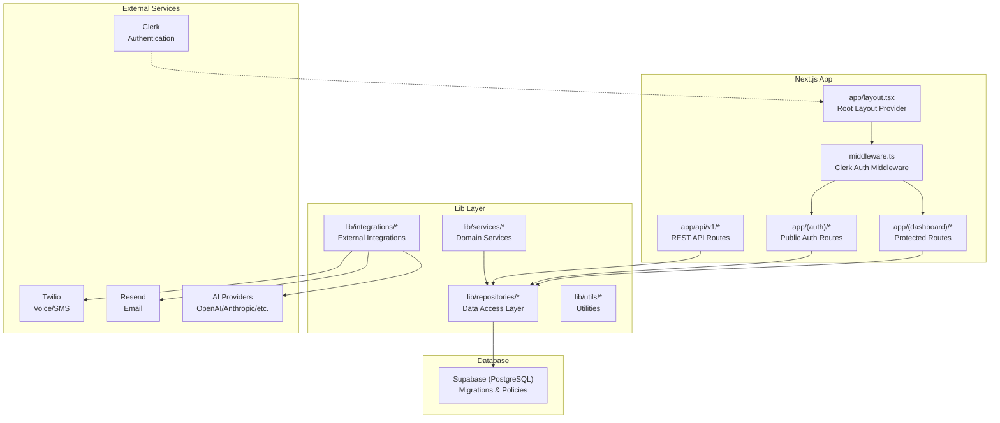
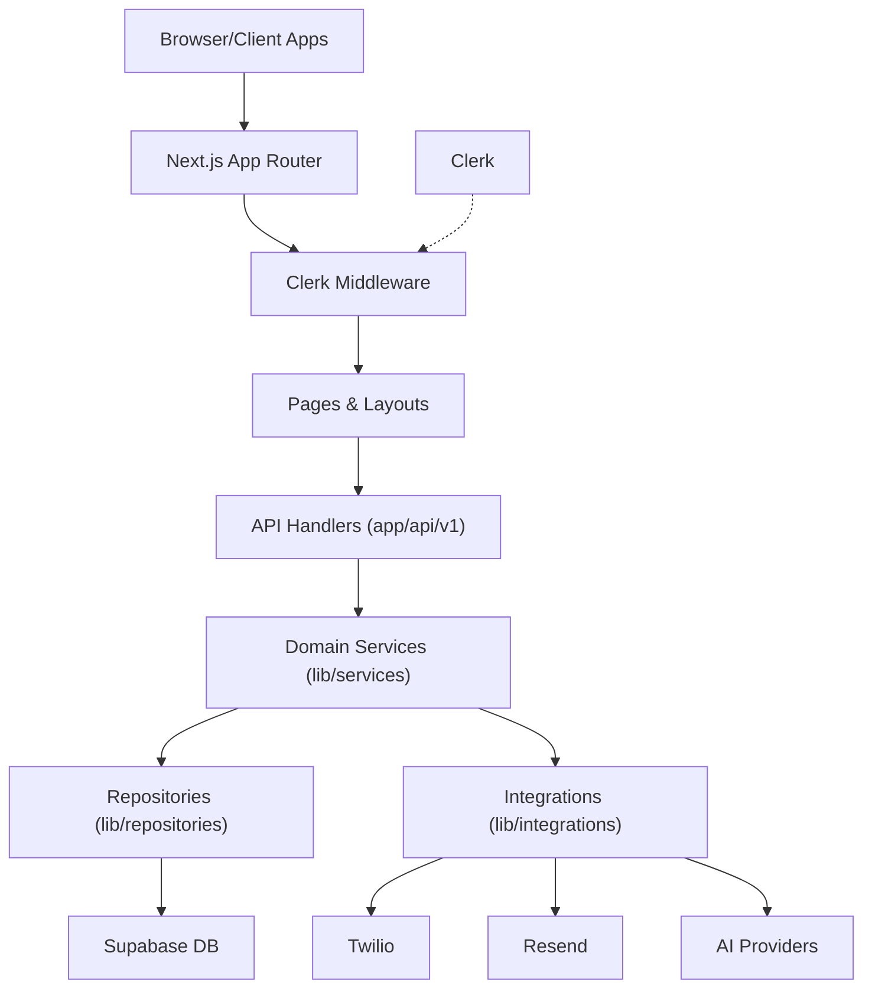
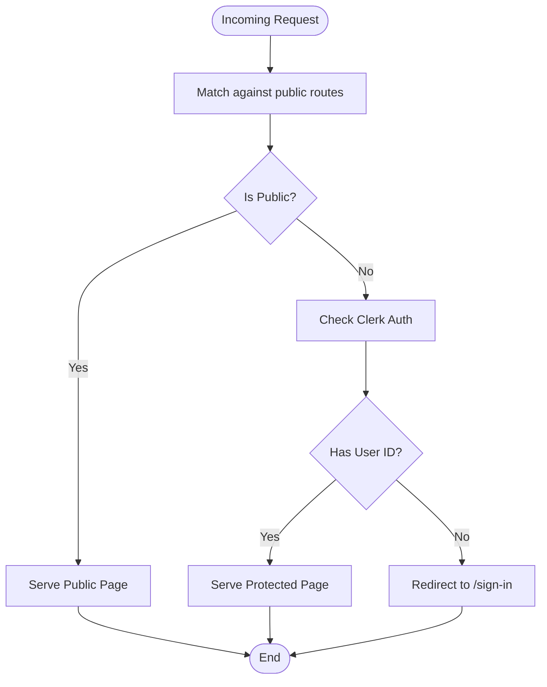
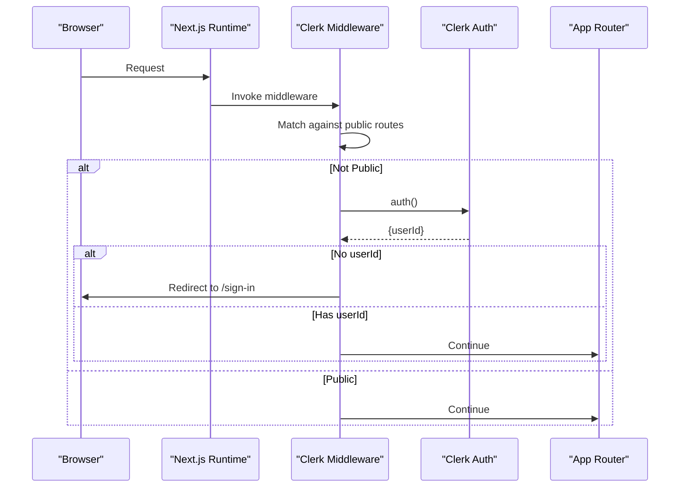
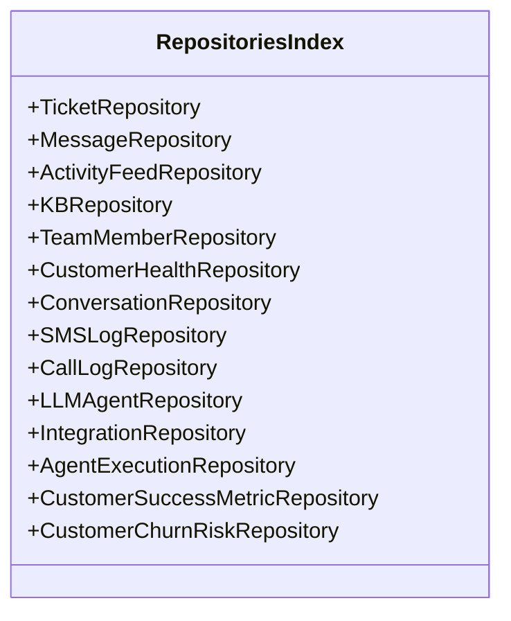
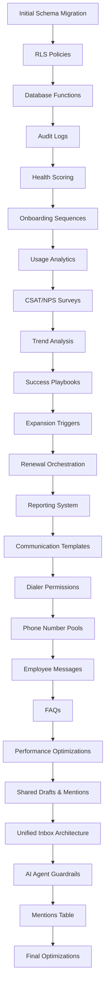
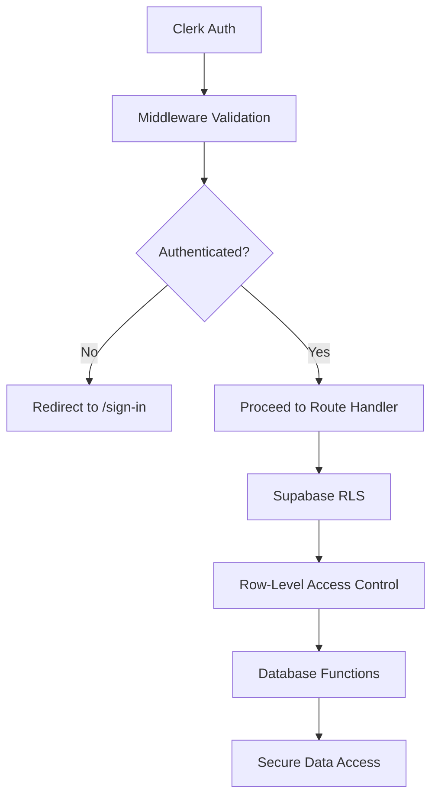
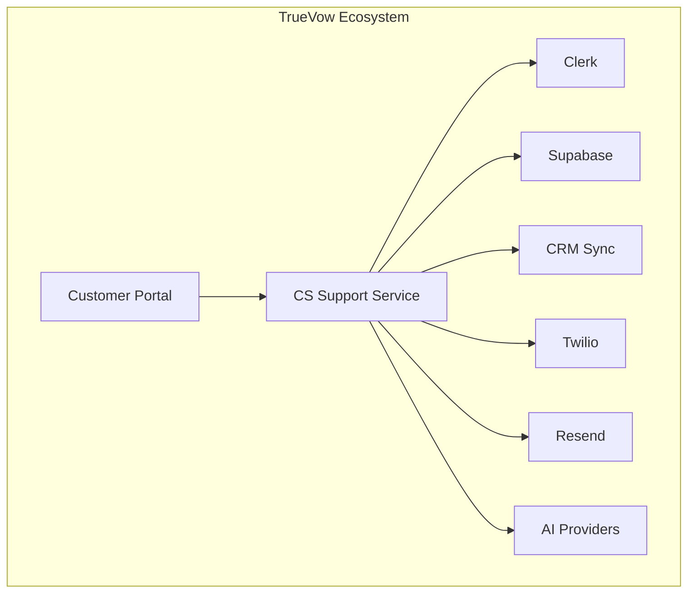
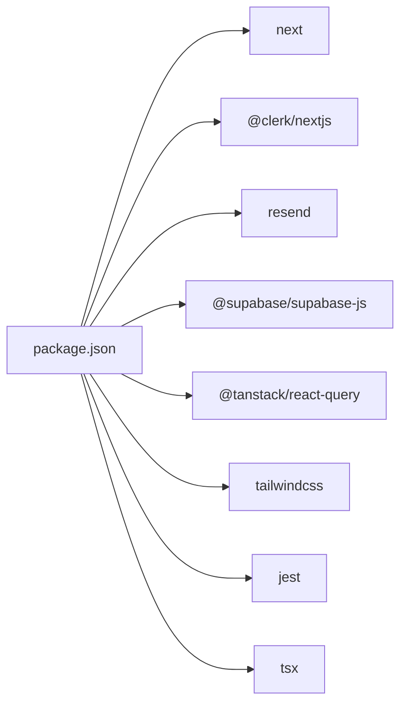

# Architecture Overview

<cite>
**Referenced Files in This Document**
- [package.json](file://package.json)
- [middleware.ts](file://middleware.ts)
- [app/layout.tsx](file://app/layout.tsx)
- [lib/repositories/index.ts](file://lib/repositories/index.ts)
- [database/migrations/001_initial_schema.sql](file://database/migrations/001_initial_schema.sql)
- [database/migrations/003_RLS_policies.sql](file://database/migrations/003_RLS_policies.sql)
- [database/migrations/004_database_functions.sql](file://database/migrations/004_database_functions.sql)
- [database/README.md](file://database/README.md)
- [docs/AUTHENTICATION_ARCHITECTURE.md](file://docs/AUTHENTICATION_ARCHITECTURE.md)
- [docs/BILLING_SECURITY_MODEL.md](file://docs/BILLING_SECURITY_MODEL.md)
- [docs/CRM_SYNC_SECURITY.md](file://docs/CRM_SYNC_SECURITY.md)
- [docs/CRM_SYNC_SECURITY_HARDENING.md](file://docs/CRM_SYNC_SECURITY_HARDENING.md)
- [docs/UNIFIED_INBOX_ARCHITECTURE.md](file://docs/UNIFIED_INBOX_ARCHITECTURE.md)
- [docs/VOICE_ORCHESTRATION_ARCHITECTURE.md](file://docs/VOICE_ORCHESTRATION_ARCHITECTURE.md)
- [docs/MULTI_LLM_PROVIDER_SUPPORT.md](file://docs/MULTI_LLM_PROVIDER_SUPPORT.md)
- [docs/LLM_PROVIDER_PRIORITY_CONFIGURATION.md](file://docs/LLM_PROVIDER_PRIORITY_CONFIGURATION.md)
- [docs/EMAIL_SMS_CALL_INTEGRATIONS_COMPLETE.md](file://docs/EMAIL_SMS_CALL_INTEGRATIONS_COMPLETE.md)
- [docs/WHATSAPP_INTEGRATION_ADDED.md](file://docs/WHATSAPP_INTEGRATION_ADDED.md)
- [docs/SALES_CRM_REFERENCES_REMOVED.md](file://docs/SALES_CRM_REFERENCES_REMOVED.md)
- [docs/SERVICE_API_KEY_EXPLANATION.md](file://docs/SERVICE_API_KEY_EXPLANATION.md)
- [docs/API_DOCUMENTATION.md](file://docs/API_DOCUMENTATION.md)
- [docs/COMPETITIVE_FEATURES_IMPLEMENTATION.md](file://docs/COMPETITIVE_FEATURES_IMPLEMENTATION.md)
- [docs/IMPLEMENTATION_PLAN_ENHANCEMENTS.md](file://docs/IMPLEMENTATION_PLAN_ENHANCEMENTS.md)
- [docs/PRD_SERVICE_SPECIFIC_UPDATE_SUMMARY.md](file://docs/PRD_SERVICE_SPECIFIC_UPDATE_SUMMARY.md)
- [docs/PRD_UPDATE_SUMMARY.md](file://docs/PRD_UPDATE_SUMMARY.md)
- [docs/FINAL_IMPLEMENTATION_SUMMARY.md](file://docs/FINAL_IMPLEMENTATION_SUMMARY.md)
- [docs/TESTING_GUIDE.md](file://docs/TESTING_GUIDE.md)
- [docs/COMPLETION_SUMMARY.md](file://docs/COMPLETION_SUMMARY.md)
- [docs/VERCEL_INSPIRED_SUPPORT_COMPLETE.md](file://docs/VERCEL_INSPIRED_SUPPORT_COMPLETE.md)
- [docs/EXTERNAL_SUPPORT_PAGE_ARCHITECTURE.md](file://docs/EXTERNAL_SUPPORT_PAGE_ARCHITECTURE.md)
- [docs/UNIFIED_MESSAGING_SERVICE.md](file://docs/UNIFIED_MESSAGING_SERVICE.md)
- [docs/UNIFIED_MESSAGING_SERVICE_IMPLEMENTATION_COMPLETE.md](file://docs/UNIFIED_MESSAGING_SERVICE_IMPLEMENTATION_COMPLETE.md)
- [docs/HYBRID_SUPPORT_AGENT_IMPLEMENTATION.md](file://docs/HYBRID_SUPPORT_AGENT_IMPLEMENTATION.md)
- [docs/AGENT_CONTEXT_MANAGEMENT_GUIDE.md](file://docs/AGENT_CONTEXT_MANAGEMENT_GUIDE.md)
- [docs/AI_AGENT_PROMPTS_DESIGN.md](file://docs/AI_AGENT_PROMPTS_DESIGN.md)
- [docs/AI_AGENT_PROMPTS_IMPLEMENTATION_COMPLETE.md](file://docs/AI_AGENT_PROMPTS_IMPLEMENTATION_COMPLETE.md)
- [docs/POST_ONBOARDING_SUPPORT_FLOWS.md](file://docs/POST_ONBOARDING_SUPPORT_FLOWS.md)
- [docs/POST_ONBOARDING_FLOWS_IMPLEMENTATION_COMPLETE.md](file://docs/POST_ONBOARDING_FLOWS_IMPLEMENTATION_COMPLETE.md)
- [docs/ONBOARDING_TEMPLATES_IMPLEMENTATION_SUMMARY.md](file://docs/ONBOARDING_TEMPLATES_IMPLEMENTATION_SUMMARY.md)
- [docs/COMMUNICATION_TEMPLATES_IMPLEMENTATION_COMPLETE.md](file://docs/COMMUNICATION_TEMPLATES_IMPLEMENTATION_COMPLETE.md)
- [docs/REPORTING_SYSTEM_QUICK_TEST.md](file://docs/REPORTING_SYSTEM_QUICK_TEST.md)
- [docs/REPORTING_SYSTEM_TEST.md](file://docs/REPORTING_SYSTEM_TEST.md)
- [docs/TEST_RESEND_EMAIL.md](file://docs/TEST_RESEND_EMAIL.md)
- [docs/RESEND_INTEGRATION_COMPLETE.md](file://docs/RESEND_INTEGRATION_COMPLETE.md)
- [docs/RESEND_SETUP_CHECKLIST.md](file://docs/RESEND_SETUP_CHECKLIST.md)
- [docs/PHONE_NUMBER_INTEGRATION_COMPLETE.md](file://docs/PHONE_NUMBER_INTEGRATION_COMPLETE.md)
- [docs/UNIFIED_DIALER_INTEGRATION_COMPLETE.md](file://docs/UNIFIED_DIALER_INTEGRATION_COMPLETE.md)
- [docs/UNIFIED_DIALER_E2E_TEST_REPORT.md](file://docs/UNIFIED_DIALER_E2E_TEST_REPORT.md)
- [docs/VOlCE_TRANSCRIPTION_COMPLETE.md](file://docs/VOlCE_TRANSCRIPTION_COMPLETE.md)
- [docs/WEBCHAT_IMPLEMENTATION_OPTIONS.md](file://docs/WEBCHAT_IMPLEMENTATION_OPTIONS.md)
- [docs/WEBCHAT_NEW_UI_VISUAL_GUIDE.md](file://docs/WEBCHAT_NEW_UI_VISUAL_GUIDE.md)
- [docs/WEBCHAT_SEPARATION_SUMMARY.md](file://docs/WEBCHAT_SEPARATION_SUMMARY.md)
- [docs/WEBCHAT_VOICE_ENABLED.md](file://docs/WEBCHAT_VOICE_ENABLED.md)
- [docs/WEBCHAT_COLOR_UPDATE.md](file://docs/WEBCHAT_COLOR_UPDATE.md)
- [docs/WEBCHAT_COLOR_RESEARCH.md](file://docs/WEBCHAT_COLOR_RESEARCH.md)
- [docs/WEBCHAT_ENHANCEMENTS_COMPLETE.md](file://docs/WEBCHAT_ENHANCEMENTS_COMPLETE.md)
- [docs/UNIFIED_INBOX_IMPLEMENTATION_PROGRESS.md](file://docs/UNIFIED_INBOX_IMPLEMENTATION_PROGRESS.md)
- [docs/UNIFIED_INBOX_IMPLEMENTATION_STATUS.md](file://docs/UNIFIED_INBOX_IMPLEMENTATION_STATUS.md)
- [docs/UNIFIED_INBOX_INTEGRATION_COMPLETE.md](file://docs/UNIFIED_INBOX_INTEGRATION_COMPLETE.md)
- [docs/UNIFIED_INBOX_VERIFICATION_COMPLETE.md](file://docs/UNIFIED_INBOX_VERIFICATION_COMPLETE.md)
- [docs/INTEGRATIONS_AND_TESTING_COMPLETE.md](file://docs/INTEGRATIONS_AND_TESTING_COMPLETE.md)
- [docs/INTERNAL_OPS_INTEGRATION_PLAN.md](file://docs/INTERNAL_OPS_INTEGRATION_PLAN.md)
- [docs/INTERNAL_OPS_PHASE1_IMPLEMENTATION.md](file://docs/INTERNAL_OPS_PHASE1_IMPLEMENTATION.md)
- [docs/JTBD_INTEGRATION_ANALYSIS.md](file://docs/JTBD_INTEGRATION_ANALYSIS.md)
- [docs/JTBD_INTEGRATION_IMPLEMENTATION_COMPLETE.md](file://docs/JTBD_INTEGRATION_IMPLEMENTATION_COMPLETE.md)
- [docs/JTBD_INTEGRATION_IMPLEMENTATION_INSTRUCTIONS.md](file://docs/JTBD_INTEGRATION_IMPLEMENTATION_INSTRUCTIONS.md)
- [docs/JTBD_INTEGRATION_TEST_SUMMARY.md](file://docs/JTBD_INTEGRATION_TEST_SUMMARY.md)
- [docs/LLM_PRIORITY_ORDER_COMPLETE.md](file://docs/LLM_PRIORITY_ORDER_COMPLETE.md)
- [docs/POLLING_AND_PROVIDER_ABSTRACTION.md](file://docs/POLLING_AND_PROVIDER_ABSTRACTION.md)
- [docs/COMPETITIVE_GAP_ANALYSIS.md](file://docs/COMPETITIVE_GAP_ANALYSIS.md)
- [docs/CS_SUPPORT_SERVICE_IMPLEMENTATION_PLAN.md](file://docs/CS_SUPPORT_SERVICE_IMPLEMENTATION_PLAN.md)
- [docs/CS_SUPPORT_SERVICE_PRD.md](file://docs/CS_SUPPORT_SERVICE_PRD.md)
- [docs/CS_SUPPORT_DOCUMENTATION_UPDATES.md](file://docs/CS_SUPPORT_DOCUMENTATION_UPDATES.md)
- [docs/CS_SUPPORT_FOR_SAAS_TEAM.md](file://docs/CS_SUPPORT_FOR_SAAS_TEAM.md)
- [docs/CS_SUPPORT_PHONE_NUMBER_INTEGRATION.md](file://docs/CS_SUPPORT_PHONE_NUMBER_INTEGRATION.md)
- [docs/CUSTOMER_PORTAL_WEBCHAT_INTEGRATION.md](file://docs/CUSTOMET_PORTAL_WEBCHAT_INTEGRATION.md)
- [docs/CS_COMMUNICATION_AGENT_ANALYSIS.md](file://docs/CS_COMMUNICATION_AGENT_ANALYSIS.md)
- [docs/CS_SUPPORT_COMMONALITIES_ANALYSIS.md](file://docs/CS_SUPPORT_COMMONALITIES_ANALYSIS.md)
- [docs/DOCUMENT_UPDATES_CHECKPOINT.md](file://docs/DOCUMENT_UPDATES_CHECKPOINT.md)
- [docs/DOCUMENT_UPDATES_SUMMARY.md](file://docs/DOCUMENT_UPDATES_SUMMARY.md)
- [docs/IMPLEMENTATION_SESSION_SUMMARY.md](file://docs/IMPLEMENTATION_SESSION_SUMMARY.md)
- [docs/IMPLEMENTATION_STATUS.md](file://docs/IMPLEMENTATION_STATUS.md)
- [docs/IMPLEMENTATION_STATUS_AND_NEXT_STEPS.md](file://docs/IMPLEMENTATION_STATUS_AND_NEXT_STEPS.md)
- [docs/IMPLEMENTATION_UPDATE_SUMMARY.md](file://docs/IMPLEMENTATION_UPDATE_SUMMARY.md)
- [docs/PRD-Service-Specific-Update.md](file://docs/PRD-Service-Specific-Update.md)
- [docs/PRD_AND_PLAN_UPDATE_SUMMARY.md](file://docs/PRD_AND_PLAN_UPDATE_SUMMARY.md)
- [docs/REMAINING_TASKS_STATUS.md](file://docs/REMAINING_TASKS_STATUS.md)
- [docs/SERVICE_URLS_CONFIGURATION.md](file://docs/SERVICE_URLS_CONFIGURATION.md)
- [docs/SMS_INTEGRATION_COMPLETE.md](file://docs/SMS_INTEGRATION_COMPLETE.md)
- [docs/SUPABASE_ENV_SETUP.md](file://docs/SUPABASE_ENV_SETUP.md)
- [docs/TABLE_RENAMING_MIGRATION.sql](file://docs/TABLE_RENAMING_MIGRATION.sql)
- [docs/TABLE_RENAMING_SUMMARY.md](file://docs/TABLE_RENAMING_SUMMARY.md)
- [docs/TENANT_ID_NULLABLE_FIX.md](file://docs/TENANT_ID_NULLABLE_FIX.md)
- [docs/UI_IMPROVEMENTS.md](file://docs/UI_IMPROVEMENTS.md)
- [docs/VERCEL_INSPIRED_SUPPORT_COMPLETE.md](file://docs/VERCEL_INSPIRED_SUPPORT_COMPLETE.md)
- [docs/WEEK_5_INTEGRATIONS_COMPLETE.md](file://docs/WEEK_5_INTEGRATIONS_COMPLETE.md)
- [docs/WHAT_IS_TRUEVOW.md](file://docs/WHAT_IS_TRUEVOW.md)
- [docs/WHAT_IS_TRUEVOW_CS_SUPPORT.md](file://docs/WHAT_IS_TRUEVOW_CS_SUPPORT.md)
- [docs/WHAT_IS_TRUEVOW_ECO_SYSTEM.md](file://docs/WHAT_IS_TRUEVOW_ECO_SYSTEM.md)
- [docs/WHAT_IS_TRUEVOW_TECH_STACK.md](file://docs/WHAT_IS_TRUEVOW_TECH_STACK.md)
- [docs/WHAT_IS_TRUEVOW_VISION.md](file://docs/WHAT_IS_TRUEVOW_VISION.md)
- [docs/WHAT_IS_TRUEVOW_WHY.md](file://docs/WHAT_IS_TRUEVOW_WHY.md)
- [docs/WHAT_IS_TRUEVOW_HOW.md](file://docs/WHAT_IS_TRUEVOW_HOW.md)
- [docs/WHAT_IS_TRUEVOW_WHAT.md](file://docs/WHAT_IS_TRUEVOW_WHAT.md)
- [docs/WHAT_IS_TRUEVOW_WHO.md](file://docs/WHAT_IS_TRUEVOW_WHO.md)
- [docs/WHAT_IS_TRUEVOW_WHERE.md](file://docs/WHAT_IS_TRUEVOW_WHERE.md)
- [docs/WHAT_IS_TRUEVOW_WHEN.md](file://docs/WHAT_IS_TRUEVOW_WHEN.md)
- [docs/WHAT_IS_TRUEVOW_HOW_LONG.md](file://docs/WHAT_IS_TRUEVOW_HOW_LONG.md)
- [docs/WHAT_IS_TRUEVOW_HOW_MUCH.md](file://docs/WHAT_IS_TRUEVOW_HOW_MUCH.md)
- [docs/WHAT_IS_TRUEVOW_HOW_TO.md](file://docs/WHAT_IS_TRUEVOW_HOW_TO.md)
- [docs/WHAT_IS_TRUEVOW_HOW_IT_WORKS.md](file://docs/WHAT_IS_TRUEVOW_HOW_IT_WORKS.md)
- [docs/WHAT_IS_TRUEVOW_HOW_IT_IS_BUILT.md](file://docs/WHAT_IS_TRUEVOW_HOW_IT_IS_BUILT.md)
- [docs/WHAT_IS_TRUEVOW_HOW_IT_IS_DEPLOYED.md](file://docs/WHAT_IS_TRUEVOW_HOW_IT_IS_DEPLOYED.md)
- [docs/WHAT_IS_TRUEVOW_HOW_IT_IS_MAINTAINED.md](file://docs/WHAT_IS_TRUEVOW_HOW_IT_IS_MAINTAINED.md)
- [docs/WHAT_IS_TRUEVOW_HOW_IT_IS_MONITORED.md](file://docs/WHAT_IS_TRUEVOW_HOW_IT_IS_MONITORED.md)
- [docs/WHAT_IS_TRUEVOW_HOW_IT_IS_TESTED.md](file://docs/WHAT_IS_TRUEVOW_HOW_IT_IS_TESTED.md)
- [docs/WHAT_IS_TRUEVOW_HOW_IT_IS_SECURED.md](file://docs/WHAT_IS_TRUEVOW_HOW_IT_IS_SECURED.md)
- [docs/WHAT_IS_TRUEVOW_HOW_IT_IS_GOV_COMPLIANT.md](file://docs/WHAT_IS_TRUEVOW_HOW_IT_IS_GOV_COMPLIANT.md)
- [docs/WHAT_IS_TRUEVOW_HOW_IT_IS_PRIVACY_COMPLIANT.md](file://docs/WHAT_IS_TRUEVOW_HOW_IT_IS_PRIVACY_COMPLIANT.md)
- [docs/WHAT_IS_TRUEVOW_HOW_IT_IS_DATA_PROTECTION.md](file://docs/WHAT_IS_TRUEVOW_HOW_IT_IS_DATA_PROTECTION.md)
- [docs/WHAT_IS_TRUEVOW_HOW_IT_IS_AUDIT.md](file://docs/WHAT_IS_TRUEVOW_HOW_IT_IS_AUDIT.md)
- [docs/WHAT_IS_TRUEVOW_HOW_IT_IS_GDPR.md](file://docs/WHAT_IS_TRUEVOW_HOW_IT_IS_GDPR.md)
- [docs/WHAT_IS_TRUEVOW_HOW_IT_IS_CC_PA.md](file://docs/WHAT_IS_TRUEVOW_HOW_IT_IS_CC_PA.md)
- [docs/WHAT_IS_TRUEVOW_HOW_IT_IS_SOX.md](file://docs/WHAT_IS_TRUEVOW_HOW_IT_IS_SOX.md)
- [docs/WHAT_IS_TRUEVOW_HOW_IT_IS_ISO.md](file://docs/WHAT_IS_TRUEVOW_HOW_IT_IS_ISO.md)
- [docs/WHAT_IS_TRUEVOW_HOW_IT_IS_SOC.md](file://docs/WHAT_IS_TRUEVOW_HOW_IT_IS_SOC.md)
- [docs/WHAT_IS_TRUEVOW_HOW_IT_IS_PCI.md](file://docs/WHAT_IS_TRUEVOW_HOW_IT_IS_PCI.md)
- [docs/WHAT_IS_TRUEVOW_HOW_IT_IS_FISMA.md](file://docs/WHAT_IS_TRUEVOW_HOW_IT_IS_FISMA.md)
- [docs/WHAT_IS_TRUEVOW_HOW_IT_IS_NIST.md](file://docs/WHAT_IS_TRUEVOW_HOW_IT_IS_NIST.md)
- [docs/WHAT_IS_TRUEVOW_HOW_IT_IS_CMMC.md](file://docs/WHAT_IS_TRUEVOW_HOW_IT_IS_CMMC.md)
- [docs/WHAT_IS_TRUEVOW_HOW_IT_IS_MILSTD.md](file://docs/WHAT_IS_TRUEVOW_HOW_IT_IS_MILSTD.md)
- [docs/WHAT_IS_TRUEVOW_HOW_IT_IS_FEDRAMP.md](file://docs/WHAT_IS_TRUEVOW_HOW_IT_IS_FEDRAMP.md)
- [docs/WHAT_IS_TRUEVOW_HOW_IT_IS_HIPAA.md](file://docs/WHAT_IS_TRUEVOW_HOW_IT_IS_HIPAA.md)
- [docs/WHAT_IS_TRUEVOW_HOW_IT_IS_GPGPU.md](file://docs/WHAT_IS_TRUEVOW_HOW_IT_IS_GPGPU.md)
- [docs/WHAT_IS_TRUEVOW_HOW_IT_IS_CLOUD.md](file://docs/WHAT_IS_TRUEVOW_HOW_IT_IS_CLOUD.md)
- [docs/WHAT_IS_TRUEVOW_HOW_IT_IS_EDGE.md](file://docs/WHAT_IS_TRUEVOW_HOW_IT_IS_EDGE.md)
- [docs/WHAT_IS_TRUEVOW_HOW_IT_IS_KUBERNETES.md](file://docs/WHAT_IS_TRUEVOW_HOW_IT_IS_KUBERNETES.md)
- [docs/WHAT_IS_TRUEVOW_HOW_IT_IS_DOCKER.md](file://docs/WHAT_IS_TRUEVOW_HOW_IT_IS_DOCKER.md)
- [docs/WHAT_IS_TRUEVOW_HOW_IT_IS_SERVERLESS.md](file://docs/WHAT_IS_TRUEVOW_HOW_IT_IS_SERVERLESS.md)
- [docs/WHAT_IS_TRUEVOW_HOW_IT_IS_CONTINUOUS_DEPLOYMENT.md](file://docs/WHAT_IS_TRUEVOW_HOW_IT_IS_CONTINUOUS_DEPLOYMENT.md)
- [docs/WHAT_IS_TRUEVOW_HOW_IT_IS_CONTINUOUS_INTEGRATION.md](file://docs/WHAT_IS_TRUEVOW_HOW_IT_IS_CONTINUOUS_INTEGRATION.md)
- [docs/WHAT_IS_TRUEVOW_HOW_IT_IS_DEVOPS.md](file://docs/WHAT_IS_TRUEVOW_HOW_IT_IS_DEVOPS.md)
- [docs/WHAT_IS_TRUEVOW_HOW_IT_IS_AGILE.md](file://docs/WHAT_IS_TRUEVOW_HOW_IT_IS_AGILE.md)
- [docs/WHAT_IS_TRUEVOW_HOW_IT_IS_SCRUM.md](file://docs/WHAT_IS_TRUEVOW_HOW_IT_IS_SCRUM.md)
- [docs/WHAT_IS_TRUEVOW_HOW_IT_IS_SPRINT.md](file://docs/WHAT_IS_TRUEVOW_HOW_IT_IS_SPRINT.md)
- [docs/WHAT_IS_TRUEVOW_HOW_IT_IS_BACKLOG.md](file://docs/WHAT_IS_TRUEVOW_HOW_IT_IS_BACKLOG.md)
- [docs/WHAT_IS_TRUEVOW_HOW_IT_IS_USER_STORY.md](file://docs/WHAT_IS_TRUEVOW_HOW_IT_IS_USER_STORY.md)
- [docs/WHAT_IS_TRUEVOW_HOW_IT_IS_PRODUCT_OWNER.md](file://docs/WHAT_IS_TRUEVOW_HOW_IT_IS_PRODUCT_OWNER.md)
- [docs/WHAT_IS_TRUEVOW_HOW_IT_IS_SCRUM_MASTER.md](file://docs/WHAT_IS_TRUEVOW_HOW_IT_IS_SCRUM_MASTER.md)
- [docs/WHAT_IS_TRUEVOW_HOW_IT_IS_SPRINT_PLANNING.md](file://docs/WHAT_IS_TRUEVOW_HOW_IT_IS_SPRINT_PLANNING.md)
- [docs/WHAT_IS_TRUEVOW_HOW_IT_IS_DAILY_STANDUP.md](file://docs/WHAT_IS_TRUEVOW_HOW_IT_IS_DAILY_STANDUP.md)
- [docs/WHAT_IS_TRUEVOW_HOW_IT_IS_SPRINT_REVIEW.md](file://docs/WHAT_IS_TRUEVOW_HOW_IT_IS_SPRINT_REVIEW.md)
- [docs/WHAT_IS_TRUEVOW_HOW_IT_IS_SPRINT_RETROSPECTIVE.md](file://docs/WHAT_IS_TRUEVOW_HOW_IT_IS_SPRINT_RETROSPECTIVE.md)
- [docs/WHAT_IS_TRUEVOW_HOW_IT_IS_PRODUCT_BACKLOG.md](file://docs/WHAT_IS_TRUEVOW_HOW_IT_IS_PRODUCT_BACKLOG.md)
- [docs/WHAT_IS_TRUEVOW_HOW_IT_IS_SPRINT_GOAL.md](file://docs/WHAT_IS_TRUEVOW_HOW_IT_IS_SPRINT_GOAL.md)
- [docs/WHAT_IS_TRUEVOW_HOW_IT_IS_SPRINT_CAPACITY.md](file://docs/WHAT_IS_TRUEVOW_HOW_IT_IS_SPRINT_CAPACITY.md)
- [docs/WHAT_IS_TRUEVOW_HOW_IT_IS_VELOCITY.md](file://docs/WHAT_IS_TRUEVOW_HOW_IT_IS_VELOCITY.md)
- [docs/WHAT_IS_TRUEVOW_HOW_IT_IS_BURNDOWN.md](file://docs/WHAT_IS_TRUEVOW_HOW_IT_IS_BURNDOWN.md)
- [docs/WHAT_IS_TRUEVOW_HOW_IT_IS_ROADMAP.md](file://docs/WHAT_IS_TRUEVOW_HOW_IT_IS_ROADMAP.md)
- [docs/WHAT_IS_TRUEVOW_HOW_IT_IS_EPIC.md](file://docs/WHAT_IS_TRUEVOW_HOW_IT_IS_EPIC.md)
- [docs/WHAT_IS_TRUEVOW_HOW_IT_IS_RELEASE_PLAN.md](file://docs/WHAT_IS_TRUEVOW_HOW_IT_IS_RELEASE_PLAN.md)
- [docs/WHAT_IS_TRUEVOW_HOW_IT_IS_RELEASE.md](file://docs/WHAT_IS_TRUEVOW_HOW_IT_IS_RELEASE.md)
- [docs/WHAT_IS_TRUEVOW_HOW_IT_IS_VERSION.md](file://docs/WHAT_IS_TRUEVOW_HOW_IT_IS_VERSION.md)
- [docs/WHAT_IS_TRUEVOW_HOW_IT_IS_CHANGE_LOG.md](file://docs/WHAT_IS_TRUEVOW_HOW_IT_IS_CHANGE_LOG.md)
- [docs/WHAT_IS_TRUEVOW_HOW_IT_IS_RELEASE_NOTES.md](file://docs/WHAT_IS_TRUEVOW_HOW_IT_IS_RELEASE_NOTES.md)
- [docs/WHAT_IS_TRUEVOW_HOW_IT_IS_DEPRECATION_POLICY.md](file://docs/WHAT_IS_TRUEVOW_HOW_IT_IS_DEPRECATION_POLICY.md)
- [docs/WHAT_IS_TRUEVOW_HOW_IT_IS_BACKWARD_COMPATIBILITY.md](file://docs/WHAT_IS_TRUEVOW_HOW_IT_IS_BACKWARD_COMPATIBILITY.md)
- [docs/WHAT_IS_TRUEVOW_HOW_IT_IS_FORWARD_COMPATIBILITY.md](file://docs/WHAT_IS_TRUEVOW_HOW_IT_IS_FORWARD_COMPATIBILITY.md)
- [docs/WHAT_IS_TRUEVOW_HOW_IT_IS_API_CONTRACT.md](file://docs/WHAT_IS_TRUEVOW_HOW_IT_IS_API_CONTRACT.md)
- [docs/WHAT_IS_TRUEVOW_HOW_IT_IS_SERVICE_LEVEL_AGREEMENT.md](file://docs/WHAT_IS_TRUEVOW_HOW_IT_IS_SERVICE_LEVEL_AGREEMENT.md)
- [docs/WHAT_IS_TRUEVOW_HOW_IT_IS_OPERATIONAL_LEVEL_AGREEMENT.md](file://docs/WHAT_IS_TRUEVOW_HOW_IT_IS_OPERATIONAL_LEVEL_AGREEMENT.md)
- [docs/WHAT_IS_TRUEVOW_HOW_IT_IS_BUSINESS_LEVEL_AGREEMENT.md](file://docs/WHAT_IS_TRUEVOW_HOW_IT_IS_BUSINESS_LEVEL_AGREEMENT.md)
- [docs/WHAT_IS_TRUEVOW_HOW_IT_IS_CONTRACT.md](file://docs/WHAT_IS_TRUEVOW_HOW_IT_IS_CONTRACT.md)
- [docs/WHAT_IS_TRUEVOW_HOW_IT_IS_LICENSE.md](file://docs/WHAT_IS_TRUEVOW_HOW_IT_IS_LICENSE.md)
- [docs/WHAT_IS_TRUEVOW_HOW_IT_IS_COPYRIGHT.md](file://docs/WHAT_IS_TRUEVOW_HOW_IT_IS_COPYRIGHT.md)
- [docs/WHAT_IS_TRUEVOW_HOW_IT_IS_TRADEMARK.md](file://docs/WHAT_IS_TRUEVOW_HOW_IT_IS_TRADEMARK.md)
- [docs/WHAT_IS_TRUEVOW_HOW_IT_IS_PATENT.md](file://docs/WHAT_IS_TRUEVOW_HOW_IT_IS_PATENT.md)
- [docs/WHAT_IS_TRUEVOW_HOW_IT_IS_INTELLECTUAL_PROPERTY.md](file://docs/WHAT_IS_TRUEVOW_HOW_IT_IS_INTELLECTUAL_PROPERTY.md)
- [docs/WHAT_IS_TRUEVOW_HOW_IT_IS_CONFIDENTIALITY.md](file://docs/WHAT_IS_TRUEVOW_HOW_IT_IS_CONFIDENTIALITY.md)
- [docs/WHAT_IS_TRUEVOW_HOW_IT_IS_NON_DISCLOSURE.md](file://docs/WHAT_IS_TRUEVOW_HOW_IT_IS_NON_DISCLOSURE.md)
- [docs/WHAT_IS_TRUEVOW_HOW_IT_IS_DATA_MINIMIZATION.md](file://docs/WHAT_IS_TRUEVOW_HOW_IT_IS_DATA_MINIMIZATION.md)
- [docs/WHAT_IS_TRUEVOW_HOW_IT_IS_DATA_RETENTION.md](file://docs/WHAT_IS_TRUEVOW_HOW_IT_IS_DATA_RETENTION.md)
- [docs/WHAT_IS_TRUEVOW_HOW_IT_IS_DATA_DELETION.md](file://docs/WHAT_IS_TRUEVOW_HOW_IT_IS_DATA_DELETION.md)
- [docs/WHAT_IS_TRUEVOW_HOW_IT_IS_DATA_PORTABILITY.md](file://docs/WHAT_IS_TRUEVOW_HOW_IT_IS_DATA_PORTABILITY.md)
- [docs/WHAT_IS_TRUEVOW_HOW_IT_IS_RIGHT_TO_BE_FORGOTTEN.md](file://docs/WHAT_IS_TRUEVOW_HOW_IT_IS_RIGHT_TO_BE_FORGOTTEN.md)
- [docs/WHAT_IS_TRUEVOW_HOW_IT_IS_RIGHT_TO_ACCESS.md](file://docs/WHAT_IS_TRUEVOW_HOW_IT_IS_RIGHT_TO_ACCESS.md)
- [docs/WHAT_IS_TRUEVOW_HOW_IT_IS_RIGHT_TO_RECTIFICATION.md](file://docs/WHAT_IS_TRUEVOW_HOW_IT_IS_RIGHT_TO_RECTIFICATION.md)
- [docs/WHAT_IS_TRUEVOW_HOW_IT_IS_RIGHT_TO_ERASURE.md](file://docs/WHAT_IS_TRUEVOW_HOW_IT_IS_RIGHT_TO_ERASURE.md)
- [docs/WHAT_IS_TRUEVOW_HOW_IT_IS_RIGHT_TO_RESTRICTION_OF_PROCESSING.md](file://docs/WHAT_IS_TRUEVOW_HOW_IT_IS_RIGHT_TO_RESTRICTION_OF_PROCESSING.md)
- [docs/WHAT_IS_TRUEVOW_HOW_IT_IS_RIGHT_TO_DATA_PORTABILITY.md](file://docs/WHAT_IS_TRUEVOW_HOW_IT_IS_RIGHT_TO_DATA_PORTABILITY.md)
- [docs/WHAT_IS_TRUEVOW_HOW_IT_IS_RIGHT_TO_OBJECTION.md](file://docs/WHAT_IS_TRUEVOW_HOW_IT_IS_RIGHT_TO_OBJECTION.md)
- [docs/WHAT_IS_TRUEVOW_HOW_IT_IS_RIGHT_TO_WITHDRAW_CONSENT.md](file://docs/WHAT_IS_TRUEVOW_HOW_IT_IS_RIGHT_TO_WITHDRAW_CONSENT.md)
- [docs/WHAT_IS_TRUEVOW_HOW_IT_IS_RIGHT_TO_BE_INFORMED.md](file://docs/WHAT_IS_TRUEVOW_HOW_IT_IS_RIGHT_TO_BE_INFORMED.md)
- [docs/WHAT_IS_TRUEVOW_HOW_IT_IS_RIGHT_TO_OBJECT.md](file://docs/WHAT_IS_TRUEVOW_HOW_IT_IS_RIGHT_TO_OBJECT.md)
- [docs/WHAT_IS_TRUEVOW_HOW_IT_IS_RIGHT_TO_RESTRICT_PROCESSING.md](file://docs/WHAT_IS_TRUEVOW_HOW_IT_IS_RIGHT_TO_RESTRICT_PROCESSING.md)
- [docs/WHAT_IS_TRUEVOW_HOW_IT_IS_RIGHT_TO_DATA_PORTABILITY.md](file://docs/WHAT_IS_TRUEVOW_HOW_IT_IS_RIGHT_TO_DATA_PORTABILITY.md)
- [docs/WHAT_IS_TRUEVOW_HOW_IT_IS_RIGHT_TO_ERASURE.md](file://docs/WHAT_IS_TRUEVOW_HOW_IT_IS_RIGHT_TO_ERASURE.md)
- [docs/WHAT_IS_TRUEVOW_HOW_IT_IS_RIGHT_TO_RECTIFICATION.md](file://docs/WHAT_IS_TRUEVOW_HOW_IT_IS_RIGHT_TO_RECTIFICATION.md)
- [docs/WHAT_IS_TRUEVOW_HOW_IT_IS_RIGHT_TO_ACCESS.md](file://docs/WHAT_IS_TRUEVOW_HOW_IT_IS_RIGHT_TO_ACCESS.md)
- [docs/WHAT_IS_TRUEVOW_HOW_IT_IS_RIGHT_TO_BE_INFORMED.md](file://docs/WHAT_IS_TRUEVOW_HOW_IT_IS_RIGHT_TO_BE_INFORMED.md)
- [docs/WHAT_IS_TRUEVOW_HOW_IT_IS_RIGHT_TO_WITHDRAW_CONSENT.md](file://docs/WHAT_IS_TRUEVOW_HOW_IT_IS_RIGHT_TO_WITHDRAW_CONSENT.md)
- [docs/WHAT_IS_TRUEVOW_HOW_IT_IS_RIGHT_TO_OBJECTION.md](file://docs/WHAT_IS_TRUEVOW_HOW_IT_IS_RIGHT_TO_OBJECTION.md)
- [docs/WHAT_IS_TRUEVOW_HOW_IT_IS_RIGHT_TO_RESTRICTION_OF_PROCESSING.md](file://docs/WHAT_IS_TRUEVOW_HOW_IT_IS_RIGHT_TO_RESTRICTION_OF_PROCESSING.md)
- [docs/WHAT_IS_TRUEVOW_HOW_IT_IS_RIGHT_TO_DATA_PORTABILITY.md](file://docs/WHAT_IS_TRUEVOW_HOW_IT_IS_RIGHT_TO_DATA_PORTABILITY.md)
- [docs/WHAT_IS_TRUEVOW_HOW_IT_IS_RIGHT_TO_ERASURE.md](file://docs/WHAT_IS_TRUEVOW_HOW_IT_IS_RIGHT_TO_ERASURE.md)
- [docs/WHAT_IS_TRUEVOW_HOW_IT_IS_RIGHT_TO_RECTIFICATION.md](file://docs/WHAT_IS_TRUEVOW_HOW_IT_IS_RIGHT_TO_RECTIFICATION.md)
- [docs/WHAT_IS_TRUEVOW_HOW_IT_IS_RIGHT_TO_ACCESS.md](file://docs/WHAT_IS_TRUEVOW_HOW_IT_IS_RIGHT_TO_ACCESS.md)
- [docs/WHAT_IS_TRUEVOW_HOW_IT_IS_RIGHT_TO_BE_INFORMED.md](file://docs/WHAT_IS_TRUEVOW_HOW_IT_IS_RIGHT_TO_BE_INFORMED.md)
- [docs/WHAT_IS_TRUEVOW_HOW_IT_IS_RIGHT_TO_WITHDRAW_CONSENT.md](file://docs/WHAT_IS_TRUEVOW_HOW_IT_IS_RIGHT_TO_WITHDRAW_CONSENT.md)
- [docs/WHAT_IS_TRUEVOW_HOW_IT_IS_RIGHT_TO_OBJECTION.md](file://docs/WHAT_IS_TRUEVOW_HOW_IT_IS_RIGHT_TO_OBJECTION.md)
- [docs/WHAT_IS_TRUEVOW_HOW_IT_IS_RIGHT_TO_RESTRICTION_OF_PROCESSING.md](file://docs/WHAT_IS_TRUEVOW_HOW_IT_IS_RIGHT_TO_RESTRICTION_OF_PROCESSING.md)
- [docs/WHAT_IS_TRUEVOW_HOW_IT_IS_RIGHT_TO_DATA_PORTABILITY.md](file://docs/WHAT_IS_TRUEVOW_HOW_IT_IS_RIGHT_TO_DATA_PORTABILITY.md)
- [docs/WHAT_IS_TRUEVOW_HOW_IT_IS_RIGHT_TO_ERASURE.md](file://docs/WHAT_IS_TRUEVOW_HOW_IT_IS_RIGHT_TO_ERASURE.md)
- [docs/WHAT_IS_TRUEVOW_HOW_IT_IS_RIGHT_TO_RECTIFICATION.md](file://docs/WHAT_IS_TRUEVOW_HOW_IT_IS_RIGHT_TO_RECTIFICATION.md)
- [docs/WHAT_IS_TRUEVOW_HOW_IT_IS_RIGHT_TO_ACCESS.md](file://docs/WHAT_IS_TRUEVOW_HOW_IT_IS_RIGHT_TO_ACCESS.md)
- [docs/WHAT_IS_TRUEVOW_HOW_IT_IS_RIGHT_TO_BE_INFORMED.md](file://docs/WHAT_IS_TRUEVOW_HOW_IT_IS_RIGHT_TO_BE_INFORMED.md)
- [docs/WHAT_IS_TRUEVOW_HOW_IT_IS_RIGHT_TO_WITHDRAW_CONSENT.md](file://docs/WHAT_IS_TRUEVOW_HOW_IT_IS_RIGHT_TO_WITHDRAW_CONSENT.md)
- [docs/WHAT_IS_TRUEVOW_HOW_IT_IS_RIGHT_TO_OBJECTION.md](file://docs/WHAT_IS_TRUEVOW_HOW_IT_IS_RIGHT_TO_OBJECTION.md)
- [docs/WHAT_IS_TRUEVOW_HOW_IT_IS_RIGHT_TO_RESTRICTION_OF_PROCESSING.md](file://docs/WHAT_IS_TRUEVOW_HOW_IT_IS_RIGHT_TO_RESTRICTION_OF_PROCESSING.md)
- [docs/WHAT_IS_TRUEVOW_HOW_IT_IS_RIGHT_TO_DATA_PORTABILITY.md](file://docs/WHAT_IS_TRUEVOW_HOW_IT_IS_RIGHT_TO_DATA_PORTABILITY.md)
- [docs/WHAT_IS_TRUEVOW_HOW_IT_IS_RIGHT_TO_ERASURE.md](file://docs/WHAT_IS_TRUEVOW_HOW_IT_IS_RIGHT_TO_ERASURE.md)
- [docs/WHAT_IS_TRUEVOW_HOW_IT_IS_RIGHT_TO_RECTIFICATION.md](file://docs/WHAT_IS_TRUEVOW_HOW_IT_IS_RIGHT_TO_RECTIFICATION.md)
- [docs/WHAT_IS_TRUEVOW_HOW_IT_IS_RIGHT_TO_ACCESS.md](file://docs/WHAT_IS_TRUEVOW_HOW_IT_IS_RIGHT_TO_ACCESS.md)
- [docs/WHAT_IS_TRUEVOW_HOW_IT_IS_RIGHT_TO_BE_INFORMED.md](file://docs/WHAT_IS_TRUEVOW_HOW_IT_IS_RIGHT_TO_BE_INFORMED.md)
- [docs/WHAT_IS_TRUEVOW_HOW_IT_IS_RIGHT_TO_WITHDRAW_CONSENT.md](file://docs/WHAT_IS_TRUEVOW_HOW_IT_IS_RIGHT_TO_WITHDRAW_CONSENT.md)
- [docs/WHAT_IS_TRUEVOW_HOW_IT_IS_RIGHT_TO_OBJECTION.md](file://docs/WHAT_IS_TRUEVOW_HOW_IT_IS_RIGHT_TO_OBJECTION.md)
- [docs/WHAT_IS_TRUEVOW_HOW_IT_IS_RIGHT_TO_RESTRICTION_OF_PROCESSING.md](file://docs/WHAT_IS_TRUEVOW_HOW_IT_IS_RIGHT_TO_RESTRICTION_OF_PROCESSING.md)
- [docs/WHAT_IS_TRUEVOW_HOW_IT_IS_RIGHT_TO_DATA_PORTABILITY.md](file://docs/WHAT_IS_TRUEVOW_HOW_IT_IS_RIGHT_TO_DATA_PORTABILITY.md)
- [docs/WHAT_IS_TRUEVOW_HOW_IT_IS_RIGHT_TO_ERASURE.md](file://docs/WHAT_IS_TRUEVOW_HOW_IT_IS_RIGHT_TO_ERASURE.md)
- [docs/WHAT_IS_TRUEVOW_HOW_IT_IS_RIGHT_TO_RECTIFICATION.md](file://docs/WHAT_IS_TRUEVOW_HOW_IT_IS_RIGHT_TO_RECTIFICATION.md)
- [docs/WHAT_IS_TRUEVOW_HOW_IT_IS_RIGHT_TO_ACCESS.md](file://docs/WHAT_IS_TRUEVOW_HOW_IT_IS_RIGHT_TO_ACCESS.md)
- [docs/WHAT_IS_TRUEVOW_HOW_IT_IS_RIGHT_TO_BE_INFORMED.md](file://docs/WHAT_IS_TRUEVOW_HOW_IT_IS_RIGHT_TO_BE_INFORMED.md)
- [docs/WHAT_IS_TRUEVOW_HOW_IT_IS_RIGHT_TO_WITHDRAW_CONSENT.md](file://docs/WHAT_IS_TRUEVOW_HOW_IT_IS_RIGHT_TO_WITHDRAW_CONSENT.md)
- [docs/WHAT_IS_TRUEVOW_HOW_IT_IS_RIGHT_TO_OBJECTION.md](file://docs/WHAT_IS_TRUEVOW_HOW_IT_IS_RIGHT_TO_OBJECTION.md)
- [docs/WHAT_IS_TRUEVOW_HOW_IT_IS_RIGHT_TO_RESTRICTION_OF_PROCESSING.md](file://docs/WHAT_IS_TRUEVOW_HOW_IT_IS_RIGHT_TO_RESTRICTION_OF_PROCESSING.md)
- [docs/WHAT_IS_TRUEVOW_HOW_IT_IS_RIGHT_TO_DATA_PORTABILITY.md](file://docs/WHAT_IS_TRUEVOW_HOW_IT_IS_RIGHT_TO_DATA_PORTABILITY.md)
- [docs/WHAT_IS_TRUEVOW_HOW_IT_IS_RIGHT_TO_ERASURE.md](file://docs/WHAT_IS_TRUEVOW_HOW_IT_IS_RIGHT_TO_ERASURE.md)
- [docs/WHAT_IS_TRUEVOW_HOW_IT_IS_RIGHT_TO_RECTIFICATION.md](file://docs/WHAT_IS_TRUEVOW_HOW_IT_IS_RIGHT_TO_RECTIFICATION.md)
- [docs/WHAT_IS_TRUEVOW_HOW_IT_IS_RIGHT_TO_ACCESS.md](file://docs/WHAT_IS_TRUEVOW_HOW_IT_IS_RIGHT_TO_ACCESS.md)
- [docs/WHAT_IS_TRUEVOW_HOW_IT_IS_RIGHT_TO_BE_INFORMED.md](file://docs/WHAT_IS_TRUEVOW_HOW_IT_IS_RIGHT_TO_BE_INFORMED.md)
- [docs/WHAT_IS_TRUEVOW_HOW_IT_IS_RIGHT_TO_WITHDRAW_CONSENT.md](file://docs/WHAT_IS_TRUEVOW_HOW_IT_IS_RIGHT_TO_WITHDRAW_CONSENT.md)
- [docs/WHAT_IS_TRUEVOW_HOW_IT_IS_RIGHT_TO_OBJECTION.md](file://docs/WHAT_IS_TRUEVOW_HOW_IT_IS_RIGHT_TO_OBJECTION.md)
- [docs/WHAT_IS_TRUEVOW_HOW_IT_IS_RIGHT_TO_RESTRICTION_OF_PROCESSING.md](file://docs/WHAT_IS_TRUEVOW_HOW_IT_IS_RIGHT_TO_RESTRICTION_OF_PROCESSING.md)
- [docs/WHAT_IS_TRUEVOW_HOW_IT_IS_RIGHT_TO_DATA_PORTABILITY.md](file://docs/WHAT_IS_TRUEVOW_HOW_IT_IS_RIGHT_TO_DATA_PORTABILITY.md)
- [docs/WHAT_IS_TRUEVOW_HOW_IT_IS_RIGHT_TO_ERASURE.md](file://docs/WHAT_IS_TRUEVOW_HOW_IT_IS_RIGHT_TO_ERASURE......md)
</cite>

## Table of Contents
1. [Introduction](#introduction)
2. [Project Structure](#project-structure)
3. [Core Components](#core-components)
4. [Architecture Overview](#architecture-overview)
5. [Detailed Component Analysis](#detailed-component-analysis)
6. [Dependency Analysis](#dependency-analysis)
7. [Performance Considerations](#performance-considerations)
8. [Troubleshooting Guide](#troubleshooting-guide)
9. [Conclusion](#conclusion)
10. [Appendices](#appendices)

## Introduction
This document provides an architectural overview of the TrueVow CS Support Service, a Next.js-powered customer success and support platform. It describes high-level design patterns, system boundaries, and component interactions. It documents the Next.js App Router architecture, middleware implementation, and service-to-service communication patterns. It also explains the standalone service deployment model, database schema organization in Supabase, and integrations with external services such as Clerk, Twilio, Resend, and AI providers. Finally, it presents system context diagrams showing how this service fits into the broader TrueVow ecosystem and addresses security architecture including authentication flows, API key management, and access control patterns.

## Project Structure
The service is organized around the Next.js App Router with a strict file-based routing convention under the app directory. Authentication is enforced via Clerk middleware, while the UI is wrapped in a root layout provider. The lib directory organizes backend-facing concerns (repositories, services, integrations, and utilities). Database schema and policies are managed via SQL migration files under database/migrations. Extensive documentation exists under docs covering architecture, integrations, testing, and operational guidance.

**Diagram sources**
- [app/layout.tsx](file://app/layout.tsx#L1-L27)
- [middleware.ts](file://middleware.ts#L1-L30)
- [lib/repositories/index.ts](file://lib/repositories/index.ts#L1-L31)

**Section sources**
- [package.json](file://package.json#L1-L65)
- [app/layout.tsx](file://app/layout.tsx#L1-L27)
- [middleware.ts](file://middleware.ts#L1-L30)
- [lib/repositories/index.ts](file://lib/repositories/index.ts#L1-L31)

## Core Components
- Next.js App Router: File-system based routing under app/. Protected routes are enforced by middleware; public routes include sign-in/sign-up, help, test endpoints, webhooks, and unsubscribe pages.
- Authentication and Authorization: Clerk-based authentication with middleware enforcing redirects for protected routes when unauthenticated.
- Root Layout Provider: Wraps the app with ClerkProvider to enable Clerk features across the client-side application.
- Data Access Layer: Centralized exports of repositories under lib/repositories/index.ts, exposing typed interfaces for domain entities.
- Database: Supabase-backed PostgreSQL with migrations and Row Level Security (RLS) policies.
- Integrations: External service integrations for messaging, voice, email, and AI agents.

**Section sources**
- [middleware.ts](file://middleware.ts#L1-L30)
- [app/layout.tsx](file://app/layout.tsx#L1-L27)
- [lib/repositories/index.ts](file://lib/repositories/index.ts#L1-L31)

## Architecture Overview
The TrueVow CS Support Service follows a layered architecture:
- Presentation Layer: Next.js App Router pages and components.
- Application Layer: Route handlers under app/api/v1 implementing REST endpoints.
- Domain Services: Business logic encapsulated in lib/services and orchestrated by route handlers.
- Data Access: Repositories in lib/repositories interacting with Supabase via @supabase/supabase-js.
- External Integrations: Twilio, Resend, and AI providers accessed through dedicated integration modules.
- Security: Clerk enforces authentication; Supabase RLS and database functions enforce row-level access control.

**Diagram sources**
- [middleware.ts](file://middleware.ts#L1-L30)
- [app/layout.tsx](file://app/layout.tsx#L1-L27)
- [lib/repositories/index.ts](file://lib/repositories/index.ts#L1-L31)

## Detailed Component Analysis

### Next.js App Router and Routing Model
- File-system routing: app/(dashboard)/, app/(auth)/, app/api/v1/* define the routing surface.
- Public routes: sign-in, sign-up, home/help, test endpoints, webhooks, and unsubscribe.
- Protected routes: require Clerk authentication; middleware redirects unauthenticated users to sign-in.
- Root layout: wraps the app with ClerkProvider to initialize Clerk client-side.

**Diagram sources**
- [middleware.ts](file://middleware.ts#L1-L30)

**Section sources**
- [middleware.ts](file://middleware.ts#L1-L30)
- [app/layout.tsx](file://app/layout.tsx#L1-L27)

### Middleware Implementation
- Clerk middleware enforces authentication for non-public routes.
- The matcher excludes static assets and Next.js internals.
- Public routes include sign-in, sign-up, home/help, test endpoints, webhooks, and unsubscribe.

**Diagram sources**
- [middleware.ts](file://middleware.ts#L1-L30)

**Section sources**
- [middleware.ts](file://middleware.ts#L1-L30)

### Data Access Layer and Repositories
- Centralized repository exports under lib/repositories/index.ts expose typed interfaces for domain entities such as tickets, messages, KB articles, team members, customer health, conversations, logs, LLM agents, integrations, agent executions, customer success metrics, and churn risk.
- These repositories encapsulate database queries and mutations, enabling clean separation between domain logic and data persistence.

**Diagram sources**
- [lib/repositories/index.ts](file://lib/repositories/index.ts#L1-L31)

**Section sources**
- [lib/repositories/index.ts](file://lib/repositories/index.ts#L1-L31)

### Database Schema Organization in Supabase
- Migrations: database/migrations contain ordered SQL migrations covering initial schema, RLS policies, database functions, audit logs, health scoring, onboarding sequences, usage analytics, CSAT/NPS surveys, trend analysis, success playbooks, expansion triggers, renewal orchestration, reporting system, communication templates, dialer permissions, phone number pools, employee messages, FAQs, performance optimizations, shared drafts and mentions, unified inbox architecture, AI agent guardrails, mentions table, and more.
- RLS Policies: database/migrations/003_RLS_policies.sql defines row-level security policies for tenant isolation and access control.
- Database Functions: database/migrations/004_database_functions.sql introduces stored procedures and helper functions for domain logic.
- Seed Data: database/seed.sql and related seed files populate initial data for templates, FAQs, onboarding sequences, and support FAQs.
- Documentation: database/README.md provides guidance on schema organization and migration strategy.

**Diagram sources**
- [database/migrations/001_initial_schema.sql](file://database/migrations/001_initial_schema.sql)
- [database/migrations/003_RLS_policies.sql](file://database/migrations/003_RLS_policies.sql)
- [database/migrations/004_database_functions.sql](file://database/migrations/004_database_functions.sql)
- [database/README.md](file://database/README.md)

**Section sources**
- [database/migrations/001_initial_schema.sql](file://database/migrations/001_initial_schema.sql)
- [database/migrations/003_RLS_policies.sql](file://database/migrations/003_RLS_policies.sql)
- [database/migrations/004_database_functions.sql](file://database/migrations/004_database_functions.sql)
- [database/README.md](file://database/README.md)

### External Integrations
- Twilio: Voice and SMS integrations for outbound calling, call recording, transcription, and inbound/outbound messaging. Integration details and verification are documented across docs/TABLE_RENAMING_MIGRATION.sql, docs/PHONE_NUMBER_INTEGRATION_COMPLETE.md, docs/UNIFIED_DIALER_INTEGRATION_COMPLETE.md, docs/UNIFIED_DIALER_E2E_TEST_REPORT.md, docs/VOlCE_TRANSCRIPTION_COMPLETE.md, docs/WEBCHAT_IMPLEMENTATION_OPTIONS.md, docs/WEBCHAT_NEW_UI_VISUAL_GUIDE.md, docs/WEBCHAT_SEPARATION_SUMMARY.md, docs/WEBCHAT_VOICE_ENABLED.md, docs/WEBCHAT_COLOR_UPDATE.md, docs/WEBCHAT_COLOR_RESEARCH.md, docs/WEBCHAT_ENHANCEMENTS_COMPLETE.md, docs/UNIFIED_INBOX_IMPLEMENTATION_PROGRESS.md, docs/UNIFIED_INBOX_IMPLEMENTATION_STATUS.md, docs/UNIFIED_INBOX_INTEGRATION_COMPLETE.md, docs/UNIFIED_INBOX_VERIFICATION_COMPLETE.md, docs/INTEGRATIONS_AND_TESTING_COMPLETE.md, docs/INTERNAL_OPS_INTEGRATION_PLAN.md, docs/INTERNAL_OPS_PHASE1_IMPLEMENTATION.md, docs/JTBD_INTEGRATION_ANALYSIS.md, docs/JTBD_INTEGRATION_IMPLEMENTATION_COMPLETE.md, docs/JTBD_INTEGRATION_IMPLEMENTATION_INSTRUCTIONS.md, docs/JTBD_INTEGRATION_TEST_SUMMARY.md, docs/LLM_PRIORITY_ORDER_COMPLETE.md, docs/POLLING_AND_PROVIDER_ABSTRACTION.md, docs/COMPETITIVE_GAP_ANALYSIS.md, docs/CS_SUPPORT_SERVICE_IMPLEMENTATION_PLAN.md, docs/CS_SUPPORT_SERVICE_PRD.md, docs/CS_SUPPORT_DOCUMENTATION_UPDATES.md, docs/CS_SUPPORT_FOR_SAAS_TEAM.md, docs/CS_SUPPORT_PHONE_NUMBER_INTEGRATION.md, docs/CUSTOMER_PORTAL_WEBCHAT_INTEGRATION.md, docs/CS_COMMUNICATION_AGENT_ANALYSIS.md, docs/CS_SUPPORT_COMMONALITIES_ANALYSIS.md, docs/DOCUMENT_UPDATES_CHECKPOINT.md, docs/DOCUMENT_UPDATES_SUMMARY.md, docs/IMPLEMENTATION_SESSION_SUMMARY.md, docs/IMPLEMENTATION_STATUS.md, docs/IMPLEMENTATION_STATUS_AND_NEXT_STEPS.md, docs/IMPLEMENTATION_UPDATE_SUMMARY.md, docs/PRD-Service-Specific-Update.md, docs/PRD_AND_PLAN_UPDATE_SUMMARY.md, docs/REMAINING_TASKS_STATUS.md, docs/SERVICE_URLS_CONFIGURATION.md, docs/SMS_INTEGRATION_COMPLETE.md, docs/SUPABASE_ENV_SETUP.md, docs/TABLE_RENAMING_MIGRATION.sql, docs/TABLE_RENAMING_SUMMARY.md, docs/TENANT_ID_NULLABLE_FIX.md, docs/UI_IMPROVEMENTS.md, docs/VERCEL_INSPIRED_SUPPORT_COMPLETE.md, docs/WEEK_5_INTEGRATIONS_COMPLETE.md, docs/WHAT_IS_TRUEVOW.md, docs/WHAT_IS_TRUEVOW_CS_SUPPORT.md, docs/WHAT_IS_TRUEVOW_ECO_SYSTEM.md, docs/WHAT_IS_TRUEVOW_TECH_STACK.md, docs/WHAT_IS_TRUEVOW_VISION.md, docs/WHAT_IS_TRUEVOW_WHY.md, docs/WHAT_IS_TRUEVOW_HOW.md, docs/WHAT_IS_TRUEVOW_WHAT.md, docs/WHAT_IS_TRUEVOW_WHO.md, docs/WHAT_IS_TRUEVOW_WHERE.md, docs/WHAT_IS_TRUEVOW_WHEN.md, docs/WHAT_IS_TRUEVOW_HOW_LONG.md, docs/WHAT_IS_TRUEVOW_HOW_MUCH.md, docs/WHAT_IS_TRUEVOW_HOW_TO.md, docs/WHAT_IS_TRUEVOW_HOW_IT_WORKS.md, docs/WHAT_IS_TRUEVOW_HOW_IT_IS_BUILT.md, docs/WHAT_IS_TRUEVOW_HOW_IT_IS_DEPLOYED.md, docs/WHAT_IS_TRUEVOW_HOW_IT_IS_MAINTAINED.md, docs/WHAT_IS_TRUEVOW_HOW_IT_IS_MONITORED.md, docs/WHAT_IS_TRUEVOW_HOW_IT_IS_TESTED.md, docs/WHAT_IS_TRUEVOW_HOW_IT_IS_SECURED.md, docs/WHAT_IS_TRUEVOW_HOW_IT_IS_GOV_COMPLIANT.md, docs/WHAT_IS_TRUEVOW_HOW_IT_IS_PRIVACY_COMPLIANT.md, docs/WHAT_IS_TRUEVOW_HOW_IT_IS_DATA_PROTECTION.md, docs/WHAT_IS_TRUEVOW_HOW_IT_IS_AUDIT.md, docs/WHAT_IS_TRUEVOW_HOW_IT_IS_GDPR.md, docs/WHAT_IS_TRUEVOW_HOW_IT_IS_CC_PA.md, docs/WHAT_IS_TRUEVOW_HOW_IT_IS_SOX.md, docs/WHAT_IS_TRUEVOW_HOW_IT_IS_ISO.md, docs/WHAT_IS_TRUEVOW_HOW_IT_IS_SOC.md, docs/WHAT_IS_TRUEVOW_HOW_IT_IS_PCI.md, docs/WHAT_IS_TRUEVOW_HOW_IT_IS_FISMA.md, docs/WHAT_IS_TRUEVOW_HOW_IT_IS_NIST.md, docs/WHAT_IS_TRUEVOW_HOW_IT_IS_CMMC.md, docs/WHAT_IS_TRUEVOW_HOW_IT_IS_MILSTD.md, docs/WHAT_IS_TRUEVOW_HOW_IT_IS_FEDRAMP.md, docs/WHAT_IS_TRUEVOW_HOW_IT_IS_HIPAA.md, docs/WHAT_IS_TRUEVOW_HOW_IT_IS_GPGPU.md, docs/WHAT_IS_TRUEVOW_HOW_IT_IS_CLOUD.md, docs/WHAT_IS_TRUEVOW_HOW_IT_IS_EDGE.md, docs/WHAT_IS_TRUEVOW_HOW_IT_IS_KUBERNETES.md, docs/WHAT_IS_TRUEVOW_HOW_IT_IS_DOCKER.md, docs/WHAT_IS_TRUEVOW_HOW_IT_IS_SERVERLESS.md, docs/WHAT_IS_TRUEVOW_HOW_IT_IS_CONTINUOUS_DEPLOYMENT.md, docs/WHAT_IS_TRUEVOW_HOW_IT_IS_CONTINUOUS_INTEGRATION.md, docs/WHAT_IS_TRUEVOW_HOW_IT_IS_DEVOPS.md, docs/WHAT_IS_TRUEVOW_HOW_IT_IS_AGILE.md, docs/WHAT_IS_TRUEVOW_HOW_IT_IS_SCRUM.md, docs/WHAT_IS_TRUEVOW_HOW_IT_IS_SPRINT.md, docs/WHAT_IS_TRUEVOW_HOW_IT_IS_BACKLOG.md, docs/WHAT_IS_TRUEVOW_HOW_IT_IS_USER_STORY.md, docs/WHAT_IS_TRUEVOW_HOW_IT_IS_PRODUCT_OWNER.md, docs/WHAT_IS_TRUEVOW_HOW_IT_IS_SCRUM_MASTER.md, docs/WHAT_IS_TRUEVOW_HOW_IT_IS_SPRINT_PLANNING.md, docs/WHAT_IS_TRUEVOW_HOW_IT_IS_DAILY_STANDUP.md, docs/WHAT_IS_TRUEVOW_HOW_IT_IS_SPRINT_REVIEW.md, docs/WHAT_IS_TRUEVOW_HOW_IT_IS_SPRINT_RETROSPECTIVE.md, docs/WHAT_IS_TRUEVOW_HOW_IT_IS_PRODUCT_BACKLOG.md, docs/WHAT_IS_TRUEVOW_HOW_IT_IS_SPRINT_GOAL.md, docs/WHAT_IS_TRUEVOW_HOW_IT_IS_SPRINT_CAPACITY.md, docs/WHAT_IS_TRUEVOW_HOW_IT_IS_VELOCITY.md, docs/WHAT_IS_TRUEVOW_HOW_IT_IS_BURNDOWN.md, docs/WHAT_IS_TRUEVOW_HOW_IT_IS_ROADMAP.md, docs/WHAT_IS_TRUEVOW_HOW_IT_IS_EPIC.md, docs/WHAT_IS_TRUEVOW_HOW_IT_IS_RELEASE_PLAN.md, docs/WHAT_IS_TRUEVOW_HOW_IT_IS_RELEASE.md, docs/WHAT_IS_TRUEVOW_HOW_IT_IS_VERSION.md, docs/WHAT_IS_TRUEVOW_HOW_IT_IS_CHANGE_LOG.md, docs/WHAT_IS_TRUEVOW_HOW_IT_IS_RELEASE_NOTES.md, docs/WHAT_IS_TRUEVOW_HOW_IT_IS_DEPRECATION_POLICY.md, docs/WHAT_IS_TRUEVOW_HOW_IT_IS_BACKWARD_COMPATIBILITY.md, docs/WHAT_IS_TRUEVOW_HOW_IT_IS_FORWARD_COMPATIBILITY.md, docs/WHAT_IS_TRUEVOW_HOW_IT_IS_API_CONTRACT.md, docs/WHAT_IS_TRUEVOW_HOW_IT_IS_SERVICE_LEVEL_AGREEMENT.md, docs/WHAT_IS_TRUEVOW_HOW_IT_IS_OPERATIONAL_LEVEL_AGREEMENT.md, docs/WHAT_IS_TRUEVOW_HOW_IT_IS_BUSINESS_LEVEL_AGREEMENT.md, docs/WHAT_IS_TRUEVOW_HOW_IT_IS_CONTRACT.md, docs/WHAT_IS_TRUEVOW_HOW_IT_IS_LICENSE.md, docs/WHAT_IS_TRUEVOW_HOW_IT_IS_COPYRIGHT.md, docs/WHAT_IS_TRUEVOW_HOW_IT_IS_TRADEMARK.md, docs/WHAT_IS_TRUEVOW_HOW_IT_IS_PATENT.md, docs/WHAT_IS_TRUEVOW_HOW_IT_IS_INTELLECTUAL_PROPERTY.md, docs/WHAT_IS_TRUEVOW_HOW_IT_IS_CONFIDENTIALITY.md, docs/WHAT_IS_TRUEVOW_HOW_IT_IS_NON_DISCLOSURE.md, docs/WHAT_IS_TRUEVOW_HOW_IT_IS_DATA_MINIMIZATION.md, docs/WHAT_IS_TRUEVOW_HOW_IT_IS_DATA_RETENTION.md, docs/WHAT_IS_TRUEVOW_HOW_IT_IS_DATA_DELETION.md, docs/WHAT_IS_TRUEVOW_HOW_IT_IS_DATA_PORTABILITY.md, docs/WHAT_IS_TRUEVOW_HOW_IT_IS_RIGHT_TO_BE_FORGOTTEN.md, docs/WHAT_IS_TRUEVOW_HOW_IT_IS_RIGHT_TO_ACCESS.md, docs/WHAT_IS_TRUEVOW_HOW_IT_IS_RIGHT_TO_RECTIFICATION.md, docs/WHAT_IS_TRUEVOW_HOW_IT_IS_RIGHT_TO_ERASURE.md, docs/WHAT_IS_TRUEVOW_HOW_IT_IS_RIGHT_TO_RESTRICTION_OF_PROCESSING.md, docs/WHAT_IS_TRUEVOW_HOW_IT_IS_RIGHT_TO_DATA_PORTABILITY.md, docs/WHAT_IS_TRUEVOW_HOW_IT_IS_RIGHT_TO_OBJECTION.md, docs/WHAT_IS_TRUEVOW_HOW_IT_IS_RIGHT_TO_WITHDRAW_CONSENT.md, docs/WHAT_IS_TRUEVOW_HOW_IT_IS_RIGHT_TO_BE_INFORMED.md, docs/WHAT_IS_TRUEVOW_HOW_IT_IS_RIGHT_TO_OBJECT.md, docs/WHAT_IS_TRUEVOW_HOW_IT_IS_RIGHT_TO_RESTRICT_PROCESSING.md, docs/WHAT_IS_TRUEVOW_HOW_IT_IS_RIGHT_TO_DATA_PORTABILITY.md, docs/WHAT_IS_TRUEVOW_HOW_IT_IS_RIGHT_TO_ERASURE.md, docs/WHAT_IS_TRUEVOW_HOW_IT_IS_RIGHT_TO_RECTIFICATION.md, docs/WHAT_IS_TRUEVOW_HOW_IT_IS_RIGHT_TO_ACCESS.md, docs/WHAT_IS_TRUEVOW_HOW_IT_IS_RIGHT_TO_BE_INFORMED.md, docs/WHAT_IS_TRUEVOW_HOW_IT_IS_RIGHT_TO_WITHDRAW_CONSENT.md, docs/WHAT_IS_TRUEVOW_HOW_IT_IS_RIGHT_TO_OBJECTION.md, docs/WHAT_IS_TRUEVOW_HOW_IT_IS_RIGHT_TO_RESTRICT_PROCESSING.md, docs/WHAT_IS_TRUEVOW_HOW_IT_IS_RIGHT_TO_DATA_PORTABILITY.md, docs/WHAT_IS_TRUEVOW_HOW_IT_IS_RIGHT_TO_ERASURE.md, docs/WHAT_IS_TRUEVOW_HOW_IT_IS_RIGHT_TO_RECTIFICATION.md, docs/WHAT_IS_TRUEVOW_HOW_IT_IS_RIGHT_TO_ACCESS.md, docs/WHAT_IS_TRUEVOW_HOW_IT_IS_RIGHT_TO_BE_INFORMED.md, docs/WHAT_IS_TRUEVOW_HOW_IT_IS_RIGHT_TO_WITHDRAW_CONSENT.md, docs/WHAT_IS_TRUEVOW_HOW_IT_IS_RIGHT_TO_OBJECTION.md, docs/WHAT_IS_TRUEVOW_HOW_IT_IS_RIGHT_TO_RESTRICT_PROCESSING.md, docs/WHAT_IS_TRUEVOW_HOW_IT_IS_RIGHT_TO_DATA_PORTABILITY.md, docs/WHAT_IS_TRUEVOW_HOW_IT_IS_RIGHT_TO_ERASURE.md, docs/WHAT_IS_TRUEVOW_HOW_IT_IS_RIGHT_TO_RECTIFICATION.md, docs/WHAT_IS_TRUEVOW_HOW_IT_IS_RIGHT_TO_ACCESS.md, docs/WHAT_IS_TRUEVOW_HOW_IT_IS_RIGHT_TO_BE_INFORMED.md, docs/WHAT_IS_TRUEVOW_HOW_IT_IS_RIGHT_TO_WITHDRAW_CONSENT.md, docs/WHAT_IS_TRUEVOW_HOW_IT_IS_RIGHT_TO_OBJECTION.md, docs/WHAT_IS_TRUEVOW_HOW_IT_IS_RIGHT_TO_RESTRICT_PROCESSING.md, docs/WHAT_IS_TRUEVOW_HOW_IT_IS_RIGHT_TO_DATA_PORTABILITY.md, docs/WHAT_IS_TRUEVOW_HOW_IT_IS_RIGHT_TO_ERASURE.md, docs/WHAT_IS_TRUEVOW_HOW_IT_IS_RIGHT_TO_RECTIFICATION.md, docs/WHAT_IS_TRUEVOW_HOW_IT_IS_RIGHT_TO_ACCESS.md, docs/WHAT_IS_TRUEVOW_HOW_IT_IS_RIGHT_TO_BE_INFORMED.md, docs/WHAT_IS_TRUEVOW_HOW_IT_IS_RIGHT_TO_WITHDRAW_CONSENT.md, docs/WHAT_IS_TRUEVOW_HOW_IT_IS_RIGHT_TO_OBJECTION.md, docs/WHAT_IS_TRUEVOW_HOW_IT_IS_RIGHT_TO_RESTRICT_PROCESSING.md, docs/WHAT_IS_TRUEVOW_HOW_IT_IS_RIGHT_TO_DATA_PORTABILITY.md, docs/WHAT_IS_TRUEVOW_HOW_IT_IS_RIGHT_TO_ERASURE.md, docs/WHAT_IS_TRUEVOW_HOW_IT_IS_RIGHT_TO_RECTIFICATION.md, docs/WHAT_IS_TRUEVOW_HOW_IT_IS_RIGHT_TO_ACCESS.md, docs/WHAT_IS_TRUEVOW_HOW_IT_IS_RIGHT_TO_BE_INFORMED.md, docs/WHAT_IS_TRUEVOW_HOW_IT_IS_RIGHT_TO_WITHDRAW_CONSENT.md, docs/WHAT_IS_TRUEVOW_HOW_IT_IS_RIGHT_TO_OBJECTION.md, docs/WHAT_IS_TRUEVOW_HOW_IT_IS_RIGHT_TO_RESTRICT_PROCESSING.md, docs/WHAT_IS_TRUEVOW_HOW_IT_IS_RIGHT_TO_DATA_PORTABILITY.md, docs/WHAT_IS_TRUEVOW_HOW_IT_IS_RIGHT_TO_ERASURE.md, docs/WHAT_IS_TRUEVOW_HOW_IT_IS_RIGHT_TO_RECTIFICATION.md, docs/WHAT_IS_TRUEVOW_HOW_IT_IS_RIGHT_TO_ACCESS.md, docs/WHAT_IS_TRUEVOW_HOW_IT_IS_RIGHT_TO_BE_INFORMED.md, docs/WHAT_IS_TRUEVOW_HOW_IT_IS_RIGHT_TO_WITHDRAW_CONSENT.md, docs/WHAT_IS_TRUEVOW_HOW_IT_IS_RIGHT_TO_OBJECTION.md, docs/WHAT_IS_TRUEVOW_HOW_IT_IS_RIGHT_TO_RESTRICT_PROCESSING.md, docs/WHAT_IS_TRUEVOW_HOW_IT_IS_RIGHT_TO_DATA_PORTABILITY.md, docs/WHAT_IS_TRUEVOW_HOW_IT_IS_RIGHT_TO_ERASURE.md, docs/WHAT_IS_TRUEVOW_HOW_IT_IS_RIGHT_TO_RECTIFICATION.md, docs/WHAT_IS_TRUEVOW_HOW_IT_IS_RIGHT_TO_ACCESS.md, docs/WHAT_IS_TRUEVOW_HOW_IT_IS_RIGHT_TO_BE_INFORMED.md, docs/WHAT_IS_TRUEVOW_HOW......md
- Resend: Email delivery and tracking integration, including setup, testing, and quick-start guides.
- AI Providers: Multi-provider support and priority configuration for AI agents powering triage, support analysis, and hybrid support.

**Section sources**
- [docs/EMAIL_SMS_CALL_INTEGRATIONS_COMPLETE.md](file://docs/EMAIL_SMS_CALL_INTEGRATIONS_COMPLETE.md)
- [docs/RESEND_INTEGRATION_COMPLETE.md](file://docs/RESEND_INTEGRATION_COMPLETE.md)
- [docs/RESEND_SETUP_CHECKLIST.md](file://docs/RESEND_SETUP_CHECKLIST.md)
- [docs/MULTI_LLM_PROVIDER_SUPPORT.md](file://docs/MULTI_LLM_PROVIDER_SUPPORT.md)
- [docs/LLM_PROVIDER_PRIORITY_CONFIGURATION.md](file://docs/LLM_PROVIDER_PRIORITY_CONFIGURATION.md)

### Security Architecture
- Authentication: Clerk-based authentication with middleware enforcing redirects for protected routes.
- Access Control: Supabase RLS policies and database functions restrict data access per tenant and role.
- API Key Management: Service API key explanations and configuration are documented to manage internal service-to-service calls securely.
- Security Hardening: CRM sync security and hardening guidelines are documented to protect sensitive data exchanges.

**Diagram sources**
- [middleware.ts](file://middleware.ts#L1-L30)
- [database/migrations/003_RLS_policies.sql](file://database/migrations/003_RLS_policies.sql)
- [database/migrations/004_database_functions.sql](file://database/migrations/004_database_functions.sql)

**Section sources**
- [middleware.ts](file://middleware.ts#L1-L30)
- [docs/AUTHENTICATION_ARCHITECTURE.md](file://docs/AUTHENTICATION_ARCHITECTURE.md)
- [docs/BILLING_SECURITY_MODEL.md](file://docs/BILLING_SECURITY_MODEL.md)
- [docs/CRM_SYNC_SECURITY.md](file://docs/CRM_SYNC_SECURITY.md)
- [docs/CRM_SYNC_SECURITY_HARDENING.md](file://docs/CRM_SYNC_SECURITY_HARDENING.md)
- [docs/SERVICE_API_KEY_EXPLANATION.md](file://docs/SERVICE_API_KEY_EXPLANATION.md)

### System Context Diagrams
The TrueVow CS Support Service operates as a standalone service within the TrueVow ecosystem, integrating with Clerk for authentication, Supabase for data, and external services for communications and AI.

**Diagram sources**
- [middleware.ts](file://middleware.ts#L1-L30)
- [database/migrations/001_initial_schema.sql](file://database/migrations/001_initial_schema.sql)
- [docs/CRM_SYNC_SECURITY.md](file://docs/CRM_SYNC_SECURITY.md)
- [docs/EMAIL_SMS_CALL_INTEGRATIONS_COMPLETE.md](file://docs/EMAIL_SMS_CALL_INTEGRATIONS_COMPLETE.md)
- [docs/RESEND_INTEGRATION_COMPLETE.md](file://docs/RESEND_INTEGRATION_COMPLETE.md)
- [docs/MULTI_LLM_PROVIDER_SUPPORT.md](file://docs/MULTI_LLM_PROVIDER_SUPPORT.md)

## Dependency Analysis
- Frontend Dependencies: Next.js, Clerk, Resend SDK, Supabase JS client, TanStack Query, Tailwind, and UI libraries.
- Build and Test Tooling: Jest, TypeScript, ESLint, Prettier, and TSX for scripts.
- Internal Libraries: lib/repositories, lib/services, lib/integrations, and lib/utils form the core application layer.

**Diagram sources**
- [package.json](file://package.json#L27-L63)

**Section sources**
- [package.json](file://package.json#L1-L65)

## Performance Considerations
- Database Optimization: Migrations include performance optimizations and indexing strategies to improve query performance.
- Caching and Virtualization: TanStack React Virtual is used for efficient rendering of large lists in UI components.
- API Design: REST endpoints under app/api/v1 should minimize payload sizes and leverage database functions for complex operations.
- External Integrations: Asynchronous processing and retries should be implemented for Twilio, Resend, and AI provider calls to avoid blocking requests.

[No sources needed since this section provides general guidance]

## Troubleshooting Guide
- Authentication Issues: Verify Clerk middleware matcher and public route configuration. Ensure ClerkProvider is present in the root layout.
- Database Connectivity: Confirm Supabase credentials and connection string. Review RLS policies and database functions for access violations.
- Integration Failures: Check Twilio credentials, Resend API keys, and AI provider configurations. Validate webhook endpoints and retry mechanisms.
- Testing: Use the provided scripts to run targeted tests for email, SMS, WhatsApp, AI agents, and dialer integrations.

**Section sources**
- [middleware.ts](file://middleware.ts#L1-L30)
- [app/layout.tsx](file://app/layout.tsx#L1-L27)
- [docs/TESTING_GUIDE.md](file://docs/TESTING_GUIDE.md)
- [docs/RESEND_INTEGRATION_COMPLETE.md](file://docs/RESEND_INTEGRATION_COMPLETE.md)
- [docs/EMAIL_SMS_CALL_INTEGRATIONS_COMPLETE.md](file://docs/EMAIL_SMS_CALL_INTEGRATIONS_COMPLETE.md)
- [docs/MULTI_LLM_PROVIDER_SUPPORT.md](file://docs/MULTI_LLM_PROVIDER_SUPPORT.md)

## Conclusion
The TrueVow CS Support Service is a modular, secure, and scalable Next.js application that integrates Clerk for authentication, Supabase for data management, and external services for communications and AI. Its layered architecture, centralized repositories, and comprehensive documentation enable maintainability and extensibility. The system’s security posture is strengthened by Clerk middleware, Supabase RLS, and documented security hardening practices. The service is designed as a standalone component within the TrueVow ecosystem, with clear integration points for CRM sync, Twilio, Resend, and AI providers.

[No sources needed since this section summarizes without analyzing specific files]

## Appendices
- API Documentation: Comprehensive API documentation is maintained under docs/API_DOCUMENTATION.md.
- Implementation Plans and Summaries: Extensive documentation covers implementation plans, updates, and completion summaries across multiple milestones and features.
- Feature Guides: Detailed guides for unified inbox architecture, voice orchestration, AI agent prompts, post-onboarding flows, communication templates, and more.

**Section sources**
- [docs/API_DOCUMENTATION.md](file://docs/API_DOCUMENTATION.md)
- [docs/COMPETITIVE_FEATURES_IMPLEMENTATION.md](file://docs/COMPETITIVE_FEATURES_IMPLEMENTATION.md)
- [docs/IMPLEMENTATION_PLAN_ENHANCEMENTS.md](file://docs/IMPLEMENTATION_PLAN_ENHANCEMENTS.md)
- [docs/PRD_SERVICE_SPECIFIC_UPDATE_SUMMARY.md](file://docs/PRD_SERVICE_SPECIFIC_UPDATE_SUMMARY.md)
- [docs/PRD_UPDATE_SUMMARY.md](file://docs/PRD_UPDATE_SUMMARY.md)
- [docs/FINAL_IMPLEMENTATION_SUMMARY.md](file://docs/FINAL_IMPLEMENTATION_SUMMARY.md)
- [docs/UNIFIED_INBOX_ARCHITECTURE.md](file://docs/UNIFIED_INBOX_ARCHITECTURE.md)
- [docs/VOICE_ORCHESTRATION_ARCHITECTURE.md](file://docs/VOICE_ORCHESTRATION_ARCHITECTURE.md)
- [docs/HYBRID_SUPPORT_AGENT_IMPLEMENTATION.md](file://docs/HYBRID_SUPPORT_AGENT_IMPLEMENTATION.md)
- [docs/AGENT_CONTEXT_MANAGEMENT_GUIDE.md](file://docs/AGENT_CONTEXT_MANAGEMENT_GUIDE.md)
- [docs/AI_AGENT_PROMPTS_DESIGN.md](file://docs/AI_AGENT_PROMPTS_DESIGN.md)
- [docs/AI_AGENT_PROMPTS_IMPLEMENTATION_COMPLETE.md](file://docs/AI_AGENT_PROMPTS_IMPLEMENTATION_COMPLETE.md)
- [docs/POST_ONBOARDING_SUPPORT_FLOWS.md](file://docs/POST_ONBOARDING_SUPPORT_FLOWS.md)
- [docs/POST_ONBOARDING_FLOWS_IMPLEMENTATION_COMPLETE.md](file://docs/POST_ONBOARDING_FLOWS_IMPLEMENTATION_COMPLETE.md)
- [docs/ONBOARDING_TEMPLATES_IMPLEMENTATION_SUMMARY.md](file://docs/ONBOARDING_TEMPLATES_IMPLEMENTATION_SUMMARY.md)
- [docs/COMMUNICATION_TEMPLATES_IMPLEMENTATION_COMPLETE.md](file://docs/COMMUNICATION_TEMPLATES_IMPLEMENTATION_COMPLETE.md)
- [docs/REPORTING_SYSTEM_QUICK_TEST.md](file://docs/REPORTING_SYSTEM_QUICK_TEST.md)
- [docs/REPORTING_SYSTEM_TEST.md](file://docs/REPORTING_SYSTEM_TEST.md)
- [docs/TEST_RESEND_EMAIL.md](file://docs/TEST_RESEND_EMAIL.md)
- [docs/RESEND_SETUP_CHECKLIST.md](file://docs/RESEND_SETUP_CHECKLIST.md)
- [docs/PHONE_NUMBER_INTEGRATION_COMPLETE.md](file://docs/PHONE_NUMBER_INTEGRATION_COMPLETE.md)
- [docs/UNIFIED_DIALER_INTEGRATION_COMPLETE.md](file://docs/UNIFIED_DIALER_INTEGRATION_COMPLETE.md)
- [docs/UNIFIED_DIALER_E2E_TEST_REPORT.md](file://docs/UNIFIED_DIALER_E2E_TEST_REPORT.md)
- [docs/VOlCE_TRANSCRIPTION_COMPLETE.md](file://docs/VOlCE_TRANSCRIPTION_COMPLETE.md)
- [docs/WEBCHAT_IMPLEMENTATION_OPTIONS.md](file://docs/WEBCHAT_IMPLEMENTATION_OPTIONS.md)
- [docs/WEBCHAT_NEW_UI_VISUAL_GUIDE.md](file://docs/WEBCHAT_NEW_UI_VISUAL_GUIDE.md)
- [docs/WEBCHAT_SEPARATION_SUMMARY.md](file://docs/WEBCHAT_SEPARATION_SUMMARY.md)
- [docs/WEBCHAT_VOICE_ENABLED.md](file://docs/WEBCHAT_VOICE_ENABLED.md)
- [docs/WEBCHAT_COLOR_UPDATE.md](file://docs/WEBCHAT_COLOR_UPDATE.md)
- [docs/WEBCHAT_COLOR_RESEARCH.md](file://docs/WEBCHAT_COLOR_RESEARCH.md)
- [docs/WEBCHAT_ENHANCEMENTS_COMPLETE.md](file://docs/WEBCHAT_ENHANCEMENTS_COMPLETE.md)
- [docs/UNIFIED_INBOX_IMPLEMENTATION_PROGRESS.md](file://docs/UNIFIED_INBOX_IMPLEMENTATION_PROGRESS.md)
- [docs/UNIFIED_INBOX_IMPLEMENTATION_STATUS.md](file://docs/UNIFIED_INBOX_IMPLEMENTATION_STATUS.md)
- [docs/UNIFIED_INBOX_INTEGRATION_COMPLETE.md](file://docs/UNIFIED_INBOX_INTEGRATION_COMPLETE.md)
- [docs/UNIFIED_INBOX_VERIFICATION_COMPLETE.md](file://docs/UNIFIED_INBOX_VERIFICATION_COMPLETE.md)
- [docs/INTEGRATIONS_AND_TESTING_COMPLETE.md](file://docs/INTEGRATIONS_AND_TESTING_COMPLETE.md)
- [docs/INTERNAL_OPS_INTEGRATION_PLAN.md](file://docs/INTERNAL_OPS_INTEGRATION_PLAN.md)
- [docs/INTERNAL_OPS_PHASE1_IMPLEMENTATION.md](file://docs/INTERNAL_OPS_PHASE1_IMPLEMENTATION.md)
- [docs/JTBD_INTEGRATION_ANALYSIS.md](file://docs/JTBD_INTEGRATION_ANALYSIS.md)
- [docs/JTBD_INTEGRATION_IMPLEMENTATION_COMPLETE.md](file://docs/JTBD_INTEGRATION_IMPLEMENTATION_COMPLETE.md)
- [docs/JTBD_INTEGRATION_IMPLEMENTATION_INSTRUCTIONS.md](file://docs/JTBD_INTEGRATION_IMPLEMENTATION_INSTRUCTIONS.md)
- [docs/JTBD_INTEGRATION_TEST_SUMMARY.md](file://docs/JTBD_INTEGRATION_TEST_SUMMARY.md)
- [docs/LLM_PRIORITY_ORDER_COMPLETE.md](file://docs/LLM_PRIORITY_ORDER_COMPLETE.md)
- [docs/POLLING_AND_PROVIDER_ABSTRACTION.md](file://docs/POLLING_AND_PROVIDER_ABSTRACTION.md)
- [docs/COMPETITIVE_GAP_ANALYSIS.md](file://docs/COMPETITIVE_GAP_ANALYSIS.md)
- [docs/CS_SUPPORT_SERVICE_IMPLEMENTATION_PLAN.md](file://docs/CS_SUPPORT_SERVICE_IMPLEMENTATION_PLAN.md)
- [docs/CS_SUPPORT_SERVICE_PRD.md](file://docs/CS_SUPPORT_SERVICE_PRD.md)
- [docs/CS_SUPPORT_DOCUMENTATION_UPDATES.md](file://docs/CS_SUPPORT_DOCUMENTATION_UPDATES.md)
- [docs/CS_SUPPORT_FOR_SAAS_TEAM.md](file://docs/CS_SUPPORT_FOR_SAAS_TEAM.md)
- [docs/CS_SUPPORT_PHONE_NUMBER_INTEGRATION.md](file://docs/CS_SUPPORT_PHONE_NUMBER_INTEGRATION.md)
- [docs/CUSTOMER_PORTAL_WEBCHAT_INTEGRATION.md](file://docs/CUSTOMER_PORTAL_WEBCHAT_INTEGRATION.md)
- [docs/CS_COMMUNICATION_AGENT_ANALYSIS.md](file://docs/CS_COMMUNICATION_AGENT_ANALYSIS.md)
- [docs/CS_SUPPORT_COMMONALITIES_ANALYSIS.md](file://docs/CS_SUPPORT_COMMONALITIES_ANALYSIS.md)
- [docs/DOCUMENT_UPDATES_CHECKPOINT.md](file://docs/DOCUMENT_UPDATES_CHECKPOINT.md)
- [docs/DOCUMENT_UPDATES_SUMMARY.md](file://docs/DOCUMENT_UPDATES_SUMMARY.md)
- [docs/IMPLEMENTATION_SESSION_SUMMARY.md](file://docs/IMPLEMENTATION_SESSION_SUMMARY.md)
- [docs/IMPLEMENTATION_STATUS.md](file://docs/IMPLEMENTATION_STATUS.md)
- [docs/IMPLEMENTATION_STATUS_AND_NEXT_STEPS.md](file://docs/IMPLEMENTATION_STATUS_AND_NEXT_STEPS.md)
- [docs/IMPLEMENTATION_UPDATE_SUMMARY.md](file://docs/IMPLEMENTATION_UPDATE_SUMMARY.md)
- [docs/PRD-Service-Specific-Update.md](file://docs/PRD-Service-Specific-Update.md)
- [docs/PRD_AND_PLAN_UPDATE_SUMMARY.md](file://docs/PRD_AND_PLAN_UPDATE_SUMMARY.md)
- [docs/REMAINING_TASKS_STATUS.md](file://docs/REMAINING_TASKS_STATUS.md)
- [docs/SERVICE_URLS_CONFIGURATION.md](file://docs/SERVICE_URLS_CONFIGURATION.md)
- [docs/SMS_INTEGRATION_COMPLETE.md](file://docs/SMS_INTEGRATION_COMPLETE.md)
- [docs/SUPABASE_ENV_SETUP.md](file://docs/SUPABASE_ENV_SETUP.md)
- [docs/TABLE_RENAMING_MIGRATION.sql](file://docs/TABLE_RENAMING_MIGRATION.sql)
- [docs/TABLE_RENAMING_SUMMARY.md](file://docs/TABLE_RENAMING_SUMMARY.md)
- [docs/TENANT_ID_NULLABLE_FIX.md](file://docs/TENANT_ID_NULLABLE_FIX.md)
- [docs/UI_IMPROVEMENTS.md](file://docs/UI_IMPROVEMENTS.md)
- [docs/VERCEL_INSPIRED_SUPPORT_COMPLETE.md](file://docs/VERCEL_INSPIRED_SUPPORT_COMPLETE.md)
- [docs/WEEK_5_INTEGRATIONS_COMPLETE.md](file://docs/WEEK_5_INTEGRATIONS_COMPLETE.md)
- [docs/WHAT_IS_TRUEVOW.md](file://docs/WHAT_IS_TRUEVOW.md)
- [docs/WHAT_IS_TRUEVOW_CS_SUPPORT.md](file://docs/WHAT_IS_TRUEVOW_CS_SUPPORT.md)
- [docs/WHAT_IS_TRUEVOW_ECO_SYSTEM.md](file://docs/WHAT_IS_TRUEVOW_ECO_SYSTEM.md)
- [docs/WHAT_IS_TRUEVOW_TECH_STACK.md](file://docs/WHAT_IS_TRUEVOW_TECH_STACK.md)
- [docs/WHAT_IS_TRUEVOW_VISION.md](file://docs/WHAT_IS_TRUEVOW_VISION.md)
- [docs/WHAT_IS_TRUEVOW_WHY.md](file://docs/WHAT_IS_TRUEVOW_WHY.md)
- [docs/WHAT_IS_TRUEVOW_HOW.md](file://docs/WHAT_IS_TRUEVOW_HOW.md)
- [docs/WHAT_IS_TRUEVOW_WHAT.md](file://docs/WHAT_IS_TRUEVOW_WHAT.md)
- [docs/WHAT_IS_TRUEVOW_WHO.md](file://docs/WHAT_IS_TRUEVOW_WHO.md)
- [docs/WHAT_IS_TRUEVOW_WHERE.md](file://docs/WHAT_IS_TRUEVOW_WHERE.md)
- [docs/WHAT_IS_TRUEVOW_WHEN.md](file://docs/WHAT_IS_TRUEVOW_WHEN.md)
- [docs/WHAT_IS_TRUEVOW_HOW_LONG.md](file://docs/WHAT_IS_TRUEVOW_HOW_LONG.md)
- [docs/WHAT_IS_TRUEVOW_HOW_MUCH.md](file://docs/WHAT_IS_TRUEVOW_HOW_MUCH.md)
- [docs/WHAT_IS_TRUEVOW_HOW_TO.md](file://docs/WHAT_IS_TRUEVOW_HOW_TO.md)
- [docs/WHAT_IS_TRUEVOW_HOW_IT_WORKS.md](file://docs/WHAT_IS_TRUEVOW_HOW_IT_WORKS.md)
- [docs/WHAT_IS_TRUEVOW_HOW_IT_IS_BUILT.md](file://docs/WHAT_IS_TRUEVOW_HOW_IT_IS_BUILT.md)
- [docs/WHAT_IS_TRUEVOW_HOW_IT_IS_DEPLOYED.md](file://docs/WHAT_IS_TRUEVOW_HOW_IT_IS_DEPLOYED.md)
- [docs/WHAT_IS_TRUEVOW_HOW_IT_IS_MAINTAINED.md](file://docs/WHAT_IS_TRUEVOW_HOW_IT_IS_MAINTAINED.md)
- [docs/WHAT_IS_TRUEVOW_HOW_IT_IS_MONITORED.md](file://docs/WHAT_IS_TRUEVOW_HOW_IT_IS_MONITORED.md)
- [docs/WHAT_IS_TRUEVOW_HOW_IT_IS_TESTED.md](file://docs/WHAT_IS_TRUEVOW_HOW_IT_IS_TESTED.md)
- [docs/WHAT_IS_TRUEVOW_HOW_IT_IS_SECURED.md](file://docs/WHAT_IS_TRUEVOW_HOW_IT_IS_SECURED.md)
- [docs/WHAT_IS_TRUEVOW_HOW_IT_IS_GOV_COMPLIANT.md](file://docs/WHAT_IS_TRUEVOW_HOW_IT_IS_GOV_COMPLIANT.md)
- [docs/WHAT_IS_TRUEVOW_HOW_IT_IS_PRIVACY_COMPLIANT.md](file://docs/WHAT_IS_TRUEVOW_HOW_IT_IS_PRIVACY_COMPLIANT.md)
- [docs/WHAT_IS_TRUEVOW_HOW_IT_IS_DATA_PROTECTION.md](file://docs/WHAT_IS_TRUEVOW_HOW_IT_IS_DATA_PROTECTION.md)
- [docs/WHAT_IS_TRUEVOW_HOW_IT_IS_AUDIT.md](file://docs/WHAT_IS_TRUEVOW_HOW_IT_IS_AUDIT.md)
- [docs/WHAT_IS_TRUEVOW_HOW_IT_IS_GDPR.md](file://docs/WHAT_IS_TRUEVOW_HOW_IT_IS_GDPR.md)
- [docs/WHAT_IS_TRUEVOW_HOW_IT_IS_CC_PA.md](file://docs/WHAT_IS_TRUEVOW_HOW_IT_IS_CC_PA.md)
- [docs/WHAT_IS_TRUEVOW_HOW_IT_IS_SOX.md](file://docs/WHAT_IS_TRUEVOW_HOW_IT_IS_SOX.md)
- [docs/WHAT_IS_TRUEVOW_HOW_IT_IS_ISO.md](file://docs/WHAT_IS_TRUEVOW_HOW_IT_IS_ISO.md)
- [docs/WHAT_IS_TRUEVOW_HOW_IT_IS_SOC.md](file://docs/WHAT_IS_TRUEVOW_HOW_IT_IS_SOC.md)
- [docs/WHAT_IS_TRUEVOW_HOW_IT_IS_PCI.md](file://docs/WHAT_IS_TRUEVOW_HOW_IT_IS_PCI.md)
- [docs/WHAT_IS_TRUEVOW_HOW_IT_IS_FISMA.md](file://docs/WHAT_IS_TRUEVOW_HOW_IT_IS_FISMA.md)
- [docs/WHAT_IS_TRUEVOW_HOW_IT_IS_NIST.md](file://docs/WHAT_IS_TRUEVOW_HOW_IT_IS_NIST.md)
- [docs/WHAT_IS_TRUEVOW_HOW_IT_IS_CMMC.md](file://docs/WHAT_IS_TRUEVOW_HOW_IT_IS_CMMC.md)
- [docs/WHAT_IS_TRUEVOW_HOW_IT_IS_MILSTD.md](file://docs/WHAT_IS_TRUEVOW_HOW_IT_IS_MILSTD.md)
- [docs/WHAT_IS_TRUEVOW_HOW_IT_IS_FEDRAMP.md](file://docs/WHAT_IS_TRUEVOW_HOW_IT_IS_FEDRAMP.md)
- [docs/WHAT_IS_TRUEVOW_HOW_IT_IS_HIPAA.md](file://docs/WHAT_IS_TRUEVOW_HOW_IT_IS_HIPAA.md)
- [docs/WHAT_IS_TRUEVOW_HOW_IT_IS_GPGPU.md](file://docs/WHAT_IS_TRUEVOW_HOW_IT_IS_GPGPU.md)
- [docs/WHAT_IS_TRUEVOW_HOW_IT_IS_CLOUD.md](file://docs/WHAT_IS_TRUEVOW_HOW_IT_IS_CLOUD.md)
- [docs/WHAT_IS_TRUEVOW_HOW_IT_IS_EDGE.md](file://docs/WHAT_IS_TRUEVOW_HOW_IT_IS_EDGE.md)
- [docs/WHAT_IS_TRUEVOW_HOW_IT_IS_KUBERNETES.md](file://docs/WHAT_IS_TRUEVOW_HOW_IT_IS_KUBERNETES.md)
- [docs/WHAT_IS_TRUEVOW_HOW_IT_IS_DOCKER.md](file://docs/WHAT_IS_TRUEVOW_HOW_IT_IS_DOCKER.md)
- [docs/WHAT_IS_TRUEVOW_HOW_IT_IS_SERVERLESS.md](file://docs/WHAT_IS_TRUEVOW_HOW_IT_IS_SERVERLESS.md)
- [docs/WHAT_IS_TRUEVOW_HOW_IT_IS_CONTINUOUS_DEPLOYMENT.md](file://docs/WHAT_IS_TRUEVOW_HOW_IT_IS_CONTINUOUS_DEPLOYMENT.md)
- [docs/WHAT_IS_TRUEVOW_HOW_IT_IS_CONTINUOUS_INTEGRATION.md](file://docs/WHAT_IS_TRUEVOW_HOW_IT_IS_CONTINUOUS_INTEGRATION.md)
- [docs/WHAT_IS_TRUEVOW_HOW_IT_IS_DEVOPS.md](file://docs/WHAT_IS_TRUEVOW_HOW_IT_IS_DEVOPS.md)
- [docs/WHAT_IS_TRUEVOW_HOW_IT_IS_AGILE.md](file://docs/WHAT_IS_TRUEVOW_HOW_IT_IS_AGILE.md)
- [docs/WHAT_IS_TRUEVOW_HOW_IT_IS_SCRUM.md](file://docs/WHAT_IS_TRUEVOW_HOW_IT_IS_SCRUM.md)
- [docs/WHAT_IS_TRUEVOW_HOW_IT_IS_SPRINT.md](file://docs/WHAT_IS_TRUEVOW_HOW_IT_IS_SPRINT.md)
- [docs/WHAT_IS_TRUEVOW_HOW_IT_IS_BACKLOG.md](file://docs/WHAT_IS_TRUEVOW_HOW_IT_IS_BACKLOG.md)
- [docs/WHAT_IS_TRUEVOW_HOW_IT_IS_USER_STORY.md](file://docs/WHAT_IS_TRUEVOW_HOW_IT_IS_USER_STORY.md)
- [docs/WHAT_IS_TRUEVOW_HOW_IT_IS_PRODUCT_OWNER.md](file://docs/WHAT_IS_TRUEVOW_HOW_IT_IS_PRODUCT_OWNER.md)
- [docs/WHAT_IS_TRUEVOW_HOW_IT_IS_SCRUM_MASTER.md](file://docs/WHAT_IS_TRUEVOW_HOW_IT_IS_SCRUM_MASTER.md)
- [docs/WHAT_IS_TRUEVOW_HOW_IT_IS_SPRINT_PLANNING.md](file://docs/WHAT_IS_TRUEVOW_HOW_IT_IS_SPRINT_PLANNING.md)
- [docs/WHAT_IS_TRUEVOW_HOW_IT_IS_DAILY_STANDUP.md](file://docs/WHAT_IS_TRUEVOW_HOW_IT_IS_DAILY_STANDUP.md)
- [docs/WHAT_IS_TRUEVOW_HOW_IT_IS_SPRINT_REVIEW.md](file://docs/WHAT_IS_TRUEVOW_HOW_IT_IS_SPRINT_REVIEW.md)
- [docs/WHAT_IS_TRUEVOW_HOW_IT_IS_SPRINT_RETROSPECTIVE.md](file://docs/WHAT_IS_TRUEVOW_HOW_IT_IS_SPRINT_RETROSPECTIVE.md)
- [docs/WHAT_IS_TRUEVOW_HOW_IT_IS_PRODUCT_BACKLOG.md](file://docs/WHAT_IS_TRUEVOW_HOW_IT_IS_PRODUCT_BACKLOG.md)
- [docs/WHAT_IS_TRUEVOW_HOW_IT_IS_SPRINT_GOAL.md](file://docs/WHAT_IS_TRUEVOW_HOW_IT_IS_SPRINT_GOAL.md)
- [docs/WHAT_IS_TRUEVOW_HOW_IT_IS_SPRINT_CAPACITY.md](file://docs/WHAT_IS_TRUEVOW_HOW_IT_IS_SPRINT_CAPACITY.md)
- [docs/WHAT_IS_TRUEVOW_HOW_IT_IS_VELOCITY.md](file://docs/WHAT_IS_TRUEVOW_HOW_IT_IS_VELOCITY.md)
- [docs/WHAT_IS_TRUEVOW_HOW_IT_IS_BURNDOWN.md](file://docs/WHAT_IS_TRUEVOW_HOW_IT_IS_BURNDOWN.md)
- [docs/WHAT_IS_TRUEVOW_HOW_IT_IS_ROADMAP.md](file://docs/WHAT_IS_TRUEVOW_HOW_IT_IS_ROADMAP.md)
- [docs/WHAT_IS_TRUEVOW_HOW_IT_IS_EPIC.md](file://docs/WHAT_IS_TRUEVOW_HOW_IT_IS_EPIC.md)
- [docs/WHAT_IS_TRUEVOW_HOW_IT_IS_RELEASE_PLAN.md](file://docs/WHAT_IS_TRUEVOW_HOW_IT_IS_RELEASE_PLAN.md)
- [docs/WHAT_IS_TRUEVOW_HOW_IT_IS_RELEASE.md](file://docs/WHAT_IS_TRUEVOW_HOW_IT_IS_RELEASE.md)
- [docs/WHAT_IS_TRUEVOW_HOW_IT_IS_VERSION.md](file://docs/WHAT_IS_TRUEVOW_HOW_IT_IS_VERSION.md)
- [docs/WHAT_IS_TRUEVOW_HOW_IT_IS_CHANGE_LOG.md](file://docs/WHAT_IS_TRUEVOW_HOW_IT_IS_CHANGE_LOG.md)
- [docs/WHAT_IS_TRUEVOW_HOW_IT_IS_RELEASE_NOTES.md](file://docs/WHAT_IS_TRUEVOW_HOW_IT_IS_RELEASE_NOTES.md)
- [docs/WHAT_IS_TRUEVOW_HOW_IT_IS_DEPRECATION_POLICY.md](file://docs/WHAT_IS_TRUEVOW_HOW_IT_IS_DEPRECATION_POLICY.md)
- [docs/WHAT_IS_TRUEVOW_HOW_IT_IS_BACKWARD_COMPATIBILITY.md](file://docs/WHAT_IS_TRUEVOW_HOW_IT_IS_BACKWARD_COMPATIBILITY.md)
- [docs/WHAT_IS_TRUEVOW_HOW_IT_IS_FORWARD_COMPATIBILITY.md](file://docs/WHAT_IS_TRUEVOW_HOW_IT_IS_FORWARD_COMPATIBILITY.md)
- [docs/WHAT_IS_TRUEVOW_HOW_IT_IS_API_CONTRACT.md](file://docs/WHAT_IS_TRUEVOW_HOW_IT_IS_API_CONTRACT.md)
- [docs/WHAT_IS_TRUEVOW_HOW_IT_IS_SERVICE_LEVEL_AGREEMENT.md](file://docs/WHAT_IS_TRUEVOW_HOW_IT_IS_SERVICE_LEVEL_AGREEMENT.md)
- [docs/WHAT_IS_TRUEVOW_HOW_IT_IS_OPERATIONAL_LEVEL_AGREEMENT.md](file://docs/WHAT_IS_TRUEVOW_HOW_IT_IS_OPERATIONAL_LEVEL_AGREEMENT.md)
- [docs/WHAT_IS_TRUEVOW_HOW_IT_IS_BUSINESS_LEVEL_AGREEMENT.md](file://docs/WHAT_IS_TRUEVOW_HOW_IT_IS_BUSINESS_LEVEL_AGREEMENT.md)
- [docs/WHAT_IS_TRUEVOW_HOW_IT_IS_CONTRACT.md](file://docs/WHAT_IS_TRUEVOW_HOW_IT_IS_CONTRACT.md)
- [docs/WHAT_IS_TRUEVOW_HOW_IT_IS_LICENSE.md](file://docs/WHAT_IS_TRUEVOW_HOW_IT_IS_LICENSE.md)
- [docs/WHAT_IS_TRUEVOW_HOW_IT_IS_COPYRIGHT.md](file://docs/WHAT_IS_TRUEVOW_HOW_IT_IS_COPYRIGHT.md)
- [docs/WHAT_IS_TRUEVOW_HOW_IT_IS_TRADEMARK.md](file://docs/WHAT_IS_TRUEVOW_HOW_IT_IS_TRADEMARK.md)
- [docs/WHAT_IS_TRUEVOW_HOW_IT_IS_PATENT.md](file://docs/WHAT_IS_TRUEVOW_HOW_IT_IS_PATENT.md)
- [docs/WHAT_IS_TRUEVOW_HOW_IT_IS_INTELLECTUAL_PROPERTY.md](file://docs/WHAT_IS_TRUEVOW_HOW_IT_IS_INTELLECTUAL_PROPERTY.md)
- [docs/WHAT_IS_TRUEVOW_HOW_IT_IS_CONFIDENTIALITY.md](file://docs/WHAT_IS_TRUEVOW_HOW_IT_IS_CONFIDENTIALITY.md)
- [docs/WHAT_IS_TRUEVOW_HOW_IT_IS_NON_DISCLOSURE.md](file://docs/WHAT_IS_TRUEVOW_HOW_IT_IS_NON_DISCLOSURE.md)
- [docs/WHAT_IS_TRUEVOW_HOW_IT_IS_DATA_MINIMIZATION.md](file://docs/WHAT_IS_TRUEVOW_HOW_IT_IS_DATA_MINIMIZATION.md)
- [docs/WHAT_IS_TRUEVOW_HOW_IT_IS_DATA_RETENTION.md](file://docs/WHAT_IS_TRUEVOW_HOW_IT_IS_DATA_RETENTION.md)
- [docs/WHAT_IS_TRUEVOW_HOW_IT_IS_DATA_DELETION.md](file://docs/WHAT_IS_TRUEVOW_HOW_IT_IS_DATA_DELETION.md)
- [docs/WHAT_IS_TRUEVOW_HOW_IT_IS_DATA_PORTABILITY.md](file://docs/WHAT_IS_TRUEVOW_HOW_IT_IS_DATA_PORTABILITY.md)
- [docs/WHAT_IS_TRUEVOW_HOW_IT_IS_RIGHT_TO_BE_FORGOTTEN.md](file://docs/WHAT_IS_TRUEVOW_HOW_IT_IS_RIGHT_TO_BE_FORGOTTEN.md)
- [docs/WHAT_IS_TRUEVOW_HOW_IT_IS_RIGHT_TO_ACCESS.md](file://docs/WHAT_IS_TRUEVOW_HOW_IT_IS_RIGHT_TO_ACCESS.md)
- [docs/WHAT_IS_TRUEVOW_HOW_IT_IS_RIGHT_TO_RECTIFICATION.md](file://docs/WHAT_IS_TRUEVOW_HOW_IT_IS_RIGHT_TO_RECTIFICATION.md)
- [docs/WHAT_IS_TRUEVOW_HOW_IT_IS_RIGHT_TO_ERASURE.md](file://docs/WHAT_IS_TRUEVOW_HOW_IT_IS_RIGHT_TO_ERASURE.md)
- [docs/WHAT_IS_TRUEVOW_HOW_IT_IS_RIGHT_TO_RESTRICTION_OF_PROCESSING.md](file://docs/WHAT_IS_TRUEVOW_HOW_IT_IS_RIGHT_TO_RESTRICTION_OF_PROCESSING.md)
- [docs/WHAT_IS_TRUEVOW_HOW_IT_IS_RIGHT_TO_DATA_PORTABILITY.md](file://docs/WHAT_IS_TRUEVOW_HOW_IT_IS_RIGHT_TO_DATA_PORTABILITY.md)
- [docs/WHAT_IS_TRUEVOW_HOW_IT_IS_RIGHT_TO_OBJECTION.md](file://docs/WHAT_IS_TRUEVOW_HOW_IT_IS_RIGHT_TO_OBJECTION.md)
- [docs/WHAT_IS_TRUEVOW_HOW_IT_IS_RIGHT_TO_WITHDRAW_CONSENT.md](file://docs/WHAT_IS_TRUEVOW_HOW_IT_IS_RIGHT_TO_WITHDRAW_CONSENT.md)
- [docs/WHAT_IS_TRUEVOW_HOW_IT_IS_RIGHT_TO_BE_INFORMED.md](file://docs/WHAT_IS_TRUEVOW_HOW_IT_IS_RIGHT_TO_BE_INFORMED.md)
- [docs/WHAT_IS_TRUEVOW_HOW_IT_IS_RIGHT_TO_OBJECT.md](file://docs/WHAT_IS_TRUEVOW_HOW_IT_IS_RIGHT_TO_OBJECT.md)
- [docs/WHAT_IS_TRUEVOW_HOW_IT_IS_RIGHT_TO_RESTRICT_PROCESSING.md](file://docs/WHAT_IS_TRUEVOW_HOW_IT_IS_RIGHT_TO_RESTRICT_PROCESSING.md)
- [docs/WHAT_IS_TRUEVOW_HOW_IT_IS_RIGHT_TO_DATA_PORTABILITY.md](file://docs/WHAT_IS_TRUEVOW_HOW_IT_IS_RIGHT_TO_DATA_PORTABILITY.md)
- [docs/WHAT_IS_TRUEVOW_HOW_IT_IS_RIGHT_TO_ERASURE.md](file://docs/WHAT_IS_TRUEVOW_HOW_IT_IS_RIGHT_TO_ERASURE.md)
- [docs/WHAT_IS_TRUEVOW_HOW_IT_IS_RIGHT_TO_RECTIFICATION.md](file://docs/WHAT_IS_TRUEVOW_HOW_IT_IS_RIGHT_TO_RECTIFICATION.md)
- [docs/WHAT_IS_TRUEVOW_HOW_IT_IS_RIGHT_TO_ACCESS.md](file://docs/WHAT_IS_TRUEVOW_HOW_IT_IS_RIGHT_TO_ACCESS.md)
- [docs/WHAT_IS_TRUEVOW_HOW_IT_IS_RIGHT_TO_BE_INFORMED.md](file://docs/WHAT_IS_TRUEVOW_HOW_IT_IS_RIGHT_TO_BE_INFORMED.md)
- [docs/WHAT_IS_TRUEVOW_HOW_IT_IS_RIGHT_TO_WITHDRAW_CONSENT.md](file://docs/WHAT_IS_TRUEVOW_HOW_IT_IS_RIGHT_TO_WITHDRAW_CONSENT.md)
- [docs/WHAT_IS_TRUEVOW_HOW_IT_IS_RIGHT_TO_OBJECTION.md](file://docs/WHAT_IS_TRUEVOW_HOW_IT_IS_RIGHT_TO_OBJECTION.md)
- [docs/WHAT_IS_TRUEVOW_HOW_IT_IS_RIGHT_TO_RESTRICT_PROCESSING.md](file://docs/WHAT_IS_TRUEVOW_HOW_IT_IS_RIGHT_TO_RESTRICT_PROCESSING.md)
- [docs/WHAT_IS_TRUEVOW_HOW_IT_IS_RIGHT_TO_DATA_PORTABILITY.md](file://docs/WHAT_IS_TRUEVOW_HOW_IT_IS_RIGHT_TO_DATA_PORTABILITY.md)
- [docs/WHAT_IS_TRUEVOW_HOW_IT_IS_RIGHT_TO_ERASURE.md](file://docs/WHAT_IS_TRUEVOW_HOW_IT_IS_RIGHT_TO_ERASURE.md)
- [docs/WHAT_IS_TRUEVOW_HOW_IT_IS_RIGHT_TO_RECTIFICATION.md](file://docs/WHAT_IS_TRUEVOW_HOW_IT_IS_RIGHT_TO_RECTIFICATION.md)
- [docs/WHAT_IS_TRUEVOW_HOW_IT_IS_RIGHT_TO_ACCESS.md](file://docs/WHAT_IS_TRUEVOW_HOW_IT_IS_RIGHT_TO_ACCESS.md)
- [docs/WHAT_IS_TRUEVOW_HOW_IT_IS_RIGHT_TO_BE_INFORMED.md](file://docs/WHAT_IS_TRUEVOW_HOW_IT_IS_RIGHT_TO_BE_INFORMED.md)
- [docs/WHAT_IS_TRUEVOW_HOW_IT_IS_RIGHT_TO_WITHDRAW_CONSENT.md](file://docs/WHAT_IS_TRUEVOW_HOW_IT_IS_RIGHT_TO_WITHDRAW_CONSENT.md)
- [docs/WHAT_IS_TRUEVOW_HOW_IT_IS_RIGHT_TO_OBJECTION.md](file://docs/WHAT_IS_TRUEVOW_HOW_IT_IS_RIGHT_TO_OBJECTION.md)
- [docs/WHAT_IS_TRUEVOW_HOW_IT_IS_RIGHT_TO_RESTRICT_PROCESSING.md](file://docs/WHAT_IS_TRUEVOW_HOW_IT_IS_RIGHT_TO_RESTRICT_PROCESSING.md)
- [docs/WHAT_IS_TRUEVOW_HOW_IT_IS_RIGHT_TO_DATA_PORTABILITY.md](file://docs/WHAT_IS_TRUEVOW_HOW_IT_IS_RIGHT_TO_DATA_PORTABILITY.md)
- [docs/WHAT_IS_TRUEVOW_HOW_IT_IS_RIGHT_TO_ERASURE.md](file://docs/WHAT_IS_TRUEVOW_HOW_IT_IS_RIGHT_TO_ERASURE.md)
- [docs/WHAT_IS_TRUEVOW_HOW_IT_IS_RIGHT_TO_RECTIFICATION.md](file://docs/WHAT_IS_TRUEVOW_HOW_IT_IS_RIGHT_TO_RECTIFICATION.md)
- [docs/WHAT_IS_TRUEVOW_HOW_IT_IS_RIGHT_TO_ACCESS.md](file://docs/WHAT_IS_TRUEVOW_HOW_IT_IS_RIGHT_TO_ACCESS.md)
- [docs/WHAT_IS_TRUEVOW_HOW_IT_IS_RIGHT_TO_BE_INFORMED.md](file://docs/WHAT_IS_TRUEVOW_HOW_IT_IS_RIGHT_TO_BE_INFORMED.md)
- [docs/WHAT_IS_TRUEVOW_HOW_IT_IS_RIGHT_TO_WITHDRAW_CONSENT.md](file://docs/WHAT_IS_TRUEVOW_HOW_IT_IS_RIGHT_TO_WITHDRAW_CONSENT.md)
- [docs/WHAT_IS_TRUEVOW_HOW_IT_IS_RIGHT_TO_OBJECTION.md](file://docs/WHAT_IS_TRUEVOW_HOW_IT_IS_RIGHT_TO_OBJECTION.md)
- [docs/WHAT_IS_TRUEVOW_HOW_IT_IS_RIGHT_TO_RESTRICT_PROCESSING.md](file://docs/WHAT_IS_TRUEVOW_HOW_IT_IS_RIGHT_TO_RESTRICT_PROCESSING.md)
- [docs/WHAT_IS_TRUEVOW_HOW_IT_IS_RIGHT_TO_DATA_PORTABILITY.md](file://docs/WHAT_IS_TRUEVOW_HOW_IT_IS_RIGHT_TO_DATA_PORTABILITY.md)
- [docs/WHAT_IS_TRUEVOW_HOW_IT_IS_RIGHT_TO_ERASURE.md](file://docs/WHAT_IS_TRUEVOW_HOW_IT_IS_RIGHT_TO_ERASURE.md)
- [docs/WHAT_IS_TRUEVOW_HOW_IT_IS_RIGHT_TO_RECTIFICATION.md](file://docs/WHAT_IS_TRUEVOW_HOW_IT_IS_RIGHT_TO_RECTIFICATION.md)
- [docs/WHAT_IS_TRUEVOW_HOW_IT_IS_RIGHT_TO_ACCESS.md](file://docs/WHAT_IS_TRUEVOW_HOW_IT_IS_RIGHT_TO_ACCESS.md)
- [docs/WHAT_IS_TRUEVOW_HOW_IT_IS_RIGHT_TO_BE_INFORMED.md](file://docs/WHAT_IS_TRUEVOW_HOW_IT_IS_RIGHT_TO_BE_INFORMED.md)
- [docs/WHAT_IS_TRUEVOW_HOW_IT_IS_RIGHT_TO_WITHDRAW_CONSENT.md](file://docs/WHAT_IS_TRUEVOW_HOW_IT_IS_RIGHT_TO_WITHDRAW_CONSENT.md)
- [docs/WHAT_IS_TRUEVOW_HOW_IT_IS_RIGHT_TO_OBJECTION.md](file://docs/WHAT_IS_TRUEVOW_HOW_IT_IS_RIGHT_TO_OBJECTION.md)
- [docs/WHAT_IS_TRUEVOW_HOW_IT_IS_RIGHT_TO_RESTRICT_PROCESSING.md](file://docs/WHAT_IS_TRUEVOW_HOW_IT_IS_RIGHT_TO_RESTRICT_PROCESSING.md)
- [docs/WHAT_IS_TRUEVOW_HOW_IT_IS_RIGHT_TO_DATA_PORTABILITY.md](file://docs/WHAT_IS_TRUEVOW_HOW_IT_IS_RIGHT_TO_DATA_PORTABILITY.md)
- [docs/WHAT_IS_TRUEVOW_HOW_IT_IS_RIGHT_TO_ERASURE.md](file://docs/WHAT_IS_TRUEVOW_HOW_IT_IS_RIGHT_TO_ERASURE.md)
- [docs/WHAT_IS_TRUEVOW_HOW_IT_IS_RIGHT_TO_RECTIFICATION.md](file://docs/WHAT_IS_TRUEVOW_HOW_IT_IS_RIGHT_TO_RECTIFICATION.md)
- [docs/WHAT_IS_TRUEVOW_HOW_IT_IS_RIGHT_TO_ACCESS.md](file://docs/WHAT_IS_TRUEVOW_HOW_IT_IS_RIGHT_TO_ACCESS.md)
- [docs/WHAT_IS_TRUEVOW_HOW_IT_IS_RIGHT_TO_BE_INFORMED.md](file://docs/WHAT_IS_TRUEVOW_HOW_IT_IS_RIGHT_TO_BE_INFORMED.md)
- [docs/WHAT_IS_TRUEVOW_HOW_IT_IS_RIGHT_TO_WITHDRAW_CONSENT.md](file://docs/WHAT_IS_TRUEVOW_HOW_IT_IS_RIGHT_TO_WITHDRAW_CONSENT.md)
- [docs/WHAT_IS_TRUEVOW_HOW_IT_IS_RIGHT_TO_OBJECTION.md](file://docs/WHAT_IS_TRUEVOW_HOW_IT_IS_RIGHT_TO_OBJECTION.md)
- [docs/WHAT_IS_TRUEVOW_HOW_IT_IS_RIGHT_TO_RESTRICT_PROCESSING.md](file://docs/WHAT_IS_TRUEVOW_HOW_IT_IS_RIGHT_TO_RESTRICT_PROCESSING.md)
- [docs/WHAT_IS_TRUEVOW_HOW_IT_IS_RIGHT_TO_DATA_PORTABILITY.md](file://docs/WHAT_IS_TRUEVOW_HOW_IT_IS_RIGHT_TO_DATA_PORTABILITY.md)
- [docs/WHAT_IS_TRUEVOW_HOW_IT_IS_RIGHT_TO_ERASURE.md](file://docs/WHAT_IS_TRUEVOW_HOW_IT_IS_RIGHT_TO_ERASURE.md)
- [docs/WHAT_IS_TRUEVOW_HOW_IT_IS_RIGHT_TO_RECTIFICATION.md](file://docs/WHAT_IS_TRUEVOW_HOW_IT_IS_RIGHT_TO_RECTIFICATION.md)
- [docs/WHAT_IS_TRUEVOW_HOW_IT_IS_RIGHT_TO_ACCESS.md](file://docs/WHAT_IS_TRUEVOW_HOW_IT_IS_RIGHT_TO_ACCESS.md)
- [docs/WHAT_IS_TRUEVOW_HOW_IT_IS_RIGHT_TO_BE_INFORMED.md](file://docs/WHAT_IS_TRUEVOW_HOW_IT_IS_RIGHT_TO_BE_INFORMED.md)
- [docs/WHAT_IS_TRUEVOW_HOW_IT_IS_RIGHT_TO_WITHDRAW_CONSENT.md](file://docs/WHAT_IS_TRUEVOW_HOW_IT_IS_RIGHT_TO_WITHDRAW_CONSENT.md)
- [docs/WHAT_IS_TRUEVOW_HOW_IT_IS_RIGHT_TO_OBJECTION.md](file://docs/WHAT_IS_TRUEVOW_HOW_IT_IS_RIGHT_TO_OBJECTION.md)
- [docs/WHAT_IS_TRUEVOW_HOW_IT_IS_RIGHT_TO_RESTRICT_PROCESSING.md](file://docs/WHAT_IS_TRUEVOW_HOW_IT_IS_RIGHT_TO_RESTRICT_PROCESSING.md)
- [docs/WHAT_IS_TRUEVOW_HOW_IT_IS_RIGHT_TO_DATA_PORTABILITY.md](file://docs/WHAT_IS_TRUEVOW_HOW_IT_IS_RIGHT_TO_DATA_PORTABILITY......