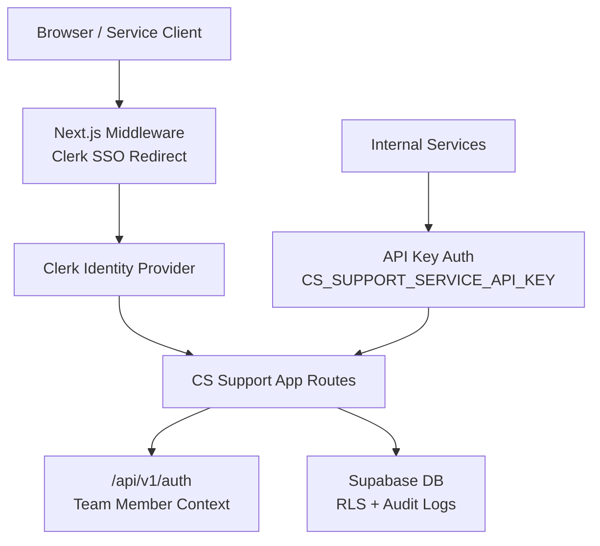
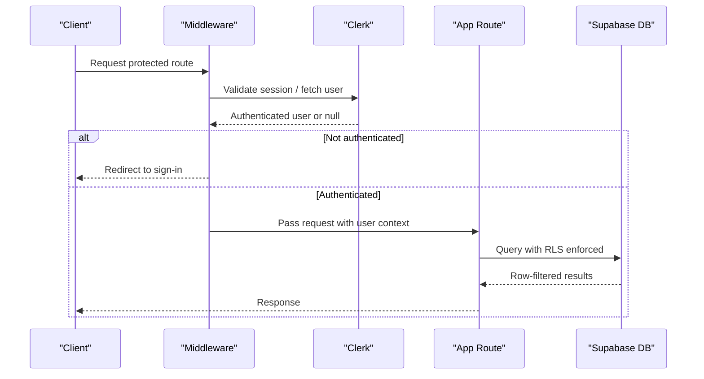
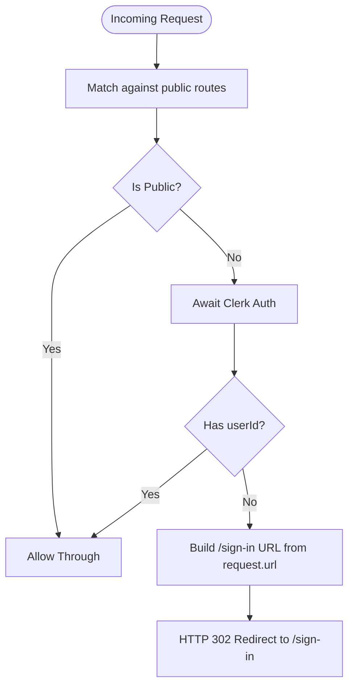
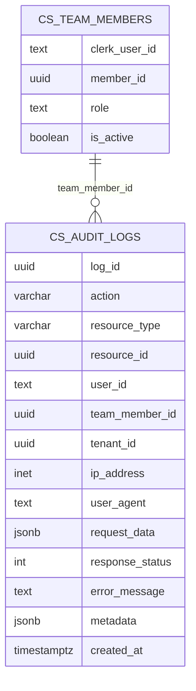
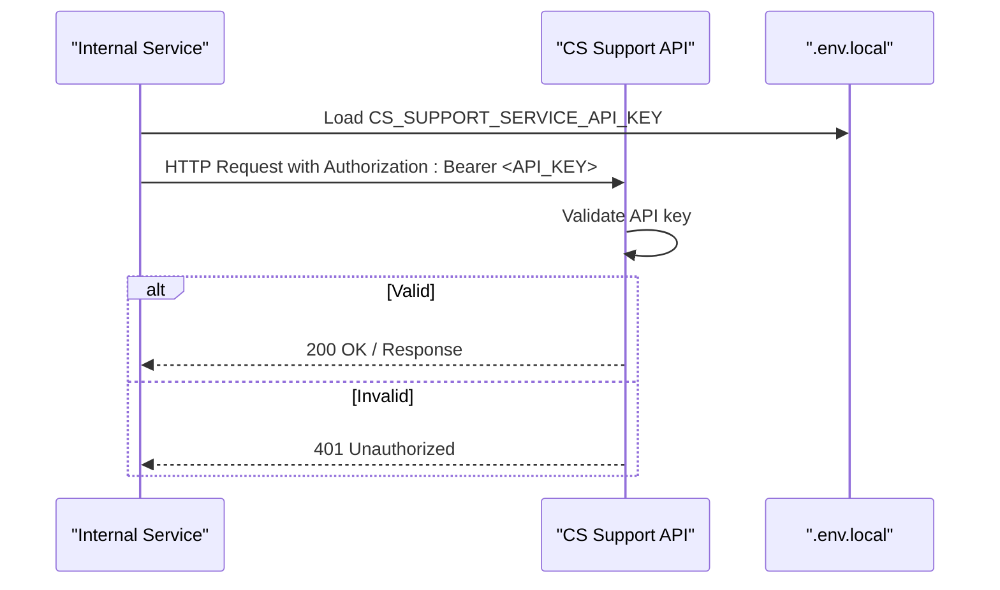
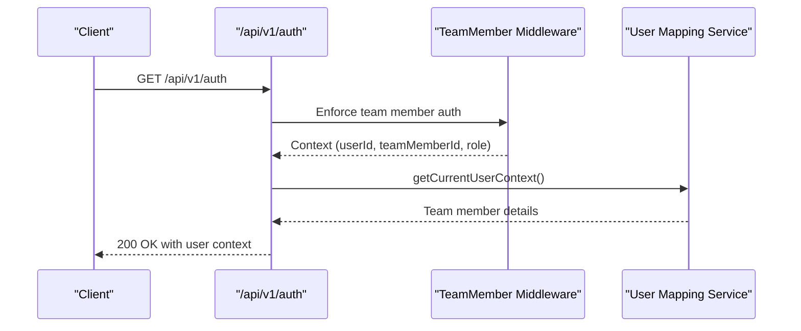
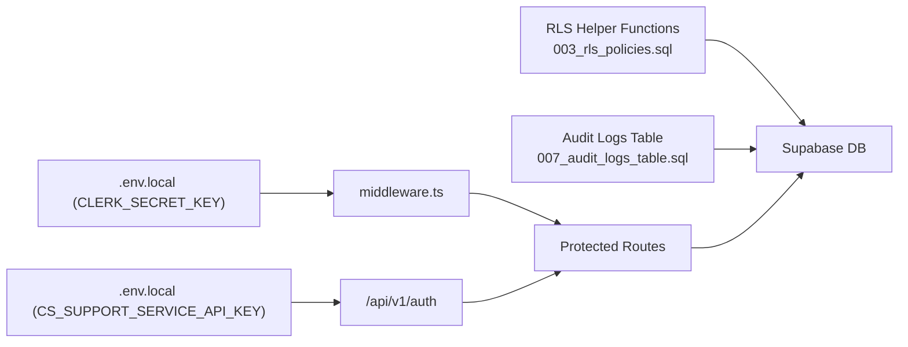

# Authentication & Security

<cite>
**Referenced Files in This Document**
- [middleware.ts](file://middleware.ts)
- [.env.local](file://.env.local)
- [003_rls_policies.sql](file://database/migrations/003_rls_policies.sql)
- [007_audit_logs_table.sql](file://database/migrations/007_audit_logs_table.sql)
- [route.ts](file://app/api/v1/auth/route.ts)
- [generate-cs-support-api-key.js](file://scripts/generate-cs-support-api-key.js)
</cite>

## Table of Contents
1. [Introduction](#introduction)
2. [Project Structure](#project-structure)
3. [Core Components](#core-components)
4. [Architecture Overview](#architecture-overview)
5. [Detailed Component Analysis](#detailed-component-analysis)
6. [Dependency Analysis](#dependency-analysis)
7. [Performance Considerations](#performance-considerations)
8. [Troubleshooting Guide](#troubleshooting-guide)
9. [Conclusion](#conclusion)
10. [Appendices](#appendices)

## Introduction
This document provides comprehensive authentication and security documentation for the CS Support Service. It covers the Clerk-based Single Sign-On (SSO) implementation, shared application architecture, and user session management. It also documents API key authentication for service-to-service communication, role-based access control (RBAC), and tenant isolation patterns. The middleware implementation for request validation, authentication checks, and authorization flows is explained, along with security best practices, token management, protections against common vulnerabilities, database security with Row Level Security (RLS) policies, audit logging, and data access patterns. Implementation examples for custom authentication flows and security middleware are included.

## Project Structure
The authentication and security model spans several layers:
- Edge middleware for global request authentication and redirection
- Clerk-managed SSO for user identity and sessions
- Supabase-backed database with RLS policies and audit logging
- Service-to-service API key authentication for internal integrations
- Dedicated authentication endpoint for retrieving current user context

**Diagram sources**
- [middleware.ts](file://middleware.ts#L1-L30)
- [.env.local](file://.env.local#L41-L75)
- [route.ts](file://app/api/v1/auth/route.ts#L1-L32)
- [003_rls_policies.sql](file://database/migrations/003_rls_policies.sql#L1-L708)
- [007_audit_logs_table.sql](file://database/migrations/007_audit_logs_table.sql#L1-L55)

**Section sources**
- [middleware.ts](file://middleware.ts#L1-L30)
- [.env.local](file://.env.local#L41-L75)
- [route.ts](file://app/api/v1/auth/route.ts#L1-L32)
- [003_rls_policies.sql](file://database/migrations/003_rls_policies.sql#L1-L708)
- [007_audit_logs_table.sql](file://database/migrations/007_audit_logs_table.sql#L1-L55)

## Core Components
- Clerk-based SSO middleware: Enforces authentication for protected routes and redirects unauthenticated users to the sign-in page.
- Supabase RLS: Implements tenant isolation and RBAC across all data tables.
- Audit logging: Captures sensitive operations with user, IP, and metadata for compliance and forensics.
- API key authentication: Secures inter-service communication with a strong, randomly generated key.
- Authentication endpoint: Returns current user’s team member context for frontend and backend authorization decisions.

**Section sources**
- [middleware.ts](file://middleware.ts#L14-L22)
- [003_rls_policies.sql](file://database/migrations/003_rls_policies.sql#L10-L128)
- [007_audit_logs_table.sql](file://database/migrations/007_audit_logs_table.sql#L6-L48)
- [.env.local](file://.env.local#L41-L75)
- [route.ts](file://app/api/v1/auth/route.ts#L10-L30)

## Architecture Overview
The authentication and authorization architecture integrates Clerk for identity, Supabase for data with RLS, and API keys for service-to-service trust boundaries. The middleware acts as a gatekeeper for web traffic, while the database enforces row-level tenant isolation and role-based access.

**Diagram sources**
- [middleware.ts](file://middleware.ts#L14-L22)
- [003_rls_policies.sql](file://database/migrations/003_rls_policies.sql#L134-L200)

## Detailed Component Analysis

### Clerk-based SSO Middleware
- Purpose: Protect application routes by ensuring a valid Clerk session exists. Public routes (sign-in, sign-up, home, help, test, webhooks, unsubscribe) are excluded.
- Behavior:
  - For non-public routes, the middleware awaits the Clerk auth object and checks for a present user identifier.
  - If missing, the user is redirected to the sign-in URL derived from the current request URL.
  - The middleware matcher excludes static assets and Next.js internals.
- Integration: Uses Clerk’s server-side middleware and route matcher utilities.

**Diagram sources**
- [middleware.ts](file://middleware.ts#L4-L22)

**Section sources**
- [middleware.ts](file://middleware.ts#L1-L30)

### Supabase RLS and Tenant Isolation
- Helper functions:
  - Retrieve current Clerk user ID from session variable or JWT claims.
  - Determine team membership and roles (e.g., admin, manager, CSM).
  - Set current Clerk user ID for RLS enforcement per-session.
- Policies:
  - Enable RLS on all relevant tables.
  - Team members can view/read-create-update; admins can delete.
  - Specialized policies for tickets/messages/conversations (tenant isolation), KB articles (public read), customer success metrics (CSM access), LLM agents and integrations (admin-only), and API keys (admin-only).
- Audit logging:
  - Dedicated table captures actions, resources, user/team/tenant identifiers, IP, user agent, sanitized request data, response status, error messages, and metadata.
  - RLS allows team members to view audit logs for their tenant.

**Diagram sources**
- [003_rls_policies.sql](file://database/migrations/003_rls_policies.sql#L10-L128)
- [007_audit_logs_table.sql](file://database/migrations/007_audit_logs_table.sql#L6-L48)

**Section sources**
- [003_rls_policies.sql](file://database/migrations/003_rls_policies.sql#L10-L128)
- [007_audit_logs_table.sql](file://database/migrations/007_audit_logs_table.sql#L6-L48)

### API Key Authentication for Service-to-Service Communication
- Purpose: Secure internal APIs by requiring a strong, randomly generated API key.
- Generation:
  - A Node.js script generates a 32-byte random key encoded as a 64-character hexadecimal string.
  - Outputs the key and instructions for adding it to environment files.
- Configuration:
  - The CS Support Service exposes a dedicated API key for inter-service trust.
  - Other services use the same key to authenticate requests to the CS Support Service.

**Diagram sources**
- [.env.local](file://.env.local#L41-L75)
- [generate-cs-support-api-key.js](file://scripts/generate-cs-support-api-key.js#L16-L18)

**Section sources**
- [.env.local](file://.env.local#L41-L75)
- [generate-cs-support-api-key.js](file://scripts/generate-cs-support-api-key.js#L1-L46)

### Authentication Endpoint for Current User Context
- Purpose: Provide the authenticated user’s team member context to the client and backend for authorization decisions.
- Behavior:
  - Requires a team member role via middleware wrapper.
  - Returns user ID, team member ID, role, and team member details (timezone, skills, limits).
  - Returns a 403 error if the user is not a team member.

**Diagram sources**
- [route.ts](file://app/api/v1/auth/route.ts#L10-L30)

**Section sources**
- [route.ts](file://app/api/v1/auth/route.ts#L1-L32)

### Security Middleware and Request Validation
- Global middleware:
  - Public route exclusion list includes sign-in/sign-up, home/help, test endpoints, webhooks, and unsubscribe.
  - Matcher ensures static assets and Next.js internals are ignored.
- Clerk integration:
  - Middleware validates sessions and redirects unauthorized users to sign-in.
- Best practices:
  - Keep public routes minimal.
  - Ensure cookies and redirects are configured securely.
  - Centralize redirect logic to avoid open redirects.

**Section sources**
- [middleware.ts](file://middleware.ts#L4-L28)

## Dependency Analysis
- Clerk SSO depends on environment variables for publishable and secret keys.
- Supabase RLS depends on helper functions and session variables to enforce policies.
- Audit logging depends on team membership to filter visibility.
- API key authentication depends on a single shared secret stored in environment variables.

**Diagram sources**
- [.env.local](file://.env.local#L150-L153)
- [.env.local](file://.env.local#L41-L75)
- [003_rls_policies.sql](file://database/migrations/003_rls_policies.sql#L10-L128)
- [007_audit_logs_table.sql](file://database/migrations/007_audit_logs_table.sql#L6-L48)
- [middleware.ts](file://middleware.ts#L1-L30)
- [route.ts](file://app/api/v1/auth/route.ts#L1-L32)

**Section sources**
- [.env.local](file://.env.local#L150-L153)
- [003_rls_policies.sql](file://database/migrations/003_rls_policies.sql#L10-L128)
- [007_audit_logs_table.sql](file://database/migrations/007_audit_logs_table.sql#L6-L48)
- [middleware.ts](file://middleware.ts#L1-L30)
- [route.ts](file://app/api/v1/auth/route.ts#L1-L32)

## Performance Considerations
- Middleware evaluation occurs early; keep route matchers precise to minimize overhead.
- RLS adds minimal overhead when policies are concise and indexes are present on filtered columns.
- Prefer indexed audit log columns for frequent queries (user_id, tenant_id, action, created_at).
- Avoid heavy computations in middleware; delegate to services and caches where appropriate.

## Troubleshooting Guide
- Users stuck on sign-in loop:
  - Verify Clerk environment variables and redirect URLs.
  - Confirm middleware matcher excludes static assets and Next.js internals.
- Unauthorized access to protected routes:
  - Ensure the user is signed in and the session is valid.
  - Check that the route is not mistakenly included in the public route list.
- RLS denies access unexpectedly:
  - Confirm the session variable for the current Clerk user ID is set before queries.
  - Verify team membership and role checks align with expectations.
- Audit logs not visible:
  - Ensure the user belongs to the same tenant as the logged events.
- API key failures:
  - Regenerate the key using the provided script and update all environment files consistently.

**Section sources**
- [middleware.ts](file://middleware.ts#L14-L22)
- [003_rls_policies.sql](file://database/migrations/003_rls_policies.sql#L120-L128)
- [007_audit_logs_table.sql](file://database/migrations/007_audit_logs_table.sql#L36-L44)
- [generate-cs-support-api-key.js](file://scripts/generate-cs-support-api-key.js#L24-L43)

## Conclusion
The CS Support Service employs a layered security model: Clerk-managed SSO for identity, Supabase RLS for tenant isolation and RBAC, comprehensive audit logging, and robust API key authentication for internal services. The middleware enforces global authentication and redirection, while dedicated endpoints and database policies ensure least-privilege access and traceability. Adhering to the best practices outlined here will help maintain a secure and scalable authentication and authorization framework.

## Appendices

### Security Best Practices
- Secrets management:
  - Store secrets in environment variables; never commit to version control.
  - Rotate API keys and Clerk keys periodically; use vaults for production.
- Tokens and sessions:
  - Configure secure cookie settings and strict SameSite attributes.
  - Enforce HTTPS and secure headers.
- Input validation and sanitization:
  - Sanitize and validate all inputs; avoid exposing sensitive data in audit logs.
- Least privilege:
  - Use RLS policies and role checks to limit access.
  - Restrict administrative capabilities to trusted roles only.
- Monitoring and alerting:
  - Monitor unauthorized access attempts and policy violations.
  - Review audit logs regularly for anomalies.

### Token Management
- Clerk tokens:
  - Use Clerk’s built-in session management; avoid storing raw tokens client-side unnecessarily.
- API keys:
  - Generate keys with cryptographically secure randomness.
  - Distribute keys only to trusted services and rotate them on compromise.

### Protection Against Common Vulnerabilities
- Injection:
  - Use parameterized queries and avoid dynamic SQL.
- Misconfiguration:
  - Keep RLS enabled and policies up to date.
- Exposure:
  - Limit exposure of internal endpoints; rely on API keys for service-to-service calls.
- Replay and CSRF:
  - Use CSRF tokens for form submissions; validate origins and referrers where applicable.

### Database Security Patterns
- Tenant isolation:
  - Enforce tenant filtering in RLS policies and application code.
- Audit trail:
  - Capture actions with sanitized request data and error messages.
- Indexing:
  - Index audit log columns frequently queried for performance.

### Implementation Examples
- Custom authentication flow:
  - Extend middleware to integrate additional identity providers while preserving Clerk session validation.
  - Ensure the current Clerk user ID is set in the session before database queries.
- Security middleware:
  - Add request validation and rate limiting in middleware for public endpoints.
  - Centralize redirect logic and enforce canonical URLs.

**Section sources**
- [003_rls_policies.sql](file://database/migrations/003_rls_policies.sql#L10-L128)
- [007_audit_logs_table.sql](file://database/migrations/007_audit_logs_table.sql#L6-L48)
- [generate-cs-support-api-key.js](file://scripts/generate-cs-support-api-key.js#L16-L18)
- [.env.local](file://.env.local#L41-L75)