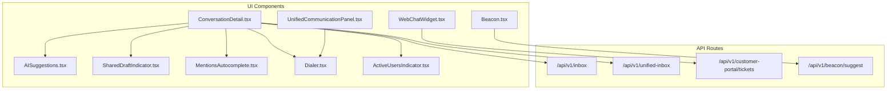
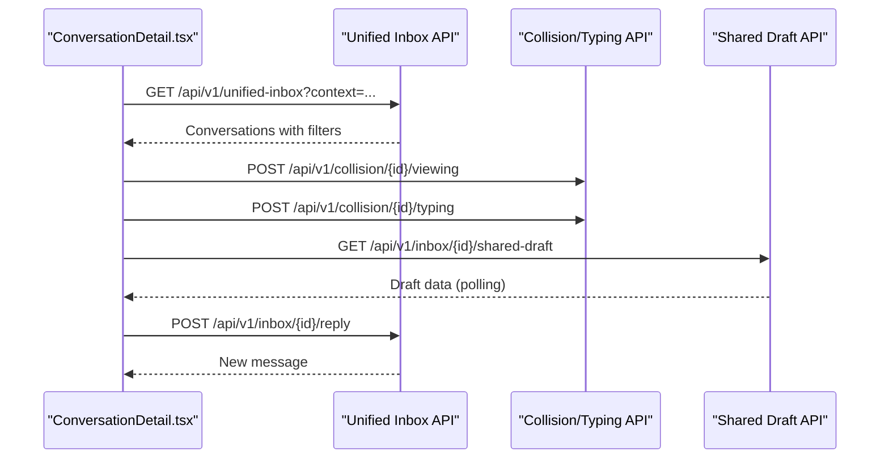
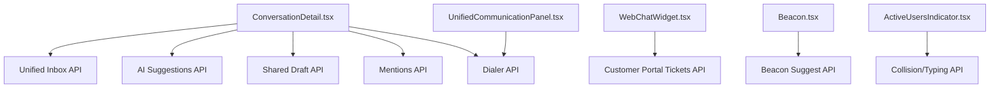

# Customer Support Features

<cite>
**Referenced Files in This Document**
- [app/api/v1/inbox/route.ts](file://app/api/v1/inbox/route.ts)
- [app/api/v1/unified-inbox/route.ts](file://app/api/v1/unified-inbox/route.ts)
- [app/api/v1/customer-portal/tickets]/route.ts](file://app/api/v1/customer-portal/tickets]/route.ts)
- [components/inbox/ConversationDetail.tsx](file://components/inbox/ConversationDetail.tsx)
- [components/unified-inbox/UnifiedCommunicationPanel.tsx](file://components/unified-inbox/UnifiedCommunicationPanel.tsx)
- [components/inbox/AISuggestions.tsx](file://components/inbox/AISuggestions.tsx)
- [components/inbox/SharedDraftIndicator.tsx](file://components/inbox/SharedDraftIndicator.tsx)
- [components/inbox/MentionsAutocomplete.tsx](file://components/inbox/MentionsAutocomplete.tsx)
- [components/inbox/Dialer.tsx](file://components/inbox/Dialer.tsx)
- [components/customer-portal/WebChatWidget.tsx](file://components/customer-portal/WebChatWidget.tsx)
- [components/customer-portal/Beacon.tsx](file://components/customer-portal/Beacon.tsx)
- [components/unified-inbox/ActiveUsersIndicator.tsx](file://components/unified-inbox/ActiveUsersIndicator.tsx)
- [app/api/v1/beacon/suggest]/route.ts](file://app/api/v1/beacon/suggest]/route.ts)
</cite>

## Table of Contents
1. [Introduction](#introduction)
2. [Project Structure](#project-structure)
3. [Core Components](#core-components)
4. [Architecture Overview](#architecture-overview)
5. [Detailed Component Analysis](#detailed-component-analysis)
6. [Dependency Analysis](#dependency-analysis)
7. [Performance Considerations](#performance-considerations)
8. [Troubleshooting Guide](#troubleshooting-guide)
9. [Conclusion](#conclusion)

## Introduction
This document explains the customer support features implemented in the system, focusing on:
- Unified inbox and conversation management
- Customer portal integration (web chat, knowledge base beacon, and portal ticket submission)
- Multi-channel communication (email, SMS, voice, chat)
- AI-powered conversation suggestions and triage
- Shared draft functionality and collaboration aids (mentions, typing indicators)
- Dialer integration for voice calls
- Real-time updates, attachment handling, and conversation threading
- Usage examples and configuration options for each feature
- Troubleshooting guidance for common support scenarios

## Project Structure
The customer support system is organized around:
- API routes under app/api/v1 for backend endpoints
- UI components under components for frontend features
- Real-time collaboration and unified communication panels
- Customer portal widgets for engagement and self-service

**Diagram sources**
- [components/inbox/ConversationDetail.tsx](file://components/inbox/ConversationDetail.tsx#L92-L120)
- [components/unified-inbox/UnifiedCommunicationPanel.tsx](file://components/unified-inbox/UnifiedCommunicationPanel.tsx#L24-L90)
- [components/inbox/AISuggestions.tsx](file://components/inbox/AISuggestions.tsx#L30-L66)
- [components/inbox/SharedDraftIndicator.tsx](file://components/inbox/SharedDraftIndicator.tsx#L31-L84)
- [components/inbox/MentionsAutocomplete.tsx](file://components/inbox/MentionsAutocomplete.tsx#L23-L111)
- [components/inbox/Dialer.tsx](file://components/inbox/Dialer.tsx#L20-L94)
- [components/customer-portal/WebChatWidget.tsx](file://components/customer-portal/WebChatWidget.tsx#L39-L153)
- [components/customer-portal/Beacon.tsx](file://components/customer-portal/Beacon.tsx#L30-L86)
- [components/unified-inbox/ActiveUsersIndicator.tsx](file://components/unified-inbox/ActiveUsersIndicator.tsx#L27-L49)
- [app/api/v1/inbox/route.ts](file://app/api/v1/inbox/route.ts#L13-L94)
- [app/api/v1/unified-inbox/route.ts](file://app/api/v1/unified-inbox/route.ts#L12-L50)
- [app/api/v1/customer-portal/tickets]/route.ts](file://app/api/v1/customer-portal/tickets]/route.ts#L12-L72)
- [app/api/v1/beacon/suggest]/route.ts](file://app/api/v1/beacon/suggest]/route.ts#L11-L27)

**Section sources**
- [components/inbox/ConversationDetail.tsx](file://components/inbox/ConversationDetail.tsx#L92-L120)
- [components/unified-inbox/UnifiedCommunicationPanel.tsx](file://components/unified-inbox/UnifiedCommunicationPanel.tsx#L24-L90)
- [components/inbox/AISuggestions.tsx](file://components/inbox/AISuggestions.tsx#L30-L66)
- [components/inbox/SharedDraftIndicator.tsx](file://components/inbox/SharedDraftIndicator.tsx#L31-L84)
- [components/inbox/MentionsAutocomplete.tsx](file://components/inbox/MentionsAutocomplete.tsx#L23-L111)
- [components/inbox/Dialer.tsx](file://components/inbox/Dialer.tsx#L20-L94)
- [components/customer-portal/WebChatWidget.tsx](file://components/customer-portal/WebChatWidget.tsx#L39-L153)
- [components/customer-portal/Beacon.tsx](file://components/customer-portal/Beacon.tsx#L30-L86)
- [components/unified-inbox/ActiveUsersIndicator.tsx](file://components/unified-inbox/ActiveUsersIndicator.tsx#L27-L49)
- [app/api/v1/inbox/route.ts](file://app/api/v1/inbox/route.ts#L13-L94)
- [app/api/v1/unified-inbox/route.ts](file://app/api/v1/unified-inbox/route.ts#L12-L50)
- [app/api/v1/customer-portal/tickets]/route.ts](file://app/api/v1/customer-portal/tickets]/route.ts#L12-L72)
- [app/api/v1/beacon/suggest]/route.ts](file://app/api/v1/beacon/suggest]/route.ts#L11-L27)

## Core Components
- Unified Inbox API: Retrieves conversations filtered by context, channel, status, assignment, search, and tags.
- Conversation Detail View: Loads a single conversation, renders messages, handles replies, attachments, AI suggestions, shared drafts, mentions, and collaboration indicators.
- Unified Communication Panel: Provides integrated dialer, web chat, and voice controls within a conversation.
- AI Suggestions: Triggers AI triage and suggests responses with confidence and related knowledge base articles.
- Shared Draft Indicator: Manages collaborative drafts with real-time synchronization and versioning.
- Mentions Autocomplete: Enables mentioning team members with keyboard navigation and insertion.
- Dialer: Initiates voice calls, sends SMS, and emails directly from the conversation view.
- WebChat Widget: Customer-facing live chat with optional voice mode and callback requests.
- Beacon: Knowledge base widget offering contextual suggestions and search.
- Active Users Indicator: Shows who is viewing, typing, or editing a conversation.

**Section sources**
- [app/api/v1/unified-inbox/route.ts](file://app/api/v1/unified-inbox/route.ts#L12-L50)
- [components/inbox/ConversationDetail.tsx](file://components/inbox/ConversationDetail.tsx#L92-L120)
- [components/unified-inbox/UnifiedCommunicationPanel.tsx](file://components/unified-inbox/UnifiedCommunicationPanel.tsx#L24-L90)
- [components/inbox/AISuggestions.tsx](file://components/inbox/AISuggestions.tsx#L30-L66)
- [components/inbox/SharedDraftIndicator.tsx](file://components/inbox/SharedDraftIndicator.tsx#L31-L84)
- [components/inbox/MentionsAutocomplete.tsx](file://components/inbox/MentionsAutocomplete.tsx#L23-L111)
- [components/inbox/Dialer.tsx](file://components/inbox/Dialer.tsx#L20-L94)
- [components/customer-portal/WebChatWidget.tsx](file://components/customer-portal/WebChatWidget.tsx#L39-L153)
- [components/customer-portal/Beacon.tsx](file://components/customer-portal/Beacon.tsx#L30-L86)
- [components/unified-inbox/ActiveUsersIndicator.tsx](file://components/unified-inbox/ActiveUsersIndicator.tsx#L27-L49)

## Architecture Overview
The system integrates UI components with backend APIs to provide a unified, multi-channel support experience. Real-time collaboration is achieved through periodic polling and optimistic UI updates.

**Diagram sources**
- [components/inbox/ConversationDetail.tsx](file://components/inbox/ConversationDetail.tsx#L122-L142)
- [components/inbox/ConversationDetail.tsx](file://components/inbox/ConversationDetail.tsx#L174-L187)
- [components/inbox/ConversationDetail.tsx](file://components/inbox/ConversationDetail.tsx#L257-L273)
- [app/api/v1/unified-inbox/route.ts](file://app/api/v1/unified-inbox/route.ts#L29-L43)

## Detailed Component Analysis

### Unified Inbox and Conversation Management
- Endpoint: GET /api/v1/unified-inbox
- Filters: context, channel, status, assigned_to, search, tags
- Pagination: page, limit
- Returns: paginated conversations with ticket metadata and previews

Usage example:
- Retrieve open email conversations assigned to the current agent with pagination.

Configuration options:
- context: cs or other contexts
- channel: email, sms, call, chat, facebook, form
- status: open, in_progress, pending, resolved, closed
- assigned_to: unassigned, me, or team member ID
- search: free-text search across customer, subject, and last message
- tags: comma-separated list

**Section sources**
- [app/api/v1/unified-inbox/route.ts](file://app/api/v1/unified-inbox/route.ts#L12-L50)

### Conversation Detail View
- Loads conversation, ticket, and messages
- Optimistic reply submission with immediate UI update and server reconciliation
- Attachment upload handling
- AI suggestions for the last customer message
- Shared draft indicator with polling
- Mentions autocomplete for tagging team members
- Dialer integration for voice/SMS/email
- Active users indicator for collaboration

Real-time updates:
- Viewing status posted periodically while viewing
- Typing status posted when user starts typing
- Shared draft polled every 3 seconds
- Active users polled every 3 seconds

Conversation threading:
- Messages rendered in order with sender distinction
- Internal notes marked separately
- Attachments linked per message

**Section sources**
- [components/inbox/ConversationDetail.tsx](file://components/inbox/ConversationDetail.tsx#L92-L120)
- [components/inbox/ConversationDetail.tsx](file://components/inbox/ConversationDetail.tsx#L122-L142)
- [components/inbox/ConversationDetail.tsx](file://components/inbox/ConversationDetail.tsx#L174-L187)
- [components/inbox/ConversationDetail.tsx](file://components/inbox/ConversationDetail.tsx#L226-L304)
- [components/inbox/ConversationDetail.tsx](file://components/inbox/ConversationDetail.tsx#L524-L595)

### Unified Communication Panel
- Dialer tab: initiate voice calls
- WebChat tab: real-time chat with polling every 3 seconds
- Voice tab: placeholder for voice call integration

WebChat panel:
- Fetches messages on mount and polls every 3 seconds
- Sends messages with agent identity
- Displays timestamps and agent/customer differentiation

**Section sources**
- [components/unified-inbox/UnifiedCommunicationPanel.tsx](file://components/unified-inbox/UnifiedCommunicationPanel.tsx#L24-L90)
- [components/unified-inbox/UnifiedCommunicationPanel.tsx](file://components/unified-inbox/UnifiedCommunicationPanel.tsx#L96-L189)

### AI-Powered Conversation Suggestions
- Triggers AI triage and response generation
- Displays confidence, category, priority, sentiment, suggested tags, and requires-human-review flag
- Shows related knowledge base articles

Usage example:
- After loading a conversation, click refresh to analyze the latest customer message and receive suggestions.

**Section sources**
- [components/inbox/AISuggestions.tsx](file://components/inbox/AISuggestions.tsx#L30-L66)
- [components/inbox/AISuggestions.tsx](file://components/inbox/AISuggestions.tsx#L145-L191)

### Shared Draft Functionality
- Creates, loads, and discards shared drafts
- Polls for updates every 3 seconds
- Updates UI only when version changes
- Supports team-wide sharing and editable-by-all settings

Usage example:
- While composing a reply, save a shared draft visible to teammates; another agent can load it later.

**Section sources**
- [components/inbox/SharedDraftIndicator.tsx](file://components/inbox/SharedDraftIndicator.tsx#L31-L84)
- [components/inbox/SharedDraftIndicator.tsx](file://components/inbox/SharedDraftIndicator.tsx#L86-L116)

### Collaboration Features: Mentions and Typing Indicators
- Mentions autocomplete: detect @, filter members, keyboard navigation, insert mention
- Typing indicators: periodic POST to mark typing; active users polling shows who is viewing/typing/editing

Usage example:
- Type @ in the reply box to mention a teammate; see active users in the conversation header.

**Section sources**
- [components/inbox/MentionsAutocomplete.tsx](file://components/inbox/MentionsAutocomplete.tsx#L23-L111)
- [components/inbox/ConversationDetail.tsx](file://components/inbox/ConversationDetail.tsx#L133-L142)
- [components/unified-inbox/ActiveUsersIndicator.tsx](file://components/unified-inbox/ActiveUsersIndicator.tsx#L27-L49)

### Dialer Integration for Voice Calls
- Initiates outbound calls with recording and notes
- Sends SMS and emails from the conversation view
- Validates phone numbers and enforces required fields

Usage example:
- Enter a 10-digit phone number, add call notes, and click Initiate Call.

**Section sources**
- [components/inbox/Dialer.tsx](file://components/inbox/Dialer.tsx#L20-L94)
- [components/inbox/Dialer.tsx](file://components/inbox/Dialer.tsx#L96-L138)
- [components/inbox/Dialer.tsx](file://components/inbox/Dialer.tsx#L140-L184)

### Customer Portal Chat Widgets
- WebChatWidget: floating or inline chat with engagement options, voice mode, callback requests
- Beacon: knowledge base suggestions and search, with session creation and article retrieval

Usage example:
- Embed Beacon in a page; users can switch between suggestions and search tabs.

**Section sources**
- [components/customer-portal/WebChatWidget.tsx](file://components/customer-portal/WebChatWidget.tsx#L39-L153)
- [components/customer-portal/WebChatWidget.tsx](file://components/customer-portal/WebChatWidget.tsx#L155-L174)
- [components/customer-portal/WebChatWidget.tsx](file://components/customer-portal/WebChatWidget.tsx#L281-L326)
- [components/customer-portal/Beacon.tsx](file://components/customer-portal/Beacon.tsx#L30-L86)
- [components/customer-portal/Beacon.tsx](file://components/customer-portal/Beacon.tsx#L115-L146)

### Beacon-Based Customer Engagement
- Contextual suggestions via POST /api/v1/beacon/suggest
- Session creation for tracking user context
- Article search and selection

Usage example:
- Create a session on page load; fetch suggestions based on page URL and title.

**Section sources**
- [components/customer-portal/Beacon.tsx](file://components/customer-portal/Beacon.tsx#L66-L86)
- [components/customer-portal/Beacon.tsx](file://components/customer-portal/Beacon.tsx#L88-L113)
- [app/api/v1/beacon/suggest]/route.ts](file://app/api/v1/beacon/suggest]/route.ts#L11-L27)

### Attachment Handling and Conversation Threading
- Attachments stored per message and rendered as links
- Threaded messages ordered chronologically
- Internal notes flagged distinctly

**Section sources**
- [components/inbox/ConversationDetail.tsx](file://components/inbox/ConversationDetail.tsx#L574-L589)
- [components/inbox/ConversationDetail.tsx](file://components/inbox/ConversationDetail.tsx#L524-L595)

## Dependency Analysis

**Diagram sources**
- [components/inbox/ConversationDetail.tsx](file://components/inbox/ConversationDetail.tsx#L122-L142)
- [components/inbox/ConversationDetail.tsx](file://components/inbox/ConversationDetail.tsx#L174-L187)
- [components/unified-inbox/UnifiedCommunicationPanel.tsx](file://components/unified-inbox/UnifiedCommunicationPanel.tsx#L74-L80)
- [components/customer-portal/WebChatWidget.tsx](file://components/customer-portal/WebChatWidget.tsx#L124-L153)
- [components/customer-portal/Beacon.tsx](file://components/customer-portal/Beacon.tsx#L66-L86)
- [components/unified-inbox/ActiveUsersIndicator.tsx](file://components/unified-inbox/ActiveUsersIndicator.tsx#L33-L39)
- [app/api/v1/unified-inbox/route.ts](file://app/api/v1/unified-inbox/route.ts#L29-L43)
- [app/api/v1/beacon/suggest]/route.ts](file://app/api/v1/beacon/suggest]/route.ts#L11-L27)

**Section sources**
- [components/inbox/ConversationDetail.tsx](file://components/inbox/ConversationDetail.tsx#L122-L142)
- [components/inbox/ConversationDetail.tsx](file://components/inbox/ConversationDetail.tsx#L174-L187)
- [components/unified-inbox/UnifiedCommunicationPanel.tsx](file://components/unified-inbox/UnifiedCommunicationPanel.tsx#L74-L80)
- [components/customer-portal/WebChatWidget.tsx](file://components/customer-portal/WebChatWidget.tsx#L124-L153)
- [components/customer-portal/Beacon.tsx](file://components/customer-portal/Beacon.tsx#L66-L86)
- [components/unified-inbox/ActiveUsersIndicator.tsx](file://components/unified-inbox/ActiveUsersIndicator.tsx#L33-L39)
- [app/api/v1/unified-inbox/route.ts](file://app/api/v1/unified-inbox/route.ts#L29-L43)
- [app/api/v1/beacon/suggest]/route.ts](file://app/api/v1/beacon/suggest]/route.ts#L11-L27)

## Performance Considerations
- Polling intervals: 3 seconds for real-time features (active users, shared drafts, webchat messages) to balance responsiveness and load.
- Optimistic UI updates: Immediate reply rendering reduces perceived latency; server responses reconcile state.
- Pagination: Unified inbox supports pagination to avoid large payloads.
- Debounced search: Beacon search debounced by 300 ms to reduce API calls during typing.

[No sources needed since this section provides general guidance]

## Troubleshooting Guide
Common issues and resolutions:
- AI suggestions not loading
  - Ensure the latest customer message exists and the AI triage endpoint is reachable.
  - Check network tab for 5xx responses from AI endpoints.
  - Retry by clicking Refresh.

- Shared draft not syncing
  - Confirm conversation ID is present and draft endpoint responds.
  - Verify version increments when others edit; polling updates only on change.

- Mentions autocomplete not working
  - Type @ and ensure a space or newline precedes the mention.
  - Use arrow keys and Enter to select a suggestion.

- Dialer errors
  - Validate phone number format (10 digits).
  - Check required fields for SMS/email before sending.

- WebChat widget not receiving messages
  - Confirm session created and conversation ID present.
  - Verify polling is active (every 3 seconds).

- Beacon suggestions missing
  - Ensure session created and context includes page URL/title.
  - Try search with a query to trigger results.

**Section sources**
- [components/inbox/AISuggestions.tsx](file://components/inbox/AISuggestions.tsx#L108-L112)
- [components/inbox/SharedDraftIndicator.tsx](file://components/inbox/SharedDraftIndicator.tsx#L55-L84)
- [components/inbox/MentionsAutocomplete.tsx](file://components/inbox/MentionsAutocomplete.tsx#L114-L132)
- [components/inbox/Dialer.tsx](file://components/inbox/Dialer.tsx#L54-L94)
- [components/unified-inbox/UnifiedCommunicationPanel.tsx](file://components/unified-inbox/UnifiedCommunicationPanel.tsx#L116-L120)
- [components/customer-portal/Beacon.tsx](file://components/customer-portal/Beacon.tsx#L66-L86)

## Conclusion
The customer support system provides a unified, multi-channel experience with robust collaboration features. Real-time indicators, AI assistance, shared drafts, and integrated dialer enhance agent productivity. Customer portal widgets improve self-service and engagement. The modular component and API design enables easy extension and maintenance.

[No sources needed since this section summarizes without analyzing specific files]