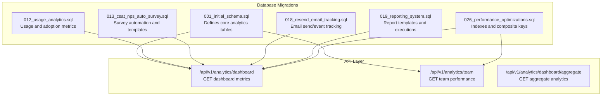
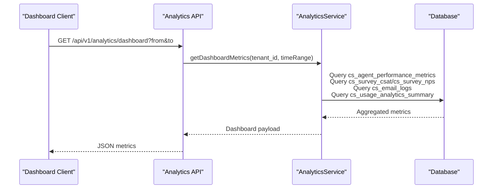
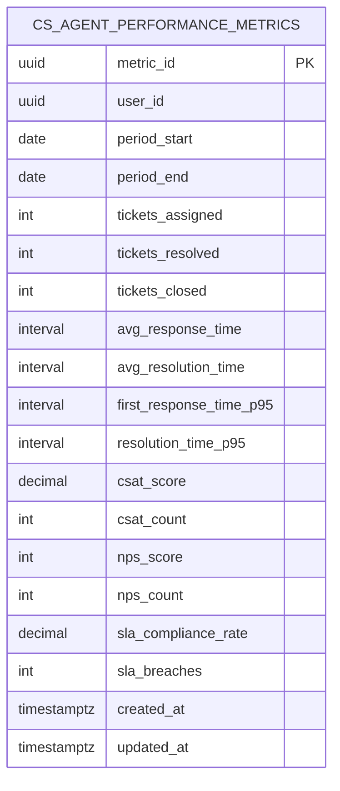
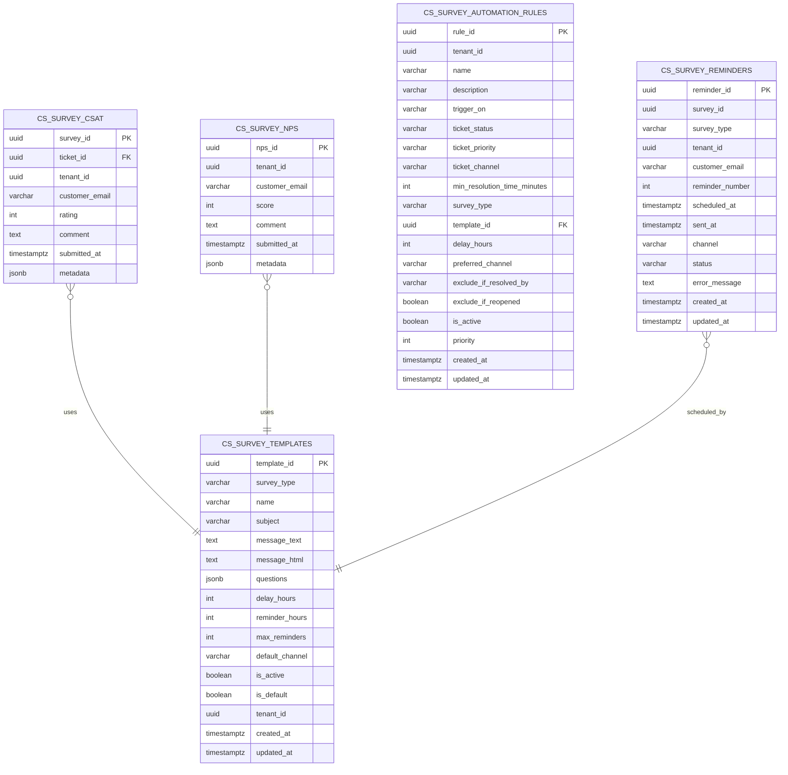
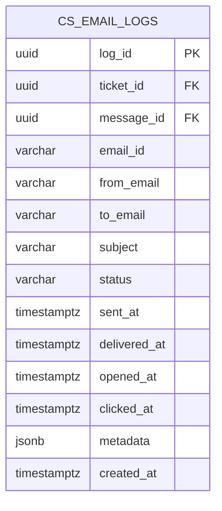
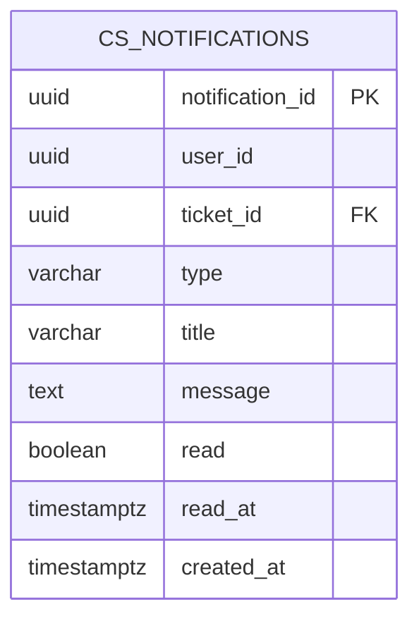
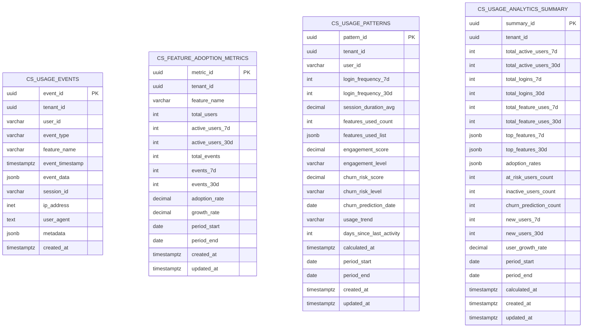
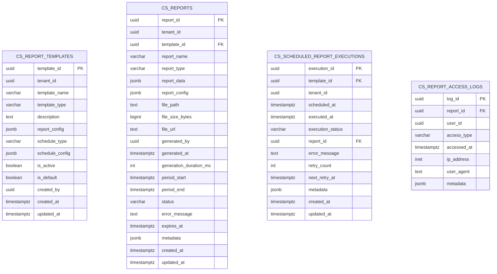
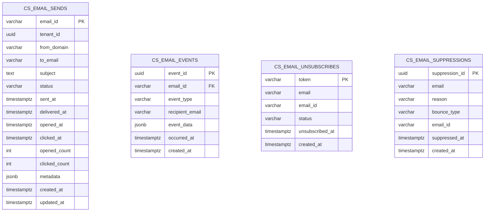
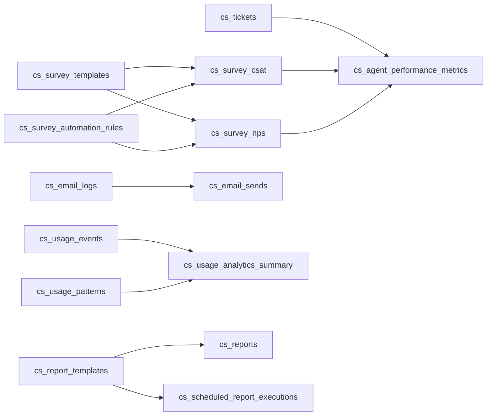

# Analytics & Performance Schema

<cite>
**Referenced Files in This Document**
- [001_initial_schema.sql](file://database/migrations/001_initial_schema.sql)
- [012_usage_analytics.sql](file://database/migrations/012_usage_analytics.sql)
- [013_csat_nps_auto_survey.sql](file://database/migrations/013_csat_nps_auto_survey.sql)
- [018_resend_email_tracking.sql](file://database/migrations/018_resend_email_tracking.sql)
- [019_reporting_system.sql](file://database/migrations/019_reporting_system.sql)
- [026_performance_optimizations.sql](file://database/migrations/026_performance_optimizations.sql)
- [route.ts](file://app/api/v1/analytics/dashboard/aggregate/route.ts)
- [route.ts](file://app/api/v1/analytics/team/route.ts)
- [route.ts](file://app/api/v1/analytics/dashboard/route.ts)
- [types/database.ts](file://types/database.ts)
</cite>

## Table of Contents
1. [Introduction](#introduction)
2. [Project Structure](#project-structure)
3. [Core Components](#core-components)
4. [Architecture Overview](#architecture-overview)
5. [Detailed Component Analysis](#detailed-component-analysis)
6. [Dependency Analysis](#dependency-analysis)
7. [Performance Considerations](#performance-considerations)
8. [Troubleshooting Guide](#troubleshooting-guide)
9. [Conclusion](#conclusion)
10. [Appendices](#appendices)

## Introduction
This document describes the analytics and performance tracking schema used by the customer support platform. It focuses on:
- Period-based agent performance metrics
- Response time tracking and SLA compliance
- Customer satisfaction (CSAT) and promoter scoring (NPS)
- Email delivery tracking and engagement
- Team alerting and collaboration notifications
- Performance optimization via specialized indexes and time-series patterns
- Example dashboards, SLA reporting, and satisfaction analytics queries

## Project Structure
The analytics schema is primarily defined in database migration files and surfaced via API endpoints:
- Core tables are defined in the initial schema and subsequent migrations
- Indexes and triggers optimize query performance and maintain audit fields
- API routes expose analytics data for dashboards and reports

**Diagram sources**
- [001_initial_schema.sql](file://database/migrations/001_initial_schema.sql#L94-L152)
- [012_usage_analytics.sql](file://database/migrations/012_usage_analytics.sql#L27-L128)
- [013_csat_nps_auto_survey.sql](file://database/migrations/013_csat_nps_auto_survey.sql#L41-L193)
- [018_resend_email_tracking.sql](file://database/migrations/018_resend_email_tracking.sql#L7-L109)
- [019_reporting_system.sql](file://database/migrations/019_reporting_system.sql#L9-L290)
- [026_performance_optimizations.sql](file://database/migrations/026_performance_optimizations.sql#L1-L122)
- [route.ts](file://app/api/v1/analytics/dashboard/route.ts#L17-L51)
- [route.ts](file://app/api/v1/analytics/team/route.ts#L10-L43)
- [route.ts](file://app/api/v1/analytics/dashboard/aggregate/route.ts)

**Section sources**
- [001_initial_schema.sql](file://database/migrations/001_initial_schema.sql#L1-L398)
- [012_usage_analytics.sql](file://database/migrations/012_usage_analytics.sql#L1-L216)
- [013_csat_nps_auto_survey.sql](file://database/migrations/013_csat_nps_auto_survey.sql#L1-L283)
- [018_resend_email_tracking.sql](file://database/migrations/018_resend_email_tracking.sql#L1-L109)
- [019_reporting_system.sql](file://database/migrations/019_reporting_system.sql#L1-L290)
- [026_performance_optimizations.sql](file://database/migrations/026_performance_optimizations.sql#L1-L122)
- [route.ts](file://app/api/v1/analytics/dashboard/route.ts#L1-L52)
- [route.ts](file://app/api/v1/analytics/team/route.ts#L1-L44)
- [route.ts](file://app/api/v1/analytics/dashboard/aggregate/route.ts)

## Core Components
- cs_agent_performance_metrics: Period-based KPIs for agents including tickets handled, response/resolution times, CSAT/NPS, SLA compliance, and percentiles
- cs_survey_csat and cs_survey_nps: Feedback collections with submission timestamps and optional comments
- cs_email_logs: Email delivery lifecycle tracking integrated with external provider identifiers
- cs_notifications: Team alerts and collaboration signals
- Supporting analytics tables: cs_usage_events, cs_feature_adoption_metrics, cs_usage_patterns, cs_usage_analytics_summary for feature adoption and churn analytics
- Reporting system: cs_report_templates, cs_reports, cs_scheduled_report_executions, cs_report_access_logs for scheduled and on-demand reporting
- Email tracking tables: cs_email_sends, cs_email_events, cs_email_unsubscribes, cs_email_suppressions for provider event tracking and suppression lists

**Section sources**
- [001_initial_schema.sql](file://database/migrations/001_initial_schema.sql#L94-L152)
- [012_usage_analytics.sql](file://database/migrations/012_usage_analytics.sql#L7-L128)
- [013_csat_nps_auto_survey.sql](file://database/migrations/013_csat_nps_auto_survey.sql#L41-L193)
- [018_resend_email_tracking.sql](file://database/migrations/018_resend_email_tracking.sql#L7-L109)
- [019_reporting_system.sql](file://database/migrations/019_reporting_system.sql#L9-L290)

## Architecture Overview
The analytics pipeline integrates data capture, aggregation, and presentation:
- Data capture: cs_usage_events, cs_email_logs, cs_survey_csat/nps, cs_notifications
- Aggregation: cs_feature_adoption_metrics, cs_usage_patterns, cs_usage_analytics_summary, cs_agent_performance_metrics
- Presentation: API endpoints serving dashboard and team performance metrics
- Reporting: cs_report_templates and cs_reports for scheduled and ad-hoc reports

**Diagram sources**
- [route.ts](file://app/api/v1/analytics/dashboard/route.ts#L17-L51)
- [001_initial_schema.sql](file://database/migrations/001_initial_schema.sql#L94-L152)
- [012_usage_analytics.sql](file://database/migrations/012_usage_analytics.sql#L92-L128)
- [013_csat_nps_auto_survey.sql](file://database/migrations/013_csat_nps_auto_survey.sql#L75-L101)
- [018_resend_email_tracking.sql](file://database/migrations/018_resend_email_tracking.sql#L7-L32)

## Detailed Component Analysis

### cs_agent_performance_metrics
Purpose:
- Capture period-based agent performance including counts, averages, and percentiles for response and resolution times, CSAT/NPS, and SLA compliance.

Key fields:
- period_start, period_end: Defines the aggregation window
- tickets_assigned, tickets_resolved, tickets_closed
- avg_response_time, avg_resolution_time, first_response_time_p95, resolution_time_p95
- csat_score, csat_count, nps_score, nps_count
- sla_compliance_rate, sla_breaches

Processing logic:
- Aggregations are computed over defined periods and stored for reporting
- Unique constraint ensures one row per agent per period

**Diagram sources**
- [001_initial_schema.sql](file://database/migrations/001_initial_schema.sql#L94-L115)

**Section sources**
- [001_initial_schema.sql](file://database/migrations/001_initial_schema.sql#L94-L115)
- [026_performance_optimizations.sql](file://database/migrations/026_performance_optimizations.sql#L78-L81)

### cs_survey_csat and cs_survey_nps
Purpose:
- Collect customer feedback post-interaction for satisfaction and promoter scoring.

Structure:
- cs_survey_csat: ticket_id, tenant_id, customer_email, rating (1–5), comment, submitted_at, metadata
- cs_survey_nps: tenant_id, customer_email, score (0–10), comment, submitted_at, metadata

Automation:
- cs_survey_templates define survey content and timing
- cs_survey_automation_rules define conditions to trigger surveys
- cs_survey_reminders schedule follow-ups

**Diagram sources**
- [013_csat_nps_auto_survey.sql](file://database/migrations/013_csat_nps_auto_survey.sql#L41-L157)

**Section sources**
- [013_csat_nps_auto_survey.sql](file://database/migrations/013_csat_nps_auto_survey.sql#L41-L193)
- [001_initial_schema.sql](file://database/migrations/001_initial_schema.sql#L231-L254)

### cs_email_logs
Purpose:
- Track email delivery lifecycle and engagement for outbound communications.

Fields:
- ticket_id, message_id, email_id (external provider ID), from_email, to_email, subject, status
- sent_at, delivered_at, opened_at, clicked_at
- metadata, created_at

Integration:
- Linked to cs_tickets and cs_messages for context
- Supports external provider event correlation via email_id

**Diagram sources**
- [001_initial_schema.sql](file://database/migrations/001_initial_schema.sql#L121-L136)

**Section sources**
- [001_initial_schema.sql](file://database/migrations/001_initial_schema.sql#L121-L136)

### cs_notifications
Purpose:
- Team alerting and collaboration signals (assignments, SLA warnings/breaches, escalations, mentions, replies, status changes).

Fields:
- user_id, ticket_id, type, title, message, read, read_at, created_at

**Diagram sources**
- [001_initial_schema.sql](file://database/migrations/001_initial_schema.sql#L142-L152)

**Section sources**
- [001_initial_schema.sql](file://database/migrations/001_initial_schema.sql#L142-L152)

### Usage Analytics Tables
Purpose:
- Track feature adoption, user engagement, and churn risk.

Tables:
- cs_usage_events: Individual feature usage events with timestamps and metadata
- cs_feature_adoption_metrics: Aggregated adoption counts and rates per period
- cs_usage_patterns: User-level engagement and churn risk indicators
- cs_usage_analytics_summary: Dashboard-level summaries

**Diagram sources**
- [012_usage_analytics.sql](file://database/migrations/012_usage_analytics.sql#L7-L128)

**Section sources**
- [012_usage_analytics.sql](file://database/migrations/012_usage_analytics.sql#L7-L216)

### Reporting System Tables
Purpose:
- Define report templates, generate reports, schedule executions, and track access.

Tables:
- cs_report_templates: Template definitions with schedule configuration
- cs_reports: Generated report artifacts with file metadata and status
- cs_scheduled_report_executions: Execution history and retry tracking
- cs_report_access_logs: Access logs for auditing

**Diagram sources**
- [019_reporting_system.sql](file://database/migrations/019_reporting_system.sql#L9-L290)

**Section sources**
- [019_reporting_system.sql](file://database/migrations/019_reporting_system.sql#L9-L290)

### Email Tracking Tables (Provider Integration)
Purpose:
- Track provider events, unsubscribes, and suppressions for reliable analytics and compliance.

Tables:
- cs_email_sends: Email send records with status and timestamps
- cs_email_events: Provider-specific event records
- cs_email_unsubscribes: Unsubscribe tokens and statuses
- cs_email_suppressions: Suppression reasons and uniqueness

**Diagram sources**
- [018_resend_email_tracking.sql](file://database/migrations/018_resend_email_tracking.sql#L7-L66)

**Section sources**
- [018_resend_email_tracking.sql](file://database/migrations/018_resend_email_tracking.sql#L7-L109)

## Dependency Analysis
- cs_agent_performance_metrics depends on ticket and survey data for SLA and satisfaction calculations
- cs_survey_* tables depend on cs_survey_templates and cs_survey_automation_rules for orchestration
- cs_email_logs integrates with cs_tickets and cs_messages for context
- cs_notifications link to cs_tickets for SLA and assignment alerts
- cs_usage_analytics_summary aggregates from cs_usage_events and cs_usage_patterns
- Reporting system depends on templates and execution schedules

**Diagram sources**
- [001_initial_schema.sql](file://database/migrations/001_initial_schema.sql#L94-L152)
- [013_csat_nps_auto_survey.sql](file://database/migrations/013_csat_nps_auto_survey.sql#L41-L157)
- [018_resend_email_tracking.sql](file://database/migrations/018_resend_email_tracking.sql#L7-L66)
- [012_usage_analytics.sql](file://database/migrations/012_usage_analytics.sql#L92-L128)
- [019_reporting_system.sql](file://database/migrations/019_reporting_system.sql#L9-L146)

**Section sources**
- [001_initial_schema.sql](file://database/migrations/001_initial_schema.sql#L94-L152)
- [012_usage_analytics.sql](file://database/migrations/012_usage_analytics.sql#L92-L128)
- [013_csat_nps_auto_survey.sql](file://database/migrations/013_csat_nps_auto_survey.sql#L41-L157)
- [018_resend_email_tracking.sql](file://database/migrations/018_resend_email_tracking.sql#L7-L66)
- [019_reporting_system.sql](file://database/migrations/019_reporting_system.sql#L9-L146)

## Performance Considerations
- Indexes optimized for analytics queries:
  - cs_agent_performance_metrics: user_id, (period_start, period_end)
  - cs_survey_csat/nps: tenant_id, submitted_at DESC
  - cs_email_logs: ticket_id, message_id, status, sent_at DESC
  - cs_notifications: user_id, ticket_id, (read, created_at DESC), type
  - cs_usage_events: tenant_id, user_id, event_type, feature_name, event_timestamp DESC
  - cs_usage_patterns: tenant_id, user_id, churn_risk_score DESC, (period_start, period_end)
  - cs_usage_analytics_summary: tenant_id, (period_start, period_end)
- Composite indexes for list pages and common filters:
  - cs_conversations: (tenant_id, status, channel, created_at DESC)
  - cs_tickets: (tenant_id, status, priority, created_at DESC)
  - cs_customer_health_scores: (tenant_id, health_level, calculated_at DESC)
- Triggers maintain updated_at timestamps for auditability
- RLS policies restrict visibility to team members’ tenants

**Section sources**
- [026_performance_optimizations.sql](file://database/migrations/026_performance_optimizations.sql#L1-L122)
- [001_initial_schema.sql](file://database/migrations/001_initial_schema.sql#L276-L347)

## Troubleshooting Guide
Common issues and resolutions:
- Missing indexes causing slow dashboard queries:
  - Verify existence of indexes on tenant_id, timestamps, and composite keys
  - Recreate missing indexes using migration scripts
- SLA breach alerts not appearing:
  - Confirm cs_sla_tracking indexes and SLA policy targets are set
  - Check cs_notifications for type = 'sla_breach'
- Survey automation not triggering:
  - Validate cs_survey_automation_rules active status and conditions
  - Confirm cs_survey_templates default_channel and delay_hours
- Email delivery anomalies:
  - Review cs_email_sends status and timestamps
  - Check cs_email_events for event_type and occurred_at
  - Ensure cs_email_suppressions does not block recipient

**Section sources**
- [026_performance_optimizations.sql](file://database/migrations/026_performance_optimizations.sql#L78-L81)
- [013_csat_nps_auto_survey.sql](file://database/migrations/013_csat_nps_auto_survey.sql#L104-L135)
- [018_resend_email_tracking.sql](file://database/migrations/018_resend_email_tracking.sql#L68-L84)

## Conclusion
The analytics and performance schema provides a robust foundation for measuring support effectiveness, customer satisfaction, and operational efficiency. By leveraging period-based aggregations, provider event tracking, and scheduled reporting, teams can drive continuous improvement and informed decision-making.

## Appendices

### API Endpoints for Analytics
- GET /api/v1/analytics/dashboard
  - Fetches dashboard metrics for a time range
  - Query params: from, to (defaults to last 30 days)
- GET /api/v1/analytics/team
  - Fetches team performance metrics for a tenant and period
  - Query params: tenant_id, period_start, period_end
- GET /api/v1/analytics/dashboard/aggregate
  - Aggregates usage and satisfaction metrics for dashboards

**Section sources**
- [route.ts](file://app/api/v1/analytics/dashboard/route.ts#L17-L51)
- [route.ts](file://app/api/v1/analytics/team/route.ts#L10-L43)
- [route.ts](file://app/api/v1/analytics/dashboard/aggregate/route.ts)

### Data Model Types Reference
- TypeScript types for core tables are defined in the shared types file for client-side usage and validation.

**Section sources**
- [types/database.ts](file://types/database.ts#L1-L271)