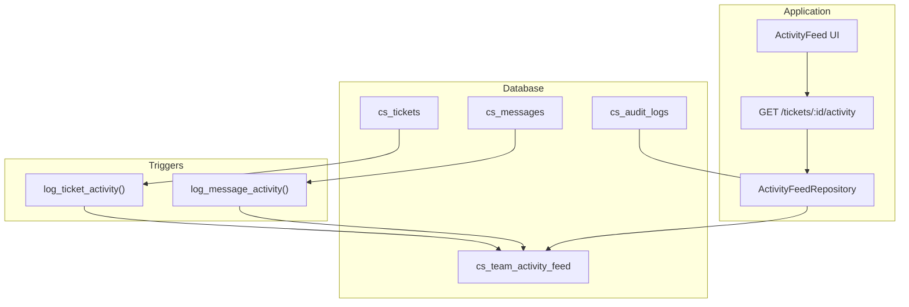
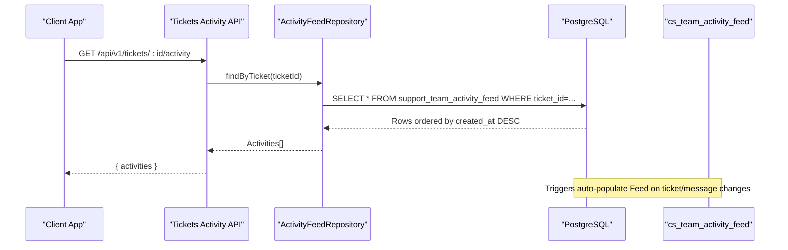
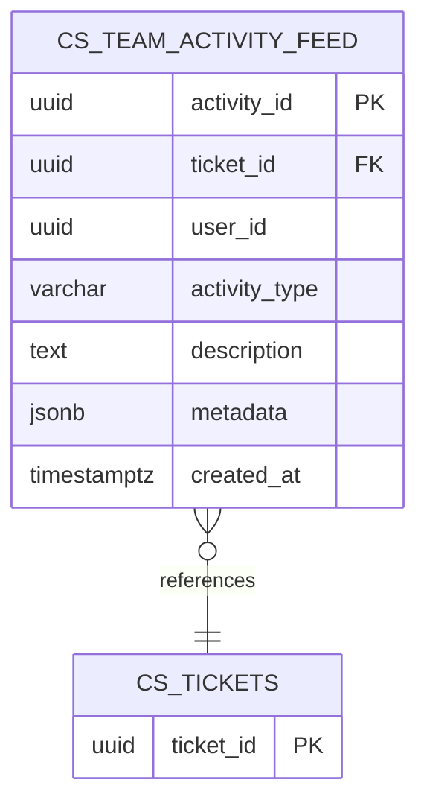
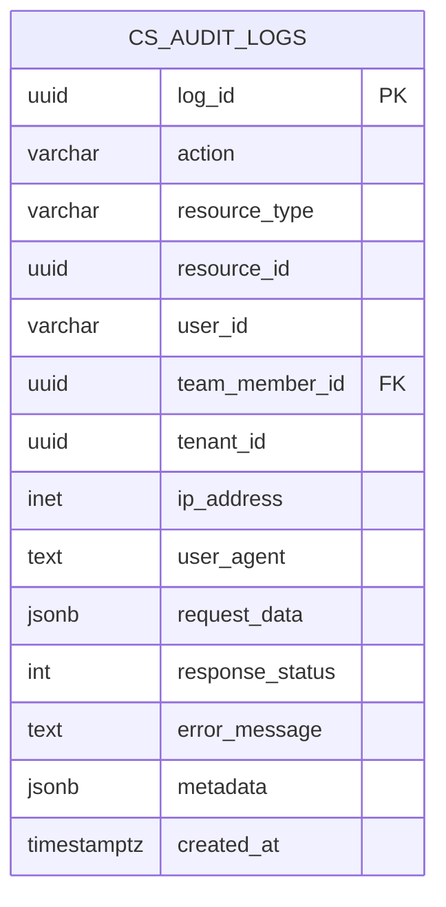
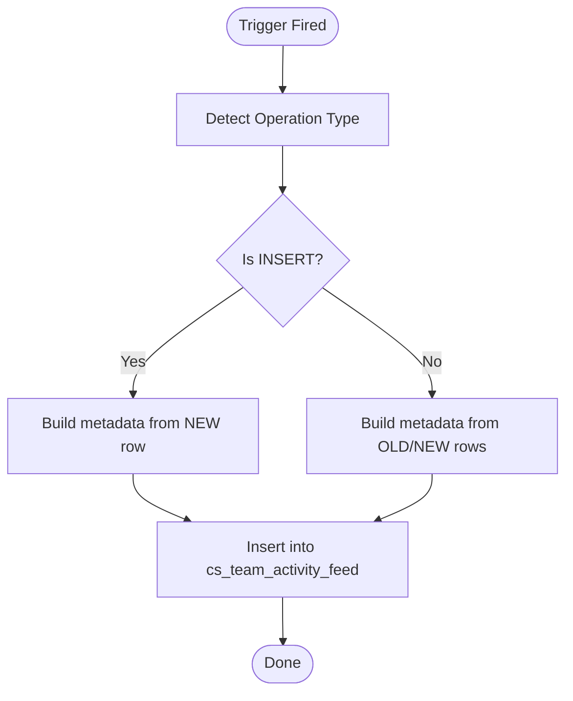
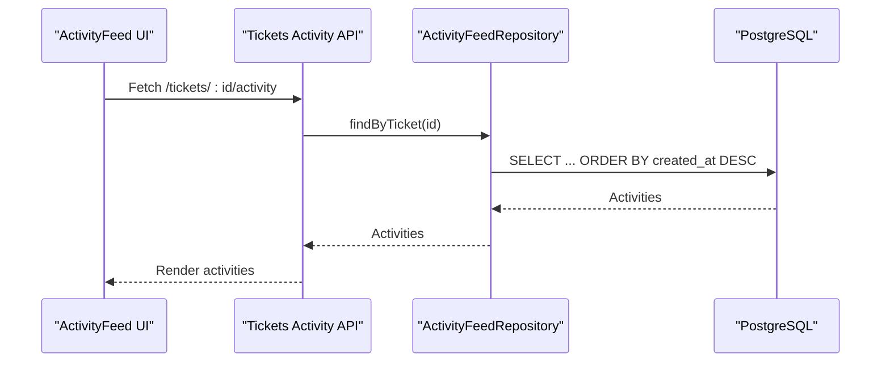
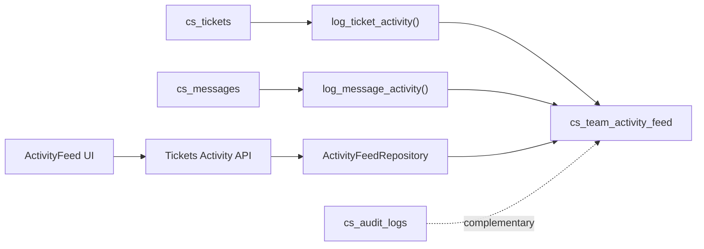

# Audit Trail & Logging Schema

<cite>
**Referenced Files in This Document**
- [001_initial_schema.sql](file://database/migrations/001_initial_schema.sql)
- [003_rls_policies.sql](file://database/migrations/003_rls_policies.sql)
- [005_additional_triggers.sql](file://database/migrations/005_additional_triggers.sql)
- [026_performance_optimizations.sql](file://database/migrations/026_performance_optimizations.sql)
- [007_audit_logs_table.sql](file://database/migrations/007_audit_logs_table.sql)
- [seed.sql](file://database/seed.sql)
- [activity-feed.ts](file://lib/repositories/activity-feed.ts)
- [route.ts](file://app/api/v1/tickets/[id]/activity/route.ts)
- [ActivityFeed.tsx](file://components/inbox/ActivityFeed.tsx)
- [RLS_POLICIES_SUMMARY.md](file://docs/setup/RLS_POLICIES_SUMMARY.md)
</cite>

## Table of Contents
1. [Introduction](#introduction)
2. [Project Structure](#project-structure)
3. [Core Components](#core-components)
4. [Architecture Overview](#architecture-overview)
5. [Detailed Component Analysis](#detailed-component-analysis)
6. [Dependency Analysis](#dependency-analysis)
7. [Performance Considerations](#performance-considerations)
8. [Troubleshooting Guide](#troubleshooting-guide)
9. [Conclusion](#conclusion)
10. [Appendices](#appendices)

## Introduction
This document provides comprehensive data model documentation for the audit trail and logging system, with a focus on the cs_team_activity_feed table. It explains the schema, enumerations, metadata storage, and timestamp-based chronological organization. It also covers integration with user management for agent accountability, relationships to ticket lifecycle events, practical query patterns, and performance implications with indexing strategies.

## Project Structure
The audit and logging system spans database migrations, triggers, repositories, API routes, and UI components:
- Database schema and indexes define the cs_team_activity_feed and related audit tables
- Triggers automatically populate the activity feed from ticket and message lifecycle events
- Repositories encapsulate data access and expose typed APIs for activity feed operations
- API routes provide secure access to activity feeds for authenticated team members
- UI components render the activity feed with icons and timestamps

**Diagram sources**
- [001_initial_schema.sql](file://database/migrations/001_initial_schema.sql#L65-L88)
- [005_additional_triggers.sql](file://database/migrations/005_additional_triggers.sql#L30-L160)
- [005_additional_triggers.sql](file://database/migrations/005_additional_triggers.sql#L163-L237)
- [activity-feed.ts](file://lib/repositories/activity-feed.ts#L21-L90)
- [route.ts](file://app/api/v1/tickets/[id]/activity/route.ts#L11-L38)
- [ActivityFeed.tsx](file://components/inbox/ActivityFeed.tsx#L50-L138)

**Section sources**
- [001_initial_schema.sql](file://database/migrations/001_initial_schema.sql#L65-L88)
- [005_additional_triggers.sql](file://database/migrations/005_additional_triggers.sql#L30-L160)
- [005_additional_triggers.sql](file://database/migrations/005_additional_triggers.sql#L163-L237)
- [activity-feed.ts](file://lib/repositories/activity-feed.ts#L21-L90)
- [route.ts](file://app/api/v1/tickets/[id]/activity/route.ts#L11-L38)
- [ActivityFeed.tsx](file://components/inbox/ActivityFeed.tsx#L50-L138)

## Core Components
- cs_team_activity_feed: Central table for team activity tracking, including ticket lifecycle events, user actions, and system notifications
- cs_audit_logs: Security audit log for sensitive operations with request/response context and error tracking
- Triggers: Automatic population of activity feed entries from ticket and message operations
- Repository: Typed interface for querying and inserting activity feed records
- API: Secure endpoint exposing activity feed per ticket to authenticated users
- UI: Visual rendering of activity feed with icons, colors, and relative timestamps

**Section sources**
- [001_initial_schema.sql](file://database/migrations/001_initial_schema.sql#L65-L88)
- [007_audit_logs_table.sql](file://database/migrations/007_audit_logs_table.sql#L6-L23)
- [005_additional_triggers.sql](file://database/migrations/005_additional_triggers.sql#L30-L160)
- [005_additional_triggers.sql](file://database/migrations/005_additional_triggers.sql#L163-L237)
- [activity-feed.ts](file://lib/repositories/activity-feed.ts#L21-L90)
- [route.ts](file://app/api/v1/tickets/[id]/activity/route.ts#L11-L38)
- [ActivityFeed.tsx](file://components/inbox/ActivityFeed.tsx#L50-L138)

## Architecture Overview
The system integrates database triggers with application repositories and API endpoints to maintain a chronological, auditable record of team activity. Access control is enforced via Clerk and Row Level Security (RLS) policies.

**Diagram sources**
- [route.ts](file://app/api/v1/tickets/[id]/activity/route.ts#L11-L38)
- [activity-feed.ts](file://lib/repositories/activity-feed.ts#L63-L72)
- [005_additional_triggers.sql](file://database/migrations/005_additional_triggers.sql#L30-L160)
- [005_additional_triggers.sql](file://database/migrations/005_additional_triggers.sql#L163-L237)

## Detailed Component Analysis

### cs_team_activity_feed Schema
- Purpose: Comprehensive team activity tracking for ticket lifecycle, user actions, and system notifications
- Primary keys and identifiers: activity_id (UUID), optional ticket_id (UUID) referencing cs_tickets
- Identity and attribution: user_id (UUID), created_at (TIMESTAMPTZ)
- Activity classification: activity_type with enumerated values covering lifecycle and collaboration events
- Context storage: metadata (JSONB) for structured context; description (TEXT) for human-readable summaries
- Integrity: Foreign key constraint on ticket_id with cascade delete

Enumerated activity types include:
- Lifecycle: ticket_created, ticket_assigned, ticket_resolved, ticket_closed, ticket_reopened
- Collaboration: message_sent, note_added
- Configuration/state changes: status_changed, priority_changed, tag_added, tag_removed
- SLA: sla_breached, sla_warning

Indexing supports:
- Single-column: ticket_id, user_id, activity_type, created_at DESC
- Composite: (user_id, created_at DESC), (ticket_id, created_at DESC), (activity_type, created_at DESC)

**Diagram sources**
- [001_initial_schema.sql](file://database/migrations/001_initial_schema.sql#L65-L88)
- [001_initial_schema.sql](file://database/migrations/001_initial_schema.sql#L296-L300)
- [026_performance_optimizations.sql](file://database/migrations/026_performance_optimizations.sql#L69-L72)

**Section sources**
- [001_initial_schema.sql](file://database/migrations/001_initial_schema.sql#L65-L88)
- [001_initial_schema.sql](file://database/migrations/001_initial_schema.sql#L296-L300)
- [026_performance_optimizations.sql](file://database/migrations/026_performance_optimizations.sql#L69-L72)

### cs_audit_logs Schema
- Purpose: Security audit logging for sensitive operations with request/response context and error tracking
- Identity: log_id (UUID), action (VARCHAR), resource_type/resource_id (scoped), user_id (Clerk ID), team_member_id (FK)
- Network and request context: ip_address (INET), user_agent (TEXT), request_data (JSONB)
- Outcome: response_status (INT), error_message (TEXT)
- Governance: tenant_id, created_at (TIMESTAMPTZ)
- Access control: RLS policies restrict visibility to own tenant

Indexes:
- user_id, team_member_id, tenant_id, action, resource_type+resource_id, created_at DESC

**Diagram sources**
- [007_audit_logs_table.sql](file://database/migrations/007_audit_logs_table.sql#L6-L23)

**Section sources**
- [007_audit_logs_table.sql](file://database/migrations/007_audit_logs_table.sql#L6-L23)

### Triggers and Metadata Storage
- Ticket lifecycle triggers:
  - log_ticket_activity(): Automatically inserts activity entries on INSERT/UPDATE of cs_tickets
  - Metadata captures current and historical values (status, priority, assigned_to) and contextual fields (channel, stage)
- Message lifecycle triggers:
  - log_message_activity(): Automatically inserts activity entries on INSERT of cs_messages
  - Metadata captures message identity, sender type, and internal flag
- User attribution:
  - Attempts to derive user_id from trigger context or inferred from ticket/message context
  - Skips logging if user_id cannot be determined

**Diagram sources**
- [005_additional_triggers.sql](file://database/migrations/005_additional_triggers.sql#L30-L160)
- [005_additional_triggers.sql](file://database/migrations/005_additional_triggers.sql#L163-L237)

**Section sources**
- [005_additional_triggers.sql](file://database/migrations/005_additional_triggers.sql#L30-L160)
- [005_additional_triggers.sql](file://database/migrations/005_additional_triggers.sql#L163-L237)

### Access Control and Compliance
- RLS policies:
  - cs_team_activity_feed: Team members can SELECT/INSERT/UPDATE; DELETE restricted to admins
  - Additional policies exist for broader system coverage
- Clerk integration:
  - Authentication via Clerk; authorization enforced in application code
  - Repositories use service role bypass; RLS remains as safety net
- Compliance implications:
  - Timestamped chronological records support audit trails
  - JSONB metadata enables extensibility for compliance-specific attributes
  - Audit logs complement activity feed with request/response/error context

**Section sources**
- [003_rls_policies.sql](file://database/migrations/003_rls_policies.sql#L264-L287)
- [RLS_POLICIES_SUMMARY.md](file://docs/setup/RLS_POLICIES_SUMMARY.md#L25-L31)
- [RLS_POLICIES_SUMMARY.md](file://docs/setup/RLS_POLICIES_SUMMARY.md#L80-L106)

### API and UI Integration
- API endpoint:
  - GET /api/v1/tickets/:id/activity returns activity feed for a ticket
  - Requires team member authentication; verifies ticket existence
- Repository:
  - findAll/findByTicket/findByUser with filtering and pagination
  - Convenience helpers for common activity types (ticket_created, ticket_assigned, ticket_resolved, message_sent, sla_breached)
- UI component:
  - Renders activity feed with icons, badges, and relative timestamps
  - Loads data via the API endpoint

**Diagram sources**
- [ActivityFeed.tsx](file://components/inbox/ActivityFeed.tsx#L60-L75)
- [route.ts](file://app/api/v1/tickets/[id]/activity/route.ts#L11-L38)
- [activity-feed.ts](file://lib/repositories/activity-feed.ts#L63-L72)

**Section sources**
- [route.ts](file://app/api/v1/tickets/[id]/activity/route.ts#L11-L38)
- [activity-feed.ts](file://lib/repositories/activity-feed.ts#L21-L90)
- [ActivityFeed.tsx](file://components/inbox/ActivityFeed.tsx#L50-L138)

## Dependency Analysis
- Database dependencies:
  - cs_team_activity_feed depends on cs_tickets (optional) and stores user_id for agent accountability
  - Triggers depend on cs_tickets and cs_messages
  - cs_audit_logs is independent and cross-references cs_team_members
- Application dependencies:
  - API route depends on ActivityFeedRepository
  - Repository depends on Supabase client and targets cs_team_activity_feed
  - UI component depends on API endpoint and renders icons/badges

**Diagram sources**
- [001_initial_schema.sql](file://database/migrations/001_initial_schema.sql#L65-L88)
- [005_additional_triggers.sql](file://database/migrations/005_additional_triggers.sql#L30-L160)
- [005_additional_triggers.sql](file://database/migrations/005_additional_triggers.sql#L163-L237)
- [activity-feed.ts](file://lib/repositories/activity-feed.ts#L21-L90)
- [route.ts](file://app/api/v1/tickets/[id]/activity/route.ts#L11-L38)
- [ActivityFeed.tsx](file://components/inbox/ActivityFeed.tsx#L50-L138)
- [007_audit_logs_table.sql](file://database/migrations/007_audit_logs_table.sql#L6-L23)

**Section sources**
- [001_initial_schema.sql](file://database/migrations/001_initial_schema.sql#L65-L88)
- [005_additional_triggers.sql](file://database/migrations/005_additional_triggers.sql#L30-L160)
- [005_additional_triggers.sql](file://database/migrations/005_additional_triggers.sql#L163-L237)
- [activity-feed.ts](file://lib/repositories/activity-feed.ts#L21-L90)
- [route.ts](file://app/api/v1/tickets/[id]/activity/route.ts#L11-L38)
- [ActivityFeed.tsx](file://components/inbox/ActivityFeed.tsx#L50-L138)
- [007_audit_logs_table.sql](file://database/migrations/007_audit_logs_table.sql#L6-L23)

## Performance Considerations
- Indexing strategy:
  - Single-column indexes on ticket_id, user_id, activity_type, created_at DESC
  - Composite indexes for common queries: (user_id, created_at DESC), (ticket_id, created_at DESC), (activity_type, created_at DESC)
- Trigger overhead:
  - Automatic logging on INSERT/UPDATE of tickets and INSERT of messages; ensure minimal metadata computation
- Pagination and ordering:
  - Repository supports limit/offset; UI loads incrementally
- Audit logs:
  - Separate cs_audit_logs table prevents activity feed growth from impacting performance
- Recommendations:
  - Monitor slow queries on activity feed; consider partitioning by created_at for very large datasets
  - Use composite indexes aligned to frequent filter combinations (ticket_id + type, user_id + type)
  - Batch writes for high-volume scenarios; avoid excessive concurrent trigger execution

**Section sources**
- [001_initial_schema.sql](file://database/migrations/001_initial_schema.sql#L296-L300)
- [026_performance_optimizations.sql](file://database/migrations/026_performance_optimizations.sql#L69-L72)
- [005_additional_triggers.sql](file://database/migrations/005_additional_triggers.sql#L30-L160)
- [005_additional_triggers.sql](file://database/migrations/005_additional_triggers.sql#L163-L237)

## Troubleshooting Guide
- Activity feed not updating:
  - Verify triggers exist and are enabled for cs_tickets and cs_messages
  - Confirm user_id is available in trigger context or can be inferred from ticket/message
- Missing user attribution:
  - log_message_activity() falls back to assigned agent or creator; ensure ticket has assigned_to or created_by
- Access denied:
  - Ensure Clerk authentication is active and team member role is verified
  - RLS policies permit SELECT/INSERT/UPDATE for team members; DELETE requires admin
- API returns empty:
  - Confirm ticket exists and belongs to the authenticated user’s tenant context
  - Check repository filters and ordering; ensure ticket_id matches
- Audit logs missing:
  - Confirm cs_audit_logs entries are generated for sensitive operations
  - Review indexes and RLS policies for visibility

**Section sources**
- [005_additional_triggers.sql](file://database/migrations/005_additional_triggers.sql#L30-L160)
- [005_additional_triggers.sql](file://database/migrations/005_additional_triggers.sql#L163-L237)
- [003_rls_policies.sql](file://database/migrations/003_rls_policies.sql#L264-L287)
- [route.ts](file://app/api/v1/tickets/[id]/activity/route.ts#L11-L38)
- [007_audit_logs_table.sql](file://database/migrations/007_audit_logs_table.sql#L6-L23)

## Conclusion
The cs_team_activity_feed table provides a robust foundation for comprehensive team activity tracking, integrating seamlessly with ticket lifecycle events and user actions. The enumerated activity types, flexible metadata storage, and timestamp-based chronological organization enable rich auditing and reporting. Combined with triggers, repositories, API endpoints, and UI components, the system delivers a complete audit trail solution with strong access controls and performance-conscious indexing.

## Appendices

### Example Queries and Reporting Patterns
- Get ticket activity feed (most recent first):
  - Filter by ticket_id; order by created_at DESC
- Get user activity feed:
  - Filter by user_id; order by created_at DESC
- Get activity by type:
  - Filter by activity_type; order by created_at DESC
- Compliance reporting:
  - Aggregate counts by activity_type and date ranges
  - Join with user/team metadata for accountability

**Section sources**
- [activity-feed.ts](file://lib/repositories/activity-feed.ts#L25-L58)
- [026_performance_optimizations.sql](file://database/migrations/026_performance_optimizations.sql#L69-L72)

### Sample Seed Data
- Demonstrates typical activity feed entries for ticket lifecycle and messaging

**Section sources**
- [seed.sql](file://database/seed.sql#L295-L323)