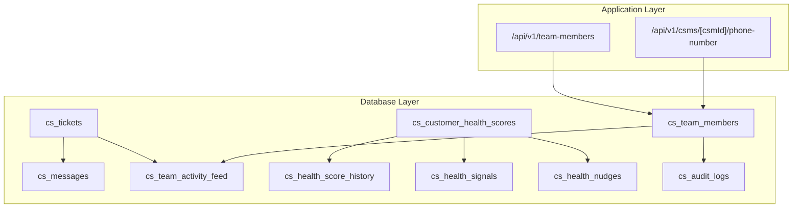
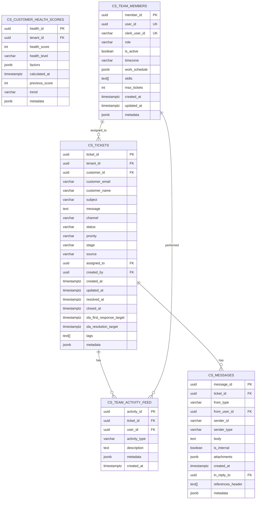
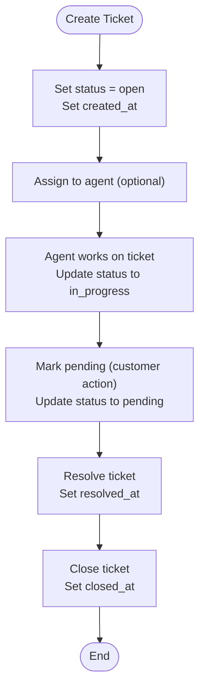
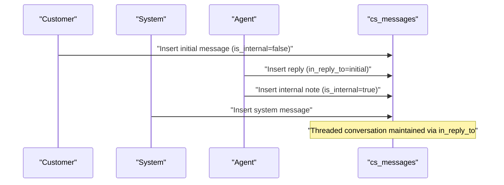
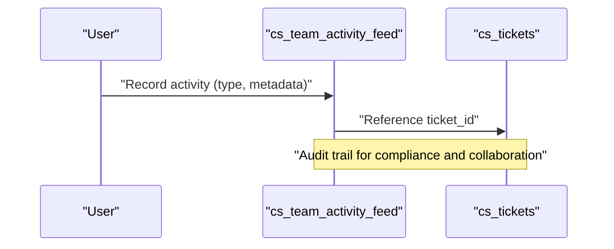
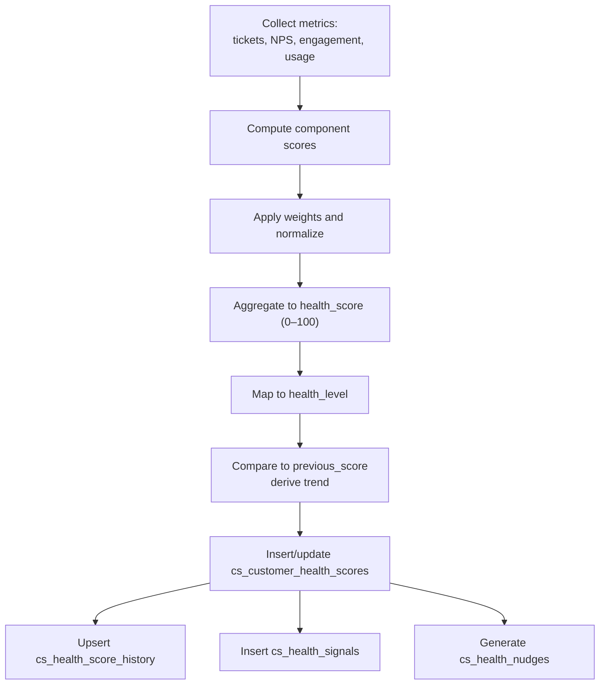
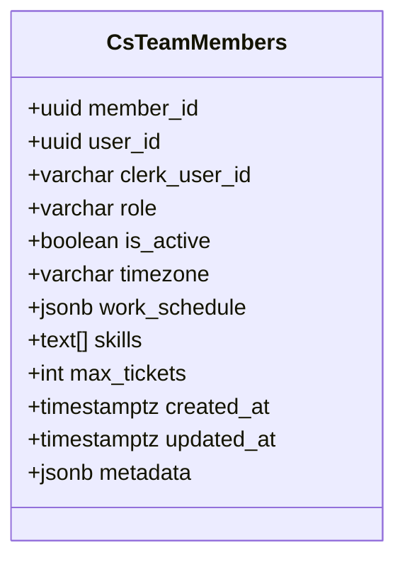
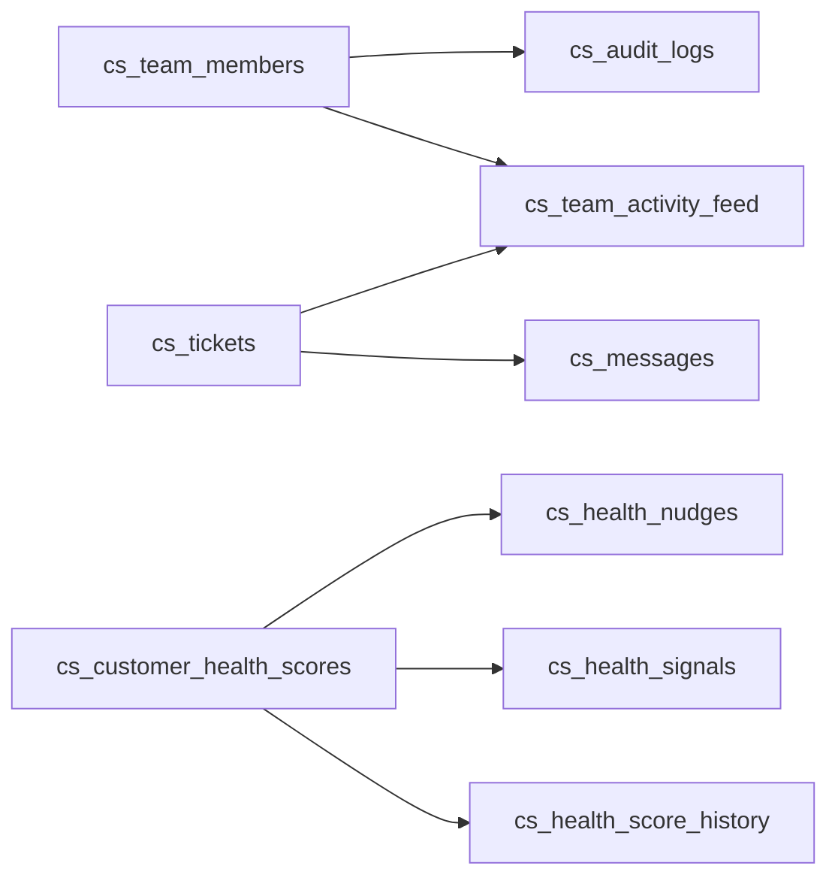

# Core Customer Data Tables

<cite>
**Referenced Files in This Document**
- [001_initial_schema.sql](file://database/migrations/001_initial_schema.sql)
- [007_audit_logs_table.sql](file://database/migrations/007_audit_logs_table.sql)
- [008_health_scoring.sql](file://database/migrations/008_health_scoring.sql)
- [014_trend_analysis.sql](file://database/migrations/014_trend_analysis.sql)
- [004_database_functions.sql](file://database/migrations/004_database_functions.sql)
- [database.ts](file://types/database.ts)
- [route.ts](file://app/api/v1/team-members/role.ts)
- [route.ts](file://app/api/v1\csms\[csmId]\phone-number\route.ts)
</cite>

## Table of Contents
1. [Introduction](#introduction)
2. [Project Structure](#project-structure)
3. [Core Components](#core-components)
4. [Architecture Overview](#architecture-overview)
5. [Detailed Component Analysis](#detailed-component-analysis)
6. [Dependency Analysis](#dependency-analysis)
7. [Performance Considerations](#performance-considerations)
8. [Troubleshooting Guide](#troubleshooting-guide)
9. [Conclusion](#conclusion)
10. [Appendices](#appendices)

## Introduction
This document provides comprehensive data model documentation for the core customer data tables in the CS Support Service. It focuses on:
- cs_tickets: ticket lifecycle, status tracking, priority levels, and channel integration
- cs_messages: conversation thread management with threading support, internal notes, and attachment handling
- cs_team_activity_feed: audit trails and collaboration tracking
- cs_customer_health_scores: proactive customer success monitoring including health scoring algorithms and trend analysis
- cs_team_members: agent profiles, roles, scheduling, and skill management

It also covers field definitions, data types, constraints, foreign key relationships, indexing strategies, and practical query examples for ticket management, conversation threading, and health score calculations.

## Project Structure
The data model is primarily defined in SQL migration files and reflected in TypeScript type definitions. The API surface demonstrates usage patterns for cs_team_members and indirectly for cs_tickets and cs_messages.

**Diagram sources**
- [001_initial_schema.sql](file://database/migrations/001_initial_schema.sql#L16-L88)
- [008_health_scoring.sql](file://database/migrations/008_health_scoring.sql#L114-L230)
- [007_audit_logs_table.sql](file://database/migrations/007_audit_logs_table.sql#L6-L23)
- [database.ts](file://types/database.ts#L4-L195)

**Section sources**
- [001_initial_schema.sql](file://database/migrations/001_initial_schema.sql#L16-L347)
- [database.ts](file://types/database.ts#L4-L271)

## Core Components
This section outlines the five core tables with their primary attributes, constraints, and relationships.

- cs_tickets
  - Purpose: Central repository for customer support requests across channels
  - Key fields: ticket_id, tenant_id, customer_id, customer_email, subject, message, channel, status, priority, stage, source, assigned_to, created_by, timestamps, SLA targets, tags, metadata
  - Constraints: Enum-like checks for channel, status, priority, stage, source; UUID primary key; timestamps default to current time
  - Foreign keys: tenant_id references tenants (platform service), assigned_to and created_by reference users (clerk user IDs)
  - Indexes: tenant, status, stage, source, assigned_to, created_at desc, priority, channel, customer_email

- cs_messages
  - Purpose: Stores conversation threads per ticket with support for internal notes and attachments
  - Key fields: message_id, ticket_id (FK), from_type, from_user_id, sender_id, sender_type, body, is_internal, attachments, created_at, in_reply_to (threading), references_header, metadata
  - Constraints: Enum-like checks for from_type and sender_type; JSONB for attachments and metadata
  - Foreign keys: ticket_id references cs_tickets; from_user_id references users
  - Indexes: ticket_id, created_at desc, sender_id, in_reply_to

- cs_team_activity_feed
  - Purpose: Audit trail and collaboration log for team actions impacting tickets
  - Key fields: activity_id, ticket_id (FK), user_id, activity_type, description, metadata, created_at
  - Constraints: Enum-like checks for activity_type; JSONB metadata
  - Foreign keys: ticket_id references cs_tickets; user_id references users
  - Indexes: ticket_id, user_id, activity_type, created_at desc

- cs_customer_health_scores
  - Purpose: Proactive customer success monitoring with health scoring and trend analysis
  - Key fields: health_id, tenant_id, health_score, health_level, factors (JSONB), calculated_at, previous_score, trend, metadata
  - Enhanced fields (migration): customer_email, component scores, ML signals, trend tracking, recommended_actions, nudging timestamps
  - Constraints: health_score range 0–100; health_level includes healthy, at_risk, critical, churned; trend enum
  - Indexes: tenant, health_level, calculated_at desc; unique tenant+customer_email when applicable
  - Related tables: cs_health_score_history, cs_health_signals, cs_health_nudges

- cs_team_members
  - Purpose: Agent profiles, roles, scheduling, skills, and capacity limits
  - Key fields: member_id, user_id (unique), clerk_user_id (unique), role, is_active, timezone, work_schedule (JSONB), skills, max_tickets, timestamps, metadata
  - Constraints: role enum; timezone default; JSONB schedule; max_tickets default
  - Indexes: user_id, clerk_user_id, role, is_active

**Section sources**
- [001_initial_schema.sql](file://database/migrations/001_initial_schema.sql#L16-L88)
- [008_health_scoring.sql](file://database/migrations/008_health_scoring.sql#L114-L152)
- [database.ts](file://types/database.ts#L4-L195)

## Architecture Overview
The data model supports a unified support workflow:
- cs_tickets captures initial requests and tracks lifecycle
- cs_messages stores the conversation thread per ticket
- cs_team_activity_feed records team actions and SLA events
- cs_customer_health_scores enables proactive monitoring and trend analysis
- cs_team_members provides agent profiles and assignment context
- cs_audit_logs ensures security and compliance visibility

**Diagram sources**
- [001_initial_schema.sql](file://database/migrations/001_initial_schema.sql#L16-L88)
- [008_health_scoring.sql](file://database/migrations/008_health_scoring.sql#L114-L152)

## Detailed Component Analysis

### cs_tickets: Lifecycle, Status, Priority, Channel
- Lifecycle management
  - Status progression: open → in_progress → pending → resolved → closed
  - Timestamps: created_at, updated_at, resolved_at, closed_at
  - SLA tracking: sla_first_response_target, sla_resolution_target
- Priority levels: low, medium, high, urgent
- Channel integration: email, sms, call, chat, facebook, form
- Assignment and ownership: assigned_to and created_by link to users
- Indexing: optimized for tenant filtering, status, priority, channel, created_at desc

**Diagram sources**
- [001_initial_schema.sql](file://database/migrations/001_initial_schema.sql#L16-L39)

**Section sources**
- [001_initial_schema.sql](file://database/migrations/001_initial_schema.sql#L16-L39)

### cs_messages: Threading, Internal Notes, Attachments
- Threading support
  - in_reply_to references prior message_id for nested replies
  - references_header supports email-style threading
- Internal notes
  - is_internal flag restricts visibility to team members
- Attachments
  - attachments stored as JSONB array of attachment objects
- Sender identity
  - from_type/from_user_id for agents/system; sender_id/sender_type for customer/system
- Indexing: ticket_id, created_at desc, sender_id, in_reply_to

**Diagram sources**
- [001_initial_schema.sql](file://database/migrations/001_initial_schema.sql#L45-L59)

**Section sources**
- [001_initial_schema.sql](file://database/migrations/001_initial_schema.sql#L45-L59)

### cs_team_activity_feed: Audit Trails and Collaboration
- Activity types include ticket_created, ticket_assigned, ticket_resolved, ticket_closed, ticket_reopened, message_sent, status_changed, priority_changed, sla_breached, sla_warning, escalated, tag_added, tag_removed, note_added
- Links: ticket_id (FK), user_id (FK), timestamps, optional description and metadata
- Indexing: ticket_id, user_id, activity_type, created_at desc

**Diagram sources**
- [001_initial_schema.sql](file://database/migrations/001_initial_schema.sql#L65-L88)
- [007_audit_logs_table.sql](file://database/migrations/007_audit_logs_table.sql#L6-L23)

**Section sources**
- [001_initial_schema.sql](file://database/migrations/001_initial_schema.sql#L65-L88)
- [007_audit_logs_table.sql](file://database/migrations/007_audit_logs_table.sql#L6-L23)

### cs_customer_health_scores: Health Scoring and Trend Analysis
- Core fields: tenant_id, health_score (0–100), health_level (healthy, at_risk, critical, churned), factors (JSONB), calculated_at, previous_score, trend
- Enhanced fields (migration): customer_email, component scores (engagement_score, usage_score, support_score, billing_score, product_fit_score), ML signals (churn_risk, expansion_probability, renewal_probability), trend tracking (score_trend, days_since_last_improvement/decline), recommended_actions (JSONB), nudging timestamps
- Supporting tables:
  - cs_health_score_history: historical snapshots for trend analysis
  - cs_health_signals: ML signals and events with impact
  - cs_health_nudges: personalized action recommendations with status and priority
- Indexes: tenant, health_level, calculated_at desc; unique tenant+customer_email when customer_email present
- Row Level Security: policies restrict access to own tenant’s data

**Diagram sources**
- [008_health_scoring.sql](file://database/migrations/008_health_scoring.sql#L114-L152)
- [004_database_functions.sql](file://database/migrations/004_database_functions.sql#L25-L174)

**Section sources**
- [008_health_scoring.sql](file://database/migrations/008_health_scoring.sql#L1-L292)
- [004_database_functions.sql](file://database/migrations/004_database_functions.sql#L10-L174)

### cs_team_members: Profiles, Roles, Scheduling, Skills
- Fields: user_id (unique), clerk_user_id (unique), role (enum), is_active, timezone, work_schedule (JSONB), skills, max_tickets, timestamps, metadata
- Indexes: user_id, clerk_user_id, role, is_active
- API usage: endpoint returns active team members for assignment dropdowns

**Diagram sources**
- [001_initial_schema.sql](file://database/migrations/001_initial_schema.sql#L260-L273)

**Section sources**
- [001_initial_schema.sql](file://database/migrations/001_initial_schema.sql#L260-L273)
- [route.ts](file://app/api/v1/team-members/route.ts#L10-L27)

## Dependency Analysis
- Foreign key relationships
  - cs_messages.ticket_id → cs_tickets.ticket_id (ON DELETE CASCADE)
  - cs_team_activity_feed.ticket_id → cs_tickets.ticket_id (ON DELETE CASCADE)
  - cs_team_activity_feed.user_id → users (via clerk user ID mapping)
  - cs_team_members.user_id → users
  - cs_customer_health_scores.tenant_id → tenants (platform service)
- Indexes drive query performance for common filters and sorts
- Triggers update updated_at for several tables
- Database functions encapsulate business logic for health scoring, churn risk, SLA updates, and agent execution logging

**Diagram sources**
- [001_initial_schema.sql](file://database/migrations/001_initial_schema.sql#L16-L88)
- [008_health_scoring.sql](file://database/migrations/008_health_scoring.sql#L161-L230)
- [007_audit_logs_table.sql](file://database/migrations/007_audit_logs_table.sql#L6-L23)

**Section sources**
- [001_initial_schema.sql](file://database/migrations/001_initial_schema.sql#L276-L347)
- [004_database_functions.sql](file://database/migrations/004_database_functions.sql#L389-L478)

## Performance Considerations
- Index coverage
  - cs_tickets: tenant, status, stage, source, assigned_to, created_at desc, priority, channel, customer_email
  - cs_messages: ticket_id, created_at desc, sender_id, in_reply_to
  - cs_team_activity_feed: ticket_id, user_id, activity_type, created_at desc
  - cs_customer_health_scores: tenant, health_level, calculated_at desc
- JSONB fields (metadata, factors, attachments) enable flexible schemas but require appropriate GIN/BTree indexing for filtering and sorting
- Triggers (update_updated_at_column) ensure audit freshness without application-level overhead
- Functions (calculate_health_score, calculate_churn_risk, update_ticket_sla) centralize business logic and can leverage indexes for efficient scans

[No sources needed since this section provides general guidance]

## Troubleshooting Guide
- Common anomalies
  - Missing SLA targets: verify update_ticket_sla function execution after ticket creation or priority change
  - Incorrect health score: confirm calculate_health_score runs against the intended tenant_id and that recent metrics are available
  - Thread inconsistencies: ensure in_reply_to references valid message_id and that references_header aligns with email threading expectations
- Audit and compliance
  - cs_audit_logs captures sensitive operations; verify RLS policies and indexes for tenant-scoped visibility
- Data integrity
  - Enum constraints prevent invalid values; check check constraints for channel, status, priority, health_level, and activity_type
  - Unique constraints: cs_team_members.user_id and clerk_user_id; tenant+customer_email in health scores when applicable

**Section sources**
- [004_database_functions.sql](file://database/migrations/004_database_functions.sql#L389-L478)
- [008_health_scoring.sql](file://database/migrations/008_health_scoring.sql#L82-L112)
- [007_audit_logs_table.sql](file://database/migrations/007_audit_logs_table.sql#L33-L47)

## Conclusion
The core customer data tables form a cohesive foundation for support operations, collaboration, and proactive customer success. cs_tickets and cs_messages provide robust lifecycle and conversation management; cs_team_activity_feed and cs_audit_logs ensure transparency and compliance; cs_customer_health_scores and related tables enable data-driven customer success; and cs_team_members underpin assignment and capacity planning. Together, they support scalable, observable, and maintainable customer support workflows.

[No sources needed since this section summarizes without analyzing specific files]

## Appendices

### Field Reference and Constraints
- cs_tickets
  - channel: email, sms, call, chat, facebook, form
  - status: open, in_progress, pending, resolved, closed
  - priority: low, medium, high, urgent
  - stage: pre-sale, post-sale, converted
  - source: lead, customer, internal
- cs_messages
  - from_type, sender_type: customer, agent, system
- cs_team_activity_feed
  - activity_type: ticket_created, ticket_assigned, ticket_resolved, ticket_closed, ticket_reopened, message_sent, status_changed, priority_changed, sla_breached, sla_warning, escalated, tag_added, tag_removed, note_added
- cs_customer_health_scores
  - health_level: healthy, at_risk, critical, churned
  - trend: improving, stable, declining
- cs_team_members
  - role: support_agent, support_manager, csm, head_of_cs, solutions_engineer

**Section sources**
- [001_initial_schema.sql](file://database/migrations/001_initial_schema.sql#L16-L88)
- [008_health_scoring.sql](file://database/migrations/008_health_scoring.sql#L114-L152)

### Example Queries

- Ticket management
  - List open tickets by priority and tenant
    - SELECT * FROM cs_tickets WHERE tenant_id = ? AND status = 'open' AND priority IN ('high','urgent') ORDER BY created_at DESC;
  - Count tickets by status per tenant
    - SELECT tenant_id, status, COUNT(*) FROM cs_tickets GROUP BY tenant_id, status;
  - Find tickets with SLA breaches
    - SELECT ticket_id FROM cs_tickets WHERE sla_first_response_target < NOW() AND status != 'closed';

- Conversation threading
  - Retrieve a ticket’s message thread
    - SELECT m.* FROM cs_messages m WHERE m.ticket_id = ? ORDER BY m.created_at ASC;
  - Find replies to a specific message
    - SELECT message_id, body FROM cs_messages WHERE in_reply_to = ? ORDER BY created_at ASC;

- Health score calculations
  - Calculate health score for a tenant
    - SELECT calculate_health_score(?); -- Returns health_id
  - Retrieve latest health score and level
    - SELECT health_score, health_level, calculated_at FROM cs_customer_health_scores WHERE tenant_id = ? ORDER BY calculated_at DESC LIMIT 1;
  - Trend analysis
    - SELECT trend, previous_score, calculated_at FROM cs_health_score_history WHERE tenant_id = ? ORDER BY calculated_at DESC LIMIT 5;

**Section sources**
- [004_database_functions.sql](file://database/migrations/004_database_functions.sql#L25-L174)
- [008_health_scoring.sql](file://database/migrations/008_health_scoring.sql#L161-L180)