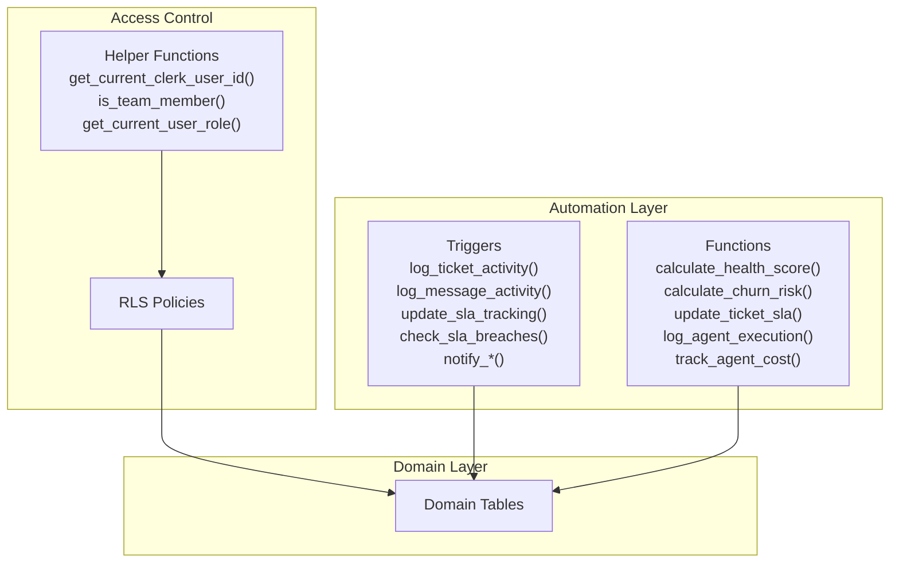
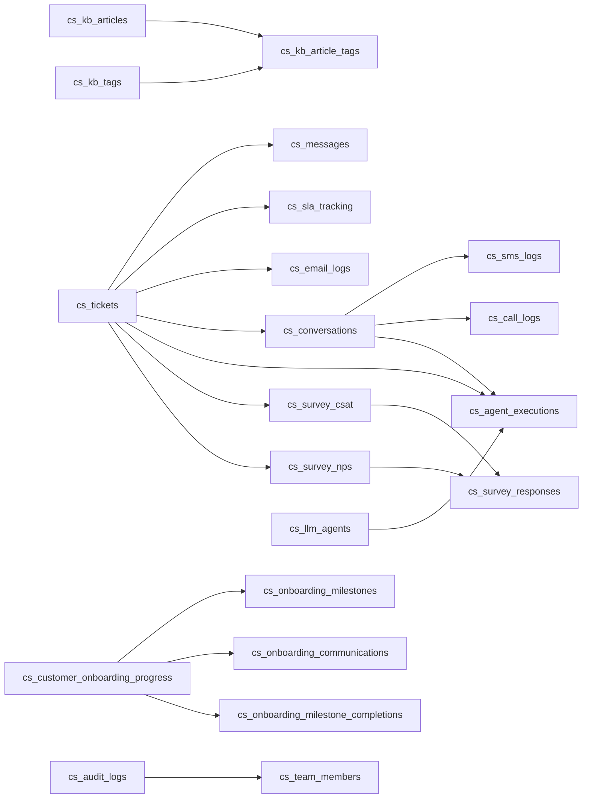

# Database Schema & Data Model

<cite>
**Referenced Files in This Document**
- [database/README.md](file://database/README.md)
- [database/migrations/001_initial_schema.sql](file://database/migrations/001_initial_schema.sql)
- [database/migrations/002_missing_tables_and_service_fields.sql](file://database/migrations/002_missing_tables_and_service_fields.sql)
- [database/migrations/003_rls_policies.sql](file://database/migrations/003_rls_policies.sql)
- [database/migrations/004_database_functions.sql](file://database/migrations/004_database_functions.sql)
- [database/migrations/005_additional_triggers.sql](file://database/migrations/005_additional_triggers.sql)
- [database/migrations/006_allow_null_tenant_for_presale.sql](file://database/migrations/006_allow_null_tenant_for_presale.sql)
- [database/migrations/007_audit_logs_table.sql](file://database/migrations/007_audit_logs_table.sql)
- [database/migrations/008_health_scoring.sql](file://database/migrations/008_health_scoring.sql)
- [database/migrations/009_onboarding_sequences.sql](file://database/migrations/009_onboarding_sequences.sql)
- [database/migrations/010_onboarding_templates_placeholder.sql](file://database/migrations/010_onboarding_templates_placeholder.sql)
- [database/migrations/011_law_firm_onboarding_flow.sql](file://database/migrations/011_law_firm_onboarding_flow.sql)
- [database/migrations/012_usage_analytics.sql](file://database/migrations/012_usage_analytics.sql)
- [database/migrations/013_csat_nps_auto_survey.sql](file://database/migrations/013_csat_nps_auto_survey.sql)
- [database/migrations/014_trend_analysis.sql](file://database/migrations/014_trend_analysis.sql)
</cite>

## Table of Contents
1. [Introduction](#introduction)
2. [Project Structure](#project-structure)
3. [Core Components](#core-components)
4. [Architecture Overview](#architecture-overview)
5. [Detailed Component Analysis](#detailed-component-analysis)
6. [Dependency Analysis](#dependency-analysis)
7. [Performance Considerations](#performance-considerations)
8. [Troubleshooting Guide](#troubleshooting-guide)
9. [Conclusion](#conclusion)
10. [Appendices](#appendices)

## Introduction
This document describes the CS Support Service database schema and data model for the support_db schema. It covers entity relationships, table structures, field definitions, data types, primary/foreign keys, indexes, constraints, and database functions. It also documents customer success tracking tables, conversation management entities, analytics data structures, audit logging systems, migration history, schema evolution patterns, data lifecycle management, validation rules, business logic constraints, referential integrity requirements, access control via Row Level Security (RLS), and performance optimization strategies.

## Project Structure
The schema is defined and evolved through a series of migration files under the database/migrations directory. Each migration adds or modifies tables, indexes, triggers, and policies to implement new capabilities incrementally. The initial schema establishes core support entities, while subsequent migrations introduce customer success, AI agent orchestration, onboarding, analytics, surveys, and trend analysis.

```mermaid
graph TB
subgraph "Initial Schema"
A["cs_tickets"]
B["cs_messages"]
C["cs_team_activity_feed"]
D["cs_agent_performance_metrics"]
E["cs_email_logs"]
F["cs_notifications"]
G["cs_kb_articles"]
H["cs_kb_categories"]
I["cs_customer_health_scores"]
J["cs_sla_policies"]
K["cs_survey_csat"]
L["cs_survey_nps"]
M["cs_team_members"]
end
subgraph "Conversations & Integrations"
N["cs_conversations"]
O["cs_sms_logs"]
P["cs_call_logs"]
end
subgraph "Knowledge Base Enhancements"
Q["cs_kb_tags"]
R["cs_kb_article_tags"]
S["cs_kb_article_views"]
end
subgraph "SLA & Quality"
T["cs_sla_tracking"]
U["cs_ticket_quality_scores"]
end
subgraph "Customer Success"
V["cs_customer_success_metrics"]
W["cs_customer_onboarding_progress"]
X["cs_customer_churn_risk"]
end
subgraph "AI Agents"
Y["cs_llm_agents"]
Z["cs_agent_executions"]
AA["cs_agent_feedback"]
AB["cs_agent_training_data"]
AC["cs_agent_state"]
AD["cs_agent_orchestration"]
AE["cs_agent_circuit_breakers"]
AF["cs_agent_dlq"]
AG["cs_agent_rate_limits"]
AH["cs_agent_cost_tracking"]
AI["cs_agent_monitoring"]
end
subgraph "Integrations"
AJ["cs_integrations"]
AK["cs_webhooks"]
AL["cs_api_keys"]
end
subgraph "Analytics & Surveys"
AM["cs_usage_events"]
AN["cs_feature_adoption_metrics"]
AO["cs_usage_patterns"]
AP["cs_usage_analytics_summary"]
AQ["cs_survey_templates"]
AR["cs_survey_responses"]
AS["cs_survey_automation_rules"]
AT["cs_survey_reminders"]
end
subgraph "Trend Analysis"
AU["cs_trend_analysis"]
AV["cs_trend_occurrences"]
AW["cs_product_feedback"]
AX["cs_pain_points"]
AY["cs_trend_patterns"]
end
subgraph "Onboarding"
AZ["cs_onboarding_sequences"]
BA["cs_onboarding_milestones"]
BB["cs_onboarding_communications"]
BC["cs_onboarding_milestone_completions"]
BD["cs_onboarding_firm_profile"]
BE["cs_onboarding_phone_config"]
BF["cs_onboarding_calendar_integrations"]
BG["cs_onboarding_compliance_settings"]
BH["cs_onboarding_step_completions"]
end
subgraph "Audit & Security"
BI["cs_audit_logs"]
end
A --- B
A --- C
A --- T
B --- C
G --- H
G --- Q
Q --- R
R --- G
N --- A
N --- O
N --- P
V --- W
V --- X
Y --- Z
Z --- N
Z --- A
Z --- Y
AJ --- AK
AM --- AN
AM --- AO
AO --- AP
K --- A
L --- A
AQ --- AR
AR --- A
AU --- AV
AW --- AX
AX --- AY
AZ --- BA
BA --- BB
BB --- BC
BD --- BE
BE --- BF
BF --- BG
BG --- BH
BI --- A
```

**Diagram sources**
- [database/migrations/001_initial_schema.sql](file://database/migrations/001_initial_schema.sql#L16-L398)
- [database/migrations/002_missing_tables_and_service_fields.sql](file://database/migrations/002_missing_tables_and_service_fields.sql#L74-L547)
- [database/migrations/008_health_scoring.sql](file://database/migrations/008_health_scoring.sql#L114-L152)
- [database/migrations/009_onboarding_sequences.sql](file://database/migrations/009_onboarding_sequences.sql#L8-L163)
- [database/migrations/012_usage_analytics.sql](file://database/migrations/012_usage_analytics.sql#L7-L128)
- [database/migrations/013_csat_nps_auto_survey.sql](file://database/migrations/013_csat_nps_auto_survey.sql#L41-L157)
- [database/migrations/014_trend_analysis.sql](file://database/migrations/014_trend_analysis.sql#L7-L189)
- [database/migrations/007_audit_logs_table.sql](file://database/migrations/007_audit_logs_table.sql#L6-L23)

**Section sources**
- [database/README.md](file://database/README.md#L1-L66)

## Core Components
This section outlines the principal domains and their core tables:

- Support Operations
  - cs_tickets: Central support ticket lifecycle with status, priority, stage, and SLA fields.
  - cs_messages: Conversation thread messages with threading and attachments.
  - cs_team_activity_feed: Audit-like activity log for team actions.
  - cs_notifications: Real-time alerts for assignments, SLA warnings, escalations, replies, and status changes.
  - cs_sla_policies: SLA definitions by priority; cs_sla_tracking: per-ticket SLA state.
  - cs_email_logs: Email delivery tracking; cs_sms_logs/cs_call_logs: messaging and call tracking.

- Knowledge Management
  - cs_kb_articles and cs_kb_categories: Self-service knowledge base with tagging and views.
  - cs_kb_tags and cs_kb_article_tags: Tagging system for articles.

- Customer Success
  - cs_customer_health_scores: Health score with components and ML signals; cs_health_score_history and cs_health_signals/nudges: extended tracking and recommendations.
  - cs_customer_success_metrics: CS KPIs by period.
  - cs_customer_churn_risk: Churn risk with ML signals and nudges.
  - cs_customer_onboarding_progress: Onboarding progress; cs_onboarding_sequences and milestones: structured onboarding flows; cs_onboarding_communications and completions: communication and completion tracking.
  - cs_onboarding_firm_profile, cs_onboarding_phone_config, cs_onboarding_calendar_integrations, cs_onboarding_compliance_settings, cs_onboarding_step_completions: Law firm-specific onboarding metadata.

- AI Agent Orchestration
  - cs_llm_agents: Agent definitions with service-stage and role responsibilities.
  - cs_agent_executions, cs_agent_feedback, cs_agent_training_data, cs_agent_state, cs_agent_orchestration, cs_agent_circuit_breakers, cs_agent_dlq, cs_agent_rate_limits, cs_agent_cost_tracking, cs_agent_monitoring: Agent lifecycle, cost, and monitoring.

- Integrations and Templates
  - cs_integrations, cs_webhooks, cs_api_keys: Integration management and API keys.
  - cs_email_templates, cs_sms_templates, cs_call_scripts: Onboarding communication templates.

- Analytics and Surveys
  - cs_usage_events, cs_feature_adoption_metrics, cs_usage_patterns, cs_usage_analytics_summary: Feature adoption and usage analytics.
  - cs_survey_csat, cs_survey_nps, cs_survey_templates, cs_survey_responses, cs_survey_automation_rules, cs_survey_reminders: Automated feedback collection.

- Audit and Security
  - cs_audit_logs: Security audit trail for sensitive operations.

**Section sources**
- [database/migrations/001_initial_schema.sql](file://database/migrations/001_initial_schema.sql#L16-L398)
- [database/migrations/002_missing_tables_and_service_fields.sql](file://database/migrations/002_missing_tables_and_service_fields.sql#L74-L547)
- [database/migrations/008_health_scoring.sql](file://database/migrations/008_health_scoring.sql#L114-L152)
- [database/migrations/009_onboarding_sequences.sql](file://database/migrations/009_onboarding_sequences.sql#L8-L163)
- [database/migrations/010_onboarding_templates_placeholder.sql](file://database/migrations/010_onboarding_templates_placeholder.sql#L8-L209)
- [database/migrations/011_law_firm_onboarding_flow.sql](file://database/migrations/011_law_firm_onboarding_flow.sql#L27-L158)
- [database/migrations/012_usage_analytics.sql](file://database/migrations/012_usage_analytics.sql#L7-L128)
- [database/migrations/013_csat_nps_auto_survey.sql](file://database/migrations/013_csat_nps_auto_survey.sql#L41-L157)
- [database/migrations/014_trend_analysis.sql](file://database/migrations/014_trend_analysis.sql#L7-L189)
- [database/migrations/007_audit_logs_table.sql](file://database/migrations/007_audit_logs_table.sql#L6-L23)

## Architecture Overview
The schema follows a layered architecture:
- Domain tables encapsulate business entities (tickets, messages, KB, onboarding).
- Analytics tables aggregate usage and feedback.
- AI agent tables manage autonomous workflows and monitoring.
- RLS policies and helper functions enforce tenant isolation and role-based access.
- Triggers automate activity logging, SLA tracking, notifications, and health recalculations.
- Functions encapsulate business logic for health scoring, churn risk, SLA updates, and agent cost tracking.

**Diagram sources**
- [database/migrations/003_rls_policies.sql](file://database/migrations/003_rls_policies.sql#L10-L128)
- [database/migrations/005_additional_triggers.sql](file://database/migrations/005_additional_triggers.sql#L30-L637)
- [database/migrations/004_database_functions.sql](file://database/migrations/004_database_functions.sql#L25-L623)

## Detailed Component Analysis

### Support Tickets and Messages
- cs_tickets
  - Primary key: ticket_id (UUID)
  - Tenant isolation via tenant_id; stage allows pre-sale with nullable tenant_id enforced by validation.
  - Status/priority/channel/source/stage/service fields enable rich categorization.
  - SLA fields and timestamps track lifecycle.
  - Constraints: ENUM checks for status, priority, channel, stage, source.
  - Indexes: tenant, status, stage, source, assigned_to, created_at, priority, channel, customer_email.
  - Triggers: update_updated_at; activity logging; SLA updates; notifications; health score triggers.

- cs_messages
  - Primary key: message_id (UUID)
  - Foreign key: ticket_id -> cs_tickets
  - Threading via in_reply_to; attachments stored as JSONB; is_internal distinguishes notes.
  - Constraints: from_type, sender_type.
  - Indexes: ticket, created_at, sender, in_reply_to.

- cs_conversations
  - Unified conversation tracking across channels; links to cs_tickets and stores metadata like status, message counts, and tags.
  - Indexes: tenant, customer_email, status, channel, ticket, assigned, last_message_at.

- cs_email_logs, cs_sms_logs, cs_call_logs
  - Channel-specific logs with status, direction, timing, and external IDs.
  - Indexes optimized for status, direction, created_at, and foreign keys.

**Section sources**
- [database/migrations/001_initial_schema.sql](file://database/migrations/001_initial_schema.sql#L16-L39)
- [database/migrations/001_initial_schema.sql](file://database/migrations/001_initial_schema.sql#L45-L59)
- [database/migrations/002_missing_tables_and_service_fields.sql](file://database/migrations/002_missing_tables_and_service_fields.sql#L74-L138)
- [database/migrations/002_missing_tables_and_service_fields.sql](file://database/migrations/002_missing_tables_and_service_fields.sql#L95-L113)
- [database/migrations/002_missing_tables_and_service_fields.sql](file://database/migrations/002_missing_tables_and_service_fields.sql#L116-L138)
- [database/migrations/006_allow_null_tenant_for_presale.sql](file://database/migrations/006_allow_null_tenant_for_presale.sql#L28-L51)

### Knowledge Base
- cs_kb_articles and cs_kb_categories
  - Articles linked to categories; status and publication tracking.
  - Indexes: status, category, published_at; gin indexes on title/content for full-text search.
- cs_kb_tags and cs_kb_article_tags
  - Many-to-many tagging; usage_count and color support.

**Section sources**
- [database/migrations/001_initial_schema.sql](file://database/migrations/001_initial_schema.sql#L158-L193)
- [database/migrations/001_initial_schema.sql](file://database/migrations/001_initial_schema.sql#L180-L188)
- [database/migrations/002_missing_tables_and_service_fields.sql](file://database/migrations/002_missing_tables_and_service_fields.sql#L144-L161)
- [database/migrations/002_missing_tables_and_service_fields.sql](file://database/migrations/002_missing_tables_and_service_fields.sql#L156-L161)

### SLA and Quality
- cs_sla_policies defines SLA targets by priority; cs_sla_tracking tracks per-ticket SLA state and breaches.
- cs_ticket_quality_scores captures quality metrics and reviewer feedback.

**Section sources**
- [database/migrations/001_initial_schema.sql](file://database/migrations/001_initial_schema.sql#L215-L225)
- [database/migrations/002_missing_tables_and_service_fields.sql](file://database/migrations/002_missing_tables_and_service_fields.sql#L182-L200)
- [database/migrations/002_missing_tables_and_service_fields.sql](file://database/migrations/002_missing_tables_and_service_fields.sql#L203-L215)

### Customer Success
- cs_customer_health_scores: Health score with components, ML signals, trend tracking, and nudges; cs_health_score_history, cs_health_signals, cs_health_nudges provide extended tracking.
- cs_customer_success_metrics: KPIs aggregated by period.
- cs_customer_churn_risk: Risk score with ML signals and intervention flags.
- cs_customer_onboarding_progress: Onboarding progress with stage, steps, and CSM assignment; cs_onboarding_sequences, cs_onboarding_milestones, cs_onboarding_communications, cs_onboarding_milestone_completions: structured onboarding.
- Law firm onboarding: cs_onboarding_firm_profile, cs_onboarding_phone_config, cs_onboarding_calendar_integrations, cs_onboarding_compliance_settings, cs_onboarding_step_completions capture firm-specific metadata and compliance preferences.

**Section sources**
- [database/migrations/008_health_scoring.sql](file://database/migrations/008_health_scoring.sql#L114-L152)
- [database/migrations/008_health_scoring.sql](file://database/migrations/008_health_scoring.sql#L162-L174)
- [database/migrations/008_health_scoring.sql](file://database/migrations/008_health_scoring.sql#L183-L196)
- [database/migrations/008_health_scoring.sql](file://database/migrations/008_health_scoring.sql#L206-L222)
- [database/migrations/009_onboarding_sequences.sql](file://database/migrations/009_onboarding_sequences.sql#L8-L26)
- [database/migrations/009_onboarding_sequences.sql](file://database/migrations/009_onboarding_sequences.sql#L67-L99)
- [database/migrations/009_onboarding_sequences.sql](file://database/migrations/009_onboarding_sequences.sql#L102-L141)
- [database/migrations/009_onboarding_sequences.sql](file://database/migrations/009_onboarding_sequences.sql#L144-L163)
- [database/migrations/011_law_firm_onboarding_flow.sql](file://database/migrations/011_law_firm_onboarding_flow.sql#L27-L55)
- [database/migrations/011_law_firm_onboarding_flow.sql](file://database/migrations/011_law_firm_onboarding_flow.sql#L58-L80)
- [database/migrations/011_law_firm_onboarding_flow.sql](file://database/migrations/011_law_firm_onboarding_flow.sql#L83-L108)
- [database/migrations/011_law_firm_onboarding_flow.sql](file://database/migrations/011_law_firm_onboarding_flow.sql#L111-L135)
- [database/migrations/011_law_firm_onboarding_flow.sql](file://database/migrations/011_law_firm_onboarding_flow.sql#L138-L158)

### AI Agent Orchestration
- cs_llm_agents: Agent definitions with service-stage and role responsibilities; JSONB fields for configuration and performance metrics.
- cs_agent_executions: Agent execution records with provider/model/token/cost metrics.
- cs_agent_feedback and cs_agent_training_data: Feedback and training data for agent improvement.
- cs_agent_state: Conversation/workflow/session state persistence.
- cs_agent_orchestration: Multi-agent orchestration patterns and context.
- cs_agent_circuit_breakers, cs_agent_dlq, cs_agent_rate_limits, cs_agent_cost_tracking, cs_agent_monitoring: Reliability, cost, and monitoring controls.

**Section sources**
- [database/migrations/002_missing_tables_and_service_fields.sql](file://database/migrations/002_missing_tables_and_service_fields.sql#L286-L308)
- [database/migrations/002_missing_tables_and_service_fields.sql](file://database/migrations/002_missing_tables_and_service_fields.sql#L311-L330)
- [database/migrations/002_missing_tables_and_service_fields.sql](file://database/migrations/002_missing_tables_and_service_fields.sql#L333-L364)
- [database/migrations/002_missing_tables_and_service_fields.sql](file://database/migrations/002_missing_tables_and_service_fields.sql#L367-L378)
- [database/migrations/002_missing_tables_and_service_fields.sql](file://database/migrations/002_missing_tables_and_service_fields.sql#L381-L397)
- [database/migrations/002_missing_tables_and_service_fields.sql](file://database/migrations/002_missing_tables_and_service_fields.sql#L399-L416)
- [database/migrations/002_missing_tables_and_service_fields.sql](file://database/migrations/002_missing_tables_and_service_fields.sql#L419-L451)
- [database/migrations/002_missing_tables_and_service_fields.sql](file://database/migrations/002_missing_tables_and_service_fields.sql#L454-L484)

### Integrations and Templates
- cs_integrations, cs_webhooks, cs_api_keys: Integration management and API key lifecycle.
- cs_email_templates, cs_sms_templates, cs_call_scripts: Onboarding communication templates.

**Section sources**
- [database/migrations/002_missing_tables_and_service_fields.sql](file://database/migrations/002_missing_tables_and_service_fields.sql#L491-L506)
- [database/migrations/002_missing_tables_and_service_fields.sql](file://database/migrations/002_missing_tables_and_service_fields.sql#L509-L529)
- [database/migrations/002_missing_tables_and_service_fields.sql](file://database/migrations/002_missing_tables_and_service_fields.sql#L532-L547)
- [database/migrations/010_onboarding_templates_placeholder.sql](file://database/migrations/010_onboarding_templates_placeholder.sql#L8-L44)

### Analytics and Surveys
- cs_usage_events, cs_feature_adoption_metrics, cs_usage_patterns, cs_usage_analytics_summary: Feature adoption and usage analytics.
- cs_survey_csat, cs_survey_nps: Feedback responses; cs_survey_templates, cs_survey_responses, cs_survey_automation_rules, cs_survey_reminders: Automated survey system.

**Section sources**
- [database/migrations/012_usage_analytics.sql](file://database/migrations/012_usage_analytics.sql#L7-L128)
- [database/migrations/013_csat_nps_auto_survey.sql](file://database/migrations/013_csat_nps_auto_survey.sql#L41-L157)

### Trend Analysis
- cs_trend_analysis, cs_trend_occurrences: Aggregated trends and occurrences.
- cs_product_feedback: Structured feedback with categorization and status.
- cs_pain_points: Common pain points with metrics and resolution.
- cs_trend_patterns: Pattern detection for trends.

**Section sources**
- [database/migrations/014_trend_analysis.sql](file://database/migrations/014_trend_analysis.sql#L7-L189)

### Audit Logging
- cs_audit_logs: Security audit trail for sensitive operations with indexes and RLS policies.

**Section sources**
- [database/migrations/007_audit_logs_table.sql](file://database/migrations/007_audit_logs_table.sql#L6-L55)

### Database Functions
- calculate_health_score: Computes health score from usage, support tickets, NPS, payment, and engagement.
- calculate_churn_risk: Computes churn risk from usage decline, support tickets, payment issues, engagement, and NPS.
- update_ticket_sla: Updates SLA tracking based on priority and policy.
- log_agent_execution and track_agent_cost: Agent execution logging and cost tracking.

**Section sources**
- [database/migrations/004_database_functions.sql](file://database/migrations/004_database_functions.sql#L25-L174)
- [database/migrations/004_database_functions.sql](file://database/migrations/004_database_functions.sql#L196-L378)
- [database/migrations/004_database_functions.sql](file://database/migrations/004_database_functions.sql#L389-L478)
- [database/migrations/004_database_functions.sql](file://database/migrations/004_database_functions.sql#L488-L567)
- [database/migrations/004_database_functions.sql](file://database/migrations/004_database_functions.sql#L577-L624)

### Triggers and Automation
- log_ticket_activity and log_message_activity: Automatic activity feed entries.
- update_sla_tracking and check_sla_breaches: SLA tracking and breach detection with notifications.
- trigger_health_score_calculation: Health score recalculation triggers.
- notify_ticket_assignment, notify_ticket_status_change, notify_new_message: Notification automation.
- trigger_auto_survey_on_resolution: Queues automated surveys on ticket resolution.

**Section sources**
- [database/migrations/005_additional_triggers.sql](file://database/migrations/005_additional_triggers.sql#L30-L146)
- [database/migrations/005_additional_triggers.sql](file://database/migrations/005_additional_triggers.sql#L163-L238)
- [database/migrations/005_additional_triggers.sql](file://database/migrations/005_additional_triggers.sql#L244-L431)
- [database/migrations/005_additional_triggers.sql](file://database/migrations/005_additional_triggers.sql#L437-L489)
- [database/migrations/005_additional_triggers.sql](file://database/migrations/005_additional_triggers.sql#L495-L595)
- [database/migrations/005_additional_triggers.sql](file://database/migrations/005_additional_triggers.sql#L597-L638)
- [database/migrations/013_csat_nps_auto_survey.sql](file://database/migrations/013_csat_nps_auto_survey.sql#L195-L229)

### Access Control and RLS
- Helper functions: get_current_clerk_user_id, is_team_member, get_current_user_role, has_role, is_admin, is_csm_or_above, set_current_clerk_user_id.
- RLS enabled on all tables; policies grant:
  - Team members view access to most operational tables.
  - Admin-only access to sensitive tables (cs_llm_agents, cs_integrations, cs_api_keys).
  - CSM access to customer success tables.
  - Public read for published KB articles; admin write.
  - Tenant isolation via tenant_id filters.

**Section sources**
- [database/migrations/003_rls_policies.sql](file://database/migrations/003_rls_policies.sql#L10-L129)
- [database/migrations/003_rls_policies.sql](file://database/migrations/003_rls_policies.sql#L174-L201)
- [database/migrations/003_rls_policies.sql](file://database/migrations/003_rls_policies.sql#L290-L323)
- [database/migrations/003_rls_policies.sql](file://database/migrations/003_rls_policies.sql#L354-L381)
- [database/migrations/003_rls_policies.sql](file://database/migrations/003_rls_policies.sql#L383-L468)
- [database/migrations/003_rls_policies.sql](file://database/migrations/003_rls_policies.sql#L469-L526)
- [database/migrations/003_rls_policies.sql](file://database/migrations/003_rls_policies.sql#L557-L613)
- [database/migrations/003_rls_policies.sql](file://database/migrations/003_rls_policies.sql#L618-L689)

## Dependency Analysis
The schema exhibits clear dependency chains:
- cs_messages depends on cs_tickets (CASCADE delete).
- cs_conversations depends on cs_tickets; logs depend on cs_conversations and cs_tickets.
- KB tagging depends on cs_kb_articles and cs_kb_tags.
- SLA tracking depends on cs_tickets and cs_sla_policies.
- Onboarding tables depend on cs_customer_onboarding_progress.
- AI agent tables depend on cs_llm_agents and cs_tickets/cs_conversations.
- Analytics and survey tables depend on cs_tickets and cs_survey_*.
- Audit logs depend on cs_team_members and cs_tickets.

**Diagram sources**
- [database/migrations/001_initial_schema.sql](file://database/migrations/001_initial_schema.sql#L45-L59)
- [database/migrations/002_missing_tables_and_service_fields.sql](file://database/migrations/002_missing_tables_and_service_fields.sql#L74-L138)
- [database/migrations/002_missing_tables_and_service_fields.sql](file://database/migrations/002_missing_tables_and_service_fields.sql#L144-L161)
- [database/migrations/009_onboarding_sequences.sql](file://database/migrations/009_onboarding_sequences.sql#L67-L99)
- [database/migrations/009_onboarding_sequences.sql](file://database/migrations/009_onboarding_sequences.sql#L102-L141)
- [database/migrations/009_onboarding_sequences.sql](file://database/migrations/009_onboarding_sequences.sql#L144-L163)
- [database/migrations/002_missing_tables_and_service_fields.sql](file://database/migrations/002_missing_tables_and_service_fields.sql#L286-L330)
- [database/migrations/013_csat_nps_auto_survey.sql](file://database/migrations/013_csat_nps_auto_survey.sql#L75-L101)
- [database/migrations/007_audit_logs_table.sql](file://database/migrations/007_audit_logs_table.sql#L14-L14)

**Section sources**
- [database/migrations/001_initial_schema.sql](file://database/migrations/001_initial_schema.sql#L45-L59)
- [database/migrations/002_missing_tables_and_service_fields.sql](file://database/migrations/002_missing_tables_and_service_fields.sql#L74-L138)
- [database/migrations/009_onboarding_sequences.sql](file://database/migrations/009_onboarding_sequences.sql#L67-L99)
- [database/migrations/013_csat_nps_auto_survey.sql](file://database/migrations/013_csat_nps_auto_survey.sql#L75-L101)
- [database/migrations/007_audit_logs_table.sql](file://database/migrations/007_audit_logs_table.sql#L14-L14)

## Performance Considerations
- Indexes
  - High-selectivity columns: tenant_id, status, priority, stage, source, channel, assigned_to, created_at, customer_email.
  - Full-text search: gin indexes on KB title/content.
  - Composite indexes for frequent joins and filters (ticket_id, user_id, type, status).
- Triggers
  - Lightweight triggers for activity logging, SLA updates, notifications, and health score triggers; avoid heavy operations in triggers.
- Functions
  - Use SECURITY DEFINER for functions enforcing access control; keep calculations efficient and offload heavy jobs to background workers.
- RLS
  - Enforce tenant isolation with targeted policies; minimize cross-tenant scans.
- Partitioning and Archival
  - Consider partitioning large tables (e.g., cs_usage_events, cs_email_logs) by time to improve query performance and manage storage.

[No sources needed since this section provides general guidance]

## Troubleshooting Guide
- RLS Denials
  - Ensure app.current_clerk_user_id is set before queries; verify is_team_member and role checks.
- SLA Breaches
  - Confirm triggers are firing on status changes; verify SLA policy lookup and target calculations.
- Health Score Recalculation
  - Use scheduled jobs to avoid blocking operations; confirm triggers are idempotent.
- Audit Logs
  - Verify tenant_id filtering and service role bypass for inserts.
- Data Validation
  - For pre-sale tickets, tenant_id can be NULL; otherwise enforce NOT NULL via trigger.

**Section sources**
- [database/migrations/003_rls_policies.sql](file://database/migrations/003_rls_policies.sql#L10-L129)
- [database/migrations/005_additional_triggers.sql](file://database/migrations/005_additional_triggers.sql#L244-L431)
- [database/migrations/006_allow_null_tenant_for_presale.sql](file://database/migrations/006_allow_null_tenant_for_presale.sql#L28-L51)
- [database/migrations/007_audit_logs_table.sql](file://database/migrations/007_audit_logs_table.sql#L36-L48)

## Conclusion
The CS Support Service schema is a comprehensive, modular system designed for customer success operations, unified conversations, AI agent orchestration, analytics, and robust access control. Its layered design with RLS, triggers, and functions ensures data integrity, automation, and scalability. The migration-driven evolution demonstrates continuous enhancement of features such as onboarding, health scoring, usage analytics, surveys, and trend analysis.

[No sources needed since this section summarizes without analyzing specific files]

## Appendices

### Migration History and Evolution
- 001_initial_schema: Foundation tables and indexes.
- 002_missing_tables_and_service_fields: Conversations, logs, KB enhancements, SLA tracking, quality scores, customer success metrics, onboarding, AI agents, integrations, and indexes/triggers.
- 003_rls_policies: Helper functions and comprehensive RLS policies.
- 004_database_functions: Health scoring, churn risk, SLA updates, agent execution logging, and cost tracking.
- 005_additional_triggers: Activity logging, SLA breach detection, notifications, health score triggers, and survey automation.
- 006_allow_null_tenant_for_presale: Pre-sale tenant_id validation.
- 007_audit_logs_table: Audit logging table with RLS.
- 008_health_scoring: Enhanced health scoring with components, ML signals, history, signals, and nudges.
- 009_onboarding_sequences: Onboarding templates, milestones, communications, completions.
- 010_onboarding_templates_placeholder: Email, SMS, and call templates.
- 011_law_firm_onboarding_flow: Firm profile, phone config, calendar/email integrations, compliance settings, step completions.
- 012_usage_analytics: Usage events, feature adoption, usage patterns, analytics summary.
- 013_csat_nps_auto_survey: Survey templates, responses, automation rules, reminders.
- 014_trend_analysis: Trend analysis, occurrences, product feedback, pain points, patterns.

**Section sources**
- [database/migrations/001_initial_schema.sql](file://database/migrations/001_initial_schema.sql#L1-L398)
- [database/migrations/002_missing_tables_and_service_fields.sql](file://database/migrations/002_missing_tables_and_service_fields.sql#L1-L833)
- [database/migrations/003_rls_policies.sql](file://database/migrations/003_rls_policies.sql#L1-L708)
- [database/migrations/004_database_functions.sql](file://database/migrations/004_database_functions.sql#L1-L657)
- [database/migrations/005_additional_triggers.sql](file://database/migrations/005_additional_triggers.sql#L1-L668)
- [database/migrations/006_allow_null_tenant_for_presale.sql](file://database/migrations/006_allow_null_tenant_for_presale.sql#L1-L70)
- [database/migrations/007_audit_logs_table.sql](file://database/migrations/007_audit_logs_table.sql#L1-L55)
- [database/migrations/008_health_scoring.sql](file://database/migrations/008_health_scoring.sql#L1-L292)
- [database/migrations/009_onboarding_sequences.sql](file://database/migrations/009_onboarding_sequences.sql#L1-L255)
- [database/migrations/010_onboarding_templates_placeholder.sql](file://database/migrations/010_onboarding_templates_placeholder.sql#L1-L248)
- [database/migrations/011_law_firm_onboarding_flow.sql](file://database/migrations/011_law_firm_onboarding_flow.sql#L1-L251)
- [database/migrations/012_usage_analytics.sql](file://database/migrations/012_usage_analytics.sql#L1-L216)
- [database/migrations/013_csat_nps_auto_survey.sql](file://database/migrations/013_csat_nps_auto_survey.sql#L1-L283)
- [database/migrations/014_trend_analysis.sql](file://database/migrations/014_trend_analysis.sql#L1-L301)

### Data Lifecycle Management
- Soft deletes: Not observed; cascade deletes used where appropriate (e.g., cs_messages on cs_tickets).
- Archival: Consider partitioning and retention policies for large tables (usage events, logs).
- Backups: Use standard Postgres backup strategies; ensure RLS policies persist.

[No sources needed since this section provides general guidance]

### Examples of Common Queries and Access Patterns
- List open tickets by priority and assigned agent
  - Filter by status, priority, assigned_to; join with cs_team_members for agent details.
- Retrieve conversation messages with attachments
  - Join cs_messages with cs_tickets; filter by ticket_id; sort by created_at.
- View KB articles by category and status
  - Join cs_kb_articles with cs_kb_categories; filter by status and category_id.
- Compute SLA compliance rate
  - Aggregate cs_sla_tracking for resolution_breached=false within targets.
- Fetch health scores with ML signals
  - Select cs_customer_health_scores with component scores and churn risk; join with cs_health_signals for recent signals.
- Onboarding progress by stage
  - Query cs_customer_onboarding_progress by onboarding_stage and assigned_csm_id.
- Survey response funnel
  - Join cs_survey_csat/cs_survey_nps with cs_survey_responses; group by survey_type and channel.

[No sources needed since this section provides general guidance]

### Security and Privacy Considerations
- RLS policies restrict access to tenant-isolated data; ensure app.current_clerk_user_id is set for each request.
- Audit logs capture sensitive operations; maintain secure retention and access.
- Compliance settings for law firm onboarding (zero-knowledge defaults, transcript opt-in) should be enforced via policies and application logic.

**Section sources**
- [database/migrations/003_rls_policies.sql](file://database/migrations/003_rls_policies.sql#L36-L48)
- [database/migrations/011_law_firm_onboarding_flow.sql](file://database/migrations/011_law_firm_onboarding_flow.sql#L111-L135)
- [database/migrations/007_audit_logs_table.sql](file://database/migrations/007_audit_logs_table.sql#L36-L48)