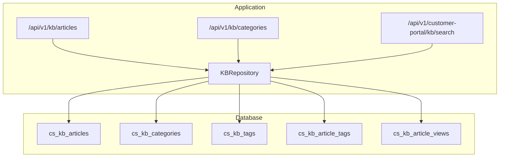
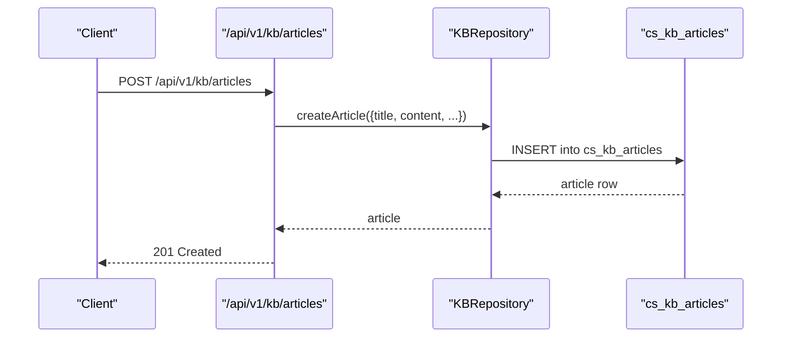
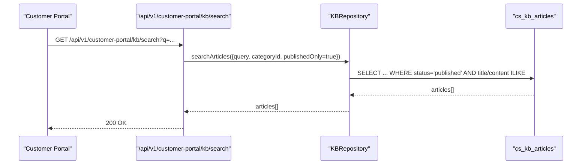
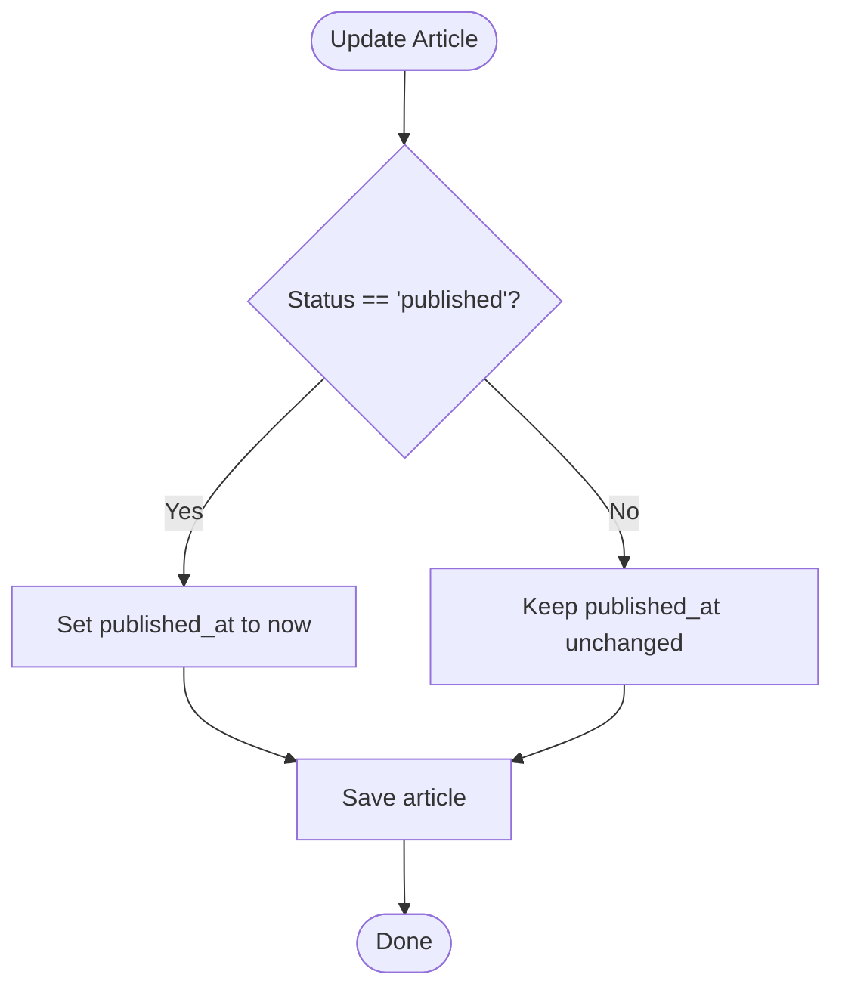
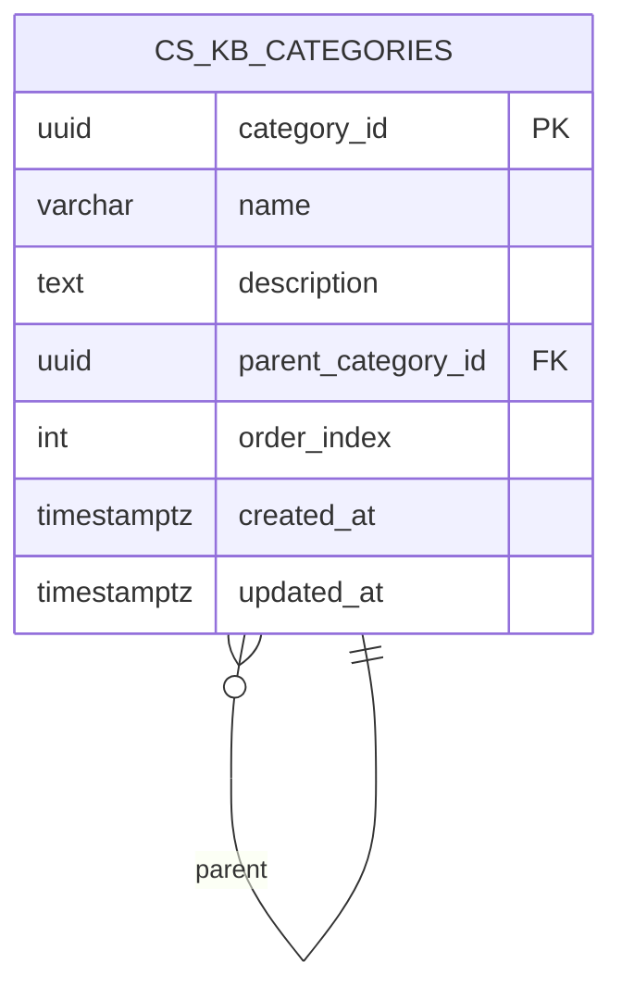
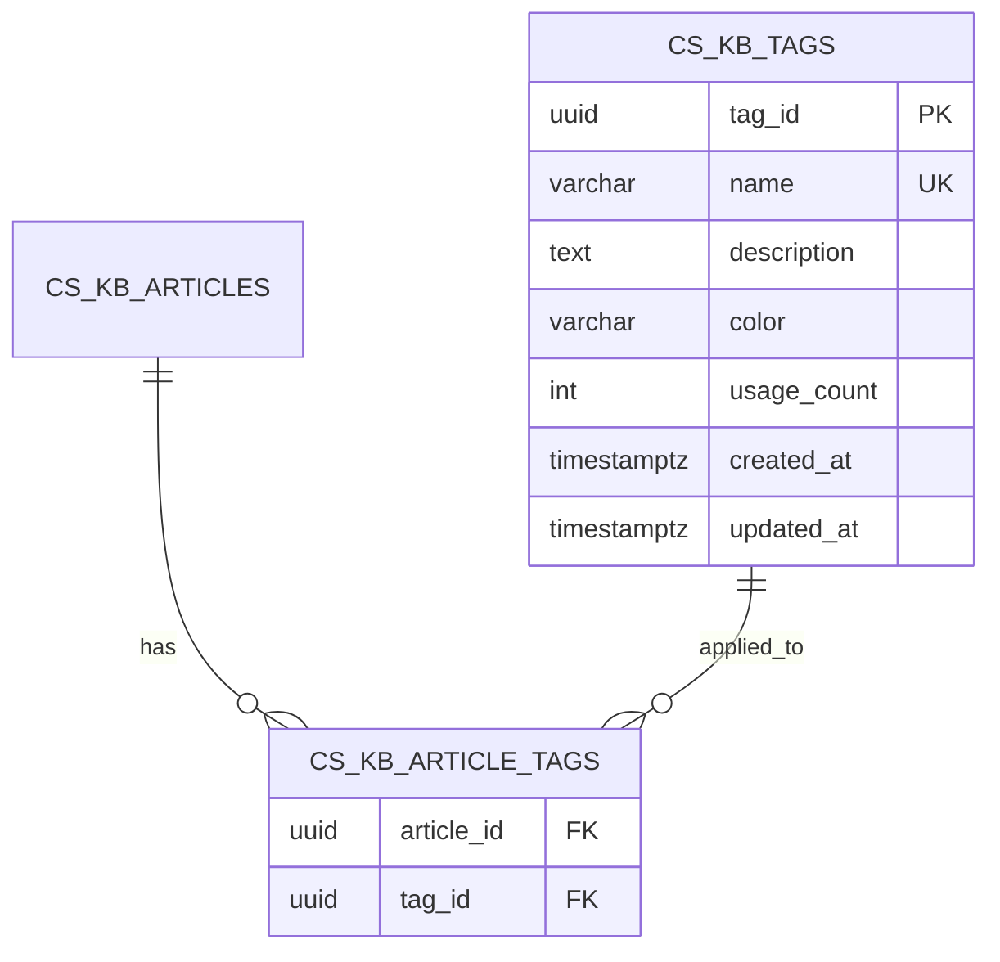
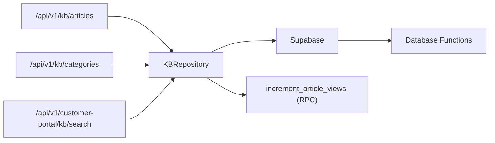

# Knowledge Base Schema

<cite>
**Referenced Files in This Document**
- [001_initial_schema.sql](file://database/migrations/001_initial_schema.sql)
- [002_missing_tables_and_service_fields.sql](file://database/migrations/002_missing_tables_and_service_fields.sql)
- [004_database_functions.sql](file://database/migrations/004_database_functions.sql)
- [005_additional_triggers.sql](file://database/migrations/005_additional_triggers.sql)
- [route.ts](file://app/api/v1/kb/articles/route.ts)
- [route.ts](file://app/api/v1/kb/categories/route.ts)
- [route.ts](file://app/api/v1/customer-portal/kb/search/route.ts)
- [kb.ts](file://lib/repositories/kb.ts)
- [database.ts](file://types/database.ts)
</cite>

## Table of Contents
1. [Introduction](#introduction)
2. [Project Structure](#project-structure)
3. [Core Components](#core-components)
4. [Architecture Overview](#architecture-overview)
5. [Detailed Component Analysis](#detailed-component-analysis)
6. [Dependency Analysis](#dependency-analysis)
7. [Performance Considerations](#performance-considerations)
8. [Troubleshooting Guide](#troubleshooting-guide)
9. [Conclusion](#conclusion)

## Introduction
This document provides comprehensive data model documentation for the knowledge base system tables. It covers the cs_kb_articles and cs_kb_categories tables, their lifecycle, content management, tagging system, view tracking, hierarchical organization, search optimization, metadata, author attribution, and publication workflows. It also explains the relationships between articles and categories and the impact of category changes on article visibility.

## Project Structure
The knowledge base schema is defined in database migration files and consumed by API routes and a repository layer:
- Database schema and indexes are defined in migration files.
- API routes expose endpoints for listing, creating, and searching knowledge base content.
- A repository layer abstracts database queries and RPC calls.
- Type definitions describe the shape of the knowledge base tables.

**Diagram sources**
- [001_initial_schema.sql](file://database/migrations/001_initial_schema.sql#L158-L193)
- [002_missing_tables_and_service_fields.sql](file://database/migrations/002_missing_tables_and_service_fields.sql#L144-L175)
- [route.ts](file://app/api/v1/kb/articles/route.ts#L1-L93)
- [route.ts](file://app/api/v1/kb/categories/route.ts#L1-L73)
- [route.ts](file://app/api/v1/customer-portal/kb/search/route.ts#L1-L66)
- [kb.ts](file://lib/repositories/kb.ts#L53-L284)

**Section sources**
- [001_initial_schema.sql](file://database/migrations/001_initial_schema.sql#L158-L193)
- [002_missing_tables_and_service_fields.sql](file://database/migrations/002_missing_tables_and_service_fields.sql#L144-L175)
- [route.ts](file://app/api/v1/kb/articles/route.ts#L1-L93)
- [route.ts](file://app/api/v1/kb/categories/route.ts#L1-L73)
- [route.ts](file://app/api/v1/customer-portal/kb/search/route.ts#L1-L66)
- [kb.ts](file://lib/repositories/kb.ts#L53-L284)

## Core Components
- cs_kb_articles: Stores knowledge base articles with lifecycle states, author attribution, metadata, and counters for views and helpfulness.
- cs_kb_categories: Hierarchical organization of articles with parent-child relationships and ordering.
- cs_kb_tags and cs_kb_article_tags: Tagging system enabling flexible categorization and filtering.
- cs_kb_article_views: Analytics for article views, including tenant and user context.

Key attributes and constraints:
- Lifecycle: draft, review, published, archived.
- Author attribution via author_id referencing users.
- Metadata stored as JSONB for extensibility.
- GIN indexes on title and content for full-text search.
- Category hierarchy via parent_category_id with ordering via order_index.

**Section sources**
- [001_initial_schema.sql](file://database/migrations/001_initial_schema.sql#L158-L193)
- [002_missing_tables_and_service_fields.sql](file://database/migrations/002_missing_tables_and_service_fields.sql#L144-L175)
- [001_initial_schema.sql](file://database/migrations/001_initial_schema.sql#L318-L327)

## Architecture Overview
The knowledge base data model supports two primary workflows:
- Internal authoring workflow: create, update, review, publish, archive articles.
- Public customer portal search: filter by category, limit to published articles, apply rate limits.

**Diagram sources**
- [route.ts](file://app/api/v1/kb/articles/route.ts#L59-L92)
- [kb.ts](file://lib/repositories/kb.ts#L140-L155)

**Diagram sources**
- [route.ts](file://app/api/v1/customer-portal/kb/search/route.ts#L11-L65)
- [kb.ts](file://lib/repositories/kb.ts#L104-L117)

## Detailed Component Analysis

### cs_kb_articles: Article Lifecycle and Content Management
- Lifecycle states: draft, review, published, archived.
- Publishing workflow:
  - On status transition to published, published_at is set automatically.
  - Published-only search is enforced in the customer portal endpoint.
- Author attribution: author_id references users.
- Content management:
  - title and content are required.
  - excerpt is optional.
  - tags is an array of text.
  - metadata is JSONB for extensibility.
- Counters: views, helpful_count, not_helpful_count.
- Search optimization: GIN indexes on title and content using to_tsvector('english').
- View tracking:
  - incrementViews uses a stored procedure increment_article_views if available; otherwise falls back to manual increment.
  - markHelpful increments helpful_count.

**Diagram sources**
- [kb.ts](file://lib/repositories/kb.ts#L160-L177)

**Section sources**
- [001_initial_schema.sql](file://database/migrations/001_initial_schema.sql#L158-L174)
- [001_initial_schema.sql](file://database/migrations/001_initial_schema.sql#L322-L323)
- [kb.ts](file://lib/repositories/kb.ts#L160-L177)
- [kb.ts](file://lib/repositories/kb.ts#L189-L211)

### cs_kb_categories: Hierarchical Organization
- Hierarchical structure via parent_category_id referencing cs_kb_categories.
- Ordering controlled by order_index.
- Categories are retrieved with order_index and name sorting.

**Diagram sources**
- [001_initial_schema.sql](file://database/migrations/001_initial_schema.sql#L180-L188)

**Section sources**
- [001_initial_schema.sql](file://database/migrations/001_initial_schema.sql#L180-L188)
- [kb.ts](file://lib/repositories/kb.ts#L216-L226)

### Tagging System: cs_kb_tags and cs_kb_article_tags
- cs_kb_tags: central registry of tags with name uniqueness, optional description, color, and usage_count.
- cs_kb_article_tags: many-to-many relationship between articles and tags.
- Indexes: name and usage_count on tags; article_id and tag_id on article_tags.

**Diagram sources**
- [002_missing_tables_and_service_fields.sql](file://database/migrations/002_missing_tables_and_service_fields.sql#L144-L161)

**Section sources**
- [002_missing_tables_and_service_fields.sql](file://database/migrations/002_missing_tables_and_service_fields.sql#L144-L161)
- [002_missing_tables_and_service_fields.sql](file://database/migrations/002_missing_tables_and_service_fields.sql#L578-L584)

### View Tracking: cs_kb_article_views
- Tracks article views with tenant_id, user_id, IP, user agent, referrer, and time_spent_seconds.
- Indexed by article_id, tenant_id, and viewed_at for efficient analytics.

**Section sources**
- [002_missing_tables_and_service_fields.sql](file://database/migrations/002_missing_tables_and_service_fields.sql#L163-L175)
- [002_missing_tables_and_service_fields.sql](file://database/migrations/002_missing_tables_and_service_fields.sql#L586-L589)

### Search Optimization: GIN Indexes on Title and Content
- Full-text search indexes on cs_kb_articles.title and content using to_tsvector('english').
- Repository search uses ILIKE patterns for keyword matching; GIN indexes improve performance for large datasets.

**Section sources**
- [001_initial_schema.sql](file://database/migrations/001_initial_schema.sql#L322-L323)
- [kb.ts](file://lib/repositories/kb.ts#L74-L75)

### Publication Workflows and Author Attribution
- Author attribution: author_id on articles references users.
- Publication workflow:
  - Default status is draft.
  - Transitioning to published sets published_at automatically.
  - Customer portal search filters by status=published.

**Section sources**
- [001_initial_schema.sql](file://database/migrations/001_initial_schema.sql#L165-L172)
- [kb.ts](file://lib/repositories/kb.ts#L163-L166)
- [route.ts](file://app/api/v1/customer-portal/kb/search/route.ts#L54-L55)

### Relationship Between Articles and Categories
- Articles reference categories via category_id with ON DELETE SET NULL, allowing articles to persist if a category is removed.
- Category changes impact visibility:
  - Removing a category does not delete articles; they remain accessible.
  - To hide articles, set status to archived or remove category_id.

**Section sources**
- [001_initial_schema.sql](file://database/migrations/001_initial_schema.sql#L190-L193)
- [kb.ts](file://lib/repositories/kb.ts#L216-L226)

### Examples and Use Cases
- Category hierarchy example:
  - Root category (parent_category_id NULL) with children using parent_category_id pointing to the root.
  - Order children by order_index for consistent presentation.
- Article categorization:
  - Assign category_id to associate an article with a category.
  - Use tags for additional classification via cs_kb_article_tags.
- Full-text search:
  - Customer portal endpoint enforces published-only results.
  - Internal endpoints support broader filters (status, category_id, search).

**Section sources**
- [001_initial_schema.sql](file://database/migrations/001_initial_schema.sql#L180-L188)
- [002_missing_tables_and_service_fields.sql](file://database/migrations/002_missing_tables_and_service_fields.sql#L144-L161)
- [route.ts](file://app/api/v1/customer-portal/kb/search/route.ts#L49-L55)

## Dependency Analysis
- API routes depend on KBRepository for data access.
- KBRepository depends on Supabase client and uses stored procedures when available.
- Stored procedures:
  - increment_article_views (RPC) for view tracking.
  - calculate_health_score, calculate_churn_risk, update_ticket_sla, log_agent_execution, track_agent_cost (functions) for related systems.

**Diagram sources**
- [kb.ts](file://lib/repositories/kb.ts#L190-L191)
- [004_database_functions.sql](file://database/migrations/004_database_functions.sql#L25-L174)

**Section sources**
- [kb.ts](file://lib/repositories/kb.ts#L190-L191)
- [004_database_functions.sql](file://database/migrations/004_database_functions.sql#L25-L174)

## Performance Considerations
- GIN indexes on title and content enable efficient full-text search.
- Additional indexes on cs_kb_tags (name, usage_count), cs_kb_article_tags (article_id, tag_id), and cs_kb_article_views (article_id, tenant_id, viewed_at) optimize tagging and analytics queries.
- Repository search uses ILIKE patterns; GIN indexes improve performance for large datasets.

**Section sources**
- [001_initial_schema.sql](file://database/migrations/001_initial_schema.sql#L322-L323)
- [002_missing_tables_and_service_fields.sql](file://database/migrations/002_missing_tables_and_service_fields.sql#L578-L589)

## Troubleshooting Guide
- Unauthorized access:
  - Internal KB endpoints require authentication; unauthorized requests return 401.
- Validation errors:
  - Article creation validates fields; Zod errors return 400 with details.
- RPC fallback:
  - If increment_article_views RPC is unavailable, KBRepository falls back to manual increment.
- Rate limiting:
  - Customer portal search enforces per-minute rate limits keyed by tenant_id.

**Section sources**
- [route.ts](file://app/api/v1/kb/articles/route.ts#L59-L92)
- [route.ts](file://app/api/v1/customer-portal/kb/search/route.ts#L33-L46)
- [kb.ts](file://lib/repositories/kb.ts#L190-L199)

## Conclusion
The knowledge base schema provides a robust foundation for article lifecycle management, hierarchical categorization, tagging, and analytics. GIN indexes and stored procedures enhance search performance and operational workflows. The separation of concerns between API routes, repository logic, and database functions ensures maintainability and scalability.