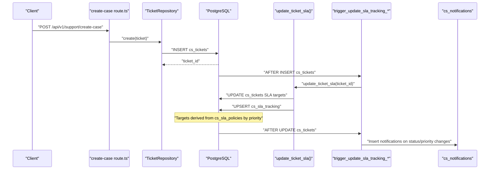
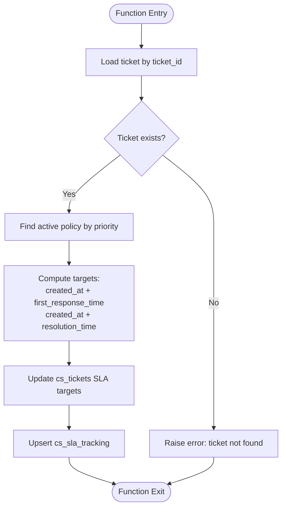
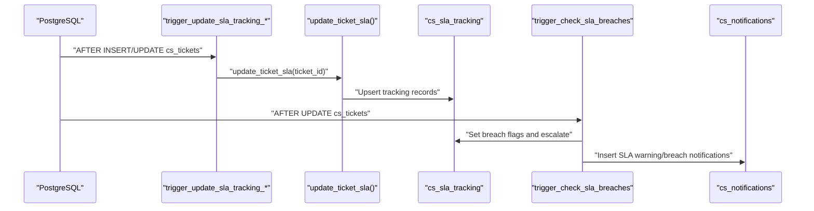
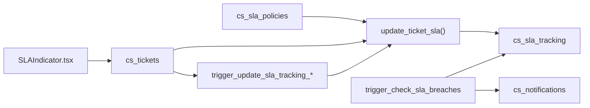

# SLA & Compliance Schema

<cite>
**Referenced Files in This Document**
- [001_initial_schema.sql](file://database/migrations/001_initial_schema.sql)
- [002_missing_tables_and_service_fields.sql](file://database/migrations/002_missing_tables_and_service_fields.sql)
- [004_database_functions.sql](file://database/migrations/004_database_functions.sql)
- [005_additional_triggers.sql](file://database/migrations/005_additional_triggers.sql)
- [seed.sql](file://database/seed.sql)
- [SLAIndicator.tsx](file://components/inbox/SLAIndicator.tsx)
- [create-case route.ts](file://app/api/v1/support/create-case/route.ts)
</cite>

## Table of Contents
1. [Introduction](#introduction)
2. [Project Structure](#project-structure)
3. [Core Components](#core-components)
4. [Architecture Overview](#architecture-overview)
5. [Detailed Component Analysis](#detailed-component-analysis)
6. [Dependency Analysis](#dependency-analysis)
7. [Performance Considerations](#performance-considerations)
8. [Troubleshooting Guide](#troubleshooting-guide)
9. [Conclusion](#conclusion)

## Introduction
This document provides comprehensive data model documentation for the Service Level Agreement (SLA) and compliance tracking tables within the CS-Support Service. It explains the cs_sla_policies table structure, priority-based SLA definitions, response and resolution time requirements, and the enforcement mechanisms that integrate with ticket lifecycle management. It also covers dynamic SLA application based on ticket priority, escalation triggers, breach detection, and notification workflows. Finally, it outlines practical examples for SLA calculation queries, breach reporting, and compliance dashboard implementations, along with policy management, versioning, and historical tracking considerations.

## Project Structure
The SLA and compliance schema is implemented across:
- Core schema definitions for tickets and SLA policies
- Supporting tables for SLA tracking, quality scoring, and notifications
- Database functions for SLA calculations and automated updates
- Triggers for SLA enforcement, breach detection, and notifications
- Frontend components for SLA visualization
- API endpoints for ticket creation and escalation

```mermaid
graph TB
subgraph "Schema"
T["cs_tickets"]
P["cs_sla_policies"]
ST["cs_sla_tracking"]
Q["cs_ticket_quality_scores"]
N["cs_notifications"]
end
subgraph "Functions"
F1["update_ticket_sla()"]
F2["log_agent_execution()"]
F3["track_agent_cost()"]
end
subgraph "Triggers"
TR1["trigger_update_sla_tracking_*"]
TR2["trigger_check_sla_breaches"]
TR3["trigger_notify_*"]
end
subgraph "UI"
UI["SLAIndicator.tsx"]
end
T --> P
T --> ST
ST --> N
F1 --> T
F1 --> ST
TR1 --> F1
TR2 --> N
TR3 --> N
UI --> T
```

**Diagram sources**
- [001_initial_schema.sql](file://database/migrations/001_initial_schema.sql#L16-L39)
- [001_initial_schema.sql](file://database/migrations/001_initial_schema.sql#L215-L225)
- [002_missing_tables_and_service_fields.sql](file://database/migrations/002_missing_tables_and_service_fields.sql#L182-L200)
- [004_database_functions.sql](file://database/migrations/004_database_functions.sql#L389-L478)
- [005_additional_triggers.sql](file://database/migrations/005_additional_triggers.sql#L244-L297)
- [005_additional_triggers.sql](file://database/migrations/005_additional_triggers.sql#L300-L430)
- [005_additional_triggers.sql](file://database/migrations/005_additional_triggers.sql#L495-L594)
- [SLAIndicator.tsx](file://components/inbox/SLAIndicator.tsx#L15-L147)

**Section sources**
- [001_initial_schema.sql](file://database/migrations/001_initial_schema.sql#L16-L39)
- [001_initial_schema.sql](file://database/migrations/001_initial_schema.sql#L215-L225)
- [002_missing_tables_and_service_fields.sql](file://database/migrations/002_missing_tables_and_service_fields.sql#L182-L200)
- [004_database_functions.sql](file://database/migrations/004_database_functions.sql#L389-L478)
- [005_additional_triggers.sql](file://database/migrations/005_additional_triggers.sql#L244-L297)
- [005_additional_triggers.sql](file://database/migrations/005_additional_triggers.sql#L300-L430)
- [005_additional_triggers.sql](file://database/migrations/005_additional_triggers.sql#L495-L594)
- [SLAIndicator.tsx](file://components/inbox/SLAIndicator.tsx#L15-L147)

## Core Components
- cs_sla_policies: Defines SLA policy tiers by priority with first-response and resolution time intervals, plus activation flag and audit timestamps.
- cs_sla_tracking: Tracks per-ticket SLA targets, actual outcomes, breach flags, escalation state, and warning notifications.
- cs_tickets: Contains ticket metadata, priority, status, and SLA target fields populated by SLA policy application.
- cs_notifications: Stores SLA-related notifications (warnings, breaches, escalations) for agents.
- Database functions: update_ticket_sla() applies policy-based SLA targets to tickets and maintains tracking records.
- Triggers: Automate SLA application on ticket creation/update, detect breaches, and send notifications.
- Frontend component: SLAIndicator.tsx visualizes SLA status for first response and resolution.

**Section sources**
- [001_initial_schema.sql](file://database/migrations/001_initial_schema.sql#L215-L225)
- [002_missing_tables_and_service_fields.sql](file://database/migrations/002_missing_tables_and_service_fields.sql#L182-L200)
- [001_initial_schema.sql](file://database/migrations/001_initial_schema.sql#L16-L39)
- [004_database_functions.sql](file://database/migrations/004_database_functions.sql#L389-L478)
- [005_additional_triggers.sql](file://database/migrations/005_additional_triggers.sql#L244-L297)
- [005_additional_triggers.sql](file://database/migrations/005_additional_triggers.sql#L300-L430)
- [SLAIndicator.tsx](file://components/inbox/SLAIndicator.tsx#L15-L147)

## Architecture Overview
The SLA enforcement pipeline integrates schema, functions, and triggers to automatically apply policies, compute targets, monitor breaches, and notify stakeholders. The frontend consumes ticket SLA fields to present real-time SLA status.



**Diagram sources**
- [create-case route.ts](file://app/api/v1/support/create-case/route.ts#L14-L60)
- [004_database_functions.sql](file://database/migrations/004_database_functions.sql#L389-L478)
- [005_additional_triggers.sql](file://database/migrations/005_additional_triggers.sql#L244-L297)
- [005_additional_triggers.sql](file://database/migrations/005_additional_triggers.sql#L495-L594)

## Detailed Component Analysis

### cs_sla_policies
- Purpose: Define SLA policy tiers by priority with first-response and resolution time intervals.
- Key fields:
  - policy_id: Unique identifier
  - name, description: Human-readable policy metadata
  - priority: Enumerated priority level (low, medium, high, urgent)
  - first_response_time, resolution_time: Intervals defining SLA targets
  - is_active: Policy activation flag
  - created_at, updated_at: Audit timestamps
- Notes:
  - Policies are matched by ticket priority during SLA application.
  - Default SLA is applied if no active policy matches.

**Section sources**
- [001_initial_schema.sql](file://database/migrations/001_initial_schema.sql#L215-L225)
- [seed.sql](file://database/seed.sql#L47-L51)

### cs_sla_tracking
- Purpose: Per-ticket SLA tracking with targets, actual outcomes, breach flags, escalation state, and warning notifications.
- Key fields:
  - tracking_id: Unique identifier
  - ticket_id: Foreign key to cs_tickets
  - policy_id: Foreign key to cs_sla_policies (optional)
  - first_response_target, resolution_target: Timestamp targets
  - first_response_actual, resolution_actual: Actual achievement timestamps
  - first_response_breached, resolution_breached: Breach flags
  - first_response_breached_at, resolution_breached_at: Breach timestamps
  - warning_sent, warning_sent_at: Warning notification state
  - escalated, escalated_at: Escalation state
  - created_at, updated_at: Audit timestamps
- Behavior:
  - Targets are computed on ticket creation/update based on priority and policy.
  - Breach flags and escalation are updated upon resolution or on-time achievement.

**Section sources**
- [002_missing_tables_and_service_fields.sql](file://database/migrations/002_missing_tables_and_service_fields.sql#L182-L200)

### cs_tickets (SLA fields)
- Purpose: Store ticket-level SLA fields that are populated by SLA policy application.
- Key SLA-related fields:
  - sla_first_response_target: First response SLA target timestamp
  - sla_resolution_target: Resolution SLA target timestamp
- Integration:
  - Populated by update_ticket_sla() and maintained by triggers on ticket updates.

**Section sources**
- [001_initial_schema.sql](file://database/migrations/001_initial_schema.sql#L16-L39)
- [004_database_functions.sql](file://database/migrations/004_database_functions.sql#L389-L478)
- [005_additional_triggers.sql](file://database/migrations/005_additional_triggers.sql#L244-L297)

### update_ticket_sla() function
- Purpose: Apply SLA policy to a ticket and maintain cs_sla_tracking.
- Steps:
  - Retrieve ticket priority and timestamps.
  - Match active policy by priority.
  - Compute first_response_target and resolution_target from created_at plus policy intervals.
  - Update cs_tickets with SLA targets.
  - Upsert cs_sla_tracking with policy_id and targets.
- Defaults:
  - If no active policy matches, default targets are applied.



**Diagram sources**
- [004_database_functions.sql](file://database/migrations/004_database_functions.sql#L389-L478)

**Section sources**
- [004_database_functions.sql](file://database/migrations/004_database_functions.sql#L389-L478)

### Trigger-based SLA enforcement and breach detection
- trigger_update_sla_tracking_*:
  - Runs after INSERT or UPDATE on cs_tickets when priority/status changes.
  - Calls update_ticket_sla() to refresh targets.
  - On resolution/closure, sets actual resolution time and marks breaches if applicable.
- trigger_check_sla_breaches:
  - Checks remaining time until SLA targets.
  - Sends SLA warnings within a configurable threshold (e.g., 1 hour).
  - Flags breaches and escalates tickets when targets are exceeded.
  - Inserts notifications for assigned agents.
- trigger_notify_*:
  - Creates notifications for ticket assignment, status changes, and escalations.



**Diagram sources**
- [005_additional_triggers.sql](file://database/migrations/005_additional_triggers.sql#L244-L297)
- [005_additional_triggers.sql](file://database/migrations/005_additional_triggers.sql#L300-L430)
- [005_additional_triggers.sql](file://database/migrations/005_additional_triggers.sql#L495-L594)

**Section sources**
- [005_additional_triggers.sql](file://database/migrations/005_additional_triggers.sql#L244-L297)
- [005_additional_triggers.sql](file://database/migrations/005_additional_triggers.sql#L300-L430)
- [005_additional_triggers.sql](file://database/migrations/005_additional_triggers.sql#L495-L594)

### Frontend SLA visualization
- SLAIndicator.tsx:
  - Computes first response and resolution SLA status based on targets, actual timestamps, and creation time.
  - Displays badges for on-time, warning, and breach states.
  - Shows remaining time or achieved time for each SLA dimension.

**Section sources**
- [SLAIndicator.tsx](file://components/inbox/SLAIndicator.tsx#L15-L147)

### API integration for ticket creation and escalation
- create-case route.ts:
  - Creates a support case with priority defaults and metadata indicating escalation context.
  - Links to a conversation if provided.
  - Triggers SLA application and notifications via backend triggers.

**Section sources**
- [create-case route.ts](file://app/api/v1/support/create-case/route.ts#L14-L60)

## Dependency Analysis
- Schema dependencies:
  - cs_tickets depends on cs_sla_policies for SLA target computation.
  - cs_sla_tracking depends on cs_tickets and optionally cs_sla_policies.
  - cs_notifications depends on cs_tickets and cs_sla_tracking for breach/escalation events.
- Function and trigger dependencies:
  - update_ticket_sla() is invoked by triggers on cs_tickets.
  - trigger_check_sla_breaches writes to cs_sla_tracking and cs_notifications.
- Frontend dependency:
  - SLAIndicator.tsx reads cs_tickets SLA fields for rendering.



**Diagram sources**
- [001_initial_schema.sql](file://database/migrations/001_initial_schema.sql#L215-L225)
- [001_initial_schema.sql](file://database/migrations/001_initial_schema.sql#L16-L39)
- [002_missing_tables_and_service_fields.sql](file://database/migrations/002_missing_tables_and_service_fields.sql#L182-L200)
- [004_database_functions.sql](file://database/migrations/004_database_functions.sql#L389-L478)
- [005_additional_triggers.sql](file://database/migrations/005_additional_triggers.sql#L244-L297)
- [005_additional_triggers.sql](file://database/migrations/005_additional_triggers.sql#L300-L430)
- [SLAIndicator.tsx](file://components/inbox/SLAIndicator.tsx#L15-L147)

**Section sources**
- [001_initial_schema.sql](file://database/migrations/001_initial_schema.sql#L16-L39)
- [001_initial_schema.sql](file://database/migrations/001_initial_schema.sql#L215-L225)
- [002_missing_tables_and_service_fields.sql](file://database/migrations/002_missing_tables_and_service_fields.sql#L182-L200)
- [004_database_functions.sql](file://database/migrations/004_database_functions.sql#L389-L478)
- [005_additional_triggers.sql](file://database/migrations/005_additional_triggers.sql#L244-L297)
- [005_additional_triggers.sql](file://database/migrations/005_additional_triggers.sql#L300-L430)
- [SLAIndicator.tsx](file://components/inbox/SLAIndicator.tsx#L15-L147)

## Performance Considerations
- Indexes:
  - cs_tickets: created_at, priority, status, assigned_to
  - cs_sla_tracking: ticket_id, policy_id, breached flags, escalation state
  - cs_notifications: user_id, ticket_id, type, read status
- Function and trigger efficiency:
  - update_ticket_sla() performs minimal lookups and UPSERTs; ensure indexes on cs_sla_policies priority and cs_tickets primary key.
  - Breach checks in triggers should be scoped to open/in-progress tickets and only when relevant fields change.
- Frontend rendering:
  - SLAIndicator.tsx computes differences client-side; ensure timestamps are passed efficiently from the backend.

[No sources needed since this section provides general guidance]

## Troubleshooting Guide
- SLA targets not applying:
  - Verify cs_sla_policies has active policies for the ticket priority.
  - Confirm trigger_update_sla_tracking_* fires on INSERT/UPDATE with priority/status changes.
- Breach notifications not sent:
  - Ensure trigger_check_sla_breaches runs on UPDATE and that assigned_to is populated.
  - Check cs_notifications insertion logic and user availability.
- Incorrect SLA status in UI:
  - Validate SLAIndicator.tsx receives correct SLA target and actual timestamps from the backend.
  - Confirm cs_tickets SLA fields are being updated by update_ticket_sla().

**Section sources**
- [005_additional_triggers.sql](file://database/migrations/005_additional_triggers.sql#L244-L297)
- [005_additional_triggers.sql](file://database/migrations/005_additional_triggers.sql#L300-L430)
- [005_additional_triggers.sql](file://database/migrations/005_additional_triggers.sql#L495-L594)
- [SLAIndicator.tsx](file://components/inbox/SLAIndicator.tsx#L15-L147)

## Conclusion
The SLA and compliance schema integrates policy-driven SLA application, automated tracking, breach detection, and notifications into the ticket lifecycle. The cs_sla_policies table defines priority-based SLA definitions, while cs_sla_tracking and cs_tickets persist computed targets and outcomes. Database functions and triggers enforce SLA application and escalation, and the frontend provides real-time SLA visibility. Together, these components enable robust SLA compliance tracking and actionable insights for support teams.