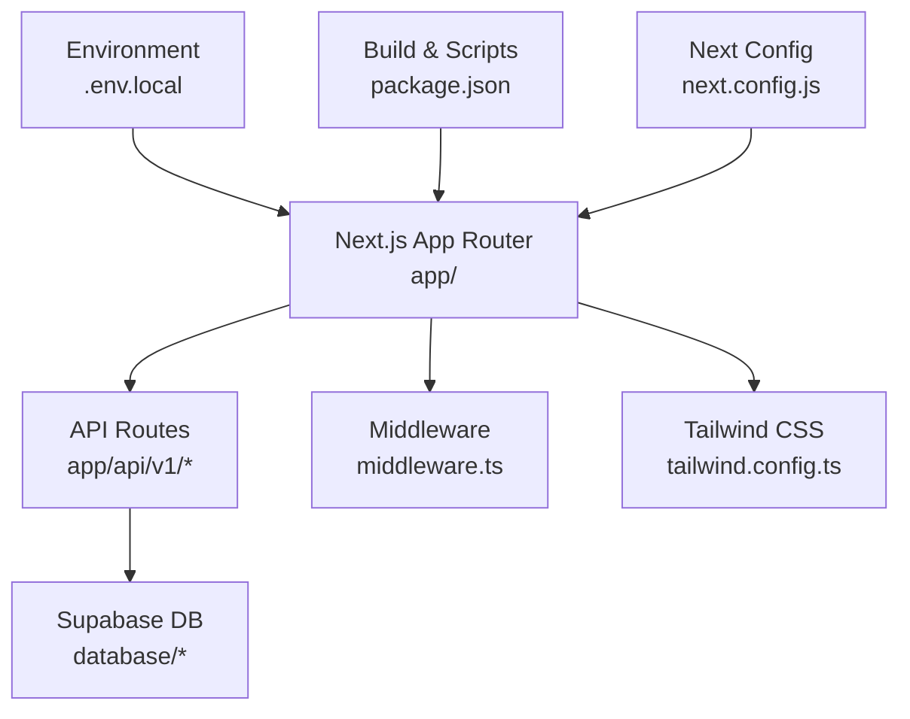
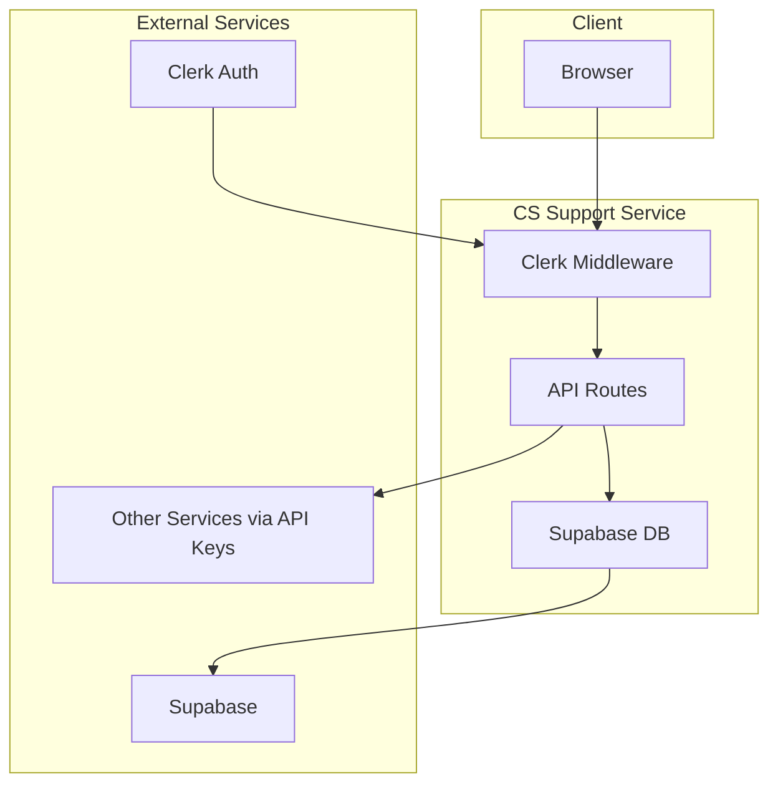
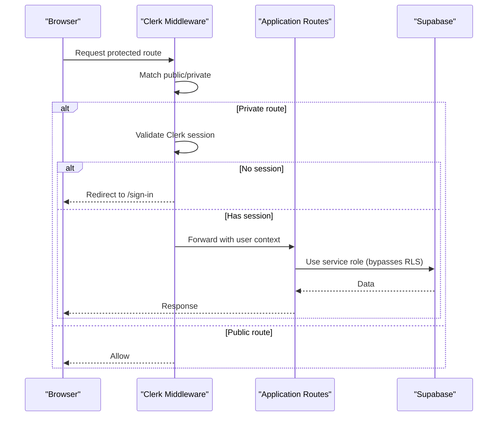
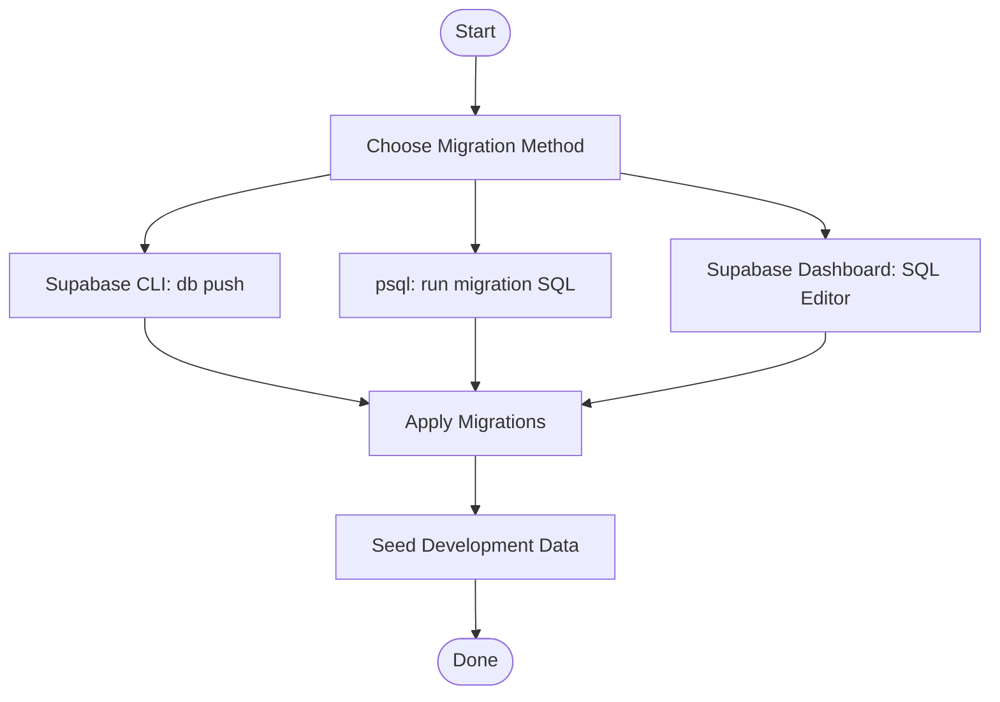
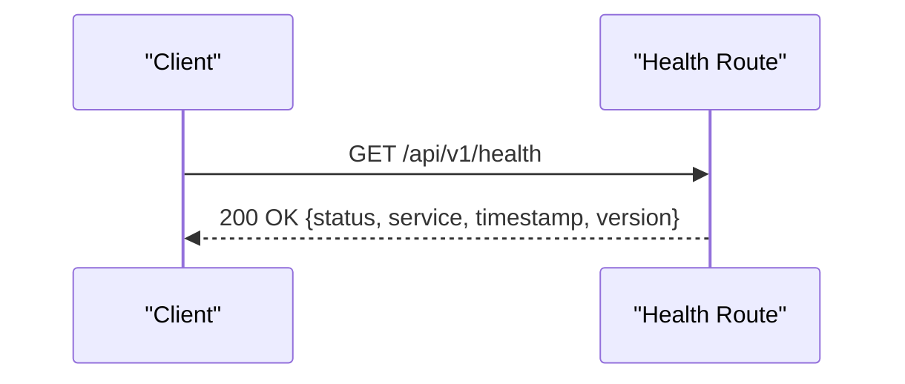
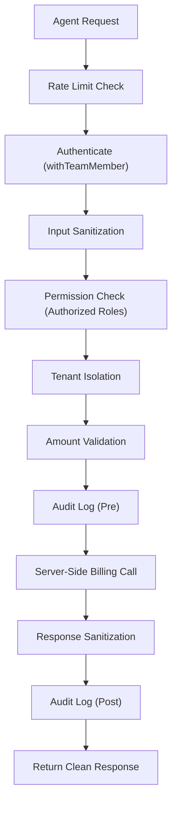
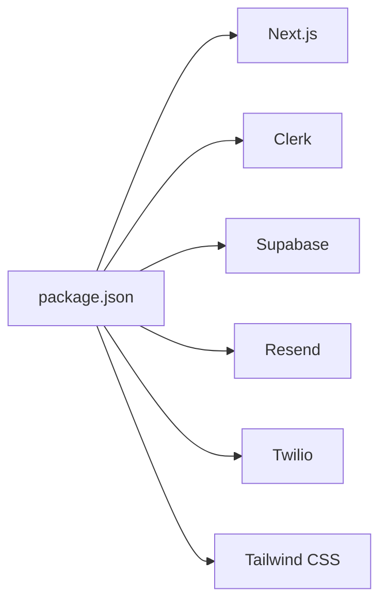

# Deployment & Operations

<cite>
**Referenced Files in This Document**
- [package.json](file://package.json)
- [next.config.js](file://next.config.js)
- [README.md](file://README.md)
- [.env.local](file://.env.local)
- [middleware.ts](file://middleware.ts)
- [app/api/v1/health/route.ts](file://app/api/v1/health/route.ts)
- [database/README.md](file://database/README.md)
- [database/seed.sql](file://database/seed.sql)
- [scripts/run-seed-sql.ps1](file://scripts/run-seed-sql.ps1)
- [docs/setup/AUTHENTICATION_ARCHITECTURE.md](file://docs/setup/AUTHENTICATION_ARCHITECTURE.md)
- [docs/setup/BILLING_SECURITY_MODEL.md](file://docs/setup/BILLING_SECURITY_MODEL.md)
- [docs/API_DOCUMENTATION.md](file://docs/API_DOCUMENTATION.md)
- [tailwind.config.ts](file://tailwind.config.ts)
</cite>

## Table of Contents
1. [Introduction](#introduction)
2. [Project Structure](#project-structure)
3. [Core Components](#core-components)
4. [Architecture Overview](#architecture-overview)
5. [Detailed Component Analysis](#detailed-component-analysis)
6. [Dependency Analysis](#dependency-analysis)
7. [Performance Considerations](#performance-considerations)
8. [Troubleshooting Guide](#troubleshooting-guide)
9. [Conclusion](#conclusion)
10. [Appendices](#appendices)

## Introduction
This document provides comprehensive deployment and operations guidance for the CS Support Service. It covers build configuration, environment setup, deployment strategies, production optimization, environment variable management, database migration and seeding, monitoring and logging, performance tuning, troubleshooting, rollback procedures, scaling, backups, disaster recovery, and operational runbooks.

## Project Structure
The CS Support Service is a Next.js 14+ application using the App Router. It includes:
- Frontend pages and components under app/
- Backend API routes under app/api/v1/**
- Authentication middleware under middleware.ts
- Database schema and migrations under database/
- Operational scripts under scripts/
- Documentation under docs/

**Diagram sources**
- [middleware.ts](file://middleware.ts#L1-L30)
- [next.config.js](file://next.config.js#L1-L13)
- [tailwind.config.ts](file://tailwind.config.ts#L1-L62)
- [database/README.md](file://database/README.md#L1-L66)

**Section sources**
- [README.md](file://README.md#L1-L67)
- [package.json](file://package.json#L1-L65)
- [next.config.js](file://next.config.js#L1-L13)

## Core Components
- Build and runtime scripts: npm run build, start, dev, lint, tests.
- Next.js configuration: strict mode, server actions body size limit.
- Authentication: Clerk-based middleware enforcing protected routes.
- Database: Supabase PostgreSQL with migrations and seed data.
- API health endpoint for readiness/liveness checks.
- Tailwind CSS configuration for design tokens and content scanning.

**Section sources**
- [package.json](file://package.json#L5-L26)
- [next.config.js](file://next.config.js#L2-L9)
- [middleware.ts](file://middleware.ts#L1-L30)
- [database/README.md](file://database/README.md#L1-L66)
- [app/api/v1/health/route.ts](file://app/api/v1/health/route.ts#L1-L12)
- [tailwind.config.ts](file://tailwind.config.ts#L1-L62)

## Architecture Overview
The service runs as a standalone Next.js application with:
- Own frontend (Next.js App Router)
- Own backend (Next.js API Routes)
- Own database (Supabase PostgreSQL schema)
- Independent deployment

**Diagram sources**
- [middleware.ts](file://middleware.ts#L1-L30)
- [docs/setup/AUTHENTICATION_ARCHITECTURE.md](file://docs/setup/AUTHENTICATION_ARCHITECTURE.md#L1-L166)
- [docs/API_DOCUMENTATION.md](file://docs/API_DOCUMENTATION.md#L1-L547)

## Detailed Component Analysis

### Build and Production Optimization
- Build process: next build generates optimized static assets and server code.
- Runtime: next start serves the production bundle on the configured port.
- Strict mode: React strict mode enabled for development-time checks.
- Server Actions body size limit: Increased to support larger payloads.

Operational steps:
- Build: npm run build
- Start: npm run start
- Port: default 3003 (development and production)

**Section sources**
- [package.json](file://package.json#L5-L10)
- [next.config.js](file://next.config.js#L2-L9)
- [README.md](file://README.md#L29-L31)

### Environment Variable Management
Critical environment variables include:
- Supabase: project identifiers, URLs, database URLs, service role keys
- Clerk: publishable and secret keys
- Service API keys for inter-service communication
- Third-party integrations: SendGrid, Resend, Twilio, Deepgram, Cartesia, LLM providers
- Vault provider and key rotation settings

Guidelines:
- Keep .env.local out of version control (.gitignore).
- Use separate keys per environment.
- Rotate keys periodically per vault settings.
- Never expose service role keys to clients.

**Section sources**
- [.env.local](file://.env.local#L1-L209)
- [docs/setup/AUTHENTICATION_ARCHITECTURE.md](file://docs/setup/AUTHENTICATION_ARCHITECTURE.md#L124-L135)

### Authentication and Authorization
- Clerk middleware protects routes and redirects unauthenticated users to sign-in.
- Public routes include sign-in/sign-up, home, help, test, webhooks, and unsubscribe.
- Authorization enforced in application code; service role bypasses RLS for database operations.

**Diagram sources**
- [middleware.ts](file://middleware.ts#L14-L22)
- [docs/setup/AUTHENTICATION_ARCHITECTURE.md](file://docs/setup/AUTHENTICATION_ARCHITECTURE.md#L32-L47)

**Section sources**
- [middleware.ts](file://middleware.ts#L1-L30)
- [docs/setup/AUTHENTICATION_ARCHITECTURE.md](file://docs/setup/AUTHENTICATION_ARCHITECTURE.md#L1-L166)

### Database Migrations and Seed Data
- Migrations: Managed via Supabase CLI or psql; initial schema plus evolving features.
- Seed data: Provided for development/testing; includes team members, SLAs, KB categories/articles, sample tickets/messages, activity feed entries, and customer health scores.

**Diagram sources**
- [database/README.md](file://database/README.md#L9-L32)
- [database/seed.sql](file://database/seed.sql#L1-L363)

Operational steps:
- Apply migrations using Supabase CLI or psql.
- Seed development data using provided scripts or SQL.

**Section sources**
- [database/README.md](file://database/README.md#L1-L66)
- [database/seed.sql](file://database/seed.sql#L1-L363)
- [scripts/run-seed-sql.ps1](file://scripts/run-seed-sql.ps1#L1-L43)

### API Endpoints and Monitoring
- Health endpoint: GET /api/v1/health returns service status, version, and timestamp.
- API documentation: Comprehensive endpoints, authentication, rate limits, pagination, and error handling.

**Diagram sources**
- [app/api/v1/health/route.ts](file://app/api/v1/health/route.ts#L1-L12)
- [docs/API_DOCUMENTATION.md](file://docs/API_DOCUMENTATION.md#L1-L547)

**Section sources**
- [app/api/v1/health/route.ts](file://app/api/v1/health/route.ts#L1-L12)
- [docs/API_DOCUMENTATION.md](file://docs/API_DOCUMENTATION.md#L1-L547)

### Security Model for Billing Operations
- Proxy pattern: All billing operations are executed server-side via CS Support API endpoints.
- Strict authorization: Only specific roles can modify billing; others can view read-only.
- Rate limiting, input validation, audit logging, timeouts, SSRF protections, and response sanitization.

**Diagram sources**
- [docs/setup/BILLING_SECURITY_MODEL.md](file://docs/setup/BILLING_SECURITY_MODEL.md#L18-L41)

**Section sources**
- [docs/setup/BILLING_SECURITY_MODEL.md](file://docs/setup/BILLING_SECURITY_MODEL.md#L1-L387)

## Dependency Analysis
- Next.js 14+ with App Router
- Clerk for authentication
- Supabase for database and auth
- Resend for email
- Twilio for voice/SMS
- Tailwind CSS for styling

**Diagram sources**
- [package.json](file://package.json#L27-L44)

**Section sources**
- [package.json](file://package.json#L1-L65)

## Performance Considerations
- Enable production builds and start the server for optimal performance.
- Use Tailwind’s content configuration to scope scanning for smaller bundles.
- Monitor API rate limits and implement client-side retry/backoff strategies.
- Keep database indexes aligned with query patterns (as defined in migration documentation).
- Consider caching for read-heavy endpoints where appropriate.

**Section sources**
- [tailwind.config.ts](file://tailwind.config.ts#L4-L8)
- [docs/API_DOCUMENTATION.md](file://docs/API_DOCUMENTATION.md#L421-L451)
- [database/README.md](file://database/README.md#L51-L57)

## Troubleshooting Guide
Common deployment and runtime issues:

- Clerk authentication redirect loop
  - Ensure NEXT_PUBLIC_CLERK_PUBLISHABLE_KEY and CLERK_SECRET_KEY are set.
  - Verify middleware matcher and public routes configuration.

- Database connection failures
  - Validate Supabase project URL and service role key.
  - Confirm migrations applied and schema exists.

- Health endpoint returns error
  - Check service startup logs.
  - Verify environment variables and database connectivity.

- Rate limit exceeded
  - Implement client-side retry with backoff.
  - Review API documentation for per-endpoint limits.

- Seed data not applied
  - Use Supabase Dashboard SQL Editor or psql to run seed SQL.
  - Confirm session pooler or direct database URL is correct.

Rollback procedures:
- Revert to previous container image/tag.
- Rollback database to last known good migration.
- Reapply seed data if necessary.

Maintenance tasks:
- Regular key rotation per vault settings.
- Review and update third-party API keys.
- Monitor billing proxy logs for anomalies.

**Section sources**
- [middleware.ts](file://middleware.ts#L1-L30)
- [.env.local](file://.env.local#L14-L23)
- [app/api/v1/health/route.ts](file://app/api/v1/health/route.ts#L1-L12)
- [docs/API_DOCUMENTATION.md](file://docs/API_DOCUMENTATION.md#L421-L451)
- [scripts/run-seed-sql.ps1](file://scripts/run-seed-sql.ps1#L1-L43)
- [docs/setup/BILLING_SECURITY_MODEL.md](file://docs/setup/BILLING_SECURITY_MODEL.md#L112-L158)

## Conclusion
This guide consolidates deployment and operations practices for the CS Support Service. By following the outlined build, environment, database, security, monitoring, and maintenance procedures, teams can reliably deploy, operate, and scale the service while maintaining strong security and performance.

## Appendices

### Environment Variables Reference
- Supabase: project identifiers, URLs, database URLs, service role keys
- Clerk: publishable and secret keys
- Inter-service API keys
- Email/SMS/Twilio credentials
- LLM provider keys
- Vault provider and key rotation settings

**Section sources**
- [.env.local](file://.env.local#L14-L209)

### Database Schema Overview
- Tables: tickets, messages, team activity feed, performance metrics, email logs, notifications, knowledge base, health scores, SLAs, surveys, team members.
- Indexes: foreign keys, filters, date ranges, full-text search.
- RLS: policies exist as safety net; service role bypasses enforcement.

**Section sources**
- [database/README.md](file://database/README.md#L33-L66)