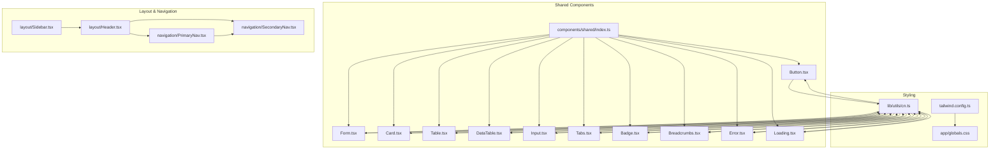
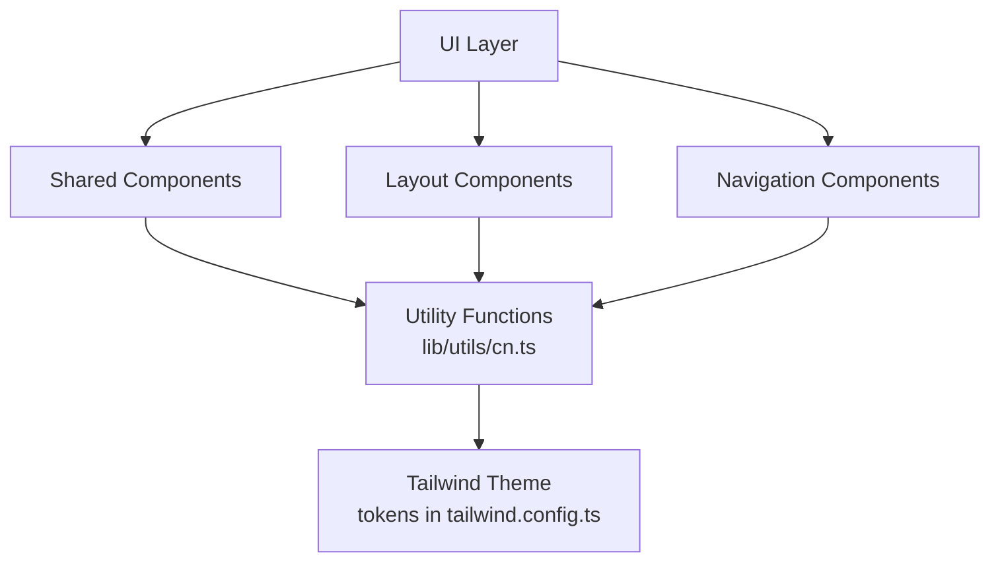
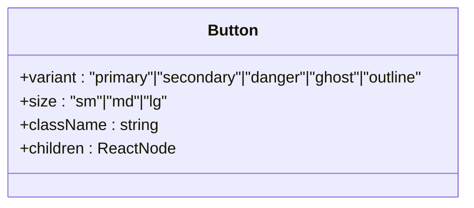
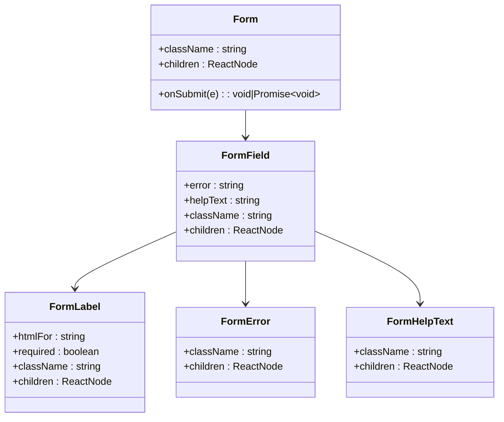
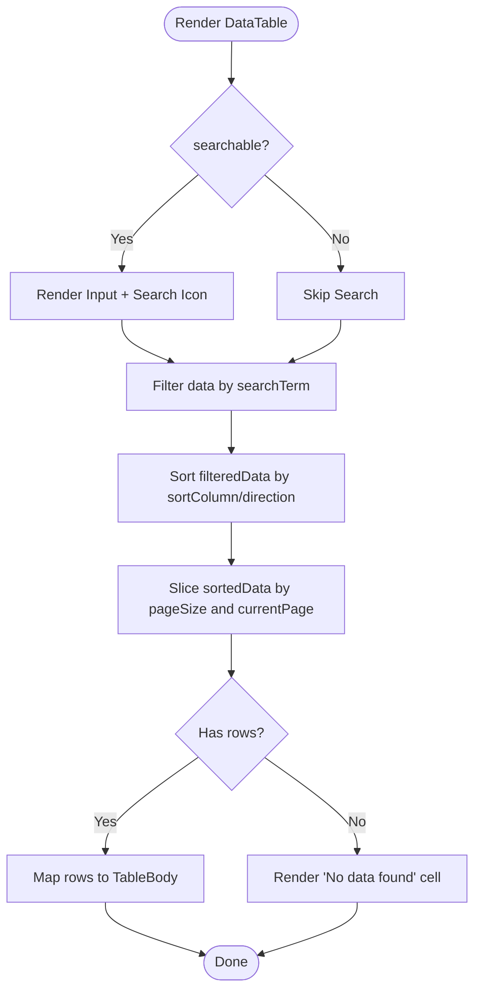
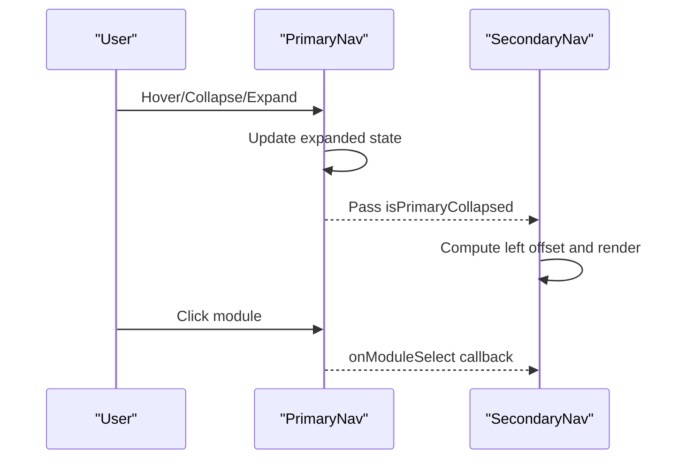
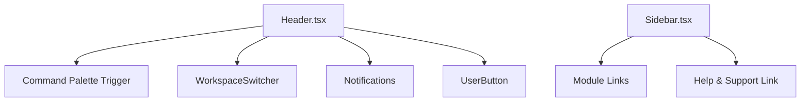
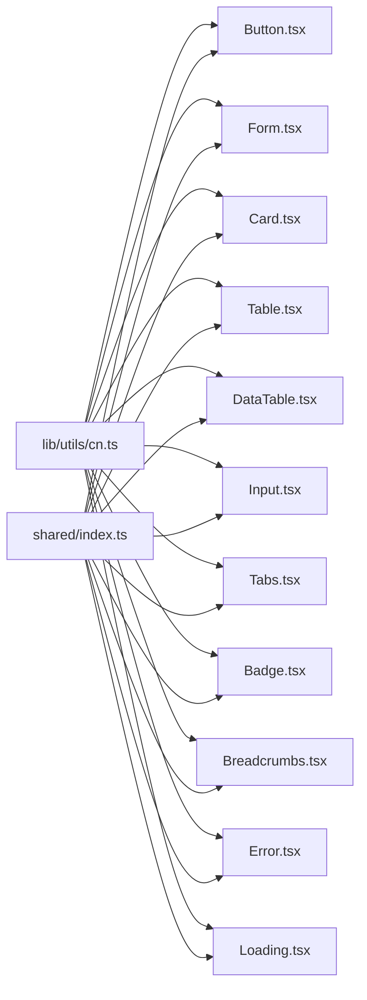

# Frontend Components & UI

<cite>
**Referenced Files in This Document**
- [components/shared/index.ts](file://components/shared/index.ts)
- [components/shared/Button.tsx](file://components/shared/Button.tsx)
- [components/shared/Form.tsx](file://components/shared/Form.tsx)
- [components/shared/Card.tsx](file://components/shared/Card.tsx)
- [components/shared/Table.tsx](file://components/shared/Table.tsx)
- [components/shared/DataTable.tsx](file://components/shared/DataTable.tsx)
- [components/shared/Input.tsx](file://components/shared/Input.tsx)
- [components/shared/Tabs.tsx](file://components/shared/Tabs.tsx)
- [components/shared/Badge.tsx](file://components/shared/Badge.tsx)
- [components/shared/Breadcrumbs.tsx](file://components/shared/Breadcrumbs.tsx)
- [components/shared/Error.tsx](file://components/shared/Error.tsx)
- [components/shared/Loading.tsx](file://components/shared/Loading.tsx)
- [components/navigation/PrimaryNav.tsx](file://components/navigation/PrimaryNav.tsx)
- [components/navigation/SecondaryNav.tsx](file://components/navigation/SecondaryNav.tsx)
- [components/layout/Header.tsx](file://components/layout/Header.tsx)
- [components/layout/Sidebar.tsx](file://components/layout/Sidebar.tsx)
- [tailwind.config.ts](file://tailwind.config.ts)
- [app/globals.css](file://app/globals.css)
- [lib/utils/cn.ts](file://lib/utils/cn.ts)
</cite>

## Table of Contents
1. [Introduction](#introduction)
2. [Project Structure](#project-structure)
3. [Core Components](#core-components)
4. [Architecture Overview](#architecture-overview)
5. [Detailed Component Analysis](#detailed-component-analysis)
6. [Dependency Analysis](#dependency-analysis)
7. [Performance Considerations](#performance-considerations)
8. [Troubleshooting Guide](#troubleshooting-guide)
9. [Conclusion](#conclusion)
10. [Appendices](#appendices)

## Introduction
This document describes the frontend component library and user interface system used across the application. It focuses on reusable UI components (buttons, forms, cards, tables, navigation), component architecture, prop interfaces, Tailwind CSS styling patterns, responsive design, layout components, navigation systems, interactive elements, composition patterns, state management integration, accessibility, usage examples via code snippet paths, design system and theme management, testing strategies, performance optimization, and browser compatibility.

## Project Structure
The UI system is organized around a shared component library under components/shared and complementary layout/navigation components under components/layout and components/navigation. Styling leverages Tailwind CSS with a centralized theme configuration and a utility class merger helper.

**Diagram sources**
- [components/shared/index.ts](file://components/shared/index.ts#L1-L19)
- [components/shared/Button.tsx](file://components/shared/Button.tsx#L1-L43)
- [components/shared/Form.tsx](file://components/shared/Form.tsx#L1-L92)
- [components/shared/Card.tsx](file://components/shared/Card.tsx#L1-L22)
- [components/shared/Table.tsx](file://components/shared/Table.tsx#L1-L87)
- [components/shared/DataTable.tsx](file://components/shared/DataTable.tsx#L1-L211)
- [components/shared/Input.tsx](file://components/shared/Input.tsx#L1-L28)
- [components/shared/Tabs.tsx](file://components/shared/Tabs.tsx#L1-L71)
- [components/shared/Badge.tsx](file://components/shared/Badge.tsx#L1-L32)
- [components/shared/Breadcrumbs.tsx](file://components/shared/Breadcrumbs.tsx#L1-L52)
- [components/shared/Error.tsx](file://components/shared/Error.tsx#L1-L17)
- [components/shared/Loading.tsx](file://components/shared/Loading.tsx#L1-L9)
- [components/layout/Header.tsx](file://components/layout/Header.tsx#L1-L58)
- [components/layout/Sidebar.tsx](file://components/layout/Sidebar.tsx#L1-L79)
- [components/navigation/PrimaryNav.tsx](file://components/navigation/PrimaryNav.tsx#L1-L130)
- [components/navigation/SecondaryNav.tsx](file://components/navigation/SecondaryNav.tsx#L1-L137)
- [tailwind.config.ts](file://tailwind.config.ts)
- [app/globals.css](file://app/globals.css)
- [lib/utils/cn.ts](file://lib/utils/cn.ts)

**Section sources**
- [components/shared/index.ts](file://components/shared/index.ts#L1-L19)
- [tailwind.config.ts](file://tailwind.config.ts)
- [app/globals.css](file://app/globals.css)
- [lib/utils/cn.ts](file://lib/utils/cn.ts)

## Core Components
This section documents the shared component library and its props, rendering patterns, and Tailwind-based styling.

- Button
  - Purpose: Standard action element with variants and sizes.
  - Props: variant, size, children, plus native button attributes.
  - Variants: primary, secondary, danger, ghost, outline.
  - Sizes: sm, md, lg.
  - Accessibility: Inherits native button semantics; focus ring applied via theme tokens.
  - Example usage: [Button usage](file://components/shared/Button.tsx#L10-L41)

- Form and Form Helpers
  - Purpose: Encapsulates form submission handling and field grouping with labels, errors, and help text.
  - Props: Form, FormGroup, FormLabel, FormError, FormHelpText, FormField.
  - Behavior: Prevents default submit in Form; renders optional asterisk for required labels; manages error/help display.
  - Example usage: [Form composition](file://components/shared/Form.tsx#L11-L22), [FormField usage](file://components/shared/Form.tsx#L83-L91)

- Card
  - Purpose: Container with subtle border, background, and padding for content grouping.
  - Props: children, plus standard div attributes.
  - Example usage: [Card container](file://components/shared/Card.tsx#L8-L19)

- Table and Table Parts
  - Purpose: Semantic table structure with header/body/rows and cells; optional row click handlers.
  - Props: Table, TableHeader, TableBody, TableRow, TableHead, TableCell.
  - Interactivity: Row hover/click styles; optional cursor pointer when onClick is provided.
  - Example usage: [Table parts](file://components/shared/Table.tsx#L9-L85)

- DataTable
  - Purpose: Feature-rich table with search, sorting, pagination, and optional row click.
  - Props: data, columns, searchable, searchPlaceholder, pagination, pageSize, onRowClick, className.
  - Features: Client-side filtering/sorting/pagination; column-level renderers; keyboard-friendly headers.
  - Example usage: [DataTable](file://components/shared/DataTable.tsx#L28-L210)

- Input
  - Purpose: Styled text input with consistent focus states and disabled handling.
  - Props: Native input attributes; uses forwardRef for DOM access.
  - Example usage: [Input](file://components/shared/Input.tsx#L6-L25)

- Tabs
  - Purpose: Tabbed interface with list, trigger, and content areas.
  - Props: Tabs, TabsList, TabsTrigger, TabsContent.
  - State: Controlled via parent-provided value and onValueChange.
  - Example usage: [Tabs](file://components/shared/Tabs.tsx#L34-L70)

- Badge
  - Purpose: Status or metadata indicator with color variants.
  - Props: children, variant, className.
  - Variants: default, success, warning, danger, info.
  - Example usage: [Badge](file://components/shared/Badge.tsx#L10-L29)

- Breadcrumbs
  - Purpose: Hierarchical navigation trail with home link and separators.
  - Props: items (label, href?), className.
  - Accessibility: Uses nav landmark and aria-labels.
  - Example usage: [Breadcrumbs](file://components/shared/Breadcrumbs.tsx#L17-L50)

- Error and Loading
  - Purpose: Presentational components for error messaging and loading states.
  - Props: Error(message, children?), Loading().
  - Example usage: [Error](file://components/shared/Error.tsx#L8-L14), [Loading](file://components/shared/Loading.tsx#L1-L7)

**Section sources**
- [components/shared/Button.tsx](file://components/shared/Button.tsx#L1-L43)
- [components/shared/Form.tsx](file://components/shared/Form.tsx#L1-L92)
- [components/shared/Card.tsx](file://components/shared/Card.tsx#L1-L22)
- [components/shared/Table.tsx](file://components/shared/Table.tsx#L1-L87)
- [components/shared/DataTable.tsx](file://components/shared/DataTable.tsx#L1-L211)
- [components/shared/Input.tsx](file://components/shared/Input.tsx#L1-L28)
- [components/shared/Tabs.tsx](file://components/shared/Tabs.tsx#L1-L71)
- [components/shared/Badge.tsx](file://components/shared/Badge.tsx#L1-L32)
- [components/shared/Breadcrumbs.tsx](file://components/shared/Breadcrumbs.tsx#L1-L52)
- [components/shared/Error.tsx](file://components/shared/Error.tsx#L1-L17)
- [components/shared/Loading.tsx](file://components/shared/Loading.tsx#L1-L9)

## Architecture Overview
The UI system follows a layered architecture:
- Shared components encapsulate base UI primitives and composite widgets.
- Layout components provide global header and sidebar experiences.
- Navigation components manage primary and contextual secondary navigation.
- Styling is centralized via Tailwind with theme tokens and a utility class merger.

**Diagram sources**
- [tailwind.config.ts](file://tailwind.config.ts)
- [lib/utils/cn.ts](file://lib/utils/cn.ts)
- [components/shared/Button.tsx](file://components/shared/Button.tsx#L1-L43)
- [components/layout/Header.tsx](file://components/layout/Header.tsx#L1-L58)
- [components/navigation/PrimaryNav.tsx](file://components/navigation/PrimaryNav.tsx#L1-L130)

## Detailed Component Analysis

### Button Component
- Design pattern: Variant and size mapping to Tailwind classes; composed with a utility merger.
- Props: variant, size, className, children, plus native button attributes.
- Accessibility: Focus ring via theme tokens; supports all button semantics.
- Composition: Used within Form, DataTable pagination, and Header.

**Diagram sources**
- [components/shared/Button.tsx](file://components/shared/Button.tsx#L4-L8)

**Section sources**
- [components/shared/Button.tsx](file://components/shared/Button.tsx#L10-L41)

### Form and Field Helpers
- Design pattern: Controlled submission handler; field composition with label/error/help.
- Props: Form, FormGroup, FormLabel, FormError, FormHelpText, FormField.
- Accessibility: Proper labeling with htmlFor; alert role for errors; required asterisk.

**Diagram sources**
- [components/shared/Form.tsx](file://components/shared/Form.tsx#L6-L22)
- [components/shared/Form.tsx](file://components/shared/Form.tsx#L76-L91)
- [components/shared/Form.tsx](file://components/shared/Form.tsx#L33-L50)
- [components/shared/Form.tsx](file://components/shared/Form.tsx#L52-L65)
- [components/shared/Form.tsx](file://components/shared/Form.tsx#L67-L74)

**Section sources**
- [components/shared/Form.tsx](file://components/shared/Form.tsx#L11-L22)
- [components/shared/Form.tsx](file://components/shared/Form.tsx#L83-L91)

### DataTable
- Design pattern: Client-side search, sort, and pagination with memoization for performance.
- Props: data, columns, searchable, searchPlaceholder, pagination, pageSize, onRowClick, className.
- Interactions: Clickable headers for sorting; page controls; row click callback.
- Rendering: Conditional empty state; column renderers; pagination summary.

**Diagram sources**
- [components/shared/DataTable.tsx](file://components/shared/DataTable.tsx#L44-L54)
- [components/shared/DataTable.tsx](file://components/shared/DataTable.tsx#L57-L79)
- [components/shared/DataTable.tsx](file://components/shared/DataTable.tsx#L82-L88)
- [components/shared/DataTable.tsx](file://components/shared/DataTable.tsx#L150-L172)

**Section sources**
- [components/shared/DataTable.tsx](file://components/shared/DataTable.tsx#L28-L210)

### Navigation Components
- PrimaryNav: Collapsible sidebar with hover expansion and toggle; integrates with SecondaryNav.
- SecondaryNav: Contextual sub-navigation that adapts to the current module; badge support.

**Diagram sources**
- [components/navigation/PrimaryNav.tsx](file://components/navigation/PrimaryNav.tsx#L47-L128)
- [components/navigation/SecondaryNav.tsx](file://components/navigation/SecondaryNav.tsx#L78-L135)

**Section sources**
- [components/navigation/PrimaryNav.tsx](file://components/navigation/PrimaryNav.tsx#L47-L128)
- [components/navigation/SecondaryNav.tsx](file://components/navigation/SecondaryNav.tsx#L78-L135)

### Layout Components
- Header: Command palette trigger, workspace switcher, notifications, and user menu.
- Sidebar: Persistent module navigation with active state and help link.

**Diagram sources**
- [components/layout/Header.tsx](file://components/layout/Header.tsx#L11-L56)
- [components/layout/Sidebar.tsx](file://components/layout/Sidebar.tsx#L33-L75)

**Section sources**
- [components/layout/Header.tsx](file://components/layout/Header.tsx#L11-L56)
- [components/layout/Sidebar.tsx](file://components/layout/Sidebar.tsx#L33-L75)

## Dependency Analysis
- Shared components depend on a utility merger for composing Tailwind classes.
- Navigation and layout components import shared components and icons.
- Styling relies on Tailwind configuration and global CSS.

**Diagram sources**
- [lib/utils/cn.ts](file://lib/utils/cn.ts)
- [components/shared/index.ts](file://components/shared/index.ts#L1-L19)
- [components/shared/Button.tsx](file://components/shared/Button.tsx#L1-L43)
- [components/shared/Form.tsx](file://components/shared/Form.tsx#L1-L92)
- [components/shared/Card.tsx](file://components/shared/Card.tsx#L1-L22)
- [components/shared/Table.tsx](file://components/shared/Table.tsx#L1-L87)
- [components/shared/DataTable.tsx](file://components/shared/DataTable.tsx#L1-L211)
- [components/shared/Input.tsx](file://components/shared/Input.tsx#L1-L28)
- [components/shared/Tabs.tsx](file://components/shared/Tabs.tsx#L1-L71)
- [components/shared/Badge.tsx](file://components/shared/Badge.tsx#L1-L32)
- [components/shared/Breadcrumbs.tsx](file://components/shared/Breadcrumbs.tsx#L1-L52)
- [components/shared/Error.tsx](file://components/shared/Error.tsx#L1-L17)
- [components/shared/Loading.tsx](file://components/shared/Loading.tsx#L1-L9)

**Section sources**
- [components/shared/index.ts](file://components/shared/index.ts#L1-L19)
- [lib/utils/cn.ts](file://lib/utils/cn.ts)

## Performance Considerations
- Memoization: DataTable uses useMemo for filtering, sorting, and pagination to avoid unnecessary recalculations.
- Conditional rendering: Breadcrumbs and Form helpers render conditionally to minimize DOM.
- Utility merging: Centralized cn utility reduces inline class concatenation overhead.
- Pagination: Limit rendered rows per page to reduce DOM size in large datasets.
- Accessibility: Prefer native elements and roles to leverage built-in optimizations.

[No sources needed since this section provides general guidance]

## Troubleshooting Guide
- Forms not submitting: Ensure the Form component’s onSubmit is awaited and preventDefault is handled internally.
- DataTable sorting issues: Verify column keys match data keys and handle null/undefined values appropriately.
- Navigation highlighting: Confirm pathname checks align with route prefixes used by the app.
- Styling inconsistencies: Check Tailwind theme tokens and ensure cn utility merges classes correctly.

**Section sources**
- [components/shared/Form.tsx](file://components/shared/Form.tsx#L12-L15)
- [components/shared/DataTable.tsx](file://components/shared/DataTable.tsx#L57-L79)
- [components/navigation/PrimaryNav.tsx](file://components/navigation/PrimaryNav.tsx#L79-L91)

## Conclusion
The component library emphasizes composability, accessibility, and consistent styling through Tailwind tokens and a utility merger. Shared components provide robust primitives for forms, tables, and navigation, while layout and navigation components deliver cohesive user experiences. The design system is theme-driven, enabling easy customization and scalable maintenance.

[No sources needed since this section summarizes without analyzing specific files]

## Appendices

### Styling Patterns and Responsive Design
- Tailwind classes are applied consistently across components using a utility merger.
- Responsive utilities are used where appropriate (e.g., inline elements hidden on small screens).
- Focus states and transitions are standardized for interactive elements.

**Section sources**
- [components/shared/Button.tsx](file://components/shared/Button.tsx#L17-L31)
- [components/shared/Input.tsx](file://components/shared/Input.tsx#L11-L19)
- [components/layout/Header.tsx](file://components/layout/Header.tsx#L29-L35)

### Accessibility Compliance
- Buttons and links use semantic HTML and aria labels where applicable.
- Form labels associate with inputs via htmlFor; errors use role="alert".
- Breadcrumbs use nav landmark and aria-labels for screen readers.

**Section sources**
- [components/shared/Form.tsx](file://components/shared/Form.tsx#L42-L48)
- [components/shared/Error.tsx](file://components/shared/Error.tsx#L10-L14)
- [components/shared/Breadcrumbs.tsx](file://components/shared/Breadcrumbs.tsx#L19-L26)

### Usage Examples (by path)
- Button variants and sizes: [Button usage](file://components/shared/Button.tsx#L10-L41)
- Form composition with labels and errors: [Form helpers](file://components/shared/Form.tsx#L11-L22), [FormField](file://components/shared/Form.tsx#L83-L91)
- Card container for content: [Card](file://components/shared/Card.tsx#L8-L19)
- Semantic table with optional row click: [Table parts](file://components/shared/Table.tsx#L9-L85)
- DataTable with search, sort, pagination: [DataTable](file://components/shared/DataTable.tsx#L28-L210)
- Input focus and disabled states: [Input](file://components/shared/Input.tsx#L6-L25)
- Tabs controlled state: [Tabs](file://components/shared/Tabs.tsx#L34-L70)
- Badge variants: [Badge](file://components/shared/Badge.tsx#L10-L29)
- Breadcrumbs navigation: [Breadcrumbs](file://components/shared/Breadcrumbs.tsx#L17-L50)
- Error and loading states: [Error](file://components/shared/Error.tsx#L8-L14), [Loading](file://components/shared/Loading.tsx#L1-L7)
- Primary and secondary navigation: [PrimaryNav](file://components/navigation/PrimaryNav.tsx#L47-L128), [SecondaryNav](file://components/navigation/SecondaryNav.tsx#L78-L135)
- Header with command palette and user menu: [Header](file://components/layout/Header.tsx#L11-L56)
- Sidebar navigation: [Sidebar](file://components/layout/Sidebar.tsx#L33-L75)