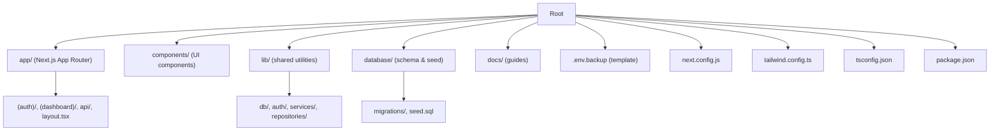
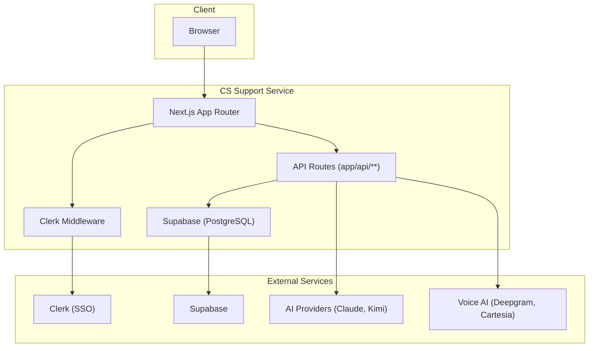
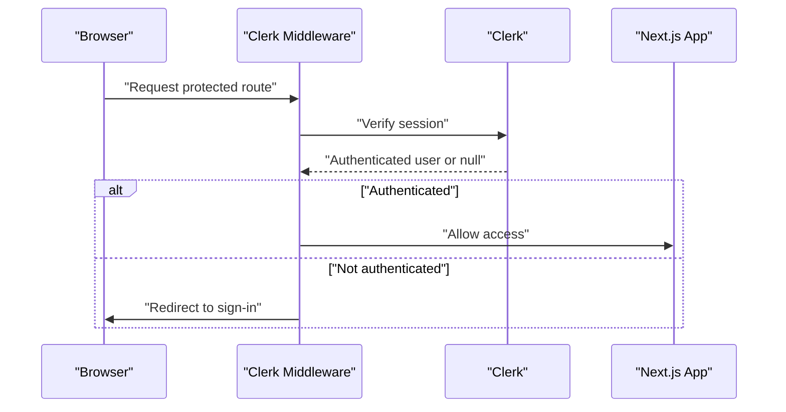
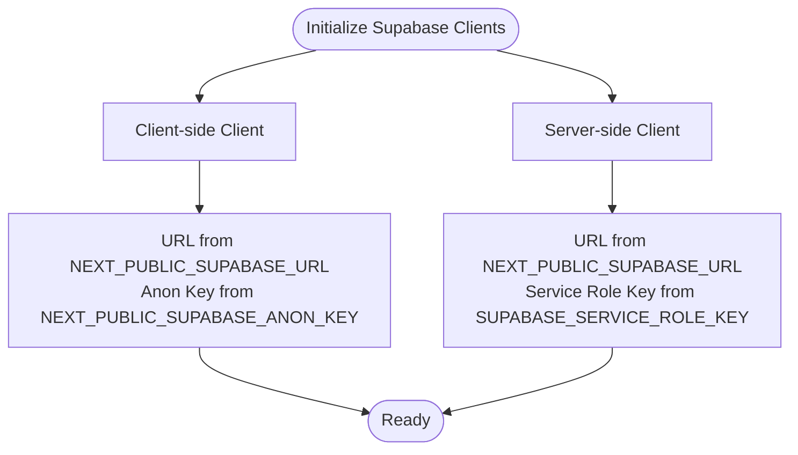
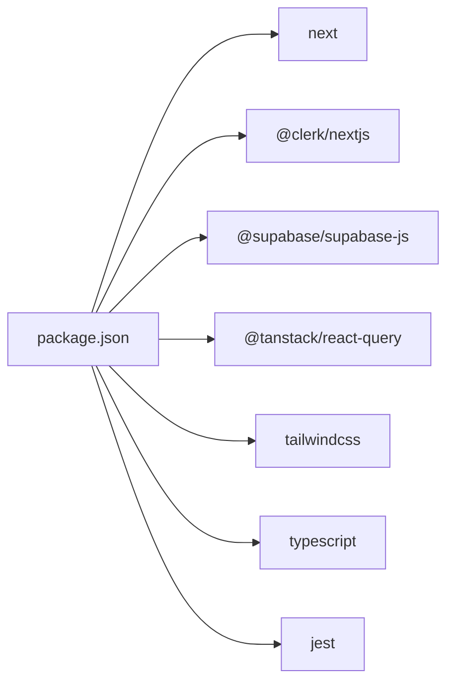

# Getting Started

<cite>
**Referenced Files in This Document**
- [README.md](file://README.md)
- [package.json](file://package.json)
- [next.config.js](file://next.config.js)
- [tsconfig.json](file://tsconfig.json)
- [tailwind.config.ts](file://tailwind.config.ts)
- [.env.backup](file://.env.backup)
- [docs/SUPABASE_ENV_SETUP.md](file://docs/SUPABASE_ENV_SETUP.md)
- [lib/db/supabase.ts](file://lib/db/supabase.ts)
- [middleware.ts](file://middleware.ts)
- [app/layout.tsx](file://app/layout.tsx)
- [database/seed.sql](file://database/seed.sql)
</cite>

## Table of Contents
1. [Introduction](#introduction)
2. [Project Structure](#project-structure)
3. [Core Components](#core-components)
4. [Architecture Overview](#architecture-overview)
5. [Detailed Component Analysis](#detailed-component-analysis)
6. [Dependency Analysis](#dependency-analysis)
7. [Performance Considerations](#performance-considerations)
8. [Troubleshooting Guide](#troubleshooting-guide)
9. [Conclusion](#conclusion)
10. [Appendices](#appendices)

## Introduction
This guide helps you set up and run the TrueVow CS Support Service locally. You will configure environment variables, install dependencies, start the development server, and verify the setup. The service is a standalone deployment built with Next.js 14+, TypeScript, Tailwind CSS, Clerk authentication, Supabase database, and integrated AI providers.

## Project Structure
The repository follows a Next.js 14+ App Router layout with:
- Frontend pages and components under app/ and components/
- Backend API routes under app/api/**
- Database schema and seed data under database/
- Shared libraries and utilities under lib/
- Global styles and Tailwind configuration under app/globals.css and tailwind.config.ts
- Environment variables template under .env.backup

**Diagram sources**
- [README.md](file://README.md#L1-L67)
- [package.json](file://package.json#L1-L65)
- [next.config.js](file://next.config.js#L1-L13)
- [tailwind.config.ts](file://tailwind.config.ts#L1-L62)
- [tsconfig.json](file://tsconfig.json#L1-L29)
- [.env.backup](file://.env.backup#L1-L47)
- [database/seed.sql](file://database/seed.sql#L1-L363)

**Section sources**
- [README.md](file://README.md#L1-L67)
- [package.json](file://package.json#L1-L65)
- [next.config.js](file://next.config.js#L1-L13)
- [tailwind.config.ts](file://tailwind.config.ts#L1-L62)
- [tsconfig.json](file://tsconfig.json#L1-L29)
- [.env.backup](file://.env.backup#L1-L47)
- [database/seed.sql](file://database/seed.sql#L1-L363)

## Core Components
- Next.js 14+ (App Router): Provides routing, SSR/SSG, and API routes.
- TypeScript: Strict typing across the codebase.
- Tailwind CSS: Utility-first styling with a custom theme.
- Clerk authentication: Shared application for SSO.
- Supabase database: PostgreSQL-backed with service role access for server-side operations.
- AI providers: Claude (Anthropic) + Kimi for LLMs; Deepgram (STT) + Cartesia (TTS) for Voice AI.

**Section sources**
- [README.md](file://README.md#L19-L27)
- [app/layout.tsx](file://app/layout.tsx#L1-L27)
- [lib/db/supabase.ts](file://lib/db/supabase.ts#L1-L29)
- [middleware.ts](file://middleware.ts#L1-L30)

## Architecture Overview
The service is a standalone deployment with:
- Own repository and independent deployment
- Own frontend (Next.js App Router)
- Own backend (Next.js API Routes)
- Own database (support_db schema in Supabase)
- Authentication via Clerk shared application
- Service-to-service communication via API keys

**Diagram sources**
- [README.md](file://README.md#L52-L67)
- [middleware.ts](file://middleware.ts#L1-L30)
- [lib/db/supabase.ts](file://lib/db/supabase.ts#L1-L29)

**Section sources**
- [README.md](file://README.md#L52-L67)
- [middleware.ts](file://middleware.ts#L1-L30)
- [lib/db/supabase.ts](file://lib/db/supabase.ts#L1-L29)

## Detailed Component Analysis

### Environment Configuration
Follow these steps to configure environment variables:
1. Copy the template to .env.local:
   - Use the template provided in .env.backup to create .env.local.
2. Set Supabase variables:
   - NEXT_PUBLIC_SUPABASE_URL: Supabase project URL.
   - SUPABASE_SERVICE_ROLE_KEY: Service role key (server-side only).
   - NEXT_PUBLIC_SUPABASE_ANON_KEY: Optional, for client-side access.
3. Configure service-specific variables:
   - CS_SUPPORT_SERVICE_API_KEY: Generate or leave empty for local development.
   - Optional service URLs and API keys for platform, sales CRM, billing, and tenant services.
4. Verify variable names:
   - The Supabase setup guide documents required variables and acceptable aliases.

Verification steps:
- Confirm environment variables are present in .env.local.
- Run the seed script to validate database connectivity and schema readiness.

**Section sources**
- [.env.backup](file://.env.backup#L1-L47)
- [docs/SUPABASE_ENV_SETUP.md](file://docs/SUPABASE_ENV_SETUP.md#L1-L121)
- [lib/db/supabase.ts](file://lib/db/supabase.ts#L1-L29)

### Dependency Installation
Install dependencies using npm:
- Run: npm install

This installs Next.js 14+, Clerk, Supabase client, React Query, Tailwind CSS, and development tools.

**Section sources**
- [package.json](file://package.json#L27-L45)

### Development Server Startup
Start the development server:
- Run: npm run dev
- The service starts on port 3003 by default.

Build and start commands:
- Build: npm run build
- Production start: npm start

**Section sources**
- [README.md](file://README.md#L5-L12)
- [package.json](file://package.json#L5-L26)

### Authentication Flow (Clerk)
Clerk middleware protects private routes and redirects unauthenticated users to the sign-in page. Public routes include sign-in/sign-up, home, help, test endpoints, webhooks, and unsubscribe.

**Diagram sources**
- [middleware.ts](file://middleware.ts#L1-L30)

**Section sources**
- [middleware.ts](file://middleware.ts#L1-L30)
- [app/layout.tsx](file://app/layout.tsx#L1-L27)

### Database Initialization
Seed the database with initial data:
- Use the seed SQL script to populate tables for teams, SLAs, knowledge base, tickets, messages, and health scores.
- The seed script inserts sample data suitable for development and testing.

Verification:
- After seeding, confirm that tables are populated and relationships are intact.

**Section sources**
- [database/seed.sql](file://database/seed.sql#L1-L363)

### Supabase Client Configuration
The application creates two clients:
- Client-side client: Uses NEXT_PUBLIC_SUPABASE_URL and NEXT_PUBLIC_SUPABASE_ANON_KEY for browser access.
- Server-side client: Uses NEXT_PUBLIC_SUPABASE_URL and SUPABASE_SERVICE_ROLE_KEY for server-side operations with service role privileges.

**Diagram sources**
- [lib/db/supabase.ts](file://lib/db/supabase.ts#L1-L29)

**Section sources**
- [lib/db/supabase.ts](file://lib/db/supabase.ts#L1-L29)
- [docs/SUPABASE_ENV_SETUP.md](file://docs/SUPABASE_ENV_SETUP.md#L1-L121)

## Dependency Analysis
Key runtime dependencies include Next.js 14+, Clerk for authentication, Supabase for database, React Query for caching, and Tailwind CSS for styling. Development dependencies include TypeScript, ESLint, Prettier, and Jest.

**Diagram sources**
- [package.json](file://package.json#L27-L63)

**Section sources**
- [package.json](file://package.json#L1-L65)

## Performance Considerations
- Keep environment variables scoped appropriately (client vs server).
- Use server actions body size limits as configured in Next.js experimental settings.
- Leverage React Query for efficient caching and data fetching.
- Optimize Tailwind builds and avoid unused utilities.

**Section sources**
- [next.config.js](file://next.config.js#L1-L13)
- [tailwind.config.ts](file://tailwind.config.ts#L1-L62)

## Troubleshooting Guide
Common setup issues and resolutions:
- Missing environment variables:
  - Ensure NEXT_PUBLIC_SUPABASE_URL and SUPABASE_SERVICE_ROLE_KEY are set.
  - Verify .env.local exists and contains the required keys.
- Clerk redirect loops:
  - Confirm middleware matcher and public routes are correctly defined.
  - Ensure Clerk is properly initialized in the root layout.
- Database connection failures:
  - Validate Supabase project URL and service role key.
  - Run the seed script to confirm schema readiness.
- Port conflicts:
  - The service runs on port 3003 by default; adjust if needed.

Verification checklist:
- npm install completes without errors.
- npm run dev starts the server successfully.
- Access http://localhost:3003 and observe the dashboard after signing in.
- Run the seed script to confirm database initialization.

**Section sources**
- [README.md](file://README.md#L5-L12)
- [middleware.ts](file://middleware.ts#L1-L30)
- [lib/db/supabase.ts](file://lib/db/supabase.ts#L1-L29)
- [docs/SUPABASE_ENV_SETUP.md](file://docs/SUPABASE_ENV_SETUP.md#L106-L121)

## Conclusion
You now have the TrueVow CS Support Service running locally with Clerk authentication, Supabase database, Next.js 14+, TypeScript, and Tailwind CSS. Use the provided scripts and environment configuration to initialize the database and verify the setup. For production, secure service role keys and configure AI provider credentials as needed.

## Appendices
- Technology stack highlights:
  - Framework: Next.js 14+ (App Router)
  - Language: TypeScript
  - Styling: Tailwind CSS
  - Authentication: Clerk (Shared Application)
  - Database: Supabase (PostgreSQL)
  - AI providers: Claude (Anthropic) + Kimi; Voice AI: Deepgram (STT) + Cartesia (TTS)

**Section sources**
- [README.md](file://README.md#L19-L27)