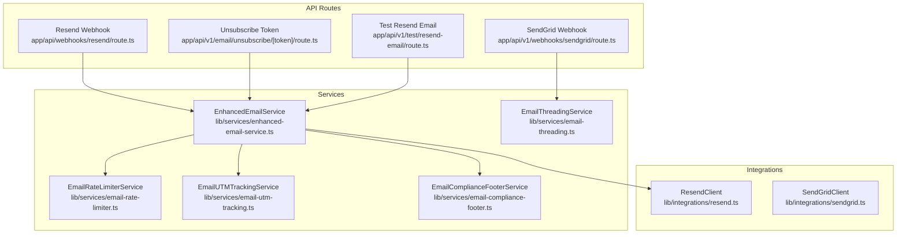
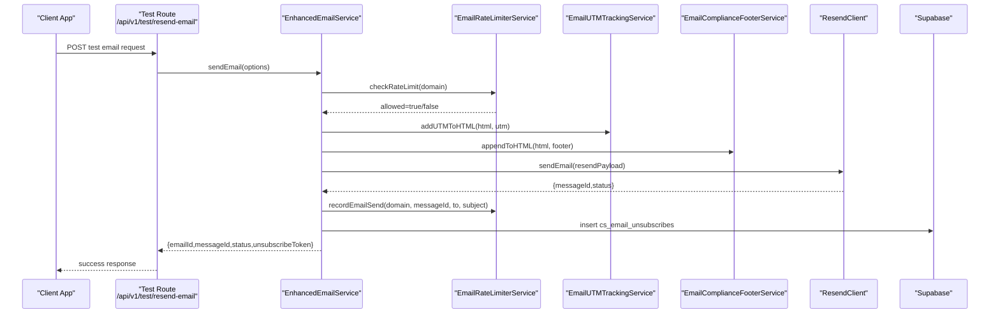
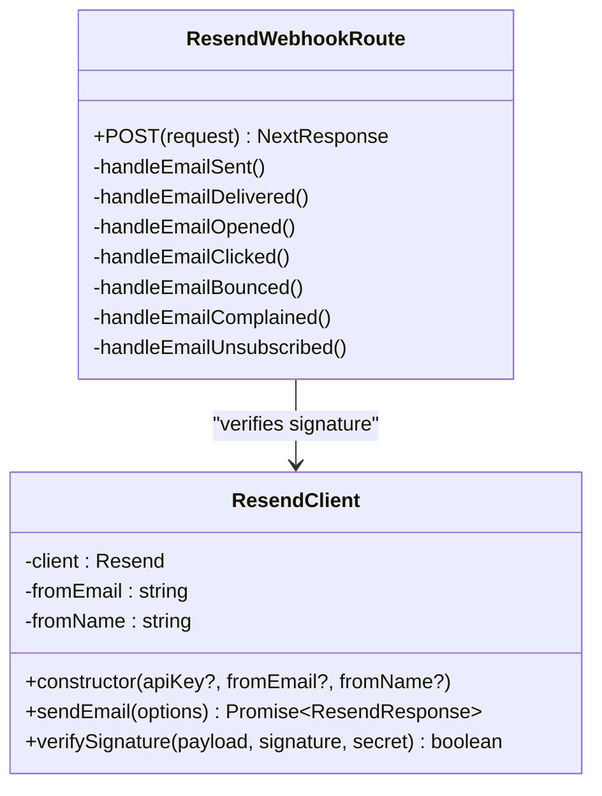
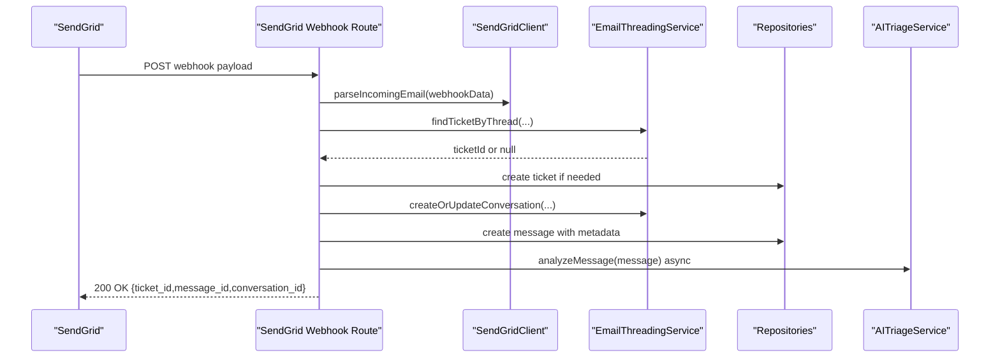
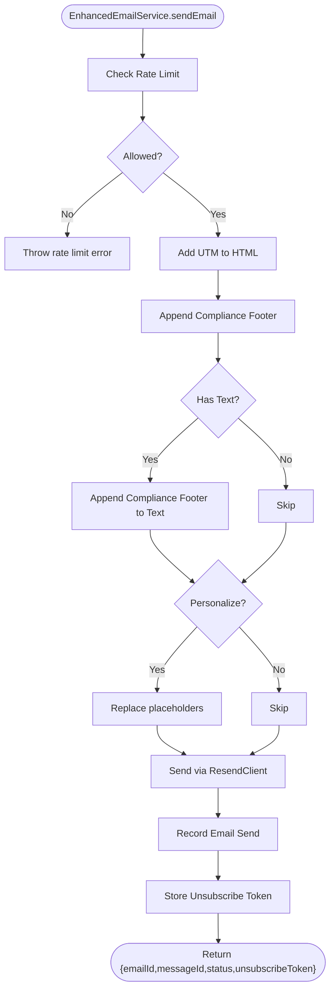
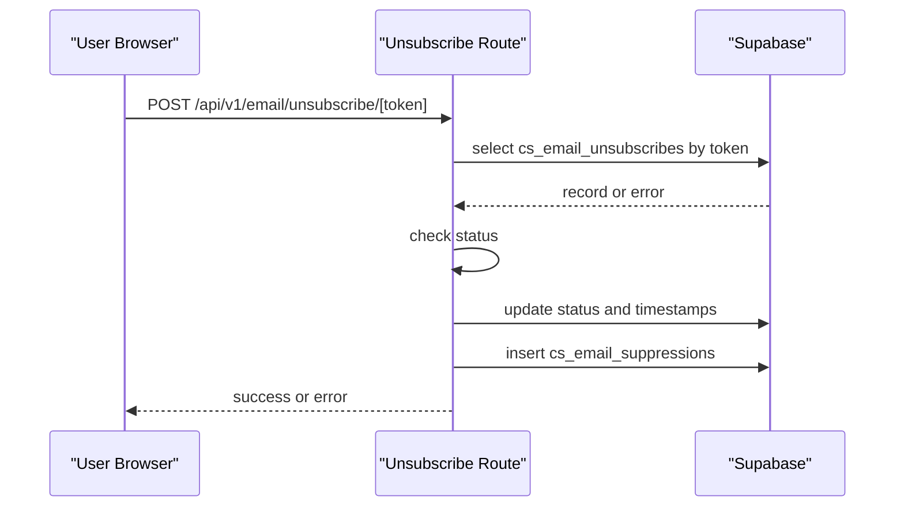
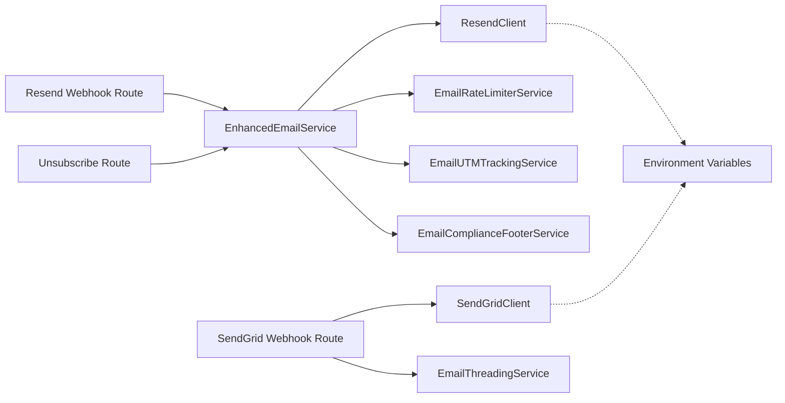

# Email Integrations

<cite>
**Referenced Files in This Document**
- [resend.ts](file://lib/integrations/resend.ts)
- [sendgrid.ts](file://lib/integrations/sendgrid.ts)
- [enhanced-email-service.ts](file://lib/services/enhanced-email-service.ts)
- [email-rate-limiter.ts](file://lib/services/email-rate-limiter.ts)
- [email-utm-tracking.ts](file://lib/services/email-utm-tracking.ts)
- [email-compliance-footer.ts](file://lib/services/email-compliance-footer.ts)
- [email-threading.ts](file://lib/services/email-threading.ts)
- [resend webhook route.ts](file://app/api/webhooks/resend/route.ts)
- [sendgrid webhook route.ts](file://app/api/v1/webhooks/sendgrid/route.ts)
- [unsubscribe route.ts](file://app/api/v1/email/unsubscribe/[token]/route.ts)
- [test resend-email route.ts](file://app/api/v1/test/resend-email/route.ts)
</cite>

## Table of Contents
1. [Introduction](#introduction)
2. [Project Structure](#project-structure)
3. [Core Components](#core-components)
4. [Architecture Overview](#architecture-overview)
5. [Detailed Component Analysis](#detailed-component-analysis)
6. [Dependency Analysis](#dependency-analysis)
7. [Performance Considerations](#performance-considerations)
8. [Troubleshooting Guide](#troubleshooting-guide)
9. [Conclusion](#conclusion)
10. [Appendices](#appendices)

## Introduction
This document explains the email service integrations implemented in the project, focusing on Resend and SendGrid. It covers configuration, authentication, API usage patterns, webhook handling for inbound emails and delivery events, unsubscribe token generation and validation, email template rendering, deliverability best practices, and troubleshooting guidance. The system supports transactional email delivery, inbound email ingestion, analytics/event tracking, and suppression lists for compliance.

## Project Structure
The email integration spans three primary areas:
- Integrations: Provider-specific clients for Resend and SendGrid
- Services: Enhanced email pipeline with rate limiting, UTM tracking, compliance footer, and unsubscribe token management
- API Routes: Webhooks for inbound SendGrid emails and Resend events, plus outbound test and unsubscribe endpoints

**Diagram sources**
- [resend.ts](file://lib/integrations/resend.ts#L1-L149)
- [sendgrid.ts](file://lib/integrations/sendgrid.ts#L1-L153)
- [enhanced-email-service.ts](file://lib/services/enhanced-email-service.ts#L1-L182)
- [email-rate-limiter.ts](file://lib/services/email-rate-limiter.ts#L1-L134)
- [email-utm-tracking.ts](file://lib/services/email-utm-tracking.ts#L1-L103)
- [email-compliance-footer.ts](file://lib/services/email-compliance-footer.ts#L1-L174)
- [email-threading.ts](file://lib/services/email-threading.ts#L1-L111)
- [resend webhook route.ts](file://app/api/webhooks/resend/route.ts#L1-L344)
- [sendgrid webhook route.ts](file://app/api/v1/webhooks/sendgrid/route.ts#L1-L188)
- [unsubscribe route.ts](file://app/api/v1/email/unsubscribe/[token]/route.ts#L1-L134)
- [test resend-email route.ts](file://app/api/v1/test/resend-email/route.ts#L1-L100)

**Section sources**
- [resend.ts](file://lib/integrations/resend.ts#L1-L149)
- [sendgrid.ts](file://lib/integrations/sendgrid.ts#L1-L153)
- [enhanced-email-service.ts](file://lib/services/enhanced-email-service.ts#L1-L182)
- [email-rate-limiter.ts](file://lib/services/email-rate-limiter.ts#L1-L134)
- [email-utm-tracking.ts](file://lib/services/email-utm-tracking.ts#L1-L103)
- [email-compliance-footer.ts](file://lib/services/email-compliance-footer.ts#L1-L174)
- [email-threading.ts](file://lib/services/email-threading.ts#L1-L111)
- [resend webhook route.ts](file://app/api/webhooks/resend/route.ts#L1-L344)
- [sendgrid webhook route.ts](file://app/api/v1/webhooks/sendgrid/route.ts#L1-L188)
- [unsubscribe route.ts](file://app/api/v1/email/unsubscribe/[token]/route.ts#L1-L134)
- [test resend-email route.ts](file://app/api/v1/test/resend-email/route.ts#L1-L100)

## Core Components
- ResendClient: Provides email sending and webhook signature verification for Resend
- SendGridClient: Provides email sending and inbound email parsing for SendGrid
- EnhancedEmailService: Orchestrates rate limiting, UTM tracking, compliance footer, unsubscribe token generation, and dispatch via Resend
- EmailRateLimiterService: Enforces per-domain rate limits and records send events
- EmailUTMTrackingService: Adds UTM parameters to links in HTML emails
- EmailComplianceFooterService: Appends jurisdiction-aware compliance footers and unsubscribe links
- EmailThreadingService: Groups inbound emails into tickets/conversations using threading headers
- Webhook Routes: Handle inbound SendGrid emails and Resend delivery events
- Unsubscribe Endpoint: Validates tokens and adds recipients to suppression lists
- Test Endpoint: Sends a test email via EnhancedEmailService

**Section sources**
- [resend.ts](file://lib/integrations/resend.ts#L34-L149)
- [sendgrid.ts](file://lib/integrations/sendgrid.ts#L30-L153)
- [enhanced-email-service.ts](file://lib/services/enhanced-email-service.ts#L58-L182)
- [email-rate-limiter.ts](file://lib/services/email-rate-limiter.ts#L22-L134)
- [email-utm-tracking.ts](file://lib/services/email-utm-tracking.ts#L18-L103)
- [email-compliance-footer.ts](file://lib/services/email-compliance-footer.ts#L17-L174)
- [email-threading.ts](file://lib/services/email-threading.ts#L19-L111)
- [resend webhook route.ts](file://app/api/webhooks/resend/route.ts#L25-L105)
- [sendgrid webhook route.ts](file://app/api/v1/webhooks/sendgrid/route.ts#L19-L188)
- [unsubscribe route.ts](file://app/api/v1/email/unsubscribe/[token]/route.ts#L11-L85)
- [test resend-email route.ts](file://app/api/v1/test/resend-email/route.ts#L11-L99)

## Architecture Overview
The email architecture integrates provider APIs with internal services and repositories to manage delivery, analytics, and compliance.

**Diagram sources**
- [test resend-email route.ts](file://app/api/v1/test/resend-email/route.ts#L11-L99)
- [enhanced-email-service.ts](file://lib/services/enhanced-email-service.ts#L70-L182)
- [email-rate-limiter.ts](file://lib/services/email-rate-limiter.ts#L32-L134)
- [email-utm-tracking.ts](file://lib/services/email-utm-tracking.ts#L70-L78)
- [email-compliance-footer.ts](file://lib/services/email-compliance-footer.ts#L151-L172)
- [resend.ts](file://lib/integrations/resend.ts#L55-L108)

## Detailed Component Analysis

### Resend Integration
- Authentication: API key loaded from environment variables; optional from/name defaults supported
- Sending: Supports HTML/text, reply-to, attachments, threading headers (In-Reply-To, References), tags, and metadata
- Webhook Signature Verification: HMAC-SHA256 verification against the webhook secret; strips “whsec_” prefix
- Webhook Events: Handles sent, delivered, opened, clicked, bounced, complained, unsubscribed; updates analytics and suppression lists

**Diagram sources**
- [resend.ts](file://lib/integrations/resend.ts#L34-L149)
- [resend webhook route.ts](file://app/api/webhooks/resend/route.ts#L25-L105)

**Section sources**
- [resend.ts](file://lib/integrations/resend.ts#L34-L149)
- [resend webhook route.ts](file://app/api/webhooks/resend/route.ts#L25-L105)

### SendGrid Integration
- Authentication: API key from environment variables
- Sending: Personalization blocks, from/name, HTML/plain content, reply-to, threading headers, attachments
- Inbound Parsing: Converts webhook payload into normalized structure with from/to/subject/text/html/messageId/inReplyTo/references/attachments
- Webhook Handling: Creates or links tickets/conversations, persists messages, attaches metadata, and triggers AI triage/routing asynchronously

**Diagram sources**
- [sendgrid.ts](file://lib/integrations/sendgrid.ts#L115-L148)
- [sendgrid webhook route.ts](file://app/api/v1/webhooks/sendgrid/route.ts#L19-L188)
- [email-threading.ts](file://lib/services/email-threading.ts#L24-L111)

**Section sources**
- [sendgrid.ts](file://lib/integrations/sendgrid.ts#L30-L153)
- [sendgrid webhook route.ts](file://app/api/v1/webhooks/sendgrid/route.ts#L19-L188)
- [email-threading.ts](file://lib/services/email-threading.ts#L19-L111)

### Enhanced Email Service
- Unsubscribe Token Generation: SHA-256 hash of email, optional leadId, and timestamp
- Content Processing: Adds UTM parameters to links and appends jurisdiction-aware compliance footer
- Personalization: Optional placeholder replacement for customer name
- Delivery: Sends via ResendClient with tags/metadata for analytics
- Rate Limiting: Checks per-minute/hour/day limits and records send events
- Unsubscribe Storage: Persists token with email and messageId for validation

**Diagram sources**
- [enhanced-email-service.ts](file://lib/services/enhanced-email-service.ts#L70-L182)
- [email-rate-limiter.ts](file://lib/services/email-rate-limiter.ts#L32-L134)
- [email-utm-tracking.ts](file://lib/services/email-utm-tracking.ts#L70-L78)
- [email-compliance-footer.ts](file://lib/services/email-compliance-footer.ts#L151-L172)

**Section sources**
- [enhanced-email-service.ts](file://lib/services/enhanced-email-service.ts#L58-L182)
- [email-rate-limiter.ts](file://lib/services/email-rate-limiter.ts#L22-L134)
- [email-utm-tracking.ts](file://lib/services/email-utm-tracking.ts#L18-L103)
- [email-compliance-footer.ts](file://lib/services/email-compliance-footer.ts#L17-L174)

### Unsubscribe Token Management
- Validation: Validates token existence and status; prevents double-processing
- Suppression: Adds recipient to suppression list upon unsubscribe
- Endpoint: Supports POST to unsubscribe and GET to check status

**Diagram sources**
- [unsubscribe route.ts](file://app/api/v1/email/unsubscribe/[token]/route.ts#L11-L85)

**Section sources**
- [unsubscribe route.ts](file://app/api/v1/email/unsubscribe/[token]/route.ts#L11-L134)

### Rate Limiting
- Limits: Configurable per-minute, per-hour, per-day thresholds per sending domain
- Enforcement: Counts recent sends and computes retry-after timing
- Recording: Inserts send records with domain, recipient, and subject for audit

**Section sources**
- [email-rate-limiter.ts](file://lib/services/email-rate-limiter.ts#L22-L134)

### UTM Tracking
- Adds standard UTM parameters and custom tracking parameters (lead_id, email_id, sequence_id)
- Skips unsubscribe links, mailto:, and internal domains
- Applies to all anchor hrefs in HTML content

**Section sources**
- [email-utm-tracking.ts](file://lib/services/email-utm-tracking.ts#L18-L103)

### Compliance Footer
- Generates jurisdiction-aware disclaimers (US/EU/CA/UK/AU/GLOBAL)
- Includes unsubscribe link built from token and app URL
- Appends company info and copyright notice

**Section sources**
- [email-compliance-footer.ts](file://lib/services/email-compliance-footer.ts#L17-L174)

### Email Threading
- Finds tickets by In-Reply-To or References headers
- Falls back to subject patterns (Re:/Fwd:) and recent open tickets by customer email
- Creates or updates conversations and increments counters

**Section sources**
- [email-threading.ts](file://lib/services/email-threading.ts#L19-L111)

## Dependency Analysis
The system composes modular services around provider clients and repositories. EnhancedEmailService depends on ResendClient, rate limiter, UTM tracker, and compliance footer. Webhook routes depend on threading and repositories to maintain state.

**Diagram sources**
- [enhanced-email-service.ts](file://lib/services/enhanced-email-service.ts#L12-L17)
- [resend.ts](file://lib/integrations/resend.ts#L6-L10)
- [sendgrid.ts](file://lib/integrations/sendgrid.ts#L6-L8)
- [sendgrid webhook route.ts](file://app/api/v1/webhooks/sendgrid/route.ts#L1-L14)
- [resend webhook route.ts](file://app/api/webhooks/resend/route.ts#L14-L20)
- [unsubscribe route.ts](file://app/api/v1/email/unsubscribe/[token]/route.ts#L8-L9)

**Section sources**
- [enhanced-email-service.ts](file://lib/services/enhanced-email-service.ts#L12-L17)
- [resend.ts](file://lib/integrations/resend.ts#L6-L10)
- [sendgrid.ts](file://lib/integrations/sendgrid.ts#L6-L8)
- [sendgrid webhook route.ts](file://app/api/v1/webhooks/sendgrid/route.ts#L1-L14)
- [resend webhook route.ts](file://app/api/webhooks/resend/route.ts#L14-L20)
- [unsubscribe route.ts](file://app/api/v1/email/unsubscribe/[token]/route.ts#L8-L9)

## Performance Considerations
- Rate Limiting: Enforced per domain to avoid provider throttling; configure thresholds via service configuration
- Asynchronous AI Processing: Webhook handlers trigger AI triage and routing asynchronously to avoid blocking responses
- Minimal Payload Processing: Webhook parsing extracts only necessary fields; attachments are stored separately
- Analytics Updates: Event updates are logged with best-effort inserts; missing tables are tolerated

[No sources needed since this section provides general guidance]

## Troubleshooting Guide
Common issues and resolutions:
- Missing API Keys
  - Symptom: Errors indicating API key not configured
  - Resolution: Set provider-specific environment variables for Resend and SendGrid
- Invalid Webhook Signature (Resend)
  - Symptom: 401 Unauthorized webhook response
  - Resolution: Verify webhook secret and header names; ensure “whsec_” prefix handling
- Rate Limit Exceeded
  - Symptom: Errors indicating retry-after timing
  - Resolution: Back off and retry; adjust thresholds if appropriate
- Unsubscribe Token Not Found
  - Symptom: 404 when posting or getting unsubscribe status
  - Resolution: Confirm token validity and presence in the database
- Webhook Payload Parsing Failures (SendGrid)
  - Symptom: Missing fields or malformed messages
  - Resolution: Validate envelope and header fields; ensure threading headers are present when expected

**Section sources**
- [resend.ts](file://lib/integrations/resend.ts#L44-L58)
- [resend webhook route.ts](file://app/api/webhooks/resend/route.ts#L36-L56)
- [email-rate-limiter.ts](file://lib/services/email-rate-limiter.ts#L56-L98)
- [unsubscribe route.ts](file://app/api/v1/email/unsubscribe/[token]/route.ts#L34-L48)
- [sendgrid webhook route.ts](file://app/api/v1/webhooks/sendgrid/route.ts#L20-L25)

## Conclusion
The email integration provides a robust, provider-agnostic pipeline for sending and receiving emails, with strong compliance, analytics, and deliverability safeguards. Resend handles outbound delivery and event notifications; SendGrid manages inbound email ingestion and threading. The enhanced service centralizes best practices such as rate limiting, UTM tracking, and compliance footers, while webhook routes integrate seamlessly with internal systems for ticketing and routing.

[No sources needed since this section summarizes without analyzing specific files]

## Appendices

### Configuration Examples
- Environment Variables
  - Resend: API key, from email/name, webhook secret, webhook endpoint
  - SendGrid: API key, from email/name
  - Application: Public app URL, company info, default tenant ID
- SMTP vs API
  - The implementation uses provider SDKs and HTTP APIs; SMTP is not implemented here

**Section sources**
- [resend.ts](file://lib/integrations/resend.ts#L8-L10)
- [sendgrid.ts](file://lib/integrations/sendgrid.ts#L6-L8)
- [email-compliance-footer.ts](file://lib/services/email-compliance-footer.ts#L7-L9)
- [resend webhook route.ts](file://app/api/webhooks/resend/route.ts#L18-L19)

### Webhook Setup and Validation
- Resend
  - Endpoint: Configure provider webhook URL to point to the webhook route
  - Secret: Provide webhook secret; route verifies signature using HMAC-SHA256
- SendGrid
  - Endpoint: Configure provider webhook URL to point to the webhook route
  - Parsing: Route normalizes inbound payload into a standard shape

**Section sources**
- [resend webhook route.ts](file://app/api/webhooks/resend/route.ts#L25-L105)
- [sendgrid.ts](file://lib/integrations/sendgrid.ts#L115-L148)
- [sendgrid webhook route.ts](file://app/api/v1/webhooks/sendgrid/route.ts#L19-L25)

### Email Template Rendering
- HTML and Text: Provided by callers; UTM parameters and compliance footer are appended automatically
- Personalization: Optional placeholders replaced with customer email-derived values
- Unsubscribe: Automatically included in footers and stored for validation

**Section sources**
- [enhanced-email-service.ts](file://lib/services/enhanced-email-service.ts#L128-L131)
- [email-compliance-footer.ts](file://lib/services/email-compliance-footer.ts#L151-L172)
- [email-utm-tracking.ts](file://lib/services/email-utm-tracking.ts#L70-L78)

### Deliverability Best Practices and Spam Prevention
- Domain Alignment: Use consistent from address and domain
- Rate Limits: Respect provider limits; the service enforces per-domain quotas
- Compliance Footers: Jurisdiction-aware disclaimers and unsubscribe links included
- UTM Tracking: Non-invasive tracking for analytics without altering content substantially
- Suppression Lists: Automatic addition on bounces/complaints/unsubscribes

**Section sources**
- [email-rate-limiter.ts](file://lib/services/email-rate-limiter.ts#L22-L134)
- [email-compliance-footer.ts](file://lib/services/email-compliance-footer.ts#L93-L146)
- [resend webhook route.ts](file://app/api/webhooks/resend/route.ts#L238-L343)

### Email Analytics Integration
- Events: Track opens/clicks with recipient and event data
- Sentries: Update statuses and counts for delivered/bounced/complained/unsubscribed
- Suppressions: Maintain suppression lists for non-deliverable recipients

**Section sources**
- [resend webhook route.ts](file://app/api/webhooks/resend/route.ts#L151-L343)

### Testing Procedures
- Test Endpoint: Send a test email via EnhancedEmailService to verify integration end-to-end
- Webhook Validation: Use provider dashboards to confirm webhook delivery and signature verification
- Unsubscribe Flow: Validate token creation, storage, and suppression behavior

**Section sources**
- [test resend-email route.ts](file://app/api/v1/test/resend-email/route.ts#L11-L99)
- [resend webhook route.ts](file://app/api/webhooks/resend/route.ts#L36-L56)
- [unsubscribe route.ts](file://app/api/v1/email/unsubscribe/[token]/route.ts#L11-L85)