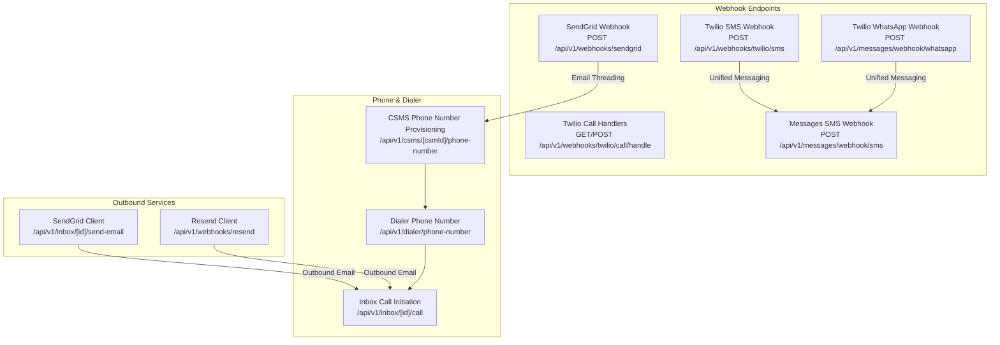
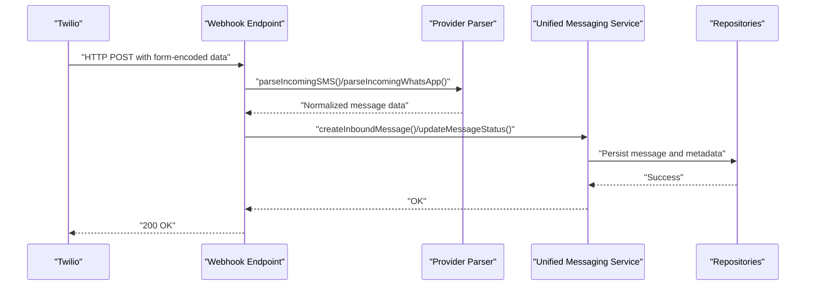
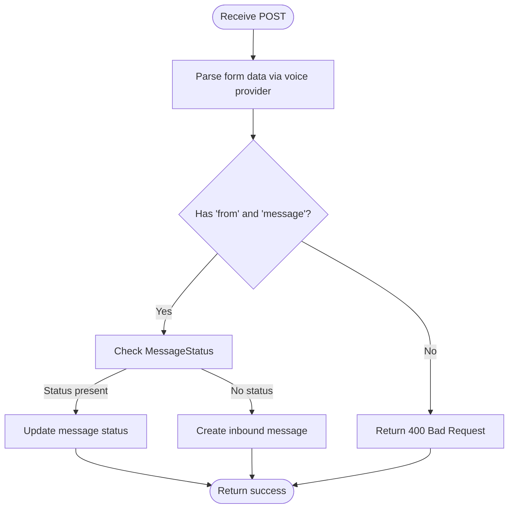
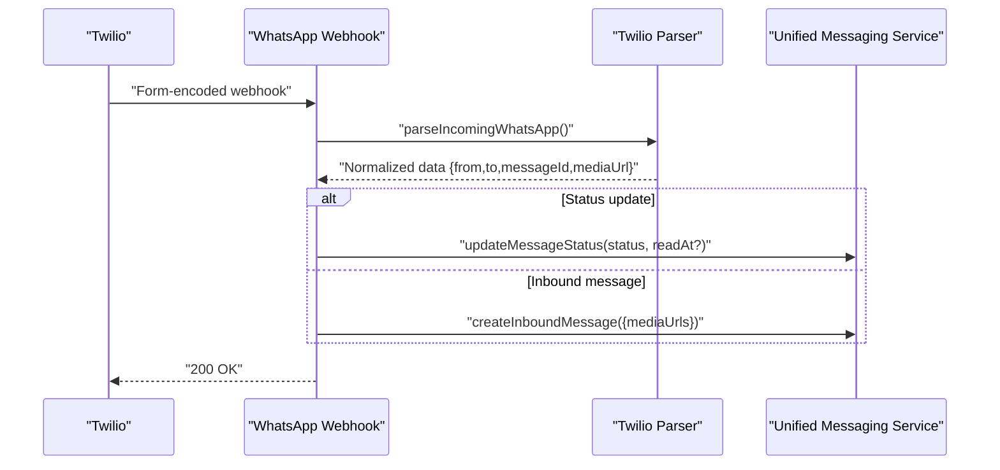
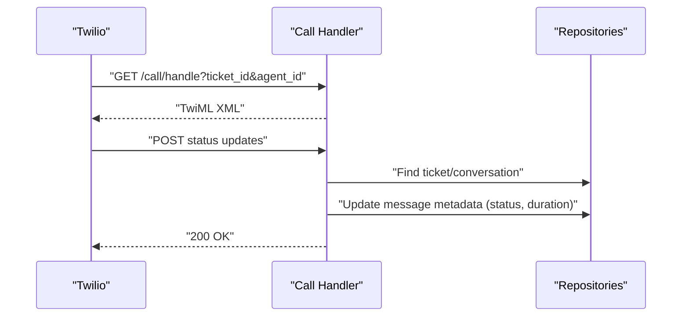
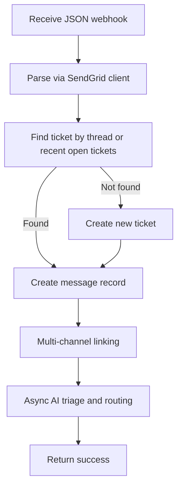
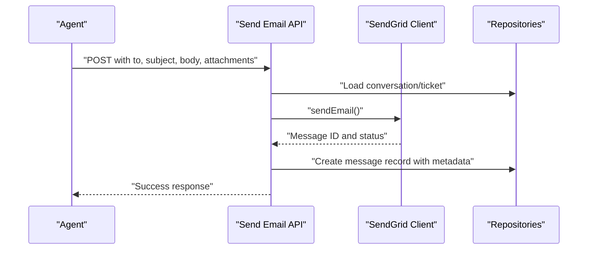
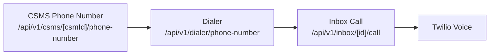
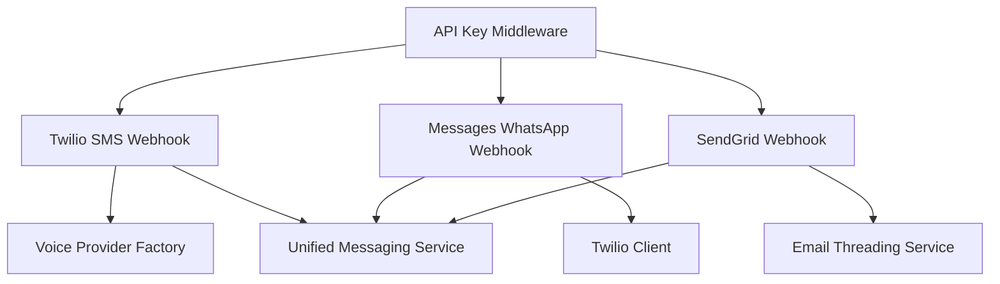

# Integrations & Webhooks

<cite>
**Referenced Files in This Document**
- [messages/webhook/sms/route.ts](file://app/api/v1/messages/webhook/sms/route.ts)
- [messages/webhook/whatsapp/route.ts](file://app/api/v1/messages/webhook/whatsapp/route.ts)
- [webhooks/sendgrid/route.ts](file://app/api/v1/webhooks/sendgrid/route.ts)
- [webhooks/twilio/sms/route.ts](file://app/api/v1/webhooks/twilio/sms/route.ts)
- [webhooks/twilio/call/handle/route.ts](file://app/api/v1/webhooks/twilio/call/handle/route.ts)
- [inbox/[id]/send-email/route.ts](file://app/api/v1/inbox/[id]/send-email/route.ts)
- [csms/[csmId]/phone-number/route.ts](file://app/api/v1/csms/[csmId]/phone-number/route.ts)
- [dialer/phone-number/route.ts](file://app/api/v1/dialer/phone-number/route.ts)
- [inbox/[id]/call/route.ts](file://app/api/v1/inbox/[id]/call/route.ts)
- [messages/send/route.ts](file://app/api/v1/messages/send/route.ts)
- [whatsapp/send/route.ts](file://app/api/v1/whatsapp/send/route.ts)
- [webhooks/resend/route.ts](file://app/api/v1/webhooks/resend/route.ts)
- [test-resend-email.ts](file://scripts/test-resend-email.ts)
- [test-sms-integration.ts](file://scripts/test-sms-integration.ts)
- [test-whatsapp-integration.ts](file://scripts/test-whatsapp-integration.ts)
- [.env.local](file://.env.local)
</cite>

## Table of Contents
1. [Introduction](#introduction)
2. [Project Structure](#project-structure)
3. [Core Components](#core-components)
4. [Architecture Overview](#architecture-overview)
5. [Detailed Component Analysis](#detailed-component-analysis)
6. [Dependency Analysis](#dependency-analysis)
7. [Performance Considerations](#performance-considerations)
8. [Troubleshooting Guide](#troubleshooting-guide)
9. [Conclusion](#conclusion)
10. [Appendices](#appendices)

## Introduction
This document explains the third-party integrations and webhook systems implemented in the project, focusing on:
- Twilio integration for SMS and voice communications
- SendGrid webhook handling for inbound emails
- WhatsApp messaging via Twilio
- Resend integration for outbound email services
It covers endpoint implementations, payload validation, event processing workflows, configuration, authentication, error handling, security considerations, rate limiting strategies, setup instructions, testing procedures, and troubleshooting.

## Project Structure
The integrations and webhooks are primarily implemented under the Next.js app router at app/api/v1. Key areas:
- Twilio SMS and WhatsApp webhooks for inbound messages
- Twilio voice call handling (TwiML and status updates)
- SendGrid inbound email webhook
- Outbound email via SendGrid and Resend
- Phone number provisioning and dialer integration
- Unified messaging service for cross-channel message handling

**Diagram sources**
- [webhooks/twilio/sms/route.ts](file://app/api/v1/webhooks/twilio/sms/route.ts#L25-L172)
- [messages/webhook/whatsapp/route.ts](file://app/api/v1/messages/webhook/whatsapp/route.ts#L14-L74)
- [webhooks/twilio/call/handle/route.ts](file://app/api/v1/webhooks/twilio/call/handle/route.ts#L12-L102)
- [webhooks/sendgrid/route.ts](file://app/api/v1/webhooks/sendgrid/route.ts#L19-L186)
- [messages/webhook/sms/route.ts](file://app/api/v1/messages/webhook/sms/route.ts#L14-L68)
- [inbox/[id]/send-email/route.ts](file://app/api/v1/inbox/[id]/send-email/route.ts#L23-L125)
- [webhooks/resend/route.ts](file://app/api/v1/webhooks/resend/route.ts)
- [csms/[csmId]/phone-number/route.ts](file://app/api/v1/csms/[csmId]/phone-number/route.ts#L17-L82)
- [dialer/phone-number/route.ts](file://app/api/v1/dialer/phone-number/route.ts#L39-L39)
- [inbox/[id]/call/route.ts](file://app/api/v1/inbox/[id]/call/route.ts#L84-L84)

**Section sources**
- [webhooks/twilio/sms/route.ts](file://app/api/v1/webhooks/twilio/sms/route.ts#L1-L173)
- [messages/webhook/whatsapp/route.ts](file://app/api/v1/messages/webhook/whatsapp/route.ts#L1-L75)
- [webhooks/twilio/call/handle/route.ts](file://app/api/v1/webhooks/twilio/call/handle/route.ts#L1-L103)
- [webhooks/sendgrid/route.ts](file://app/api/v1/webhooks/sendgrid/route.ts#L1-L188)
- [messages/webhook/sms/route.ts](file://app/api/v1/messages/webhook/sms/route.ts#L1-L69)
- [inbox/[id]/send-email/route.ts](file://app/api/v1/inbox/[id]/send-email/route.ts#L1-L126)
- [webhooks/resend/route.ts](file://app/api/v1/webhooks/resend/route.ts)
- [csms/[csmId]/phone-number/route.ts](file://app/api/v1/csms/[csmId]/phone-number/route.ts#L1-L90)
- [dialer/phone-number/route.ts](file://app/api/v1/dialer/phone-number/route.ts#L39-L39)
- [inbox/[id]/call/route.ts](file://app/api/v1/inbox/[id]/call/route.ts#L84-L84)

## Core Components
- Twilio SMS/WhatsApp Webhooks: Parse incoming messages, distinguish status updates vs inbound messages, and persist records via the unified messaging service.
- Twilio Voice Call Handlers: Generate TwiML for outbound calls and process call status updates.
- SendGrid Webhook: Inbound email parsing, ticket/conversation creation/linking, and optional AI triage and routing.
- Outbound Email Clients: SendGrid and Resend wrappers for sending replies and notifications.
- Phone Number Provisioning and Dialer: Provision Twilio numbers, expose virtual numbers, and initiate calls.

**Section sources**
- [webhooks/twilio/sms/route.ts](file://app/api/v1/webhooks/twilio/sms/route.ts#L25-L172)
- [messages/webhook/whatsapp/route.ts](file://app/api/v1/messages/webhook/whatsapp/route.ts#L14-L74)
- [webhooks/twilio/call/handle/route.ts](file://app/api/v1/webhooks/twilio/call/handle/route.ts#L12-L102)
- [webhooks/sendgrid/route.ts](file://app/api/v1/webhooks/sendgrid/route.ts#L19-L186)
- [inbox/[id]/send-email/route.ts](file://app/api/v1/inbox/[id]/send-email/route.ts#L23-L125)
- [webhooks/resend/route.ts](file://app/api/v1/webhooks/resend/route.ts)
- [csms/[csmId]/phone-number/route.ts](file://app/api/v1/csms/[csmId]/phone-number/route.ts#L17-L82)
- [dialer/phone-number/route.ts](file://app/api/v1/dialer/phone-number/route.ts#L39-L39)

## Architecture Overview
The system integrates Twilio for messaging and voice, SendGrid for inbound/outbound email, and Resend for outbound email. Webhooks are secured with API keys and processed asynchronously where appropriate to avoid blocking Twilio/SendGrid callbacks.

**Diagram sources**
- [messages/webhook/sms/route.ts](file://app/api/v1/messages/webhook/sms/route.ts#L14-L68)
- [messages/webhook/whatsapp/route.ts](file://app/api/v1/messages/webhook/whatsapp/route.ts#L14-L74)
- [webhooks/twilio/sms/route.ts](file://app/api/v1/webhooks/twilio/sms/route.ts#L25-L172)

## Detailed Component Analysis

### Twilio SMS Webhook
- Endpoint: POST /api/v1/webhooks/twilio/sms
- Authentication: API key protected via middleware
- Processing:
  - Parses form-encoded payload into normalized SMS data
  - Creates or links a ticket/conversation
  - Persists inbound message and logs activity
  - Supports async AI triage and routing
- Status Updates: Distinguishes outbound delivery statuses and updates message state accordingly

**Diagram sources**
- [webhooks/twilio/sms/route.ts](file://app/api/v1/webhooks/twilio/sms/route.ts#L25-L172)

**Section sources**
- [webhooks/twilio/sms/route.ts](file://app/api/v1/webhooks/twilio/sms/route.ts#L25-L172)

### Twilio WhatsApp Webhook
- Endpoint: POST /api/v1/messages/webhook/whatsapp
- Authentication: API key protected via middleware
- Processing:
  - Parses form-encoded payload into normalized WhatsApp data
  - Handles status updates (sent, delivered, read, failed)
  - Creates inbound messages with media URLs when present
- Security: Validates presence of required fields before processing

**Diagram sources**
- [messages/webhook/whatsapp/route.ts](file://app/api/v1/messages/webhook/whatsapp/route.ts#L14-L74)

**Section sources**
- [messages/webhook/whatsapp/route.ts](file://app/api/v1/messages/webhook/whatsapp/route.ts#L14-L74)

### Twilio Voice Call Handlers
- GET /api/v1/webhooks/twilio/call/handle: Generates TwiML to connect agent to customer and records call metadata
- POST /api/v1/webhooks/twilio/call/handle: Processes call status updates and persists call details

**Diagram sources**
- [webhooks/twilio/call/handle/route.ts](file://app/api/v1/webhooks/twilio/call/handle/route.ts#L12-L102)

**Section sources**
- [webhooks/twilio/call/handle/route.ts](file://app/api/v1/webhooks/twilio/call/handle/route.ts#L12-L102)

### SendGrid Webhook (Inbound Emails)
- Endpoint: POST /api/v1/webhooks/sendgrid
- Authentication: API key protected via middleware
- Processing:
  - Parses inbound email payload
  - Links to existing ticket via threading (In-Reply-To/References) or recent open tickets
  - Creates new ticket/conversation if needed
  - Creates message record and logs activity
  - Async AI triage and optional auto-routing

**Diagram sources**
- [webhooks/sendgrid/route.ts](file://app/api/v1/webhooks/sendgrid/route.ts#L19-L186)

**Section sources**
- [webhooks/sendgrid/route.ts](file://app/api/v1/webhooks/sendgrid/route.ts#L19-L186)

### Outbound Email via SendGrid
- Endpoint: POST /api/v1/inbox/:id/send-email
- Features:
  - Validates request body
  - Threads replies using In-Reply-To/References
  - Sends via SendGrid client
  - Records message and updates conversation

**Diagram sources**
- [inbox/[id]/send-email/route.ts](file://app/api/v1/inbox/[id]/send-email/route.ts#L23-L125)

**Section sources**
- [inbox/[id]/send-email/route.ts](file://app/api/v1/inbox/[id]/send-email/route.ts#L23-L125)

### Outbound Email via Resend
- Endpoint: POST /api/v1/webhooks/resend
- Purpose: Resend webhook endpoint for outbound email events (delivery, opens, clicks)
- Implementation: Defined under app/api/v1/webhooks/resend/route.ts

**Section sources**
- [webhooks/resend/route.ts](file://app/api/v1/webhooks/resend/route.ts)

### Phone Number Provisioning and Dialer Integration
- Provisioning: /api/v1/csms/[csmId]/phone-number supports Twilio SID and provider selection
- Dialer: /api/v1/dialer/phone-number exposes virtual number with Twilio SID
- Call initiation: /api/v1/inbox/[id]/call constructs TwiML URL with ticket context

**Diagram sources**
- [csms/[csmId]/phone-number/route.ts](file://app/api/v1/csms/[csmId]/phone-number/route.ts#L17-L82)
- [dialer/phone-number/route.ts](file://app/api/v1/dialer/phone-number/route.ts#L39-L39)
- [inbox/[id]/call/route.ts](file://app/api/v1/inbox/[id]/call/route.ts#L84-L84)

**Section sources**
- [csms/[csmId]/phone-number/route.ts](file://app/api/v1/csms/[csmId]/phone-number/route.ts#L17-L82)
- [dialer/phone-number/route.ts](file://app/api/v1/dialer/phone-number/route.ts#L39-L39)
- [inbox/[id]/call/route.ts](file://app/api/v1/inbox/[id]/call/route.ts#L84-L84)

### Messages Send Endpoint (SMS/WhatsApp)
- Endpoint: POST /api/v1/messages/send
- Capabilities:
  - Select channel: sms or whatsapp
  - Respect contact preference
  - Intended for outbound message dispatch

**Section sources**
- [messages/send/route.ts](file://app/api/v1/messages/send/route.ts#L17-L19)

### WhatsApp Send Endpoint
- Endpoint: POST /api/v1/whatsapp/send
- Purpose: Outbound WhatsApp messaging via Twilio

**Section sources**
- [whatsapp/send/route.ts](file://app/api/v1/whatsapp/send/route.ts)

## Dependency Analysis
- Authentication: All webhook endpoints are protected by API key middleware
- Providers:
  - Twilio: Used for SMS, WhatsApp, and voice
  - SendGrid: Used for inbound/outbound email
  - Resend: Used for outbound email events
- Services:
  - Unified Messaging Service: Centralized inbound/outbound message handling
  - Threading Services: Email threading and SMS threading
  - Multi-Channel Linking Service: Cross-channel conversation linking
  - AI Triage and Routing: Optional async processing after webhooks

**Diagram sources**
- [webhooks/twilio/sms/route.ts](file://app/api/v1/webhooks/twilio/sms/route.ts#L8-L19)
- [messages/webhook/whatsapp/route.ts](file://app/api/v1/messages/webhook/whatsapp/route.ts#L10-L12)
- [webhooks/sendgrid/route.ts](file://app/api/v1/webhooks/sendgrid/route.ts#L2-L13)

**Section sources**
- [webhooks/twilio/sms/route.ts](file://app/api/v1/webhooks/twilio/sms/route.ts#L8-L19)
- [messages/webhook/whatsapp/route.ts](file://app/api/v1/messages/webhook/whatsapp/route.ts#L10-L12)
- [webhooks/sendgrid/route.ts](file://app/api/v1/webhooks/sendgrid/route.ts#L2-L13)

## Performance Considerations
- Asynchronous Processing: AI triage and routing are performed asynchronously to avoid blocking webhook responses.
- Minimal Parsing: Webhooks parse only required fields and short-circuit on validation failures.
- Database Writes: Persist only essential metadata; defer heavy operations to background jobs if needed.
- Rate Limiting Strategies:
  - Apply per-endpoint rate limits using middleware
  - Use exponential backoff for retries on downstream provider errors
  - Enforce per-minute quotas for outbound sends
  - Monitor provider-side rate limits and adjust concurrency

## Troubleshooting Guide
Common issues and resolutions:
- Missing Required Fields in Webhooks
  - Symptom: 400 Bad Request on Twilio/WhatsApp webhooks
  - Cause: Missing 'from' or 'message' fields
  - Fix: Ensure Twilio webhook URLs include all required fields and verify payload shape
- TwiML Generation Issues
  - Symptom: Call not connecting
  - Cause: Missing ticket_id or invalid TwiML
  - Fix: Verify call handler URL construction and ticket existence
- SendGrid Webhook Threading Failures
  - Symptom: New tickets created instead of linked conversations
  - Cause: Missing In-Reply-To/References or mismatched sender
  - Fix: Validate email headers and ensure consistent sender identification
- API Key Authentication Errors
  - Symptom: 401/403 responses
  - Cause: Incorrect or missing API key header
  - Fix: Confirm API key configuration and header format
- Outbound Email Delivery Failures
  - Symptom: Email not sent or delayed
  - Cause: SendGrid/Resend API errors or rate limits
  - Fix: Inspect provider responses, retry with backoff, and monitor quotas

**Section sources**
- [messages/webhook/sms/route.ts](file://app/api/v1/messages/webhook/sms/route.ts#L22-L27)
- [messages/webhook/whatsapp/route.ts](file://app/api/v1/messages/webhook/whatsapp/route.ts#L22-L27)
- [webhooks/twilio/call/handle/route.ts](file://app/api/v1/webhooks/twilio/call/handle/route.ts#L18-L26)
- [webhooks/sendgrid/route.ts](file://app/api/v1/webhooks/sendgrid/route.ts#L30-L51)
- [inbox/[id]/send-email/route.ts](file://app/api/v1/inbox/[id]/send-email/route.ts#L30-L33)

## Conclusion
The integration suite provides robust, secure, and extensible support for SMS, WhatsApp, voice, and email via Twilio, SendGrid, and Resend. Webhooks are validated, authenticated, and resiliently processed, with optional AI-driven triage and routing. The architecture supports future provider abstraction and scaling through asynchronous workflows and rate limiting.

## Appendices

### Setup Instructions

- Twilio
  - Configure webhook URLs for SMS and WhatsApp under Twilio Console
  - Ensure endpoints are protected with API keys
  - For voice, configure call handlers and recording callbacks

- SendGrid
  - Enable SendGrid Event Webhook and set target URL to the inbound webhook endpoint
  - Configure domain authentication and SPF/DKIM for deliverability

- Resend
  - Configure webhook URL for outbound email events
  - Ensure API credentials are set in environment variables

- Environment Variables
  - API key for webhook authentication
  - Twilio credentials and account settings
  - SendGrid API key
  - Resend API key
  - Voice provider configuration (Twilio or other)

**Section sources**
- [.env.local](file://.env.local)

### Testing Procedures
- SMS Integration Test Script
  - Use the provided script to simulate Twilio SMS webhook payloads and validate processing
- WhatsApp Integration Test Script
  - Simulate Twilio WhatsApp webhook payloads and verify inbound message creation and status updates
- Resend Email Test Script
  - Use the provided script to validate outbound email webhook handling

**Section sources**
- [test-sms-integration.ts](file://scripts/test-sms-integration.ts)
- [test-whatsapp-integration.ts](file://scripts/test-whatsapp-integration.ts)
- [test-resend-email.ts](file://scripts/test-resend-email.ts)

### Security Considerations
- API Key Protection: All webhook endpoints are guarded by API key middleware
- Payload Validation: Strict field validation before processing
- Secure Callback URLs: Use HTTPS and avoid exposing sensitive data in URLs
- Rate Limiting: Implement provider-side and application-side rate limits
- Logging: Log errors securely without exposing secrets; sanitize sensitive fields

### Webhook Payload Examples and Event Types
- Twilio SMS Webhook
  - Event types: inbound messages, delivery receipts (sent/delivered/failed)
  - Key fields: MessageSid, Body, From, To, MessageStatus
- Twilio WhatsApp Webhook
  - Event types: inbound messages, delivery receipts (sent/delivered/read/failed)
  - Key fields: MessageSid, Body, From, To, MediaUrl, MessageStatus
- SendGrid Webhook
  - Event types: delivered, opened, clicked, dropped, bounced
  - Key fields: email, event, sg_event_id, sg_message_id, timestamp
- Twilio Voice Call Webhook
  - Event types: call status updates (initiated, ringing, answered, completed, busy, failed)
  - Key fields: CallSid, CallStatus, From, To, Duration, ticket_id

**Section sources**
- [messages/webhook/sms/route.ts](file://app/api/v1/messages/webhook/sms/route.ts#L30-L47)
- [messages/webhook/whatsapp/route.ts](file://app/api/v1/messages/webhook/whatsapp/route.ts#L30-L52)
- [webhooks/sendgrid/route.ts](file://app/api/v1/webhooks/sendgrid/route.ts#L21-L24)
- [webhooks/twilio/call/handle/route.ts](file://app/api/v1/webhooks/twilio/call/handle/route.ts#L53-L101)