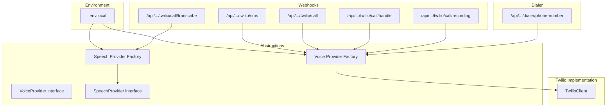
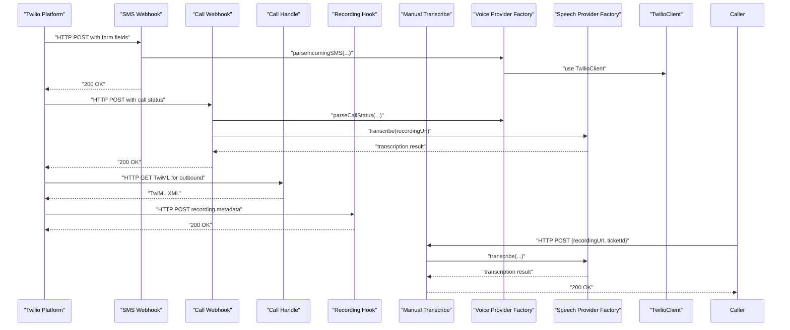
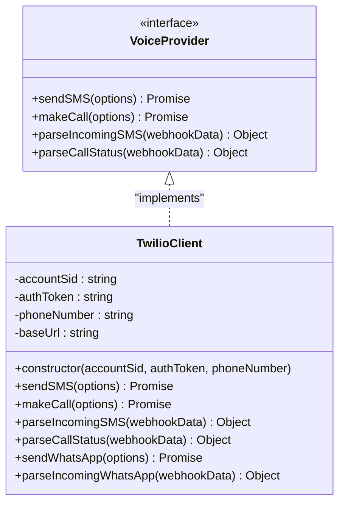
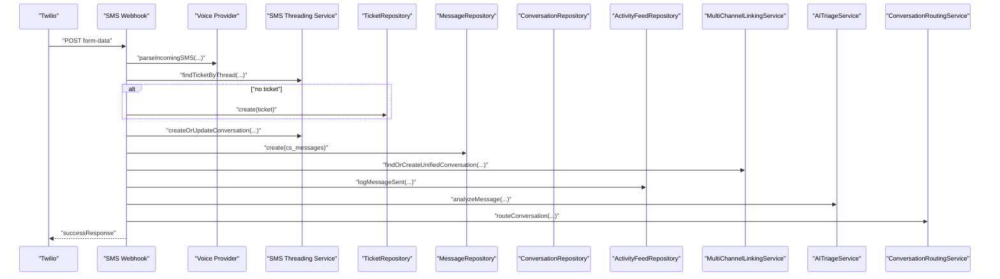
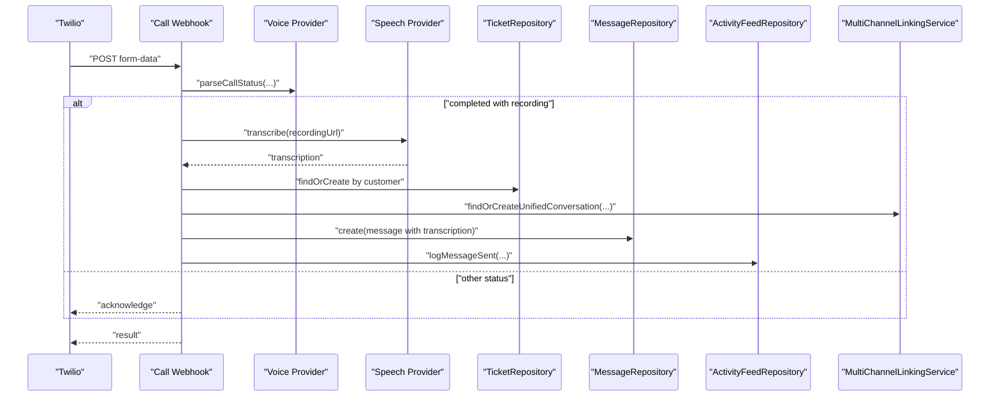
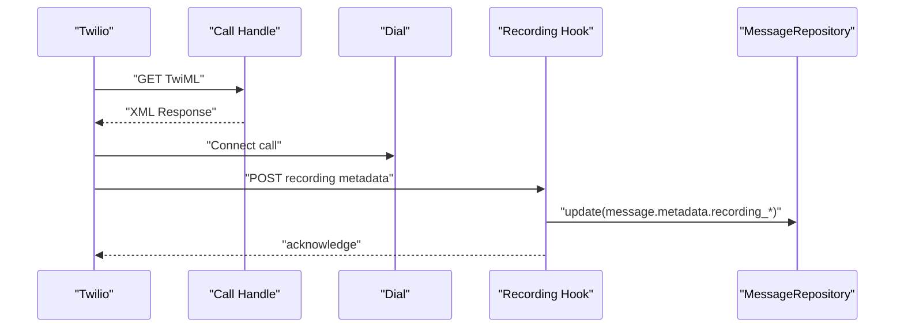
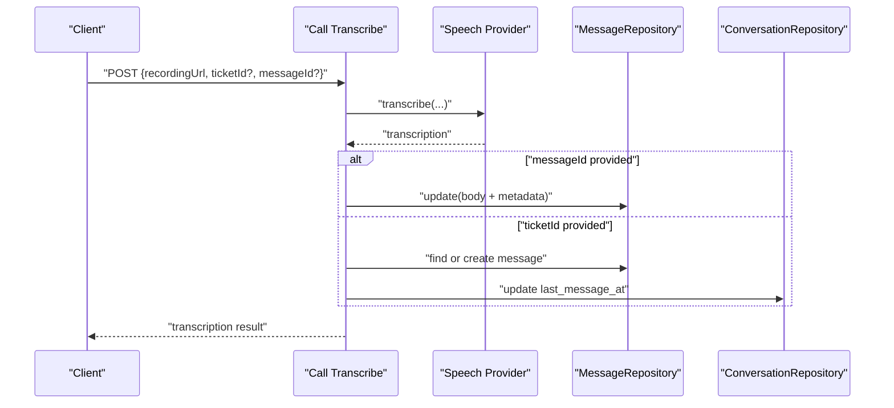
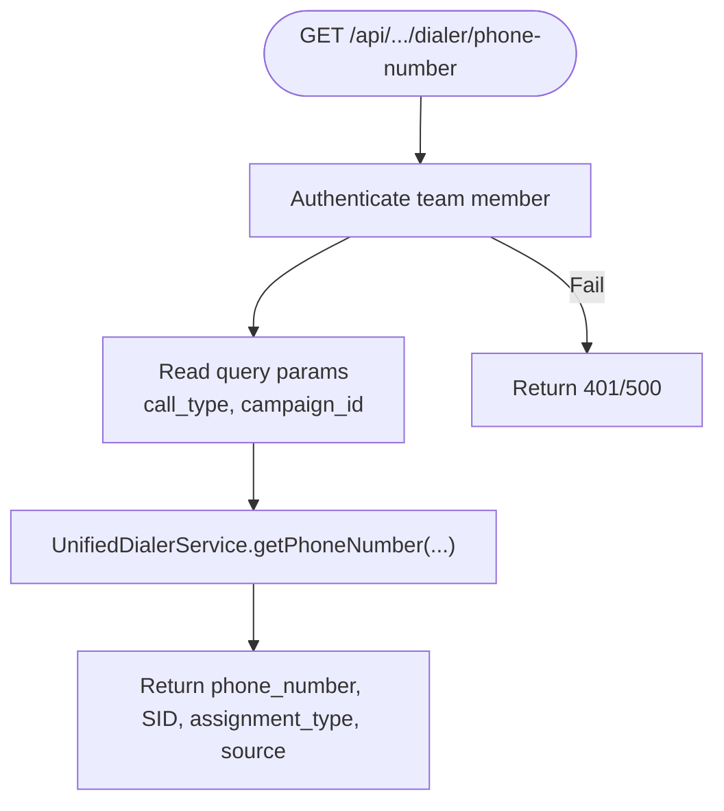
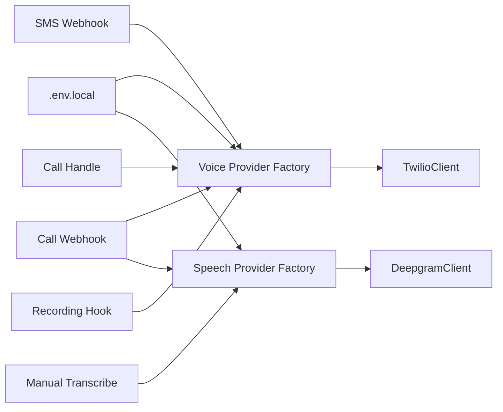

# Twilio Integration

<cite>
**Referenced Files in This Document**
- [twilio.ts](file://lib/integrations/twilio.ts)
- [voice-provider-factory.ts](file://lib/integrations/voice-provider-factory.ts)
- [voice-provider.ts](file://lib/interfaces/voice-provider.ts)
- [speech-provider-factory.ts](file://lib/integrations/speech-provider-factory.ts)
- [.env.local](file://.env.local)
- [route.ts](file://app/api/v1/webhooks/twilio/sms/route.ts)
- [route.ts](file://app/api/v1/webhooks/twilio/call/route.ts)
- [route.ts](file://app/api/v1/webhooks/twilio/call/handle/route.ts)
- [route.ts](file://app/api/v1/webhooks/twilio/call/recording/route.ts)
- [route.ts](file://app/api/v1/webhooks/twilio/call/transcribe/route.ts)
- [route.ts](file://app/api/v1/dialer/phone-number/route.ts)
</cite>

## Table of Contents
1. [Introduction](#introduction)
2. [Project Structure](#project-structure)
3. [Core Components](#core-components)
4. [Architecture Overview](#architecture-overview)
5. [Detailed Component Analysis](#detailed-component-analysis)
6. [Dependency Analysis](#dependency-analysis)
7. [Performance Considerations](#performance-considerations)
8. [Troubleshooting Guide](#troubleshooting-guide)
9. [Conclusion](#conclusion)
10. [Appendices](#appendices)

## Introduction
This document explains the Twilio integration for SMS messaging, voice calls, and webhook handling within the system. It covers SDK configuration, authentication setup, API key management, SMS sending and receiving workflows, voice call initiation and management, webhook endpoint implementations for call handling, recording, and transcription, dialer phone number management, and call routing. It also includes configuration examples, payload structures for webhook events, error handling strategies, rate limiting considerations, troubleshooting guides, testing procedures, and best practices for production deployments.

## Project Structure
The Twilio integration spans several layers:
- Provider abstraction and implementation under lib/integrations
- Webhook handlers under app/api/v1/webhooks/twilio
- Dialer phone number retrieval under app/api/v1/dialer
- Environment configuration under .env.local

**Diagram sources**
- [voice-provider-factory.ts](file://lib/integrations/voice-provider-factory.ts#L10-L22)
- [speech-provider-factory.ts](file://lib/integrations/speech-provider-factory.ts#L9-L76)
- [twilio.ts](file://lib/integrations/twilio.ts#L14-L29)
- [route.ts](file://app/api/v1/webhooks/twilio/sms/route.ts#L25-L31)
- [route.ts](file://app/api/v1/webhooks/twilio/call/route.ts#L17-L23)
- [route.ts](file://app/api/v1/webhooks/twilio/call/handle/route.ts#L12-L36)
- [route.ts](file://app/api/v1/webhooks/twilio/call/recording/route.ts#L10-L38)
- [route.ts](file://app/api/v1/webhooks/twilio/call/transcribe/route.ts#L13-L27)
- [route.ts](file://app/api/v1/dialer/phone-number/route.ts#L16-L36)

**Section sources**
- [voice-provider-factory.ts](file://lib/integrations/voice-provider-factory.ts#L10-L22)
- [speech-provider-factory.ts](file://lib/integrations/speech-provider-factory.ts#L9-L76)
- [twilio.ts](file://lib/integrations/twilio.ts#L14-L29)
- [route.ts](file://app/api/v1/webhooks/twilio/sms/route.ts#L25-L31)
- [route.ts](file://app/api/v1/webhooks/twilio/call/route.ts#L17-L23)
- [route.ts](file://app/api/v1/webhooks/twilio/call/handle/route.ts#L12-L36)
- [route.ts](file://app/api/v1/webhooks/twilio/call/recording/route.ts#L10-L38)
- [route.ts](file://app/api/v1/webhooks/twilio/call/transcribe/route.ts#L13-L27)
- [route.ts](file://app/api/v1/dialer/phone-number/route.ts#L16-L36)

## Core Components
- TwilioClient: Implements VoiceProvider to send SMS, initiate calls, and parse incoming webhook payloads for SMS and calls. Also supports WhatsApp via Twilio’s WhatsApp Business API.
- Voice Provider Factory: Selects the active voice provider based on VOICE_PROVIDER environment variable, defaulting to Twilio.
- Speech Provider Factory: Selects the active speech-to-text provider based on SPEECH_PROVIDER environment variable, defaulting to Deepgram.
- Webhook Handlers:
  - SMS webhook: Parses incoming SMS, creates or links tickets, conversations, and messages, logs activities, and optionally auto-triage and route.
  - Call webhook: Processes completed calls with recordings, triggers transcription, and persists results.
  - Call handle: Generates TwiML for outbound calls and handles call status updates.
  - Call recording: Updates messages with recording metadata.
  - Call transcribe: Manually transcribes a recording and updates or creates messages accordingly.
- Dialer API: Retrieves a phone number for outbound calls based on user, department, and campaign context.

**Section sources**
- [twilio.ts](file://lib/integrations/twilio.ts#L14-L241)
- [voice-provider-factory.ts](file://lib/integrations/voice-provider-factory.ts#L10-L22)
- [speech-provider-factory.ts](file://lib/integrations/speech-provider-factory.ts#L9-L76)
- [route.ts](file://app/api/v1/webhooks/twilio/sms/route.ts#L25-L172)
- [route.ts](file://app/api/v1/webhooks/twilio/call/route.ts#L17-L156)
- [route.ts](file://app/api/v1/webhooks/twilio/call/handle/route.ts#L12-L102)
- [route.ts](file://app/api/v1/webhooks/twilio/call/recording/route.ts#L10-L43)
- [route.ts](file://app/api/v1/webhooks/twilio/call/transcribe/route.ts#L13-L114)
- [route.ts](file://app/api/v1/dialer/phone-number/route.ts#L16-L51)

## Architecture Overview
The integration uses a provider abstraction to decouple Twilio-specific logic from higher-level services. Webhooks receive events from Twilio, parse payloads, and persist data through repositories and services. Outbound calls are initiated via TwilioClient and routed through TwiML endpoints.

**Diagram sources**
- [route.ts](file://app/api/v1/webhooks/twilio/sms/route.ts#L25-L172)
- [route.ts](file://app/api/v1/webhooks/twilio/call/route.ts#L17-L156)
- [route.ts](file://app/api/v1/webhooks/twilio/call/handle/route.ts#L12-L46)
- [route.ts](file://app/api/v1/webhooks/twilio/call/recording/route.ts#L10-L43)
- [route.ts](file://app/api/v1/webhooks/twilio/call/transcribe/route.ts#L13-L114)
- [voice-provider-factory.ts](file://lib/integrations/voice-provider-factory.ts#L10-L22)
- [speech-provider-factory.ts](file://lib/integrations/speech-provider-factory.ts#L9-L76)
- [twilio.ts](file://lib/integrations/twilio.ts#L14-L29)

## Detailed Component Analysis

### TwilioClient and Voice Provider Abstraction
TwilioClient implements the VoiceProvider interface, enabling:
- Sending SMS with optional sender number
- Initiating calls with optional TwiML URL and recording flag
- Parsing incoming SMS and call webhook payloads
- Sending WhatsApp messages via Twilio WhatsApp Business API with media support

**Diagram sources**
- [voice-provider.ts](file://lib/interfaces/voice-provider.ts#L6-L52)
- [twilio.ts](file://lib/integrations/twilio.ts#L14-L241)

**Section sources**
- [voice-provider.ts](file://lib/interfaces/voice-provider.ts#L6-L52)
- [twilio.ts](file://lib/integrations/twilio.ts#L14-L241)

### SMS Webhook Handling
The SMS webhook endpoint:
- Validates presence of required fields
- Finds or creates a ticket linked to the sender
- Creates or updates a conversation
- Persists inbound message via unified messaging service
- Logs activity and attempts auto-triage and routing asynchronously

**Diagram sources**
- [route.ts](file://app/api/v1/webhooks/twilio/sms/route.ts#L25-L172)
- [twilio.ts](file://lib/integrations/twilio.ts#L118-L130)

**Section sources**
- [route.ts](file://app/api/v1/webhooks/twilio/sms/route.ts#L25-L172)
- [twilio.ts](file://lib/integrations/twilio.ts#L118-L130)

### Call Webhook Handling
The call webhook endpoint:
- Parses call status updates
- Filters for completed calls with recording URL
- Transcribes recordings via speech provider
- Creates or links a ticket and conversation
- Stores transcription metadata in the message

**Diagram sources**
- [route.ts](file://app/api/v1/webhooks/twilio/call/route.ts#L17-L156)
- [twilio.ts](file://lib/integrations/twilio.ts#L135-L153)
- [speech-provider-factory.ts](file://lib/integrations/speech-provider-factory.ts#L9-L76)

**Section sources**
- [route.ts](file://app/api/v1/webhooks/twilio/call/route.ts#L17-L156)
- [twilio.ts](file://lib/integrations/twilio.ts#L135-L153)
- [speech-provider-factory.ts](file://lib/integrations/speech-provider-factory.ts#L9-L76)

### Call Handle and Recording Webhooks
- Call Handle TwiML endpoint generates TwiML for outbound calls and connects agents to customers, with recording callback configured.
- Call Recording webhook receives recording metadata and updates messages with recording URLs and identifiers.

**Diagram sources**
- [route.ts](file://app/api/v1/webhooks/twilio/call/handle/route.ts#L12-L46)
- [route.ts](file://app/api/v1/webhooks/twilio/call/recording/route.ts#L10-L38)

**Section sources**
- [route.ts](file://app/api/v1/webhooks/twilio/call/handle/route.ts#L12-L102)
- [route.ts](file://app/api/v1/webhooks/twilio/call/recording/route.ts#L10-L43)

### Manual Transcription Endpoint
The manual transcription endpoint:
- Accepts a recording URL and optional ticket/message identifiers
- Invokes the speech provider to transcribe
- Updates an existing message or creates a new one with transcription metadata

**Diagram sources**
- [route.ts](file://app/api/v1/webhooks/twilio/call/transcribe/route.ts#L13-L114)
- [speech-provider-factory.ts](file://lib/integrations/speech-provider-factory.ts#L9-L76)

**Section sources**
- [route.ts](file://app/api/v1/webhooks/twilio/call/transcribe/route.ts#L13-L114)
- [speech-provider-factory.ts](file://lib/integrations/speech-provider-factory.ts#L9-L76)

### Dialer Phone Number Management
The dialer API retrieves a phone number for outbound calls:
- Requires team member context
- Supports inbound/outbound call types and optional campaign context
- Delegates to UnifiedDialerService to select a number and SID

**Diagram sources**
- [route.ts](file://app/api/v1/dialer/phone-number/route.ts#L16-L51)

**Section sources**
- [route.ts](file://app/api/v1/dialer/phone-number/route.ts#L16-L51)

## Dependency Analysis
- TwilioClient depends on environment variables for credentials and numbers.
- Voice Provider Factory selects Twilio by default; can be extended for other providers.
- Webhooks depend on repositories and services for persistence and orchestration.
- Speech Provider Factory selects Deepgram by default; can be extended for other providers.

**Diagram sources**
- [voice-provider-factory.ts](file://lib/integrations/voice-provider-factory.ts#L10-L22)
- [speech-provider-factory.ts](file://lib/integrations/speech-provider-factory.ts#L9-L76)
- [twilio.ts](file://lib/integrations/twilio.ts#L14-L29)
- [route.ts](file://app/api/v1/webhooks/twilio/sms/route.ts#L25-L31)
- [route.ts](file://app/api/v1/webhooks/twilio/call/route.ts#L17-L23)
- [route.ts](file://app/api/v1/webhooks/twilio/call/handle/route.ts#L12-L36)
- [route.ts](file://app/api/v1/webhooks/twilio/call/recording/route.ts#L10-L38)
- [route.ts](file://app/api/v1/webhooks/twilio/call/transcribe/route.ts#L13-L27)

**Section sources**
- [voice-provider-factory.ts](file://lib/integrations/voice-provider-factory.ts#L10-L22)
- [speech-provider-factory.ts](file://lib/integrations/speech-provider-factory.ts#L9-L76)
- [twilio.ts](file://lib/integrations/twilio.ts#L14-L29)
- [route.ts](file://app/api/v1/webhooks/twilio/sms/route.ts#L25-L31)
- [route.ts](file://app/api/v1/webhooks/twilio/call/route.ts#L17-L23)
- [route.ts](file://app/api/v1/webhooks/twilio/call/handle/route.ts#L12-L36)
- [route.ts](file://app/api/v1/webhooks/twilio/call/recording/route.ts#L10-L38)
- [route.ts](file://app/api/v1/webhooks/twilio/call/transcribe/route.ts#L13-L27)

## Performance Considerations
- Asynchronous processing: Auto-triage and routing in the SMS webhook are performed asynchronously to avoid blocking webhook responses.
- Minimal retries: Webhook handlers return success even when downstream operations (e.g., transcription) fail, logging errors for later inspection.
- Efficient parsing: Webhook payloads are parsed into typed objects once per request.
- Rate limiting: Twilio API rate limits apply; implement exponential backoff and circuit breakers at the caller level if invoking TwilioClient directly outside webhooks.
- Caching: Consider caching frequently accessed phone number assignments for dialer requests.

[No sources needed since this section provides general guidance]

## Troubleshooting Guide
Common issues and resolutions:
- Missing credentials: Ensure TWILIO_ACCOUNT_SID, TWILIO_AUTH_TOKEN, and TWILIO_PHONE_NUMBER are set in environment variables.
- Webhook validation failures: Verify API key middleware is configured and the webhook endpoints are registered.
- SMS threading mismatches: Confirm phone number normalization and thread matching logic align with incoming data.
- Call transcription failures: Check SPEECH_PROVIDER configuration and Deepgram API key; inspect returned error payloads.
- Recording metadata missing: Ensure recordingStatusCallback is configured in TwiML and the recording webhook is reachable.
- Dialer number retrieval errors: Validate team member context and campaign parameters passed to the dialer API.

**Section sources**
- [.env.local](file://.env.local#L125-L146)
- [route.ts](file://app/api/v1/webhooks/twilio/sms/route.ts#L165-L171)
- [route.ts](file://app/api/v1/webhooks/twilio/call/route.ts#L146-L155)
- [route.ts](file://app/api/v1/webhooks/twilio/call/transcribe/route.ts#L107-L113)
- [route.ts](file://app/api/v1/webhooks/twilio/call/handle/route.ts#L33-L36)
- [route.ts](file://app/api/v1/dialer/phone-number/route.ts#L44-L49)

## Conclusion
The Twilio integration provides robust SMS and voice capabilities with a clean abstraction layer, comprehensive webhook handling, and extensible factories for voice and speech providers. The dialer API enables managed outbound calling with number assignment and routing. Production deployments should focus on secure credential management, resilient webhook processing, and monitoring of transcription and recording flows.

[No sources needed since this section summarizes without analyzing specific files]

## Appendices

### Configuration Examples
- Twilio credentials and numbers:
  - TWILIO_ACCOUNT_SID, TWILIO_AUTH_TOKEN, TWILIO_PHONE_NUMBER, TWILIO_SMS_FROM
  - Optional TWILIO_TESTING_* variants for sandbox testing
- Provider selection:
  - VOICE_PROVIDER defaults to twilio; can be set to plivo for alternate provider
  - SPEECH_PROVIDER defaults to deepgram; can be set to livekit or custom
- API keys:
  - Use CS_SUPPORT_SERVICE_API_KEY for webhook authentication where enforced

**Section sources**
- [.env.local](file://.env.local#L125-L146)
- [voice-provider-factory.ts](file://lib/integrations/voice-provider-factory.ts#L10-L22)
- [speech-provider-factory.ts](file://lib/integrations/speech-provider-factory.ts#L9-L76)
- [.env.local](file://.env.local#L27-L75)

### Payload Structures for Webhook Events
- SMS webhook form fields:
  - From, To, Body, MessageSid
- Call webhook form fields:
  - CallSid, From, To, CallStatus, CallDuration, RecordingUrl
- Call handle GET query parameters:
  - ticket_id, agent_id
- Call recording webhook form fields:
  - CallSid, RecordingUrl, RecordingSid, RecordingDuration
- Manual transcribe request body:
  - recordingUrl, ticketId, messageId

**Section sources**
- [twilio.ts](file://lib/integrations/twilio.ts#L118-L153)
- [route.ts](file://app/api/v1/webhooks/twilio/sms/route.ts#L27-L35)
- [route.ts](file://app/api/v1/webhooks/twilio/call/route.ts#L19-L30)
- [route.ts](file://app/api/v1/webhooks/twilio/call/handle/route.ts#L14-L20)
- [route.ts](file://app/api/v1/webhooks/twilio/call/recording/route.ts#L12-L17)
- [route.ts](file://app/api/v1/webhooks/twilio/call/transcribe/route.ts#L15-L20)

### Error Handling Strategies
- Webhook handlers return success responses even when downstream operations fail, ensuring Twilio does not retry indefinitely.
- Errors are logged for diagnostics; upstream callers should monitor logs and alert on persistent failures.
- Validation errors return structured error responses with appropriate HTTP status codes.

**Section sources**
- [route.ts](file://app/api/v1/webhooks/twilio/sms/route.ts#L165-L171)
- [route.ts](file://app/api/v1/webhooks/twilio/call/route.ts#L146-L155)
- [route.ts](file://app/api/v1/webhooks/twilio/call/transcribe/route.ts#L107-L113)

### Rate Limiting Considerations
- Twilio enforces rate limits on API calls; implement client-side throttling and exponential backoff when invoking TwilioClient directly.
- Prefer webhook-driven workflows to minimize synchronous API calls during peak traffic.

[No sources needed since this section provides general guidance]

### Testing Procedures
- SMS end-to-end:
  - Send test SMS via TwilioClient and verify creation of ticket, conversation, and message records.
  - Trigger SMS webhook with mock form fields and confirm auto-triage and routing behavior.
- Voice end-to-end:
  - Initiate a call using TwilioClient and verify TwiML generation and call status updates.
  - Simulate completed call with recording and confirm transcription and message persistence.
- Dialer:
  - Call the dialer API with a valid team member context and verify phone number assignment.

**Section sources**
- [twilio.ts](file://lib/integrations/twilio.ts#L34-L113)
- [route.ts](file://app/api/v1/webhooks/twilio/sms/route.ts#L25-L172)
- [route.ts](file://app/api/v1/webhooks/twilio/call/route.ts#L17-L156)
- [route.ts](file://app/api/v1/dialer/phone-number/route.ts#L16-L51)

### Best Practices for Production Deployments
- Secure environment variables: Store Twilio credentials and API keys in secrets management; avoid committing to version control.
- Webhook security: Enforce API key middleware on webhook endpoints; validate signatures if supported by the provider.
- Idempotency: Design webhook handlers to tolerate duplicate deliveries; use message IDs to deduplicate.
- Observability: Instrument webhook handlers with metrics and structured logs; monitor latency and failure rates.
- Resilience: Use circuit breakers and retries for downstream services (e.g., transcription); degrade gracefully when unavailable.
- Compliance: Ensure PII handling complies with privacy regulations; redact sensitive data in logs.

[No sources needed since this section provides general guidance]