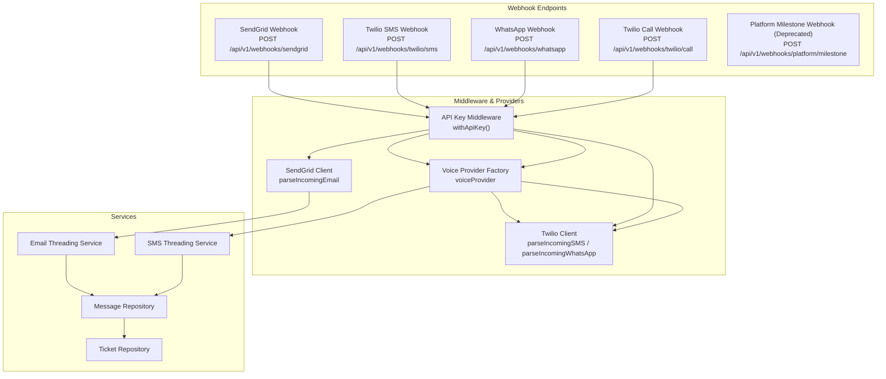
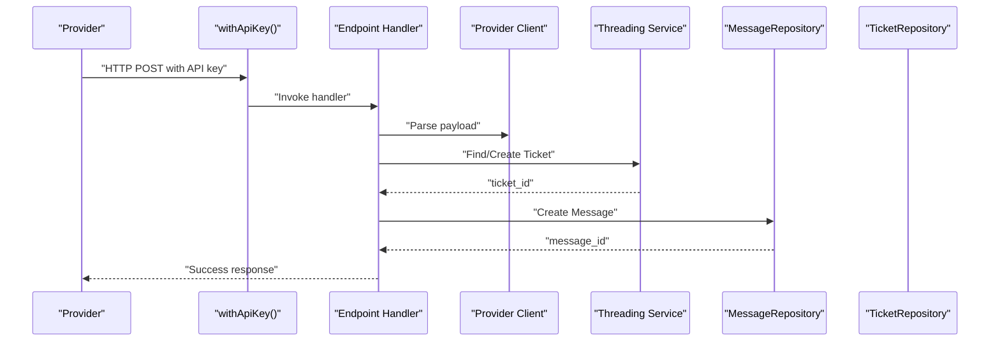
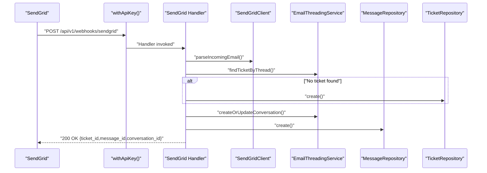
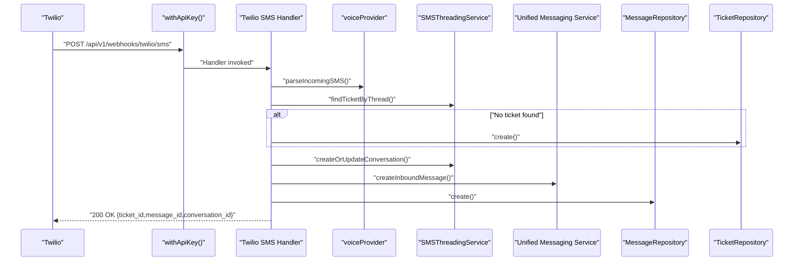
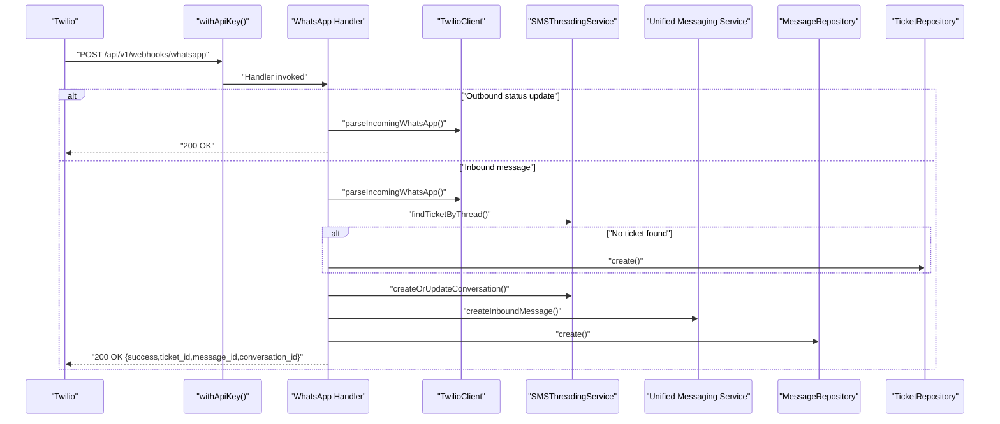
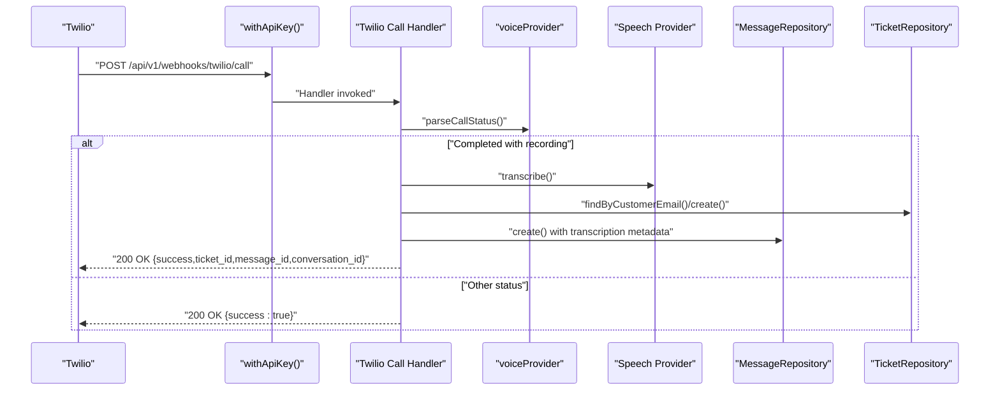
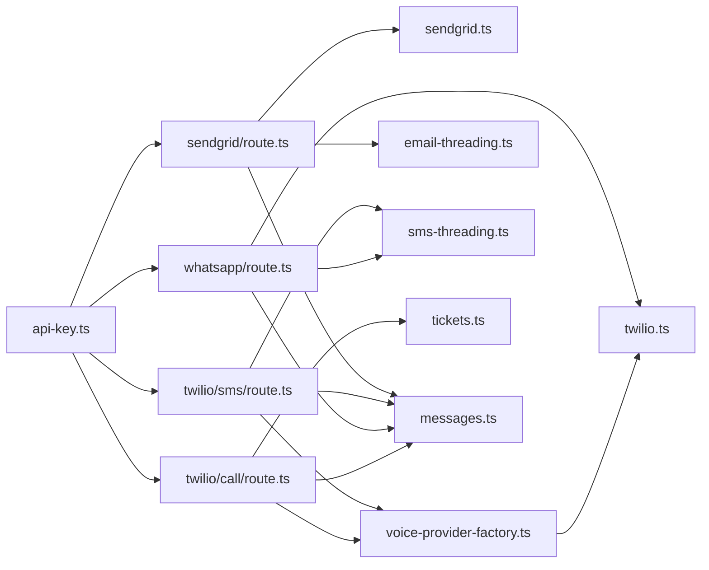
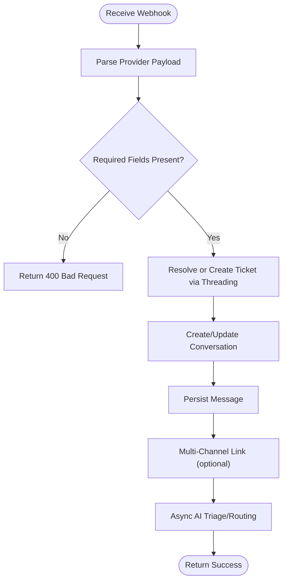

# Webhook Management

<cite>
**Referenced Files in This Document**
- [route.ts](file://app/api/v1/webhooks/platform/milestone/route.ts)
- [route.ts](file://app/api/v1/webhooks/sendgrid/route.ts)
- [route.ts](file://app/api/v1/webhooks/twilio/sms/route.ts)
- [route.ts](file://app/api/v1/webhooks/whatsapp/route.ts)
- [route.ts](file://app/api/v1/webhooks/twilio/call/route.ts)
- [api-key.ts](file://lib/middleware/api-key.ts)
- [voice-provider-factory.ts](file://lib/integrations/voice-provider-factory.ts)
- [sendgrid.ts](file://lib/integrations/sendgrid.ts)
- [twilio.ts](file://lib/integrations/twilio.ts)
- [sms-threading.ts](file://lib/services/sms-threading.ts)
- [email-threading.ts](file://lib/services/email-threading.ts)
- [tickets.ts](file://lib/repositories/tickets.ts)
- [messages.ts](file://lib/repositories/messages.ts)
</cite>

## Table of Contents
1. [Introduction](#introduction)
2. [Project Structure](#project-structure)
3. [Core Components](#core-components)
4. [Architecture Overview](#architecture-overview)
5. [Detailed Component Analysis](#detailed-component-analysis)
6. [Dependency Analysis](#dependency-analysis)
7. [Performance Considerations](#performance-considerations)
8. [Security Considerations](#security-considerations)
9. [Payload Validation and Event Processing](#payload-validation-and-event-processing)
10. [Retry Mechanisms and Dead Letter Queue](#retry-mechanisms-and-dead-letter-queue)
11. [Configuration and Provider Endpoints](#configuration-and-provider-endpoints)
12. [Testing and Monitoring](#testing-and-monitoring)
13. [Troubleshooting Guide](#troubleshooting-guide)
14. [Conclusion](#conclusion)

## Introduction
This document describes the webhook management system that ingests events from third-party providers (SendGrid, Twilio) and transforms them into internal tickets, conversations, and messages. It covers endpoint architecture, payload parsing, threading logic, auto-assignment, triage, routing, and operational concerns such as authentication, retries, and monitoring. It also documents provider-specific endpoints for SMS, WhatsApp, and call events, and outlines how to configure and test webhooks reliably.

## Project Structure
The webhook endpoints are organized under the Next.js App Router at:
- app/api/v1/webhooks/sendgrid/route.ts
- app/api/v1/webhooks/twilio/sms/route.ts
- app/api/v1/webhooks/whatsapp/route.ts
- app/api/v1/webhooks/twilio/call/route.ts
- app/api/v1/webhooks/platform/milestone/route.ts (deprecated)

Common infrastructure:
- Authentication middleware: lib/middleware/api-key.ts
- Provider abstractions: lib/integrations/voice-provider-factory.ts, lib/integrations/twilio.ts, lib/integrations/sendgrid.ts
- Threading and orchestration services: lib/services/sms-threading.ts, lib/services/email-threading.ts
- Persistence: lib/repositories/tickets.ts, lib/repositories/messages.ts

**Diagram sources**
- [route.ts](file://app/api/v1/webhooks/sendgrid/route.ts#L15-L188)
- [route.ts](file://app/api/v1/webhooks/twilio/sms/route.ts#L21-L173)
- [route.ts](file://app/api/v1/webhooks/whatsapp/route.ts#L19-L176)
- [route.ts](file://app/api/v1/webhooks/twilio/call/route.ts#L17-L157)
- [api-key.ts](file://lib/middleware/api-key.ts#L83-L100)
- [voice-provider-factory.ts](file://lib/integrations/voice-provider-factory.ts#L12-L23)
- [twilio.ts](file://lib/integrations/twilio.ts#L115-L153)
- [sendgrid.ts](file://lib/integrations/sendgrid.ts#L113-L148)
- [sms-threading.ts](file://lib/services/sms-threading.ts#L17-L83)
- [email-threading.ts](file://lib/services/email-threading.ts#L19-L111)
- [messages.ts](file://lib/repositories/messages.ts#L41-L51)
- [tickets.ts](file://lib/repositories/tickets.ts#L76-L86)

**Section sources**
- [route.ts](file://app/api/v1/webhooks/sendgrid/route.ts#L1-L188)
- [route.ts](file://app/api/v1/webhooks/twilio/sms/route.ts#L1-L173)
- [route.ts](file://app/api/v1/webhooks/whatsapp/route.ts#L1-L176)
- [route.ts](file://app/api/v1/webhooks/twilio/call/route.ts#L1-L157)
- [api-key.ts](file://lib/middleware/api-key.ts#L1-L122)
- [voice-provider-factory.ts](file://lib/integrations/voice-provider-factory.ts#L1-L23)
- [twilio.ts](file://lib/integrations/twilio.ts#L1-L245)
- [sendgrid.ts](file://lib/integrations/sendgrid.ts#L1-L153)
- [sms-threading.ts](file://lib/services/sms-threading.ts#L1-L83)
- [email-threading.ts](file://lib/services/email-threading.ts#L1-L111)
- [messages.ts](file://lib/repositories/messages.ts#L1-L156)
- [tickets.ts](file://lib/repositories/tickets.ts#L1-L247)

## Core Components
- API Key Middleware: Enforces service-to-service authentication via Bearer token or x-api-key header against configured keys.
- Provider Clients:
  - TwilioClient: Parses incoming SMS, call status, and WhatsApp messages; sends SMS and WhatsApp.
  - SendGridClient: Sends outbound emails; parses inbound email payloads.
  - Voice Provider Factory: Selects Twilio or Plivo based on environment variable.
- Threading Services:
  - EmailThreadingService: Finds tickets by In-Reply-To/References headers and subject patterns.
  - SMSThreadingService: Groups SMS by message ID or recent open tickets by phone number.
- Repositories:
  - TicketRepository: CRUD and queries for tickets.
  - MessageRepository: CRUD and queries for messages, including external ID lookups.
- Endpoint Handlers:
  - SendGrid: Processes inbound emails into tickets/conversations/messages; logs activity; triggers triage and routing asynchronously.
  - Twilio SMS: Processes inbound SMS; creates unified messaging records; links across channels; async triage/routing.
  - WhatsApp: Distinguishes outbound status updates vs inbound messages; handles media; unified messaging; async triage/routing.
  - Twilio Call: Processes completed calls with recordings; transcribes audio; creates call transcripts as messages; updates ticket.

**Section sources**
- [api-key.ts](file://lib/middleware/api-key.ts#L83-L100)
- [twilio.ts](file://lib/integrations/twilio.ts#L115-L153)
- [twilio.ts](file://lib/integrations/twilio.ts#L214-L240)
- [sendgrid.ts](file://lib/integrations/sendgrid.ts#L113-L148)
- [voice-provider-factory.ts](file://lib/integrations/voice-provider-factory.ts#L12-L23)
- [email-threading.ts](file://lib/services/email-threading.ts#L19-L111)
- [sms-threading.ts](file://lib/services/sms-threading.ts#L17-L83)
- [tickets.ts](file://lib/repositories/tickets.ts#L76-L86)
- [messages.ts](file://lib/repositories/messages.ts#L41-L51)
- [route.ts](file://app/api/v1/webhooks/sendgrid/route.ts#L19-L186)
- [route.ts](file://app/api/v1/webhooks/twilio/sms/route.ts#L25-L172)
- [route.ts](file://app/api/v1/webhooks/whatsapp/route.ts#L19-L175)
- [route.ts](file://app/api/v1/webhooks/twilio/call/route.ts#L17-L156)

## Architecture Overview
The webhook system follows a consistent pattern:
- Authenticate request using API key middleware.
- Parse provider-specific payload into a normalized shape.
- Resolve or create a ticket using threading logic.
- Create or update a conversation.
- Persist the message and log activity.
- Optionally link across channels and trigger AI triage/routing asynchronously.
- Return a structured success response.

**Diagram sources**
- [api-key.ts](file://lib/middleware/api-key.ts#L83-L100)
- [route.ts](file://app/api/v1/webhooks/sendgrid/route.ts#L19-L186)
- [sendgrid.ts](file://lib/integrations/sendgrid.ts#L113-L148)
- [email-threading.ts](file://lib/services/email-threading.ts#L19-L111)
- [messages.ts](file://lib/repositories/messages.ts#L41-L51)
- [tickets.ts](file://lib/repositories/tickets.ts#L76-L86)

## Detailed Component Analysis

### SendGrid Webhook
- Purpose: Ingest inbound emails and create or link tickets and messages.
- Key steps:
  - Parse email payload using SendGrid client.
  - Thread by In-Reply-To/References or recent open tickets by customer email.
  - Create ticket if none found.
  - Create or update conversation.
  - Create message with attachments and references.
  - Attempt multi-channel linking and log activity.
  - Asynchronously apply AI triage tags and routing if enabled.

**Diagram sources**
- [route.ts](file://app/api/v1/webhooks/sendgrid/route.ts#L19-L186)
- [sendgrid.ts](file://lib/integrations/sendgrid.ts#L113-L148)
- [email-threading.ts](file://lib/services/email-threading.ts#L19-L111)
- [messages.ts](file://lib/repositories/messages.ts#L41-L51)
- [tickets.ts](file://lib/repositories/tickets.ts#L76-L86)

**Section sources**
- [route.ts](file://app/api/v1/webhooks/sendgrid/route.ts#L19-L186)
- [sendgrid.ts](file://lib/integrations/sendgrid.ts#L113-L148)
- [email-threading.ts](file://lib/services/email-threading.ts#L19-L111)

### Twilio SMS Webhook
- Purpose: Ingest inbound SMS and create unified messaging records.
- Key steps:
  - Parse SMS payload via voice provider abstraction.
  - Thread by message ID or recent open tickets by phone number.
  - Create ticket if none found.
  - Create or update conversation.
  - Create inbound message in unified messaging service and cs_messages.
  - Link across channels and log activity.
  - Asynchronously triage and route.

**Diagram sources**
- [route.ts](file://app/api/v1/webhooks/twilio/sms/route.ts#L25-L172)
- [voice-provider-factory.ts](file://lib/integrations/voice-provider-factory.ts#L12-L23)
- [twilio.ts](file://lib/integrations/twilio.ts#L115-L130)
- [sms-threading.ts](file://lib/services/sms-threading.ts#L17-L83)
- [messages.ts](file://lib/repositories/messages.ts#L41-L51)
- [tickets.ts](file://lib/repositories/tickets.ts#L76-L86)

**Section sources**
- [route.ts](file://app/api/v1/webhooks/twilio/sms/route.ts#L25-L172)
- [voice-provider-factory.ts](file://lib/integrations/voice-provider-factory.ts#L12-L23)
- [twilio.ts](file://lib/integrations/twilio.ts#L115-L130)
- [sms-threading.ts](file://lib/services/sms-threading.ts#L17-L83)

### WhatsApp Webhook
- Purpose: Handle inbound WhatsApp messages and outbound status updates.
- Key steps:
  - Detect status update vs inbound message.
  - For status updates: normalize status and update unified message status.
  - For inbound: parse message and media; thread by message ID or recent tickets; create ticket/conversation; persist message with attachments; link across channels; log activity.

**Diagram sources**
- [route.ts](file://app/api/v1/webhooks/whatsapp/route.ts#L19-L175)
- [twilio.ts](file://lib/integrations/twilio.ts#L214-L240)
- [sms-threading.ts](file://lib/services/sms-threading.ts#L17-L83)
- [messages.ts](file://lib/repositories/messages.ts#L41-L51)
- [tickets.ts](file://lib/repositories/tickets.ts#L76-L86)

**Section sources**
- [route.ts](file://app/api/v1/webhooks/whatsapp/route.ts#L19-L175)
- [twilio.ts](file://lib/integrations/twilio.ts#L214-L240)
- [sms-threading.ts](file://lib/services/sms-threading.ts#L17-L83)

### Twilio Call Webhook
- Purpose: Process completed calls with recordings, transcribe audio, and create call transcript messages.
- Key steps:
  - Parse call status via voice provider.
  - For completed calls with recording URL: transcribe audio, resolve or create ticket, link across channels, create message with transcription metadata, update ticket timestamps.

**Diagram sources**
- [route.ts](file://app/api/v1/webhooks/twilio/call/route.ts#L17-L156)
- [voice-provider-factory.ts](file://lib/integrations/voice-provider-factory.ts#L12-L23)
- [twilio.ts](file://lib/integrations/twilio.ts#L132-L153)

**Section sources**
- [route.ts](file://app/api/v1/webhooks/twilio/call/route.ts#L17-L156)
- [voice-provider-factory.ts](file://lib/integrations/voice-provider-factory.ts#L12-L23)
- [twilio.ts](file://lib/integrations/twilio.ts#L132-L153)

### Deprecated Platform Milestone Webhook
- Purpose: Legacy endpoint for platform milestone webhooks.
- Behavior: Returns 410 Gone indicating the resource has been moved to SaaS Admin service.

**Section sources**
- [route.ts](file://app/api/v1/webhooks/platform/milestone/route.ts#L15-L22)

## Dependency Analysis
- Authentication: All webhook endpoints wrap handlers with the API key middleware to validate service-to-service requests.
- Provider Abstraction: Twilio SMS/WhatsApp and call status are parsed via the voice provider factory, enabling pluggable providers.
- Threading: Email and SMS threading services encapsulate cross-channel message correlation logic.
- Persistence: Message and ticket repositories provide CRUD and lookup operations used across handlers.

**Diagram sources**
- [api-key.ts](file://lib/middleware/api-key.ts#L83-L100)
- [route.ts](file://app/api/v1/webhooks/sendgrid/route.ts#L1-L188)
- [route.ts](file://app/api/v1/webhooks/twilio/sms/route.ts#L1-L173)
- [route.ts](file://app/api/v1/webhooks/whatsapp/route.ts#L1-L176)
- [route.ts](file://app/api/v1/webhooks/twilio/call/route.ts#L1-L157)
- [sendgrid.ts](file://lib/integrations/sendgrid.ts#L1-L153)
- [voice-provider-factory.ts](file://lib/integrations/voice-provider-factory.ts#L1-L23)
- [twilio.ts](file://lib/integrations/twilio.ts#L1-L245)
- [email-threading.ts](file://lib/services/email-threading.ts#L1-L111)
- [sms-threading.ts](file://lib/services/sms-threading.ts#L1-L83)
- [tickets.ts](file://lib/repositories/tickets.ts#L1-L247)
- [messages.ts](file://lib/repositories/messages.ts#L1-L156)

**Section sources**
- [api-key.ts](file://lib/middleware/api-key.ts#L1-L122)
- [voice-provider-factory.ts](file://lib/integrations/voice-provider-factory.ts#L1-L23)
- [twilio.ts](file://lib/integrations/twilio.ts#L1-L245)
- [sendgrid.ts](file://lib/integrations/sendgrid.ts#L1-L153)
- [email-threading.ts](file://lib/services/email-threading.ts#L1-L111)
- [sms-threading.ts](file://lib/services/sms-threading.ts#L1-L83)
- [messages.ts](file://lib/repositories/messages.ts#L1-L156)
- [tickets.ts](file://lib/repositories/tickets.ts#L1-L247)

## Performance Considerations
- Asynchronous AI triage and routing: Handlers return quickly after persisting messages and defer AI tagging and routing to prevent webhook timeouts.
- Minimal blocking: External provider calls (Twilio/SendGrid) are awaited only when necessary; non-critical operations continue even if linking fails.
- Efficient lookups: Threading services rely on indexed lookups by external IDs and recent tickets to reduce latency.
- Concurrency: Each handler processes one request; ensure upstream providers throttle retries appropriately.

[No sources needed since this section provides general guidance]

## Security Considerations
- API Key Authentication: All endpoints require a valid API key via Bearer token or x-api-key header. Keys are validated against a configured allowlist.
- Least Privilege: API keys are scoped to trusted internal services; avoid exposing endpoints publicly.
- Input Validation: Handlers validate presence of required fields (e.g., from, message for SMS/WhatsApp; from, subject for email) and return structured errors.
- Logging: Errors are logged; sensitive data is not returned in responses.

**Section sources**
- [api-key.ts](file://lib/middleware/api-key.ts#L26-L48)
- [route.ts](file://app/api/v1/webhooks/sendgrid/route.ts#L30-L35)
- [route.ts](file://app/api/v1/webhooks/twilio/sms/route.ts#L33-L35)
- [route.ts](file://app/api/v1/webhooks/whatsapp/route.ts#L54-L58)

## Payload Validation and Event Processing
- SendGrid:
  - Required fields: from, to, subject, text/html, messageId.
  - Optional: inReplyTo, references, attachments.
  - Response: success payload with identifiers.
- Twilio SMS:
  - Required fields: From, To, Body, MessageSid.
  - Response: success payload with identifiers.
- WhatsApp:
  - Status detection: MessageStatus distinguishes outbound status updates from inbound messages.
  - Required fields for inbound: From, To, Body, MessageSid; optional media via MediaUrlN.
  - Response: success payload with identifiers.
- Twilio Call:
  - Required fields: CallSid; recording URL for completed calls.
  - Response: success payload with identifiers.

**Diagram sources**
- [sendgrid.ts](file://lib/integrations/sendgrid.ts#L113-L148)
- [twilio.ts](file://lib/integrations/twilio.ts#L115-L130)
- [twilio.ts](file://lib/integrations/twilio.ts#L214-L240)
- [route.ts](file://app/api/v1/webhooks/sendgrid/route.ts#L19-L186)
- [route.ts](file://app/api/v1/webhooks/twilio/sms/route.ts#L25-L172)
- [route.ts](file://app/api/v1/webhooks/whatsapp/route.ts#L19-L175)
- [route.ts](file://app/api/v1/webhooks/twilio/call/route.ts#L17-L156)

**Section sources**
- [sendgrid.ts](file://lib/integrations/sendgrid.ts#L113-L148)
- [twilio.ts](file://lib/integrations/twilio.ts#L115-L130)
- [twilio.ts](file://lib/integrations/twilio.ts#L214-L240)
- [route.ts](file://app/api/v1/webhooks/sendgrid/route.ts#L19-L186)
- [route.ts](file://app/api/v1/webhooks/twilio/sms/route.ts#L25-L172)
- [route.ts](file://app/api/v1/webhooks/whatsapp/route.ts#L19-L175)
- [route.ts](file://app/api/v1/webhooks/twilio/call/route.ts#L17-L156)

## Retry Mechanisms and Dead Letter Queue
- Current Implementation: Webhook handlers return success immediately after persisting messages. There is no built-in retry mechanism or dead letter queue within these handlers.
- Recommended Practices:
  - Configure provider webhooks to retry on transient failures with exponential backoff.
  - Implement a separate job queue to reprocess failed messages with bounded retries and DLQ storage.
  - Monitor 5xx responses and webhook delivery logs to identify persistent failures.

[No sources needed since this section provides general guidance]

## Configuration and Provider Endpoints
- API Key Middleware:
  - Accepts API key from Authorization: Bearer <key> or x-api-key header.
  - Validates against configured keys for CS-Support, Sales, Platform, Internal Ops, Tenant services.
- Provider Endpoints:
  - SendGrid: POST /api/v1/webhooks/sendgrid
  - Twilio SMS: POST /api/v1/webhooks/twilio/sms
  - WhatsApp: POST /api/v1/webhooks/whatsapp
  - Twilio Call: POST /api/v1/webhooks/twilio/call
  - Platform Milestone: POST /api/v1/webhooks/platform/milestone (deprecated)
- Environment Variables:
  - Twilio: TWILIO_ACCOUNT_SID, TWILIO_AUTH_TOKEN, TWILIO_PHONE_NUMBER, TWILIO_WHATSAPP_NUMBER
  - SendGrid: SENDGRID_API_KEY, SENDGRID_FROM_EMAIL, SENDGRID_FROM_NAME
  - Voice Provider: VOICE_PROVIDER (default twilio)
  - Service API Keys: CS_SUPPORT_SERVICE_API_KEY, SALES_SERVICE_API_KEY, PLATFORM_SERVICE_API_KEY, etc.
  - Auto Routing: ENABLE_AUTO_ROUTING (boolean string)

**Section sources**
- [api-key.ts](file://lib/middleware/api-key.ts#L9-L21)
- [route.ts](file://app/api/v1/webhooks/sendgrid/route.ts#L16-L18)
- [route.ts](file://app/api/v1/webhooks/twilio/sms/route.ts#L22-L24)
- [route.ts](file://app/api/v1/webhooks/whatsapp/route.ts#L19-L20)
- [route.ts](file://app/api/v1/webhooks/twilio/call/route.ts#L17-L18)
- [route.ts](file://app/api/v1/webhooks/platform/milestone/route.ts#L4-L9)
- [twilio.ts](file://lib/integrations/twilio.ts#L9-L12)
- [sendgrid.ts](file://lib/integrations/sendgrid.ts#L6-L8)
- [voice-provider-factory.ts](file://lib/integrations/voice-provider-factory.ts#L10)

## Testing and Monitoring
- Testing Procedures:
  - Unit tests for provider clients and threading services.
  - End-to-end tests using mock provider payloads to simulate inbound events.
  - Load tests to validate persistence and async triage performance.
- Monitoring Strategies:
  - Track webhook endpoint latencies and error rates.
  - Monitor repository operation durations and failure counts.
  - Observe async triage and routing job queues.
  - Alert on sustained 5xx errors or missing required fields.

[No sources needed since this section provides general guidance]

## Troubleshooting Guide
- Authentication Failures:
  - Symptom: 401 Unauthorized responses.
  - Actions: Verify API key presence and correctness; confirm header format (Bearer or x-api-key).
- Missing Required Fields:
  - Symptom: 400 Bad Request for SMS/WhatsApp/email.
  - Actions: Ensure provider webhook payloads include From/To/Body/MessageSid for SMS/WhatsApp and from/text/html/messageId for email.
- Threading Issues:
  - Symptom: New tickets created instead of linked to existing conversations.
  - Actions: Confirm external IDs and recent ticket queries; verify threading logic for email references and SMS message IDs.
- Multi-Channel Linking Failures:
  - Symptom: Messages not visible across channels.
  - Actions: Inspect linking service logs; ensure customer identifiers (phone/email) match across channels.
- Async Triage/Routing Failures:
  - Symptom: No tags applied or routing decisions not executed.
  - Actions: Check environment flag ENABLE_AUTO_ROUTING; monitor AI triage service availability.

**Section sources**
- [api-key.ts](file://lib/middleware/api-key.ts#L66-L78)
- [route.ts](file://app/api/v1/webhooks/sendgrid/route.ts#L30-L35)
- [route.ts](file://app/api/v1/webhooks/twilio/sms/route.ts#L33-L35)
- [route.ts](file://app/api/v1/webhooks/whatsapp/route.ts#L54-L58)
- [email-threading.ts](file://lib/services/email-threading.ts#L24-L71)
- [sms-threading.ts](file://lib/services/sms-threading.ts#L22-L43)

## Conclusion
The webhook management system provides robust ingestion of provider events with consistent authentication, payload parsing, threading, and asynchronous processing. By leveraging provider abstractions and repository patterns, it scales across email, SMS, WhatsApp, and call channels while maintaining clear separation of concerns. Extending retry and DLQ capabilities, along with comprehensive monitoring, will further improve reliability and operability.