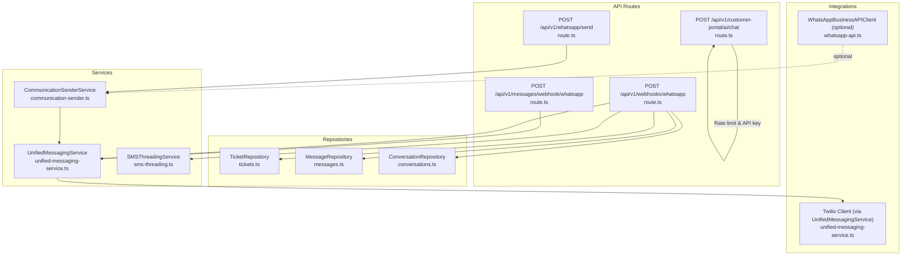
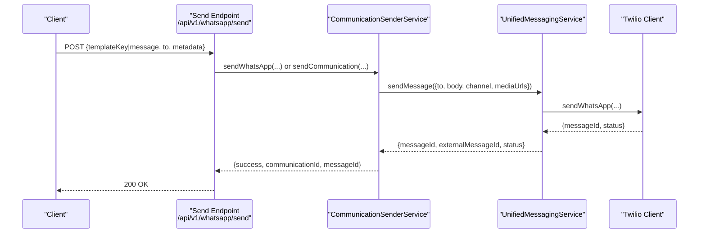
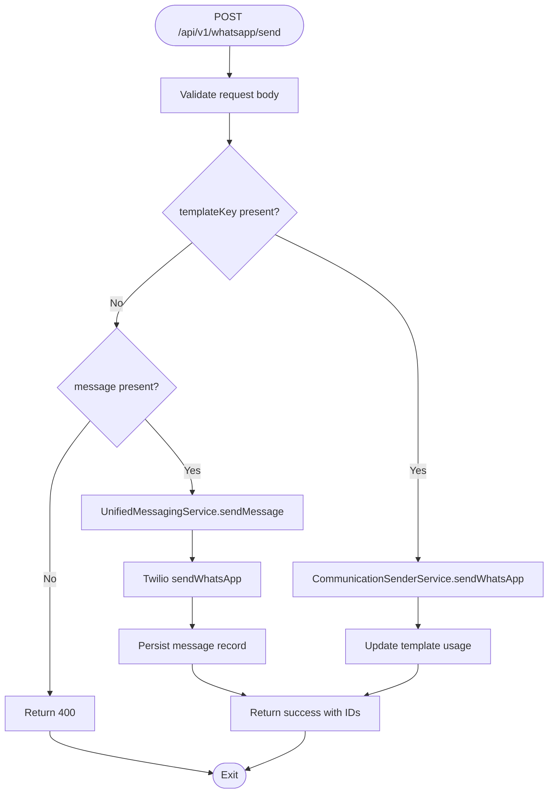
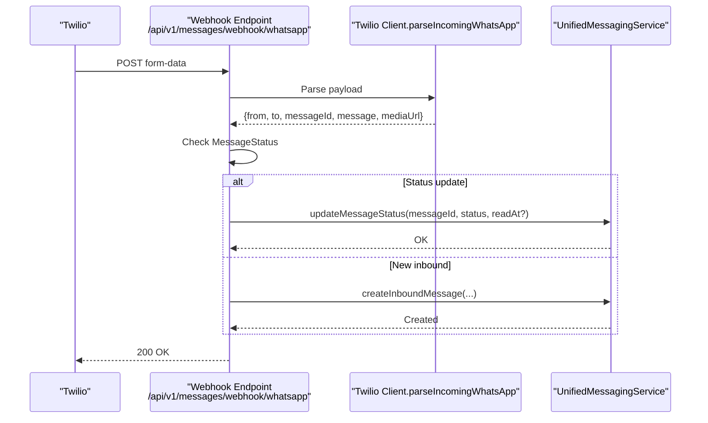
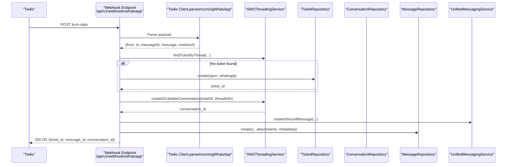
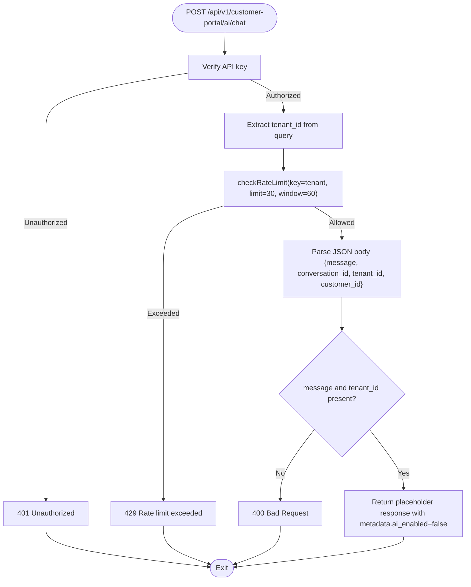
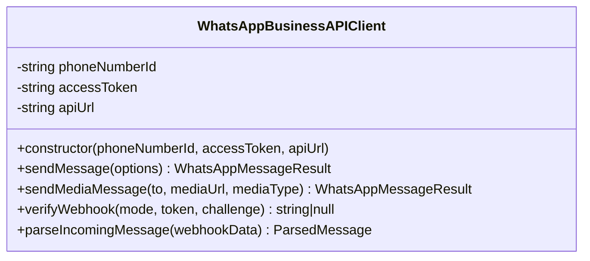
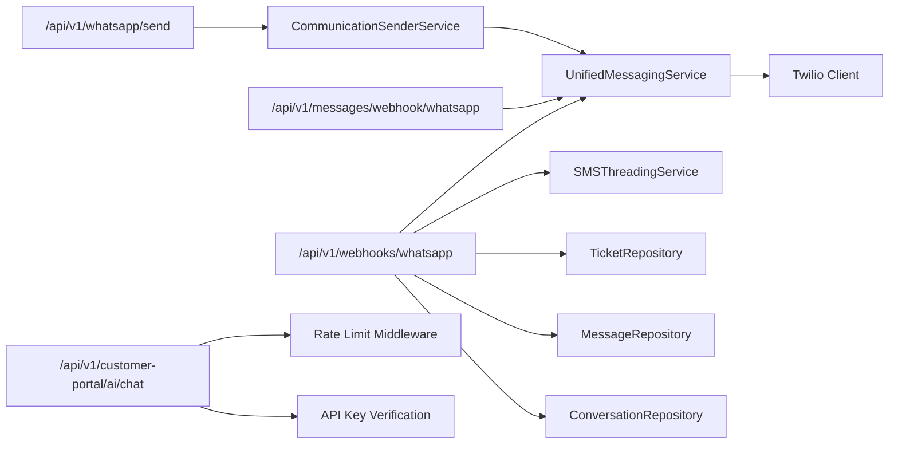

# WhatsApp Integration

<cite>
**Referenced Files in This Document**
- [route.ts](file://app/api/v1/whatsapp/send/route.ts)
- [route.ts](file://app/api/v1/messages/webhook/whatsapp/route.ts)
- [route.ts](file://app/api/v1/webhooks/whatsapp/route.ts)
- [route.ts](file://app/api/v1/customer-portal/ai/chat/route.ts)
- [whatsapp-api.ts](file://lib/integrations/whatsapp/whatsapp-api.ts)
- [communication-sender.ts](file://lib/services/communication-sender.ts)
- [unified-messaging-service.ts](file://lib/services/unified-messaging-service.ts)
- [sms-threading.ts](file://lib/services/sms-threading.ts)
- [tickets.ts](file://lib/repositories/tickets.ts)
- [messages.ts](file://lib/repositories/messages.ts)
- [conversations.ts](file://lib/repositories/conversations.ts)
- [test-whatsapp-integration.ts](file://scripts/test-whatsapp-integration.ts)
</cite>

## Table of Contents
1. [Introduction](#introduction)
2. [Project Structure](#project-structure)
3. [Core Components](#core-components)
4. [Architecture Overview](#architecture-overview)
5. [Detailed Component Analysis](#detailed-component-analysis)
6. [Dependency Analysis](#dependency-analysis)
7. [Performance Considerations](#performance-considerations)
8. [Troubleshooting Guide](#troubleshooting-guide)
9. [Conclusion](#conclusion)
10. [Appendices](#appendices)

## Introduction
This document explains the WhatsApp Business API integration in the TrueVow CS Support Service. It covers:
- Sending messages via Twilio WhatsApp Business API (text, media, and template-based)
- Receiving and processing inbound messages and delivery receipts via webhooks
- Customer portal AI chat integration and rate limiting
- Configuration for credentials, webhook endpoints, and payload processing
- Compliance, rate limiting, and best practices
- Troubleshooting and testing procedures

The integration currently uses Twilio for WhatsApp delivery and supports inbound message ingestion with ticket and conversation management. An optional Facebook Business API client is available for direct integration.

## Project Structure
The WhatsApp integration spans API routes, services, repositories, and utilities:
- API routes expose endpoints for sending messages and handling webhooks
- Services encapsulate messaging logic and template-based sending
- Repositories manage tickets, messages, and conversations
- Utilities provide Twilio integration and threading logic

**Diagram sources**
- [route.ts](file://app/api/v1/whatsapp/send/route.ts#L1-L104)
- [route.ts](file://app/api/v1/messages/webhook/whatsapp/route.ts#L1-L75)
- [route.ts](file://app/api/v1/webhooks/whatsapp/route.ts#L1-L176)
- [route.ts](file://app/api/v1/customer-portal/ai/chat/route.ts#L1-L69)
- [communication-sender.ts](file://lib/services/communication-sender.ts#L250-L372)
- [unified-messaging-service.ts](file://lib/services/unified-messaging-service.ts#L87-L199)
- [sms-threading.ts](file://lib/services/sms-threading.ts#L17-L82)
- [tickets.ts](file://lib/repositories/tickets.ts#L76-L86)
- [messages.ts](file://lib/repositories/messages.ts#L41-L51)
- [conversations.ts](file://lib/repositories/conversations.ts#L146-L163)
- [whatsapp-api.ts](file://lib/integrations/whatsapp/whatsapp-api.ts#L32-L249)

**Section sources**
- [route.ts](file://app/api/v1/whatsapp/send/route.ts#L1-L104)
- [route.ts](file://app/api/v1/messages/webhook/whatsapp/route.ts#L1-L75)
- [route.ts](file://app/api/v1/webhooks/whatsapp/route.ts#L1-L176)
- [route.ts](file://app/api/v1/customer-portal/ai/chat/route.ts#L1-L69)
- [communication-sender.ts](file://lib/services/communication-sender.ts#L250-L372)
- [unified-messaging-service.ts](file://lib/services/unified-messaging-service.ts#L87-L199)
- [sms-threading.ts](file://lib/services/sms-threading.ts#L17-L82)
- [tickets.ts](file://lib/repositories/tickets.ts#L76-L86)
- [messages.ts](file://lib/repositories/messages.ts#L41-L51)
- [conversations.ts](file://lib/repositories/conversations.ts#L146-L163)
- [whatsapp-api.ts](file://lib/integrations/whatsapp/whatsapp-api.ts#L32-L249)

## Core Components
- WhatsApp send endpoint: Validates input, supports template-based and direct message sending, and integrates with Unified Messaging Service and Communication Templates.
- Webhook handlers: Parse inbound messages and delivery receipts, update statuses, and create tickets/conversations/messages.
- Unified Messaging Service: Centralizes channel selection, sends via Twilio, tracks statuses, and manages inbound records.
- Communication Sender Service: Renders templates and sends via Twilio for WhatsApp, with validation and metadata enrichment.
- Threading and persistence: SMS-style threading logic applies to WhatsApp for ticket and conversation linking.
- Optional Facebook Business API client: Provides alternative client for direct WABA integration.

**Section sources**
- [route.ts](file://app/api/v1/whatsapp/send/route.ts#L13-L56)
- [route.ts](file://app/api/v1/messages/webhook/whatsapp/route.ts#L14-L52)
- [route.ts](file://app/api/v1/webhooks/whatsapp/route.ts#L19-L50)
- [unified-messaging-service.ts](file://lib/services/unified-messaging-service.ts#L58-L85)
- [communication-sender.ts](file://lib/services/communication-sender.ts#L250-L372)
- [sms-threading.ts](file://lib/services/sms-threading.ts#L17-L82)
- [whatsapp-api.ts](file://lib/integrations/whatsapp/whatsapp-api.ts#L32-L249)

## Architecture Overview
The system routes outbound WhatsApp messages through a unified service that selects channels and sends via Twilio. Inbound messages are parsed by webhook handlers, linked to tickets/conversations, and persisted. Customer portal AI chat is protected by API key and rate limiting.

**Diagram sources**
- [route.ts](file://app/api/v1/whatsapp/send/route.ts#L23-L86)
- [communication-sender.ts](file://lib/services/communication-sender.ts#L250-L372)
- [unified-messaging-service.ts](file://lib/services/unified-messaging-service.ts#L90-L199)

## Detailed Component Analysis

### Outbound Message Sending
- Endpoint: POST /api/v1/whatsapp/send
- Supports:
  - Template-based sending via CommunicationSenderService
  - Direct message sending via UnifiedMessagingService
- Validation: Zod schema enforces required fields and types
- Channel selection: UnifiedMessagingService chooses channel based on preferences, media, and length
- Delivery: Twilio WhatsApp Business API used for sending

**Diagram sources**
- [route.ts](file://app/api/v1/whatsapp/send/route.ts#L23-L86)
- [communication-sender.ts](file://lib/services/communication-sender.ts#L250-L372)
- [unified-messaging-service.ts](file://lib/services/unified-messaging-service.ts#L90-L199)

**Section sources**
- [route.ts](file://app/api/v1/whatsapp/send/route.ts#L13-L103)
- [communication-sender.ts](file://lib/services/communication-sender.ts#L250-L372)
- [unified-messaging-service.ts](file://lib/services/unified-messaging-service.ts#L58-L85)

### Webhook Handling (Inbound Messages and Delivery Receipts)
- Endpoint: POST /api/v1/messages/webhook/whatsapp
- Parses Twilio webhook payload
- Distinguishes delivery receipts vs inbound messages
- Updates message status for outbound messages
- Creates inbound message records for incoming messages

**Diagram sources**
- [route.ts](file://app/api/v1/messages/webhook/whatsapp/route.ts#L14-L66)
- [unified-messaging-service.ts](file://lib/services/unified-messaging-service.ts#L251-L274)

**Section sources**
- [route.ts](file://app/api/v1/messages/webhook/whatsapp/route.ts#L14-L74)
- [unified-messaging-service.ts](file://lib/services/unified-messaging-service.ts#L251-L319)

### Shared Webhook Handler (Creates Tickets and Conversations)
- Endpoint: POST /api/v1/webhooks/whatsapp
- Applies SMS threading logic to WhatsApp messages
- Creates or links tickets and conversations
- Persists messages with attachments and metadata
- Links cross-channel conversations

**Diagram sources**
- [route.ts](file://app/api/v1/webhooks/whatsapp/route.ts#L19-L164)
- [sms-threading.ts](file://lib/services/sms-threading.ts#L22-L81)
- [tickets.ts](file://lib/repositories/tickets.ts#L76-L86)
- [conversations.ts](file://lib/repositories/conversations.ts#L146-L163)
- [messages.ts](file://lib/repositories/messages.ts#L41-L51)
- [unified-messaging-service.ts](file://lib/services/unified-messaging-service.ts#L279-L319)

**Section sources**
- [route.ts](file://app/api/v1/webhooks/whatsapp/route.ts#L19-L175)
- [sms-threading.ts](file://lib/services/sms-threading.ts#L17-L82)
- [tickets.ts](file://lib/repositories/tickets.ts#L76-L86)
- [conversations.ts](file://lib/repositories/conversations.ts#L146-L163)
- [messages.ts](file://lib/repositories/messages.ts#L41-L51)
- [unified-messaging-service.ts](file://lib/services/unified-messaging-service.ts#L279-L319)

### Customer Portal AI Chat Integration
- Endpoint: POST /api/v1/customer-portal/ai/chat
- Protected by API key verification
- Enforces rate limit: 30 requests per minute per tenant
- Returns placeholder response with metadata indicating fallback mode

**Diagram sources**
- [route.ts](file://app/api/v1/customer-portal/ai/chat/route.ts#L10-L68)

**Section sources**
- [route.ts](file://app/api/v1/customer-portal/ai/chat/route.ts#L10-L68)

### Optional Facebook Business API Client
- Provides methods to send text/template/media messages via Graph API
- Includes webhook verification and parsing helpers
- Useful as an alternative to Twilio for WABA integration

**Diagram sources**
- [whatsapp-api.ts](file://lib/integrations/whatsapp/whatsapp-api.ts#L32-L249)

**Section sources**
- [whatsapp-api.ts](file://lib/integrations/whatsapp/whatsapp-api.ts#L11-L249)

## Dependency Analysis
- API routes depend on middleware for authentication/API key checks and on services for business logic
- CommunicationSenderService depends on template rendering and UnifiedMessagingService for delivery
- UnifiedMessagingService depends on Twilio client and database repositories for persistence
- Webhook handlers depend on Twilio client parsing, threading, and repositories for persistence

**Diagram sources**
- [route.ts](file://app/api/v1/whatsapp/send/route.ts#L7-L11)
- [communication-sender.ts](file://lib/services/communication-sender.ts#L10-L16)
- [unified-messaging-service.ts](file://lib/services/unified-messaging-service.ts#L14-L15)
- [route.ts](file://app/api/v1/messages/webhook/whatsapp/route.ts#L9-L12)
- [route.ts](file://app/api/v1/webhooks/whatsapp/route.ts#L8-L17)
- [sms-threading.ts](file://lib/services/sms-threading.ts#L6-L8)
- [tickets.ts](file://lib/repositories/tickets.ts#L1-L2)
- [messages.ts](file://lib/repositories/messages.ts#L1-L2)
- [conversations.ts](file://lib/repositories/conversations.ts#L1-L1)
- [route.ts](file://app/api/v1/customer-portal/ai/chat/route.ts#L2-L3)

**Section sources**
- [route.ts](file://app/api/v1/whatsapp/send/route.ts#L7-L11)
- [communication-sender.ts](file://lib/services/communication-sender.ts#L10-L16)
- [unified-messaging-service.ts](file://lib/services/unified-messaging-service.ts#L14-L15)
- [route.ts](file://app/api/v1/messages/webhook/whatsapp/route.ts#L9-L12)
- [route.ts](file://app/api/v1/webhooks/whatsapp/route.ts#L8-L17)
- [sms-threading.ts](file://lib/services/sms-threading.ts#L6-L8)
- [tickets.ts](file://lib/repositories/tickets.ts#L1-L2)
- [messages.ts](file://lib/repositories/messages.ts#L1-L2)
- [conversations.ts](file://lib/repositories/conversations.ts#L1-L1)
- [route.ts](file://app/api/v1/customer-portal/ai/chat/route.ts#L2-L3)

## Performance Considerations
- Channel selection favors WhatsApp for long messages (>1600 chars) and media-rich content
- Webhook handlers batch persistence operations and continue even if cross-channel linking fails
- Rate limiting for customer portal AI chat prevents abuse while allowing bursts within limits
- Template-based sending reduces payload sizes and ensures compliance with WhatsApp policies

[No sources needed since this section provides general guidance]

## Troubleshooting Guide
Common issues and resolutions:
- Missing credentials or invalid environment variables for Twilio
  - Ensure required variables are set and phone numbers are in E.164 format
- Template-based messages failing
  - Verify template exists, is approved, and matches WhatsApp policy
- Inbound messages not creating tickets/conversations
  - Confirm webhook endpoint is registered and reachable
  - Check threading logic and repository access
- Delivery receipts not updating status
  - Validate MessageStatus field and Twilio signature verification
- Customer portal AI chat rate limit exceeded
  - Reduce request frequency or increase tenant-specific limits

**Section sources**
- [test-whatsapp-integration.ts](file://scripts/test-whatsapp-integration.ts#L19-L109)
- [route.ts](file://app/api/v1/webhooks/whatsapp/route.ts#L165-L174)
- [route.ts](file://app/api/v1/customer-portal/ai/chat/route.ts#L18-L35)

## Conclusion
The integration provides a robust, extensible foundation for WhatsApp messaging using Twilio. It supports template-based and direct sending, inbound message ingestion with ticketing and threading, and customer portal AI chat with rate limiting. Optional Facebook Business API client enables alternative providers. Adhering to validation, compliance, and rate limiting ensures reliable operations.

[No sources needed since this section summarizes without analyzing specific files]

## Appendices

### Configuration Examples
- Twilio credentials and numbers:
  - TWILIO_ACCOUNT_SID
  - TWILIO_AUTH_TOKEN
  - TWILIO_WHATSAPP_NUMBER (or TWILIO_PHONE_NUMBER as fallback)
- Optional Facebook Business API:
  - WHATSAPP_BUSINESS_API_URL
  - WHATSAPP_BUSINESS_PHONE_NUMBER_ID
  - WHATSAPP_BUSINESS_ACCESS_TOKEN
  - WHATSAPP_BUSINESS_APP_ID
  - WHATSAPP_BUSINESS_APP_SECRET
  - WHATSAPP_WEBHOOK_VERIFY_TOKEN
- Customer portal AI:
  - API key verification enforced at endpoint
  - Rate limit: 30 requests per minute per tenant_id

**Section sources**
- [test-whatsapp-integration.ts](file://scripts/test-whatsapp-integration.ts#L15-L45)
- [whatsapp-api.ts](file://lib/integrations/whatsapp/whatsapp-api.ts#L11-L17)
- [route.ts](file://app/api/v1/customer-portal/ai/chat/route.ts#L18-L35)

### Payload Processing Notes
- Inbound webhook payload is parsed into:
  - from, to, messageId, message, mediaUrl, timestamp
- Delivery receipt updates:
  - Maps MessageStatus to internal status (sent, delivered, read, failed)
- Template-based sending:
  - Validates message length limits and enriches metadata

**Section sources**
- [whatsapp-api.ts](file://lib/integrations/whatsapp/whatsapp-api.ts#L209-L244)
- [unified-messaging-service.ts](file://lib/services/unified-messaging-service.ts#L251-L274)
- [communication-sender.ts](file://lib/services/communication-sender.ts#L272-L275)

### Best Practices
- Prefer template-based messages for scalability and compliance
- Use media URLs for rich content; ensure URLs are publicly accessible
- Implement webhook endpoint validation and signature verification
- Monitor rate limits and apply backoff strategies
- Keep phone numbers in E.164 format and maintain opt-in consent

[No sources needed since this section provides general guidance]