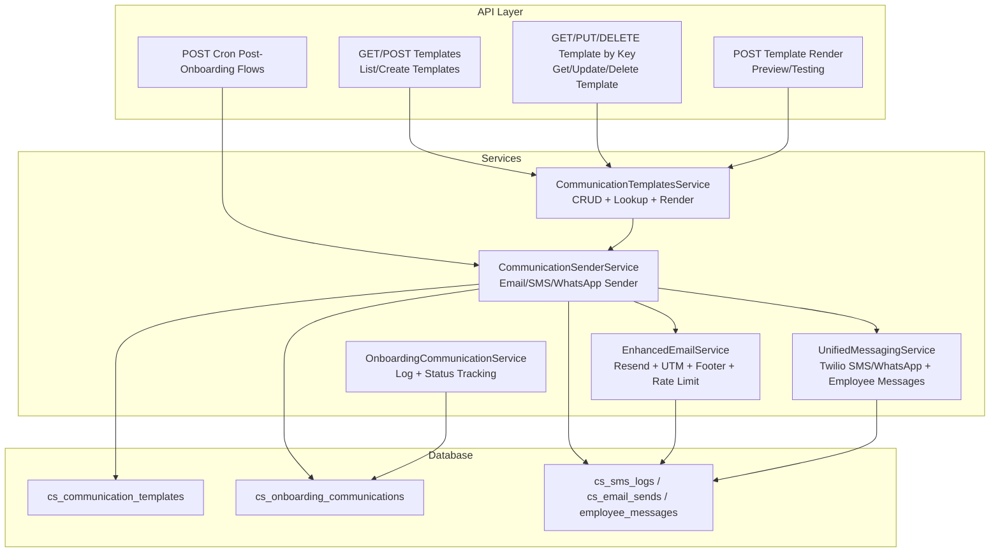
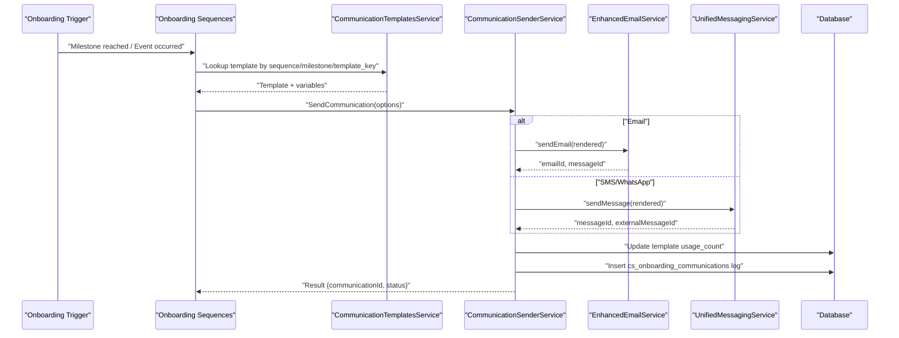
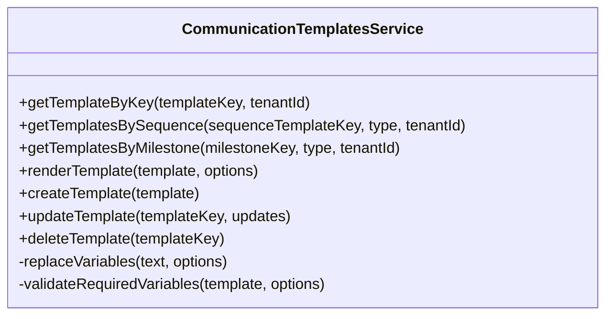
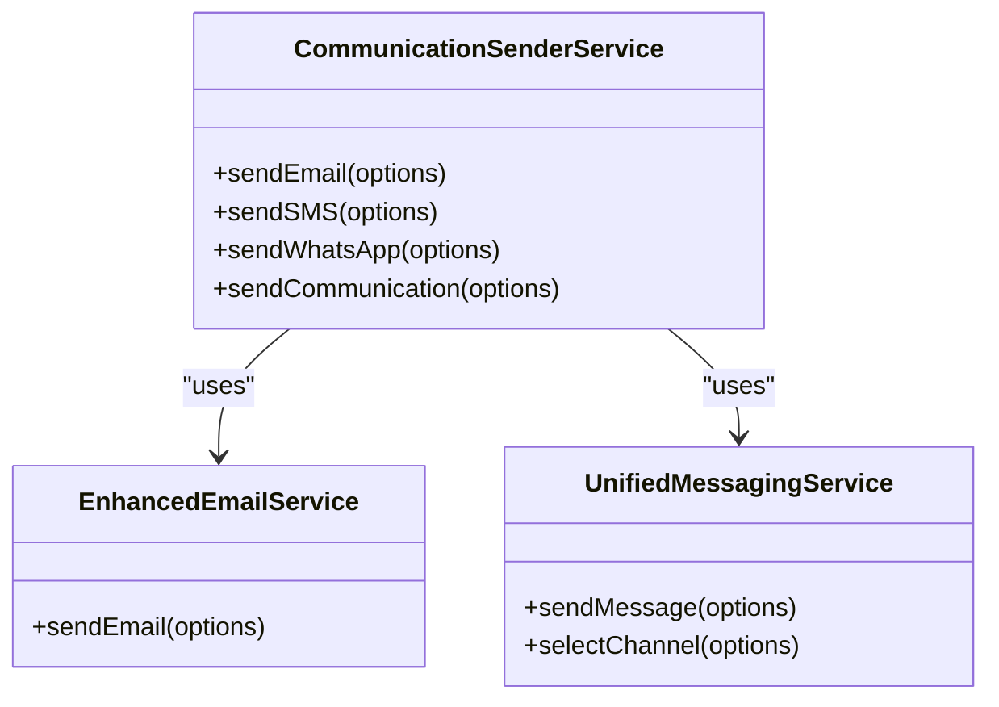
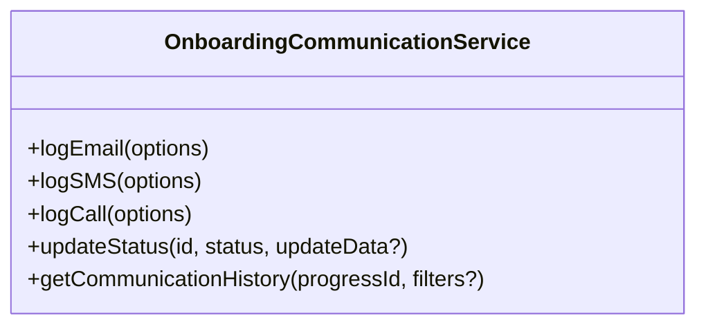
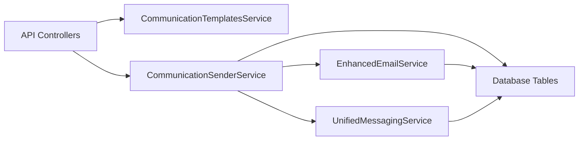

# Communication Automation

<cite>
**Referenced Files in This Document**
- [ONBOARDING_COMMUNICATION_TEMPLATES.md](file://docs/setup/ONBOARDING_COMMUNICATION_TEMPLATES.md)
- [COMMUNICATION_TEMPLATES_IMPLEMENTATION_COMPLETE.md](file://docs/COMMUNICATION_TEMPLATES_IMPLEMENTATION_COMPLETE.md)
- [communication-templates.ts](file://lib/services/communication-templates.ts)
- [communication-sender.ts](file://lib/services/communication-sender.ts)
- [onboarding-communication.ts](file://docs/01-main/SAAS_ADMIN_IMPLEMENTATION/services/onboarding-communication.ts)
- [route.ts](file://app/api/v1/communication-templates/route.ts)
- [route.ts](file://app/api/v1/communication-templates/[templateKey]/route.ts)
- [route.ts](file://app/api/v1/communication-templates/[templateKey]/render/route.ts)
- [021_communication_templates.sql](file://database/migrations/021_communication_templates.sql)
- [enhanced-email-service.ts](file://lib/services/enhanced-email-service.ts)
- [unified-messaging-service.ts](file://lib/services/unified-messaging-service.ts)
- [route.ts](file://app/api/v1/cron/post-onboarding-flows/route.ts)
</cite>

## Table of Contents
1. [Introduction](#introduction)
2. [Project Structure](#project-structure)
3. [Core Components](#core-components)
4. [Architecture Overview](#architecture-overview)
5. [Detailed Component Analysis](#detailed-component-analysis)
6. [Dependency Analysis](#dependency-analysis)
7. [Performance Considerations](#performance-considerations)
8. [Troubleshooting Guide](#troubleshooting-guide)
9. [Conclusion](#conclusion)
10. [Appendices](#appendices)

## Introduction
This document describes the onboarding communication automation system that powers template-based, multi-channel messaging for customer success onboarding. It covers automated workflows, scheduling, trigger-based sending, and personalized flows across email, SMS, WhatsApp, and in-app channels. It also documents the communication template system, dynamic content insertion, recipient targeting, integration with email/SMS providers, message queuing, delivery confirmation tracking, performance optimization, retry mechanisms, and troubleshooting.

## Project Structure
The system is composed of:
- Template definition and management APIs
- Template rendering and variable substitution
- Multi-channel sender service (email, SMS, WhatsApp)
- Onboarding communication logging and status tracking
- Database schema for templates and onboarding communications
- Cron-driven post-onboarding automation

**Diagram sources**
- [route.ts](file://app/api/v1/communication-templates/route.ts#L1-L155)
- [route.ts](file://app/api/v1/communication-templates/[templateKey]/route.ts#L1-L134)
- [route.ts](file://app/api/v1/communication-templates/[templateKey]/render/route.ts#L1-L59)
- [route.ts](file://app/api/v1/cron/post-onboarding-flows/route.ts#L1-L39)
- [communication-templates.ts](file://lib/services/communication-templates.ts#L74-L389)
- [communication-sender.ts](file://lib/services/communication-sender.ts#L35-L414)
- [onboarding-communication.ts](file://docs/01-main/SAAS_ADMIN_IMPLEMENTATION/services/onboarding-communication.ts#L92-L292)
- [enhanced-email-service.ts](file://lib/services/enhanced-email-service.ts#L58-L182)
- [unified-messaging-service.ts](file://lib/services/unified-messaging-service.ts#L58-L329)
- [021_communication_templates.sql](file://database/migrations/021_communication_templates.sql#L6-L120)

**Section sources**
- [route.ts](file://app/api/v1/communication-templates/route.ts#L1-L155)
- [route.ts](file://app/api/v1/communication-templates/[templateKey]/route.ts#L1-L134)
- [route.ts](file://app/api/v1/communication-templates/[templateKey]/render/route.ts#L1-L59)
- [communication-templates.ts](file://lib/services/communication-templates.ts#L74-L389)
- [communication-sender.ts](file://lib/services/communication-sender.ts#L35-L414)
- [onboarding-communication.ts](file://docs/01-main/SAAS_ADMIN_IMPLEMENTATION/services/onboarding-communication.ts#L92-L292)
- [enhanced-email-service.ts](file://lib/services/enhanced-email-service.ts#L58-L182)
- [unified-messaging-service.ts](file://lib/services/unified-messaging-service.ts#L58-L329)
- [021_communication_templates.sql](file://database/migrations/021_communication_templates.sql#L6-L120)

## Core Components
- CommunicationTemplatesService: Manages template CRUD, lookup by sequence/milestone, variable substitution, and rendering.
- CommunicationSenderService: Renders templates and sends via email (Resend), SMS (Twilio via Unified Messaging), and WhatsApp (Twilio via Unified Messaging).
- OnboardingCommunicationService: Logs outbound communications and tracks statuses for onboarding-related messages.
- EnhancedEmailService: Adds UTM tracking, compliance footer, unsubscribe tokens, and rate limiting for email delivery.
- UnifiedMessagingService: Centralizes SMS/WhatsApp sending, channel selection, and employee message tracking.
- Database schema: cs_communication_templates stores templates and triggers; cs_onboarding_communications logs onboarding messages; provider logs are stored in cs_email_sends, cs_sms_logs, and employee_messages.

**Section sources**
- [communication-templates.ts](file://lib/services/communication-templates.ts#L74-L389)
- [communication-sender.ts](file://lib/services/communication-sender.ts#L35-L414)
- [onboarding-communication.ts](file://docs/01-main/SAAS_ADMIN_IMPLEMENTATION/services/onboarding-communication.ts#L92-L292)
- [enhanced-email-service.ts](file://lib/services/enhanced-email-service.ts#L58-L182)
- [unified-messaging-service.ts](file://lib/services/unified-messaging-service.ts#L58-L329)
- [021_communication_templates.sql](file://database/migrations/021_communication_templates.sql#L6-L120)

## Architecture Overview
The system orchestrates automated, personalized onboarding communications across channels:
- Triggers: Milestones, date offsets, manual actions, and events define when to send.
- Templates: Define content, variables, and send conditions.
- Rendering: Variables are substituted into subject/body (and HTML).
- Delivery: Email via Resend, SMS/WhatsApp via Twilio through Unified Messaging.
- Logging: All sends are logged with status timestamps and metadata.
- Scheduling: Cron jobs process post-onboarding flows.

**Diagram sources**
- [communication-templates.ts](file://lib/services/communication-templates.ts#L74-L389)
- [communication-sender.ts](file://lib/services/communication-sender.ts#L35-L414)
- [enhanced-email-service.ts](file://lib/services/enhanced-email-service.ts#L58-L182)
- [unified-messaging-service.ts](file://lib/services/unified-messaging-service.ts#L58-L329)
- [021_communication_templates.sql](file://database/migrations/021_communication_templates.sql#L6-L120)

## Detailed Component Analysis

### Communication Templates Service
Responsibilities:
- Retrieve templates by key, sequence, or milestone with tenant-aware precedence.
- Render templates with variable substitution and validate required variables.
- Create/update/delete templates with proper validation and metadata.

Key behaviors:
- Tenant isolation: prefers tenant-specific templates over defaults.
- Variable substitution: replaces placeholders derived from snake_case keys to Title Case.
- Validation: ensures required variables are present before rendering.

**Diagram sources**
- [communication-templates.ts](file://lib/services/communication-templates.ts#L74-L389)

**Section sources**
- [communication-templates.ts](file://lib/services/communication-templates.ts#L74-L389)

### Communication Sender Service
Responsibilities:
- Send email via EnhancedEmailService with UTM, compliance footer, and rate limiting.
- Send SMS/WhatsApp via UnifiedMessagingService with channel selection and length validation.
- Track template usage and persist metadata in provider-specific logs and cs_onboarding_communications.

Key behaviors:
- Auto-detects channel from template type.
- Validates message length per channel limits.
- Updates template usage counters and logs outcomes.

**Diagram sources**
- [communication-sender.ts](file://lib/services/communication-sender.ts#L35-L414)
- [enhanced-email-service.ts](file://lib/services/enhanced-email-service.ts#L58-L182)
- [unified-messaging-service.ts](file://lib/services/unified-messaging-service.ts#L58-L329)

**Section sources**
- [communication-sender.ts](file://lib/services/communication-sender.ts#L35-L414)

### Onboarding Communication Logging
Responsibilities:
- Log outbound emails, SMS, and calls with rich metadata.
- Update statuses with timestamps for sent, delivered, opened, clicked, replied, completed.
- Query communication history filtered by type, direction, and status.

Key behaviors:
- Timestamps are set upon status transitions.
- Supports linking to templates and milestones.

**Diagram sources**
- [onboarding-communication.ts](file://docs/01-main/SAAS_ADMIN_IMPLEMENTATION/services/onboarding-communication.ts#L92-L292)

**Section sources**
- [onboarding-communication.ts](file://docs/01-main/SAAS_ADMIN_IMPLEMENTATION/services/onboarding-communication.ts#L92-L292)

### API Endpoints for Templates
Endpoints:
- GET /api/v1/communication-templates: List templates with filters (sequence, type, category, active).
- POST /api/v1/communication-templates: Create template with validation.
- GET /api/v1/communication-templates/[templateKey]: Get template by key.
- PUT /api/v1/communication-templates/[templateKey]: Update template.
- DELETE /api/v1/communication-templates/[templateKey]: Soft delete template.
- POST /api/v1/communication-templates/[templateKey]/render: Render template with variables.

Security and rate limiting:
- Authenticated via team member middleware.
- Rate limits applied per endpoint.

**Section sources**
- [route.ts](file://app/api/v1/communication-templates/route.ts#L1-L155)
- [route.ts](file://app/api/v1/communication-templates/[templateKey]/route.ts#L1-L134)
- [route.ts](file://app/api/v1/communication-templates/[templateKey]/render/route.ts#L1-L59)

### Database Schema
Tables and indexes:
- cs_communication_templates: Stores templates, triggers, variables, and usage tracking.
- cs_onboarding_communications: Logs onboarding-related communications with statuses and timestamps.
- Provider logs: cs_email_sends, cs_sms_logs, employee_messages for provider-specific tracking.

Constraints and policies:
- Row-level security policies for team member access.
- Indexes on template_key, type, category, sequence, milestone, tenant, and active flag.

**Section sources**
- [021_communication_templates.sql](file://database/migrations/021_communication_templates.sql#L6-L120)

### Post-Onboarding Automation
Cron endpoint:
- POST /api/v1/cron/post-onboarding-flows: Runs scheduled flows (check-ins, health alerts, usage alerts, renewal reminders) protected by API key.

**Section sources**
- [route.ts](file://app/api/v1/cron/post-onboarding-flows/route.ts#L1-L39)

## Dependency Analysis
High-level dependencies:
- API layer depends on CommunicationTemplatesService for template operations.
- CommunicationSenderService depends on CommunicationTemplatesService and provider services.
- EnhancedEmailService and UnifiedMessagingService depend on external providers (Resend/Twilio).
- Logging and tracking depend on database tables and provider-specific logs.

**Diagram sources**
- [communication-templates.ts](file://lib/services/communication-templates.ts#L74-L389)
- [communication-sender.ts](file://lib/services/communication-sender.ts#L35-L414)
- [enhanced-email-service.ts](file://lib/services/enhanced-email-service.ts#L58-L182)
- [unified-messaging-service.ts](file://lib/services/unified-messaging-service.ts#L58-L329)
- [021_communication_templates.sql](file://database/migrations/021_communication_templates.sql#L6-L120)

**Section sources**
- [communication-templates.ts](file://lib/services/communication-templates.ts#L74-L389)
- [communication-sender.ts](file://lib/services/communication-sender.ts#L35-L414)
- [enhanced-email-service.ts](file://lib/services/enhanced-email-service.ts#L58-L182)
- [unified-messaging-service.ts](file://lib/services/unified-messaging-service.ts#L58-L329)
- [021_communication_templates.sql](file://database/migrations/021_communication_templates.sql#L6-L120)

## Performance Considerations
- Template rendering: Efficient variable replacement and minimal regex usage; validate required variables early to fail fast.
- Email delivery: Rate limiting per domain, UTM tracking, and compliance footer are applied before sending to minimize retries.
- SMS/WhatsApp: Channel selection logic avoids oversized messages; channel-specific length limits enforced.
- Database: Indexes on template_key, type, category, sequence, milestone, tenant, and active flag improve query performance.
- Usage tracking: Application-level increments of usage_count prevent trigger conflicts and reduce DB overhead.

[No sources needed since this section provides general guidance]

## Troubleshooting Guide
Common issues and resolutions:
- Template not found: Verify template_key and tenant_id; tenant-specific templates override defaults.
- Missing required variables: Ensure all required variables are supplied in render options.
- Email send failures: Check Resend API key and rate limit; confirm unsubscribe token generation and compliance footer insertion.
- SMS/WhatsApp failures: Confirm Twilio credentials and phone number availability; verify message length limits.
- Status tracking: Use OnboardingCommunicationService to update and query statuses; ensure provider webhooks update cs_sms_logs/cs_email_sends accordingly.

**Section sources**
- [communication-templates.ts](file://lib/services/communication-templates.ts#L74-L389)
- [communication-sender.ts](file://lib/services/communication-sender.ts#L35-L414)
- [onboarding-communication.ts](file://docs/01-main/SAAS_ADMIN_IMPLEMENTATION/services/onboarding-communication.ts#L92-L292)
- [enhanced-email-service.ts](file://lib/services/enhanced-email-service.ts#L58-L182)
- [unified-messaging-service.ts](file://lib/services/unified-messaging-service.ts#L58-L329)

## Conclusion
The onboarding communication automation system provides a robust, extensible framework for delivering personalized, multi-channel messages aligned with onboarding milestones and schedules. It integrates seamlessly with email and SMS/WhatsApp providers, maintains comprehensive logging and status tracking, and supports tenant isolation and dynamic content personalization.

[No sources needed since this section summarizes without analyzing specific files]

## Appendices

### A. Automated Messaging Workflows and Triggers
- Milestone-triggered: Templates linked to specific milestones in onboarding sequences.
- Date offset-triggered: Sends occur N days after a milestone or sequence start.
- Manual-triggered: Initiated by CSM actions (e.g., marking a call complete).
- Event-triggered: Driven by system events (e.g., critical support ticket creation).

**Section sources**
- [ONBOARDING_COMMUNICATION_TEMPLATES.md](file://docs/setup/ONBOARDING_COMMUNICATION_TEMPLATES.md#L1-L753)
- [021_communication_templates.sql](file://database/migrations/021_communication_templates.sql#L32-L36)

### B. Template-Based Communication Scheduling
- Templates define trigger_type, trigger_milestone_key, trigger_days_offset, and trigger_event.
- API endpoints support listing and filtering templates by sequence and category.
- Post-onboarding flows are executed via a cron endpoint.

**Section sources**
- [route.ts](file://app/api/v1/communication-templates/route.ts#L1-L155)
- [route.ts](file://app/api/v1/cron/post-onboarding-flows/route.ts#L1-L39)
- [021_communication_templates.sql](file://database/migrations/021_communication_templates.sql#L32-L36)

### C. Multi-Channel Message Delivery
- Email: EnhancedEmailService with UTM, compliance footer, unsubscribe token, and rate limiting.
- SMS/WhatsApp: UnifiedMessagingService with channel selection, length validation, and employee message tracking.

**Section sources**
- [enhanced-email-service.ts](file://lib/services/enhanced-email-service.ts#L58-L182)
- [unified-messaging-service.ts](file://lib/services/unified-messaging-service.ts#L58-L329)

### D. Communication Template System and Dynamic Content
- Template variables are defined in JSON and validated during rendering.
- Variable substitution converts snake_case keys to Title Case placeholders.
- Required variables must be present; otherwise rendering fails with a clear error.

**Section sources**
- [communication-templates.ts](file://lib/services/communication-templates.ts#L44-L72)
- [communication-templates.ts](file://lib/services/communication-templates.ts#L183-L216)

### E. Recipient Targeting Logic
- Tenant-aware template resolution: tenant-specific overrides default templates.
- API endpoints accept tenant_id for explicit targeting.
- Onboarding logs capture customer_email and template_key for traceability.

**Section sources**
- [communication-templates.ts](file://lib/services/communication-templates.ts#L78-L104)
- [route.ts](file://app/api/v1/communication-templates/[templateKey]/route.ts#L52-L59)
- [onboarding-communication.ts](file://docs/01-main/SAAS_ADMIN_IMPLEMENTATION/services/onboarding-communication.ts#L101-L128)

### F. Examples and How-To
- Configure automated message sequences: Assign templates to milestones and categories; define trigger_types and offsets.
- Set up conditional communications: Use send_conditions in templates to gate sending based on criteria.
- Manage delivery status: Use OnboardingCommunicationService.updateStatus to move statuses and timestamps; rely on provider webhooks for final states.

**Section sources**
- [COMMUNICATION_TEMPLATES_IMPLEMENTATION_COMPLETE.md](file://docs/COMMUNICATION_TEMPLATES_IMPLEMENTATION_COMPLETE.md#L14-L120)
- [onboarding-communication.ts](file://docs/01-main/SAAS_ADMIN_IMPLEMENTATION/services/onboarding-communication.ts#L207-L248)

### G. Integration Notes
- Email: Integrated with EnhancedEmailService (Resend); includes UTM tracking and compliance footer.
- SMS/WhatsApp: Integrated with UnifiedMessagingService (Twilio); supports media for WhatsApp.
- In-App: AI agent welcome and tips are handled by the frontend/AI agent service.

**Section sources**
- [communication-sender.ts](file://lib/services/communication-sender.ts#L39-L414)
- [enhanced-email-service.ts](file://lib/services/enhanced-email-service.ts#L58-L182)
- [unified-messaging-service.ts](file://lib/services/unified-messaging-service.ts#L58-L329)