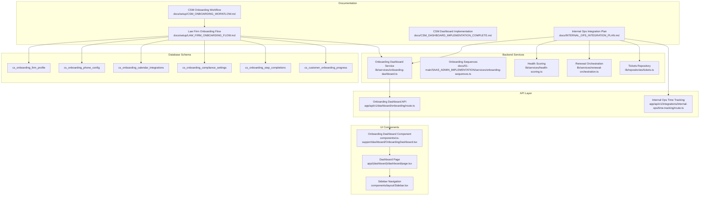
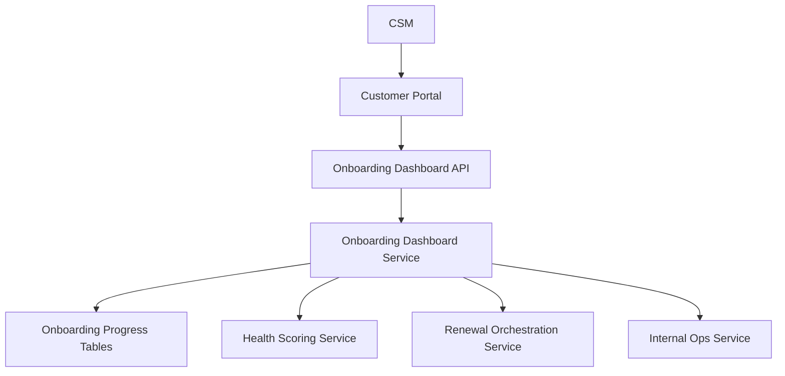
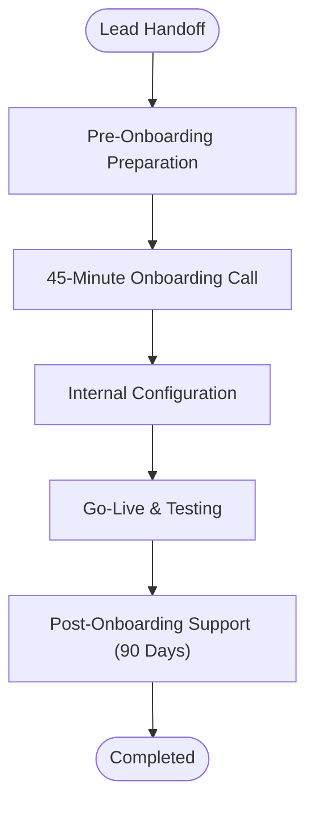
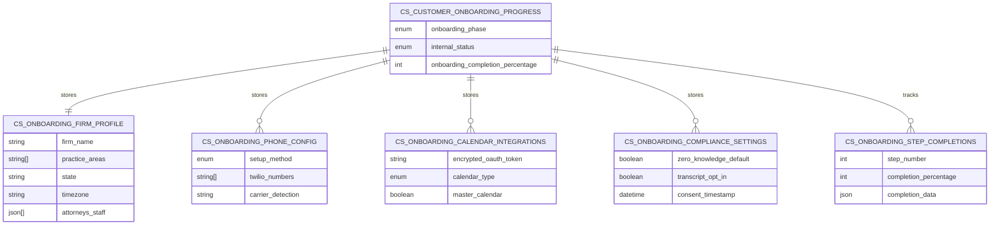
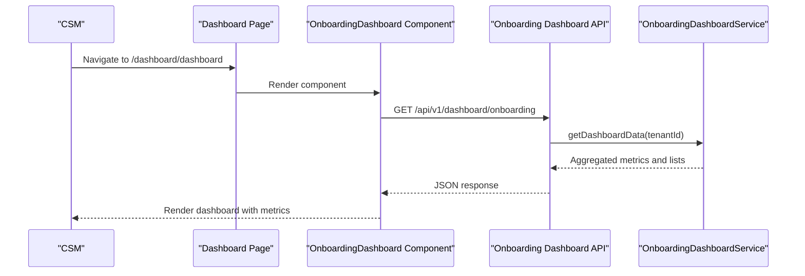
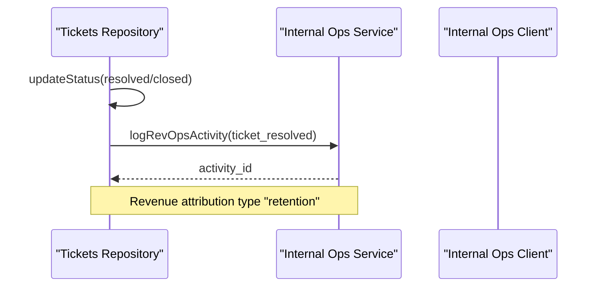
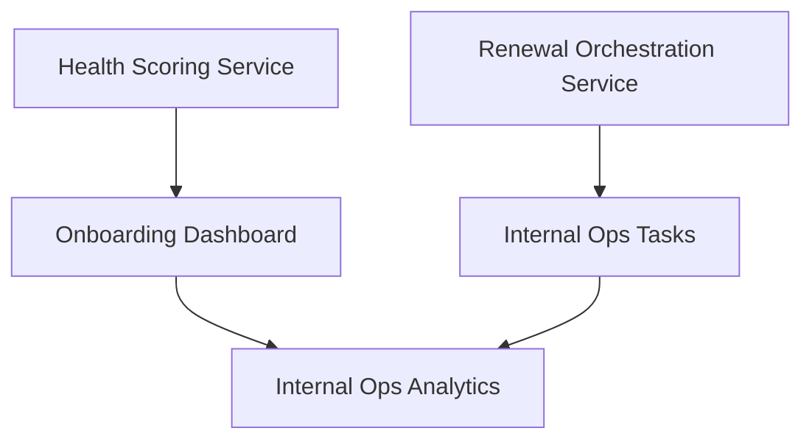
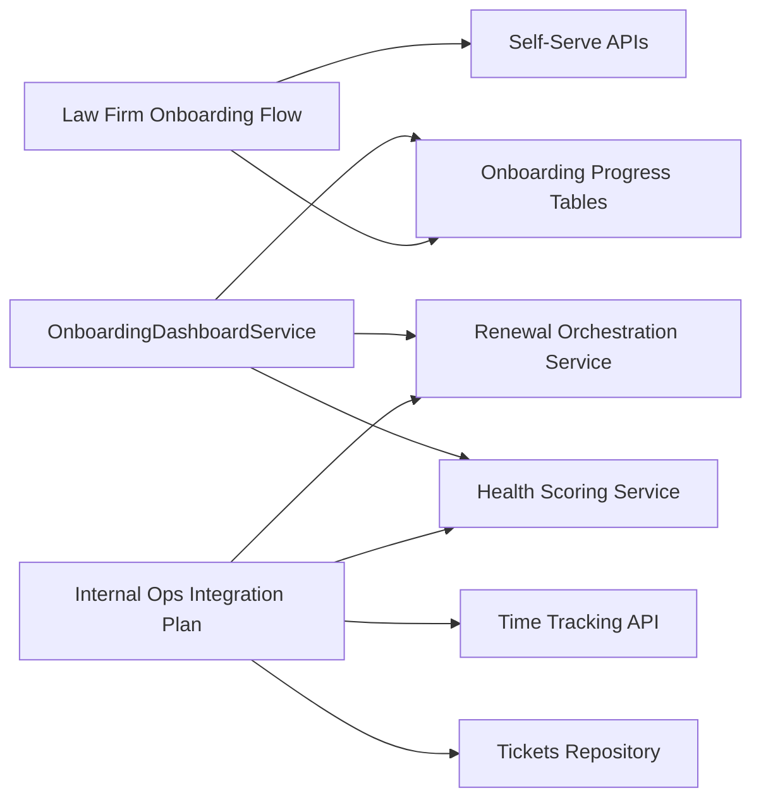

# Customer Success Integration

<cite>
**Referenced Files in This Document**
- [CSM_ONBOARDING_WORKFLOW.md](file://docs/setup/CSM_ONBOARDING_WORKFLOW.md)
- [LAW_FIRM_ONBOARDING_FLOW.md](file://docs/setup/LAW_FIRM_ONBOARDING_FLOW.md)
- [CSM_DASHBOARD_IMPLEMENTATION_COMPLETE.md](file://docs/CSM_DASHBOARD_IMPLEMENTATION_COMPLETE.md)
- [INTERNAL_OPS_INTEGRATION_PLAN.md](file://docs/INTERNAL_OPS_INTEGRATION_PLAN.md)
- [onboarding-dashboard.ts](file://lib/services/onboarding-dashboard.ts)
- [route.ts](file://app/api/v1/dashboard/onboarding/route.ts)
- [OnboardingDashboard.tsx](file://components/cs-support/dashboard/OnboardingDashboard.tsx)
- [page.tsx](file://app/(dashboard)/dashboard/page.tsx)
- [Sidebar.tsx](file://components/layout/Sidebar.tsx)
- [time-tracking/route.ts](file://app/api/v1/integrations/internal-ops/time-tracking/route.ts)
- [onboarding-sequences.ts](file://docs/01-main/SAAS_ADMIN_IMPLEMENTATION/services/onboarding-sequences.ts)
- [tickets.ts](file://lib/repositories/tickets.ts)
- [renewal-orchestration.ts](file://lib/services/renewal-orchestration.ts)
- [health-scoring.ts](file://lib/services/health-scoring.ts)
- [internal-ops-client.ts](file://lib/integrations/internal-ops-client.ts)
- [cs_onboarding_firm_profile](file://database/migrations/011_law_firm_onboarding_flow.sql)
- [cs_onboarding_phone_config](file://database/migrations/011_law_firm_onboarding_flow.sql)
- [cs_onboarding_calendar_integrations](file://database/migrations/011_law_firm_onboarding_flow.sql)
- [cs_onboarding_compliance_settings](file://database/migrations/011_law_firm_onboarding_flow.sql)
- [cs_onboarding_step_completions](file://database/migrations/011_law_firm_onboarding_flow.sql)
- [cs_customer_onboarding_progress](file://database/migrations/011_law_firm_onboarding_flow.sql)
- [post-onboarding-flows.ts](file://scripts/scheduled-jobs/post-onboarding-flows.ts)
</cite>

## Table of Contents
1. [Introduction](#introduction)
2. [Project Structure](#project-structure)
3. [Core Components](#core-components)
4. [Architecture Overview](#architecture-overview)
5. [Detailed Component Analysis](#detailed-component-analysis)
6. [Dependency Analysis](#dependency-analysis)
7. [Performance Considerations](#performance-considerations)
8. [Troubleshooting Guide](#troubleshooting-guide)
9. [Conclusion](#conclusion)
10. [Appendices](#appendices)

## Introduction
This document explains the customer success integration within the onboarding system, focusing on CSM (Customer Success Manager) assignment workflows, internal status tracking, success metrics, and law firm-specific onboarding processes. It also covers compliance requirements, integration with customer profiles and subscription management, success dashboard reporting, internal operations integration, time tracking, and performance monitoring. Practical examples demonstrate configuring CSM assignments, setting up success milestones, and managing customer health indicators. Finally, it addresses integration troubleshooting, data synchronization issues, and optimization strategies for customer success workflows.

## Project Structure
The customer success integration spans documentation, backend services, API endpoints, UI dashboards, and database schemas tailored for law firm onboarding. Key areas include:
- Law firm onboarding flow with five self-serve steps and internal configuration phases
- CSM dashboard for onboarding visibility and metrics
- Internal operations integration for RevOps, time tracking, and performance analytics
- Health scoring and renewal orchestration services
- Database schema supporting onboarding progress, compliance, and integrations

**Diagram sources**
- [CSM_ONBOARDING_WORKFLOW.md](file://docs/setup/CSM_ONBOARDING_WORKFLOW.md#L1-L327)
- [LAW_FIRM_ONBOARDING_FLOW.md](file://docs/setup/LAW_FIRM_ONBOARDING_FLOW.md#L1-L271)
- [CSM_DASHBOARD_IMPLEMENTATION_COMPLETE.md](file://docs/CSM_DASHBOARD_IMPLEMENTATION_COMPLETE.md#L1-L319)
- [INTERNAL_OPS_INTEGRATION_PLAN.md](file://docs/INTERNAL_OPS_INTEGRATION_PLAN.md#L1-L522)
- [onboarding-dashboard.ts](file://lib/services/onboarding-dashboard.ts#L1-L319)
- [route.ts](file://app/api/v1/dashboard/onboarding/route.ts#L1-L73)
- [OnboardingDashboard.tsx](file://components/cs-support/dashboard/OnboardingDashboard.tsx#L1-L121)
- [page.tsx](file://app/(dashboard)/dashboard/page.tsx#L1-L134)
- [Sidebar.tsx](file://components/layout/Sidebar.tsx#L1-L146)
- [cs_onboarding_firm_profile](file://database/migrations/011_law_firm_onboarding_flow.sql#L119-L144)
- [cs_onboarding_phone_config](file://database/migrations/011_law_firm_onboarding_flow.sql#L125-L129)
- [cs_onboarding_calendar_integrations](file://database/migrations/011_law_firm_onboarding_flow.sql#L130-L134)
- [cs_onboarding_compliance_settings](file://database/migrations/011_law_firm_onboarding_flow.sql#L135-L139)
- [cs_onboarding_step_completions](file://database/migrations/011_law_firm_onboarding_flow.sql#L140-L144)
- [cs_customer_onboarding_progress](file://database/migrations/011_law_firm_onboarding_flow.sql#L147-L151)

**Section sources**
- [CSM_ONBOARDING_WORKFLOW.md](file://docs/setup/CSM_ONBOARDING_WORKFLOW.md#L1-L327)
- [LAW_FIRM_ONBOARDING_FLOW.md](file://docs/setup/LAW_FIRM_ONBOARDING_FLOW.md#L1-L271)
- [CSM_DASHBOARD_IMPLEMENTATION_COMPLETE.md](file://docs/CSM_DASHBOARD_IMPLEMENTATION_COMPLETE.md#L1-L319)
- [INTERNAL_OPS_INTEGRATION_PLAN.md](file://docs/INTERNAL_OPS_INTEGRATION_PLAN.md#L1-L522)

## Core Components
- Law Firm Onboarding Flow: Implements five self-serve steps with progress tracking, internal configuration phases, automated go-live notifications, and success call tracking. See [LAW_FIRM_ONBOARDING_FLOW.md](file://docs/setup/LAW_FIRM_ONBOARDING_FLOW.md#L1-L271).
- CSM Dashboard: Provides onboarding pipeline views, customer detail insights, and post-onboarding support metrics. See [CSM_DASHBOARD_IMPLEMENTATION_COMPLETE.md](file://docs/CSM_DASHBOARD_IMPLEMENTATION_COMPLETE.md#L1-L319).
- Internal Ops Integration: Enables RevOps activity logging, time tracking enrichment, task automation for churn risk, and performance analytics. See [INTERNAL_OPS_INTEGRATION_PLAN.md](file://docs/INTERNAL_OPS_INTEGRATION_PLAN.md#L1-L522).
- Health Scoring and Renewal Orchestration: Calculates customer health scores and detects renewal risks to trigger tasks and alerts. See [health-scoring.ts](file://lib/services/health-scoring.ts#L1-L200) and [renewal-orchestration.ts](file://lib/services/renewal-orchestration.ts#L1-L200).
- Database Schema: Supports onboarding progress, compliance settings, calendar integrations, and step completions. See [cs_onboarding_firm_profile](file://database/migrations/011_law_firm_onboarding_flow.sql#L119-L144) and related tables.

**Section sources**
- [LAW_FIRM_ONBOARDING_FLOW.md](file://docs/setup/LAW_FIRM_ONBOARDING_FLOW.md#L1-L271)
- [CSM_DASHBOARD_IMPLEMENTATION_COMPLETE.md](file://docs/CSM_DASHBOARD_IMPLEMENTATION_COMPLETE.md#L1-L319)
- [INTERNAL_OPS_INTEGRATION_PLAN.md](file://docs/INTERNAL_OPS_INTEGRATION_PLAN.md#L1-L522)
- [health-scoring.ts](file://lib/services/health-scoring.ts#L1-L200)
- [renewal-orchestration.ts](file://lib/services/renewal-orchestration.ts#L1-L200)

## Architecture Overview
The customer success integration follows a layered architecture:
- Documentation layer defines workflows, compliance, and metrics.
- Backend services encapsulate onboarding, health scoring, renewal orchestration, and internal ops integrations.
- API layer exposes endpoints for dashboard data retrieval and internal ops time tracking.
- UI layer presents actionable dashboards and navigation for CSMs.
- Database layer persists onboarding progress, compliance, integrations, and step completions.

**Diagram sources**
- [route.ts](file://app/api/v1/dashboard/onboarding/route.ts#L1-L73)
- [onboarding-dashboard.ts](file://lib/services/onboarding-dashboard.ts#L1-L319)
- [health-scoring.ts](file://lib/services/health-scoring.ts#L1-L200)
- [renewal-orchestration.ts](file://lib/services/renewal-orchestration.ts#L1-L200)
- [internal-ops-client.ts](file://lib/integrations/internal-ops-client.ts#L336-L404)

## Detailed Component Analysis

### Law Firm Onboarding Workflow
The workflow is human-led and structured across six stages:
- Lead handoff from sales CRM with CSM assignment and pre-onboarding email trigger.
- Pre-onboarding preparation with checklist tracking and calendar booking unlock.
- 45-minute onboarding call covering firm/team profile, phone number setup, calendar/email integration, compliance/data settings, review/submit, and next steps.
- Internal configuration phase with status updates and ticket creation for configuration team.
- Automated go-live notification and unlock of success call booking.
- Post-onboarding support with intensive support for 30 days, continued support for 30 days, and transition support for 30 days, with AI agent escalation and health scoring.

**Diagram sources**
- [CSM_ONBOARDING_WORKFLOW.md](file://docs/setup/CSM_ONBOARDING_WORKFLOW.md#L16-L235)

**Section sources**
- [CSM_ONBOARDING_WORKFLOW.md](file://docs/setup/CSM_ONBOARDING_WORKFLOW.md#L1-L327)

### Law Firm Onboarding Flow Implementation
The implementation includes:
- Five self-serve steps with progress tracking and storage in dedicated tables.
- Internal status tracking for configuration phases.
- Automated go-live notifications via Twilio/SendGrid.
- Success call scheduling and completion tracking.
- Compliance guardrails ensuring sensitive data is not stored.
- Integration points with platform services, Twilio, SendGrid, and Calendly.

**Diagram sources**
- [LAW_FIRM_ONBOARDING_FLOW.md](file://docs/setup/LAW_FIRM_ONBOARDING_FLOW.md#L117-L151)
- [cs_onboarding_firm_profile](file://database/migrations/011_law_firm_onboarding_flow.sql#L119-L124)
- [cs_onboarding_phone_config](file://database/migrations/011_law_firm_onboarding_flow.sql#L125-L129)
- [cs_onboarding_calendar_integrations](file://database/migrations/011_law_firm_onboarding_flow.sql#L130-L134)
- [cs_onboarding_compliance_settings](file://database/migrations/011_law_firm_onboarding_flow.sql#L135-L139)
- [cs_onboarding_step_completions](file://database/migrations/011_law_firm_onboarding_flow.sql#L140-L144)
- [cs_customer_onboarding_progress](file://database/migrations/011_law_firm_onboarding_flow.sql#L147-L151)

**Section sources**
- [LAW_FIRM_ONBOARDING_FLOW.md](file://docs/setup/LAW_FIRM_ONBOARDING_FLOW.md#L1-L271)

### CSM Dashboard Implementation
The dashboard aggregates onboarding progress, health scores, milestone statistics, and communication activity. It provides:
- Summary cards for total active, completed, at-risk customers, average progress, and average health score.
- Active customers list with progress bars, health scores, and communication counts.
- At-risk customers highlighting requiring attention.
- Milestone statistics and communication activity metrics.
- UI components integrated into the main dashboard page with sidebar navigation.

**Diagram sources**
- [CSM_DASHBOARD_IMPLEMENTATION_COMPLETE.md](file://docs/CSM_DASHBOARD_IMPLEMENTATION_COMPLETE.md#L200-L221)
- [route.ts](file://app/api/v1/dashboard/onboarding/route.ts#L46-L72)
- [onboarding-dashboard.ts](file://lib/services/onboarding-dashboard.ts#L18-L31)

**Section sources**
- [CSM_DASHBOARD_IMPLEMENTATION_COMPLETE.md](file://docs/CSM_DASHBOARD_IMPLEMENTATION_COMPLETE.md#L1-L319)
- [route.ts](file://app/api/v1/dashboard/onboarding/route.ts#L1-L73)
- [OnboardingDashboard.tsx](file://components/cs-support/dashboard/OnboardingDashboard.tsx#L1-L121)
- [page.tsx](file://app/(dashboard)/dashboard/page.tsx#L1-L134)
- [Sidebar.tsx](file://components/layout/Sidebar.tsx#L1-L146)

### Internal Ops Integration
The integration enables:
- RevOps activity logging for ticket resolutions with revenue attribution.
- Time tracking enrichment with JTBD metadata for onboarding activities.
- Task automation for churn risk identification.
- Performance analytics and revenue attribution by JTBD.

**Diagram sources**
- [INTERNAL_OPS_INTEGRATION_PLAN.md](file://docs/INTERNAL_OPS_INTEGRATION_PLAN.md#L33-L80)
- [tickets.ts](file://lib/repositories/tickets.ts#L39-L59)
- [internal-ops-client.ts](file://lib/integrations/internal-ops-client.ts#L336-L404)

**Section sources**
- [INTERNAL_OPS_INTEGRATION_PLAN.md](file://docs/INTERNAL_OPS_INTEGRATION_PLAN.md#L1-L522)
- [tickets.ts](file://lib/repositories/tickets.ts#L39-L59)
- [internal-ops-client.ts](file://lib/integrations/internal-ops-client.ts#L336-L404)

### Health Scoring and Renewal Orchestration
Health scoring calculates customer health indicators, while renewal orchestration detects risk signals and creates tasks for CSMs. These services feed into the dashboard and internal ops integrations.

**Diagram sources**
- [health-scoring.ts](file://lib/services/health-scoring.ts#L1-L200)
- [renewal-orchestration.ts](file://lib/services/renewal-orchestration.ts#L1-L200)
- [CSM_DASHBOARD_IMPLEMENTATION_COMPLETE.md](file://docs/CSM_DASHBOARD_IMPLEMENTATION_COMPLETE.md#L20-L31)

**Section sources**
- [health-scoring.ts](file://lib/services/health-scoring.ts#L1-L200)
- [renewal-orchestration.ts](file://lib/services/renewal-orchestration.ts#L1-L200)

### Success Metrics Integration
Success metrics include onboarding timelines, completion rates, AI agent resolution targets, CSM escalation thresholds, health score targets, and retention rates. These metrics are surfaced in the dashboard and used for performance monitoring and optimization.

**Section sources**
- [CSM_ONBOARDING_WORKFLOW.md](file://docs/setup/CSM_ONBOARDING_WORKFLOW.md#L298-L312)
- [CSM_DASHBOARD_IMPLEMENTATION_COMPLETE.md](file://docs/CSM_DASHBOARD_IMPLEMENTATION_COMPLETE.md#L174-L198)

## Dependency Analysis
The integration exhibits strong cohesion within services and clear separation of concerns:
- Onboarding dashboard service depends on database tables for progress, milestones, communications, and health scores.
- Internal ops integration depends on the internal ops client and triggers from tickets, calls, and renewal orchestration.
- Law firm onboarding flow depends on API endpoints for each step and database tables for persistence.

**Diagram sources**
- [onboarding-dashboard.ts](file://lib/services/onboarding-dashboard.ts#L18-L31)
- [route.ts](file://app/api/v1/dashboard/onboarding/route.ts#L46-L72)
- [INTERNAL_OPS_INTEGRATION_PLAN.md](file://docs/INTERNAL_OPS_INTEGRATION_PLAN.md#L33-L80)
- [LAW_FIRM_ONBOARDING_FLOW.md](file://docs/setup/LAW_FIRM_ONBOARDING_FLOW.md#L96-L115)

**Section sources**
- [onboarding-dashboard.ts](file://lib/services/onboarding-dashboard.ts#L1-L319)
- [route.ts](file://app/api/v1/dashboard/onboarding/route.ts#L1-L73)
- [INTERNAL_OPS_INTEGRATION_PLAN.md](file://docs/INTERNAL_OPS_INTEGRATION_PLAN.md#L1-L522)
- [LAW_FIRM_ONBOARDING_FLOW.md](file://docs/setup/LAW_FIRM_ONBOARDING_FLOW.md#L96-L115)

## Performance Considerations
- Dashboard rendering performance: Optimize database queries and caching for aggregated metrics and lists.
- Real-time updates: Consider WebSocket connections or periodic polling for live dashboard updates.
- Time tracking efficiency: Batch track activities to reduce API overhead.
- Health scoring and renewal orchestration: Cache results and use background jobs for heavy computations.
- UI responsiveness: Implement skeleton loaders and error boundaries for dashboard components.

[No sources needed since this section provides general guidance]

## Troubleshooting Guide
Common issues and resolutions:
- Dashboard data not loading:
  - Verify API endpoint authentication and tenant isolation.
  - Check database connectivity and table permissions.
  - Validate service method signatures and error handling.
- Internal ops integration failures:
  - Confirm API key or JWT authentication for internal ops client.
  - Validate activity metadata and revenue attribution types.
  - Review webhook endpoints for call and email tracking.
- Onboarding step failures:
  - Ensure input validation and sanitization for each step.
  - Check OAuth token encryption and calendar integration status.
  - Verify Twilio/SendGrid credentials and message templates.
- Compliance violations:
  - Audit stored data against compliance guardrails.
  - Implement auto-purge policies for tickets and screenshots.
- Scheduled job issues:
  - Validate cron job configuration and environment variables.
  - Monitor logs for errors and retry mechanisms.

**Section sources**
- [route.ts](file://app/api/v1/dashboard/onboarding/route.ts#L46-L72)
- [INTERNAL_OPS_INTEGRATION_PLAN.md](file://docs/INTERNAL_OPS_INTEGRATION_PLAN.md#L445-L465)
- [LAW_FIRM_ONBOARDING_FLOW.md](file://docs/setup/LAW_FIRM_ONBOARDING_FLOW.md#L215-L246)
- [post-onboarding-flows.ts](file://scripts/scheduled-jobs/post-onboarding-flows.ts#L1-L200)

## Conclusion
The customer success integration delivers a robust, law firm-focused onboarding system with clear CSM workflows, comprehensive internal status tracking, and success metrics. The CSM dashboard provides actionable insights, while internal ops integration ensures revenue attribution, time tracking, and performance monitoring. Compliance guardrails protect sensitive data, and the modular architecture supports scalability and maintenance. By following the documented workflows, configurations, and troubleshooting steps, teams can optimize customer success outcomes and streamline operational efficiency.

[No sources needed since this section summarizes without analyzing specific files]

## Appendices

### Examples and How-To Guides
- Configure CSM assignments:
  - Assign leads from sales CRM to CSMs and trigger pre-onboarding emails.
  - Update internal status during configuration and success call phases.
  - Reference: [CSM_ONBOARDING_WORKFLOW.md](file://docs/setup/CSM_ONBOARDING_WORKFLOW.md#L16-L147)
- Set up success milestones:
  - Define milestones in onboarding sequences and create follow-up tasks for churn risk.
  - Reference: [INTERNAL_OPS_INTEGRATION_PLAN.md](file://docs/INTERNAL_OPS_INTEGRATION_PLAN.md#L136-L182), [onboarding-sequences.ts](file://docs/01-main/SAAS_ADMIN_IMPLEMENTATION/services/onboarding-sequences.ts#L1-L200)
- Manage customer health indicators:
  - Calculate health scores and detect renewal risks to create tasks.
  - Reference: [health-scoring.ts](file://lib/services/health-scoring.ts#L1-L200), [renewal-orchestration.ts](file://lib/services/renewal-orchestration.ts#L1-L200)
- Integrate with customer profiles and subscriptions:
  - Use onboarding progress tables to manage profile data and compliance settings.
  - Reference: [cs_onboarding_firm_profile](file://database/migrations/011_law_firm_onboarding_flow.sql#L119-L124), [cs_customer_onboarding_progress](file://database/migrations/011_law_firm_onboarding_flow.sql#L147-L151)
- Enable success dashboard reporting:
  - Build dashboard components and API endpoints for metrics aggregation.
  - Reference: [CSM_DASHBOARD_IMPLEMENTATION_COMPLETE.md](file://docs/CSM_DASHBOARD_IMPLEMENTATION_COMPLETE.md#L1-L319)
- Internal ops integration, time tracking, and performance monitoring:
  - Log RevOps activities, enrich time tracking with JTBD, and automate tasks for churn risk.
  - Reference: [INTERNAL_OPS_INTEGRATION_PLAN.md](file://docs/INTERNAL_OPS_INTEGRATION_PLAN.md#L1-L522), [internal-ops-client.ts](file://lib/integrations/internal-ops-client.ts#L336-L404)

[No sources needed since this section aggregates previously cited references]