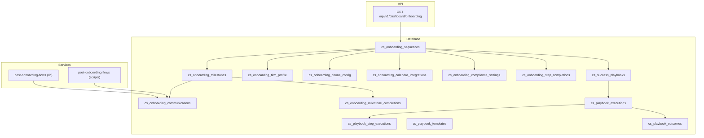
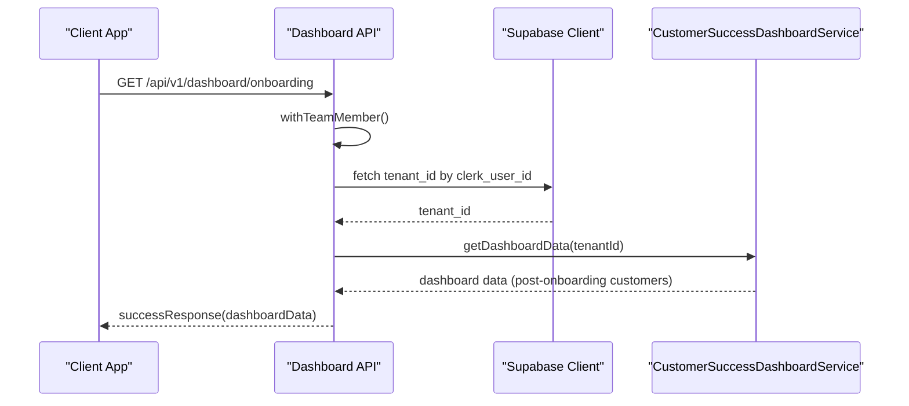
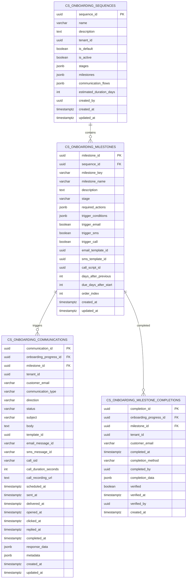
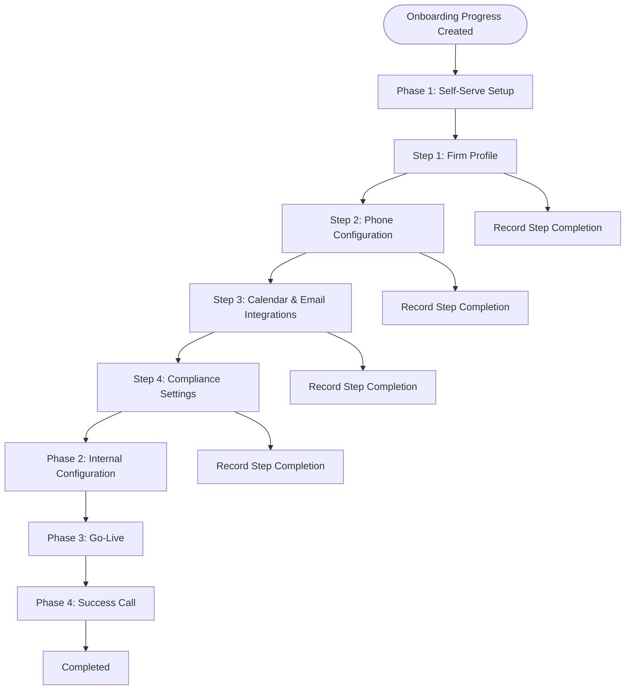
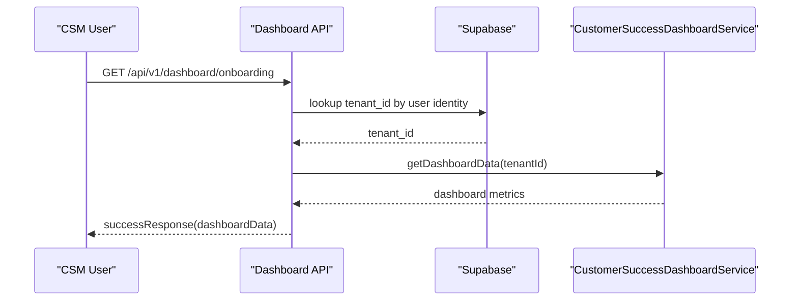
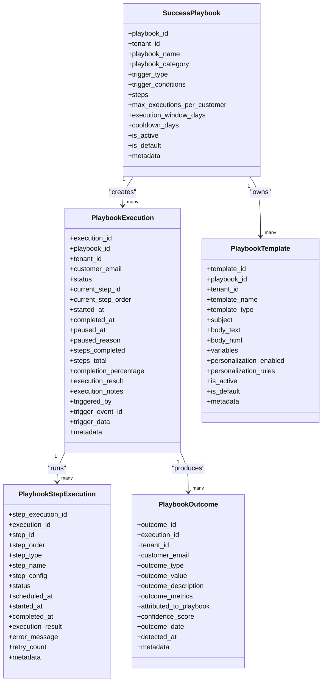
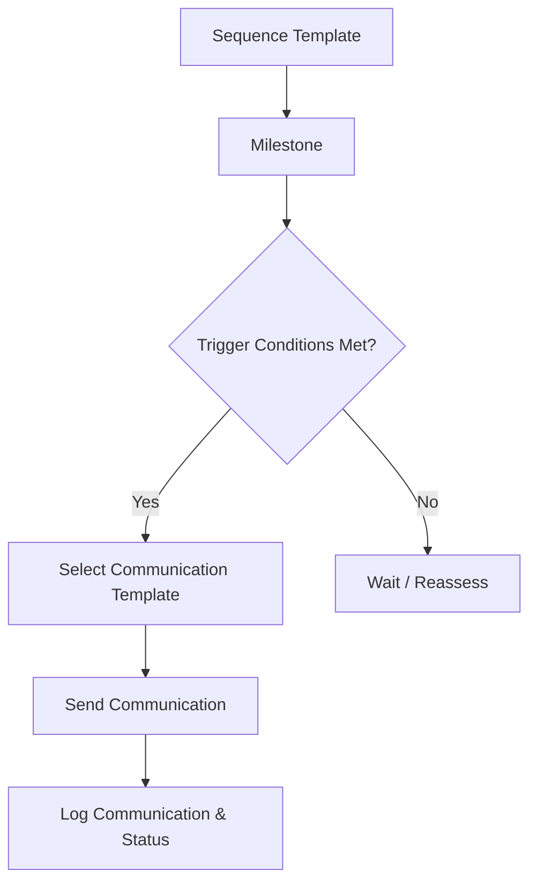
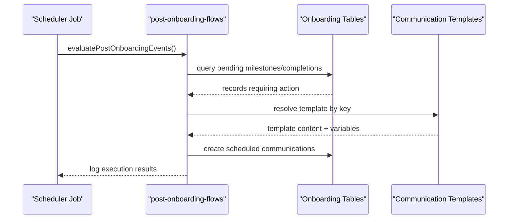
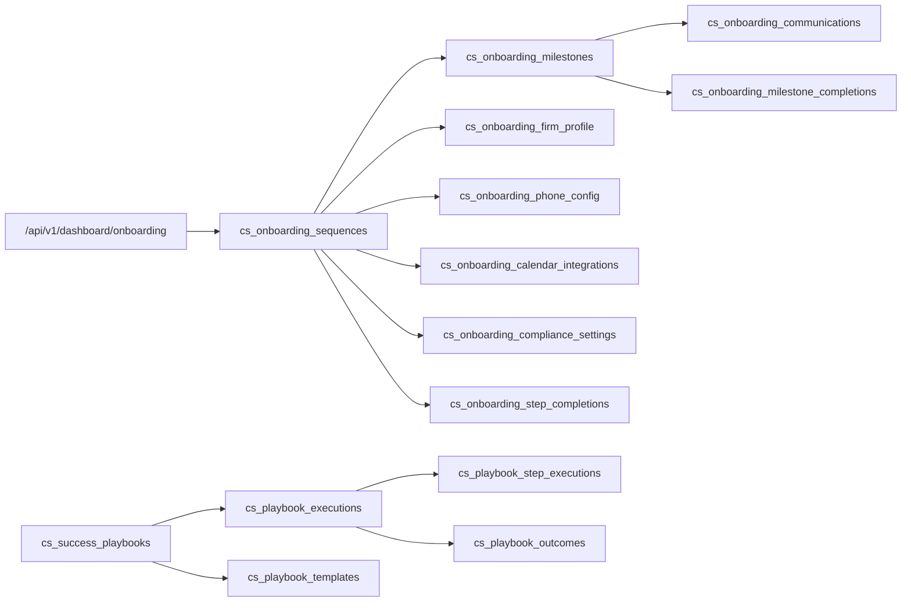

# Onboarding & Workflows

<cite>
**Referenced Files in This Document**
- [009_onboarding_sequences.sql](file://database/migrations/009_onboarding_sequences.sql)
- [011_law_firm_onboarding_flow.sql](file://database/migrations/011_law_firm_onboarding_flow.sql)
- [015_success_playbooks.sql](file://database/migrations/015_success_playbooks.sql)
- [020_add_template_key_to_onboarding_sequences.sql](file://database/migrations/020_add_template_key_to_onboarding_sequences.sql)
- [032_separate_onboarding_from_csm.sql](file://database/migrations/032_separate_onboarding_from_csm.sql)
- [seed_onboarding_sequence_templates.sql](file://database/seed_onboarding_sequence_templates.sql)
- [seed_communication_templates.sql](file://database/seed_communication_templates.sql)
- [route.ts](file://app/api/v1/dashboard/onboarding/route.ts)
- [post-onboarding-flows.ts](file://lib/services/post-onboarding-flows.ts)
- [post-onboarding-flows.ts](file://scripts/scheduled-jobs/post-onboarding-flows.ts)
- [onboarding-communication.ts](file://docs/01-main/SAAS_ADMIN_IMPLEMENTATION/services/onboarding-communication.ts)
- [onboarding-sequences.ts](file://docs/01-main/SAAS_ADMIN_IMPLEMENTATION/services/onboarding-sequences.ts)
</cite>

## Table of Contents
1. [Introduction](#introduction)
2. [Project Structure](#project-structure)
3. [Core Components](#core-components)
4. [Architecture Overview](#architecture-overview)
5. [Detailed Component Analysis](#detailed-component-analysis)
6. [Dependency Analysis](#dependency-analysis)
7. [Performance Considerations](#performance-considerations)
8. [Troubleshooting Guide](#troubleshooting-guide)
9. [Conclusion](#conclusion)
10. [Appendices](#appendices)

## Introduction
This document explains the customer onboarding system and workflow automation for law firms, focusing on:
- Step-by-step onboarding sequences and progress tracking
- Milestone completion workflows and communication automation
- Onboarding template system and sequence execution logic
- Integration with customer success management (CSM) and post-onboarding flows
- Customization guidelines for sequences, steps, and automated notifications
- Examples of progress monitoring and completion analytics
- Troubleshooting and optimization recommendations

The system separates onboarding template design and orchestration from post-onboarding customer success management, enabling scalable automation and tenant-specific customization.

## Project Structure
The onboarding system spans database schemas, API endpoints, services, and documentation. Key areas:
- Database migrations define onboarding sequences, milestones, communications, law firm-specific steps, and success playbooks
- API endpoints expose dashboard data for post-onboarding CSM dashboards
- Services implement scheduled post-onboarding flows and integrate with communication templates
- Documentation outlines onboarding sequence and communication services used by SaaS Admin

**Diagram sources**
- [009_onboarding_sequences.sql](file://database/migrations/009_onboarding_sequences.sql#L8-L26)
- [011_law_firm_onboarding_flow.sql](file://database/migrations/011_law_firm_onboarding_flow.sql#L27-L158)
- [015_success_playbooks.sql](file://database/migrations/015_success_playbooks.sql#L7-L198)
- [route.ts](file://app/api/v1/dashboard/onboarding/route.ts#L23-L51)
- [post-onboarding-flows.ts](file://lib/services/post-onboarding-flows.ts#L1-L200)
- [post-onboarding-flows.ts](file://scripts/scheduled-jobs/post-onboarding-flows.ts#L1-L200)

**Section sources**
- [009_onboarding_sequences.sql](file://database/migrations/009_onboarding_sequences.sql#L1-L255)
- [011_law_firm_onboarding_flow.sql](file://database/migrations/011_law_firm_onboarding_flow.sql#L1-L251)
- [015_success_playbooks.sql](file://database/migrations/015_success_playbooks.sql#L1-L310)
- [route.ts](file://app/api/v1/dashboard/onboarding/route.ts#L1-L60)

## Core Components
- Onboarding sequences: Tenant-aware templates with stages, milestones, and communication flows
- Milestones: Individual goals with trigger conditions and communication triggers
- Law firm onboarding: Phase-based steps (profile, phone config, integrations, compliance) with step completion tracking
- Post-onboarding dashboards: CSM-focused analytics for customers after onboarding
- Success playbooks: Automated, tenant-aware workflows with templated steps and outcomes
- Communication templates: Seeded templates for pre-onboarding, onboarding call, and post-onboarding touchpoints
- Scheduled flows: Background jobs orchestrating post-onboarding automation

**Section sources**
- [009_onboarding_sequences.sql](file://database/migrations/009_onboarding_sequences.sql#L8-L99)
- [011_law_firm_onboarding_flow.sql](file://database/migrations/011_law_firm_onboarding_flow.sql#L26-L158)
- [015_success_playbooks.sql](file://database/migrations/015_success_playbooks.sql#L7-L198)
- [seed_onboarding_sequence_templates.sql](file://database/seed_onboarding_sequence_templates.sql#L19-L81)
- [seed_communication_templates.sql](file://database/seed_communication_templates.sql#L7-L122)
- [route.ts](file://app/api/v1/dashboard/onboarding/route.ts#L23-L51)

## Architecture Overview
The system is composed of:
- Data model: Sequence templates, milestones, law firm steps, communications, completions, and playbook execution
- API: Post-onboarding dashboard endpoint for CSM roles
- Services: Post-onboarding automation via scheduled jobs and runtime services
- Documentation: Onboarding sequence and communication services for SaaS Admin

**Diagram sources**
- [route.ts](file://app/api/v1/dashboard/onboarding/route.ts#L23-L51)

**Section sources**
- [route.ts](file://app/api/v1/dashboard/onboarding/route.ts#L1-L60)

## Detailed Component Analysis

### Onboarding Sequences and Milestones
- Sequences define stages, milestones, and communication flows; templates are tenant-aware and default-enabled
- Milestones capture required actions, trigger conditions, and channel-specific communication triggers
- Sequences link to law firm steps and communicate via seeded templates

**Diagram sources**
- [009_onboarding_sequences.sql](file://database/migrations/009_onboarding_sequences.sql#L8-L163)

**Section sources**
- [009_onboarding_sequences.sql](file://database/migrations/009_onboarding_sequences.sql#L8-L99)
- [009_onboarding_sequences.sql](file://database/migrations/009_onboarding_sequences.sql#L101-L163)

### Law Firm Onboarding Flow
- Phases and steps track firm profile, phone configuration, calendar/email integrations, compliance settings, and step completions
- Progress includes phase tracking, internal status, and completion percentage
- Step completions record method, timestamps, and progress deltas

**Diagram sources**
- [011_law_firm_onboarding_flow.sql](file://database/migrations/011_law_firm_onboarding_flow.sql#L6-L158)

**Section sources**
- [011_law_firm_onboarding_flow.sql](file://database/migrations/011_law_firm_onboarding_flow.sql#L26-L158)

### Post-Onboarding Dashboards and CSM Integration
- The dashboard endpoint serves post-onboarding analytics to CSM roles
- Access is restricted to authorized roles; data is tenant-scoped

**Diagram sources**
- [route.ts](file://app/api/v1/dashboard/onboarding/route.ts#L23-L51)

**Section sources**
- [route.ts](file://app/api/v1/dashboard/onboarding/route.ts#L1-L60)

### Success Playbooks and Automated Workflows
- Playbooks define trigger conditions, steps, and execution windows
- Executions track status, progress, and outcomes
- Templates encapsulate personalized content and variables

**Diagram sources**
- [015_success_playbooks.sql](file://database/migrations/015_success_playbooks.sql#L7-L198)

**Section sources**
- [015_success_playbooks.sql](file://database/migrations/015_success_playbooks.sql#L7-L198)

### Communication Templates and Automation
- Templates are seeded for pre-onboarding, onboarding call, and post-onboarding journeys
- They include variables, trigger types, and timing offsets
- Sequences reference templates to automate emails, SMS, and calls

**Diagram sources**
- [seed_communication_templates.sql](file://database/seed_communication_templates.sql#L7-L122)
- [009_onboarding_sequences.sql](file://database/migrations/009_onboarding_sequences.sql#L66-L99)

**Section sources**
- [seed_onboarding_sequence_templates.sql](file://database/seed_onboarding_sequence_templates.sql#L19-L81)
- [seed_communication_templates.sql](file://database/seed_communication_templates.sql#L7-L122)
- [020_add_template_key_to_onboarding_sequences.sql](file://database/migrations/020_add_template_key_to_onboarding_sequences.sql#L1-L200)

### Post-Onboarding Automation and Scheduled Jobs
- Services and scripts coordinate post-onboarding automation
- They can evaluate completion events, schedule reminders, and trigger follow-ups

**Diagram sources**
- [post-onboarding-flows.ts](file://lib/services/post-onboarding-flows.ts#L1-L200)
- [post-onboarding-flows.ts](file://scripts/scheduled-jobs/post-onboarding-flows.ts#L1-L200)

**Section sources**
- [post-onboarding-flows.ts](file://lib/services/post-onboarding-flows.ts#L1-L200)
- [post-onboarding-flows.ts](file://scripts/scheduled-jobs/post-onboarding-flows.ts#L1-L200)

## Dependency Analysis
- Sequences depend on milestones; milestones depend on communications and completions
- Law firm steps depend on progress tracking and step completion records
- Playbooks depend on templates and execution records
- Dashboard API depends on tenant-scoped data and CSM roles
- Communication automation depends on template keys and trigger configurations

**Diagram sources**
- [009_onboarding_sequences.sql](file://database/migrations/009_onboarding_sequences.sql#L8-L163)
- [011_law_firm_onboarding_flow.sql](file://database/migrations/011_law_firm_onboarding_flow.sql#L26-L158)
- [015_success_playbooks.sql](file://database/migrations/015_success_playbooks.sql#L7-L198)
- [route.ts](file://app/api/v1/dashboard/onboarding/route.ts#L23-L51)

**Section sources**
- [009_onboarding_sequences.sql](file://database/migrations/009_onboarding_sequences.sql#L1-L255)
- [011_law_firm_onboarding_flow.sql](file://database/migrations/011_law_firm_onboarding_flow.sql#L1-L251)
- [015_success_playbooks.sql](file://database/migrations/015_success_playbooks.sql#L1-L310)
- [route.ts](file://app/api/v1/dashboard/onboarding/route.ts#L1-L60)

## Performance Considerations
- Indexes on tenant-scoped fields and status filters improve query performance for dashboards and automation
- JSONB fields enable flexible schema evolution but require careful indexing and query planning
- RLS policies ensure tenant isolation; verify policy coverage for all relevant tables
- Scheduled jobs should batch operations and avoid redundant updates

[No sources needed since this section provides general guidance]

## Troubleshooting Guide
Common issues and resolutions:
- Access denied to dashboard: Ensure the user has the required CSM role and belongs to the correct tenant
- Missing communication logs: Verify template keys, trigger conditions, and milestone completion records
- Law firm step not progressing: Confirm step completion entries and progress percentage updates
- Playbook not executing: Check playbook activation, trigger conditions, and execution window settings
- Post-onboarding automation delays: Inspect scheduled job logs and template availability

**Section sources**
- [route.ts](file://app/api/v1/dashboard/onboarding/route.ts#L26-L30)
- [009_onboarding_sequences.sql](file://database/migrations/009_onboarding_sequences.sql#L165-L177)
- [011_law_firm_onboarding_flow.sql](file://database/migrations/011_law_firm_onboarding_flow.sql#L160-L167)
- [015_success_playbooks.sql](file://database/migrations/015_success_playbooks.sql#L200-L224)

## Conclusion
The onboarding and workflow system provides a robust, tenant-aware framework for law firm onboarding, including structured sequences, milestones, law firm-specific steps, and automated communications. Post-onboarding dashboards and success playbooks enable effective customer success management. The separation of onboarding templates (SaaS Admin) from post-onboarding operations (CS-Support) supports scalability and customization.

[No sources needed since this section summarizes without analyzing specific files]

## Appendices

### Customization Playbook
- Define new sequence templates with stages, milestones, and communication flows
- Add or modify communication templates with variables and trigger rules
- Configure law firm step definitions and completion tracking
- Set up success playbooks with trigger conditions and step configurations
- Use dashboard endpoints to monitor progress and outcomes

**Section sources**
- [seed_onboarding_sequence_templates.sql](file://database/seed_onboarding_sequence_templates.sql#L19-L81)
- [seed_communication_templates.sql](file://database/seed_communication_templates.sql#L7-L122)
- [015_success_playbooks.sql](file://database/migrations/015_success_playbooks.sql#L7-L54)
- [route.ts](file://app/api/v1/dashboard/onboarding/route.ts#L23-L51)