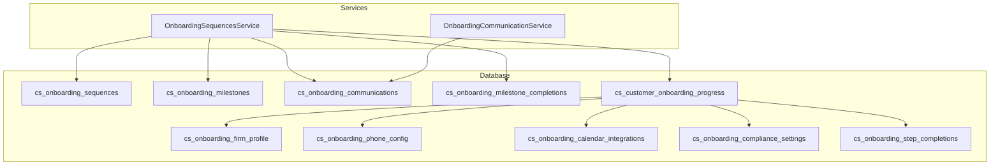
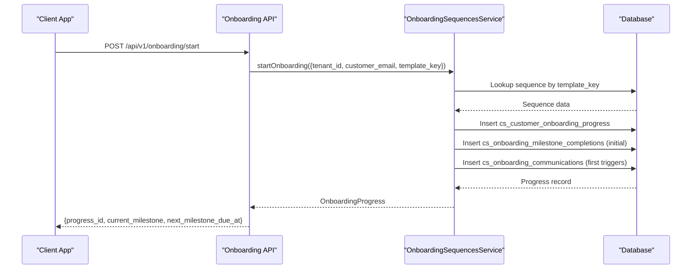
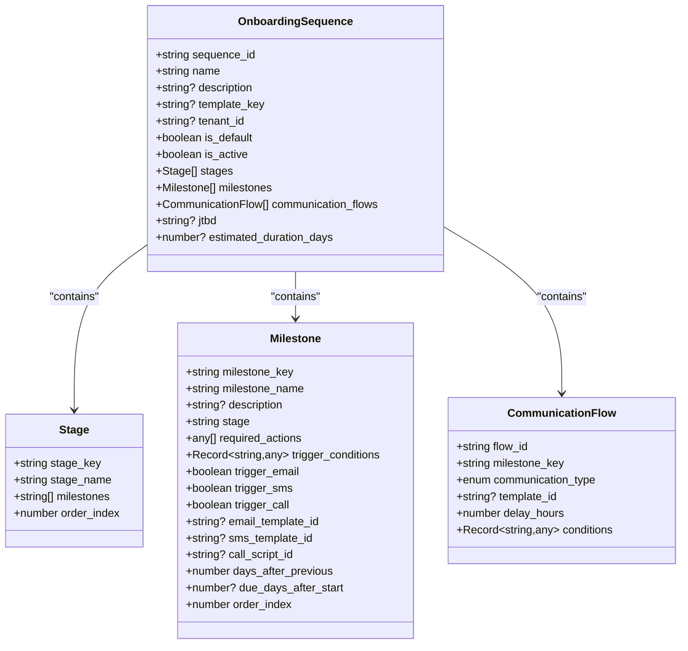
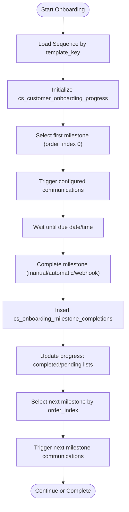
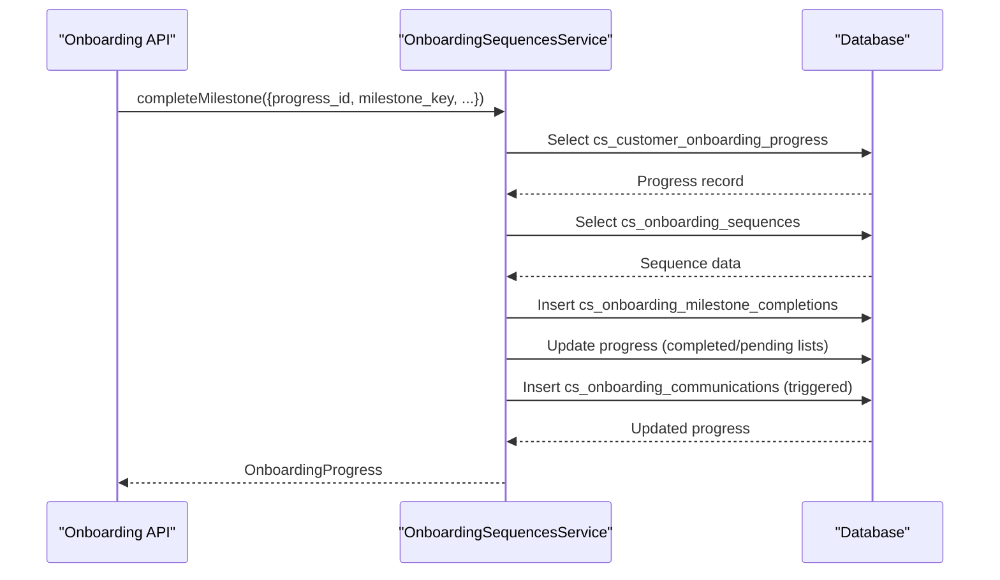
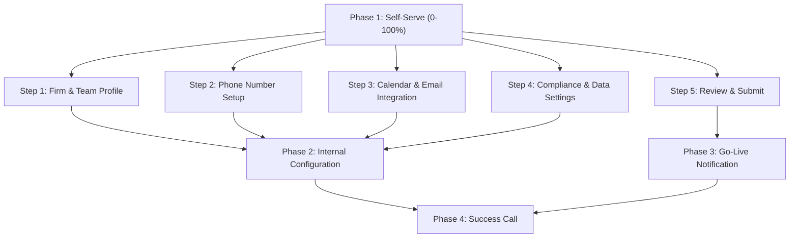
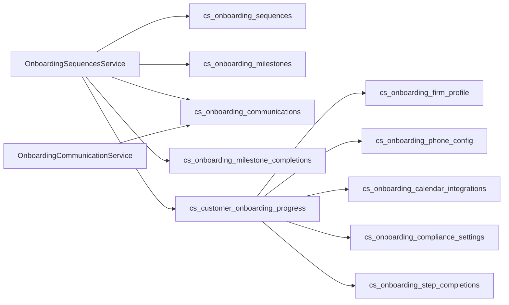

# Onboarding Sequences

<cite>
**Referenced Files in This Document**
- [009_onboarding_sequences.sql](file://database/migrations/009_onboarding_sequences.sql)
- [011_law_firm_onboarding_flow.sql](file://database/migrations/011_law_firm_onboarding_flow.sql)
- [020_add_template_key_to_onboarding_sequences.sql](file://database/migrations/020_add_template_key_to_onboarding_sequences.sql)
- [032_separate_onboarding_from_csm.sql](file://database/migrations/032_separate_onboarding_from_csm.sql)
- [seed_onboarding_sequence_templates.sql](file://database/seed_onboarding_sequence_templates.sql)
- [onboarding-sequences.ts](file://docs/01-main/SAAS_ADMIN_IMPLEMENTATION/services/onboarding-sequences.ts)
- [onboarding-communication.ts](file://docs/01-main/SAAS_ADMIN_IMPLEMENTATION/services/onboarding-communication.ts)
- [LAW_FIRM_ONBOARDING_FLOW.md](file://docs/setup/LAW_FIRM_ONBOARDING_FLOW.md)
- [ONBOARDING_SEQUENCE_TEMPLATES.md](file://docs/setup/ONBOARDING_SEQUENCE_TEMPLATES.md)
- [ONBOARDING_TEMPLATES_DESIGN.md](file://docs/setup/ONBOARDING_TEMPLATES_DESIGN.md)
</cite>

## Table of Contents
1. [Introduction](#introduction)
2. [Project Structure](#project-structure)
3. [Core Components](#core-components)
4. [Architecture Overview](#architecture-overview)
5. [Detailed Component Analysis](#detailed-component-analysis)
6. [Dependency Analysis](#dependency-analysis)
7. [Performance Considerations](#performance-considerations)
8. [Troubleshooting Guide](#troubleshooting-guide)
9. [Conclusion](#conclusion)
10. [Appendices](#appendices)

## Introduction
This document explains the onboarding sequences management system for law firm customers. It covers the template architecture, step-by-step workflow configuration, customization options, execution engine, conditional branching, parallel step processing, integration with customer success modules, CSM assignment workflows, and law firm-specific onboarding flows. It also provides examples for creating custom sequences, configuring step dependencies, managing sequence versions, reusable template systems, validation rules, error handling, performance optimization, monitoring, and troubleshooting.

## Project Structure
The onboarding system spans database migrations, seed data, service-layer TypeScript modules, and supporting documentation. The database schema defines sequence templates, milestones, communications, and law firm-specific progress tracking. The service layer implements sequence orchestration, progress tracking, and communication logging. Documentation outlines templates, design plans, and law firm flow specifics.

**Diagram sources**
- [009_onboarding_sequences.sql](file://database/migrations/009_onboarding_sequences.sql#L8-L163)
- [011_law_firm_onboarding_flow.sql](file://database/migrations/011_law_firm_onboarding_flow.sql#L27-L158)
- [onboarding-sequences.ts](file://docs/01-main/SAAS_ADMIN_IMPLEMENTATION/services/onboarding-sequences.ts#L121-L541)
- [onboarding-communication.ts](file://docs/01-main/SAAS_ADMIN_IMPLEMENTATION/services/onboarding-communication.ts#L92-L291)

**Section sources**
- [009_onboarding_sequences.sql](file://database/migrations/009_onboarding_sequences.sql#L1-L255)
- [011_law_firm_onboarding_flow.sql](file://database/migrations/011_law_firm_onboarding_flow.sql#L1-L251)
- [onboarding-sequences.ts](file://docs/01-main/SAAS_ADMIN_IMPLEMENTATION/services/onboarding-sequences.ts#L1-L542)
- [onboarding-communication.ts](file://docs/01-main/SAAS_ADMIN_IMPLEMENTATION/services/onboarding-communication.ts#L1-L292)

## Core Components
- Sequence templates: JSONB-defined stages, milestones, and communication flows with template_key and JTBD metadata.
- Milestones: Individual goals with trigger conditions, communication channels, and timing rules.
- Progress tracking: Per-customer progress with stage, milestone lists, and completion timestamps.
- Communication logging: Outbound/inbound tracking across email, SMS, and calls.
- Law firm flow: Phase-based steps with internal status transitions and compliance settings.

**Section sources**
- [009_onboarding_sequences.sql](file://database/migrations/009_onboarding_sequences.sql#L8-L99)
- [011_law_firm_onboarding_flow.sql](file://database/migrations/011_law_firm_onboarding_flow.sql#L27-L158)
- [onboarding-sequences.ts](file://docs/01-main/SAAS_ADMIN_IMPLEMENTATION/services/onboarding-sequences.ts#L16-L98)
- [onboarding-communication.ts](file://docs/01-main/SAAS_ADMIN_IMPLEMENTATION/services/onboarding-communication.ts#L16-L45)

## Architecture Overview
The system separates pre-go-live onboarding (handled in SaaS Admin) from post-onboarding tracking (handled in CS-Support). Onboarding sequences are templated and executed via services that manage progress, milestone completion, and communication triggers. Law firm-specific flows are tracked in dedicated tables with internal status and step completion records.

**Diagram sources**
- [onboarding-sequences.ts](file://docs/01-main/SAAS_ADMIN_IMPLEMENTATION/services/onboarding-sequences.ts#L130-L215)
- [009_onboarding_sequences.sql](file://database/migrations/009_onboarding_sequences.sql#L8-L64)

**Section sources**
- [032_separate_onboarding_from_csm.sql](file://database/migrations/032_separate_onboarding_from_csm.sql#L1-L142)
- [onboarding-sequences.ts](file://docs/01-main/SAAS_ADMIN_IMPLEMENTATION/services/onboarding-sequences.ts#L121-L329)

## Detailed Component Analysis

### Sequence Template Architecture
- Template metadata: template_key, name, description, jtbd, estimated_duration_days, tenant scoping.
- Structure fields: stages (ordered groups), milestones (per-stage goals), communication_flows (channel triggers).
- Tenant overrides: tenant-specific templates take precedence over default templates.

**Diagram sources**
- [onboarding-sequences.ts](file://docs/01-main/SAAS_ADMIN_IMPLEMENTATION/services/onboarding-sequences.ts#L16-L65)

**Section sources**
- [020_add_template_key_to_onboarding_sequences.sql](file://database/migrations/020_add_template_key_to_onboarding_sequences.sql#L7-L40)
- [seed_onboarding_sequence_templates.sql](file://database/seed_onboarding_sequence_templates.sql#L19-L81)
- [ONBOARDING_SEQUENCE_TEMPLATES.md](file://docs/setup/ONBOARDING_SEQUENCE_TEMPLATES.md#L18-L37)

### Step-by-Step Workflow Configuration
- Stages define ordered groups of milestones.
- Milestones define required actions, trigger conditions, and communication channel flags.
- Timing rules: days_after_previous and due_days_after_start control scheduling.
- Order index determines sequencing and next-milestone selection.

**Diagram sources**
- [onboarding-sequences.ts](file://docs/01-main/SAAS_ADMIN_IMPLEMENTATION/services/onboarding-sequences.ts#L130-L329)
- [009_onboarding_sequences.sql](file://database/migrations/009_onboarding_sequences.sql#L67-L99)

**Section sources**
- [onboarding-sequences.ts](file://docs/01-main/SAAS_ADMIN_IMPLEMENTATION/services/onboarding-sequences.ts#L223-L329)

### Template Customization Options
- Tenant-specific overrides: templates with tenant_id override defaults.
- Default templates: tenant_id is NULL, available to all tenants.
- JTBD and template_key enable goal-driven selection and reporting.
- Stages, milestones, and communication flows are defined in JSONB for flexibility.

**Section sources**
- [020_add_template_key_to_onboarding_sequences.sql](file://database/migrations/020_add_template_key_to_onboarding_sequences.sql#L7-L40)
- [seed_onboarding_sequence_templates.sql](file://database/seed_onboarding_sequence_templates.sql#L19-L81)
- [ONBOARDING_SEQUENCE_TEMPLATES.md](file://docs/setup/ONBOARDING_SEQUENCE_TEMPLATES.md#L74-L104)

### Sequence Execution Engine
- Start onboarding: validates inputs, resolves sequence, prevents duplicates, initializes progress, and triggers first communications.
- Complete milestone: records completion, updates progress lists, calculates completion percentage, determines current stage, and triggers subsequent communications.

**Diagram sources**
- [onboarding-sequences.ts](file://docs/01-main/SAAS_ADMIN_IMPLEMENTATION/services/onboarding-sequences.ts#L223-L329)

**Section sources**
- [onboarding-sequences.ts](file://docs/01-main/SAAS_ADMIN_IMPLEMENTATION/services/onboarding-sequences.ts#L130-L329)

### Conditional Branching Logic
- Milestone trigger conditions: JSONB conditions allow dynamic branching based on customer data or external events.
- Stage progression: determined by whether all milestones in a stage are completed.
- Communication triggers: email, SMS, and call flags activate based on milestone configuration.

**Section sources**
- [009_onboarding_sequences.sql](file://database/migrations/009_onboarding_sequences.sql#L75-L85)
- [onboarding-sequences.ts](file://docs/01-main/SAAS_ADMIN_IMPLEMENTATION/services/onboarding-sequences.ts#L504-L540)

### Parallel Step Processing
- Milestones can be configured to trigger communications independently (email, SMS, call).
- The execution engine updates progress and triggers subsequent milestones concurrently with communication logging.

**Section sources**
- [onboarding-sequences.ts](file://docs/01-main/SAAS_ADMIN_IMPLEMENTATION/services/onboarding-sequences.ts#L419-L480)
- [onboarding-communication.ts](file://docs/01-main/SAAS_ADMIN_IMPLEMENTATION/services/onboarding-communication.ts#L92-L291)

### Integration with Customer Success Modules and CSM Assignment
- Pre-go-live onboarding is managed in SaaS Admin; post-onboarding tracking resides in CS-Support.
- Transfer triggers internal handoff; CS-Support maintains post-onboarding customer data (health scores, churn risk).
- CSM assignment occurs post-transfer; onboarding templates support CSM workflows.

**Section sources**
- [032_separate_onboarding_from_csm.sql](file://database/migrations/032_separate_onboarding_from_csm.sql#L1-L142)
- [onboarding-sequences.ts](file://docs/01-main/SAAS_ADMIN_IMPLEMENTATION/services/onboarding-sequences.ts#L100-L107)

### Law Firm Specific Onboarding Flows
- Phase 1: Self-serve steps (firm profile, phone setup, calendar/email integration, compliance, review & submit).
- Phase 2: Internal configuration (internal_status transitions).
- Phase 3: Automated go-live notifications.
- Phase 4: Success call with internal status tracking.
- Step completion tracking includes progress percentages before/after.

**Diagram sources**
- [LAW_FIRM_ONBOARDING_FLOW.md](file://docs/setup/LAW_FIRM_ONBOARDING_FLOW.md#L9-L93)
- [011_law_firm_onboarding_flow.sql](file://database/migrations/011_law_firm_onboarding_flow.sql#L6-L24)

**Section sources**
- [LAW_FIRM_ONBOARDING_FLOW.md](file://docs/setup/LAW_FIRM_ONBOARDING_FLOW.md#L1-L271)
- [011_law_firm_onboarding_flow.sql](file://database/migrations/011_law_firm_onboarding_flow.sql#L27-L158)

### Examples: Creating Custom Sequences, Dependencies, and Versions
- Create a custom sequence: define stages, milestones, and communication flows in JSONB; set template_key and JTBD; optionally scope to tenant.
- Configure step dependencies: order_index controls sequencing; days_after_previous and due_days_after_start control timing.
- Manage versions: use template_key for immutable identifiers; tenant-specific overrides supersede defaults; seed data supports idempotent updates.

**Section sources**
- [ONBOARDING_TEMPLATES_DESIGN.md](file://docs/setup/ONBOARDING_TEMPLATES_DESIGN.md#L130-L314)
- [ONBOARDING_SEQUENCE_TEMPLATES.md](file://docs/setup/ONBOARDING_SEQUENCE_TEMPLATES.md#L74-L104)
- [seed_onboarding_sequence_templates.sql](file://database/seed_onboarding_sequence_templates.sql#L75-L81)

### Template System for Reusable Components
- Email/SMS/call templates are linked to milestones via template_id fields.
- Communication logging captures outbound/inbound events with status timestamps and metadata.
- Templates can be reused across sequences and customized per tenant.

**Section sources**
- [onboarding-communication.ts](file://docs/01-main/SAAS_ADMIN_IMPLEMENTATION/services/onboarding-communication.ts#L92-L291)
- [009_onboarding_sequences.sql](file://database/migrations/009_onboarding_sequences.sql#L79-L85)

### Step Validation Rules and Error Handling
- Input validation: startOnboarding requires either sequence_id or template_key but not both; prevents duplicate starts.
- Milestone validation: ensures milestone exists in sequence before completion; prevents duplicate completions.
- Error propagation: throws descriptive errors on failures (lookup, insert, update).

**Section sources**
- [onboarding-sequences.ts](file://docs/01-main/SAAS_ADMIN_IMPLEMENTATION/services/onboarding-sequences.ts#L135-L141)
- [onboarding-sequences.ts](file://docs/01-main/SAAS_ADMIN_IMPLEMENTATION/services/onboarding-sequences.ts#L253-L261)

## Dependency Analysis
- Services depend on Supabase client for database operations.
- Sequence service depends on milestone and communication tables for progress and triggers.
- Law firm flow tables depend on progress table for phase and status tracking.

**Diagram sources**
- [onboarding-sequences.ts](file://docs/01-main/SAAS_ADMIN_IMPLEMENTATION/services/onboarding-sequences.ts#L121-L541)
- [onboarding-communication.ts](file://docs/01-main/SAAS_ADMIN_IMPLEMENTATION/services/onboarding-communication.ts#L92-L291)
- [009_onboarding_sequences.sql](file://database/migrations/009_onboarding_sequences.sql#L8-L163)
- [011_law_firm_onboarding_flow.sql](file://database/migrations/011_law_firm_onboarding_flow.sql#L27-L158)

**Section sources**
- [onboarding-sequences.ts](file://docs/01-main/SAAS_ADMIN_IMPLEMENTATION/services/onboarding-sequences.ts#L121-L541)
- [onboarding-communication.ts](file://docs/01-main/SAAS_ADMIN_IMPLEMENTATION/services/onboarding-communication.ts#L92-L291)

## Performance Considerations
- Indexes: composite and functional indexes on tenant_id, template_key, sequence_id, and scheduling fields improve lookup performance.
- JSONB queries: keep trigger_conditions and metadata compact; avoid deep nesting for frequent lookups.
- Batch operations: schedule communications in batches to reduce DB load.
- Monitoring: track communication status timestamps and milestone completion rates to identify bottlenecks.

[No sources needed since this section provides general guidance]

## Troubleshooting Guide
Common issues and resolutions:
- Duplicate onboarding start: Ensure uniqueness by tenant_id and customer_email; the service prevents duplicate starts.
- Milestone not found: Verify milestone_key exists in sequence.milestones; confirm order_index and stage mapping.
- Communication logging failures: Check database insert errors and console logs; ensure template_id references exist.
- Progress not updating: Confirm milestone completion inserts and progress updates succeed; verify next milestone calculation.

**Section sources**
- [onboarding-sequences.ts](file://docs/01-main/SAAS_ADMIN_IMPLEMENTATION/services/onboarding-sequences.ts#L162-L172)
- [onboarding-sequences.ts](file://docs/01-main/SAAS_ADMIN_IMPLEMENTATION/services/onboarding-sequences.ts#L253-L261)
- [onboarding-communication.ts](file://docs/01-main/SAAS_ADMIN_IMPLEMENTATION/services/onboarding-communication.ts#L487-L495)

## Conclusion
The onboarding sequences system provides a flexible, template-driven framework for orchestrating customer onboarding. With JSONB-based sequence definitions, robust progress tracking, and communication logging, it supports law firm-specific flows and integrates with customer success workflows. The separation of pre- and post-onboarding responsibilities streamlines handoffs and enables scalable, customizable onboarding experiences.

[No sources needed since this section summarizes without analyzing specific files]

## Appendices

### API and Data Model References
- Sequence templates and milestones: [009_onboarding_sequences.sql](file://database/migrations/009_onboarding_sequences.sql#L8-L99)
- Law firm flow tables: [011_law_firm_onboarding_flow.sql](file://database/migrations/011_law_firm_onboarding_flow.sql#L27-L158)
- Template key and JTBD addition: [020_add_template_key_to_onboarding_sequences.sql](file://database/migrations/020_add_template_key_to_onboarding_sequences.sql#L7-L40)
- Post-onboarding tracking table: [032_separate_onboarding_from_csm.sql](file://database/migrations/032_separate_onboarding_from_csm.sql#L48-L71)
- Service implementations: [onboarding-sequences.ts](file://docs/01-main/SAAS_ADMIN_IMPLEMENTATION/services/onboarding-sequences.ts#L121-L541), [onboarding-communication.ts](file://docs/01-main/SAAS_ADMIN_IMPLEMENTATION/services/onboarding-communication.ts#L92-L291)
- Documentation: [LAW_FIRM_ONBOARDING_FLOW.md](file://docs/setup/LAW_FIRM_ONBOARDING_FLOW.md#L1-L271), [ONBOARDING_SEQUENCE_TEMPLATES.md](file://docs/setup/ONBOARDING_SEQUENCE_TEMPLATES.md#L1-L141), [ONBOARDING_TEMPLATES_DESIGN.md](file://docs/setup/ONBOARDING_TEMPLATES_DESIGN.md#L1-L362)