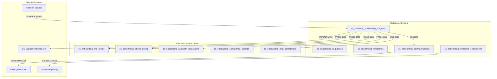
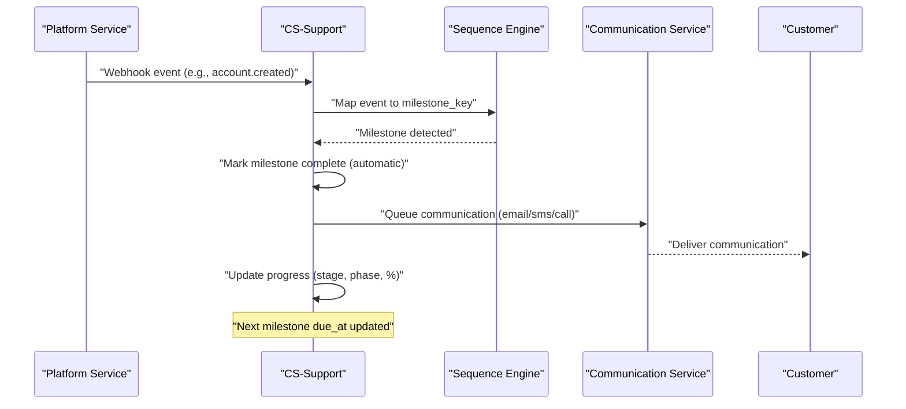
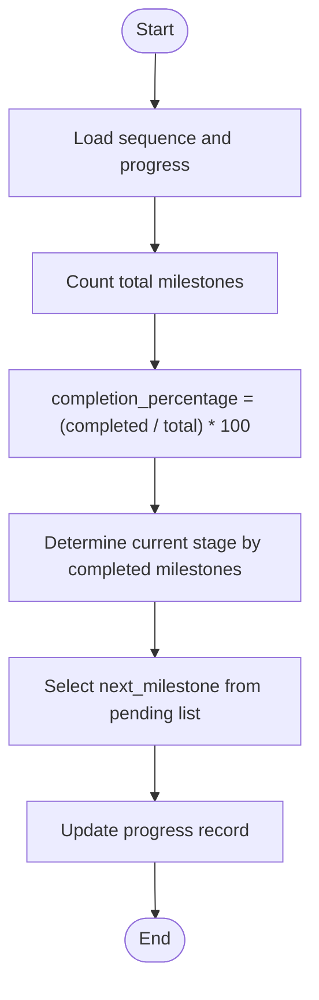
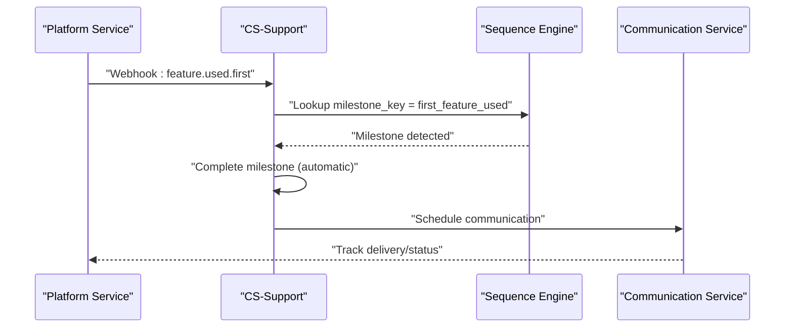
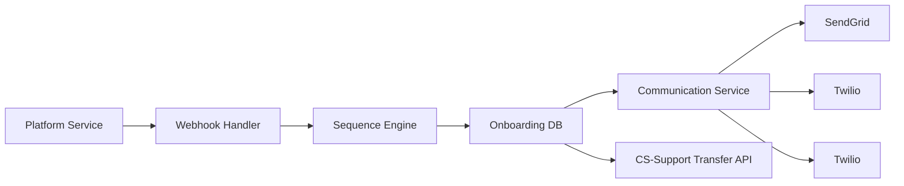

# Progress Tracking & Milestones

<cite>
**Referenced Files in This Document**
- [SAAS_ADMIN_ONBOARDING_IMPLEMENTATION_SUMMARY.md](file://docs/01-main/SAAS_ADMIN_ONBOARDING_IMPLEMENTATION_SUMMARY.md)
- [SAAS_ADMIN_ONBOARDING_SCHEMA.sql](file://database/migrations/SAAS_ADMIN_ONboarding_SCHEMA.sql)
- [009_onboarding_sequences.sql](file://database/migrations/009_onboarding_sequences.sql)
- [013_csat_nps_auto_survey.sql](file://database/migrations/013_csat_nps_auto_survey.sql)
- [LAW_FIRM_ONBOARDING_FLOW.md](file://docs/setup/LAW_FIRM_ONBOARDING_FLOW.md)
- [ONBOARDING_SEQUENCE_MAPPING.md](file://docs/setup/ONBOARDING_SEQUENCE_MAPPING.md)
- [ONBOARDING_TEMPLATES_DESIGN.md](file://docs/setup/ONBOARDING_TEMPLATES_DESIGN.md)
</cite>

## Table of Contents
1. [Introduction](#introduction)
2. [Project Structure](#project-structure)
3. [Core Components](#core-components)
4. [Architecture Overview](#architecture-overview)
5. [Detailed Component Analysis](#detailed-component-analysis)
6. [Dependency Analysis](#dependency-analysis)
7. [Performance Considerations](#performance-considerations)
8. [Troubleshooting Guide](#troubleshooting-guide)
9. [Conclusion](#conclusion)
10. [Appendices](#appendices)

## Introduction
This document explains the onboarding progress tracking and milestone completion system. It covers progress calculation algorithms, milestone achievement criteria, and completion analytics. It also documents the progress monitoring interface, real-time status updates, and automated milestone detection. Additionally, it explains integration touchpoints with customer health scoring, CSAT/NPS survey automation, and success metrics collection. Practical examples show how to configure progress thresholds, set up milestone notifications, and customize completion criteria. Finally, it outlines the progress data model, historical tracking capabilities, reporting features, performance optimization, data retention, and troubleshooting synchronization issues.

## Project Structure
The onboarding system spans database schema, documentation, and integration points:
- Database schema defines tables for progress tracking, sequences, milestones, communications, and completions.
- Documentation describes the law firm onboarding flow, sequence mapping, and templates design.
- Integration points include platform webhooks, Twilio/SendGrid for communications, and CS-Support transfer API.

**Diagram sources**
- [SAAS_ADMIN_ONBOARDING_SCHEMA.sql](file://database/migrations/SAAS_ADMIN_ONBOARDING_SCHEMA.sql#L40-L94)
- [SAAS_ADMIN_ONBOARDING_SCHEMA.sql](file://database/migrations/SAAS_ADMIN_ONBOARDING_SCHEMA.sql#L96-L152)
- [SAAS_ADMIN_ONBOARDING_SCHEMA.sql](file://database/migrations/SAAS_ADMIN_ONBOARDING_SCHEMA.sql#L154-L195)
- [SAAS_ADMIN_ONBOARDING_SCHEMA.sql](file://database/migrations/SAAS_ADMIN_ONBOARDING_SCHEMA.sql#L197-L219)
- [SAAS_ADMIN_ONBOARDING_SCHEMA.sql](file://database/migrations/SAAS_ADMIN_ONBOARDING_SCHEMA.sql#L225-L344)
- [LAW_FIRM_ONBOARDING_FLOW.md](file://docs/setup/LAW_FIRM_ONBOARDING_FLOW.md#L96-L114)

**Section sources**
- [SAAS_ADMIN_ONBOARDING_SCHEMA.sql](file://database/migrations/SAAS_ADMIN_ONBOARDING_SCHEMA.sql#L37-L466)
- [LAW_FIRM_ONBOARDING_FLOW.md](file://docs/setup/LAW_FIRM_ONBOARDING_FLOW.md#L1-L271)

## Core Components
- Progress tracking table: central record of onboarding stage, phase, completion percentage, current milestone, and transfer status.
- Sequence templates: reusable structures defining stages, milestones, and communication flows.
- Milestones: granular goals with required actions, trigger conditions, and timing rules.
- Communications: audit trail of sent/received messages with status and timing.
- Milestone completions: verifiable records of completions with methods and verification.
- Law firm phase tables: specialized storage for firm profile, phone config, calendar integrations, compliance settings, and step completions.

**Section sources**
- [SAAS_ADMIN_ONBOARDING_SCHEMA.sql](file://database/migrations/SAAS_ADMIN_ONBOARDING_SCHEMA.sql#L40-L94)
- [SAAS_ADMIN_ONBOARDING_SCHEMA.sql](file://database/migrations/SAAS_ADMIN_ONBOARDING_SCHEMA.sql#L96-L152)
- [SAAS_ADMIN_ONBOARDING_SCHEMA.sql](file://database/migrations/SAAS_ADMIN_ONBOARDING_SCHEMA.sql#L154-L219)
- [SAAS_ADMIN_ONBOARDING_SCHEMA.sql](file://database/migrations/SAAS_ADMIN_ONBOARDING_SCHEMA.sql#L225-L344)

## Architecture Overview
The system orchestrates progress tracking and milestone completion through:
- Automated detection via platform webhooks.
- Manual verification by Client Success Managers (CSMs).
- API-driven completions from internal services.
- Communication triggers aligned to milestones.
- Transfer to CS-Support upon go-live acceptance.

**Diagram sources**
- [ONBOARDING_SEQUENCE_MAPPING.md](file://docs/setup/ONBOARDING_SEQUENCE_MAPPING.md#L66-L109)
- [ONBOARDING_SEQUENCE_MAPPING.md](file://docs/setup/ONBOARDING_SEQUENCE_MAPPING.md#L110-L128)
- [ONBOARDING_SEQUENCE_MAPPING.md](file://docs/setup/ONBOARDING_SEQUENCE_MAPPING.md#L129-L144)

**Section sources**
- [ONBOARDING_SEQUENCE_MAPPING.md](file://docs/setup/ONBOARDING_SEQUENCE_MAPPING.md#L66-L144)

## Detailed Component Analysis

### Progress Data Model
The progress data model captures:
- Onboarding stage progression and phase tracking.
- Completion percentage computed from milestones completed.
- Current milestone, pending milestones, and due date.
- Sequence linkage and template key.
- Timing markers (started, completed, go-live date).
- Assignment and transfer metadata.

```mermaid
erDiagram
CS_CUSTOMER_ONBOARDING_PROGRESS {
uuid progress_id PK
uuid tenant_id
string customer_email
enum onboarding_stage
string current_step
jsonb steps_completed
int steps_total
decimal completion_percentage
enum onboarding_phase
enum internal_status
decimal onboarding_completion_percentage
uuid sequence_id
string template_key
string current_milestone
string current_milestone_key
string current_milestone_name
jsonb milestones_completed
jsonb milestones_pending
timestamptz next_milestone_due_at
timestamptz started_at
timestamptz completed_at
timestamptz go_live_date
uuid assigned_client_onboarding_manager_id
uuid assigned_csm_id
timestamptz transferred_to_cs_support_at
enum transfer_status
text notes
jsonb metadata
timestamptz created_at
timestamptz updated_at
}
CS_ONBOARDING_SEQUENCES {
uuid sequence_id PK
string name
text description
string template_key UK
uuid tenant_id
boolean is_default
boolean is_active
jsonb stages
jsonb milestones
jsonb communication_flows
text jtbd
int estimated_duration_days
uuid created_by
timestamptz created_at
timestamptz updated_at
}
CS_ONBOARDING_MILESTONES {
uuid milestone_id PK
uuid sequence_id FK
string milestone_key
string milestone_name
text description
string stage
jsonb required_actions
jsonb trigger_conditions
boolean trigger_email
boolean trigger_sms
boolean trigger_call
uuid email_template_id
uuid sms_template_id
uuid call_script_id
int days_after_previous
int due_days_after_start
int order_index
timestamptz created_at
timestamptz updated_at
}
CS_ONBOARDING_COMMUNICATIONS {
uuid communication_id PK
uuid onboarding_progress_id FK
uuid milestone_id
uuid tenant_id
string customer_email
string template_key
enum communication_type
enum direction
enum status
string subject
text body
uuid template_id
string email_message_id
string sms_message_id
string call_sid
int call_duration_seconds
text call_recording_url
timestamptz scheduled_at
timestamptz sent_at
timestamptz delivered_at
timestamptz opened_at
timestamptz clicked_at
timestamptz replied_at
timestamptz completed_at
jsonb response_data
jsonb metadata
timestamptz created_at
timestamptz updated_at
}
CS_ONBOARDING_MILESTONE_COMPLETIONS {
uuid completion_id PK
uuid onboarding_progress_id FK
uuid milestone_id
uuid tenant_id
string customer_email
string milestone_key
string milestone_name
timestamptz completed_at
enum completion_method
uuid completed_by
jsonb completion_data
boolean verified
timestamptz verified_at
uuid verified_by
timestamptz created_at
}
CS_CUSTOMER_ONBOARDING_PROGRESS }o--|| CS_ONBOARDING_SEQUENCES : "sequence_id"
CS_CUSTOMER_ONBOARDING_PROGRESS ||--o{ CS_ONBOARDING_MILESTONE_COMPLETIONS : "has"
CS_CUSTOMER_ONBOARDING_PROGRESS ||--o{ CS_ONBOARDING_COMMUNICATIONS : "triggers"
CS_ONBOARDING_MILESTONES }o--|| CS_ONBOARDING_SEQUENCES : "belongs_to"
CS_ONBOARDING_MILESTONE_COMPLETIONS }o--|| CS_ONBOARDING_MILESTONES : "milestone_id"
```

**Diagram sources**
- [SAAS_ADMIN_ONBOARDING_SCHEMA.sql](file://database/migrations/SAAS_ADMIN_ONBOARDING_SCHEMA.sql#L40-L94)
- [SAAS_ADMIN_ONBOARDING_SCHEMA.sql](file://database/migrations/SAAS_ADMIN_ONBOARDING_SCHEMA.sql#L96-L152)
- [SAAS_ADMIN_ONBOARDING_SCHEMA.sql](file://database/migrations/SAAS_ADMIN_ONBOARDING_SCHEMA.sql#L154-L219)

**Section sources**
- [SAAS_ADMIN_ONBOARDING_SCHEMA.sql](file://database/migrations/SAAS_ADMIN_ONBOARDING_SCHEMA.sql#L40-L219)

### Progress Calculation Algorithms
- Completion percentage: ratio of milestones completed to total milestones in the assigned sequence.
- Stage progression: advance to the highest stage where all prior stage milestones are completed.
- Next milestone determination: first pending milestone in sequence order.
- Law firm phase progression: tracked separately with internal status and go-live date.

**Diagram sources**
- [ONBOARDING_SEQUENCE_MAPPING.md](file://docs/setup/ONBOARDING_SEQUENCE_MAPPING.md#L248-L256)
- [LAW_FIRM_ONBOARDING_FLOW.md](file://docs/setup/LAW_FIRM_ONBOARDING_FLOW.md#L174-L194)

**Section sources**
- [ONBOARDING_SEQUENCE_MAPPING.md](file://docs/setup/ONBOARDING_SEQUENCE_MAPPING.md#L248-L256)
- [LAW_FIRM_ONBOARDING_FLOW.md](file://docs/setup/LAW_FIRM_ONBOARDING_FLOW.md#L174-L194)

### Milestone Achievement Criteria and Automated Detection
- Webhook-based detection: platform events mapped to milestone keys; automatic completion and next communication trigger.
- Manual verification: CSM marks milestone complete via API with optional verification.
- API-driven completions: internal services can complete milestones programmatically.
- Communication triggers: configured per milestone (email, SMS, call) with timing rules.

**Diagram sources**
- [ONBOARDING_SEQUENCE_MAPPING.md](file://docs/setup/ONBOARDING_SEQUENCE_MAPPING.md#L66-L89)
- [ONBOARDING_SEQUENCE_MAPPING.md](file://docs/setup/ONBOARDING_SEQUENCE_MAPPING.md#L110-L128)

**Section sources**
- [ONBOARDING_SEQUENCE_MAPPING.md](file://docs/setup/ONBOARDING_SEQUENCE_MAPPING.md#L66-L128)

### Progress Monitoring Interface and Real-Time Status Updates
- Progress endpoint: retrieve onboarding progress for a customer.
- Internal status updates: managed by authorized CSMs for law firm phases.
- UI components: onboarding dashboard, forms (Steps 1–5), progress tracking UI, internal status management UI.
- Real-time updates: webhook-driven status changes and scheduled communications.

**Section sources**
- [LAW_FIRM_ONBOARDING_FLOW.md](file://docs/setup/LAW_FIRM_ONBOARDING_FLOW.md#L96-L114)
- [SAAS_ADMIN_ONBOARDING_IMPLEMENTATION_SUMMARY.md](file://docs/01-main/SAAS_ADMIN_ONBOARDING_IMPLEMENTATION_SUMMARY.md#L53-L58)

### Completion Analytics and Reporting
- Milestone completions table: tracks completion timestamps, methods, and verification.
- Communications audit: detailed status and timing for all sent/received messages.
- Surveys: CSAT/NPS automation with templates, reminders, and response tracking.
- Reporting: leverage completion and communication tables for funnel analytics, conversion rates, and success metrics.

**Section sources**
- [SAAS_ADMIN_ONBOARDING_SCHEMA.sql](file://database/migrations/SAAS_ADMIN_ONBOARDING_SCHEMA.sql#L197-L219)
- [013_csat_nps_auto_survey.sql](file://database/migrations/013_csat_nps_auto_survey.sql#L40-L157)

### Integration with Customer Health Scoring
- Health scoring: separate system with dedicated schema and functions; can be correlated with onboarding completion for success indicators.
- Timeline alignment: go-live date and completion percentage can inform health score calculations.

**Section sources**
- [009_onboarding_sequences.sql](file://database/migrations/009_onboarding_sequences.sql#L1-L255)

### CSAT/NPS Survey Automation and Success Metrics
- Post-resolution survey automation: configurable rules, templates, delays, reminders, and channels.
- Response tracking: scores, feedback, follow-up requirements, and metadata.
- Success metrics: combine onboarding completion with survey outcomes to measure satisfaction and adoption.

**Section sources**
- [013_csat_nps_auto_survey.sql](file://database/migrations/013_csat_nps_auto_survey.sql#L104-L157)
- [013_csat_nps_auto_survey.sql](file://database/migrations/013_csat_nps_auto_survey.sql#L160-L283)

### Law Firm Onboarding Flow and Phase Tracking
- Five self-serve steps with defined progress ranges.
- Internal configuration, go-live notification, and success call phases.
- Step completion logging with before/after percentages.

**Section sources**
- [LAW_FIRM_ONBOARDING_FLOW.md](file://docs/setup/LAW_FIRM_ONBOARDING_FLOW.md#L9-L62)
- [LAW_FIRM_ONBOARDING_FLOW.md](file://docs/setup/LAW_FIRM_ONBOARDING_FLOW.md#L174-L194)
- [SAAS_ADMIN_ONBOARDING_SCHEMA.sql](file://database/migrations/SAAS_ADMIN_ONBOARDING_SCHEMA.sql#L225-L344)

### Progress Thresholds, Notifications, and Customization
- Progress thresholds: define completion percentage bands for alerts and actions.
- Milestone notifications: configure immediate or delayed communications per milestone.
- Customization: tenant-specific sequences, personalization by customer type, and A/B testing of sequences.

**Section sources**
- [ONBOARDING_SEQUENCE_MAPPING.md](file://docs/setup/ONBOARDING_SEQUENCE_MAPPING.md#L278-L284)
- [ONBOARDING_TEMPLATES_DESIGN.md](file://docs/setup/ONBOARDING_TEMPLATES_DESIGN.md#L175-L227)

## Dependency Analysis
The system exhibits clear separation of concerns:
- Database schema defines the canonical data model.
- Sequence engine maps events to milestones and orchestrates progress.
- Communication service handles outbound messages.
- Law firm phase tables encapsulate specialized data.
- External systems (platform, Twilio, SendGrid) integrate via webhooks and APIs.

**Diagram sources**
- [ONBOARDING_SEQUENCE_MAPPING.md](file://docs/setup/ONBOARDING_SEQUENCE_MAPPING.md#L66-L109)
- [SAAS_ADMIN_ONBOARDING_SCHEMA.sql](file://database/migrations/SAAS_ADMIN_ONBOARDING_SCHEMA.sql#L154-L219)

**Section sources**
- [ONBOARDING_SEQUENCE_MAPPING.md](file://docs/setup/ONBOARDING_SEQUENCE_MAPPING.md#L180-L201)
- [SAAS_ADMIN_ONBOARDING_SCHEMA.sql](file://database/migrations/SAAS_ADMIN_ONBOARDING_SCHEMA.sql#L154-L219)

## Performance Considerations
- Indexes: strategic indexes on tenant, email, stage, phase, and scheduled timestamps reduce query latency.
- Triggers: update timestamps automatically to avoid redundant writes.
- Partitioning: consider partitioning communications and completions by time for large-scale deployments.
- Background jobs: schedule survey reminders and communication batches to offload real-time processing.
- Caching: cache frequently accessed sequence templates and customer progress summaries.

[No sources needed since this section provides general guidance]

## Troubleshooting Guide
Common issues and resolutions:
- Webhook not completing milestone:
  - Verify webhook signature and payload mapping.
  - Confirm milestone exists in the assigned sequence.
  - Check for duplicate or conflicting events.
- Communication not sent:
  - Inspect communication status and channel-specific IDs.
  - Validate template availability and channel credentials.
- Progress not updating:
  - Ensure milestone completion recorded in completions table.
  - Verify stage progression logic and pending milestone list.
- Transfer to CS-Support failing:
  - Confirm required fields and go-live acceptance.
  - Validate transfer API endpoint and authentication.

**Section sources**
- [ONBOARDING_SEQUENCE_MAPPING.md](file://docs/setup/ONBOARDING_SEQUENCE_MAPPING.md#L271-L277)
- [SAAS_ADMIN_ONBOARDING_SCHEMA.sql](file://database/migrations/SAAS_ADMIN_ONBOARDING_SCHEMA.sql#L348-L386)

## Conclusion
The onboarding progress tracking and milestone system provides a robust, extensible framework for guiding customers through structured sequences, automating communications, and capturing meaningful analytics. With clear data models, automated detection, and integration points, teams can monitor progress in real time, trigger timely notifications, and drive successful outcomes. The system’s design supports customization, A/B testing, and future enhancements such as ML-driven optimizations.

[No sources needed since this section summarizes without analyzing specific files]

## Appendices

### Appendix A: Configuration Examples
- Configure progress thresholds:
  - Define completion percentage bands for alerts and actions.
- Set up milestone notifications:
  - Enable email/SMS/call triggers per milestone and set timing rules.
- Customize completion criteria:
  - Add required actions and trigger conditions to milestones.
- Law firm step progress:
  - Map each step to a defined percentage range and log completion with before/after values.

**Section sources**
- [ONBOARDING_SEQUENCE_MAPPING.md](file://docs/setup/ONBOARDING_SEQUENCE_MAPPING.md#L248-L256)
- [LAW_FIRM_ONBOARDING_FLOW.md](file://docs/setup/LAW_FIRM_ONBOARDING_FLOW.md#L174-L194)
- [ONBOARDING_TEMPLATES_DESIGN.md](file://docs/setup/ONBOARDING_TEMPLATES_DESIGN.md#L175-L227)

### Appendix B: Historical Tracking and Reporting
- Historical tracking:
  - Use completions and communications tables to reconstruct timelines.
- Reporting:
  - Aggregate completion rates, stage durations, and channel performance.
  - Correlate onboarding completion with CSAT/NPS outcomes.

**Section sources**
- [SAAS_ADMIN_ONBOARDING_SCHEMA.sql](file://database/migrations/SAAS_ADMIN_ONBOARDING_SCHEMA.sql#L197-L219)
- [013_csat_nps_auto_survey.sql](file://database/migrations/013_csat_nps_auto_survey.sql#L74-L101)

### Appendix C: Data Retention Policies
- Retention guidance:
  - Retain onboarding data for support and compliance needs.
  - Purge sensitive artifacts per policy (e.g., transcripts, screenshots).
- Audit trails:
  - Maintain logs of communications and completions for compliance.

**Section sources**
- [LAW_FIRM_ONBOARDING_FLOW.md](file://docs/setup/LAW_FIRM_ONBOARDING_FLOW.md#L168-L171)