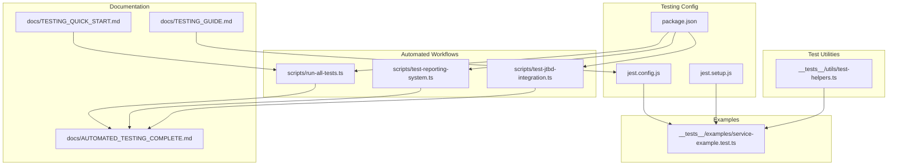
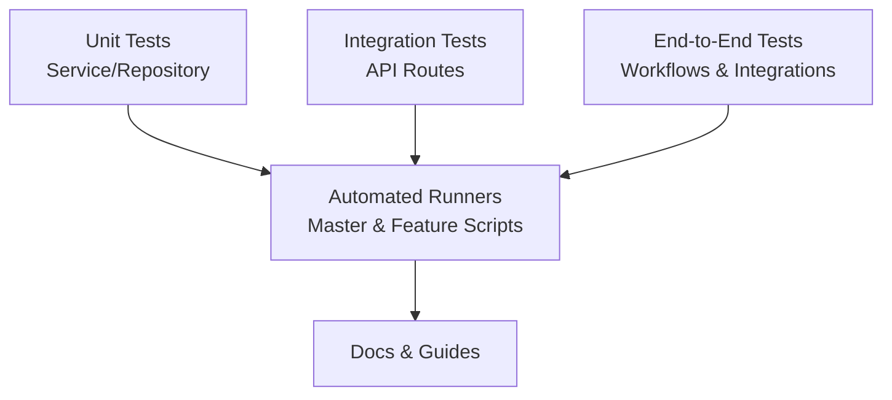
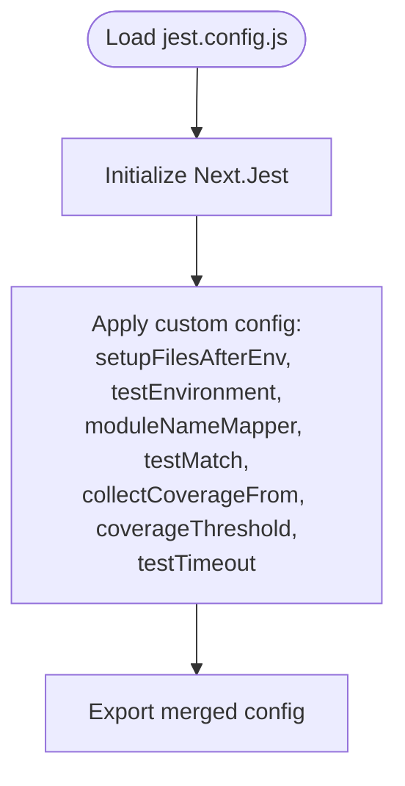
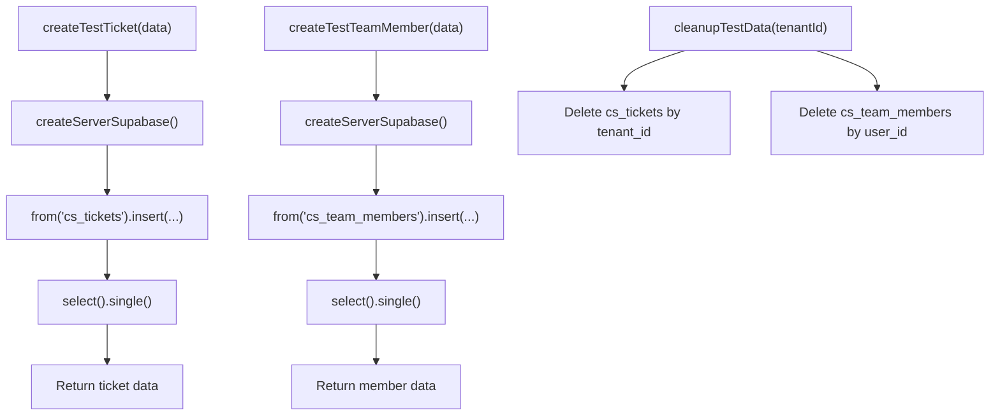
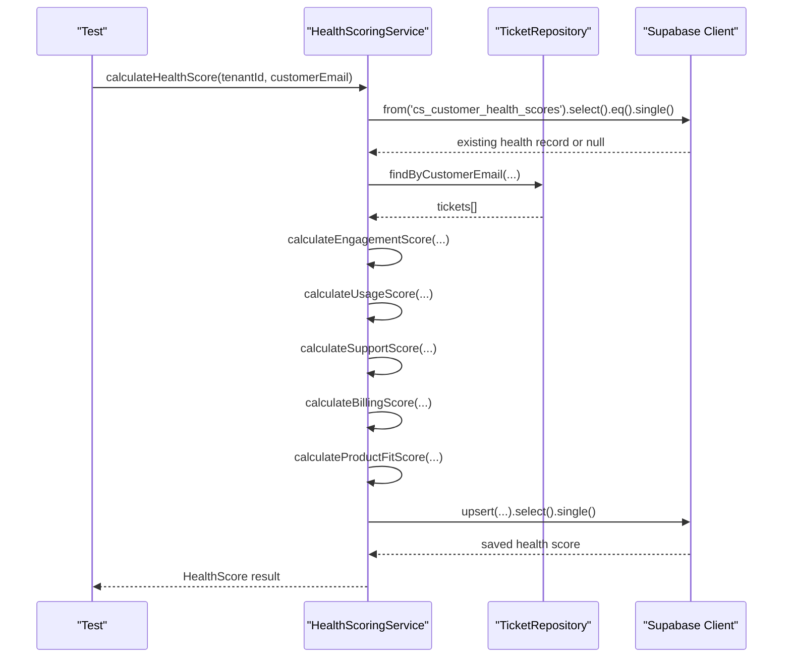
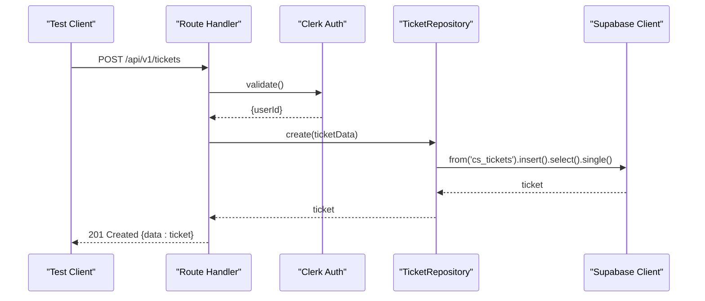
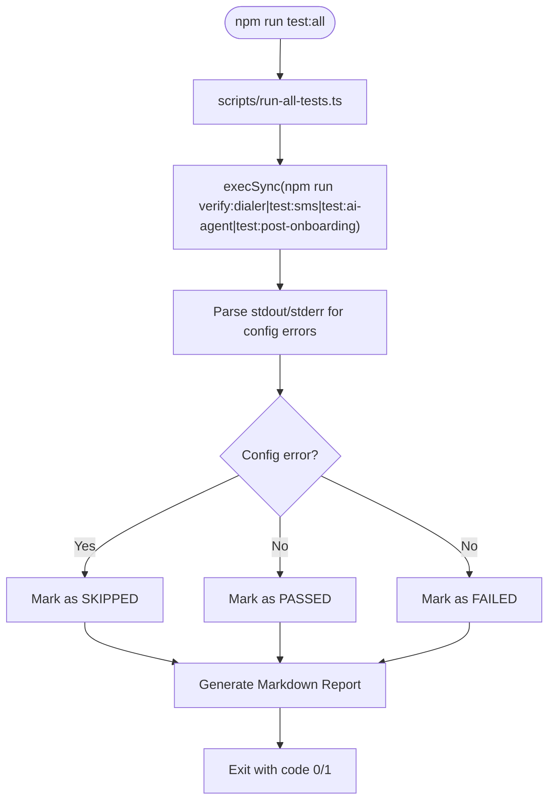
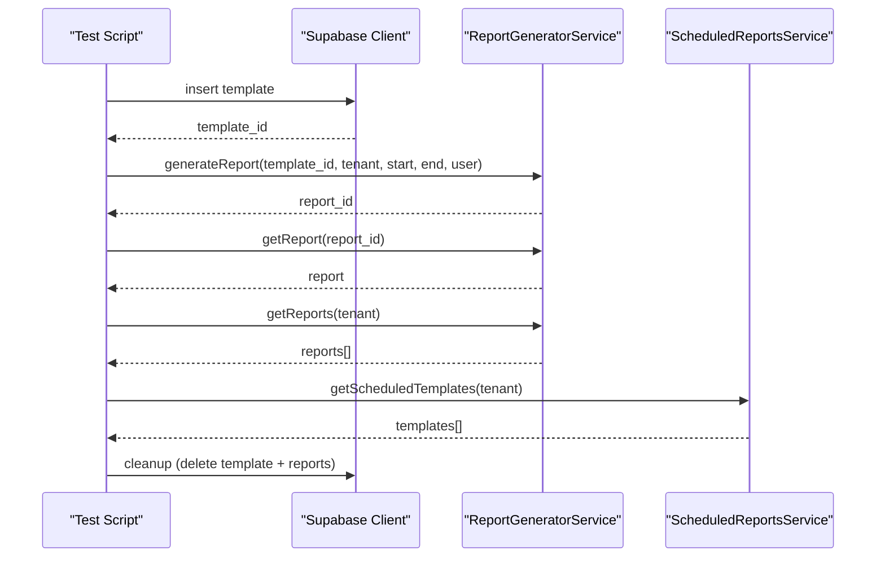
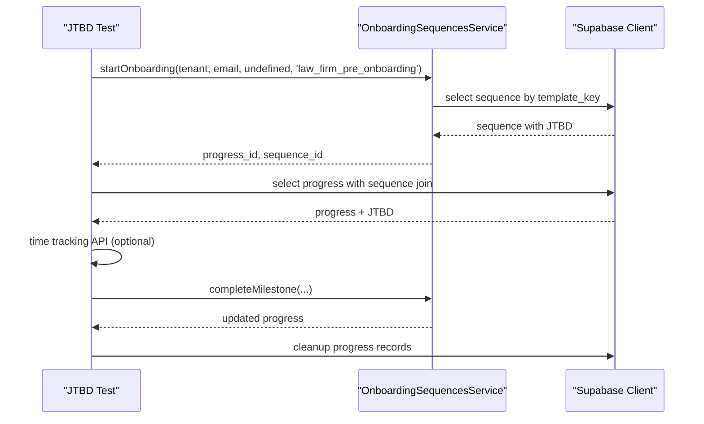
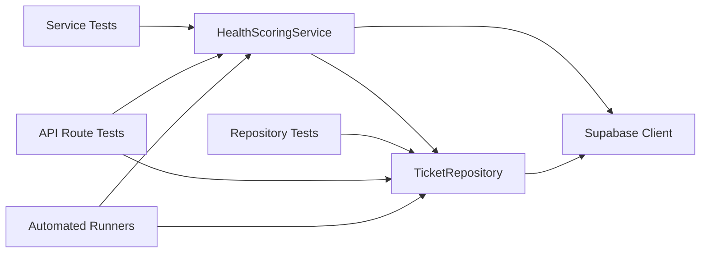

# Testing & Quality Assurance

<cite>
**Referenced Files in This Document**
- [jest.config.js](file://jest.config.js)
- [jest.setup.js](file://jest.setup.js)
- [package.json](file://package.json)
- [__tests__/examples/service-example.test.ts](file://__tests__/examples/service-example.test.ts)
- [__tests__/utils/test-helpers.ts](file://__tests__/utils/test-helpers.ts)
- [lib/services/health-scoring.ts](file://lib/services/health-scoring.ts)
- [lib/repositories/tickets.ts](file://lib/repositories/tickets.ts)
- [lib/db/supabase.ts](file://lib/db/supabase.ts)
- [scripts/run-all-tests.ts](file://scripts/run-all-tests.ts)
- [scripts/test-reporting-system.ts](file://scripts/test-reporting-system.ts)
- [scripts/test-jtbd-integration.ts](file://scripts/test-jtbd-integration.ts)
- [docs/TESTING_GUIDE.md](file://docs/TESTING_GUIDE.md)
- [docs/TESTING_QUICK_START.md](file://docs/TESTING_QUICK_START.md)
- [docs/AUTOMATED_TESTING_COMPLETE.md](file://docs/AUTOMATED_TESTING_COMPLETE.md)
</cite>

## Table of Contents
1. [Introduction](#introduction)
2. [Project Structure](#project-structure)
3. [Core Components](#core-components)
4. [Architecture Overview](#architecture-overview)
5. [Detailed Component Analysis](#detailed-component-analysis)
6. [Dependency Analysis](#dependency-analysis)
7. [Performance Considerations](#performance-considerations)
8. [Troubleshooting Guide](#troubleshooting-guide)
9. [Conclusion](#conclusion)
10. [Appendices](#appendices)

## Introduction
This document defines the comprehensive testing and quality assurance strategy for the CS Support Service. It covers unit and integration testing patterns, API endpoint validation, database interaction testing, and automated workflows. It also documents the Jest configuration, test helpers, and testing utilities, along with guidelines for writing effective tests, mocking strategies, test data management, performance and regression testing, and continuous integration practices.

## Project Structure
The testing ecosystem is organized around:
- Jest configuration and setup for unit and integration tests
- Test helpers for database seeding and cleanup
- Example service tests demonstrating mocking and assertion patterns
- Automated test runners for end-to-end and integration scenarios
- Extensive documentation for manual and automated testing

**Diagram sources**
- [jest.config.js](file://jest.config.js#L1-L40)
- [jest.setup.js](file://jest.setup.js#L1-L33)
- [package.json](file://package.json#L5-L26)
- [__tests__/utils/test-helpers.ts](file://__tests__/utils/test-helpers.ts#L1-L104)
- [__tests__/examples/service-example.test.ts](file://__tests__/examples/service-example.test.ts#L1-L80)
- [scripts/run-all-tests.ts](file://scripts/run-all-tests.ts#L1-L230)
- [scripts/test-reporting-system.ts](file://scripts/test-reporting-system.ts#L1-L264)
- [scripts/test-jtbd-integration.ts](file://scripts/test-jtbd-integration.ts#L1-L501)
- [docs/TESTING_GUIDE.md](file://docs/TESTING_GUIDE.md#L1-L619)
- [docs/TESTING_QUICK_START.md](file://docs/TESTING_QUICK_START.md#L1-L220)
- [docs/AUTOMATED_TESTING_COMPLETE.md](file://docs/AUTOMATED_TESTING_COMPLETE.md#L1-L163)

**Section sources**
- [jest.config.js](file://jest.config.js#L1-L40)
- [jest.setup.js](file://jest.setup.js#L1-L33)
- [package.json](file://package.json#L5-L26)
- [docs/TESTING_GUIDE.md](file://docs/TESTING_GUIDE.md#L1-L619)
- [docs/TESTING_QUICK_START.md](file://docs/TESTING_QUICK_START.md#L1-L220)
- [docs/AUTOMATED_TESTING_COMPLETE.md](file://docs/AUTOMATED_TESTING_COMPLETE.md#L1-L163)

## Core Components
- Jest configuration and environment setup for Next.js and DOM simulation
- Test helpers for database seeding, cleanup, and Supabase mocking
- Example service tests demonstrating mocking Supabase client and service methods
- Automated test runners for integrated workflows and reporting systems
- Documentation for manual and automated testing procedures

Key capabilities:
- Unit tests for services and repositories with isolated mocking
- Integration tests for API endpoints and cross-service flows
- Automated end-to-end workflows for dialer, SMS, AI agents, and onboarding flows
- Comprehensive reporting and CI-friendly exit codes

**Section sources**
- [jest.config.js](file://jest.config.js#L9-L36)
- [jest.setup.js](file://jest.setup.js#L4-L25)
- [__tests__/utils/test-helpers.ts](file://__tests__/utils/test-helpers.ts#L67-L97)
- [__tests__/examples/service-example.test.ts](file://__tests__/examples/service-example.test.ts#L9-L36)
- [scripts/run-all-tests.ts](file://scripts/run-all-tests.ts#L26-L47)
- [docs/TESTING_GUIDE.md](file://docs/TESTING_GUIDE.md#L138-L221)

## Architecture Overview
The testing architecture separates concerns across layers:
- Unit tests validate service logic in isolation using mocked database clients
- Integration tests validate API endpoints and repository interactions
- End-to-end tests orchestrate multi-step workflows and external integrations
- Automated runners aggregate results and produce structured reports

[No sources needed since this diagram shows conceptual workflow, not actual code structure]

## Detailed Component Analysis

### Jest Configuration and Setup
- Configuration loads Next.js-aware Jest and sets up jsdom environment
- Module name mapping resolves aliases consistently
- Coverage thresholds and collection targets are defined
- Setup mocks environment variables and Next.js router for client-side tests

**Diagram sources**
- [jest.config.js](file://jest.config.js#L3-L6)
- [jest.config.js](file://jest.config.js#L9-L36)

**Section sources**
- [jest.config.js](file://jest.config.js#L1-L40)
- [jest.setup.js](file://jest.setup.js#L4-L25)

### Test Helpers and Utilities
- Database helpers create and clean test data for tickets and team members
- Supabase client mock provides a fluent chain for select/update/delete operations
- Auth mock provides test user/session identifiers

**Diagram sources**
- [__tests__/utils/test-helpers.ts](file://__tests__/utils/test-helpers.ts#L11-L30)
- [__tests__/utils/test-helpers.ts](file://__tests__/utils/test-helpers.ts#L35-L51)
- [__tests__/utils/test-helpers.ts](file://__tests__/utils/test-helpers.ts#L56-L62)

**Section sources**
- [__tests__/utils/test-helpers.ts](file://__tests__/utils/test-helpers.ts#L1-L104)

### Example Service Test Pattern
- Demonstrates mocking the Supabase client and service methods
- Validates health score calculation boundaries and error handling
- Uses spy-based mocking for service method stubs

**Diagram sources**
- [__tests__/examples/service-example.test.ts](file://__tests__/examples/service-example.test.ts#L23-L78)
- [lib/services/health-scoring.ts](file://lib/services/health-scoring.ts#L56-L188)

**Section sources**
- [__tests__/examples/service-example.test.ts](file://__tests__/examples/service-example.test.ts#L1-L80)
- [lib/services/health-scoring.ts](file://lib/services/health-scoring.ts#L52-L188)

### API Endpoint Testing Patterns
- Mock authentication and repository dependencies
- Construct NextRequest instances for route handlers
- Assert response status and payload structure

**Diagram sources**
- [__tests__/examples/service-example.test.ts](file://__tests__/examples/service-example.test.ts#L238-L261)
- [lib/repositories/tickets.ts](file://lib/repositories/tickets.ts#L76-L86)

**Section sources**
- [__tests__/examples/service-example.test.ts](file://__tests__/examples/service-example.test.ts#L224-L261)
- [lib/repositories/tickets.ts](file://lib/repositories/tickets.ts#L1-L247)

### Automated Testing Workflows
- Master runner aggregates multiple functional tests, captures durations, and writes markdown reports
- Feature-specific runners validate reporting system, JTBD integration, and dialer verification
- CI-friendly exit codes distinguish between failures and configuration skips

**Diagram sources**
- [scripts/run-all-tests.ts](file://scripts/run-all-tests.ts#L49-L119)
- [scripts/run-all-tests.ts](file://scripts/run-all-tests.ts#L161-L179)

**Section sources**
- [scripts/run-all-tests.ts](file://scripts/run-all-tests.ts#L1-L230)
- [package.json](file://package.json#L15-L25)
- [docs/AUTOMATED_TESTING_COMPLETE.md](file://docs/AUTOMATED_TESTING_COMPLETE.md#L1-L163)

### Reporting System Integration Tests
- Creates a report template, generates a report, retrieves it, lists reports, and validates scheduled templates
- Cleans up test data afterward

**Diagram sources**
- [scripts/test-reporting-system.ts](file://scripts/test-reporting-system.ts#L19-L61)
- [scripts/test-reporting-system.ts](file://scripts/test-reporting-system.ts#L63-L100)
- [scripts/test-reporting-system.ts](file://scripts/test-reporting-system.ts#L102-L124)
- [scripts/test-reporting-system.ts](file://scripts/test-reporting-system.ts#L126-L144)
- [scripts/test-reporting-system.ts](file://scripts/test-reporting-system.ts#L146-L163)

**Section sources**
- [scripts/test-reporting-system.ts](file://scripts/test-reporting-system.ts#L1-L264)

### JTBD Integration End-to-End Tests
- Validates onboarding start with template_key, progress retrieval with JTBD, time tracking enrichment, milestone completion, default sequence fallback, and template_key lookup
- Handles optional external service availability gracefully

**Diagram sources**
- [scripts/test-jtbd-integration.ts](file://scripts/test-jtbd-integration.ts#L34-L83)
- [scripts/test-jtbd-integration.ts](file://scripts/test-jtbd-integration.ts#L88-L135)
- [scripts/test-jtbd-integration.ts](file://scripts/test-jtbd-integration.ts#L140-L210)
- [scripts/test-jtbd-integration.ts](file://scripts/test-jtbd-integration.ts#L215-L266)
- [scripts/test-jtbd-integration.ts](file://scripts/test-jtbd-integration.ts#L271-L309)
- [scripts/test-jtbd-integration.ts](file://scripts/test-jtbd-integration.ts#L314-L343)

**Section sources**
- [scripts/test-jtbd-integration.ts](file://scripts/test-jtbd-integration.ts#L1-L501)

## Dependency Analysis
- Services depend on repositories and Supabase client abstractions
- Repositories encapsulate database queries and are central to integration tests
- Automated runners depend on package scripts and environment variables
- Documentation guides complement the codebase with practical examples

**Diagram sources**
- [lib/services/health-scoring.ts](file://lib/services/health-scoring.ts#L14-L17)
- [lib/repositories/tickets.ts](file://lib/repositories/tickets.ts#L1-L2)
- [lib/db/supabase.ts](file://lib/db/supabase.ts#L1-L29)
- [__tests__/examples/service-example.test.ts](file://__tests__/examples/service-example.test.ts#L6-L12)

**Section sources**
- [lib/services/health-scoring.ts](file://lib/services/health-scoring.ts#L1-L669)
- [lib/repositories/tickets.ts](file://lib/repositories/tickets.ts#L1-L247)
- [lib/db/supabase.ts](file://lib/db/supabase.ts#L1-L29)
- [__tests__/examples/service-example.test.ts](file://__tests__/examples/service-example.test.ts#L1-L80)

## Performance Considerations
- Keep unit tests fast by mocking external dependencies and avoiding real network calls
- Use minimal test data and deterministic fixtures
- Parallelize independent tests where possible
- Prefer lightweight assertions and avoid heavy computations in tests
- Use coverage thresholds to maintain quality without sacrificing speed

[No sources needed since this section provides general guidance]

## Troubleshooting Guide
Common issues and resolutions:
- Missing environment variables cause tests to skip rather than fail
- Database connectivity problems during integration tests
- Authentication failures due to missing tokens or invalid headers
- External service unavailability (e.g., Twilio, Internal Ops) leading to warnings

Guidelines:
- Review the automated test report for detailed summaries and error messages
- Ensure required environment variables are present before running tests
- Validate database migrations and seed data for integration tests
- Use manual testing scripts for quick smoke checks

**Section sources**
- [scripts/run-all-tests.ts](file://scripts/run-all-tests.ts#L78-L104)
- [docs/AUTOMATED_TESTING_COMPLETE.md](file://docs/AUTOMATED_TESTING_COMPLETE.md#L104-L118)
- [docs/TESTING_QUICK_START.md](file://docs/TESTING_QUICK_START.md#L166-L198)

## Conclusion
The CS Support Service employs a pragmatic testing strategy with strong unit and integration coverage, robust automated workflows, and comprehensive documentation. The Jest configuration, test helpers, and example patterns provide a solid foundation for maintaining quality as the system evolves. Automated runners and CI-friendly exit codes streamline integration into development pipelines, while detailed reporting ensures visibility into test outcomes.

[No sources needed since this section summarizes without analyzing specific files]

## Appendices

### Writing Effective Tests
- Use descriptive test names and focus on one behavior per test
- Mock external dependencies to isolate units under test
- Maintain test independence and clean up state after each test
- Prefer fixtures and factories for consistent data setup

**Section sources**
- [docs/TESTING_GUIDE.md](file://docs/TESTING_GUIDE.md#L547-L585)

### Mocking Strategies
- Mock Supabase client methods to simulate database responses
- Spy on service methods to verify interactions without executing logic
- Use environment variable mocks for router and public keys

**Section sources**
- [__tests__/utils/test-helpers.ts](file://__tests__/utils/test-helpers.ts#L67-L97)
- [__tests__/examples/service-example.test.ts](file://__tests__/examples/service-example.test.ts#L9-L36)
- [jest.setup.js](file://jest.setup.js#L9-L25)

### Test Data Management
- Use helpers to create and clean test data
- Employ unique identifiers and tenant scoping to prevent collisions
- Clean up test data after each run to keep environments pristine

**Section sources**
- [__tests__/utils/test-helpers.ts](file://__tests__/utils/test-helpers.ts#L11-L62)

### Continuous Integration Testing
- Use the master runner to aggregate results and produce reports
- Configure environment variables for integrations requiring secrets
- Treat configuration-missing skips as non-failures in CI

**Section sources**
- [scripts/run-all-tests.ts](file://scripts/run-all-tests.ts#L160-L179)
- [docs/AUTOMATED_TESTING_COMPLETE.md](file://docs/AUTOMATED_TESTING_COMPLETE.md#L48-L66)

### Test Coverage Requirements
- Maintain global thresholds and service/repository coverage goals
- Generate and review coverage reports regularly
- Focus on high-priority areas first (authentication, billing, analytics)

**Section sources**
- [jest.config.js](file://jest.config.js#L27-L34)
- [docs/TESTING_GUIDE.md](file://docs/TESTING_GUIDE.md#L525-L544)